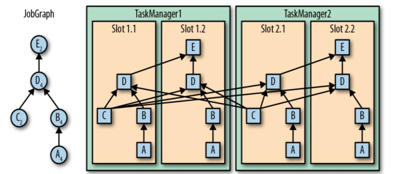
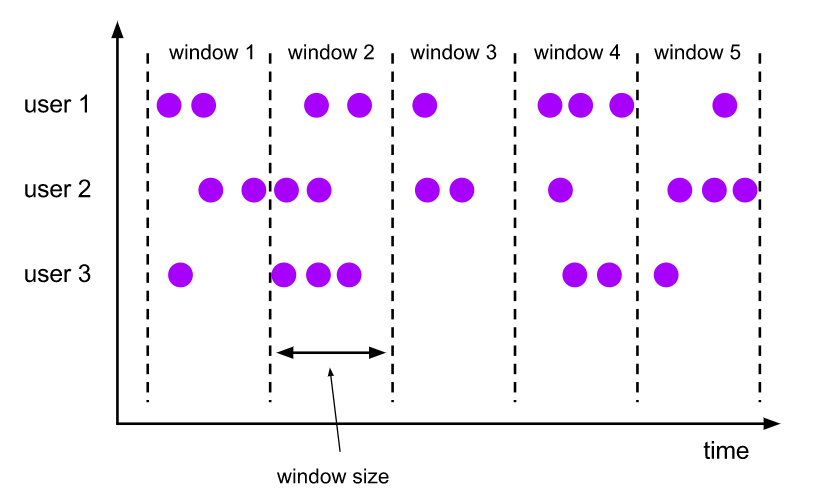
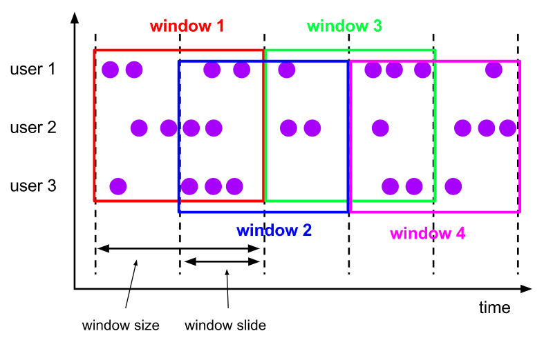
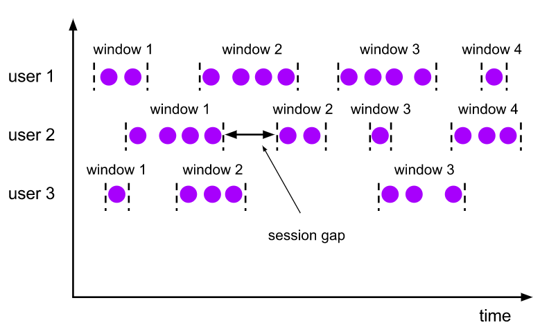

# 第一部分——Flink初识

## 一、Flink概述

Flink 涉及的知识点如下图所示，本文将逐一讲解：


### 1.1 Flink是什么

官网 flink.apache.org

Flink 是一个分布式的流处理框架，它能够对有界和无界的数据流进行高效的处理。Flink 的核心是流处理，当然它也能支持批处理，Flink 将批处理看成是流处理的一种特殊情况，即数据流是有明确界限的。这和 Spark Streaming 的思想是完全相反的，Spark Streaming 的核心是批处理，它将流处理看成是批处理的一种特殊情况， 即把数据流进行极小粒度的拆分，拆分为多个微批处理。Flink能够运行在常规集群上，在内存上执行，可水平扩展。

无界流数据：数据有开始但没有结尾，不间断，此数据流需要不停处理，可理解为此模式使用实时计算。

有界数据流：有开始有结束，可以等所有的数据一起批处理，可理解为此模式使用离线批处理。

Flink 有界数据流和无界数据流：


Spark Streaming 数据流的拆分：


### 1.2 Flink架构

批处理的特点是有界、持久、大量，批处理非常适合需要访问全套记录才能完成的计算工作，一般用于离线统计。流处理的特点是无界、实时，流处理方式无需针对整个数据集执行操作，而是对通过系统传输的每个数据项执行操作，一般用于实时统计。

在 Spark 生态体系中，对于批处理和流处理采用了不同的技术框架，批处理由 SparkSQL 实现，流处理由 Spark Streaming  实现，这也是大部分框架采用的策略，使用独立的处理器实现批处理和流处理，而 Flink 可以同时实现批处理和流处理。

Flink 是如何同时实现批处理与流处理的呢？答案是，Flink 将批处理（即处理有限的静态数据）视作一种特殊的流处理。

Flink 的核心计算架构是下图中的 Flink Runtime 执行引擎，它是一个分布式系统，能够接受数据流程序并在一台或多台机器上以容错方式执行。

Flink Runtime 执行引擎可以作为 YARN（Yet Another Resource Negotiator）的应用程序在集群上运行，也可以在 Mesos 集群上运行，还可以在单机上运行（这对于调试 Flink 应用程序来说非常有用）。

Flink 采用分层的架构设计，从而保证各层在功能和职责上的清晰。如下图所示，由上而下分别是 API & Libraries 层、Runtime 核心层以及物理部署层：


上图为 Flink 技术栈的核心组成部分，值得一提的是，**Flink 分别提供了面向流式处理的接口（DataStream API）和面向批处理的接口（DataSet API）**。因此，Flink 既可以完成流处理，也可以完成批处理。Flink 支持的拓展库涉及机器学习（FlinkML）、复杂事件处理（CEP）、以及图计算（Gelly），还有分别针对流处理和批处理的 Table API。

能被 Flink Runtime 执行引擎接受的程序很强大，但是这样的程序有着冗长的代码，编写起来也很费力，基于这个原因，Flink 提供了封装在  Runtime 执行引擎之上的 API，以帮助用户方便地生成流式计算程序。Flink 提供了用于流处理的 DataStream API  和用于批处理的 DataSet API。值得注意的是，尽管 Flink Runtime 执行引擎是基于流处理的，但是 DataSet API  先于 DataStream API 被开发出来，这是因为工业界对无限流处理的需求在 Flink 诞生之初并不大。

**DataStream API 可以流畅地分析无限数据流，并且可以用 Java 或者 Scala 等来实现**。开发人员需要基于一个叫 DataStream 的数据结构来开发，这个数据结构用于表示永不停止的分布式数据流。

Flink 的分布式特点体现在它能够在成百上千台机器上运行，它将大型的计算任务分成许多小的部分，每个机器执行一部分。Flink  能够自动地确保发生机器故障或者其他错误时计算能够持续进行，或者在修复 bug  或进行版本升级后有计划地再执行一次。这种能力使得开发人员不需要担心运行失败。Flink  本质上使用容错性数据流，这使得开发人员可以分析持续生成且永远不结束的数据（即流处理）。

#### 1. API & Libraries 层

这一层主要提供了编程 API 和 顶层类库：

+ 编程 API : 用于进行流处理的 DataStream API 和用于进行批处理的 DataSet API；
+ 顶层类库：包括用于复杂事件处理的 CEP 库；用于结构化数据查询的 SQL & Table 库，以及基于批处理的机器学习库 FlinkML 和 图形处理库 Gelly。

#### 2. Runtime 核心层

这一层是 Flink 分布式计算框架的核心实现层，包括作业转换，任务调度，资源分配，任务执行等功能，基于这一层的实现，可以在流式引擎下同时运行流处理程序和批处理程序。

#### 3. 物理部署层

Flink 的物理部署层，用于支持在不同平台上部署运行 Flink 应用。

### 1.3 Flink 分层 API

在前一节介绍的 API & Libraries 这一层，Flink 又进行了更为具体的划分。具体如下：


按照如上的层次结构，API 的一致性由下至上依次递增，接口的表现能力由下至上依次递减，各层的核心功能如下：

#### 1. SQL & Table API

SQL & Table API 同时适用于批处理和流处理，这意味着你可以对有界数据流和无界数据流以相同的语义进行查询，并产生相同的结果。除了基本查询外， 它还支持自定义的标量函数，聚合函数以及表值函数，可以满足多样化的查询需求。 

#### 2. DataStream & DataSet API

DataStream &  DataSet API 是 Flink 数据处理的核心 API，支持使用 Java 语言或 Scala 语言进行调用，提供了数据读取，数据转换和数据输出等一系列常用操作的封装。当前企业开发中，此层API用的最多。

#### 3. Stateful Stream Processing

Stateful Stream Processing 是最低级别的抽象，它通过 Process Function 函数内嵌到 DataStream API 中。 Process Function 是 Flink 提供的最底层 API，具有最大的灵活性，允许开发者对于时间和状态进行细粒度的控制。

### 1.4 Flink 集群架构

#### 1. 核心组件

按照上面的介绍，Flink 核心架构的第二层是 Runtime 层， 该层采用标准的 Master - Slave 结构， 其中，Master 部分又包含了三个核心组件：Dispatcher、ResourceManager 和 JobManager，而 Slave 则主要是 TaskManager 进程。它们的功能分别如下：

- **JobManagers** (也称为 *masters*) ：JobManagers 接收由 Dispatcher 传递过来的执行程序，该执行程序包含了作业图 (JobGraph)，逻辑数据流图 (logical dataflow graph) 及其所有的 classes 文件以及第三方类库 (libraries) 等等 。紧接着 JobManagers 会将 JobGraph 转换为执行图 (ExecutionGraph)，然后向 ResourceManager 申请资源来执行该任务，一旦申请到资源，就将执行图分发给对应的 TaskManagers 。因此每个作业 (Job) 至少有一个 JobManager；高可用部署下可以有多个 JobManagers，其中一个作为 *leader*，其余的则处于 *standby* 状态。
- **TaskManagers** (也称为 *workers*) : TaskManagers 负责实际的子任务 (subtasks) 的执行，每个 TaskManagers 都拥有一定数量的 slots。Slot 是一组固定大小的资源的合集 (如计算能力，存储空间)。TaskManagers 启动后，会将其所拥有的 slots 注册到 ResourceManager 上，由 ResourceManager 进行统一管理。
- **Dispatcher**：负责接收客户端提交的执行程序，并传递给 JobManager 。除此之外，它还提供了一个 WEB UI 界面，用于监控作业的执行情况。
- **ResourceManager** ：负责管理 slots 并协调集群资源。ResourceManager 接收来自 JobManager 的资源请求，并将存在空闲 slots 的 TaskManagers 分配给 JobManager 执行任务。Flink 基于不同的部署平台，如 YARN , Mesos，K8s 等提供了不同的资源管理器，当 TaskManagers 没有足够的 slots 来执行任务时，它会向第三方平台发起会话来请求额外的资源。


#### 2. Task & SubTask

上面我们提到：TaskManagers 实际执行的是 SubTask，而不是 Task，这里解释一下两者的区别：

在执行分布式计算时，Flink 将可以链接的操作 (operators) 链接到一起，这就是 Task。之所以这样做， 是为了减少线程间切换和缓冲而导致的开销，在降低延迟的同时可以提高整体的吞吐量。 但不是所有的 operator 都可以被链接，如下 keyBy 等操作会导致网络 shuffle 和重分区，因此其就不能被链接，只能被单独作为一个 Task。  简单来说，一个 Task 就是一个可以链接的最小的操作链 (Operator Chains) 。如下图，source 和 map 算子被链接到一块，因此整个作业就只有三个 Task：


解释完 Task ，我们在解释一下什么是 SubTask，其准确的翻译是： *A subtask is one parallel slice of a task*，即一个 Task 可以按照其并行度拆分为多个 SubTask。如上图，source & map 具有两个并行度，KeyBy 具有两个并行度，Sink 具有一个并行度，因此整个虽然只有 3 个 Task，但是却有 5 个 SubTask。Jobmanager 负责定义和拆分这些 SubTask，并将其交给 Taskmanagers 来执行，每个 SubTask 都是一个单独的线程。

#### 3. 资源管理

理解了 SubTasks ，我们再来看看其与 Slots 的对应情况。一种可能的分配情况如下：


这时每个 SubTask 线程运行在一个独立的 TaskSlot， 它们共享所属的 TaskManager 进程的TCP 连接（通过多路复用技术）和心跳信息 (heartbeat messages)，从而可以降低整体的性能开销。此时看似是最好的情况，但是每个操作需要的资源都是不尽相同的，这里假设该作业 keyBy 操作所需资源的数量比 Sink 多很多 ，那么此时 Sink 所在 Slot 的资源就没有得到有效的利用。

基于这个原因，Flink 允许多个 subtasks 共享 slots，即使它们是不同 tasks 的 subtasks，但只要它们来自同一个 Job 就可以。假设上面 souce & map 和 keyBy 的并行度调整为 6，而 Slot 的数量不变，此时情况如下：


可以看到一个 Task Slot 中运行了多个 SubTask 子任务，此时每个子任务仍然在一个独立的线程中执行，只不过共享一组 Sot 资源而已。那么 Flink 到底如何确定一个 Job 至少需要多少个 Slot 呢？Flink 对于这个问题的处理很简单，默认情况一个 Job 所需要的 Slot 的数量就等于其 Operation 操作的最高并行度。如下， A，B，D 操作的并行度为 4，而 C，E 操作的并行度为 2，那么此时整个 Job 就需要至少四个 Slots 来完成。通过这个机制，Flink 就可以不必去关心一个 Job 到底会被拆分为多少个 Tasks 和 SubTasks。



#### 4. 组件通讯

Flink 的所有组件都基于 Actor System 来进行通讯。Actor system是多种角色的 actor 的容器，它提供调度，配置，日志记录等多种服务，并包含一个可以启动所有 actor 的线程池，如果 actor 是本地的，则消息通过共享内存进行共享，但如果 actor 是远程的，则通过 RPC 的调用来传递消息。


### 1.5 Flink 的优点

最后基于上面的介绍，来总结一下 Flink 的优点：

+ 适用
+ Flink 是基于事件驱动 (Event-driven) 的应用，能够同时支持流处理和批处理；
+ 基于内存的计算，能够保证高吞吐和低延迟，具有优越的性能表现；
+ 支持精确一次 (Exactly-once) 语意，能够完美地保证一致性和正确性；
+ 分层 API ，能够满足各个层次的开发需求；
+ 支持高可用配置，支持保存点机制，能够提供安全性和稳定性上的保证；
+ 多样化的部署方式，支持本地，远端，云端等多种部署方案；
+ 具有横向扩展架构，能够按照用户的需求进行动态扩容；
+ 活跃度极高的社区和完善的生态圈的支持。

### 1.6 Flink 流处理特性

1. 支持高吞吐、低延迟、高性能的流处理
2. 支持带有事件时间的窗口（Window）操作
3. 支持有状态计算的 Exactly-once 语义
4. 支持高度灵活的窗口（Window）操作，支持基于 time、count、session，以及 data-driven 的窗口操作
5. 支持具有 Backpressure 功能的持续流模型
6. 支持基于轻量级分布式快照（Snapshot）实现的容错
7. 一个运行时同时支持 Batch on Streaming 处理和 Streaming 处理
8. Flink 在 JVM 内部实现了自己的内存管理
9. 支持迭代计算
10. 支持程序自动优化：避免特定情况下 Shuffle、排序等昂贵操作，中间结果有必要进行缓存

### 1.7 Flink 基石

Flink 之所以能这么流行，离不开它最重要的四个基石：**Checkpoint、State、Time、Window**。

**首先是 Checkpoint 机制，这是 Flink 最重要的一个特性**。Flink 基于*Chandy-Lamport*算法实现了一个分布式的一致性的快照，从而提供了一致性的语义。Chandy-Lamport 算法实际上在 1985 年的时候已经被提出来，但并没有被很广泛的应用，而 Flink 则把这个算法发扬光大了。

Spark 最近在实现 Continue streaming，Continue streaming  的目的是为了降低它处理的延时，其也需要提供这种一致性的语义，最终采用 Chandy-Lamport 这个算法，说明 Chandy-Lamport 算法在业界得到了一定的肯定。

提供了一致性的语义之后，Flink  为了让用户在编程时能够更轻松、更容易地去管理状态，还提供了一套非常简单明了的 State API，包括里面的有  ValueState、ListState、MapState，近期添加了 BroadcastState，使用 State API  能够自动享受到这种一致性的语义。

除此之外，Flink 还实现了 Watermark 的机制，能够支持基于事件的时间的处理，或者说基于系统时间的处理，能够容忍数据的延时、容忍数据的迟到、容忍乱序的数据。

另外流计算中一般在对流数据进行操作之前都会先进行开窗，即基于一个什么样的窗口上做这个计算。Flink 提供了开箱即用的各种窗口，比如滑动窗口、滚动窗口、会话窗口以及非常灵活的自定义的窗口。

## 二、Flink 运行架构

### [#](https://www.fivedata.cn/pages/31a3b6/#_1-flink-程序结构) 1. Flink 程序结构

Flink 程序的基本构建块是流和转换（请注意，Flink 的 DataSet API 中使用的 DataSet 也是内部流 ）。从概念上讲，流是（可能永无止境的）数据记录流，而转换是将一个或多个流作为一个或多个流的操作。输入，并产生一个或多个输出流。


Flink 应用程序结构就是如上图所示：

**Source**: 数据源，Flink 在流处理和批处理上的 source 大概有 4 类：基于本地集合的 source、基于文件的  source、基于网络套接字的 source、自定义的 source。自定义的 source 常见的有 Apache  kafka、RabbitMQ 等，当然你也可以定义自己的 source。

**Transformation**：数据转换的各种操作，有 `Map / FlatMap / Filter / KeyBy / Reduce / Fold / Aggregations / Window / WindowAll / Union / Window join / Split / Select`等，操作很多，可以将数据转换计算成你想要的数据。

**Sink**：接收器，Flink 将转换计算后的数据发送的地点 ，你可能需要存储下来，Flink 常见的 Sink 大概有如下几类：写入文件、打印出来、写入 socket  、自定义的 sink 。自定义的 sink 常见的有 Apache  kafka、RabbitMQ、MySQL、ElasticSearch、Apache Cassandra、Hadoop FileSystem  等，同理你也可以定义自己的 sink。

### [#](https://www.fivedata.cn/pages/31a3b6/#_2-flink-并行数据流) 2. Flink 并行数据流

Flink 程序在执行的时候，会被映射成一个 Streaming Dataflow，一个 Streaming Dataflow 是由一组 Stream 和 Transformation Operator 组成的。在启动时从一个或多个 Source Operator 开始，结束于一个或多个 Sink Operator。

**Flink 程序本质上是并行的和分布式的**，在执行过程中，一个流(stream)包含一个或多个流分区，而每一个 operator 包含一个或多个 operator  子任务。操作子任务间彼此独立，在不同的线程中执行，甚至是在不同的机器或不同的容器上。operator 子任务的数量是这一特定 operator  的并行度。相同程序中的不同 operator 有不同级别的并行度。


一个 Stream 可以被分成多个 Stream 的分区，也就是 Stream Partition。一个 Operator 也可以被分为多个  Operator Subtask。如上图中，Source 被分成 Source1 和 Source2，它们分别为 Source 的  Operator Subtask。每一个 Operator Subtask 都是在不同的线程当中独立执行的。一个 Operator  的并行度，就等于 Operator Subtask 的个数。上图 Source 的并行度为 2。而一个 Stream 的并行度就等于它生成的  Operator 的并行度。

数据在两个 operator 之间传递的时候有两种模式：

**One to One 模式**：两个 operator 用此模式传递的时候，会保持数据的分区数和数据的排序；如上图中的 Source1 到 Map1，它就保留的 Source 的分区特性，以及分区元素处理的有序性。

**Redistributing （重新分配）模式**：这种模式会改变数据的分区数；每个一个 operator subtask 会根据选择 transformation 把数据发送到不同的目标 subtasks,比如  keyBy()会通过 hashcode 重新分区,broadcast()和 rebalance()方法会随机重新分区；

### [#](https://www.fivedata.cn/pages/31a3b6/#_3-task-和-operator-chain) 3. Task 和 Operator chain

Flink 的所有操作都称之为 Operator，客户端在提交任务的时候会对 Operator 进行优化操作，能进行合并的 Operator  会被合并为一个 Operator，合并后的 Operator 称为 Operator chain，实际上就是一个执行链，每个执行链会在  TaskManager 上一个独立的线程中执行。


### [#](https://www.fivedata.cn/pages/31a3b6/#_4-任务调度与执行) 4. 任务调度与执行


1. 当 Flink 执行 executor 会自动根据程序代码生成 DAG 数据流图；
2. ActorSystem 创建 Actor 将数据流图发送给 JobManager 中的 Actor；
3. JobManager 会不断接收 TaskManager 的心跳消息，从而可以获取到有效的 TaskManager；
4. JobManager 通过调度器在 TaskManager 中调度执行 Task（在 Flink 中，最小的调度单元就是 task，对应就是一个线程）；
5. 在程序运行过程中，task 与 task 之间是可以进行数据传输的。

**Job Client**：

1. 主要职责是提交任务, 提交后可以结束进程, 也可以等待结果返回；
2. Job Client 不是 Flink 程序执行的内部部分，但它是任务执行的起点；
3. Job Client 负责接受用户的程序代码，然后创建数据流，将数据流提交给 Job Manager 以便进一步执行。 执行完成后，Job Client 将结果返回给用户。

**JobManager**：

1. 主要职责是调度工作并协调任务做检查点；
2. 集群中至少要有一个 master，master 负责调度 task，协调 checkpoints 和容错；
3. 高可用设置的话可以有多个 master，但要保证一个是 leader, 其他是 standby；
4. Job Manager 包含 Actor System、Scheduler、CheckPoint 三个重要的组件；
5. JobManager 从客户端接收到任务以后, 首先生成优化过的执行计划, 再调度到 TaskManager 中执行。

**TaskManager**：

1. 主要职责是从 JobManager 处接收任务, 并部署和启动任务, 接收上游的数据并处理；
2. Task Manager 是在 JVM 中的一个或多个线程中执行任务的工作节点；
3. TaskManager 在创建之初就设置好了 Slot, 每个 Slot 可以执行一个任务。

### [#](https://www.fivedata.cn/pages/31a3b6/#_5-任务槽和槽共享) 5. 任务槽和槽共享


每个 TaskManager 是一个 JVM 的进程, 可以在不同的线程中执行一个或多个子任务。 为了控制一个 worker 能接收多少个 task。worker 通过 task slot 来进行控制（一个 worker 至少有一个 task slot）。

#### [#](https://www.fivedata.cn/pages/31a3b6/#_1-任务槽) 1) 任务槽

每个 task slot 表示 TaskManager 拥有资源的一个固定大小的子集。

flink 将进程的内存进行了划分到多个 slot 中。

图中有 2 个 TaskManager，每个 TaskManager 有 3 个 slot 的，每个 slot 占有 1/3 的内存。

内存被划分到不同的 slot 之后可以获得如下好处:

- TaskManager 最多能同时并发执行的任务是可以控制的，那就是 3 个，因为不能超过 slot 的数量。
- slot 有独占的内存空间，这样在一个 TaskManager 中可以运行多个不同的作业，作业之间不受影响。

#### [#](https://www.fivedata.cn/pages/31a3b6/#_2-槽共享) 2) 槽共享

默认情况下，Flink 允许子任务共享插槽，即使它们是不同任务的子任务，只要它们来自同一个作业。结果是一个槽可以保存作业的整个管道。允许插槽共享有两个主要好处：

- 只需计算 Job 中最高并行度（parallelism）的 task slot,只要这个满足，其他的 job 也都能满足。
- 资源分配更加公平，如果有比较空闲的 slot 可以将更多的任务分配给它。图中若没有任务槽共享，负载不高的 Source/Map 等 subtask 将会占据许多资源，而负载较高的窗口 subtask 则会缺乏资源。
- 有了任务槽共享，可以将基本并行度（base parallelism）从 2 提升到 6.提高了分槽资源的利用率。同时它还可以保障 TaskManager 给 subtask 的分配的 slot 方案更加公平。


### 6. Flink 状态管理

我们前面写的 wordcount  的例子，没有包含状态管理。如果一个 task  在处理过程中挂掉了，那么它在内存中的状态都会丢失，所有的数据都需要重新计算。从容错和消息处理的语义上(at least once,  exactly once)，Flink 引入了 state 和 checkpoint。

> 因此可以说 flink 因为引入了 state 和 checkpoint 所以才支持的 exactly once

首先区分一下两个概念：

**state**：

state 一般指一个具体的 task/operator 的状态：

- state 数据默认保存在 java 的堆内存中，TaskManage 节点的内存中。
- operator 表示一些算子在运行的过程中会产生的一些中间结果。

**checkpoint**：

*checkpoint 可以理解为 checkpoint 是把 state 数据定时持久化存储了*，则表示了一个 Flink Job 在一个特定时刻的一份全局状态快照，即包含了所有 task/operator 的状态。

> 注意：task(subTask)是 Flink 中执行的基本单位。operator 指算子(transformation)

State 可以被记录，在失败的情况下数据还可以恢复。

Flink 中有两种基本类型的 State：

- Keyed State
- Operator State

Keyed State 和 Operator State，可以以两种形式存在：

- 原始状态(raw state)
- 托管状态(managed state)

托管状态是由 Flink 框架管理的状态。

> 我们说 operator 算子保存了数据的中间结果，中间结果保存在什么类型中，如果我们这里是托管状态，则由 flink 框架自行管理

原始状态由用户自行管理状态具体的数据结构，框架在做 checkpoint 的时候，使用 byte[]来读写状态内容，对其内部数据结构一无所知。

通常在 DataStream 上的状态推荐使用托管的状态，当实现一个用户自定义的 operator 时，会使用到原始状态。

### [#](https://www.fivedata.cn/pages/76ef00/#_1-state-keyed-state) 1. State-Keyed State

基于 KeyedStream 上的状态。这个状态是跟特定的 key 绑定的，对 KeyedStream 流上的每一个 key，都对应一个  state，比如：stream.keyBy(…)。KeyBy 之后的 Operator State,可以理解为分区过的 Operator  State。

保存 state 的数据结构：

**ValueState**：即类型为 T 的单值状态。这个状态与对应的 key 绑定，是最简单的状态了。它可以通过 update 方法更新状态值，通过 value()方法获取状态值。

**ListState**：即 key 上的状态值为一个列表。可以通过 add 方法往列表中附加值；也可以通过 get()方法返回一个 Iterable来遍历状态值。

**ReducingState**:这种状态通过用户传入的 reduceFunction，每次调用 add 方法添加值的时候，会调用 reduceFunction，最后合并到一个单一的状态值。

**MapState**<UK, UV>:即状态值为一个 map。用户通过 put 或 putAll 方法添加元素。

**需要注意的是**，以上所述的 State 对象，仅仅用于与状态进行交互（更新、删除、清空等），而真正的状态值，有可能是存在内存、磁盘、或者其他分布式存储系统中。相当于我们只是持有了这个状态的句柄。

#### [#](https://www.fivedata.cn/pages/76ef00/#_1-valuestate) 1. ValueState

使用 ValueState 保存中间结果对下面数据进行分组求和。

开发步骤：

```
  1. 获取流处理执行环境
  2. 加载数据源
  3. 数据分组
  4. 数据转换，定义ValueState,保存中间结果
  5. 数据打印
  6. 触发执行
```

ValueState:测试数据源：

```text
 List(
   (1L, 4L),
   (2L, 3L),
   (3L, 1L),
   (1L, 2L),
   (3L, 2L),
   (1L, 2L),
   (2L, 2L),
   (2L, 9L)
)
```

示例代码：

```scala
import org.apache.flink.api.common.functions.RichFlatMapFunction
import org.apache.flink.api.common.state.{ValueState, ValueStateDescriptor}
import org.apache.flink.api.common.typeinfo.{TypeHint, TypeInformation}
import org.apache.flink.configuration.Configuration
import org.apache.flink.streaming.api.scala._
import org.apache.flink.streaming.api.scala.{DataStream, StreamExecutionEnvironment}
import org.apache.flink.util.Collector

object TestKeyedState {
  class CountWithKeyedState extends RichFlatMapFunction[(Long, Long), (Long, Long)] {
    /**
     * ValueState状态句柄. 第一个值为count，第二个值为sum。
     */
    private var sum: ValueState[(Long, Long)] = _
    override def flatMap(input: (Long, Long), out: Collector[(Long, Long)]): Unit = {
      // 获取当前状态值
      val tmpCurrentSum: (Long, Long) = sum.value
      // 状态默认值
      val currentSum = if (tmpCurrentSum != null) {
        tmpCurrentSum
      } else {
        (0L, 0L)
      }
      // 更新
      val newSum = (currentSum._1 + 1, currentSum._2 + input._2)
      // 更新状态值
      sum.update(newSum)

      // 如果count >=3 清空状态值，重新计算
      if (newSum._1 >= 3) {
        out.collect((input._1, newSum._2 / newSum._1))
        sum.clear()
      }
    }
    override def open(parameters: Configuration): Unit = {
      sum = getRuntimeContext.getState(
        new ValueStateDescriptor[(Long, Long)]("average", // 状态名称
          TypeInformation.of(new TypeHint[(Long, Long)](){}) )// 状态类型
      )
    }
  }
  def main(args: Array[String]): Unit = {
    //初始化执行环境
    val env = StreamExecutionEnvironment.getExecutionEnvironment
    //构建数据源
    val inputStream: DataStream[(Long, Long)] = env.fromCollection(
      List(
        (1L, 4L),
        (2L, 3L),
        (3L, 1L),
        (1L, 2L),
        (3L, 2L),
        (1L, 2L),
        (2L, 2L),
        (2L, 9L))
    )
    //执行数据处理
    inputStream.keyBy(0)
      .flatMap(new CountWithKeyedState)
      .setParallelism(1)
      .print
    //运行任务
    env.execute
  }
}
```

#### [#](https://www.fivedata.cn/pages/76ef00/#_2-mapstate) 2. MapState

使用 MapState 保存中间结果对下面数据进行分组求和:

```
  1. 获取流处理执行环境
  2. 加载数据源
  3. 数据分组
  4. 数据转换，定义MapState,保存中间结果
  5. 数据打印
  6. 触发执行
```

MapState:测试数据源：

```text
List(
   ("java", 1),
   ("python", 3),
   ("java", 2),
   ("scala", 2),
   ("python", 1),
   ("java", 1),
   ("scala", 2)
)
```

示例代码：

```scala
object MapState {

  def main(args: Array[String]): Unit = {

    val env: StreamExecutionEnvironment = StreamExecutionEnvironment.getExecutionEnvironment
    env.setParallelism(1)
    /**
      * 使用MapState保存中间结果对下面数据进行分组求和
      * 1.获取流处理执行环境
      * 2.加载数据源
      * 3.数据分组
      * 4.数据转换，定义MapState,保存中间结果
      * 5.数据打印
      * 6.触发执行
      */
    val source: DataStream[(String, Int)] = env.fromCollection(List(
      ("java", 1),
      ("python", 3),
      ("java", 2),
      ("scala", 2),
      ("python", 1),
      ("java", 1),
      ("scala", 2)))

    source.keyBy(0)
      .map(new RichMapFunction[(String, Int), (String, Int)] {
        var mste: MapState[String, Int] = _

        override def open(parameters: Configuration): Unit = {
          val msState = new MapStateDescriptor[String, Int]("ms",
            TypeInformation.of(new TypeHint[(String)] {}),
            TypeInformation.of(new TypeHint[(Int)] {}))

          mste = getRuntimeContext.getMapState(msState)
        }
        override def map(value: (String, Int)): (String, Int) = {
          val i: Int = mste.get(value._1)
          mste.put(value._1, value._2 + i)
          (value._1, value._2 + i)
        }
      }).print()

    env.execute()
  }
}
```

### [#](https://www.fivedata.cn/pages/76ef00/#_2-state-operator-state) 2. State-Operator State

**与 Key 无关的 State，与 Operator 绑定的 state，整个 operator 只对应一个 state**。

保存 state 的数据结构：

ListState

举例来说，Flink 中的 Kafka Connector，就使用了 operator state。它会在每个 connector 实例中，保存该实例中消费 topic 的所有(partition, offset)映射。

步骤：

1. 获取执行环境
2. 设置检查点机制：路径，重启策略
3. 自定义数据源
   - 需要继承并行数据源和 CheckpointedFunction
   - 设置 listState,通过上下文对象 context 获取
   - 数据处理，保留 offset
   - 制作快照
4. 数据打印
5. 触发执行

示例代码：

```scala
import java.util

import org.apache.flink.api.common.restartstrategy.RestartStrategies
import org.apache.flink.api.common.state.{ListState, ListStateDescriptor}
import org.apache.flink.api.common.time.Time
import org.apache.flink.api.common.typeinfo.{TypeHint, TypeInformation}
import org.apache.flink.runtime.state.{FunctionInitializationContext, FunctionSnapshotContext}
import org.apache.flink.runtime.state.filesystem.FsStateBackend
import org.apache.flink.streaming.api.CheckpointingMode
import org.apache.flink.streaming.api.checkpoint.CheckpointedFunction
import org.apache.flink.streaming.api.environment.CheckpointConfig
import org.apache.flink.streaming.api.functions.source.{RichParallelSourceFunction, SourceFunction}
import org.apache.flink.streaming.api.scala.StreamExecutionEnvironment
import org.apache.flink.streaming.api.scala._

object ListOperate {

  def main(args: Array[String]): Unit = {

    val env: StreamExecutionEnvironment = StreamExecutionEnvironment.getExecutionEnvironment

    env.setParallelism(1)
    env.enableCheckpointing(5000)
    env.setStateBackend(new FsStateBackend("hdfs://node01:8020/tmp/check/8"))
    env.getCheckpointConfig.setCheckpointingMode(CheckpointingMode.EXACTLY_ONCE)
    env.getCheckpointConfig.setMaxConcurrentCheckpoints(1)
    env.getCheckpointConfig.setCheckpointTimeout(60000)
    env.getCheckpointConfig.setFailOnCheckpointingErrors(false)
    env.getCheckpointConfig.enableExternalizedCheckpoints(CheckpointConfig.ExternalizedCheckpointCleanup.RETAIN_ON_CANCELLATION)

    //重启策略
    env.setRestartStrategy(RestartStrategies.failureRateRestart(3, Time.minutes(1), Time.seconds(5)))

    //模拟kakfa偏移量
    env.addSource(new MyRichParrelSourceFun)
      .print()

    env.execute()
  }

}

class MyRichParrelSourceFun extends RichParallelSourceFunction[String]
  with CheckpointedFunction {

  var listState: ListState[Long] = _
  var offset: Long = 0L

  //任务运行
  override def run(ctx: SourceFunction.SourceContext[String]): Unit = {

    val iterState: util.Iterator[Long] = listState.get().iterator()

    while (iterState.hasNext) {
      offset = iterState.next()
    }

    while (true) {

      offset += 1
      ctx.collect("offset:"+offset)
      Thread.sleep(1000)
      if(offset > 10){
        1/0
      }
    }

  }

  //取消任务
  override def cancel(): Unit = ???

  //制作快照
  override def snapshotState(context: FunctionSnapshotContext): Unit = {
    listState.clear()
    listState.add(offset)

  }

  //初始化状态
  override def initializeState(context: FunctionInitializationContext): Unit = {

    listState = context.getOperatorStateStore.getListState(new ListStateDescriptor[Long](
      "listState", TypeInformation.of(new TypeHint[Long] {})
    ))
  }
}
```

### [#](https://www.fivedata.cn/pages/76ef00/#_3-broadcast-state) 3. Broadcast State

Broadcast State 是 Flink 1.5 引入的新特性。在开发过程中，如果遇到需要下发/广播配置、规则等低吞吐事件流到下游所有 task  时，就可以使用 Broadcast State 特性。下游的 task 接收这些配置、规则并保存为 BroadcastState,  将这些配置应用到另一个数据流的计算中 。

#### [#](https://www.fivedata.cn/pages/76ef00/#_1-api-介绍) 1) API 介绍

通常，我们首先会创建一个 Keyed 或 Non-Keyed 的 Data Stream，然后再创建一个 Broadcasted Stream，最后通过 Data  Stream 来连接（调用 connect 方法）到 Broadcasted Stream 上，这样实现将 Broadcast State  广播到 Data Stream 下游的每个 Task 中。

如果 Data Stream 是 Keyed Stream，则连接到  Broadcasted Stream 后，添加处理 ProcessFunction 时需要使用  KeyedBroadcastProcessFunction 来实现，下面是 KeyedBroadcastProcessFunction 的  API，代码如下所示：

```scala
public abstract class KeyedBroadcastProcessFunction<KS, IN1, IN2, OUT> extends BaseBroadcastProcessFunction {
    public abstract void processElement(final IN1 value, final ReadOnlyContext ctx, final Collector<OUT> out) throws Exception;
    public abstract void processBroadcastElement(final IN2 value, final Context ctx, final Collector<OUT> out) throws Exception;
}
```

上面泛型中的各个参数的含义，说明如下：

- KS：表示 Flink 程序从最上游的 Source Operator 开始构建 Stream，当调用 keyBy 时所依赖的 Key 的类型；
- IN1：表示非 Broadcast 的 Data Stream 中的数据记录的类型；
- IN2：表示 Broadcast Stream 中的数据记录的类型；
- OUT：表示经过 KeyedBroadcastProcessFunction 的 processElement()和 processBroadcastElement()方法处理后输出结果数据记录的类型。

如果 Data Stream 是 Non-Keyed Stream，则连接到 Broadcasted Stream 后，添加处理  ProcessFunction 时需要使用 BroadcastProcessFunction 来实现，下面是  BroadcastProcessFunction 的 API，代码如下所示：

```scala
public abstract class BroadcastProcessFunction<IN1, IN2, OUT> extends BaseBroadcastProcessFunction {
		public abstract void processElement(final IN1 value, final ReadOnlyContext ctx, final Collector<OUT> out) throws Exception;
		public abstract void processBroadcastElement(final IN2 value, final Context ctx, final Collector<OUT> out) throws Exception;
    }
```

上面泛型中的各个参数的含义，与前面 KeyedBroadcastProcessFunction 的泛型类型中的后 3 个含义相同，只是没有调用 keyBy 操作对原始 Stream 进行分区操作，就不需要 KS 泛型参数。

注意事项：

1. Broadcast State 是 Map 类型，即 K-V 类型。
2. Broadcast State 只有在广播一侧的方法中 processBroadcastElement 可以修改;在非广播一侧方法中 processElement 只读。
3. Broadcast State 在运行时保存在内存中。

#### [#](https://www.fivedata.cn/pages/76ef00/#_2-场景举例) 2) 场景举例

1. 动态更新计算规则: 如事件流需要根据最新的规则进行计算，则可将规则作为广播状态广播到下游 Task 中。
2. 实时增加额外字段: 如事件流需要实时增加用户的基础信息，则可将用户的基础信息作为广播状态广播到下游 Task 中。

### 7、Flink 的容错

### [#](https://www.fivedata.cn/pages/1b73af/#_1-checkpoint-介绍) 1. Checkpoint 介绍

checkpoint 机制是 Flink 可靠性的基石，可以保证 Flink 集群在某个算子因为某些原因(如  异常退出)出现故障时，能够将整个应用流图的状态恢复到故障之前的某一状态，保 证应用流图状态的一致性。Flink 的 checkpoint  机制原理来自“Chandy-Lamport algorithm”算法。

每个需要 checkpoint 的应用在启动时，Flink 的 JobManager 为其创建一个 **CheckpointCoordinator(检查点协调器)**，CheckpointCoordinator 全权负责本应用的快照制作。 

1. CheckpointCoordinator(检查点协调器) 周期性的向该流应用的所有 source 算子发送 barrier(屏障)。
2. 当某个 source 算子收到一个 barrier 时，便暂停数据处理过程，然后将自己的当前状态制作成快照，并保存到指定的持久化存储中，最后向  CheckpointCoordinator 报告自己快照制作情况，同时向自身所有下游算子广播该 barrier，恢复数据处理
3. 下游算子收到 barrier 之后，会暂停自己的数据处理过程，然后将自身的相关状态制作成快照，并保存到指定的持久化存储中，最后向 CheckpointCoordinator 报告自身快照情况，同时向自身所有下游算子广播该 barrier，恢复数据处理。
4. 每个算子按照步骤 3 不断制作快照并向下游广播，直到最后 barrier 传递到 sink 算子，快照制作完成。
5. 当 CheckpointCoordinator 收到所有算子的报告之后，认为该周期的快照制作成功; 否则，如果在规定的时间内没有收到所有算子的报告，则认为本周期快照制作失败。

如果一个算子有两个输入源，则暂时阻塞先收到 barrier 的输入源，等到第二个输入源相 同编号的 barrier 到来时，再制作自身快照并向下游广播该 barrier。具体如下图所示：


1. 假设算子 C 有 A 和 B 两个输入源
2. 在第 i 个快照周期中，由于某些原因(如处理时延、网络时延等)输入源 A 发出的 barrier 先到来，这时算子 C 暂时将输入源 A 的输入通道阻塞，仅收输入源 B 的数据。
3. 当输入源 B 发出的 barrier 到来时，算子 C 制作自身快照并向 CheckpointCoordinator 报告自身的快照制作情况，然后将两个 barrier 合并为一个，向下游所有的算子广播。
4. 当由于某些原因出现故障时，CheckpointCoordinator 通知流图上所有算子统一恢复到某个周期的 checkpoint 状态，然后恢复数据流处理。分布式 checkpoint 机制保证了数据仅被处理一次(Exactly Once)。

### [#](https://www.fivedata.cn/pages/1b73af/#_2-持久化存储) 2. 持久化存储

#### [#](https://www.fivedata.cn/pages/1b73af/#_1-memstatebackend) 1) MemStateBackend

该持久化存储主要将快照数据保存到 JobManager 的内存中，仅适合作为测试以及快照的数据量非常小时使用，并不推荐用作大规模商业部署。

**MemoryStateBackend 的局限性**：

默认情况下，每个状态的大小限制为 5 MB。可以在 MemoryStateBackend 的构造函数中增加此值。

无论配置的最大状态大小如何，状态都不能大于 akka 帧的大小（请参阅配置）。

聚合状态必须适合 JobManager 内存。

**建议 MemoryStateBackend 用于**：

本地开发和调试。

状态很少的作业，例如仅包含一次记录功能的作业（Map，FlatMap，Filter，...），kafka 的消费者需要很少的状态。

#### [#](https://www.fivedata.cn/pages/1b73af/#_2-fsstatebackend) 2) FsStateBackend

该持久化存储主要将快照数据保存到文件系统中，目前支持的文件系统主要是 HDFS 和本地文件。如果使用 HDFS，则初始化 FsStateBackend 时，需要传入以 “hdfs://”开头的路径(即: new  FsStateBackend("hdfs:///hacluster/checkpoint"))，  如果使用本地文件，则需要传入以“file://”开头的路径(即:new  FsStateBackend("file:///Data"))。在分布式情况下，不推荐使用本地文件。如果某 个算子在节点 A 上失败，在节点 B 上恢复，使用本地文件时，在 B 上无法读取节点 A 上的数据，导致状态恢复失败。

建议 FsStateBackend：

具有大状态，长窗口，大键 / 值状态的作业。

所有高可用性设置。

#### [#](https://www.fivedata.cn/pages/1b73af/#_3-rocksdbstatebackend) 3) RocksDBStateBackend

RocksDBStatBackend 介于本地文件和 HDFS 之间，平时使用 RocksDB 的功能，将数 据持久化到本地文件中，当制作快照时，将本地数据制作成快照，并持久化到  FsStateBackend 中(FsStateBackend 不必用户特别指明，只需在初始化时传入 HDFS 或本地路径即可，如 new  RocksDBStateBackend("hdfs:///hacluster/checkpoint")或 new  RocksDBStateBackend("file:///Data"))。

如果用户使用自定义窗口(window)，不推荐用户使用 RocksDBStateBackend。在自定义窗口中，状态以 ListState 的形式保存在 StatBackend 中，如果一个 key 值中有多个 value 值，则 RocksDB 读取该种 ListState 非常缓慢，影响性能。用户可以根据应用的具体情况选择  FsStateBackend+HDFS 或 RocksStateBackend+HDFS。

#### [#](https://www.fivedata.cn/pages/1b73af/#_4-语法) 4) 语法

```scala
val env = StreamExecutionEnvironment.getExecutionEnvironment()
// start a checkpoint every 1000 ms
env.enableCheckpointing(1000)
// advanced options:
// 设置checkpoint的执行模式，最多执行一次或者至少执行一次
env.getCheckpointConfig.setCheckpointingMode(CheckpointingMode.EXACTLY_ONCE)
// 设置checkpoint的超时时间
env.getCheckpointConfig.setCheckpointTimeout(60000)
// 如果在只做快照过程中出现错误，是否让整体任务失败：true是  false不是
env.getCheckpointConfig.setFailTasksOnCheckpointingErrors(false)
//设置同一时间有多少 个checkpoint可以同时执行
env.getCheckpointConfig.setMaxConcurrentCheckpoints(1)
```

#### [#](https://www.fivedata.cn/pages/1b73af/#_5-修改-state-backend-的两种方式) 5) 修改 State Backend 的两种方式

**第一种：单任务调整**

修改当前任务代码

```
env.setStateBackend(new FsStateBackend("hdfs://namenode:9000/flink/checkpoints"));
```

或者`new MemoryStateBackend()`

或者`new RocksDBStateBackend(filebackend, true);`【需要添加第三方依赖】

**第二种：全局调整**

修改`flink-conf.yaml`

```
state.backend: filesystem
state.checkpoints.dir: hdfs://namenode:9000/flink/checkpoints
```

注意：state.backend 的值可以是下面几种：jobmanager(MemoryStateBackend), filesystem(FsStateBackend), rocksdb(RocksDBStateBackend)

#### [#](https://www.fivedata.cn/pages/1b73af/#_6-checkpoint-的高级选项) 6) Checkpoint 的高级选项

默认 checkpoint 功能是 disabled 的，想要使用的时候需要先启用 checkpoint 开启之后，默认的 checkPointMode 是 Exactly-once

```text
//配置一秒钟开启一个checkpoint
env.enableCheckpointing(1000)
//指定checkpoint的执行模式
//两种可选：
//CheckpointingMode.EXACTLY_ONCE：默认值
//CheckpointingMode.AT_LEAST_ONCE

env.getCheckpointConfig.setCheckpointingMode(CheckpointingMode.EXACTLY_ONCE)

一般情况下选择CheckpointingMode.EXACTLY_ONCE，除非场景要求极低的延迟（几毫秒）

注意：如果需要保证EXACTLY_ONCE，source和sink要求必须同时保证EXACTLY_ONCE
//如果程序被cancle，保留以前做的checkpoint
env.getCheckpointConfig.enableExternalizedCheckpoints(ExternalizedCheckpointCleanup.RETAIN_ON_CANCELLATION)

默认情况下，检查点不被保留，仅用于在故障中恢复作业，可以启用外部持久化检查点，同时指定保留策略:

ExternalizedCheckpointCleanup.RETAIN_ON_CANCELLATION:在作业取消时保留检查点，注意，在这种情况下，您必须在取消后手动清理检查点状态

ExternalizedCheckpointCleanup.DELETE_ON_CANCELLATION：当作业在被cancel时，删除检查点，检查点仅在作业失败时可用
//设置checkpoint超时时间
env.getCheckpointConfig.setCheckpointTimeout(60000)
//Checkpointing的超时时间，超时时间内没有完成则被终止
//Checkpointing最小时间间隔，用于指定上一个checkpoint完成之后
//最小等多久可以触发另一个checkpoint，当指定这个参数时，maxConcurrentCheckpoints的值为1
env.getCheckpointConfig.setMinPauseBetweenCheckpoints(500)
//设置同一个时间是否可以有多个checkpoint执行
env.getCheckpointConfig.setMaxConcurrentCheckpoints(1)
指定运行中的checkpoint最多可以有多少个

env.getCheckpointConfig.setFailOnCheckpointingErrors(true)
用于指定在checkpoint发生异常的时候，是否应该fail该task，默认是true，如果设置为false，则task会拒绝checkpoint然后继续运行
```

### [#](https://www.fivedata.cn/pages/1b73af/#_2-flink-的重启策略) 2. Flink 的重启策略

Flink 支持不同的重启策略，这些重启策略控制着 job 失败后如何重启。集群可以通过默认的重启策略来重启，这个默认的重启策略通常在未指定重启策略的情况下使用，而如果 Job 提交的时候指定了重启策略，这个重启策略就会覆盖掉集群的默认重启策略。

#### [#](https://www.fivedata.cn/pages/1b73af/#_1-概览) 1) 概览

默认的重启策略是通过 Flink 的 **flink-conf.yaml** 来指定的，这个配置参数 **restart-strategy** 定义了哪种策略会被采用。**如果 checkpoint 未启动**，就会采用 **no restart** 策略，如果启动了 checkpoint 机制，但是未指定重启策略的话，就会采用 **fixed-delay** 策略，重试 **Integer.MAX_VALUE** 次。请参考下面的可用重启策略来了解哪些值是支持的。

每个重启策略都有自己的参数来控制它的行为，这些值也可以在配置文件中设置，每个重启策略的描述都包含着各自的配置值信息。

| 重启策略     | 重启策略值   |
| ------------ | ------------ |
| Fixed delay  | fixed-delay  |
| Failure rate | failure-rate |
| No restart   | None         |

除了定义一个默认的重启策略之外，你还可以为每一个 Job 指定它自己的重启策略，这个重启策略可以在 **ExecutionEnvironment** 中调用 **setRestartStrategy()** 方法来程序化地调用，注意这种方式同样适用于 **StreamExecutionEnvironment**。

下面的例子展示了如何为 Job 设置一个固定延迟重启策略，一旦有失败，系统就会尝试每 10 秒重启一次，重启 3 次。

```scala
val env = ExecutionEnvironment.getExecutionEnvironment()
env.setRestartStrategy(RestartStrategies.fixedDelayRestart(
  3, // 重启次数
  Time.of(10, TimeUnit.SECONDS) // 延迟时间间隔
))
```

#### [#](https://www.fivedata.cn/pages/1b73af/#_2-固定延迟重启策略-fixed-delay-restart-strategy) 2) 固定延迟重启策略(Fixed Delay Restart Strategy)

固定延迟重启策略会尝试一个给定的次数来重启 Job，如果超过了最大的重启次数，Job 最终将失败。在连续的两次重启尝试之间，重启策略会等待一个固定的时间。

重启策略可以配置 flink-conf.yaml 的下面配置参数来启用，作为默认的重启策略:

```text
restart-strategy: fixed-delay
```

| 配置参数                              | 描述                                                         | 默认值                                          |
| ------------------------------------- | ------------------------------------------------------------ | ----------------------------------------------- |
| restart-strategy.fixed-delay.attempts | 在 Job 最终宣告失败之前，Flink 尝试执行的次数                | 1，如果启用 checkpoint 的话是 Integer.MAX_VALUE |
| restart-strategy.fixed-delay.delay    | 延迟重启意味着一个执行失败之后，并不会立即重启，而是要等待一段时间。 | akka.ask.timeout,如果启用 checkpoint 的话是 1s  |

例子:

```text
restart-strategy.fixed-delay.attempts: 3
restart-strategy.fixed-delay.delay: 10 s
```

固定延迟重启也可以在程序中设置:

```scala
val env = ExecutionEnvironment.getExecutionEnvironment()
env.setRestartStrategy(RestartStrategies.fixedDelayRestart(
  3, // 重启次数
  Time.of(10, TimeUnit.SECONDS) // 重启时间间隔
))
```

#### [#](https://www.fivedata.cn/pages/1b73af/#_3-失败率重启策略) 3) 失败率重启策略

失败率重启策略在 Job 失败后会重启，但是超过失败率后，Job 会最终被认定失败。在两个连续的重启尝试之间，重启策略会等待一个固定的时间。

失败率重启策略可以在 flink-conf.yaml 中设置下面的配置参数来启用:

```text
restart-strategy:failure-rate
```

| 配置参数                                                | 描述                                      | 默认值           |
| ------------------------------------------------------- | ----------------------------------------- | ---------------- |
| restart-strategy.failure-rate.max-failures-per-interval | 在一个 Job 认定为失败之前，最大的重启次数 | 1                |
| restart-strategy.failure-rate.failure-rate-interval     | 计算失败率的时间间隔                      | 1 分钟           |
| restart-strategy.failure-rate.delay                     | 两次连续重启尝试之间的时间间隔            | akka.ask.timeout |

例子:

```text
restart-strategy.failure-rate.max-failures-per-interval: 3
restart-strategy.failure-rate.failure-rate-interval: 5 min
restart-strategy.failure-rate.delay: 10 s
```

失败率重启策略也可以在程序中设置:

```scala
val env = ExecutionEnvironment.getExecutionEnvironment()
env.setRestartStrategy(RestartStrategies.failureRateRestart(
  3, // 每个测量时间间隔最大失败次数
  Time.of(5, TimeUnit.MINUTES), //失败率测量的时间间隔
  Time.of(10, TimeUnit.SECONDS) // 两次连续重启尝试的时间间隔
))
```

#### [#](https://www.fivedata.cn/pages/1b73af/#_4-无重启策略) 4) 无重启策略

Job 直接失败，不会尝试进行重启

```text
restart-strategy: none
```

无重启策略也可以在程序中设置

```scala
val env = ExecutionEnvironment.getExecutionEnvironment()
env.setRestartStrategy(RestartStrategies.noRestart())
```

#### [#](https://www.fivedata.cn/pages/1b73af/#_5-案例) 5) 案例

需求：**输入五次 zhangsan，程序挂掉**。

代码：

```scala
import org.apache.flink.api.common.restartstrategy.RestartStrategies
import org.apache.flink.runtime.state.filesystem.FsStateBackend
import org.apache.flink.streaming.api.environment.CheckpointConfig.ExternalizedCheckpointCleanup
import org.apache.flink.streaming.api.scala._

object FixDelayRestartStrategiesDemo {

  def main(args: Array[String]): Unit = {
    val env = StreamExecutionEnvironment.getExecutionEnvironment

    //如果想要开启重启策略，就必须开启CheckPoint
    env.enableCheckpointing(5000L)

    //指定状态存储后端,默认就是内存
    //现在指定的是FsStateBackend，支持本地系统、
    //new FsStateBackend要指定存储系统的协议： scheme (hdfs://, file://, etc)
    env.setStateBackend(new FsStateBackend(args(0)))

    //如果程序被cancle，保留以前做的checkpoint
    env.getCheckpointConfig.enableExternalizedCheckpoints(ExternalizedCheckpointCleanup.RETAIN_ON_CANCELLATION)

    //指定以后存储多个checkpoint目录
    env.getCheckpointConfig.setMaxConcurrentCheckpoints(2)

    //指定重启策略,默认的重启策略是不停的重启
    //程序出现异常是会重启，重启五次，每次延迟5秒，如果超过了5次，程序退出
    env.setRestartStrategy(RestartStrategies.fixedDelayRestart(5, 5000))

    val lines: DataStream[String] = env.socketTextStream(args(1), 8888)

    val result = lines.flatMap(_.split(" ").map(word => {
      if(word.equals("zhangsan")) {
        throw new RuntimeException("zhangsan，程序重启！");
      }
      (word, 1)
    })).keyBy(0).sum(1)
    result.print()
    env.execute()
  }
}
```

### [#](https://www.fivedata.cn/pages/1b73af/#_3-checkpoint-案例) 3) checkpoint 案例

*1. 需求*：

假定用户需要每隔 1 秒钟需要统计 4 秒中窗口中数据的量，然后对统计的结果值进行 checkpoint 处理

*2. 数据规划*：

1. 使用自定义算子每秒钟产生大约 10000 条数据。
2. 产生的数据为一个四元组(Long，String，String，Integer)—------(id,name,info,count)。
3. 数据经统计后，统计结果打印到终端输出。
4. 打印输出的结果为 Long 类型的数据 。

*3. 开发思路*：

1. source 算子每隔 1 秒钟发送 10000 条数据，并注入到 Window 算子中。
2. window 算子每隔 1 秒钟统计一次最近 4 秒钟内数据数量。
3. 每隔 1 秒钟将统计结果打印到终端。
4. 每隔 6 秒钟触发一次 checkpoint，然后将 checkpoint 的结果保存到 HDFS 中。

*5. 开发步骤*：

1. 获取流处理执行环境
2. 设置检查点机制
3. 自定义数据源
4. 数据分组
5. 划分时间窗口
6. 数据聚合
7. 数据打印
8. 触发执行

**示例代码**：

```scala
//发送数据形式
case class SEvent(id: Long, name: String, info: String, count: Int)

class SEventSourceWithChk extends RichSourceFunction[SEvent]{
  private var count = 0L
  private var isRunning = true
  private val alphabet = "abcdefghijklmnopqrstuvwxyzABCDEFGHIJKLMNOPQRSTUVWXYZ0123456789abcdefghijklmnopqrstuvwxyzABCDEFGHIJKLMNOPQRSTUVWZYX0987654321"
  // 任务取消时调用
  override def cancel(): Unit = {
    isRunning = false
  }
  //// source算子的逻辑，即:每秒钟向流图中注入10000个元组
  override def run(sourceContext: SourceContext[SEvent]): Unit = {
    while(isRunning) {
      for (i <- 0 until 10000) {
        sourceContext.collect(SEvent(1, "hello-"+count, alphabet,1))
        count += 1L
      }
      Thread.sleep(1000)
    }
  }
}

/**
该段代码是流图定义代码，具体实现业务流程，另外，代码中窗口的触发时间使 用了event time。
  */
object FlinkEventTimeAPIChkMain {
  def main(args: Array[String]): Unit ={
    val env = StreamExecutionEnvironment.getExecutionEnvironment
    env.setStateBackend(new FsStateBackend("hdfs://hadoop01:9000/flink-checkpoint/checkpoint/"))
    env.getCheckpointConfig.setCheckpointingMode(CheckpointingMode.EXACTLY_ONCE)
    env.getCheckpointConfig.setCheckpointInterval(6000)
    env.setStreamTimeCharacteristic(TimeCharacteristic.EventTime)
//保留策略:默认情况下，检查点不会被保留，仅用于故障中恢复作业，可以启用外部持久化检查点，同时指定保留策略
//ExternalizedCheckpointCleanup.RETAIN_ON_CANCELLATION:在作业取消时保留检查点，注意在这种情况下，您必须在取消后手动清理检查点状态
//ExternalizedCheckpointCleanup.DELETE_ON_CANCELLATION:当作业被cancel时，删除检查点，检查点状态仅在作业失败时可用
env.getCheckpointConfig.enableExternalizedCheckpoints(ExternalizedCheckpointCleanup.DELETE_ON_CANCELLATION)

    // 应用逻辑
    val source: DataStream[SEvent] = env.addSource(new SEventSourceWithChk)
    source.assignTimestampsAndWatermarks(new AssignerWithPeriodicWatermarks[SEvent] {
      // 设置watermark
      override def getCurrentWatermark: Watermark = {
        new Watermark(System.currentTimeMillis())
      }
      // 给每个元组打上时间戳
      override def extractTimestamp(t: SEvent, l: Long): Long = {
        System.currentTimeMillis()
      }
    })
      .keyBy(0)
      .window(SlidingEventTimeWindows.of(Time.seconds(4), Time.seconds(1)))
      .apply(new WindowStatisticWithChk)
      .print()
    env.execute()
  }
}

//该数据在算子制作快照时用于保存到目前为止算子记录的数据条数。
// 用户自定义状态
class UDFState extends Serializable{
  private var count = 0L
  // 设置用户自定义状态
  def setState(s: Long) = count = s
  // 获取用户自定状态
  def getState = count
}
//该段代码是window算子的代码，每当触发计算时统计窗口中元组数量。
class WindowStatisticWithChk extends WindowFunction[SEvent, Long, Tuple, TimeWindow] with ListCheckpointed[UDFState]{
  private var total = 0L

  // window算子的实现逻辑，即:统计window中元组的数量
  override def apply(key: Tuple, window: TimeWindow, input: Iterable[SEvent], out: Collector[Long]): Unit = {
    var count = 0L
    for (event <- input) {
      count += 1L
    }
    total += count
    out.collect(count)
  }
  // 从自定义快照中恢复状态
  override def restoreState(state: util.List[UDFState]): Unit = {
    val udfState = state.get(0)
    total = udfState.getState
  }

  // 制作自定义状态快照
  override def snapshotState(checkpointId: Long, timestamp: Long): util.List[UDFState] = {
    val udfList: util.ArrayList[UDFState] = new util.ArrayList[UDFState]
    val udfState = new UDFState
    udfState.setState(total)
    udfList.add(udfState)
    udfList
  }
}
```

### [#](https://www.fivedata.cn/pages/1b73af/#_4-端对端仅处理一次语义) 4. 端对端仅处理一次语义

当谈及仅一次处理时，我们真正想表达的是每条输入消息只会影响最终结果一次！（**影响应用状态一次，而非被处理一次**）即使出现机器故障或软件崩溃，Flink 也要保证不会有数据被重复处理或压根就没有被处理从而影响状态。

在 Flink 1.4 版本之前，精准一次处理只限于 Flink 应用内，也就是所有的 Operator 完全由 Flink  状态保存并管理的才能实现精确一次处理。但 Flink 处理完数据后大多需要将结果发送到外部系统，比如 Sink 到 Kafka 中，这个过程中  Flink 并不保证精准一次处理。

在 Flink 1.4 版本正式引入了一个里程碑式的功能：两阶段提交 Sink，即 TwoPhaseCommitSinkFunction 函数。该 SinkFunction 提取并封装**了两阶段提交协议**中的公共逻辑，自此 Flink 搭配特定 Source 和 Sink（如 Kafka 0.11 版）**实现精确一次处理语义**(英文简称：EOS，即 Exactly-Once Semantics)。

在 Flink 中需要端到端精准一次处理的位置有三个：


- **Source 端**：数据从上一阶段进入到 Flink 时，需要保证消息精准一次消费。

- **Flink 内部端**：这个我们已经了解，利用 Checkpoint 机制，把状态存盘，发生故障的时候可以恢复，保证内部的状态一致性。不了解的小伙伴可以看下我之前的文章：

  [Flink 可靠性的基石-checkpoint 机制详细解析](https://mp.weixin.qq.com/s?__biz=Mzg2MzU2MDYzOA==&mid=2247483947&idx=1&sn=adae434f4e32b31be51627888e7d9f76&chksm=ce77f4faf9007decd2f78a788a89e6777bb7bec79f4e59093474532ca5cf774284e2fe35e1bd&token=1679639512&lang=zh_CN#rd)

[ ](https://mp.weixin.qq.com/s?__biz=Mzg2MzU2MDYzOA==&mid=2247483947&idx=1&sn=adae434f4e32b31be51627888e7d9f76&chksm=ce77f4faf9007decd2f78a788a89e6777bb7bec79f4e59093474532ca5cf774284e2fe35e1bd&token=1679639512&lang=zh_CN#rd)

- [ (opens new window)](https://mp.weixin.qq.com/s?__biz=Mzg2MzU2MDYzOA==&mid=2247483947&idx=1&sn=adae434f4e32b31be51627888e7d9f76&chksm=ce77f4faf9007decd2f78a788a89e6777bb7bec79f4e59093474532ca5cf774284e2fe35e1bd&token=1679639512&lang=zh_CN#rd)
- **Sink 端**：将处理完的数据发送到下一阶段时，需要保证数据能够准确无误发送到下一阶段。

#### [#](https://www.fivedata.cn/pages/1b73af/#_1-flink-端到端精准一次处理语义-eos) 1) Flink 端到端精准一次处理语义（EOS）

**以下内容适用于 Flink 1.4 及之后版本**

**对于 Source 端**：Source 端的精准一次处理比较简单，毕竟数据是落到 Flink 中，所以 Flink 只需要保存消费数据的偏移量即可， 如消费 Kafka  中的数据，Flink 将 Kafka Consumer 作为  Source，可以将偏移量保存下来，如果后续任务出现了故障，恢复的时候可以由连接器重置偏移量，重新消费数据，保证一致性。

**对于 Sink 端**：**Sink 端是最复杂的**，因为数据是落地到其他系统上的，数据一旦离开 Flink 之后，Flink 就监控不到这些数据了，所以精准一次处理语义必须也要应用于 Flink  写入数据的外部系统，故这些外部系统必须提供一种手段允许提交或回滚这些写入操作，同时还要保证与 Flink Checkpoint  能够协调使用（Kafka 0.11 版本已经实现精确一次处理语义）。

我们以 Flink 与 Kafka 组合为例，Flink 从 Kafka 中读数据，处理完的数据在写入 Kafka 中。

为什么以 Kafka 为例，第一个原因是目前大多数的 Flink 系统读写数据都是与 Kafka 系统进行的。第二个原因，也是**最重要的原因 Kafka 0.11 版本正式发布了对于事务的支持，这是与 Kafka 交互的 Flink 应用要实现端到端精准一次语义的必要条件**。

当然，Flink 支持这种精准一次处理语义并不只是限于与 Kafka 的结合，可以使用任何 Source/Sink，只要它们提供了必要的协调机制。

#### [#](https://www.fivedata.cn/pages/1b73af/#_2-flink-与-kafka-组合) 2) Flink 与 Kafka 组合


如上图所示，Flink 中包含以下组件：

1. 一个 Source，从 Kafka 中读取数据（即 KafkaConsumer）
2. 一个时间窗口化的聚会操作（Window）
3. 一个 Sink，将结果写入到 Kafka（即 KafkaProducer）

**若要 Sink 支持精准一次处理语义(EOS)，它必须以事务的方式写数据到 Kafka**，这样当提交事务时两次 Checkpoint 间的所有写入操作当作为一个事务被提交。这确保了出现故障或崩溃时这些写入操作能够被回滚。

当然了，**在一个分布式且含有多个并发执行 Sink 的应用中，仅仅执行单次提交或回滚是不够的，因为所有组件都必须对这些提交或回滚达成共识，这样才能保证得到一个一致性的结果。Flink 使用两阶段提交协议以及预提交(Pre-commit)阶段来解决这个问题**。

#### [#](https://www.fivedata.cn/pages/1b73af/#_3-两阶段提交协议-2pc) 3) 两阶段提交协议（2PC）

**两阶段提交协议（Two-Phase Commit，2PC）是很常用的解决分布式事务问题的方式，它可以保证在分布式事务中，要么所有参与进程都提交事务，要么都取消，即实现 ACID 中的 A （原子性）**。

在数据一致性的环境下，其代表的含义是：要么所有备份数据同时更改某个数值，要么都不改，以此来达到数据的**强一致性**。

**两阶段提交协议中有两个重要角色，协调者（Coordinator）和参与者（Participant），其中协调者只有一个，起到分布式事务的协调管理作用，参与者有多个**。

顾名思义，两阶段提交将提交过程划分为连续的两个阶段：**表决阶段（Voting）和提交阶段（Commit）**。

两阶段提交协议过程如下图所示：


**第一阶段：表决阶段**

1. 协调者向所有参与者发送一个 VOTE_REQUEST 消息。
2. 当参与者接收到 VOTE_REQUEST 消息，向协调者发送 VOTE_COMMIT 消息作为回应，告诉协调者自己已经做好准备提交准备，如果参与者没有准备好或遇到其他故障，就返回一个 VOTE_ABORT 消息，告诉协调者目前无法提交事务。

**第二阶段：提交阶段**

1. 协调者收集来自各个参与者的表决消息。如果**所有参与者一致认为可以提交事务，那么协调者决定事务的最终提交**，在此情形下协调者向所有参与者发送一个 GLOBAL_COMMIT 消息，通知参与者进行本地提交；如果所有参与者中有**任意一个返回消息是 VOTE_ABORT，协调者就会取消事务**，向所有参与者广播一条 GLOBAL_ABORT 消息通知所有的参与者取消事务。
2. 每个提交了表决信息的参与者等候协调者返回消息，如果参与者接收到一个 GLOBAL_COMMIT 消息，那么参与者提交本地事务，否则如果接收到 GLOBAL_ABORT 消息，则参与者取消本地事务。

#### [#](https://www.fivedata.cn/pages/1b73af/#_4-两阶段提交协议在-flink-中的应用) 4) 两阶段提交协议在 Flink 中的应用

**Flink 的两阶段提交思路**：

我们从 Flink 程序启动到消费 Kafka 数据，最后到 Flink 将数据 Sink 到 Kafka 为止，来分析 Flink 的精准一次处理。

1. 当 Checkpoint 启动时，JobManager 会将检查点分界线（checkpoint battier）注入数据流，checkpoint barrier 会在算子间传递下去，如下如所示：


1. **Source 端**：**Flink Kafka Source 负责保存 Kafka 消费 offset**，当 Chckpoint 成功时 Flink 负责提交这些写入，否则就终止取消掉它们，当 Chckpoint 完成位移保存，它会将 checkpoint barrier（检查点分界线） 传给下一个 Operator，然后每个算子会对当前的状态做个快照，**保存到状态后端**（State Backend）。

   **对于 Source 任务而言，就会把当前的 offset 作为状态保存起来。下次从 Checkpoint 恢复时，Source 任务可以重新提交偏移量，从上次保存的位置开始重新消费数据**，如下图所示：


1. **Slink 端**：从 Source 端开始，每个内部的 transform 任务遇到 checkpoint barrier（检查点分界线）时，都会把状态存到  Checkpoint 里。数据处理完毕到 Sink 端时，Sink 任务首先把数据写入外部  Kafka，这些数据都属于预提交的事务（还不能被消费），**此时的 Pre-commit 预提交阶段下 Data Sink 在保存状态到状态后端的同时还必须预提交它的外部事务**，如下图所示：


1. **当所有算子任务的快照完成**（所有创建的快照都被视为是 Checkpoint 的一部分），**也就是这次的 Checkpoint 完成时，JobManager 会向所有任务发通知，确认这次 Checkpoint 完成，此时 Pre-commit 预提交阶段才算完成**。才正式到**两阶段提交协议的第二个阶段：commit 阶段**。该阶段中 JobManager 会为应用中每个 Operator 发起 Checkpoint 已完成的回调逻辑。

   本例中的 Data Source 和窗口操作无外部状态，因此在该阶段，这两个 Opeartor 无需执行任何逻辑，但是 **Data Sink 是有外部状态的，此时我们必须提交外部事务**，当 Sink 任务收到确认通知，就会正式提交之前的事务，Kafka 中未确认的数据就改为“已确认”，数据就真正可以被消费了，如下图所示：


> 注：Flink 由 JobManager 协调各个 TaskManager 进行 Checkpoint 存储，Checkpoint 保存在  StateBackend（状态后端） 中，默认 StateBackend 是内存级的，也可以改为文件级的进行持久化保存。

最后，一张图总结下 Flink 的 EOS：


**此图建议保存，总结全面且简明扼要，再也不怂面试官！**

#### [#](https://www.fivedata.cn/pages/1b73af/#_5-exactly-once-案例) 5) Exactly-Once 案例

**Kafka 来实现 End-to-End Exactly-Once 语义**：

```scala
import java.util.Properties
import org.apache.flink.api.common.serialization.SimpleStringSchema
import org.apache.flink.streaming.api.CheckpointingMode
import org.apache.flink.streaming.api.environment.CheckpointConfig
import org.apache.flink.streaming.api.scala.StreamExecutionEnvironment
import org.apache.flink.streaming.connectors.kafka.FlinkKafkaProducer011
import org.apache.flink.streaming.util.serialization.KeyedSerializationSchemaWrapper
/**
 * Kafka Producer的容错-Kafka 0.9 and 0.10
 * 如果Flink开启了checkpoint，针对FlinkKafkaProducer09 和FlinkKafkaProducer010 可以提供 at-least-once的语义，还需要配置下面两个参数
 * •setLogFailuresOnly(false)
 * •setFlushOnCheckpoint(true)
 *
 * 注意：建议修改kafka 生产者的重试次数 
 * retries【这个参数的值默认是0】
 *
 * Kafka Producer的容错-Kafka 0.11
 * 如果Flink开启了checkpoint，针对FlinkKafkaProducer011 就可以提供 exactly-once的语义
 * 但是需要选择具体的语义
 * •Semantic.NONE
 * •Semantic.AT_LEAST_ONCE【默认】
 * •Semantic.EXACTLY_ONCE
 */
object StreamingKafkaSinkScala {
  def main(args: Array[String]): Unit = {
    val env = StreamExecutionEnvironment.getExecutionEnvironment
    //隐式转换
    import org.apache.flink.api.scala._
    //checkpoint配置
    env.enableCheckpointing(5000)
    env.getCheckpointConfig.setCheckpointingMode(CheckpointingMode.EXACTLY_ONCE)
    env.getCheckpointConfig.setMinPauseBetweenCheckpoints(500)
    env.getCheckpointConfig.setCheckpointTimeout(60000)
    env.getCheckpointConfig.setMaxConcurrentCheckpoints(1)
    env.getCheckpointConfig.enableExternalizedCheckpoints(CheckpointConfig.ExternalizedCheckpointCleanup.RETAIN_ON_CANCELLATION)

    val text = env.socketTextStream("node01", 9001, '\n')
    val topic = "test"
    val prop = new Properties()
    prop.setProperty("bootstrap.servers", "node01:9092")
    //设置事务超时时间，也可在kafka配置中设置
    prop.setProperty("transaction.timeout.ms",60000*15+"");
    //使用至少一次语义的形式
    //val myProducer = new FlinkKafkaProducer011<>(brokerList, topic, new SimpleStringSchema());
    //使用支持仅一次语义的形式
    val myProducer =
    new FlinkKafkaProducer011[String](topic, new KeyedSerializationSchemaWrapper[String](new SimpleStringSchema), prop, FlinkKafkaProducer011.Semantic.EXACTLY_ONCE);
    text.addSink(myProducer)
    env.execute("StreamingKafkaSinkScala")
  }
}
```

**Redis 实现 End-to-End Exactly-Once 语义**:

代码开发步骤：

1. 获取流处理执行环境
2. 设置检查点机制
3. 定义 kafkaConsumer
4. 数据转换：分组，求和
5. 数据写入 redis
6. 触发执行

```scala
object ExactlyRedisSink {
  def main(args: Array[String]): Unit = {
    val env: StreamExecutionEnvironment = StreamExecutionEnvironment.getExecutionEnvironment
    env.setParallelism(1)
    env.enableCheckpointing(5000)
    env.setStateBackend(new FsStateBackend("hdfs://node01:8020/check/11"))
    env.getCheckpointConfig.setCheckpointingMode(CheckpointingMode.EXACTLY_ONCE)
    env.getCheckpointConfig.setCheckpointTimeout(60000)
    env.getCheckpointConfig.setFailOnCheckpointingErrors(false)
    env.getCheckpointConfig.setMaxConcurrentCheckpoints(1)
    env.getCheckpointConfig.enableExternalizedCheckpoints(CheckpointConfig.ExternalizedCheckpointCleanup.DELETE_ON_CANCELLATION)
    //设置kafka，加载kafka数据源
    val properties = new Properties()
    properties.setProperty("bootstrap.servers", "node01:9092,node02:9092,node03:9092")
    properties.setProperty("group.id", "test")
    properties.setProperty("enable.auto.commit", "false")
    val kafkaConsumer = new FlinkKafkaConsumer011[String]("test2", new SimpleStringSchema(), properties)
    kafkaConsumer.setStartFromLatest()
    //检查点制作成功，才开始提交偏移量
    kafkaConsumer.setCommitOffsetsOnCheckpoints(true)
    val kafkaSource: DataStream[String] = env.addSource(kafkaConsumer)

    //数据转换
    val sumData: DataStream[(String, Int)] = kafkaSource.flatMap(_.split(" "))
      .map(_ -> 1)
      .keyBy(0)
      .sum(1)

    val set = new util.HashSet[InetSocketAddress]()
    set.add(new InetSocketAddress(InetAddress.getByName("node01"),7001))
    set.add(new InetSocketAddress(InetAddress.getByName("node01"),7002))
    set.add(new InetSocketAddress(InetAddress.getByName("node01"),7003))
    val config: FlinkJedisClusterConfig = new FlinkJedisClusterConfig.Builder()
      .setNodes(set)
      .setMaxIdle(5)
      .setMaxTotal(10)
      .setMinIdle(5)
      .setTimeout(10)
      .build()

    //数据写入
    sumData.addSink(new RedisSink(config,new MyRedisSink))
    env.execute()
  }
}
class MyRedisSink extends RedisMapper[(String,Int)] {
  override def getCommandDescription: RedisCommandDescription = {
      new RedisCommandDescription(RedisCommand.HSET,"resink")
  }
  override def getKeyFromData(data: (String, Int)): String = {
    data._1
  }
  override def getValueFromData(data: (String, Int)): String = {
    data._2.toString
  }
}
```

## 三、Flink算子大全

link和Spark类似，也是一种一站式处理的框架；既可以进行批处理（DataSet），也可以进行实时处理（DataStream）。

所以下面将Flink的算子分为两大类：一类是DataSet，一类是DataStream。

## [#](https://www.fivedata.cn/pages/13a588/#dataset) DataSet

### [#](https://www.fivedata.cn/pages/13a588/#一、source算子) 一、Source算子

##### [#](https://www.fivedata.cn/pages/13a588/#_1-fromcollection) 1. fromCollection

fromCollection：从本地集合读取数据

例：

```scala
val env = ExecutionEnvironment.getExecutionEnvironment
val textDataSet: DataSet[String] = env.fromCollection(
  List("1,张三", "2,李四", "3,王五", "4,赵六")
)
```

##### [#](https://www.fivedata.cn/pages/13a588/#_2-readtextfile) 2. readTextFile

readTextFile：从文件中读取

```scala
val textDataSet: DataSet[String]  = env.readTextFile("/data/a.txt")
```

##### [#](https://www.fivedata.cn/pages/13a588/#_3-readtextfile-遍历目录) 3. readTextFile：遍历目录

readTextFile可以对一个文件目录内的所有文件，包括所有子目录中的所有文件的遍历访问方式

```scala
val parameters = new Configuration
// recursive.file.enumeration 开启递归
parameters.setBoolean("recursive.file.enumeration", true)
val file = env.readTextFile("/data").withParameters(parameters)
```

##### [#](https://www.fivedata.cn/pages/13a588/#_4-readtextfile-读取压缩文件) 4. readTextFile：读取压缩文件

对于以下压缩类型，不需要指定任何额外的inputformat方法，flink可以自动识别并且解压。但是，压缩文件可能不会并行读取，可能是顺序读取的，这样可能会影响作业的可伸缩性。

| 压缩方法 | 文件扩展名 | 是否可并行读取 |
| :------: | :--------: | :------------: |
| DEFLATE  |  .deflate  |       no       |
|   GZip   | .gz .gzip  |       no       |
|  Bzip2   |    .bz2    |       no       |
|    XZ    |    .xz     |       no       |

```scala
val file = env.readTextFile("/data/file.gz")
```

### [#](https://www.fivedata.cn/pages/13a588/#二、transform转换算子) 二、Transform转换算子

因为Transform算子基于Source算子操作，所以首先构建Flink执行环境及Source算子，后续Transform算子操作基于此：

```scala
val env = ExecutionEnvironment.getExecutionEnvironment
val textDataSet: DataSet[String] = env.fromCollection(
  List("张三,1", "李四,2", "王五,3", "张三,4")
)
```

##### [#](https://www.fivedata.cn/pages/13a588/#_1-map) 1. map

将DataSet中的每一个元素转换为另外一个元素

```scala
// 使用map将List转换为一个Scala的样例类

case class User(name: String, id: String)

val userDataSet: DataSet[User] = textDataSet.map {
  text =>
    val fieldArr = text.split(",")
    User(fieldArr(0), fieldArr(1))
}
userDataSet.print()
```

##### [#](https://www.fivedata.cn/pages/13a588/#_2-flatmap) 2. flatMap

将DataSet中的每一个元素转换为0...n个元素。

```scala
// 使用flatMap操作，将集合中的数据：
// 根据第一个元素，进行分组
// 根据第二个元素，进行聚合求值 

val result = textDataSet.flatMap(line => line)
      .groupBy(0) // 根据第一个元素，进行分组
      .sum(1) // 根据第二个元素，进行聚合求值
      
result.print()
```

##### [#](https://www.fivedata.cn/pages/13a588/#_3-mappartition) 3. mapPartition

将一个分区中的元素转换为另一个元素

```scala
// 使用mapPartition操作，将List转换为一个scala的样例类

case class User(name: String, id: String)

val result: DataSet[User] = textDataSet.mapPartition(line => {
      line.map(index => User(index._1, index._2))
    })
    
result.print()
```

##### [#](https://www.fivedata.cn/pages/13a588/#_4-filter) 4. filter

过滤出来一些符合条件的元素，返回**boolean值为true**的元素

```scala
val source: DataSet[String] = env.fromElements("java", "scala", "java")
val filter:DataSet[String] = source.filter(line => line.contains("java"))//过滤出带java的数据
filter.print()
```

##### [#](https://www.fivedata.cn/pages/13a588/#_5-reduce) 5. reduce

可以对一个dataset或者一个group来进行聚合计算，最终**聚合成一个元素**

```scala
// 使用 fromElements 构建数据源
val source = env.fromElements(("java", 1), ("scala", 1), ("java", 1))
// 使用map转换成DataSet元组
val mapData: DataSet[(String, Int)] = source.map(line => line)
// 根据首个元素分组
val groupData = mapData.groupBy(_._1)
// 使用reduce聚合
val reduceData = groupData.reduce((x, y) => (x._1, x._2 + y._2))
// 打印测试
reduceData.print()
```

##### [#](https://www.fivedata.cn/pages/13a588/#_6-reducegroup) 6. reduceGroup

将一个dataset或者一个group**聚合成一个或多个元素**。
 reduceGroup是reduce的一种优化方案；
 它会先分组reduce，然后在做整体的reduce；这样做的好处就是可以减少网络IO

```scala
// 使用 fromElements 构建数据源
val source: DataSet[(String, Int)] = env.fromElements(("java", 1), ("scala", 1), ("java", 1))
// 根据首个元素分组
val groupData = source.groupBy(_._1)
// 使用reduceGroup聚合
val result: DataSet[(String, Int)] = groupData.reduceGroup {
      (in: Iterator[(String, Int)], out: Collector[(String, Int)]) =>
        val tuple = in.reduce((x, y) => (x._1, x._2 + y._2))
        out.collect(tuple)
    }
// 打印测试
result.print()
```

##### [#](https://www.fivedata.cn/pages/13a588/#_7-minby和maxby) 7. minBy和maxBy

选择具有最小值或最大值的**元素**

```scala
// 使用minBy操作，求List中每个人的最小值
// List("张三,1", "李四,2", "王五,3", "张三,4")

case class User(name: String, id: String)
// 将List转换为一个scala的样例类
val text: DataSet[User] = textDataSet.mapPartition(line => {
      line.map(index => User(index._1, index._2))
    })
    
val result = text
          .groupBy(0) // 按照姓名分组
          .minBy(1)   // 每个人的最小值
```

##### [#](https://www.fivedata.cn/pages/13a588/#_8-aggregate) 8. Aggregate

在数据集上进行聚合求**最值**（最大值、最小值）

```scala
val data = new mutable.MutableList[(Int, String, Double)]
    data.+=((1, "yuwen", 89.0))
    data.+=((2, "shuxue", 92.2))
    data.+=((3, "yuwen", 89.99))
// 使用 fromElements 构建数据源
val input: DataSet[(Int, String, Double)] = env.fromCollection(data)
// 使用group执行分组操作
val value = input.groupBy(1)
            // 使用aggregate求最大值元素
            .aggregate(Aggregations.MAX, 2) 
// 打印测试
value.print()       
```

**Aggregate只能作用于元组上**

> 注意：
>  要使用aggregate，只能使用字段索引名或索引名称来进行分组 `groupBy(0)` ，否则会报一下错误:
>  Exception in thread "main" java.lang.UnsupportedOperationException: Aggregate does not support grouping with KeySelector functions, yet.

##### [#](https://www.fivedata.cn/pages/13a588/#_9-distinct) 9. distinct

去除重复的数据

```scala
// 数据源使用上一题的
// 使用distinct操作，根据科目去除集合中重复的元组数据

val value: DataSet[(Int, String, Double)] = input.distinct(1)
value.print()
```

##### [#](https://www.fivedata.cn/pages/13a588/#_10-first) 10. first

取前N个数

```scala
input.first(2) // 取前两个数
```

##### [#](https://www.fivedata.cn/pages/13a588/#_11-join) 11. join

将两个DataSet按照一定条件连接到一起，形成新的DataSet

```scala
// s1 和 s2 数据集格式如下：
// DataSet[(Int, String,String, Double)]

 val joinData = s1.join(s2)  // s1数据集 join s2数据集
             .where(0).equalTo(0) {     // join的条件
      (s1, s2) => (s1._1, s1._2, s2._2, s1._3)
    }
```

##### [#](https://www.fivedata.cn/pages/13a588/#_12-leftouterjoin) 12. leftOuterJoin

左外连接,左边的Dataset中的每一个元素，去连接右边的元素

此外还有：

rightOuterJoin：右外连接,左边的Dataset中的每一个元素，去连接左边的元素

fullOuterJoin：全外连接,左右两边的元素，全部连接

下面以 leftOuterJoin 进行示例：

```scala
 val data1 = ListBuffer[Tuple2[Int,String]]()
    data1.append((1,"zhangsan"))
    data1.append((2,"lisi"))
    data1.append((3,"wangwu"))
    data1.append((4,"zhaoliu"))

val data2 = ListBuffer[Tuple2[Int,String]]()
    data2.append((1,"beijing"))
    data2.append((2,"shanghai"))
    data2.append((4,"guangzhou"))

val text1 = env.fromCollection(data1)
val text2 = env.fromCollection(data2)

text1.leftOuterJoin(text2).where(0).equalTo(0).apply((first,second)=>{
      if(second==null){
        (first._1,first._2,"null")
      }else{
        (first._1,first._2,second._2)
      }
    }).print()
```

##### [#](https://www.fivedata.cn/pages/13a588/#_13-cross) 13. cross

交叉操作，通过形成这个数据集和其他数据集的笛卡尔积，创建一个新的数据集

和join类似，但是这种交叉操作会产生笛卡尔积，在**数据比较大的时候，是非常消耗内存的操作**

```scala
val cross = input1.cross(input2){
      (input1 , input2) => (input1._1,input1._2,input1._3,input2._2)
    }

cross.print()
```

##### [#](https://www.fivedata.cn/pages/13a588/#_14-union) 14. union

联合操作，创建包含来自该数据集和其他数据集的元素的新数据集,**不会去重**

```scala
val unionData: DataSet[String] = elements1.union(elements2).union(elements3)
// 去除重复数据
val value = unionData.distinct(line => line)
```

##### [#](https://www.fivedata.cn/pages/13a588/#_15-rebalance) 15. rebalance

Flink也有数据倾斜的时候，比如当前有数据量大概10亿条数据需要处理，在处理过程中可能会发生如图所示的状况：


这个时候本来总体数据量只需要10分钟解决的问题，出现了数据倾斜，机器1上的任务需要4个小时才能完成，那么其他3台机器执行完毕也要等待机器1执行完毕后才算整体将任务完成； 所以在实际的工作中，出现这种情况比较好的解决方案就是接下来要介绍的—**rebalance**（内部使用round robin方法将数据均匀打散。这对于数据倾斜时是很好的选择。）


```scala
// 使用rebalance操作，避免数据倾斜
val rebalance = filterData.rebalance()
```

##### [#](https://www.fivedata.cn/pages/13a588/#_16-partitionbyhash) 16. partitionByHash

按照指定的key进行hash分区

```scala
val data = new mutable.MutableList[(Int, Long, String)]
data.+=((1, 1L, "Hi"))
data.+=((2, 2L, "Hello"))
data.+=((3, 2L, "Hello world"))

val collection = env.fromCollection(data)
val unique = collection.partitionByHash(1).mapPartition{
  line =>
    line.map(x => (x._1 , x._2 , x._3))
}

unique.writeAsText("hashPartition", WriteMode.NO_OVERWRITE)
env.execute()
```

##### [#](https://www.fivedata.cn/pages/13a588/#_17-partitionbyrange) 17. partitionByRange

根据指定的key对数据集进行范围分区

```scala
val data = new mutable.MutableList[(Int, Long, String)]
data.+=((1, 1L, "Hi"))
data.+=((2, 2L, "Hello"))
data.+=((3, 2L, "Hello world"))
data.+=((4, 3L, "Hello world, how are you?"))

val collection = env.fromCollection(data)
val unique = collection.partitionByRange(x => x._1).mapPartition(line => line.map{
  x=>
    (x._1 , x._2 , x._3)
})
unique.writeAsText("rangePartition", WriteMode.OVERWRITE)
env.execute()
```

##### [#](https://www.fivedata.cn/pages/13a588/#_18-sortpartition) 18. sortPartition

根据指定的字段值进行分区的排序

```scala
val data = new mutable.MutableList[(Int, Long, String)]
    data.+=((1, 1L, "Hi"))
    data.+=((2, 2L, "Hello"))
    data.+=((3, 2L, "Hello world"))
    data.+=((4, 3L, "Hello world, how are you?"))

val ds = env.fromCollection(data)
    val result = ds
      .map { x => x }.setParallelism(2)
      .sortPartition(1, Order.DESCENDING)//第一个参数代表按照哪个字段进行分区
      .mapPartition(line => line)
      .collect()

println(result)
```

### [#](https://www.fivedata.cn/pages/13a588/#三、sink算子) 三、Sink算子

##### [#](https://www.fivedata.cn/pages/13a588/#_1-collect) 1. collect

将数据输出到本地集合

```scala
result.collect()
```

##### [#](https://www.fivedata.cn/pages/13a588/#_2-writeastext) 2. writeAsText

将数据输出到文件

Flink支持多种存储设备上的文件，包括本地文件，hdfs文件等

Flink支持多种文件的存储格式，包括text文件，CSV文件等

```scala
// 将数据写入本地文件
result.writeAsText("/data/a", WriteMode.OVERWRITE)

// 将数据写入HDFS
result.writeAsText("hdfs://node01:9000/data/a", WriteMode.OVERWRITE)
```

## [#](https://www.fivedata.cn/pages/13a588/#datastream) DataStream

和DataSet一样，DataStream也包括一系列的Transformation操作

### [#](https://www.fivedata.cn/pages/13a588/#一、source算子-2) 一、Source算子

Flink可以使用 StreamExecutionEnvironment.addSource(source) 来为我们的程序添加数据来源。
 Flink 已经提供了若干实现好了的 source functions，当然我们也可以通过实现 SourceFunction  来自定义非并行的source或者实现 ParallelSourceFunction 接口或者扩展  RichParallelSourceFunction 来自定义并行的 source。

Flink在流处理上的source和在批处理上的source基本一致。大致有4大类：

- 基于**本地集合**的source（Collection-based-source）
- 基于**文件**的source（File-based-source）- 读取文本文件，即符合 TextInputFormat 规范的文件，并将其作为字符串返回
- 基于**网络套接字**的source（Socket-based-source）- 从 socket 读取。元素可以用分隔符切分。
- **自定义**的source（Custom-source）

下面使用addSource将Kafka数据写入Flink为例：

如果需要外部数据源对接，可使用addSource，如将Kafka数据写入Flink， 先引入依赖：

```xml
<!-- https://mvnrepository.com/artifact/org.apache.flink/flink-connector-kafka-0.11 -->
<dependency>
    <groupId>org.apache.flink</groupId>
    <artifactId>flink-connector-kafka-0.11_2.11</artifactId>
    <version>1.10.0</version>
</dependency>
```

将Kafka数据写入Flink：

```scala
val properties = new Properties()
properties.setProperty("bootstrap.servers", "localhost:9092")
properties.setProperty("group.id", "consumer-group")
properties.setProperty("key.deserializer", "org.apache.kafka.common.serialization.StringDeserializer")
properties.setProperty("value.deserializer", "org.apache.kafka.common.serialization.StringDeserializer")
properties.setProperty("auto.offset.reset", "latest")

val source = env.addSource(new FlinkKafkaConsumer011[String]("sensor", new SimpleStringSchema(), properties))
```

基于网络套接字的：

```scala
val source = env.socketTextStream("IP", PORT)
```

### [#](https://www.fivedata.cn/pages/13a588/#二、transform转换算子-2) 二、Transform转换算子

##### [#](https://www.fivedata.cn/pages/13a588/#_1-map-2) 1. map

将DataSet中的每一个元素转换为另外一个元素

```scala
dataStream.map { x => x * 2 }
```

##### [#](https://www.fivedata.cn/pages/13a588/#_2-flatmap-2) 2. FlatMap

采用一个数据元并生成零个，一个或多个数据元。将句子分割为单词的flatmap函数

```scala
dataStream.flatMap { str => str.split(" ") }
```

##### [#](https://www.fivedata.cn/pages/13a588/#_3-filter) 3. Filter

计算每个数据元的布尔函数，并保存函数返回true的数据元。过滤掉零值的过滤器

```scala
dataStream.filter { _ != 0 }
```

##### [#](https://www.fivedata.cn/pages/13a588/#_4-keyby) 4. **KeyBy**

逻辑上将流分区为不相交的分区。具有相同Keys的所有记录都分配给同一分区。在内部，keyBy（）是使用散列分区实现的。指定键有不同的方法。

此转换返回KeyedStream，其中包括使用被Keys化状态所需的KeyedStream。

```scala
dataStream.keyBy(0) 
```

##### [#](https://www.fivedata.cn/pages/13a588/#_5-reduce-2) 5. Reduce

被Keys化数据流上的“滚动”Reduce。将当前数据元与最后一个Reduce的值组合并发出新值

```scala
keyedStream.reduce { _ + _ }  
```

##### [#](https://www.fivedata.cn/pages/13a588/#_6-fold) 6. **Fold**

具有初始值的被Keys化数据流上的“滚动”折叠。将当前数据元与最后折叠的值组合并发出新值

```scala
val result: DataStream[String] =  keyedStream.fold("start")((str, i) => { str + "-" + i }) 

// 解释：当上述代码应用于序列（1,2,3,4,5）时，输出结果“start-1”，“start-1-2”，“start-1-2-3”，...
```

##### [#](https://www.fivedata.cn/pages/13a588/#_7-aggregations) 7. Aggregations

在被Keys化数据流上滚动聚合。min和minBy之间的差异是min返回最小值，而minBy返回该字段中具有最小值的数据元（max和maxBy相同）。

```scala
keyedStream.sum(0);

keyedStream.min(0);

keyedStream.max(0);

keyedStream.minBy(0);

keyedStream.maxBy(0);
```

##### [#](https://www.fivedata.cn/pages/13a588/#_8-window) 8. **Window**

可以在已经分区的KeyedStream上定义Windows。Windows根据某些特征（例如，在最后5秒内到达的数据）对每个Keys中的数据进行分组。这里不再对窗口进行详解，有关窗口的完整说明，请查看这篇文章： [Flink 中极其重要的 Time 与 Window 详细解析](https://mp.weixin.qq.com/s/S-RmP5OWiGqwn-C_TZNO5A)

[ ](https://mp.weixin.qq.com/s/S-RmP5OWiGqwn-C_TZNO5A)

[ (opens new window)](https://mp.weixin.qq.com/s/S-RmP5OWiGqwn-C_TZNO5A)

```scala
dataStream.keyBy(0).window(TumblingEventTimeWindows.of(Time.seconds(5))); 
```

##### [#](https://www.fivedata.cn/pages/13a588/#_9-windowall) 9. **WindowAll**

Windows可以在常规DataStream上定义。Windows根据某些特征（例如，在最后5秒内到达的数据）对所有流事件进行分组。

注意：在许多情况下，这是非并行转换。所有记录将收集在windowAll 算子的一个任务中。

```scala
dataStream.windowAll(TumblingEventTimeWindows.of(Time.seconds(5)))
```

##### [#](https://www.fivedata.cn/pages/13a588/#_10-window-apply) 10. Window Apply

将一般函数应用于整个窗口。

注意：如果您正在使用windowAll转换，则需要使用AllWindowFunction。

下面是一个手动求和窗口数据元的函数

```scala
windowedStream.apply { WindowFunction }

allWindowedStream.apply { AllWindowFunction }
```

##### [#](https://www.fivedata.cn/pages/13a588/#_11-window-reduce) 11. Window Reduce

将函数缩减函数应用于窗口并返回缩小的值

```scala
windowedStream.reduce { _ + _ }
```

##### [#](https://www.fivedata.cn/pages/13a588/#_12-window-fold) 12. Window Fold

将函数折叠函数应用于窗口并返回折叠值

```scala
val result: DataStream[String] = windowedStream.fold("start", (str, i) => { str + "-" + i }) 

// 上述代码应用于序列（1,2,3,4,5）时，将序列折叠为字符串“start-1-2-3-4-5”
```

##### [#](https://www.fivedata.cn/pages/13a588/#_13-union) 13. **Union**

两个或多个数据流的联合，创建包含来自所有流的所有数据元的新流。注意：如果将数据流与自身联合，则会在结果流中获取两次数据元

```scala
dataStream.union(otherStream1, otherStream2, ...)
```

##### [#](https://www.fivedata.cn/pages/13a588/#_14-window-join) 14. **Window Join**

在给定Keys和公共窗口上连接两个数据流

```scala
dataStream.join(otherStream)
    .where(<key selector>).equalTo(<key selector>)
    .window(TumblingEventTimeWindows.of(Time.seconds(3)))
    .apply (new JoinFunction () {...})
```

##### [#](https://www.fivedata.cn/pages/13a588/#_15-interval-join) 15. Interval Join

在给定的时间间隔内使用公共Keys关联两个被Key化的数据流的两个数据元e1和e2，以便e1.timestamp + lowerBound <= e2.timestamp <= e1.timestamp + upperBound

```scala
am.intervalJoin(otherKeyedStream)
    .between(Time.milliseconds(-2), Time.milliseconds(2)) 
    .upperBoundExclusive(true) 
    .lowerBoundExclusive(true) 
    .process(new IntervalJoinFunction() {...})
```

##### [#](https://www.fivedata.cn/pages/13a588/#_16-window-cogroup) 16. Window CoGroup

在给定Keys和公共窗口上对两个数据流进行Cogroup

```scala
dataStream.coGroup(otherStream)
    .where(0).equalTo(1)
    .window(TumblingEventTimeWindows.of(Time.seconds(3)))
    .apply (new CoGroupFunction () {...})
```

##### [#](https://www.fivedata.cn/pages/13a588/#_17-connect) 17. **Connect**

“连接”两个保存其类型的数据流。连接允许两个流之间的共享状态

```scala
DataStream<Integer> someStream = ... DataStream<String> otherStream = ... ConnectedStreams<Integer, String> connectedStreams = someStream.connect(otherStream)

// ... 代表省略中间操作
```

##### [#](https://www.fivedata.cn/pages/13a588/#_18-comap-coflatmap) 18. **CoMap，CoFlatMap**

类似于连接数据流上的map和flatMap

```scala
connectedStreams.map(
    (_ : Int) => true,
    (_ : String) => false)connectedStreams.flatMap(
    (_ : Int) => true,
    (_ : String) => false)
```

##### [#](https://www.fivedata.cn/pages/13a588/#_19-split) 19. **Split**

根据某些标准将流拆分为两个或更多个流

```scala
val split = someDataStream.split(
  (num: Int) =>
    (num % 2) match {
      case 0 => List("even")
      case 1 => List("odd")
    })      
```

##### [#](https://www.fivedata.cn/pages/13a588/#_20-select) 20. **Select**

从拆分流中选择一个或多个流

```scala
SplitStream<Integer> split;DataStream<Integer> even = split.select("even");DataStream<Integer> odd = split.select("odd");DataStream<Integer> all = split.select("even","odd")
```

### [#](https://www.fivedata.cn/pages/13a588/#三、sink算子-2) 三、Sink算子

支持将数据输出到：

- 本地文件(参考批处理)
- 本地集合(参考批处理)
- HDFS(参考批处理)

除此之外，还支持：

- sink到kafka
- sink到mysql
- sink到redis

下面以sink到kafka为例：

```scala
val sinkTopic = "test"

//样例类
case class Student(id: Int, name: String, addr: String, sex: String)
val mapper: ObjectMapper = new ObjectMapper()

//将对象转换成字符串
def toJsonString(T: Object): String = {
    mapper.registerModule(DefaultScalaModule)
    mapper.writeValueAsString(T)
}

def main(args: Array[String]): Unit = {
    //1.创建流执行环境
    val env = StreamExecutionEnvironment.getExecutionEnvironment
    //2.准备数据
    val dataStream: DataStream[Student] = env.fromElements(
      Student(8, "xiaoming", "beijing biejing", "female")
    )
    //将student转换成字符串
    val studentStream: DataStream[String] = dataStream.map(student =>
      toJsonString(student) // 这里需要显示SerializerFeature中的某一个，否则会报同时匹配两个方法的错误
    )
    //studentStream.print()
    val prop = new Properties()
    prop.setProperty("bootstrap.servers", "node01:9092")

    val myProducer = new FlinkKafkaProducer011[String](sinkTopic, new KeyedSerializationSchemaWrapper[String](new SimpleStringSchema()), prop)
    studentStream.addSink(myProducer)
    studentStream.print()
    env.execute("Flink add sink")
}
```

## 四、Flink开箱即用

本地测试的话，不需要向Hadoop章节那样安装相应的包来执行，它是一个开箱即用的工具，如同Spring、MyBatis这类框架。只需要使用maven来构建项目，使用Java或者Scala均可以，具体方法看第三节Flink批处理完成WordCount。

如何要在服务器集群上跑，则需要下载与Hadoop相匹配的flink包。下载地址 https://archive.apache.org/dist/flink/flink-1.7.0/

## 五、Flink批处理完成WordCount

### 3.1 Flink + Java方式

前置条件： Maven 3.0.4 (or higher) and Java 8.x

创建Flink+java项目的方式，选择本地一个文件夹，从终端中进入文件夹，并执行下面的语句：

```
mvn archetype:generate                           \
-DarchetypeGroupId=org.apache.flink              \
-DarchetypeArtifactId=flink-quickstart-java      \
-DarchetypeVersion=1.7.0 \
-DarchetypeCatalog=local
```

执行了上面的操作后，会自动创建一个maven项目，并且配置好相关的pom文件，我们使用IDEA打开此项目，进入后，会有一个使用maven构建项目的选项，点击import。文档pom文件如下：

```xml
<project xmlns="http://maven.apache.org/POM/4.0.0" xmlns:xsi="http://www.w3.org/2001/XMLSchema-instance"
	xsi:schemaLocation="http://maven.apache.org/POM/4.0.0 http://maven.apache.org/xsd/maven-4.0.0.xsd">
	<modelVersion>4.0.0</modelVersion>

	<groupId>com.zyx.flink.java</groupId>
	<artifactId>flink-project-java</artifactId>
	<version>1.0</version>
	<packaging>jar</packaging>

	<name>Flink Quickstart Job</name>
	<url>http://www.myorganization.org</url>

	<properties>
		<project.build.sourceEncoding>UTF-8</project.build.sourceEncoding>
		<flink.version>1.7.0</flink.version>
		<java.version>1.8</java.version>
		<scala.binary.version>2.11</scala.binary.version>
		<maven.compiler.source>${java.version}</maven.compiler.source>
		<maven.compiler.target>${java.version}</maven.compiler.target>
	</properties>

	<repositories>
		<repository>
			<id>apache.snapshots</id>
			<name>Apache Development Snapshot Repository</name>
			<url>https://repository.apache.org/content/repositories/snapshots/</url>
			<releases>
				<enabled>false</enabled>
			</releases>
			<snapshots>
				<enabled>true</enabled>
			</snapshots>
		</repository>
	</repositories>

	<dependencies>
		<!-- Apache Flink dependencies -->
		<!-- These dependencies are provided, because they should not be packaged into the JAR file. -->
		<dependency>
			<groupId>org.apache.flink</groupId>
			<artifactId>flink-java</artifactId>
			<version>${flink.version}</version>
		</dependency>
		<dependency>
			<groupId>org.apache.flink</groupId>
			<artifactId>flink-streaming-java_${scala.binary.version}</artifactId>
			<version>${flink.version}</version>
		</dependency>

		<dependency>
			<groupId>org.slf4j</groupId>
			<artifactId>slf4j-log4j12</artifactId>
			<version>1.7.7</version>
			<scope>runtime</scope>
		</dependency>
		<dependency>
			<groupId>log4j</groupId>
			<artifactId>log4j</artifactId>
			<version>1.2.17</version>
			<scope>runtime</scope>
		</dependency>

	</dependencies>

	<build>
		<plugins>

			<plugin>
				<groupId>org.apache.maven.plugins</groupId>
				<artifactId>maven-compiler-plugin</artifactId>
				<version>3.1</version>
				<configuration>
					<source>${java.version}</source>
					<target>${java.version}</target>
				</configuration>
			</plugin>

			<plugin>
				<groupId>org.apache.maven.plugins</groupId>
				<artifactId>maven-shade-plugin</artifactId>
				<version>3.0.0</version>
				<executions>
					<execution>
						<phase>package</phase>
						<goals>
							<goal>shade</goal>
						</goals>
						<configuration>
							<artifactSet>
								<excludes>
									<exclude>org.apache.flink:force-shading</exclude>
									<exclude>com.google.code.findbugs:jsr305</exclude>
									<exclude>org.slf4j:*</exclude>
									<exclude>log4j:*</exclude>
								</excludes>
							</artifactSet>
							<filters>
								<filter>
									<artifact>*:*</artifact>
									<excludes>
										<exclude>META-INF/*.SF</exclude>
										<exclude>META-INF/*.DSA</exclude>
										<exclude>META-INF/*.RSA</exclude>
									</excludes>
								</filter>
							</filters>
							<transformers>
								<transformer implementation="org.apache.maven.plugins.shade.resource.ManifestResourceTransformer">
									<mainClass>com.zyx.flink.java.StreamingJob</mainClass>
								</transformer>
							</transformers>
						</configuration>
					</execution>
				</executions>
			</plugin>
		</plugins>

		<pluginManagement>
			<plugins>


				<plugin>
					<groupId>org.eclipse.m2e</groupId>
					<artifactId>lifecycle-mapping</artifactId>
					<version>1.0.0</version>
					<configuration>
						<lifecycleMappingMetadata>
							<pluginExecutions>
								<pluginExecution>
									<pluginExecutionFilter>
										<groupId>org.apache.maven.plugins</groupId>
										<artifactId>maven-shade-plugin</artifactId>
										<versionRange>[3.0.0,)</versionRange>
										<goals>
											<goal>shade</goal>
										</goals>
									</pluginExecutionFilter>
									<action>
										<ignore/>
									</action>
								</pluginExecution>
								<pluginExecution>
									<pluginExecutionFilter>
										<groupId>org.apache.maven.plugins</groupId>
										<artifactId>maven-compiler-plugin</artifactId>
										<versionRange>[3.1,)</versionRange>
										<goals>
											<goal>testCompile</goal>
											<goal>compile</goal>
										</goals>
									</pluginExecutionFilter>
									<action>
										<ignore/>
									</action>
								</pluginExecution>
							</pluginExecutions>
						</lifecycleMappingMetadata>
					</configuration>
				</plugin>
			</plugins>
		</pluginManagement>
	</build>

	<profiles>
		<profile>
			<id>add-dependencies-for-IDEA</id>

			<activation>
				<property>
					<name>idea.version</name>
				</property>
			</activation>

			<dependencies>
				<dependency>
					<groupId>org.apache.flink</groupId>
					<artifactId>flink-java</artifactId>
					<version>${flink.version}</version>
					<scope>compile</scope>
				</dependency>
				<dependency>
					<groupId>org.apache.flink</groupId>
					<artifactId>flink-streaming-java_${scala.binary.version}</artifactId>
					<version>${flink.version}</version>
					<scope>compile</scope>
				</dependency>
			</dependencies>
		</profile>
	</profiles>

</project>

```

`注意在本地开发测试的时候，需要将<scope>provided</scope>删除掉，否则会报错。`


### 3.2 使用Java调用FlinkAPI完成wordcount

1. 开发流程/开发八股文编程

+ set up the batch execution environment
+ read
+ transform operations  开发的核心所在：开发业务逻辑
+ execute program


2. 功能拆解
   
+ 读取数据  
+ 每一行的数据按照指定的分隔符拆分
+ 为每一个单词赋上次数为1
+ 合并操作  groupBy	

```java

package com.zyx.flink.java;

import org.apache.flink.api.common.functions.FlatMapFunction;
import org.apache.flink.api.java.DataSet;
import org.apache.flink.api.java.ExecutionEnvironment;
import org.apache.flink.api.java.tuple.Tuple2;
import org.apache.flink.util.Collector;

/**
 * 使用Java调用Flink API 批处理进行词频统计
 */
public class BatchWCJavaApp {

    public static void main(String[] args) throws Exception{

        String input = "file:///home/willhope/data/input";

        //获取执行环境
        ExecutionEnvironment env = ExecutionEnvironment.getExecutionEnvironment();

        //读取数据
        DataSet<String> text = env.readTextFile(input);

        //处理，使用Lambda函数式编程
        text.flatMap((FlatMapFunction<String, Tuple2<String, Integer>>) (values, collector) -> {
            String[] tokens = values.toLowerCase().split("\t");
            for(String token : tokens){
                if(token.length() > 0){
                    collector.collect(new Tuple2<String,Integer>(token,1));
                }
            }
        }).groupBy(0).sum(1).print();

        //非Lambda式
//        text.flatMap(new FlatMapFunction<String, Tuple2<String,Integer>>() {
//            @Override
//            public void flatMap(String values, Collector<Tuple2<String, Integer>> collector) throws Exception {
//                String[] tokens = values.toLowerCase().split("\t");
//                for(String token : tokens){
//                    if(token.length() > 0){
//                        collector.collect(new Tuple2<String,Integer>(token,1));
//                    }
//                }
//            }
//        }).groupBy(0).sum(1).print();

    }

}


```

### 3.3 Flink + Scala方式

前置条件：Maven 3.0.4 (or higher) and Java 8.x 

```
mvn archetype:generate                               \
-DarchetypeGroupId=org.apache.flink              \
-DarchetypeArtifactId=flink-quickstart-scala     \
-DarchetypeVersion=1.7.0 \
-DarchetypeCatalog=local
```

构建完毕后，与java构建方式相同，使用idea将项目打开。

### 3.4 使用scala调用FlinkAPI完成wordcount

1. 开发流程/开发八股文编程

+ set up the batch execution environment
+ read
+ transform operations  开发的核心所在：开发业务逻辑
+ execute program


2. 功能拆解
   
+ 读取数据  
+ 每一行的数据按照指定的分隔符拆分
+ 为每一个单词赋上次数为1
+ 合并操作  groupBy	


```scala
import org.apache.flink.api.scala.{ExecutionEnvironment, createTypeInformation}

/**
 * 使用scala调用Flink API 批处理进行词频统计
 */
object BatchWCScalaApp {


  def main(args: Array[String]): Unit = {

    val input = "file:///home/willhope/data/input"

    val env = ExecutionEnvironment.getExecutionEnvironment

    val text = env.readTextFile(input)

    text.flatMap(_.toLowerCase().split("\t"))
      .filter(_.nonEmpty).map((_,1)).groupBy(0).sum(1)
      .print()

  }
}
```

## 六、Flink实时处理完成WordCount

### 4.1 Flink + Java方式

首先，我们需要对某个端口进行监听，因此电脑上需要安装netcat，使用sudo apt install netcat -y进行安装。其次，我们需要与代码中约定一个端口号。本次使用9990端口。在终端输入nc -lk -p 9990，然后终端等待要输入的内容。  


```java

import org.apache.flink.api.common.functions.FlatMapFunction;
import org.apache.flink.api.java.tuple.Tuple2;
import org.apache.flink.streaming.api.datastream.DataStreamSource;
import org.apache.flink.streaming.api.environment.StreamExecutionEnvironment;
import org.apache.flink.streaming.api.windowing.time.Time;
import org.apache.flink.util.Collector;

/**
 * 使用Java API来开发Flink的实时处理应用程序.
 *
 * wc统计的数据我们源自于socket
 */
public class StreamingWCJavaApp {


    public static void main(String[] args) throws Exception {

        // step1 ：获取执行环境
        StreamExecutionEnvironment env = StreamExecutionEnvironment.getExecutionEnvironment();


        // step2：读取数据
        DataStreamSource<String> text = env.socketTextStream("localhost", 9990);


        // step3: transform
        text.flatMap(new FlatMapFunction<String, Tuple2<String, Integer>>() {
            @Override
            public void flatMap(String value, Collector<Tuple2<String, Integer>> collector) throws Exception {
                String[] tokens = value.toLowerCase().split(",");
                for(String token : tokens) {
                    if(token.length() > 0) {
                        collector.collect(new Tuple2<String,Integer>(token,1));
                    }
                }
            }
        }).keyBy(0).timeWindow(Time.seconds(5)).sum(1).print().setParallelism(1);


        env.execute("StreamingWCJavaApp");
    }

}

```

### 4.2 Flink + scala方式

与Java方式同样，我们需要对某个端口进行监听，在终端输入nc -lk 9990，然后终端等待要输入的内容。  

```scala
import org.apache.flink.streaming.api.scala.{StreamExecutionEnvironment, createTypeInformation}
import org.apache.flink.streaming.api.windowing.time.Time

/**
 * 使用Scala开发flink的实时处理应用程序
 */
object StreamingWCScalaApp {

  def main(args: Array[String]): Unit = {

    val env = StreamExecutionEnvironment.getExecutionEnvironment

    val text = env.socketTextStream("localhost",9990)

    text.flatMap(_.split(",")).map((_,1)).keyBy(0)
      .timeWindow(Time.seconds(5)).sum(1).print().setParallelism(1)


    env.execute("StreamingWCScalaApp")

  }

}

```


## 七、DataSet API 编程

编程模型： Source(源数据)  ===》 transformation(处理)  ===》 Sink(目的地)

### 5.1 数据源的读取

#### 1. 从集合中读取数据

首先，使用maven在idea中创建一个空的scala工程，在pom文件中，添加如下语句：

```xml
  <properties>
    <project.build.sourceEncoding>UTF-8</project.build.sourceEncoding>
    <flink.version>1.7.0</flink.version>
    <scala.binary.version>2.11</scala.binary.version>
    <scala.version>2.11.12</scala.version>
    <hadoop.version>2.6.0-cdh5.15.1</hadoop.version>
  </properties>

  <repositories>
    <repository>
      <id>cloudera</id>
      <url>https://repository.cloudera.com/artifactory/cloudera-repos</url>
    </repository>
  </repositories>

  <pluginRepositories>
    <pluginRepository>
      <id>scala-tools.org</id>
      <name>Scala-Tools Maven2 Repository</name>
      <url>http://scala-tools.org/repo-releases</url>
    </pluginRepository>
  </pluginRepositories>

  <dependencies>
    <dependency>
      <groupId>org.apache.flink</groupId>
      <artifactId>flink-scala_${scala.binary.version}</artifactId>
      <version>${flink.version}</version>
    </dependency>

    <dependency>
      <groupId>org.apache.flink</groupId>
      <artifactId>flink-streaming-scala_${scala.binary.version}</artifactId>
      <version>${flink.version}</version>
    </dependency>

    <dependency>
      <groupId>org.apache.flink</groupId>
      <artifactId>flink-table_2.11</artifactId>
      <version>${flink.version}</version>
    </dependency>

    <dependency>
      <groupId>org.scala-lang</groupId>
      <artifactId>scala-library</artifactId>
      <version>${scala.version}</version>
    </dependency>

    <dependency>
      <groupId>org.slf4j</groupId>
      <artifactId>slf4j-log4j12</artifactId>
      <version>1.7.7</version>
    </dependency>

    <dependency>
      <groupId>org.apache.hadoop</groupId>
      <artifactId>hadoop-client</artifactId>
      <version>${hadoop.version}</version>
    </dependency>

    <dependency>
      <groupId>log4j</groupId>
      <artifactId>log4j</artifactId>
      <version>1.2.17</version>
    </dependency>

    <dependency>
      <groupId>mysql</groupId>
      <artifactId>mysql-connector-java</artifactId>
      <version>5.1.47</version>
    </dependency>

    <dependency>
      <groupId>org.apache.flink</groupId>
      <artifactId>flink-connector-filesystem_2.11</artifactId>
      <version>${flink.version}</version>
    </dependency>

    <dependency>
      <groupId>org.apache.flink</groupId>
      <artifactId>flink-connector-kafka_2.11</artifactId>
      <version>${flink.version}</version>
    </dependency>

    <dependency>
      <groupId>org.apache.kafka</groupId>
      <artifactId>kafka-clients</artifactId>
      <version>2.4.0</version>
    </dependency>
  </dependencies>
```

scala版本：

```scala
package flink.datasetcollection

import org.apache.flink.api.scala.{ExecutionEnvironment, createTypeInformation}

object DataSetDataSourceApp {

  def main(args: Array[String]): Unit = {

    val env = ExecutionEnvironment.getExecutionEnvironment
    fromCollection(env)

  }

  def fromCollection(env:ExecutionEnvironment):Unit={

    val data = 1 to 10
    env.fromCollection(data).print()

  }

}
```

java版本：


```java
package flink.datasetcollection;

import org.apache.flink.api.java.ExecutionEnvironment;

import java.util.ArrayList;
import java.util.List;

public class JDataSetDataSourceApp {


    public static void main(String[] args)throws Exception {
        ExecutionEnvironment env = ExecutionEnvironment.getExecutionEnvironment();
        fromCollection(env);
    }

    public static void fromCollection(ExecutionEnvironment env) throws Exception{
        List<Integer> list = new ArrayList<Integer>();
        for (int i = 1; i <= 10; i++) {
            list.add(i);
        }
        env.fromCollection(list).print();
    }


}
```

#### 2. 从文件或文件夹中读取数据

scala版本：

```scala

package flink.datasetfile

import org.apache.flink.api.scala.ExecutionEnvironment

object DataSetDataSourceApp {

  def main(args: Array[String]): Unit = {

    val env = ExecutionEnvironment.getExecutionEnvironment

    fromLocalFile(env)
    fromLocalDir(env)
  }

  //从文件中读取
  def fromLocalFile(env:ExecutionEnvironment):Unit={
    val inputPath = "file:///home/willhope/data/input/hello.txt"
    env.readTextFile(inputPath).print()
  }
  
  //从文件夹中读取
  def fromLocalDir(env: ExecutionEnvironment):Unit={
    val inputDir = "file:///home/willhope/data/input"
    env.readTextFile(inputDir).print()
  }

}

```


Java版本：


```java

package flink.datasetfile;

import org.apache.flink.api.java.ExecutionEnvironment;

public class JDataSetDataSourceApp {

    public static void main(String[] args) throws Exception{

        ExecutionEnvironment env = ExecutionEnvironment.getExecutionEnvironment();

        fromLocalFile(env);

        fromLocalDir(env);
    }

    public static void fromLocalFile(ExecutionEnvironment env)throws Exception{
        String inputPath = "file:///home/willhope/data/input/hello.txt";
        env.readTextFile(inputPath).print();
    }

    public static void fromLocalDir(ExecutionEnvironment env)throws Exception{
        String inputDir = "file:///home/willhope/data/input";
        env.readTextFile(inputDir).print();
    }

}
```

#### 3. 从Csv中读取数据

对CSV文件中字段属性的解析有多种方法，tuple定义法，caseclass方法，pojo方法。

scala版本：

```scala
import org.apache.flink.api.scala._

object DataSetDataSourceApp {

  def main(args: Array[String]): Unit = {
    val env = ExecutionEnvironment.getExecutionEnvironment
    csvFile(env)

  }

  def csvFile(environment: ExecutionEnvironment):Unit={
    val inputPath = "file:///home/willhope/data/people.csv"
    //使用tuple形式定义csv文件中的字段属性
    //使用ignoreFirstLine=true，忽略第一行的解析
    environment.readCsvFile[(String,Int,String)](inputPath,ignoreFirstLine = true).print()
    //也可以读取两列
    environment.readCsvFile[(String,Int)](inputPath,ignoreFirstLine = true).print()

    //使用case class形式解析文件
    case class MyCaseClass(name:String,age:Int)
    environment.readCsvFile[MyCaseClass](inputPath,ignoreFirstLine = true,includedFields = Array(0,1)).print()

    //pojo形式，使用Java定义一个Person类，使用Java更加直观一些，当然使用scala也可以，scala会自动生成getter和setter方法。
    environment.readCsvFile[Person](inputPath,ignoreFirstLine = true,pojoFields = Array("name","age","work")).print()

  }

}


```

java版本：

```java
import org.apache.flink.api.java.DataSet;
import org.apache.flink.api.java.ExecutionEnvironment;
import org.apache.flink.api.java.tuple.Tuple3;

public class JDataSetDataSourceApp {

    public static void main(String[] args) throws Exception {
        ExecutionEnvironment executionEnvironment = ExecutionEnvironment.getExecutionEnvironment();
        csvFile(executionEnvironment);
    }

    public static void csvFile(ExecutionEnvironment env)throws Exception{
        String inputPath = "file:///home/willhope/data/people.csv";

        //使用tuple方式
        DataSet<Tuple3<String, Integer, String>> csvInput = env.readCsvFile(inputPath)
                .fieldDelimiter(",")
                .types(String.class,Integer.class, String.class);
        csvInput.print();

        //使用pojo方式
        DataSet<Person> csvInput2 = env.readCsvFile(inputPath).ignoreFirstLine()
                .pojoType(Person.class,"name","age","work");
        csvInput2.print();
    }

}

```

#### 4. 从多层文件夹中读取数据

在开发中，总能碰见，多层文件目录，我们需要递归访问文件夹。在scala版本中的DataSetDataSourceApp类中添加下面的方法。

scala版本：

```scala

  //从多层文件夹中读取
  def readRecursiveFiles(env: ExecutionEnvironment): Unit ={
    val inputPath = "file:///home/willhope/data/input"
    val parameters = new Configuration()
    parameters.setBoolean("recursive.file.enumeration",true)
    env.readTextFile(inputPath).withParameters(parameters).print()
  }

```

java版本：在java版本中的JDataSetDataSourceApp类中添加下面的方法。

```java

    public static void readRecursiveFiles(ExecutionEnvironment env)throws Exception{
        String inputPath = "file:///home/willhope/data/input";
        Configuration parameters = new Configuration();
        parameters.setBoolean("recursive.file.enumeration",true);
        env.readTextFile(inputPath).withParameters(parameters).print();
    }


```

#### 5. 从压缩文件中读取数据

scala版本：在scala版本中的DataSetDataSourceApp类中添加下面的方法。

```scala
  //从压缩文件中读取数据
  def readCompressionFiles(env: ExecutionEnvironment): Unit ={
    val inputPath = "file:///home/willhope/data/compress"
    env.readTextFile(inputPath).print()

  }

```

java版本：在java版本中的JDataSetDataSourceApp类中添加下面的方法。

```java

  //从压缩文件中读取数据
  public static void readCompressionFiles(ExecutionEnvironment env)throws Exception{
      String inputPath = "file:///home/willhope/data/compress";
      env.readTextFile(inputPath).print();
  }

```

### 5.2 Transformation

使用高级算子将读取的源数据进行处理，`注意，这些高级算子在大数据处理框架中均有`。主要算子有:

| 算子名 |                    解释                    |
| :----: | :----------------------------------------: |
|  Map   | Takes one element and produces one element |
|flapMap |Takes one element and produces zero, one, or more elements|
|MapPartition|Transforms a parallel partition in a single function call. The function gets the partition as an Iterable stream and can produce an arbitrary number of result values. The number of elements in each partition depends on the degree-of-parallelism and previous operations|
|Filter|Evaluates a boolean function for each element and retains those for which the function returns true.IMPORTANT: The system assumes that the function does not modify the elements on which the predicate is applied. Violating this assumption can lead to incorrect results|
|Reduce|Combines a group of elements into a single element by repeatedly combining two elements into one. Reduce may be applied on a full data set or on a grouped data set|
|ReduceGroup|Combines a group of elements into one or more elements. ReduceGroup may be applied on a full data set or on a grouped data set|
|Aggregate|Aggregates a group of values into a single value. Aggregation functions can be thought of as built-in reduce functions. Aggregate may be applied on a full data set, or on a grouped data set|
|Distinct|Returns the distinct elements of a data set. It removes the duplicate entries from the input DataSet, with respect to all fields of the elements, or a subset of fields|
|Join|Joins two data sets by creating all pairs of elements that are equal on their keys. Optionally uses a JoinFunction to turn the pair of elements into a single element, or a FlatJoinFunction to turn the pair of elements into arbitrarily many (including none) elements. See the keys section to learn how to define join keys|
|OuterJoin|Performs a left, right, or full outer join on two data sets. Outer joins are similar to regular (inner) joins and create all pairs of elements that are equal on their keys. In addition, records of the "outer" side (left, right, or both in case of full) are preserved if no matching key is found in the other side. Matching pairs of elements (or one element and a null value for the other input) are given to a JoinFunction to turn the pair of elements into a single element, or to a FlatJoinFunction to turn the pair of elements into arbitrarily many (including none) elements. See the keys section to learn how to define join keys|
|CoGroup|The two-dimensional variant of the reduce operation. Groups each input on one or more fields and then joins the groups. The transformation function is called per pair of groups. See the keys section to learn how to define coGroup keys|
|Cross|Builds the Cartesian product (cross product) of two inputs, creating all pairs of elements. Optionally uses a CrossFunction to turn the pair of elements into a single element|
|Union|Produces the union of two data sets|
|Rebalance|Evenly rebalances the parallel partitions of a data set to eliminate data skew. Only Map-like transformations may follow a rebalance transformation|
|Hash-Partition|Hash-partitions a data set on a given key. Keys can be specified as position keys, expression keys, and key selector functions|
|Range-Partition|Range-partitions a data set on a given key. Keys can be specified as position keys, expression keys, and key selector functions|
|Custom Partitioning|Assigns records based on a key to a specific partition using a custom Partitioner function. The key can be specified as position key, expression key, and key selector function.Note: This method only works with a single field key|
|Sort Partition|Locally sorts all partitions of a data set on a specified field in a specified order. Fields can be specified as tuple positions or field expressions. Sorting on multiple fields is done by chaining sortPartition() calls|
|First-n|Returns the first n (arbitrary) elements of a data set. First-n can be applied on a regular data set, a grouped data set, or a grouped-sorted data set. Grouping keys can be specified as key-selector functions or field position keys|

#### 1. Scala版高频算子的实现

```scala

package flinkprimary.transformation

import flinkprimary.DBUtils
import org.apache.flink.api.common.operators.Order
import org.apache.flink.api.scala._

import scala.collection.mutable.ListBuffer

object DataSetTransformationApp {


  def main(args: Array[String]): Unit = {
    val env = ExecutionEnvironment.getExecutionEnvironment
//    mapFunction(env)
//    filterFunction(env)
//    mapPartitionFunction(env)
//    firstFunction(env)
//    flatMapFunction(env)
//    distinctFunction(env)
//    joinFunction(env)
//    outerJoinFunction(env)
    crossFunction(env)
  }

  /**
   * 对数据集中每个元素进行操作
   * @param env
   */
  def mapFunction(env: ExecutionEnvironment): Unit ={
    val data = env.fromCollection(List(1,2,3,4,5,6,7,8,9,10))
    data.map(_+1).print()
  }

  /**
   * 对集合中的数据进行过滤
   * @param env
   */
  def filterFunction(env: ExecutionEnvironment) : Unit ={
    val data = env.fromCollection(List(1,2,3,4,5,6,7,8,9,10))
    data.map(_+1).filter(_>5).print()
  }

  /**
   * 将100个元素放入数据库中，此处模拟一个DB工具类
   * 使用分区，并行处理大量数据，提高效率
   * @param env
   */
  def mapPartitionFunction(env: ExecutionEnvironment) : Unit = {

    val students = new ListBuffer[String]
    for (i <- 1 to 100){
      students.append("student:" + i)
    }
    //并行度设置几个，就有几个分区
    val data = env.fromCollection(students).setParallelism(4)
    data.mapPartition(x => {
      //每个元素要存储到数据库中，要先获取connection
      val connection = DBUtils.getConnection()
      println(connection + "......")

      DBUtils.returnConnection(connection)
      x
    }).print()
  }

  /**
   * first算子的使用，取出前三条
   * @param env
   */
  def firstFunction(env: ExecutionEnvironment) : Unit ={
    val info = ListBuffer[(Int ,String)]()
    info.append((1,"hadoop"))
    info.append((1,"spark"))
    info.append((1,"flink"))
    info.append((2,"java"))
    info.append((2,"scala"))
    info.append((2,"python"))
    info.append((3,"linux"))
    info.append((4,"windows"))
    val data = env.fromCollection(info)
    data.first(3).print()
    //分组后，从组里取出前2个
    data.groupBy(0).first(2).print()
    //升序排列分组，从组里取出前2个
    data.groupBy(0).sortGroup(1,Order.ASCENDING).first(2).print()
  }

  /**
   * flatMapFunction的学习，将一个字符串拆分成多个字符串
   * @param env
   */
  def flatMapFunction(env: ExecutionEnvironment): Unit = {
    val info = ListBuffer[String]()
    info.append("hadoop,spark")
    info.append("hadoop,flink")
    info.append("flink,flink")

    val data = env.fromCollection(info)
    data.flatMap(_.split(",")).map((_,1)).groupBy(0).sum(1).print()
  }

  /**
   * 去重操作
   * @param env
   */
  def distinctFunction(env: ExecutionEnvironment): Unit = {
    val info = ListBuffer[String]()
    info.append("hadoop,spark")
    info.append("hadoop,flink")
    info.append("flink,flink")

    val data = env.fromCollection(info)

    data.flatMap(_.split(",")).distinct().print()
  }

  /**
   * join方法的学习
   * @param env
   */
  def joinFunction(env: ExecutionEnvironment): Unit = {
    val info1 = ListBuffer[(Int ,String)]()
    info1.append((1,"hadoop"))
    info1.append((2,"java"))
    info1.append((3,"linux"))
    info1.append((4,"windows"))

    val info2 = ListBuffer[(Int ,String)]()
    info2.append((1,"spark"))
    info2.append((2,"scala"))
    info2.append((3,"ubuntu"))
    info2.append((4,"vim"))

    val data1 = env.fromCollection(info1)
    val data2 = env.fromCollection(info2)

    //where左边,equalTo右边的
    data1.join(data2).where(0).equalTo(0).apply((first,second)=>{
      (first._1,first._2,second._2)
    }).print()
  }

  /**
   * 外联结outerJoin的用法
   * @param env
   */
  def outerJoinFunction(env: ExecutionEnvironment): Unit = {
    val info1 = ListBuffer[(Int ,String)]()
    info1.append((1,"hadoop"))
    info1.append((2,"java"))
    info1.append((3,"linux"))
    info1.append((4,"windows"))

    val info2 = ListBuffer[(Int ,String)]()
    info2.append((1,"spark"))
    info2.append((2,"scala"))
    info2.append((3,"ubuntu"))
    info2.append((5,"vim"))

    val data1 = env.fromCollection(info1)
    val data2 = env.fromCollection(info2)

    //where左边,equalTo右边的
    //左连接
    data1.leftOuterJoin(data2).where(0).equalTo(0).apply((first,second)=>{

      if(second == null){
        (first._1,first._2,'-')
      }else{
        (first._1,first._2,second._2)
      }

    }).print()

    println("-----------------------------------------")

    //右连接
    data1.rightOuterJoin(data2).where(0).equalTo(0).apply((first,second)=>{

      if(first == null){
        (second._1,'-',second._2)
      }else{
        (first._1,first._2,second._2)
      }

    }).print()


    println("-----------------------------------------")

    //全连接
    data1.fullOuterJoin(data2).where(0).equalTo(0).apply((first,second)=>{

      if(first == null){
        (second._1,'-',second._2)
      }else if (second == null){
        (first._1,first._2,'-')
      }else{
        (first._1,first._2,second._2)
      }

    }).print()
  }

  /**
   * cross方法的学习，即笛卡尔积
   * @param env
   */
  def crossFunction(env: ExecutionEnvironment): Unit = {
    val info1 = List("曼联","曼城")
    val info2 = List(3,1,0)

    val data1 = env.fromCollection(info1)
    val data2 = env.fromCollection(info2)

    data1.cross(data2).print()

  }

}

```

#### 2. Java版高频算子的实现

```java

package flinkprimary.transformation;

import flinkprimary.DBUtils;
import org.apache.flink.api.common.functions.*;
import org.apache.flink.api.common.operators.Order;
import org.apache.flink.api.java.ExecutionEnvironment;
import org.apache.flink.api.java.operators.DataSource;
import org.apache.flink.api.java.tuple.Tuple2;
import org.apache.flink.api.java.tuple.Tuple3;
import org.apache.flink.util.Collector;

import java.util.ArrayList;
import java.util.List;

public class JDataSetTransformationApp {


    public static void main(String[] args) throws Exception{
        ExecutionEnvironment env = ExecutionEnvironment.getExecutionEnvironment();
//        mapFunction(env);
//        filterFunction(env);
//        mapPartitionFunction(env);
//        firstFunction(env);
//        flatMapFunction(env);
//        distinctFunction(env);
//        joinFunction(env);
//        outerJoinFunction(env);
        crossFunction(env);
    }

    /**
     * map算子的学习,对数据集中每个元素进行操作
     * @param env
     * @throws Exception
     */
    public static void mapFunction(ExecutionEnvironment env)throws Exception{
        List<Integer> list = new ArrayList<Integer>();
        for (int i = 1; i <= 10; i++) {
            list.add(i);
        }
        DataSource<Integer> data = env.fromCollection(list);
        data.map(new MapFunction<Integer, Integer>() {

            public Integer map(Integer input) throws Exception {
                return input + 1;
            }
        }).print();
    }

    /**
     * filter算子的学习,对集合中的数据进行过滤
     * @param env
     * @throws Exception
     */
    public static void filterFunction(ExecutionEnvironment env)throws Exception {
        List<Integer> list = new ArrayList<Integer>();
        for (int i = 1; i <= 10; i++) {
            list.add(i);
        }
        DataSource<Integer> data = env.fromCollection(list);
        data.map(new MapFunction<Integer, Integer>() {

            public Integer map(Integer input) throws Exception {
                return input + 1;
            }
        }).filter(new FilterFunction<Integer>() {
            public boolean filter(Integer input) throws Exception {
                return input > 5;
            }
        }).print();
    }

    /**
     * mapPartition算子的学习，分区并行处理数据
     * @param env
     * @throws Exception
     */
    public static void mapPartitionFunction(ExecutionEnvironment env)throws Exception{
        List<String> list = new ArrayList<String>();
        for (int i = 1; i <= 10; i++) {
            list.add("student" + i);
        }
        DataSource<String> data = env.fromCollection(list).setParallelism(4);

        data.mapPartition(new MapPartitionFunction<String, String>() {
            public void mapPartition(Iterable<String> input, Collector<String> out) throws Exception {
                String connection = DBUtils.getConnection();
                System.out.println("connection = [" + connection + "]");
                DBUtils.returnConnection(connection);
            }
        }).print();
    }

    /**
     * 使用first算子
     * @param env
     */
    private static void firstFunction(ExecutionEnvironment env) throws Exception{
        List<Tuple2<Integer,String>> info = new ArrayList<Tuple2<Integer,String>>();
        info.add(new Tuple2<Integer, String>(1,"hadoop"));
        info.add(new Tuple2<Integer, String>(1,"spark"));
        info.add(new Tuple2<Integer, String>(1,"flink"));
        info.add(new Tuple2<Integer, String>(2,"java"));
        info.add(new Tuple2<Integer, String>(2,"scala"));
        info.add(new Tuple2<Integer, String>(2,"python"));
        info.add(new Tuple2<Integer, String>(3,"linux"));
        info.add(new Tuple2<Integer, String>(4,"windows"));

        DataSource<Tuple2<Integer,String>> data = env.fromCollection(info);
        data.groupBy(0).sortGroup(1, Order.ASCENDING).first(2).print();
        System.out.println("----分隔符-----");
        data.groupBy(0).first(2).print();

    }

    /**
     * flatMapFunction的学习，将一个字符串拆分成多个字符串
     * @param env
     * @throws Exception
     */
    private static void flatMapFunction(ExecutionEnvironment env) throws Exception{

        List<String> list = new ArrayList<String>();
        list.add("hadoop,spark");
        list.add("hadoop,flink");
        list.add("flink,flink");

        DataSource<String> data = env.fromCollection(list);
        data.flatMap(new FlatMapFunction<String, String>() {

            public void flatMap(String input, Collector<String> out) throws Exception {
                String[] splits = input.split(",");
                for(String split : splits){
                    out.collect(split);
                }
            }
        }).map(new MapFunction<String, Tuple2<String,Integer>>() {
            public Tuple2<String, Integer> map(String input) throws Exception {
                return new Tuple2<String, Integer>(input,1);
            }
        }).groupBy(0).sum(1).print();
    }

    /**
     *
     * @param env
     */
    private static void distinctFunction(ExecutionEnvironment env) throws Exception{
        List<String> list = new ArrayList<String>();
        list.add("hadoop,spark");
        list.add("hadoop,flink");
        list.add("flink,flink");

        DataSource<String> data = env.fromCollection(list);
        data.flatMap(new FlatMapFunction<String, String>() {

            public void flatMap(String input, Collector<String> out) throws Exception {
                String[] splits = input.split(",");
                for(String split : splits){
                    out.collect(split);
                }
            }
        }).distinct().print();
    }

    /**
     * 连接操作
     * @param env
     * @throws Exception
     */
    private static void joinFunction(ExecutionEnvironment env) throws Exception{

        List<Tuple2<Integer,String>> info1 = new ArrayList<Tuple2<Integer,String>>();
        info1.add(new Tuple2<Integer, String>(1,"hadoop"));
        info1.add(new Tuple2<Integer, String>(2,"java"));
        info1.add(new Tuple2<Integer, String>(3,"linux"));


        List<Tuple2<Integer,String>> info2 = new ArrayList<Tuple2<Integer,String>>();
        info2.add(new Tuple2<Integer, String>(1,"spark"));
        info2.add(new Tuple2<Integer, String>(2,"scala"));
        info2.add(new Tuple2<Integer, String>(4,"windows"));

        DataSource<Tuple2<Integer,String>> data1 = env.fromCollection(info1);
        DataSource<Tuple2<Integer,String>> data2 = env.fromCollection(info2);

        data1.join(data2).where(0).equalTo(0).with(new JoinFunction<Tuple2<Integer, String>, Tuple2<Integer, String>, Tuple3<Integer,String,String>>() {

            public Tuple3<Integer, String, String> join(Tuple2<Integer, String> first, Tuple2<Integer, String> second) throws Exception {
                return new Tuple3<Integer, String, String>(first.f0, first.f1,second.f1);
            }
        }).print();


    }


    /**
     * 外连接操作，左连接，右连接，全连接
     * @param env
     * @throws Exception
     */
    private static void outerJoinFunction(ExecutionEnvironment env) throws Exception{

        List<Tuple2<Integer,String>> info1 = new ArrayList<Tuple2<Integer,String>>();
        info1.add(new Tuple2<Integer, String>(1,"hadoop"));
        info1.add(new Tuple2<Integer, String>(2,"java"));
        info1.add(new Tuple2<Integer, String>(3,"linux"));


        List<Tuple2<Integer,String>> info2 = new ArrayList<Tuple2<Integer,String>>();
        info2.add(new Tuple2<Integer, String>(1,"spark"));
        info2.add(new Tuple2<Integer, String>(2,"scala"));
        info2.add(new Tuple2<Integer, String>(4,"windows"));

        DataSource<Tuple2<Integer,String>> data1 = env.fromCollection(info1);
        DataSource<Tuple2<Integer,String>> data2 = env.fromCollection(info2);

        data1.leftOuterJoin(data2).where(0).equalTo(0).with(new JoinFunction<Tuple2<Integer,String>, Tuple2<Integer,String>, Tuple3<Integer,String, String>>() {

            public Tuple3<Integer, String, String> join(Tuple2<Integer, String> first, Tuple2<Integer, String> second) throws Exception {
                if(second == null) {
                    return new Tuple3<Integer, String, String>(first.f0, first.f1, "-");

                } else {
                    return new Tuple3<Integer, String, String>(first.f0, first.f1, second.f1);
                }
            }
        }).print();

        System.out.println("------------------------------------------------------------");

        data1.rightOuterJoin(data2).where(0).equalTo(0).with(new JoinFunction<Tuple2<Integer,String>, Tuple2<Integer,String>, Tuple3<Integer,String, String>>() {
            public Tuple3<Integer, String, String> join(Tuple2<Integer, String> first, Tuple2<Integer, String> second) throws Exception {
                if(first == null) {
                    return new Tuple3<Integer, String, String>(second.f0, "-", second.f1);
                } else {
                    return new Tuple3<Integer, String, String>(first.f0, first.f1, second.f1);
                }
            }
        }).print();

        System.out.println("------------------------------------------------------------");

        data1.fullOuterJoin(data2).where(0).equalTo(0).with(new JoinFunction<Tuple2<Integer, String>, Tuple2<Integer, String>, Tuple3<Integer, String, String>>() {
            public Tuple3<Integer, String, String> join(Tuple2<Integer, String> first, Tuple2<Integer, String> second) throws Exception {
                if (first == null) {
                    return new Tuple3<Integer, String, String>(second.f0, "-", second.f1);
                } else if (second == null) {
                    return new Tuple3<Integer, String, String>(first.f0, first.f1, "-");
                } else {
                    return new Tuple3<Integer, String, String>(first.f0, first.f1, second.f1);
                }
            }
        }).print();

    }

    /**
     * cross算子的学习，即笛卡尔积
     * @param env
     */
    private static void crossFunction(ExecutionEnvironment env) throws Exception{

        List<String> list1 = new ArrayList<String>();
        list1.add("曼城");
        list1.add("曼联");

        List<Integer> list2 = new ArrayList<Integer>();
        list2.add(3);
        list2.add(0);
        list2.add(1);

        DataSource<String> data1 = env.fromCollection(list1);
        DataSource<Integer> data2 = env.fromCollection(list2);

        data1.cross(data2).print();

    }

}


```

### 5.3 Sink

#### 1. Scala实现Sink

```scala
import org.apache.flink.api.scala._
import org.apache.flink.core.fs.FileSystem.WriteMode

object DataSetSinkApp {

  def main(args: Array[String]): Unit = {


    val env = ExecutionEnvironment.getExecutionEnvironment

    val data = 1 to 10
    val text = env.fromCollection(data)

    val filePath = "file:///home/willhope/data/sink-out"

    text.writeAsText(filePath,WriteMode.OVERWRITE).setParallelism(2)

    env.execute("DataSetSinkApp")
  }


}

```

#### 2. Java实现Sink

```java
import org.apache.flink.api.java.ExecutionEnvironment;
import org.apache.flink.api.java.operators.DataSource;
import org.apache.flink.core.fs.FileSystem;

import java.util.ArrayList;
import java.util.List;

public class JDataSetSinkApp {

    public static void main(String[] args) throws Exception{


        ExecutionEnvironment env = ExecutionEnvironment.getExecutionEnvironment();

        List<Integer> list = new ArrayList<Integer>();
        for (int i = 1; i <= 10; i++) {
            list.add(i);
        }

        DataSource<Integer> data = env.fromCollection(list);
        String filePath = "file:///home/willhope/data/sink-out-java";
        data.writeAsText(filePath, FileSystem.WriteMode.OVERWRITE).setParallelism(2);


        env.execute("JDataSetSinkApp");
    }

}

```

### 5.4 计数器counter

#### 1. Scala实现counter

```scala
import org.apache.flink.api.common.accumulators.LongCounter
import org.apache.flink.api.common.functions.RichMapFunction
import org.apache.flink.api.scala._
import org.apache.flink.configuration.Configuration
import org.apache.flink.core.fs.FileSystem.WriteMode

object CounterApp {

  def main(args: Array[String]): Unit = {

    val env = ExecutionEnvironment.getExecutionEnvironment

    val data = env.fromElements("hadoop","flink","spark","storm")

    val info = data.map(new RichMapFunction[String , String]() {

      //定义计数器
      val counter = new LongCounter()

      override def open(parameters : Configuration) : Unit = {
        //注册计数器
        getRuntimeContext.addAccumulator("ele-counts-scala",counter)
      }

      override def map(value: String): String = {
        counter.add(1)
        value
      }
    })

    val filePath = "file:///home/willhope/data/counter-out-scala"
    info.writeAsText(filePath,WriteMode.OVERWRITE).setParallelism(5)
    val jobResult = env.execute("CounterApp")

    //获取计数器
    val num = jobResult.getAccumulatorResult[Long]("ele-counts-scala")
    print(num)
  }

}

```

#### 2. Java实现counter

```java
import org.apache.flink.api.common.JobExecutionResult;
import org.apache.flink.api.common.accumulators.LongCounter;
import org.apache.flink.api.common.functions.RichMapFunction;
import org.apache.flink.api.java.DataSet;
import org.apache.flink.api.java.ExecutionEnvironment;
import org.apache.flink.api.java.operators.DataSource;
import org.apache.flink.configuration.Configuration;
import org.apache.flink.core.fs.FileSystem;

public class JCounterApp {


    public static void main(String[] args) throws Exception{

        ExecutionEnvironment env = ExecutionEnvironment.getExecutionEnvironment();
        DataSource<String> data = env.fromElements("hadoop","flink","spark","storm");

        DataSet<String> info = data.map(new RichMapFunction<String , String>() {
            LongCounter counter = new LongCounter();

            @Override
            public void open(Configuration parameters) throws Exception {
                getRuntimeContext().addAccumulator("ele-counts-java",counter);
            }

            public String map(String value) throws Exception {
                counter.add(1);
                return value;
            }

        });

        String filePath = "file:///home/willhope/data/counter-out-java";
        info.writeAsText(filePath, FileSystem.WriteMode.OVERWRITE).setParallelism(3);
        JobExecutionResult jobResult = env.execute("JCounterApp");

        long num = jobResult.getAccumulatorResult("ele-counts-java");

        System.out.println("num = " + num);

    }

}

```

### 5.5 分布式缓存


#### 1. Scala实现分布式缓存

```scala

package flinkprimary.dataset.discache

import org.apache.commons.io.FileUtils
import org.apache.flink.api.common.functions.RichMapFunction
import org.apache.flink.api.scala.{ExecutionEnvironment, createTypeInformation}
import org.apache.flink.configuration.Configuration


object DistributedCacheApp {

  def main(args: Array[String]): Unit = {

    val env = ExecutionEnvironment.getExecutionEnvironment

    val filePath = "file:///home/willhope/data/input/hello.txt"

    env.registerCachedFile(filePath,"cache-scala")

    val data = env.fromElements("hadoop","spark","flink","storm")


    data.map(new RichMapFunction[String,String] {

      // step2：在open方法中获取到分布式缓存的内容即可
      override def open(parameters: Configuration): Unit = {
        val dcFile = getRuntimeContext.getDistributedCache().getFile("cache-scala")

        val lines = FileUtils.readLines(dcFile)  // java


        /**
         * 此时会出现一个异常：java集合和scala集合不兼容的问题
         */
        import scala.collection.JavaConverters._
        for(ele <- lines.asScala){ // scala
          println(ele)
        }
      }

      override def map(value: String): String = {
        value
      }
    }).print()

  }

}

```

#### 2. Java实现分布式缓存

```java

package flinkprimary.dataset.discache;

import org.apache.commons.io.FileUtils;
import org.apache.flink.api.common.functions.RichMapFunction;
import org.apache.flink.api.java.ExecutionEnvironment;
import org.apache.flink.api.java.operators.DataSource;
import org.apache.flink.configuration.Configuration;

import java.io.File;
import java.util.ArrayList;
import java.util.List;


public class JDistributedCacheApp {


    public static void main(String[] args) throws Exception {

        //获取环境
        ExecutionEnvironment env = ExecutionEnvironment.getExecutionEnvironment();

        String filePath = "file:///home/willhope/data/input/hello.txt";

        //注册
        env.registerCachedFile(filePath,"cache-java");

        DataSource<String> data = env.fromElements("hadoop","spark","flink","storm");

        data.map(new RichMapFunction<String , String>() {

            List<String> list = new ArrayList<String>();

            @Override
            public void open(Configuration parameters) throws Exception {
                File file = getRuntimeContext().getDistributedCache().getFile("cache-java");
                List<String> lines = FileUtils.readLines(file);
                for(String s : lines){
                    list.add(s);
                    System.out.println(s);
                }
            }

            public String map(String value) throws Exception {
                return value;
            }
        }).print();


    }

}

```

## 八、DataStream API

编程模型： Source(源数据)  ===》 transformation(处理)  ===》 Sink(目的地)

### 6.1 基于Socket方式实现Source

#### 1. scala实现

```scala

import org.apache.flink.streaming.api.scala.StreamExecutionEnvironment

object DataStreamSourceApp {


  def main(args: Array[String]): Unit = {

    val env = StreamExecutionEnvironment.getExecutionEnvironment

    socketFunction(env)

    env.execute("DataStreamSourceApp")
  }

  def socketFunction(environment: StreamExecutionEnvironment): Unit ={
    val data = environment.socketTextStream("localhost",9999)
    data.print().setParallelism(1)

  }

}

```

#### 2. Java实现

```java

import org.apache.flink.streaming.api.datastream.DataStreamSource;
import org.apache.flink.streaming.api.environment.StreamExecutionEnvironment;

public class JDataStreamSourceApp {


    public static void main(String[] args) throws Exception {


        StreamExecutionEnvironment env = StreamExecutionEnvironment.getExecutionEnvironment();

        socketFunction(env);

        env.execute("JDataStreamSourceApp");
    }

    private static void socketFunction(StreamExecutionEnvironment env) {

        DataStreamSource<String> data = env.socketTextStream("localhost",9999);

        data.print().setParallelism(1);

    }


}

```

### 6.2 SourceFunction实现Source

#### 1. parallelSourceFunction实现Source

1. Scala实现

首先创建一个CustomParallelSourceFunction类，模拟数据源
```scala
import org.apache.flink.streaming.api.functions.source.{ParallelSourceFunction, SourceFunction}

class CustomParallelSourceFunction extends ParallelSourceFunction[Long]{

  var isRunning = true
  var count = 1l

  override def cancel(): Unit = {
    isRunning = false
  }

  override def run(ctx: SourceFunction.SourceContext[Long]): Unit = {
    while (isRunning){
      ctx.collect(count)
      count += 1
      Thread.sleep(1000)
    }
  }

}

```

其次，装载数据源

```scala
package flinkprimary.datastream.source

import org.apache.flink.streaming.api.scala.{StreamExecutionEnvironment, createTypeInformation}

object DataStreamSourceApp {

  def main(args: Array[String]): Unit = {

    val env = StreamExecutionEnvironment.getExecutionEnvironment

    parallelSourceFunction(env)
    env.execute("DataStreamSourceApp")
  }

  def parallelSourceFunction(env: StreamExecutionEnvironment) = {
    val data = env.addSource(new CustomParallelSourceFunction).setParallelism(2)
    data.print().setParallelism(1)
  }

}

```

2. Java实现

创建JavaCustomParallelSourceFunction类

```java

import org.apache.flink.streaming.api.functions.source.ParallelSourceFunction;
import org.apache.flink.streaming.api.functions.source.SourceFunction;

public class JavaCustomParallelSourceFunction implements ParallelSourceFunction<Long> {
    boolean isRunning = true;
    long count = 1;

    public void run(SourceContext<Long> ctx) throws Exception {
        while (true) {
            ctx.collect(count);
            count += 1;
            Thread.sleep(1000);
        }
    }

    public void cancel() {
        isRunning = false;
    }
}


```
装载源

```java

import org.apache.flink.streaming.api.datastream.DataStreamSource;
import org.apache.flink.streaming.api.environment.StreamExecutionEnvironment;

public class JDataStreamSourceApp {


    public static void main(String[] args) throws Exception {

        StreamExecutionEnvironment env = StreamExecutionEnvironment.getExecutionEnvironment();

        parallelSourceFunction(env);
        env.execute("JDataStreamSourceApp");
    }


    private static void parallelSourceFunction(StreamExecutionEnvironment env) {
        DataStreamSource<Long> data = env.addSource(new JavaCustomParallelSourceFunction()).setParallelism(2);
        data.print().setParallelism(1);
    }
}


```

#### 2. nonparallelSourceFunction实现Source

1. Scala实现

首先创建一个CustomNonParallelSourceFunction类，模拟数据源

```scala
import org.apache.flink.streaming.api.functions.source.SourceFunction

class CustomNonParallelSourceFunction extends SourceFunction[Long]{

  var count = 0l

  var isRunning = true

  override def cancel(): Unit = {
    isRunning = false
  }

  override def run(ctx: SourceFunction.SourceContext[Long]): Unit = {
    while (isRunning){
      ctx.collect(count)
      count += 1
      Thread.sleep(1000)
    }

  }
}

```

其次，装载数据源

```scala
import org.apache.flink.streaming.api.scala.{StreamExecutionEnvironment, createTypeInformation}

object DataStreamSourceApp {


  def main(args: Array[String]): Unit = {

    val env = StreamExecutionEnvironment.getExecutionEnvironment

    nonParallelSourceFunction(env)
    env.execute("DataStreamSourceApp")
  }


  def nonParallelSourceFunction(env: StreamExecutionEnvironment) = {
    //非并行所以不能设置setParallelism，若设置则报错
    val data = env.addSource(new CustomNonParallelSourceFunction)//.setParallelism(2)
    data.print().setParallelism(1)
  }

}

```

2. Java实现

创建类

```java
import org.apache.flink.streaming.api.functions.source.SourceFunction;

public class JavaCustomNonParallelSourceFunction implements SourceFunction<Long> {
    boolean isRunning = true;
    long count = 1;

    public void run(SourceContext<Long> ctx) throws Exception {
        while (true) {
            ctx.collect(count);
            count += 1;
            Thread.sleep(1000);
        }
    }

    public void cancel() {
        isRunning = false;
    }
}

```

加载源

```java

package flinkprimary.datastream.source;

import org.apache.flink.streaming.api.datastream.DataStreamSource;
import org.apache.flink.streaming.api.environment.StreamExecutionEnvironment;

public class JDataStreamSourceApp {


    public static void main(String[] args) throws Exception {


        StreamExecutionEnvironment env = StreamExecutionEnvironment.getExecutionEnvironment();

        nonParallelSourceFunction(env);
        env.execute("JDataStreamSourceApp");
    }


    private static void nonParallelSourceFunction(StreamExecutionEnvironment env) {
        DataStreamSource<Long> data = env.addSource(new JavaCustomNonParallelSourceFunction());
        //.setParallelism(2);
        data.print().setParallelism(1);
    }
}

```

#### 3. richparallelSourceFunction实现Source

1. Scala实现

首先创建一个CustomRichParallelSourceFunction类，模拟数据源

```scala

package flinkprimary.datastream.source

import org.apache.flink.streaming.api.functions.source.{RichParallelSourceFunction, SourceFunction}

class CustomRichParallelSourceFunction extends RichParallelSourceFunction[Long] {

  var isRunning = true
  var count = 1l

  override def cancel(): Unit = {
    isRunning = false
  }

  override def run(ctx: SourceFunction.SourceContext[Long]): Unit = {
    while (isRunning){
      ctx.collect(count)
      count += 1
      Thread.sleep(1000)
    }
  }

}


```

其次，装载数据源

```scala

import org.apache.flink.streaming.api.scala.{StreamExecutionEnvironment, createTypeInformation}

object DataStreamSourceApp {

  def main(args: Array[String]): Unit = {

    val env = StreamExecutionEnvironment.getExecutionEnvironment

    richParallelSourceFunction(env)
    env.execute("DataStreamSourceApp")
  }


  def richParallelSourceFunction(env : StreamExecutionEnvironment)={
    val data = env.addSource(new CustomParallelSourceFunction).setParallelism(2)
    data.print()
  }

}


```

2. Java实现

首先创建一个JavaCustomRichParallelSourceFunction类，模拟数据源


```java
import org.apache.flink.configuration.Configuration;
import org.apache.flink.streaming.api.functions.source.RichParallelSourceFunction;

public class JavaCustomRichParallelSourceFunction extends RichParallelSourceFunction<Long> {
    boolean isRunning = true;
    long count = 1;

    public void run(SourceContext<Long> ctx) throws Exception {
        while (true) {
            ctx.collect(count);
            count += 1;
            Thread.sleep(1000);
        }
    }

    @Override
    public void open(Configuration parameters) throws Exception {
        super.open(parameters);
    }

    @Override
    public void close() throws Exception {
        super.close();
    }

    public void cancel() {
        isRunning = false;
    }
}

```

其次，装载数据源

```java

package flinkprimary.datastream.source;

import org.apache.flink.streaming.api.datastream.DataStreamSource;
import org.apache.flink.streaming.api.environment.StreamExecutionEnvironment;

public class JDataStreamSourceApp {

    public static void main(String[] args) throws Exception {
        StreamExecutionEnvironment env = StreamExecutionEnvironment.getExecutionEnvironment();
        richParallelSourceFunction(env);
        env.execute("JDataStreamSourceApp");
    }


    private static void richParallelSourceFunction(StreamExecutionEnvironment env) {
        DataStreamSource<Long> data = env.addSource(new JavaCustomRichParallelSourceFunction()).setParallelism(2);
        data.print().setParallelism(1);
    }
}
```

### 6.3 Transformation

#### 1. Scala高频算子实现

```scala

package flinkprimary.datastream.transformation

import java.{lang, util}

import flinkprimary.datastream.source.CustomNonParallelSourceFunction
import org.apache.flink.streaming.api.collector.selector.OutputSelector
import org.apache.flink.streaming.api.scala.StreamExecutionEnvironment
object DataStreamTransformationApp {

  def main(args: Array[String]): Unit = {
    val env = StreamExecutionEnvironment.getExecutionEnvironment

   env.setStreamTimeCharacteristic(TimeCharacteristic.EventTime)

   filterFunction(env)

   unionFunction(env)

    splitSelectFunction(env)
    env.execute("DataStreamTransformationApp")
  }

  def splitSelectFunction(env:StreamExecutionEnvironment): Unit = {
    import org.apache.flink.api.scala._
    val data = env.addSource(new CustomNonParallelSourceFunction)

    val splits = data.split(new OutputSelector[Long] {
      override def select(value: Long): lang.Iterable[String] = {
        val list = new util.ArrayList[String]()
        if(value % 2 == 0) {
          list.add("even")
        } else {
          list.add("odd")
        }
        list
      }
    })

    splits.select("even","odd").print().setParallelism(1)
  }


    def unionFunction(env:StreamExecutionEnvironment): Unit = {
    import org.apache.flink.api.scala._
    val data1 = env.addSource(new CustomNonParallelSourceFunction)
    val data2 = env.addSource(new CustomNonParallelSourceFunction)

    data1.union(data2).print().setParallelism(1)
  }


  def filterFunction(env:StreamExecutionEnvironment): Unit = {
    import org.apache.flink.api.scala._
    val data = env.addSource(new CustomNonParallelSourceFunction)

    data.map(x=>{
      println("received: " + x)
      x
    }).filter(_%2 == 0).print().setParallelism(1)
  }

}


```

#### 2. Java高频算子实现

```java

package flinkprimary.datastream.transformation;

import flinkprimary.datastream.source.JavaCustomNonParallelSourceFunction;
import org.apache.flink.api.common.functions.FilterFunction;
import org.apache.flink.api.common.functions.MapFunction;
import org.apache.flink.streaming.api.collector.selector.OutputSelector;
import org.apache.flink.streaming.api.datastream.DataStreamSource;
import org.apache.flink.streaming.api.datastream.SplitStream;
import org.apache.flink.streaming.api.environment.StreamExecutionEnvironment;

import java.util.ArrayList;
import java.util.List;

public class JavaDataStreamTransformationApp {

    public static void main(String[] args) throws Exception {
        StreamExecutionEnvironment env = StreamExecutionEnvironment.getExecutionEnvironment();

       filterFunction(env);

       unionFunction(env);
        splitSelectFunction(env);
        env.execute("JavaDataStreamTransformationApp");
    }

    public static void splitSelectFunction(StreamExecutionEnvironment env) {
        DataStreamSource<Long> data = env.addSource(new JavaCustomNonParallelSourceFunction());

        SplitStream<Long> splits = data.split(new OutputSelector<Long>() {
            public Iterable<String> select(Long value) {
                List<String> output = new ArrayList<String>();
                if (value % 2 == 0) {
                    output.add("even");
                }else {
                    output.add("odd");
                }
                return output;
            }
        });

        splits.select("odd").print().setParallelism(1);
    }


    public static void unionFunction(StreamExecutionEnvironment env) {

        DataStreamSource<Long> data1 = env.addSource(new JavaCustomNonParallelSourceFunction());
        DataStreamSource<Long> data2 = env.addSource(new JavaCustomNonParallelSourceFunction());

        data1.union(data2).print().setParallelism(1);
    }


    public static void filterFunction(StreamExecutionEnvironment env){
        DataStreamSource<Long> data = env.addSource(new JavaCustomNonParallelSourceFunction());
        data.map(new MapFunction<Long, Long>() {
            public Long map(Long value) throws Exception {
                System.out.println("value = [" + value + "]");
                return value;
            }
        }).filter(new FilterFunction<Long>() {
            public boolean filter(Long value) throws Exception {
                return value % 2 == 0;
            }
        }).print().setParallelism(1);

    }
}
```

### 6.4 自定义Sink方式

本节主要实现自定义sink的实现，非自定义sink可参照Dataset章节的sink学习。

本节使用一个Student类，将student的对象写入到mysql中。

在MySQL中创建一个flink数据库，在其中创建一个student表

```sql
create table student(
id int(11) not null 
_increment,
name varchar(25),
age int(10),
primary key(id)
);
```

#### 1. Scala实现

https://coding.imooc.com/learn/questiondetail/173960.html

首先创建一个student类，与MySQL建的student表相对应。

```scala

case class Student(id : Int , name : String, age : Int)

```

其次，创建一个SinkToMySQL类，用来实现数据库的连接，sql语句的插入

```scala

import java.sql.{Connection, DriverManager, PreparedStatement}

import org.apache.flink.configuration.Configuration
import org.apache.flink.streaming.api.functions.sink.{RichSinkFunction, SinkFunction}

class SinkToMySQL extends RichSinkFunction[Student]{

  var connection : Connection = null
  var pstmt : PreparedStatement = null

  def getConnection = {
    Class.forName("com.mysql.jdbc.Driver")
    val url = "jdbc:mysql://localhost:3306/flink?useUnicode=true&characterEncoding=utf8&useSSL=false"
    connection = DriverManager.getConnection(url,"root","123456")
    connection
  }

  /**
   * 在open 方法中创建连接
   *
   * @param parameters
   */
  override def open(parameters: Configuration): Unit = {

    val conn = getConnection
    val sql = "insert into student(id,name,age) values (?,?,?) ON DUPLICATE KEY UPDATE name=?,age=?"

    pstmt = conn.prepareStatement(sql)
    println("open~~~~~~~")
  }

  /**
   * 每条记录插入时调用一次
   *
   * @param value
   * @param context
   */
  override def invoke(value: Student, context: SinkFunction.Context[_]): Unit = {

    pstmt.setInt(1, value.id)
    pstmt.setString(2, value.name)
    pstmt.setInt(3, value.age)
    pstmt.setString(4, value.name)
    pstmt.setInt(5, value.age)

    pstmt.executeUpdate()
    println("invoke~~~~~~~~~~~")
  }
  /**
   * 关闭资源
   */
  override def close(): Unit = {

    if (pstmt != null) {
      pstmt.close()
    }
    if (connection != null) {
      connection.close()
    }
  }
}


```

最后，创建CustomSinkToMySQL类，使用socket方式，模拟student对象数据，加载数据源，加载SinkToMySQL类，然后将数据写入到MySQL

```scala

package flinkprimary.datastream.sink
import org.apache.flink.streaming.api.scala.{DataStream, StreamExecutionEnvironment}
import org.apache.flink.api.scala._
object CustomSinkToMySQL {

  def main(args: Array[String]): Unit = {


    val env = StreamExecutionEnvironment.getExecutionEnvironment

    val data = env.socketTextStream("localhost",7777)

    val ds: DataStream[Student] = data.map(x => {
      val strings = x.split(",")
      Student(strings(0).toInt, strings(1), strings(2).toInt)
    })

    ds.addSink(new SinkToMySQL)
    //.setParallelism(1)
    env.execute("CustomSinkToMySQL")


  }

}

```

#### 2. Java实现

首先创建一个student类，与MySQL建的student表相对应。

```java

package flinkprimary.datastream.sink;

public class Student {

    private int id;

    private String name;

    private int age;

    @Override
    public String toString() {
        return "Student{" +
                "id=" + id +
                ", name='" + name + '\'' +
                ", age=" + age +
                '}';
    }

    public int getId() {
        return id;
    }

    public void setId(int id) {
        this.id = id;
    }

    public String getName() {
        return name;
    }

    public void setName(String name) {
        this.name = name;
    }

    public int getAge() {
        return age;
    }

    public void setAge(int age) {
        this.age = age;
    }
}

```

其次，创建一个SinkToMySQL类，用来实现数据库的连接，sql语句的插入

```java

package flinkprimary.datastream.sink;

import org.apache.flink.configuration.Configuration;
import org.apache.flink.streaming.api.functions.sink.RichSinkFunction;

import java.sql.Connection;
import java.sql.DriverManager;
import java.sql.PreparedStatement;

/**
 * 自定义MySQL Sink
 */
public class SinkToMySQL extends RichSinkFunction<Student>{

    Connection connection;
    PreparedStatement pstmt;


    private Connection getConnection() {
        Connection conn = null;
        try {
            Class.forName("com.mysql.jdbc.Driver");

            String url = "jdbc:mysql://localhost:3306/flink";

            conn = DriverManager.getConnection(url,"root","123456");

        } catch (Exception e) {
            e.printStackTrace();
        }

        return conn;
    }

    /**
     * 在open方法中建立connection
     * @param parameters
     * @throws Exception
     */
    @Override
    public void open(Configuration parameters) throws Exception {
        super.open(parameters);

        connection = getConnection();
        String sql = "insert into student(id,name,age) values (?,?,?)";
        pstmt = connection.prepareStatement(sql);


        System.out.println("open");

    }

    // 每条记录插入时调用一次
    public void invoke(Student value, Context context) throws Exception {
        System.out.println("invoke~~~~~~~~~");
        // 未前面的占位符赋值
        pstmt.setInt(1, value.getId());
        pstmt.setString(2, value.getName());
        pstmt.setInt(3, value.getAge());

        pstmt.executeUpdate();

    }

    /**
     * 在close方法中要释放资源
     * @throws Exception
     */
    @Override
    public void close() throws Exception {
        super.close();

        if(pstmt != null) {
            pstmt.close();
        }

        if(connection != null) {
            connection.close();
        }
    }
}


```

最后，创建JavaCustomSinkToMySQL类，使用socket方式，模拟student对象数据，加载数据源，加载SinkToMySQL类，然后将数据写入到MySQL

```java

package flinkprimary.datastream.sink;

import org.apache.flink.api.common.functions.MapFunction;
import org.apache.flink.streaming.api.datastream.DataStreamSource;
import org.apache.flink.streaming.api.datastream.SingleOutputStreamOperator;
import org.apache.flink.streaming.api.environment.StreamExecutionEnvironment;

public class JavaCustomSinkToMySQL {

    public static void main(String[] args) throws Exception {

        StreamExecutionEnvironment env = StreamExecutionEnvironment.getExecutionEnvironment();

        DataStreamSource<String> source =  env.socketTextStream("localhost", 7777);

        SingleOutputStreamOperator<Student> studentStream =  source.map(new MapFunction<String, Student>() {
            public Student map(String value) throws Exception {

                String[] splits = value.split(",");

                Student stu = new Student();
                stu.setId(Integer.parseInt(splits[0]));
                stu.setName(splits[1]);
                stu.setAge(Integer.parseInt(splits[2]));

                return stu;
            }
        });

        studentStream.addSink(new SinkToMySQL());


        env.execute("JavaCustomSinkToMySQL");


    }
}


```

## 九、Flink Table & SQL API

Table 和 SQL API是关系型API，此章节仅作了解，当前API并不完善，有待后续版本的发布。

DataSet和DataStream API开发还是非常的有难度，开发中SQL相对来说，开发效率高。

### 7.1  Flink Table & SQL API概述

Apache Flink具有两个关系API-Table API和SQL-用于统一流和批处理。 Table API是用于Scala和Java的语言集成查询API，它允许以非常直观的方式组合来自关系运算符（例如选择，过滤和联接）的查询。 Flink的SQL支持基于实现SQL标准的Apache Calcite。 无论输入是批处理输入（DataSet）还是流输入（DataStream），在两个接口中指定的查询具有相同的语义并指定相同的结果。

Table API和SQL接口以及Flink的DataStream和DataSet API紧密集成在一起。 您可以在所有API和基于这些API的库之间轻松切换。 例如，您可以使用CEP库从DataStream中提取模式，然后再使用Table API分析模式，或者您可以使用SQL查询来扫描，过滤和聚合批处理表，然后在预处理程序上运行Gelly图算法 数据。

请注意，Table API和SQL尚未完成功能，正在积极开发中。 [Table API，SQL]和[stream，batch]输入的每种组合都不支持所有操作

### 7.2 Scala实现Table api & sql

scala版本：

```scala
import org.apache.flink.api.scala._
import org.apache.flink.table.api.TableEnvironment
import org.apache.flink.types.Row

object TableSQLApi {

  def main(args: Array[String]): Unit = {

    val env = ExecutionEnvironment.getExecutionEnvironment
    val tableEnv = TableEnvironment.getTableEnvironment(env)
    val filePath = "file:///home/willhope/data/sales.csv"

    //拿到dataset
    val csv = env.readCsvFile[SalesLog](filePath,ignoreFirstLine = true)

    //转换成table
    val salesTable = tableEnv.fromDataSet(csv)
    //注册成表
    tableEnv.registerTable("sales",salesTable)

    //执行sql语句
    val resultTable = tableEnv.sqlQuery("select customerId , sum(amountPaid) money from sales group by customerId")

    //在转换为dataset
    tableEnv.toDataSet[Row](resultTable).print()

  }

  case class SalesLog(transactionId:String,customerId:String,itemId:String,amountPaid:Double)
}

```

java版本:

```java
import org.apache.flink.api.java.DataSet;
import org.apache.flink.api.java.ExecutionEnvironment;
import org.apache.flink.table.api.Table;
import org.apache.flink.table.api.TableEnvironment;
import org.apache.flink.table.api.java.BatchTableEnvironment;
import org.apache.flink.types.Row;

public class JTableSQLApi {

    public static void main(String[] args) throws Exception {

        ExecutionEnvironment env = ExecutionEnvironment.getExecutionEnvironment();
        BatchTableEnvironment tableEnv = BatchTableEnvironment.getTableEnvironment(env);

        String filePath = "file:///home/willhope/data/sales.csv";
        //获取dataset
        DataSet<Sales> csv = env.readCsvFile(filePath)
                .ignoreFirstLine()
                .pojoType(Sales.class,"transactionId","customerId","itemId","amountPaid");

        //将dataset转换成table
        Table sales = tableEnv.fromDataSet(csv);
        //注册成表
        tableEnv.registerTable("sales",sales);
        //查询
        Table resultTable = tableEnv.sqlQuery("select customerId , sum(amountPaid) money from sales group by customerId");
        //将结果转换为dataset
        DataSet<Row> result = tableEnv.toDataSet(resultTable, Row.class);
        result.print();

    }


    public static class Sales{
        public String transactionId;
        public String customerId;
        public String itemId;
        public Double amountPaid;
    }

}

```

## 十、Time & windows操作


Flink 是流式的、实时的 计算引擎。

上面一句话就有两个概念，一个是流式，一个是实时。

**流式**：就是数据源源不断的流进来，也就是数据没有边界，但是我们计算的时候必须在一个有边界的范围内进行，所以这里面就有一个问题，边界怎么确定？ 无非就两种方式，**根据时间段或者数据量进行确定**，根据时间段就是每隔多长时间就划分一个边界，根据数据量就是每来多少条数据划分一个边界，Flink 中就是这么划分边界的，本文会详细讲解。

**实时**：就是数据发送过来之后立马就进行相关的计算，然后将结果输出。这里的计算有两种：

- **一种是只有边界内的数据进行计算**，这种好理解，比如统计每个用户最近五分钟内浏览的新闻数量，就可以取最近五分钟内的所有数据，然后根据每个用户分组，统计新闻的总数。
- **另一种是边界内数据与外部数据进行关联计算**，比如：统计最近五分钟内浏览新闻的用户都是来自哪些地区，这种就需要将五分钟内浏览新闻的用户信息与 hive 中的地区维表进行关联，然后在进行相关计算。

本节所讲的 Flink 内容就是围绕以上概念进行详细剖析的！

### [#](https://www.fivedata.cn/pages/721285/#_1-time) 1. Time

在 Flink 中，如果以时间段划分边界的话，那么时间就是一个极其重要的字段。

Flink 中的时间有三种类型，如下图所示：


- **Event Time**：是事件创建的时间。它通常由事件中的时间戳描述，例如采集的日志数据中，每一条日志都会记录自己的生成时间，Flink 通过时间戳分配器访问事件时间戳。
- **Ingestion Time**：是数据进入 Flink 的时间。
- **Processing Time**：是每一个执行基于时间操作的算子的本地系统时间，与机器相关，默认的时间属性就是 Processing Time。

例如，一条日志进入 Flink 的时间为 2021-01-22 10:00:00.123，到达 Window 的系统时间为 2021-01-22 10:00:01.234，日志的内容如下：
 2021-01-06 18:37:15.624 INFO Fail over to rm2

对于业务来说，要统计 1min 内的故障日志个数，哪个时间是最有意义的？—— eventTime，因为我们要根据日志的生成时间进行统计。

### [#](https://www.fivedata.cn/pages/721285/#_2-window) 2. Window

Window，即窗口，我们前面一直提到的边界就是这里的 Window(窗口)。

官方解释：**流式计算是一种被设计用于处理无限数据集的数据处理引擎，而无限数据集是指一种不断增长的本质上无限的数据集，而 window 是一种切割无限数据为有限块进行处理的手段**。

所以**Window 是无限数据流处理的核心，Window 将一个无限的 stream 拆分成有限大小的”buckets”桶，我们可以在这些桶上做计算操作**。

#### [#](https://www.fivedata.cn/pages/721285/#window-类型) Window 类型

本文刚开始提到，划分窗口就两种方式：

1. 根据时间进行截取(time-driven-window)，比如每 1 分钟统计一次或每 10 分钟统计一次。
2. 根据数据进行截取(data-driven-window)，比如每 5 个数据统计一次或每 50 个数据统计一次。


对于 TimeWindow(根据时间划分窗口)， 可以根据窗口实现原理的不同分成三类：**滚动窗口（Tumbling Window）、滑动窗口（Sliding Window）和会话窗口（Session Window）**。

1. **滚动窗口（Tumbling Windows）**

将数据依据固定的窗口长度对数据进行切片。

特点：**时间对齐，窗口长度固定，没有重叠**。

滚动窗口分配器将每个元素分配到一个指定窗口大小的窗口中，滚动窗口有一个固定的大小，并且不会出现重叠。

例如：如果你指定了一个 5 分钟大小的滚动窗口，窗口的创建如下图所示：


适用场景：适合做 BI 统计等（做每个时间段的聚合计算）。

1. **滑动窗口（Sliding Windows）**

滑动窗口是固定窗口的更广义的一种形式，滑动窗口由固定的窗口长度和滑动间隔组成。

特点：**时间对齐，窗口长度固定，有重叠**。

滑动窗口分配器将元素分配到固定长度的窗口中，与滚动窗口类似，窗口的大小由窗口大小参数来配置，另一个窗口滑动参数控制滑动窗口开始的频率。因此，滑动窗口如果滑动参数小于窗口大小的话，窗口是可以重叠的，在这种情况下元素会被分配到多个窗口中。

例如，你有 10 分钟的窗口和 5 分钟的滑动，那么每个窗口中 5 分钟的窗口里包含着上个 10 分钟产生的数据，如下图所示：


适用场景：对最近一个时间段内的统计（求某接口最近 5min 的失败率来决定是否要报警）。

1. **会话窗口（Session Windows）**

由一系列事件组合一个指定时间长度的 timeout 间隙组成，类似于 web 应用的 session，也就是一段时间没有接收到新数据就会生成新的窗口。

特点：**时间无对齐**。

session 窗口分配器通过 session 活动来对元素进行分组，session 窗口跟滚动窗口和滑动窗口相比，不会有重叠和固定的开始时间和结束时间的情况，相反，**当它在一个固定的时间周期内不再收到元素，即非活动间隔产生，那个这个窗口就会关闭**。一个 session 窗口通过一个 session 间隔来配置，这个 session 间隔定义了非活跃周期的长度，当这个非活跃周期产生，那么当前的 session 将关闭并且后续的元素将被分配到新的 session 窗口中去。


### [#](https://www.fivedata.cn/pages/721285/#_3-window-api) 3. Window API

#### [#](https://www.fivedata.cn/pages/721285/#_1-timewindow) 1) TimeWindow

TimeWindow 是将指定时间范围内的所有数据组成一个 window，一次对一个 window 里面的所有数据进行计算（就是本文开头说的对一个边界内的数据进行计算）。

我们以 **红绿灯路口通过的汽车数量** 为例子：

红绿灯路口会有汽车通过，一共会有多少汽车通过，无法计算。因为车流源源不断，计算没有边界。

所以我们统计每 15 秒钟通过红路灯的汽车数量，如第一个 15 秒为 2 辆，第二个 15 秒为 3 辆，第三个 15 秒为 1 辆 ...

- **tumbling-time-window (无重叠数据)**

我们使用 Linux 中的 nc 命令模拟数据的发送方

```shell
1.开启发送端口，端口号为9999
nc -lk 9999

2.发送内容（key 代表不同的路口，value 代表每次通过的车辆）
一次发送一行，发送的时间间隔代表汽车经过的时间间隔
9,3
9,2
9,7
4,9
2,6
1,5
2,3
5,7
5,4
```

Flink 进行采集数据并计算：

```scala
object Window {
  def main(args: Array[String]): Unit = {
    //TODO time-window
    //1.创建运行环境
    val env = StreamExecutionEnvironment.getExecutionEnvironment

    //2.定义数据流来源
    val text = env.socketTextStream("localhost", 9999)

    //3.转换数据格式，text->CarWc
    case class CarWc(sensorId: Int, carCnt: Int)
    val ds1: DataStream[CarWc] = text.map {
      line => {
        val tokens = line.split(",")
        CarWc(tokens(0).trim.toInt, tokens(1).trim.toInt)
      }
    }

    //4.执行统计操作，每个sensorId一个tumbling窗口，窗口的大小为5秒
    //也就是说，每5秒钟统计一次，在这过去的5秒钟内，各个路口通过红绿灯汽车的数量。
    val ds2: DataStream[CarWc] = ds1
      .keyBy("sensorId")
      .timeWindow(Time.seconds(5))
      .sum("carCnt")

    //5.显示统计结果
    ds2.print()

    //6.触发流计算
    env.execute(this.getClass.getName)

  }
}
```

我们发送的数据并没有指定时间字段，所以 Flink 使用的是默认的 Processing Time，也就是 Flink 系统处理数据时的时间。

- **sliding-time-window (有重叠数据)**

```scala
//1.创建运行环境
val env = StreamExecutionEnvironment.getExecutionEnvironment

//2.定义数据流来源
val text = env.socketTextStream("localhost", 9999)

//3.转换数据格式，text->CarWc
case class CarWc(sensorId: Int, carCnt: Int)

val ds1: DataStream[CarWc] = text.map {
  line => {
    val tokens = line.split(",")
    CarWc(tokens(0).trim.toInt, tokens(1).trim.toInt)
  }
}
//4.执行统计操作，每个sensorId一个sliding窗口，窗口时间10秒,滑动时间5秒
//也就是说，每5秒钟统计一次，在这过去的10秒钟内，各个路口通过红绿灯汽车的数量。
val ds2: DataStream[CarWc] = ds1
  .keyBy("sensorId")
  .timeWindow(Time.seconds(10), Time.seconds(5))
  .sum("carCnt")

//5.显示统计结果
ds2.print()

//6.触发流计算
env.execute(this.getClass.getName)
```

#### [#](https://www.fivedata.cn/pages/721285/#_2-countwindow) 2) CountWindow

CountWindow 根据窗口中相同 key 元素的数量来触发执行，执行时只计算元素数量达到窗口大小的 key 对应的结果。

**注意：CountWindow 的 window_size 指的是相同 Key 的元素的个数，不是输入的所有元素的总数**。

- **tumbling-count-window (无重叠数据)**

```scala
//1.创建运行环境
val env = StreamExecutionEnvironment.getExecutionEnvironment

//2.定义数据流来源
val text = env.socketTextStream("localhost", 9999)

//3.转换数据格式，text->CarWc
case class CarWc(sensorId: Int, carCnt: Int)

val ds1: DataStream[CarWc] = text.map {
  (f) => {
    val tokens = f.split(",")
    CarWc(tokens(0).trim.toInt, tokens(1).trim.toInt)
  }
}
//4.执行统计操作，每个sensorId一个tumbling窗口，窗口的大小为5
//按照key进行收集，对应的key出现的次数达到5次作为一个结果
val ds2: DataStream[CarWc] = ds1
  .keyBy("sensorId")
  .countWindow(5)
  .sum("carCnt")

//5.显示统计结果
ds2.print()

//6.触发流计算
env.execute(this.getClass.getName)
```

------

- **sliding-count-window (有重叠数据)**

同样也是窗口长度和滑动窗口的操作：窗口长度是 5，滑动长度是 3

```scala
//1.创建运行环境
val env = StreamExecutionEnvironment.getExecutionEnvironment

//2.定义数据流来源
val text = env.socketTextStream("localhost", 9999)

//3.转换数据格式，text->CarWc
case class CarWc(sensorId: Int, carCnt: Int)

val ds1: DataStream[CarWc] = text.map {
  (f) => {
    val tokens = f.split(",")
    CarWc(tokens(0).trim.toInt, tokens(1).trim.toInt)
  }
}
//4.执行统计操作，每个sensorId一个sliding窗口，窗口大小3条数据,窗口滑动为3条数据
//也就是说，每个路口分别统计，收到关于它的3条消息时统计在最近5条消息中，各自路口通过的汽车数量
val ds2: DataStream[CarWc] = ds1
  .keyBy("sensorId")
  .countWindow(5, 3)
  .sum("carCnt")

//5.显示统计结果
ds2.print()

//6.触发流计算
env.execute(this.getClass.getName)
```

------

- **Window 总结**

1. flink 支持两种划分窗口的方式（time 和 count）
   - 如果根据时间划分窗口，那么它就是一个 time-window
   - 如果根据数据划分窗口，那么它就是一个 count-window
2. flink 支持窗口的两个重要属性（size 和 interval）
   - 如果 size=interval,那么就会形成 tumbling-window(无重叠数据)
   - 如果 size>interval,那么就会形成 sliding-window(有重叠数据)
   - 如果 size<interval,那么这种窗口将会丢失数据。比如每 5 秒钟，统计过去 3 秒的通过路口汽车的数据，将会漏掉 2 秒钟的数据。
3. 通过组合可以得出四种基本窗口
   - time-tumbling-window 无重叠数据的时间窗口，设置方式举例：timeWindow(Time.seconds(5))
   - time-sliding-window 有重叠数据的时间窗口，设置方式举例：timeWindow(Time.seconds(5), Time.seconds(3))
   - count-tumbling-window 无重叠数据的数量窗口，设置方式举例：countWindow(5)
   - count-sliding-window 有重叠数据的数量窗口，设置方式举例：countWindow(5,3)

#### [#](https://www.fivedata.cn/pages/721285/#_3-window-reduce) 3) Window Reduce

WindowedStream → DataStream：给 window 赋一个 reduce 功能的函数，并返回一个聚合的结果。

```scala
import org.apache.flink.streaming.api.scala.StreamExecutionEnvironment
import org.apache.flink.api.scala._
import org.apache.flink.streaming.api.windowing.time.Time

object StreamWindowReduce {
  def main(args: Array[String]): Unit = {
    // 获取执行环境
    val env = StreamExecutionEnvironment.getExecutionEnvironment

    // 创建SocketSource
    val stream = env.socketTextStream("node01", 9999)

    // 对stream进行处理并按key聚合
    val streamKeyBy = stream.map(item => (item, 1)).keyBy(0)

    // 引入时间窗口
    val streamWindow = streamKeyBy.timeWindow(Time.seconds(5))

    // 执行聚合操作
    val streamReduce = streamWindow.reduce(
      (item1, item2) => (item1._1, item1._2 + item2._2)
    )

    // 将聚合数据写入文件
    streamReduce.print()

    // 执行程序
    env.execute("TumblingWindow")
  }
}
```

#### [#](https://www.fivedata.cn/pages/721285/#_4-window-apply) 4) Window Apply

apply 方法可以进行一些自定义处理，通过匿名内部类的方法来实现。当有一些复杂计算时使用。

用法

1. 实现一个 WindowFunction 类
2. 指定该类的泛型为 [输入数据类型, 输出数据类型, keyBy 中使用分组字段的类型, 窗口类型]

示例：使用 apply 方法来实现单词统计

步骤：

1. 获取流处理运行环境
2. 构建 socket 流数据源，并指定 IP 地址和端口号
3. 对接收到的数据转换成单词元组
4. 使用 keyBy 进行分流（分组）
5. 使用 timeWinodw 指定窗口的长度（每 3 秒计算一次）
6. 实现一个 WindowFunction 匿名内部类
   - apply 方法中实现聚合计算
   - 使用 Collector.collect 收集数据

核心代码如下：

```scala
    //1. 获取流处理运行环境
    val env = StreamExecutionEnvironment.getExecutionEnvironment

    //2. 构建socket流数据源，并指定IP地址和端口号
    val textDataStream = env.socketTextStream("node01", 9999).flatMap(_.split(" "))

    //3. 对接收到的数据转换成单词元组
    val wordDataStream = textDataStream.map(_->1)

    //4. 使用 keyBy 进行分流（分组）
    val groupedDataStream: KeyedStream[(String, Int), String] = wordDataStream.keyBy(_._1)

    //5. 使用 timeWinodw 指定窗口的长度（每3秒计算一次）
    val windowDataStream: WindowedStream[(String, Int), String, TimeWindow] = groupedDataStream.timeWindow(Time.seconds(3))

    //6. 实现一个WindowFunction匿名内部类
    val reduceDatStream: DataStream[(String, Int)] = windowDataStream.apply(new RichWindowFunction[(String, Int), (String, Int), String, TimeWindow] {
      //在apply方法中实现数据的聚合
      override def apply(key: String, window: TimeWindow, input: Iterable[(String, Int)], out: Collector[(String, Int)]): Unit = {
        println("hello world")
        val tuple = input.reduce((t1, t2) => {
          (t1._1, t1._2 + t2._2)
        })
        //将要返回的数据收集起来，发送回去
        out.collect(tuple)
      }
    })
    reduceDatStream.print()
    env.execute()
```

#### [#](https://www.fivedata.cn/pages/721285/#_5-window-fold) 5) Window Fold

WindowedStream → DataStream：给窗口赋一个 fold 功能的函数，并返回一个 fold 后的结果。

```scala
import org.apache.flink.streaming.api.scala.StreamExecutionEnvironment
import org.apache.flink.api.scala._
import org.apache.flink.streaming.api.windowing.time.Time

object StreamWindowFold {
  def main(args: Array[String]): Unit = {
    // 获取执行环境
    val env = StreamExecutionEnvironment.getExecutionEnvironment

    // 创建SocketSource
    val stream = env.socketTextStream("node01", 9999,'\n',3)

    // 对stream进行处理并按key聚合
    val streamKeyBy = stream.map(item => (item, 1)).keyBy(0)

    // 引入滚动窗口
    val streamWindow = streamKeyBy.timeWindow(Time.seconds(5))

    // 执行fold操作
    val streamFold = streamWindow.fold(100){
      (begin, item) =>
        begin + item._2
    }

    // 将聚合数据写入文件
    streamFold.print()

    // 执行程序
    env.execute("TumblingWindow")
  }
}
```

#### [#](https://www.fivedata.cn/pages/721285/#_6-aggregation-on-window) 6) Aggregation on Window

WindowedStream → DataStream：对一个 window 内的所有元素做聚合操作。min 和 minBy 的区别是 min 返回的是最小值，而 minBy 返回的是包含最小值字段的元素(同样的原理适用于 max 和 maxBy)。

```scala
import org.apache.flink.streaming.api.scala.StreamExecutionEnvironment
import org.apache.flink.streaming.api.windowing.time.Time
import org.apache.flink.api.scala._

object StreamWindowAggregation {
  def main(args: Array[String]): Unit = {
    // 获取执行环境
    val env = StreamExecutionEnvironment.getExecutionEnvironment

    // 创建SocketSource
    val stream = env.socketTextStream("node01", 9999)

    // 对stream进行处理并按key聚合
    val streamKeyBy = stream.map(item => (item.split(" ")(0), item.split(" ")(1))).keyBy(0)

    // 引入滚动窗口
    val streamWindow = streamKeyBy.timeWindow(Time.seconds(5))

    // 执行聚合操作
    val streamMax = streamWindow.max(1)

    // 将聚合数据写入文件
    streamMax.print()

    // 执行程序
    env.execute("TumblingWindow")
  }
}
```

### [#](https://www.fivedata.cn/pages/721285/#_4-eventtime-与-window) 4. EventTime 与 Window

#### [#](https://www.fivedata.cn/pages/721285/#_1-eventtime-的引入) 1) EventTime 的引入

1. 与现实世界中的时间是不一致的，在 flink 中被划分为事件时间，提取时间，处理时间三种。
2. 如果以 EventTime 为基准来定义时间窗口那将形成 EventTimeWindow,要求消息本身就应该携带 EventTime
3. 如果以 IngesingtTime 为基准来定义时间窗口那将形成 IngestingTimeWindow,以 source 的 systemTime 为准。
4. 如果以 ProcessingTime 基准来定义时间窗口那将形成 ProcessingTimeWindow，以 operator 的 systemTime 为准。

在 Flink 的流式处理中，绝大部分的业务都会使用 eventTime，一般只在 eventTime 无法使用时，才会被迫使用 ProcessingTime 或者 IngestionTime。

如果要使用 EventTime，那么需要引入 EventTime 的时间属性，引入方式如下所示：

```scala
val env = StreamExecutionEnvironment.getExecutionEnvironment

// 从调用时刻开始给env创建的每一个stream追加时间特征
env.setStreamTimeCharacteristic(TimeCharacteristic.EventTime)
```

#### [#](https://www.fivedata.cn/pages/721285/#_2-watermark) 2) Watermark

我们知道，流处理从事件产生，到流经 source，再到 operator，中间是有一个过程和时间的，虽然大部分情况下，流到 operator  的数据都是按照事件产生的时间顺序来的，但是也不排除由于网络、背压等原因，导致乱序的产生，所谓乱序，就是指 Flink  接收到的事件的先后顺序不是严格按照事件的 Event Time 顺序排列的，所以 Flink  最初设计的时候，就考虑到了网络延迟，网络乱序等问题，所以提出了一个抽象概念：水印（WaterMark）；


如上图所示，就出现一个问题，一旦出现乱序，如果只根据 EventTime 决定 Window  的运行，我们不能明确数据是否全部到位，但又不能无限期的等下去，此时必须要有个机制来保证一个特定的时间后，必须触发 Window  去进行计算了，这个特别的机制，就是 Watermark。

**Watermark 是用于处理乱序事件的，而正确的处理乱序事件，通常用 Watermark 机制结合 Window 来实现**。

**数据流中的 Watermark 用于表示 timestamp 小于 Watermark 的数据，都已经到达了，因此，Window 的执行也是由 Watermark 触发的。**

**Watermark 可以理解成一个延迟触发机制，我们可以设置 Watermark 的延时时长 t，每次系统会校验已经到达的数据中最大的  maxEventTime，然后认定 EventTime 小于 maxEventTime - t 的所有数据都已经到达，如果有窗口的停止时间等于  maxEventTime – t，那么这个窗口被触发执行**。

有序流的 Watermarker 如下图所示：（Watermark 设置为 0）


乱序流的 Watermarker 如下图所示：（Watermark 设置为 2）


**当 Flink 接收到每一条数据时，都会产生一条 Watermark，这条 Watermark 就等于当前所有到达数据中的  maxEventTime - 延迟时长，也就是说，Watermark 是由数据携带的，一旦数据携带的 Watermark  比当前未触发的窗口的停止时间要晚，那么就会触发相应窗口的执行。由于 Watermark  是由数据携带的，因此，如果运行过程中无法获取新的数据，那么没有被触发的窗口将永远都不被触发**。

上图中，我们设置的允许最大延迟到达时间为 2s，所以时间戳为 7s 的事件对应的 Watermark 是 5s，时间戳为 12s 的事件的 Watermark 是  10s，如果我们的窗口 1 是 1s~5s，窗口 2 是 6s~10s，那么时间戳为 7s 的事件到达时的 Watermarker 恰好触发窗口 1，时间戳为 12s 的事件到达时的 Watermark 恰好触发窗口 2。

#### [#](https://www.fivedata.cn/pages/721285/#_3-flink-对于迟到数据的处理) 3) Flink 对于迟到数据的处理

waterMark 和 Window 机制解决了流式数据的乱序问题，对于因为延迟而顺序有误的数据，可以根据 eventTime 进行业务处理，于延迟的数据  Flink 也有自己的解决办法，主要的办法是给定一个允许延迟的时间，在该时间范围内仍可以接受处理延迟数据。

设置允许延迟的时间是通过 **allowedLateness(lateness: Time)** 设置

保存延迟数据则是通过 **sideOutputLateData(outputTag: OutputTag[T])** 保存

获取延迟数据是通过 **DataStream.getSideOutput(tag: OutputTag[X])** 获取

具体的用法如下：

**allowedLateness(lateness: Time)**

```scala
def allowedLateness(lateness: Time): WindowedStream[T, K, W] = {
  javaStream.allowedLateness(lateness)
  this
}
```

该方法传入一个 Time 值，设置允许数据迟到的时间，这个时间和 WaterMark 中的时间概念不同。再来回顾一下：

WaterMark=数据的事件时间-允许乱序时间值

随着新数据的到来，waterMark 的值会更新为最新数据事件时间-允许乱序时间值，但是如果这时候来了一条历史数据，waterMark 值则不会更新。总的来说，waterMark 是为了能接收到尽可能多的乱序数据。

那这里的 Time 值，主要是为了等待迟到的数据，在一定时间范围内，如果属于该窗口的数据到来，仍会进行计算，后面会对计算方式仔细说明

注意：该方法只针对于基于 event-time 的窗口，如果是基于 processing-time，并且指定了非零的 time 值则会抛出异常。

**sideOutputLateData(outputTag: OutputTag[T])**

```scala
def sideOutputLateData(outputTag: OutputTag[T]): WindowedStream[T, K, W] = {
  javaStream.sideOutputLateData(outputTag)
  this
}
```

该方法是将迟来的数据保存至给定的 outputTag 参数，而 OutputTag 则是用来标记延迟数据的一个对象。

**DataStream.getSideOutput(tag: OutputTag[X])**

通过 window 等操作返回的 DataStream 调用该方法，传入标记延迟数据的对象来获取延迟的数据。

**对延迟数据的理解**

延迟数据是指：

在当前窗口【假设窗口范围为 10-15】已经计算之后，又来了一个属于该窗口的数据【假设事件时间为 13】，这时候仍会触发 Window 操作，这种数据就称为延迟数据。

那么问题来了，延迟时间怎么计算呢？

假设窗口范围为 10-15，延迟时间为 2s，则只要 WaterMark<15+2，并且属于该窗口，就能触发 Window 操作。而如果来了一条数据使得 WaterMark>=15+2，10-15 这个窗口就不能再触发 Window 操作，即使新来的数据的 Event Time  属于这个窗口时间内 。

#### [#](https://www.fivedata.cn/pages/721285/#_4-flink-关联-hive-分区表) 4) Flink 关联 Hive 分区表

Flink 1.12 支持了 Hive 最新的分区作为时态表的功能，可以通过 SQL 的方式直接关联 Hive 分区表的最新分区，并且会自动监听最新的  Hive 分区，当监控到新的分区后，会自动地做维表数据的全量替换。通过这种方式，用户无需编写 DataStream 程序即可完成 **Kafka 流实时关联最新的 Hive 分区实现数据打宽**。

具体用法：

在 Sql Client 中注册 HiveCatalog：

```scala
vim conf/sql-client-defaults.yaml
catalogs:
  - name: hive_catalog
    type: hive
    hive-conf-dir: /disk0/soft/hive-conf/ #该目录需要包hive-site.xml文件
```

**创建 Kafka 表**

```scala
CREATE TABLE hive_catalog.flink_db.kfk_fact_bill_master_12 (
    master Row<reportDate String, groupID int, shopID int, shopName String, action int, orderStatus int, orderKey String, actionTime bigint, areaName String, paidAmount double, foodAmount double, startTime String, person double, orderSubType int, checkoutTime String>,
proctime as PROCTIME()  -- PROCTIME用来和Hive时态表关联
) WITH (
 'connector' = 'kafka',
 'topic' = 'topic_name',
 'format' = 'json',
 'properties.bootstrap.servers' = 'host:9092',
 'properties.group.id' = 'flinkTestGroup',
 'scan.startup.mode' = 'timestamp',
 'scan.startup.timestamp-millis' = '1607844694000'
);
```

**Flink 事实表与 Hive 最新分区数据关联**

dim_extend_shop_info 是 Hive 中已存在的表，所以我们用 table hint 动态地开启维表参数。

```scala
CREATE VIEW IF NOT EXISTS hive_catalog.flink_db.view_fact_bill_master as
SELECT * FROM
 (select t1.*, t2.group_id, t2.shop_id, t2.group_name, t2.shop_name, t2.brand_id,
     ROW_NUMBER() OVER (PARTITION BY groupID, shopID, orderKey ORDER BY actionTime desc) rn
    from hive_catalog.flink_db.kfk_fact_bill_master_12 t1
       JOIN hive_catalog.flink_db.dim_extend_shop_info
  /*+ OPTIONS('streaming-source.enable'='true',
     'streaming-source.partition.include' = 'latest',
     'streaming-source.monitor-interval' = '1 h',
     'streaming-source.partition-order' = 'partition-name') */
    FOR SYSTEM_TIME AS OF t1.proctime AS t2 --时态表
    ON t1.groupID = t2.group_id and t1.shopID = t2.shop_id
    where groupID in (202042)) t  where t.rn = 1
```

参数解释：

- **streaming-source.enable** 开启流式读取 Hive 数据。
- **streaming-source.partition.include** 有以下两个值：
  1. latest 属性: 只读取最新分区数据。
  2. all: 读取全量分区数据 ，默认值为 all，表示读所有分区，latest 只能用在 temporal join 中，用于读取最新分区作为维表，不能直接读取最新分区数据。
- **streaming-source.monitor-interval** 监听新分区生成的时间、不宜过短 、最短是 1 个小时，因为目前的实现是每个 task 都会查询 metastore，高频的查可能会对  metastore 产生过大的压力。需要注意的是，1.12.1 放开了这个限制，但仍建议按照实际业务不要配个太短的 interval。
- **streaming-source.partition-order** 分区策略，主要有以下 3 种，其中最为推荐的是 **partition-name**：
  1. partition-name 使用默认分区名称顺序加载最新分区
  2. create-time 使用分区文件创建时间顺序
  3. partition-time 使用分区时间顺序

### 8.1 Time类型

Flink能够根据不同的时间概念处理流数据。有三种时间，分别是事件时间，摄取时间，处理时间。对于流处理来说，以事件时间作为基准时间来进行业务逻辑的处理。

+ 处理时间是指正在执行相应操作的机器的系统时间（也称为“挂钟时间”）。如果以ProcessingTime基准来定义时间窗口将形成ProcessingTimeWindow，以operator的systemTime为准。

+ 事件时间是指基于附加到每一行的时间戳对流数据进行处理。 时间戳可以在事件发生时进行编码。如果以EventTime为基准来定义时间窗口将形成EventTimeWindow,要求消息本身就应该携带EventTime。

+ 摄取时间是事件进入Flink的时间； 在内部，对事件的处理类似于事件时间。如果以IngesingtTime为基准来定义时间窗口将形成IngestingTimeWindow,以source的systemTime为准

#### 1. 事件时间Event Time


Event Time 是事件发生的时间，一般就是数据本身携带的时间。这个时间通常是在事件到达 Flink 之前就确定的，并且可以从每个事件中获取到事件时间戳。在 Event Time 中，时间取决于数据，而跟其他没什么关系。Event Time 程序必须指定如何生成 Event Time 水印，这是表示 Event Time 进度的机制。事件时间允许表程序根据每个记录中包含的时间来产生结果。 即使在无序事件或迟发事件的情况下，这也可以提供一致的结果。 从持久性存储中读取记录时，还可以确保表程序的可重播结果。

完美的说，无论事件什么时候到达或者其怎么排序，最后处理 Event Time 将产生完全一致和确定的结果。但是，除非事件按照已知顺序（按照事件的时间）到达，否则处理 Event Time 时将会因为要等待一些无序事件而产生一些延迟。由于只能等待一段有限的时间，因此就难以保证处理 Event Time 将产生完全一致和确定的结果。

假设所有数据都已到达， Event Time 操作将按照预期运行，即使在处理无序事件、延迟事件、重新处理历史数据时也会产生正确且一致的结果。 例如，每小时事件时间窗口将包含带有落入该小时的事件时间戳的所有记录，无论它们到达的顺序如何。

请注意，有时当 Event Time 程序实时处理实时数据时，它们将使用一些 Processing Time 操作，以确保它们及时进行。

#### 2. 摄取时间Ingestion time

Ingestion Time 是事件进入 Flink 的时间。 在源操作处，每个事件将源的当前时间作为时间戳，并且基于时间的操作（如时间窗口）会利用这个时间戳。

Ingestion Time 在概念上位于 Event Time 和 Processing Time 之间。 与 Processing Time 相比，它稍微贵一些，但结果更可预测。因为 Ingestion Time 使用稳定的时间戳（在源处分配一次），所以对事件的不同窗口操作将引用相同的时间戳，而在 Processing Time 中，每个窗口操作符可以将事件分配给不同的窗口（基于机器系统时间和到达延迟）。

与 Event Time 相比，Ingestion Time 程序无法处理任何无序事件或延迟数据，但程序不必指定如何生成水印。

在 Flink 中，，Ingestion Time 与 Event Time 非常相似，但 Ingestion Time 具有自动分配时间戳和自动生成水印功能。

#### 3. 处理时间Processing Time

Processing Time 是指事件被处理时机器的系统时间。处理时间允许表程序根据本地计算机的时间产生结果。 这是最简单的时间概念，但不提供确定性。 它既不需要时间戳提取也不需要水印生成。

当流程序在 Processing Time 上运行时，所有基于时间的操作(如时间窗口)将使用当时机器的系统时间。每小时 Processing Time 窗口将包括在系统时钟指示整个小时之间到达特定操作的所有事件。

例如，如果应用程序在上午 9:15 开始运行，则第一个每小时 Processing Time 窗口将包括在上午 9:15 到上午 10:00 之间处理的事件，下一个窗口将包括在上午 10:00 到 11:00 之间处理的事件。

Processing Time 是最简单的 “Time” 概念，不需要流和机器之间的协调，它提供了最好的性能和最低的延迟。但是，在分布式和异步的环境下，Processing Time 不能提供确定性，因为它容易受到事件到达系统的速度（例如从消息队列）、事件在系统内操作流动的速度以及中断的影响。


### 8.2 Windows

#### 1. 窗口概念

在大多数场景下，我们需要统计的数据流都是无界的，因此我们无法等待整个数据流终止后才进行统计。通常情况下，我们只需要对某个时间范围或者数量范围内的数据进行统计分析：如每隔五分钟统计一次过去一小时内所有商品的点击量；或者每发生1000次点击后，都去统计一下每个商品点击率的占比。在 Flink 中，我们使用窗口 (Window) 来实现这类功能。按照统计维度的不同，Flink 中的窗口可以分为 时间窗口 (Time Windows) 和 计数窗口 (Count Windows) 。

#### 2. Time Windows

Time Windows 用于以时间为维度来进行数据聚合，具体分为以下四类：

#### 3. Tumbling Windows

滚动窗口 (Tumbling Windows) 是指彼此之间没有重叠的窗口。例如：每隔1小时统计过去1小时内的商品点击量，那么 1 天就只能分为 24 个窗口，每个窗口彼此之间是不存在重叠的，具体如下：




这里我们以词频统计为例，给出一个具体的用例，代码如下：

```java
final StreamExecutionEnvironment env = StreamExecutionEnvironment.getExecutionEnvironment();
// 接收socket上的数据输入
DataStreamSource<String> streamSource = env.socketTextStream("localhost", 9999, "\n", 3);
streamSource.flatMap(new FlatMapFunction<String, Tuple2<String, Long>>() {
    @Override
    public void flatMap(String value, Collector<Tuple2<String, Long>> out) throws Exception {
        String[] words = value.split("\t");
        for (String word : words) {
            out.collect(new Tuple2<>(word, 1L));
        }
    }
}).keyBy(0).timeWindow(Time.seconds(3)).sum(1).print(); //每隔3秒统计一次每个单词出现的数量
env.execute("Flink Streaming");
```

测试结果如下：


#### 4. Sliding Windows

滑动窗口用于滚动进行聚合分析，例如：每隔 6 分钟统计一次过去一小时内所有商品的点击量，那么统计窗口彼此之间就是存在重叠的，即 1天可以分为 240 个窗口。图示如下：




可以看到 window 1 - 4 这四个窗口彼此之间都存在着时间相等的重叠部分。想要实现滑动窗口，只需要在使用 timeWindow 方法时额外传递第二个参数作为滚动时间即可，具体如下：

```java
// 每隔3秒统计一次过去1分钟内的数据
timeWindow(Time.minutes(1),Time.seconds(3))
```

#### 5. Session Windows

当用户在进行持续浏览时，可能每时每刻都会有点击数据，例如在活动区间内，用户可能频繁的将某类商品加入和移除购物车，而你只想知道用户本次浏览最终的购物车情况，此时就可以在用户持有的会话结束后再进行统计。想要实现这类统计，可以通过 Session Windows 来进行实现。

 


具体的实现代码如下：

```java
// 以处理时间为衡量标准，如果10秒内没有任何数据输入，就认为会话已经关闭，此时触发统计
window(ProcessingTimeSessionWindows.withGap(Time.seconds(10)))
// 以事件时间为衡量标准    
window(EventTimeSessionWindows.withGap(Time.seconds(10)))
```

#### 6. Global Windows

最后一个窗口是全局窗口， 全局窗口会将所有 key 相同的元素分配到同一个窗口中，其通常配合触发器 (trigger) 进行使用。如果没有相应触发器，则计算将不会被执行。


这里继续以上面词频统计的案例为例，示例代码如下：

```java
// 当单词累计出现的次数每达到10次时，则触发计算，计算整个窗口内该单词出现的总数
window(GlobalWindows.create()).trigger(CountTrigger.of(10)).sum(1).print();
```

#### 7. Count Windows

Count Windows 用于以数量为维度来进行数据聚合，同样也分为滚动窗口和滑动窗口，实现方式也和时间窗口完全一致，只是调用的 API 不同，具体如下：

```java
// 滚动计数窗口，每1000次点击则计算一次
countWindow(1000)
// 滑动计数窗口，每10次点击发生后，则计算过去1000次点击的情况
countWindow(1000,10)
```

实际上计数窗口内部就是调用的我们上一部分介绍的全局窗口来实现的，其源码如下：

```java
public WindowedStream<T, KEY, GlobalWindow> countWindow(long size) {
    return window(GlobalWindows.create()).trigger(PurgingTrigger.of(CountTrigger.of(size)));
}


public WindowedStream<T, KEY, GlobalWindow> countWindow(long size, long slide) {
    return window(GlobalWindows.create())
        .evictor(CountEvictor.of(size))
        .trigger(CountTrigger.of(slide));
}
```

## 八、Flink SQL

Flink SQL 是 Flink  实时计算为简化计算模型，降低用户使用实时计算门槛而设计的一套符合标准 SQL 语义的开发语言。 自 2015 年开始，阿里巴巴开始调研开源流计算引擎，最终决定基于 Flink 打造新一代计算引擎，针对 Flink  存在的不足进行优化和改进，并且在 2019 年初将最终代码开源，也就是我们熟知的 Blink。Blink 在原来的 Flink  基础上最显著的一个贡献就是 Flink SQL 的实现。

Flink SQL 是面向用户的 API  层，在我们传统的流式计算领域，比如 Storm、Spark Streaming 都会提供一些 Function 或者 Datastream  API，用户通过 Java 或 Scala 写业务逻辑，这种方式虽然灵活，但有一些不足，比如具备一定门槛且调优较难，随着版本的不断更新，API  也出现了很多不兼容的地方。

在这个背景下，毫无疑问，SQL 就成了我们最佳选择，之所以选择将 SQL 作为核心 API，是因为其具有几个非常重要的特点：

- SQL 属于设定式语言，用户只要表达清楚需求即可，不需要了解具体做法；
- SQL 可优化，内置多种查询优化器，这些查询优化器可为 SQL 翻译出最优执行计划；
- SQL 易于理解，不同行业和领域的人都懂，学习成本较低；
- SQL 非常稳定，在数据库 30 多年的历史中，SQL 本身变化较少；
- 流与批的统一，Flink 底层 Runtime 本身就是一个流与批统一的引擎，而 SQL 可以做到 API 层的流与批统一。

### [#](https://www.fivedata.cn/pages/736403/#_1-flink-sql-常用算子) 1. Flink SQL 常用算子

**SELECT**：

SELECT 用于从 DataSet/DataStream 中选择数据，用于筛选出某些列。

示例：

`SELECT * FROM Table;` // 取出表中的所有列

`SELECT name，age FROM Table;` // 取出表中 name 和 age 两列

与此同时 SELECT 语句中可以使用函数和别名，例如我们上面提到的 WordCount 中：

```
SELECT word, COUNT(word) FROM table GROUP BY word;
```

**WHERE**：

WHERE 用于从数据集/流中过滤数据，与 SELECT 一起使用，用于根据某些条件对关系做水平分割，即选择符合条件的记录。

示例：

```
SELECT name，age FROM Table where name LIKE ‘% 小明 %’;
SELECT * FROM Table WHERE age = 20;
```

WHERE 是从原数据中进行过滤，那么在 WHERE 条件中，Flink SQL 同样支持 `=、<、>、<>、>=、<=`，以及 `AND、OR` 等表达式的组合，最终满足过滤条件的数据会被选择出来。并且 WHERE 可以结合 IN、NOT IN 联合使用。举个例子：

```sql
SELECT name, age
FROM Table
WHERE name IN (SELECT name FROM Table2)
```

**DISTINCT**：

DISTINCT 用于从数据集/流中去重根据 SELECT 的结果进行去重。

示例：

```
SELECT DISTINCT name FROM Table;
```

对于流式查询，计算查询结果所需的 State 可能会无限增长，用户需要自己控制查询的状态范围，以防止状态过大。

**GROUP BY**：

GROUP BY 是对数据进行分组操作。例如我们需要计算成绩明细表中，每个学生的总分。

示例：

```
SELECT name, SUM(score) as TotalScore FROM Table GROUP BY name;
```

**UNION  和  UNION ALL**：

UNION 用于将两个结果集合并起来，要求两个结果集字段完全一致，包括字段类型、字段顺序。不同于 UNION ALL 的是，UNION 会对结果数据去重。

示例：

```
SELECT * FROM T1 UNION (ALL) SELECT * FROM T2;
```

**JOIN**：

JOIN 用于把来自两个表的数据联合起来形成结果表，Flink 支持的 JOIN 类型包括：

```
JOIN - INNER JOIN
LEFT JOIN - LEFT OUTER JOIN
RIGHT JOIN - RIGHT OUTER JOIN
FULL JOIN - FULL OUTER JOIN
```

这里的 JOIN 的语义和我们在关系型数据库中使用的 JOIN 语义一致。

示例：

JOIN（将订单表数据和商品表进行关联）

```
SELECT * FROM Orders INNER JOIN Product ON Orders.productId = Product.id
```

LEFT JOIN 与 JOIN 的区别是当右表没有与左边相 JOIN 的数据时候，右边对应的字段补 NULL 输出，RIGHT JOIN 相当于  LEFT JOIN 左右两个表交互一下位置。FULL JOIN 相当于 RIGHT JOIN 和 LEFT JOIN 之后进行 UNION  ALL 操作。

示例：

```sql
SELECT * FROM Orders LEFT JOIN Product ON Orders.productId = Product.id
SELECT * FROM Orders RIGHT JOIN Product ON Orders.productId = Product.id
SELECT * FROM Orders FULL OUTER JOIN Product ON Orders.productId = Product.id
```

**Group Window**：

根据窗口数据划分的不同，目前 Apache Flink 有如下 3 种 Bounded Window：

*Tumble，滚动窗口*，窗口数据有固定的大小，窗口数据无叠加；

*Hop，滑动窗口*，窗口数据有固定大小，并且有固定的窗口重建频率，窗口数据有叠加；

*Session，会话窗口*，窗口数据没有固定的大小，根据窗口数据活跃程度划分窗口，窗口数据无叠加。

**Tumble Window**：

Tumble 滚动窗口有固定大小，窗口数据不重叠，具体语义如下：


Tumble 滚动窗口对应的语法如下：

```sql
SELECT
    [gk],
    [TUMBLE_START(timeCol, size)],
    [TUMBLE_END(timeCol, size)],
    agg1(col1),
    ...
    aggn(colN)
FROM Tab1
GROUP BY [gk], TUMBLE(timeCol, size)
```

其中：

[gk] 决定了是否需要按照字段进行聚合；

TUMBLE_START 代表窗口开始时间；

TUMBLE_END 代表窗口结束时间；

timeCol 是流表中表示时间字段；

size 表示窗口的大小，如 秒、分钟、小时、天。

举个例子，假如我们要计算每个人每天的订单量，按照 user 进行聚合分组：

```sql
SELECT user,
      TUMBLE_START(rowtime, INTERVAL ‘1’ DAY) as wStart,
      SUM(amount)
FROM Orders
GROUP BY TUMBLE(rowtime, INTERVAL ‘1’ DAY), user;
```

**Hop Window**：

Hop 滑动窗口和滚动窗口类似，窗口有固定的 size，与滚动窗口不同的是滑动窗口可以通过 slide 参数控制滑动窗口的新建频率。因此当 slide 值小于窗口 size 的值的时候多个滑动窗口会重叠，具体语义如下：


Hop 滑动窗口对应语法如下：

```sql
SELECT
    [gk],
    [HOP_START(timeCol, slide, size)] ,
    [HOP_END(timeCol, slide, size)],
    agg1(col1),
    ...
    aggN(colN)
FROM Tab1
GROUP BY [gk], HOP(timeCol, slide, size)
```

每次字段的意思和 Tumble 窗口类似：

[gk] 决定了是否需要按照字段进行聚合；

HOP_START 表示窗口开始时间；

HOP_END 表示窗口结束时间；

timeCol 表示流表中表示时间字段；

slide 表示每次窗口滑动的大小；

size 表示整个窗口的大小，如 秒、分钟、小时、天。

举例说明，我们要每过一小时计算一次过去 24 小时内每个商品的销量：

```sql
SELECT product,
      SUM(amount)
FROM Orders
GROUP BY HOP(rowtime, INTERVAL '1' HOUR, INTERVAL '1' DAY), product
```

**Session Window**：

会话时间窗口没有固定的持续时间，但它们的界限由 interval 不活动时间定义，即如果在定义的间隙期间没有出现事件，则会话窗口关闭。


Seeeion 会话窗口对应语法如下：

```sql
SELECT
    [gk],
    SESSION_START(timeCol, gap) AS winStart,
    SESSION_END(timeCol, gap) AS winEnd,
    agg1(col1),
     ...
    aggn(colN)
FROM Tab1
GROUP BY [gk], SESSION(timeCol, gap)
```

[gk] 决定了是否需要按照字段进行聚合；

SESSION_START 表示窗口开始时间；

SESSION_END 表示窗口结束时间；

timeCol 表示流表中表示时间字段；

gap 表示窗口数据非活跃周期的时长。

例如，我们需要计算每个用户访问时间 12 小时内的订单量：

```sql
SELECT user,
      SESSION_START(rowtime, INTERVAL ‘12’ HOUR) AS sStart,
      SESSION_ROWTIME(rowtime, INTERVAL ‘12’ HOUR) AS sEnd,
      SUM(amount)
FROM Orders
GROUP BY SESSION(rowtime, INTERVAL ‘12’ HOUR), user
```

Table API 和 SQL 捆绑在 flink-table Maven 工件中。必须将以下依赖项添加到你的项目才能使用 Table API 和 SQL：

```xml
 <dependency>
    <groupId>org.apache.flink</groupId>
    <artifactId>flink-table_2.11</artifactId>
    <version>${flink.version}</version>
</dependency>
```

另外，你需要为 Flink 的 Scala 批处理或流式 API 添加依赖项。对于批量查询，您需要添加：

```xml
<dependency>
  <groupId>org.apache.flink</groupId>
<artifactId>flink-scala_2.11</artifactId>
  <version>${flink.version}</version>
</dependency>
```

### [#](https://www.fivedata.cn/pages/736403/#_2-flink-sql-实战案例) 2. Flink SQL 实战案例

#### [#](https://www.fivedata.cn/pages/736403/#_1-批数据-sql) 1) 批数据 SQL

用法：

1. 构建 Table 运行环境
2. 将 DataSet 注册为一张表
3. 使用 Table 运行环境的 sqlQuery 方法来执行 SQL 语句

示例：**使用 Flink SQL 统计用户消费订单的总金额、最大金额、最小金额、订单总数**。

| 订单 id |  用户名  |     订单日期     | 消费金额 |
| :-----: | :------: | :--------------: | :------: |
|    1    | Zhangsan | 2018-10-20 15:30 |  358.5   |

测试数据（订单 ID、用户名、订单日期、订单金额）:

```text
Order(1, "zhangsan", "2018-10-20 15:30", 358.5),
Order(2, "zhangsan", "2018-10-20 16:30", 131.5),
Order(3, "lisi", "2018-10-20 16:30", 127.5),
Order(4, "lisi", "2018-10-20 16:30", 328.5),
Order(5, "lisi", "2018-10-20 16:30", 432.5),
Order(6, "zhaoliu", "2018-10-20 22:30", 451.0),
Order(7, "zhaoliu", "2018-10-20 22:30", 362.0),
Order(8, "zhaoliu", "2018-10-20 22:30", 364.0),
Order(9, "zhaoliu", "2018-10-20 22:30", 341.0)
```

步骤:

1. 获取一个批处理运行环境
2. 获取一个 Table 运行环境
3. 创建一个样例类 Order 用来映射数据（订单名、用户名、订单日期、订单金额）
4. 基于本地 Order 集合创建一个 DataSet source
5. 使用 Table 运行环境将 DataSet 注册为一张表
6. 使用 SQL 语句来操作数据（统计用户消费订单的总金额、最大金额、最小金额、订单总数）
7. 使用 TableEnv.toDataSet 将 Table 转换为 DataSet
8. 打印测试

**示例代码**：

```scala
import org.apache.flink.api.scala.ExecutionEnvironment
import org.apache.flink.table.api.{Table, TableEnvironment}
import org.apache.flink.table.api.scala.BatchTableEnvironment
import org.apache.flink.api.scala._
import org.apache.flink.types.Row
/**
 * 使用Flink SQL统计用户消费订单的总金额、最大金额、最小金额、订单总数。
 */
object BatchFlinkSqlDemo {
  //3. 创建一个样例类 Order 用来映射数据（订单名、用户名、订单日期、订单金额）
  case class Order(id:Int, userName:String, createTime:String, money:Double)
  def main(args: Array[String]): Unit = {
    /**
     * 实现思路：
     * 1. 获取一个批处理运行环境
     * 2. 获取一个Table运行环境
     * 3. 创建一个样例类 Order 用来映射数据（订单名、用户名、订单日期、订单金额）
     * 4. 基于本地 Order 集合创建一个DataSet source
     * 5. 使用Table运行环境将DataSet注册为一张表
     * 6. 使用SQL语句来操作数据（统计用户消费订单的总金额、最大金额、最小金额、订单总数）
     * 7. 使用TableEnv.toDataSet将Table转换为DataSet
     * 8. 打印测试
     */
    //1. 获取一个批处理运行环境
    val env: ExecutionEnvironment = ExecutionEnvironment.getExecutionEnvironment
    //2. 获取一个Table运行环境
    val tabEnv: BatchTableEnvironment = TableEnvironment.getTableEnvironment(env)
    //4. 基于本地 Order 集合创建一个DataSet source
    val orderDataSet: DataSet[Order] = env.fromElements(
      Order(1, "zhangsan", "2018-10-20 15:30", 358.5),
      Order(2, "zhangsan", "2018-10-20 16:30", 131.5),
      Order(3, "lisi", "2018-10-20 16:30", 127.5),
      Order(4, "lisi", "2018-10-20 16:30", 328.5),
      Order(5, "lisi", "2018-10-20 16:30", 432.5),
      Order(6, "zhaoliu", "2018-10-20 22:30", 451.0),
      Order(7, "zhaoliu", "2018-10-20 22:30", 362.0),
      Order(8, "zhaoliu", "2018-10-20 22:30", 364.0),
      Order(9, "zhaoliu", "2018-10-20 22:30", 341.0)
    )

    //5. 使用Table运行环境将DataSet注册为一张表
    tabEnv.registerDataSet("t_order", orderDataSet)

    //6. 使用SQL语句来操作数据（统计用户消费订单的总金额、最大金额、最小金额、订单总数）
    //用户消费订单的总金额、最大金额、最小金额、订单总数。
    val sql =
      """
        | select
        |   userName,
        |   sum(money) totalMoney,
        |   max(money) maxMoney,
        |   min(money) minMoney,
        |   count(1) totalCount
        |  from t_order
        |  group by userName
        |""".stripMargin  //在scala中stripMargin默认是“|”作为多行连接符

    //7. 使用TableEnv.toDataSet将Table转换为DataSet
    val table: Table = tabEnv.sqlQuery(sql)
    table.printSchema()
    tabEnv.toDataSet[Row](table).print()
  }
}
```

#### [#](https://www.fivedata.cn/pages/736403/#_2-流数据-sql) 2) 流数据 SQL

流处理中也可以支持 SQL。但是需要注意以下几点：

1. 要使用流处理的 SQL，必须要添加水印时间
2. 使用 registerDataStream 注册表的时候，使用 ' 来指定字段
3. 注册表的时候，必须要指定一个 rowtime，否则无法在 SQL 中使用窗口
4. 必须要导入 import org.apache.flink.table.api.scala._ 隐式参数
5. SQL 中使用 trumble(时间列名, interval '时间' sencond) 来进行定义窗口

示例：**使用 Flink SQL 来统计 5 秒内 用户的 订单总数、订单的最大金额、订单的最小金额**。

步骤

1. 获取流处理运行环境
2. 获取 Table 运行环境
3. 设置处理时间为 EventTime
4. 创建一个订单样例类 Order ，包含四个字段（订单 ID、用户 ID、订单金额、时间戳）
5. 创建一个自定义数据源
   - 使用 for 循环生成 1000 个订单
   - 随机生成订单 ID（UUID）
   - 随机生成用户 ID（0-2）
   - 随机生成订单金额（0-100）
   - 时间戳为当前系统时间
   - 每隔 1 秒生成一个订单
6. 添加水印，允许延迟 2 秒
7. 导入 import org.apache.flink.table.api.scala._ 隐式参数
8. 使用 registerDataStream 注册表，并分别指定字段，还要指定 rowtime 字段
9. 编写 SQL 语句统计用户订单总数、最大金额、最小金额 分组时要使用 tumble(时间列, interval '窗口时间' second) 来创建窗口
10. 使用 tableEnv.sqlQuery 执行 sql 语句
11. 将 SQL 的执行结果转换成 DataStream 再打印出来
12. 启动流处理程序

**示例代码**：

```scala
import java.util.UUID
import java.util.concurrent.TimeUnit
import org.apache.flink.streaming.api.TimeCharacteristic
import org.apache.flink.streaming.api.functions.source.{RichSourceFunction, SourceFunction}
import org.apache.flink.streaming.api.scala.{DataStream, StreamExecutionEnvironment}
import org.apache.flink.table.api.{Table, TableEnvironment}
import org.apache.flink.api.scala._
import org.apache.flink.streaming.api.functions.AssignerWithPeriodicWatermarks
import org.apache.flink.streaming.api.functions.timestamps.BoundedOutOfOrdernessTimestampExtractor
import org.apache.flink.streaming.api.watermark.Watermark
import org.apache.flink.streaming.api.windowing.time.Time
import org.apache.flink.types.Row
import scala.util.Random
/**
 * 需求：
 *  使用Flink SQL来统计5秒内 用户的 订单总数、订单的最大金额、订单的最小金额
 *
 *  timestamp是关键字不能作为字段的名字（关键字不能作为字段名字）
 */
object StreamFlinkSqlDemo {
    /**
     *  1. 获取流处理运行环境
     * 2. 获取Table运行环境
     * 3. 设置处理时间为 EventTime
     * 4. 创建一个订单样例类 Order ，包含四个字段（订单ID、用户ID、订单金额、时间戳）
     * 5. 创建一个自定义数据源
     *    使用for循环生成1000个订单
     *    随机生成订单ID（UUID）
     *    随机生成用户ID（0-2）
     *    随机生成订单金额（0-100）
     *    时间戳为当前系统时间
     *    每隔1秒生成一个订单
     * 6. 添加水印，允许延迟2秒
     * 7. 导入 import org.apache.flink.table.api.scala._ 隐式参数
     * 8. 使用 registerDataStream 注册表，并分别指定字段，还要指定rowtime字段
     * 9. 编写SQL语句统计用户订单总数、最大金额、最小金额
     * 分组时要使用 tumble(时间列, interval '窗口时间' second) 来创建窗口
     * 10. 使用 tableEnv.sqlQuery 执行sql语句
     * 11. 将SQL的执行结果转换成DataStream再打印出来
     * 12. 启动流处理程序
     */
    // 3. 创建一个订单样例类`Order`，包含四个字段（订单ID、用户ID、订单金额、时间戳）
    case class Order(orderId:String, userId:Int, money:Long, createTime:Long)
    def main(args: Array[String]): Unit = {
      // 1. 创建流处理运行环境
      val env: StreamExecutionEnvironment = StreamExecutionEnvironment.getExecutionEnvironment
      // 2. 设置处理时间为`EventTime`
      env.setStreamTimeCharacteristic(TimeCharacteristic.EventTime)
      //获取table的运行环境
      val tableEnv = TableEnvironment.getTableEnvironment(env)
      // 4. 创建一个自定义数据源
      val orderDataStream = env.addSource(new RichSourceFunction[Order] {
        var isRunning = true
        override def run(ctx: SourceFunction.SourceContext[Order]): Unit = {
          // - 随机生成订单ID（UUID）
          // - 随机生成用户ID（0-2）
          // - 随机生成订单金额（0-100）
          // - 时间戳为当前系统时间
          // - 每隔1秒生成一个订单
          for (i <- 0 until 1000 if isRunning) {
            val order = Order(UUID.randomUUID().toString, Random.nextInt(3), Random.nextInt(101),
              System.currentTimeMillis())
            TimeUnit.SECONDS.sleep(1)
            ctx.collect(order)
          }
        }
        override def cancel(): Unit = { isRunning = false }
      })
      // 5. 添加水印，允许延迟2秒
      val watermarkDataStream = orderDataStream.assignTimestampsAndWatermarks(
        new BoundedOutOfOrdernessTimestampExtractor[Order](Time.seconds(2)) {
          override def extractTimestamp(element: Order): Long = {
            val eventTime = element.createTime
            eventTime
          }
        }
      )
      // 6. 导入`import org.apache.flink.table.api.scala._`隐式参数
      // 7. 使用`registerDataStream`注册表，并分别指定字段，还要指定rowtime字段
      import org.apache.flink.table.api.scala._
      tableEnv.registerDataStream("t_order", watermarkDataStream, 'orderId, 'userId, 'money,'createTime.rowtime)
      // 8. 编写SQL语句统计用户订单总数、最大金额、最小金额
      // - 分组时要使用`tumble(时间列, interval '窗口时间' second)`来创建窗口
      val sql =
      """
        |select
        | userId,
        | count(1) as totalCount,
        | max(money) as maxMoney,
        | min(money) as minMoney
        | from
        | t_order
        | group by
        | tumble(createTime, interval '5' second),
        | userId
      """.stripMargin
      // 9. 使用`tableEnv.sqlQuery`执行sql语句
      val table: Table = tableEnv.sqlQuery(sql)

      // 10. 将SQL的执行结果转换成DataStream再打印出来
      table.toRetractStream[Row].print()
      env.execute("StreamSQLApp")
    }
}
```

## 九、Flink CEP

我们在看直播的时候，不管对于主播还是用户来说，非常重要的一项就是弹幕文化。为了增加直播趣味性和互动性, 各大网络直播平台纷纷采用弹窗弹幕作为用户**实时交流**的方式，内容丰富且形式多样的弹幕数据中隐含着复杂的用户属性与用户行为, 研究并理解在线直播平台用户具有弹幕内容审核与监控、舆论热点预测、个性化摘要标注等多方面的应用价值。

本文不分析弹幕数据的应用价值，只通过弹幕内容审核与监控案例来了解下Flink CEP的概念及功能。

在用户发弹幕时，直播平台主要实时监控识别两类弹幕内容：*一类是发布不友善弹幕的用户  ，一类是刷屏的用户*。

我们先记住上述需要**实时监控识别**的两类用户，接下来介绍Flink CEP的API，然后使用CEP解决上述问题。

> 本文首发于公众号【五分钟学大数据】，大数据领域原创技术号

### [#](https://www.fivedata.cn/pages/c33260/#_1-flink-cep-是什么) 1. Flink CEP 是什么

Flink CEP是一个基于Flink的复杂事件处理库，可以从多个数据流中发现复杂事件，识别有意义的事件（例如机会或者威胁），并尽快的做出响应，而不是需要等待几天或则几个月相当长的时间，才发现问题。

### [#](https://www.fivedata.cn/pages/c33260/#_2-flink-cep-api) 2. Flink CEP API

CEP API的核心是Pattern(模式) API，它允许你快速定义复杂的事件模式。每个模式包含多个阶段（stage）或者我们也可称为状态（state）。从一个状态切换到另一个状态，用户可以指定条件，这些条件可以作用在邻近的事件或独立事件上。

介绍API之前先来理解几个概念：

#### [#](https://www.fivedata.cn/pages/c33260/#_1-模式与模式序列) 1) 模式与模式序列

- 简单模式称为模式，将最终在数据流中进行搜索匹配的复杂模式序列称为模式序列，每个复杂模式序列是由多个简单模式组成。
- 每个模式必须具有唯一的名称，我们可以使用模式名称来标识该模式匹配到的事件。

#### [#](https://www.fivedata.cn/pages/c33260/#_2-单个模式) 2) 单个模式

一个模式既可以是单例的，也可以是循环的。**单例模式接受单个事件，循环模式可以接受多个事件**。

#### [#](https://www.fivedata.cn/pages/c33260/#_3-模式示例) 3) 模式示例：

有如下模式：`a b+ c？d`

其中`a,b,c,d`这些字母代表的是模式，`+`代表循环，`b+`就是循环模式；`?`代表可选，`c?`就是可选模式；

所以上述模式的意思就是：`a`后面可以跟一个或多个`b`，后面再可选的跟`c`，最后跟`d`。

其中`a、c? 、d`是单例模式，`b+`是循环模式。

一般情况下，模式都是单例模式，可以使用量词（Quantifiers）将其转换为循环模式。

每个模式可以带有一个或多个条件，这些条件是基于事件接收进行定义的。或者说，每个模式通过一个或多个条件来匹配和接收事件。

了解完上述概念后，接下来介绍下案例中需要用到的几个CEP API：

#### [#](https://www.fivedata.cn/pages/c33260/#_4-案例中用到的cep-api) 4) *案例中用到的CEP API：*

- Begin：定义一个起始模式状态

  用法：`start = Pattern.<Event>begin("start");`

- Next：附加一个新的模式状态。匹配事件必须直接接续上一个匹配事件

  用法：`next = start.next("next");`

- Where：定义当前模式状态的过滤条件。仅当事件通过过滤器时，它才能与状态匹配

  用法：`patternState.where(_.message == "yyds");`

- Within:	定义事件序列与模式匹配的最大时间间隔。如果未完成的事件序列超过此时间，则将其丢弃

  用法：`patternState.within(Time.seconds(10));`

- Times：一个给定类型的事件出现了指定次数

  用法：`patternState.times(5);`

API 先介绍以上这几个，接下来我们解决下文章开头提到的案例：

### [#](https://www.fivedata.cn/pages/c33260/#_3-监测用户弹幕行为案例) 3. 监测用户弹幕行为案例

#### [#](https://www.fivedata.cn/pages/c33260/#案例一-监测恶意用户) 案例一：监测恶意用户

规则：**用户如果在10s内，同时输入 TMD 超过5次，就认为用户为恶意攻击，识别出该用户**。

使用 Flink CEP 检测恶意用户：

```scala
import org.apache.flink.api.scala._
import org.apache.flink.cep.PatternSelectFunction
import org.apache.flink.cep.scala.{CEP, PatternStream}
import org.apache.flink.cep.scala.pattern.Pattern
import org.apache.flink.streaming.api.TimeCharacteristic
import org.apache.flink.streaming.api.scala.{DataStream, OutputTag, StreamExecutionEnvironment}
import org.apache.flink.streaming.api.windowing.time.Time

object BarrageBehavior01 {
  case class  LoginEvent(userId:String, message:String, timestamp:Long){
    override def toString: String = userId
  }

  def main(args: Array[String]): Unit = {
    val env = StreamExecutionEnvironment.getExecutionEnvironment

    // 使用IngestionTime作为EventTime
    env.setStreamTimeCharacteristic(TimeCharacteristic.EventTime)

    // 用于观察测试数据处理顺序
    env.setParallelism(1)

    // 模拟数据源
    val loginEventStream: DataStream[LoginEvent] = env.fromCollection(
      List(
        LoginEvent("1", "TMD", 1618498576),
        LoginEvent("1", "TMD", 1618498577),
        LoginEvent("1", "TMD", 1618498579),
        LoginEvent("1", "TMD", 1618498582),
        LoginEvent("2", "TMD", 1618498583), 
        LoginEvent("1", "TMD", 1618498585)
      )
    ).assignAscendingTimestamps(_.timestamp * 1000)

    //定义模式
    val loginEventPattern: Pattern[LoginEvent, LoginEvent] = Pattern.begin[LoginEvent]("begin")
      .where(_.message == "TMD")
      .times(5)
      .within(Time.seconds(10))

    //匹配模式
    val patternStream: PatternStream[LoginEvent] = CEP.pattern(loginEventStream.keyBy(_.userId), loginEventPattern)

    import scala.collection.Map
    val result = patternStream.select((pattern:Map[String, Iterable[LoginEvent]])=> {
      val first = pattern.getOrElse("begin", null).iterator.next()
      (first.userId, first.timestamp)
    })
    //恶意用户，实际处理可将按用户进行禁言等处理，为简化此处仅打印出该用户
    result.print("恶意用户>>>")
    env.execute("BarrageBehavior01")
  }
}
```

#### [#](https://www.fivedata.cn/pages/c33260/#案例二-监测刷屏用户) 案例二：监测刷屏用户

规则：**用户如果在10s内，同时连续输入同样一句话超过5次，就认为是恶意刷屏**。

使用 Flink CEP检测刷屏用户

```scala
object BarrageBehavior02 {
  case class Message(userId: String, ip: String, msg: String)

  def main(args: Array[String]): Unit = {
    //初始化运行环境
    val env = StreamExecutionEnvironment.getExecutionEnvironment

    //设置并行度
    env.setParallelism(1)

    // 模拟数据源
    val loginEventStream: DataStream[Message] = env.fromCollection(
      List(
        Message("1", "192.168.0.1", "beijing"),
        Message("1", "192.168.0.2", "beijing"),
        Message("1", "192.168.0.3", "beijing"),
        Message("1", "192.168.0.4", "beijing"),
        Message("2", "192.168.10.10", "shanghai"),
        Message("3", "192.168.10.10", "beijing"),
        Message("3", "192.168.10.11", "beijing"),
        Message("4", "192.168.10.10", "beijing"),
        Message("5", "192.168.10.11", "shanghai"),
        Message("4", "192.168.10.12", "beijing"),
        Message("5", "192.168.10.13", "shanghai"),
        Message("5", "192.168.10.14", "shanghai"),
        Message("5", "192.168.10.15", "beijing"),
        Message("6", "192.168.10.16", "beijing"),
        Message("6", "192.168.10.17", "beijing"),
        Message("6", "192.168.10.18", "beijing"),
        Message("5", "192.168.10.18", "shanghai"),
        Message("6", "192.168.10.19", "beijing"),
        Message("6", "192.168.10.19", "beijing"),
        Message("5", "192.168.10.18", "shanghai")
      )
    )

    //定义模式
    val loginbeijingPattern = Pattern.begin[Message]("start")
      .where(_.msg != null) //一条登录失败
      .times(5).optional  //将满足五次的数据配对打印
      .within(Time.seconds(10))

    //进行分组匹配
    val loginbeijingDataPattern = CEP.pattern(loginEventStream.keyBy(_.userId), loginbeijingPattern)

    //查找符合规则的数据
    val loginbeijingResult: DataStream[Option[Iterable[Message]]] = loginbeijingDataPattern.select(patternSelectFun = (pattern: collection.Map[String, Iterable[Message]]) => {
      var loginEventList: Option[Iterable[Message]] = null
      loginEventList = pattern.get("start") match {
        case Some(value) => {
          if (value.toList.map(x => (x.userId, x.msg)).distinct.size == 1) {
            Some(value)
          } else {
            None
          }
        }
      }
      loginEventList
    })

    //打印测试
    loginbeijingResult.filter(x=>x!=None).map(x=>{
      x match {
        case Some(value)=> value
      }
    }).print()

    env.execute("BarrageBehavior02)
  }
}
```

### [#](https://www.fivedata.cn/pages/c33260/#_4-flink-cep-api) 4. Flink CEP API

除了案例中介绍的几个API外，我们在介绍下其他的常用API：

#### [#](https://www.fivedata.cn/pages/c33260/#_1-条件-api) 1) 条件 API

为了让传入事件被模式所接受，给模式指定传入事件必须满足的条件，这些条件由事件本身的属性或者前面匹配过的事件的属性统计量等来设定。比如，事件的某个值大于5，或者大于先前接受事件的某个值的平均值。

可以使用`pattern.where()、pattern.or()、pattern.until()`方法来指定条件。条件既可以是迭代条件`IterativeConditions`，也可以是简单条件`SimpleConditions`。

FlinkCEP支持事件之间的三种临近条件：

- **next()**：严格的满足条件

  示例：模式为`begin("first").where(_.name='a').next("second").where(.name='b')`当且仅当数据为a,b时，模式才会被命中。如果数据为a,c,b，由于a的后面跟了c，所以a会被直接丢弃，模式不会命中。

- **followedBy()**：松散的满足条件

  示例：模式为`begin("first").where(_.name='a').followedBy("second").where(.name='b')`当且仅当数据为a,b或者为a,c,b，模式均被命中，中间的c会被忽略掉。

- **followedByAny()**：非确定的松散满足条件

  示例： 模式为`begin("first").where(_.name='a').followedByAny("second").where(.name='b')`当且仅当数据为`a,c,b,b`时，对于followedBy模式而言命中的为{a,b}，对于followedByAny而言会有两次命中{a,b},{a,b}。

#### [#](https://www.fivedata.cn/pages/c33260/#_2-量词-api) 2) 量词 API

还记得我们在上面讲解模式的概念时说过的一句话嘛：*一般情况下，模式都是单例模式，可以使用量词（Quantifiers）将其转换为循环模式*。这里的量词就是指的量词API。

以下这几个量词API，可以将模式指定为循环模式：

- `pattern.oneOrMore()`： 一个给定的事件有一次或多次出现，例如上面提到的b+。
- `pattern.times(#ofTimes)`： 一个给定类型的事件出现了指定次数，例如4次。
- `pattern.times(#fromTimes, #toTimes)`：一个给定类型的事件出现的次数在指定次数范围内，例如2~4次。
- 可以使用`pattern.greedy()`方法将模式变成**循环模式**，但是不能让一组模式都变成循环模式。greedy：就是尽可能的重复。
- 使用`pattern.optional()`方法将循环模式变成**可选的**，即可以是循环模式也可以是单个模式。

#### [#](https://www.fivedata.cn/pages/c33260/#_3-匹配后的跳过策略) 3) 匹配后的跳过策略

所谓的匹配跳过策略，是对多个成功匹配的模式进行筛选。也就是说如果多个匹配成功，可能我不需要这么多，按照匹配策略，过滤下就可以。

Flink中有*五种*跳过策略：

- **NO_SKIP**: 不过滤，所有可能的匹配都会被发出。
- **SKIP_TO_NEXT**: 丢弃与开始匹配到的事件相同的事件，发出开始匹配到的事件，即直接跳到下一个模式匹配到的事件，以此类推。
- **SKIP_PAST_LAST_EVENT**: 丢弃匹配开始后但结束之前匹配到的事件。
- **SKIP_TO_FIRST[PatternName]**: 丢弃匹配开始后但在PatternName模式匹配到的第一个事件之前匹配到的事件。
- **SKIP_TO_LAST[PatternName]**: 丢弃匹配开始后但在PatternName模式匹配到的最后一个事件之前匹配到的事件。

怎么理解上述策略，我们以**NO_SKIP**和**SKIP_PAST_LAST_EVENT**为例讲解下：

在模式为：`begin("start").where(_.name='a').oneOrMore().followedBy("second").where(_.name='b')`中，我们输入数据：`a,a,a,a,b`   ，如果是NO_SKIP策略，即不过滤策略，模式匹配到的是:{a,b},{a,a,b},{a,a,a,b},{a,a,a,a,b}；如果是SKIP_PAST_LAST_EVENT策略，即丢弃匹配开始后但结束之前匹配到的事件，模式匹配到的是:{a,a,a,a,b}。

### [#](https://www.fivedata.cn/pages/c33260/#_5-flink-cep-的使用场景) 5. Flink CEP 的使用场景

除上述案例场景外，Flink CEP 还广泛用于网络欺诈，故障检测，风险规避，智能营销等领域。

#### [#](https://www.fivedata.cn/pages/c33260/#_1-实时反作弊和风控) 1) 实时反作弊和风控

对于电商来说，羊毛党是必不可少的，国内拼多多曾爆出 100  元的无门槛券随便领，当晚被人褥几百亿，对于这种情况肯定是没有做好及时的风控。另外还有就是商家上架商品时通过频繁修改商品的名称和滥用标题来提高搜索关键字的排名、批量注册一批机器账号快速刷单来提高商品的销售量等作弊行为，各种各样的作弊手法也是需要不断的去制定规则去匹配这种行为。

#### [#](https://www.fivedata.cn/pages/c33260/#_2-实时营销) 2) 实时营销

分析用户在手机 APP 的实时行为，统计用户的活动周期，通过为用户画像来给用户进行推荐。比如用户在登录 APP 后 1  分钟内只浏览了商品没有下单；用户在浏览一个商品后，3 分钟内又去查看其他同类的商品，进行比价行为；用户商品下单后 1  分钟内是否支付了该订单。如果这些数据都可以很好的利用起来，那么就可以给用户推荐浏览过的类似商品，这样可以大大提高购买率。

#### [#](https://www.fivedata.cn/pages/c33260/#_3-实时网络攻击检测) 3) 实时网络攻击检测

当下互联网安全形势仍然严峻，网络攻击屡见不鲜且花样众多，这里我们以  DDOS（分布式拒绝服务攻击）产生的流入流量来作为遭受攻击的判断依据。对网络遭受的潜在攻击进行实时检测并给出预警，云服务厂商的多个数据中心会定时向监控中心上报其瞬时流量，如果流量在预设的正常范围内则认为是正常现象，不做任何操作；如果某数据中心在 10 秒内连续 5 次上报的流量超过正常范围的阈值，则触发一条警告的事件；如果某数据中心 30 秒内连续出现 30  次上报的流量超过正常范围的阈值，则触发严重的告警。

### [#](https://www.fivedata.cn/pages/c33260/#_6-flink-cep-的原理简单介绍) 6. Flink CEP 的原理简单介绍

Apache Flink在实现CEP时借鉴了`Efficient Pattern Matching over Event Streams`论文中NFA的模型，在这篇论文中，还提到了一些优化，我们在这里先跳过，只说下NFA的概念。

在这篇论文中，提到了NFA，也就是Non-determined Finite Automaton，叫做**不确定的有限状态机**，指的是状态有限，但是每个状态可能被转换成多个状态（不确定）。

非确定有限自动状态机

先介绍两个概念：

- **状态**：状态分为三类，起始状态、中间状态和最终状态。
- **转换**：take/ignore/proceed都是转换的名称。

在NFA匹配规则里，本质上是一个状态转换的过程。三种转换的含义如下所示：

- **Take:** 主要是条件的判断，当过来一条数据进行判断，一旦满足条件，获取当前元素，放入到结果集中，然后将当前状态转移到下一个的状态。
- **Proceed**：当前的状态可以不依赖任何的事件转移到下一个状态，比如说透传的意思。
- **Ignore**：当一条数据到来的时候，可以忽略这个消息事件，当前的状态保持不变，相当于自己到自己的一个状态。

**NFA的特点**：在NFA中，给定当前状态，可能有多个下一个状态。可以随机选择下一个状态，也可以并行（同时）选择下一个状态。输入符号可以为空。

### [#](https://www.fivedata.cn/pages/c33260/#_7-规则引擎) 7. 规则引擎

> 规则引擎：将业务决策从应用程序代码中分离出来，并使用预定义的语义模块编写业务决策。接受数据输入，解释业务规则，并根据业务规则做出业务决策。
>  使用规则引擎可以通过降低实现复杂业务逻辑的组件的复杂性，降低应用程序的维护和可扩展性成本。

#### [#](https://www.fivedata.cn/pages/c33260/#_1-drools) 1) Drools

Drools 是一款使用 Java 编写的开源规则引擎，通常用来解决业务代码与业务规则的分离，它内置的 Drools Fusion 模块也提供 CEP 的功能。

优势：

- 功能较为完善，具有如系统监控、操作平台等功能。
- 规则支持动态更新。

劣势：

- 以内存实现时间窗功能，无法支持较长跨度的时间窗。
- 无法有效支持定时触达（如用户在浏览发生一段时间后触达条件判断）。

#### [#](https://www.fivedata.cn/pages/c33260/#_2-aviator) 2) Aviator

Aviator 是一个高性能、轻量级的 Java 语言实现的表达式求值引擎，主要用于各种表达式的动态求值。

优势：

- 支持大部分运算操作符。
- 支持函数调用和自定义函数。
- 支持正则表达式匹配。
- 支持传入变量并且性能优秀。

劣势：

- 没有 if else、do while 等语句，没有赋值语句，没有位运算符。

#### [#](https://www.fivedata.cn/pages/c33260/#_3-easyrules) 3) EasyRules

EasyRules 集成了 MVEL 和 SpEL 表达式的一款轻量级规则引擎。

优势：

- 轻量级框架，学习成本低。
- 基于 POJO。
- 为定义业务引擎提供有用的抽象和简便的应用。
- 支持从简单的规则组建成复杂规则。

#### [#](https://www.fivedata.cn/pages/c33260/#_4-esper) 4) Esper

Esper 设计目标为 CEP 的轻量级解决方案，可以方便的嵌入服务中，提供 CEP 功能。

优势：

- 轻量级可嵌入开发，常用的 CEP 功能简单好用。
- EPL 语法与 SQL 类似，学习成本较低。

劣势：

- 单机全内存方案，需要整合其他分布式和存储。
- 以内存实现时间窗功能，无法支持较长跨度的时间窗。
- 无法有效支持定时触达（如用户在浏览发生一段时间后触达条件判断）。

#### [#](https://www.fivedata.cn/pages/c33260/#_5-flink-cep) 5) Flink CEP

Flink 是一个流式系统，具有高吞吐低延迟的特点，Flink CEP 是一套极具通用性、易于使用的实时流式事件处理方案。

优势：

- 继承了 Flink 高吞吐的特点。
- 事件支持存储到外部，可以支持较长跨度的时间窗。
- 可以支持定时触达（用 followedBy ＋ PartternTimeoutFunction 实现）。

## 十、Flink CDC

### [#](https://www.fivedata.cn/pages/5c801c/#_1-cdc是什么) 1. CDC是什么

CDC 是 **Change Data Capture（变更数据获取）的简称**。核心思想是，监测并捕获数据库的变动（包括数据或数据表的插入、更新以及删除等），将这些变更按发生的顺序完整记录下来，写入到消息中间件中以供其他服务进行订阅及消费。

在广义的概念上，只要能捕获数据变更的技术，我们都可以称为 CDC 。通常我们说的 CDC 技术主要面向数据库的变更，是一种用于捕获数据库中数据变更的技术。

CDC 技术应用场景非常广泛：

- **数据同步**，用于备份，容灾；
- **数据分发**，一个数据源分发给多个下游；
- **数据采集**(E)，面向数据仓库/数据湖的 ETL 数据集成。

### [#](https://www.fivedata.cn/pages/5c801c/#_2-cdc-的种类) 2. CDC 的种类

CDC 主要分为**基于查询**和**基于 Binlog** 两种方式，我们主要了解一下这两种之间的区别：

|                          |      基于查询的 CDC      |    基于 Binlog 的 CDC    |
| :----------------------: | :----------------------: | :----------------------: |
|         开源产品         | Sqoop、Kafka JDBC Source | Canal、Maxwell、Debezium |
|         执行模式         |          Batch           |        Streaming         |
| 是否可以捕获所有数据变化 |            否            |            是            |
|          延迟性          |          高延迟          |          低延迟          |
|    是否增加数据库压力    |            是            |            否            |

### [#](https://www.fivedata.cn/pages/5c801c/#_3-传统cdc与flink-cdc对比) 3. 传统CDC与Flink CDC对比

#### [#](https://www.fivedata.cn/pages/5c801c/#_1-传统-cdc-etl-分析) 1) 传统 CDC ETL 分析


#### [#](https://www.fivedata.cn/pages/5c801c/#_2-基于-flink-cdc-的-etl-分析) 2) 基于 Flink CDC 的 ETL 分析


#### [#](https://www.fivedata.cn/pages/5c801c/#_2-基于-flink-cdc-的聚合分析) 2) 基于 Flink CDC 的聚合分析


#### [#](https://www.fivedata.cn/pages/5c801c/#_2-基于-flink-cdc-的数据打宽) 2) 基于 Flink CDC 的数据打宽


### [#](https://www.fivedata.cn/pages/5c801c/#_4-flink-cdc-案例) 4. Flink-CDC 案例

Flink 社区开发了 flink-cdc-connectors 组件，这是一个可以直接从 MySQL、PostgreSQL 等数据库直接读取全量数据和增量变更数据的 source 组件。

开源地址：https://github.com/ververica/flink-cdc-connectors。

**示例代码**：

```scala
import com.alibaba.ververica.cdc.connectors.mysql.MySQLSource;
import com.alibaba.ververica.cdc.debezium.DebeziumSourceFunction;
import com.alibaba.ververica.cdc.debezium.StringDebeziumDeserializationSchema;
import org.apache.flink.api.common.restartstrategy.RestartStrategies;
import org.apache.flink.runtime.state.filesystem.FsStateBackend;
import org.apache.flink.streaming.api.CheckpointingMode;
import org.apache.flink.streaming.api.datastream.DataStreamSource;
import org.apache.flink.streaming.api.environment.CheckpointConfig;
import org.apache.flink.streaming.api.environment.StreamExecutionEnvironment;
import java.util.Properties;

public class FlinkCDC {
 public static void main(String[] args) throws Exception {
 //1.创建执行环境
 StreamExecutionEnvironment env = 
StreamExecutionEnvironment.getExecutionEnvironment();
 env.setParallelism(1);
 //2.Flink-CDC 将读取 binlog 的位置信息以状态的方式保存在 CK,如果想要做到断点
续传,需要从 Checkpoint 或者 Savepoint 启动程序
 //2.1 开启 Checkpoint,每隔 5 秒钟做一次 CK
 env.enableCheckpointing(5000L);
 //2.2 指定 CK 的一致性语义
env.getCheckpointConfig().setCheckpointingMode(CheckpointingMode.EXACTLY_ONCE);
 //2.3 设置任务关闭的时候保留最后一次 CK 数据
env.getCheckpointConfig().enableExternalizedCheckpoints(CheckpointConfig.ExternalizedCheckp
ointCleanup.RETAIN_ON_CANCELLATION);
 //2.4 指定从 CK 自动重启策略
 env.setRestartStrategy(RestartStrategies.fixedDelayRestart(3, 2000L));
 //2.5 设置状态后端
 env.setStateBackend(new FsStateBackend("hdfs://hadoop102:8020/flinkCDC"));
 //2.6 设置访问 HDFS 的用户名
 System.setProperty("HADOOP_USER_NAME", "atguigu");
 //3.创建 Flink-MySQL-CDC 的 Source
 //initial (default): Performs an initial snapshot on the monitored database tables upon 
first startup, and continue to read the latest binlog.
 //latest-offset: Never to perform snapshot on the monitored database tables upon first 
startup, just read from the end of the binlog which means only have the changes since the 
connector was started.
 //timestamp: Never to perform snapshot on the monitored database tables upon first 
startup, and directly read binlog from the specified timestamp. The consumer will traverse the 
binlog from the beginning and ignore change events whose timestamp is smaller than the 
specified timestamp.
 //specific-offset: Never to perform snapshot on the monitored database tables upon 
first startup, and directly read binlog from the specified offset.
 DebeziumSourceFunction<String> mysqlSource = MySQLSource.<String>builder()
 .hostname("hadoop01")
 .port(3306)
 .username("root")
 .password("000000")
 .databaseList("gmall-flink")
 .tableList("gmall-flink.z_user_info") //可选配置项,如果不指定该参数,则会
读取上一个配置下的所有表的数据，注意：指定的时候需要使用"db.table"的方式
 .startupOptions(StartupOptions.initial())
 .deserializer(new StringDebeziumDeserializationSchema())
 .build();
 //4.使用 CDC Source 从 MySQL 读取数据
 DataStreamSource<String> mysqlDS = env.addSource(mysqlSource);
 //5.打印数据
 mysqlDS.print();
 //6.执行任务
 env.execute();
 } 
}
```

### [#](https://www.fivedata.cn/pages/5c801c/#_5-flink-sql-方式的案例) 5. Flink SQL 方式的案例

```scala
import org.apache.flink.api.common.restartstrategy.RestartStrategies;
import org.apache.flink.runtime.state.filesystem.FsStateBackend;
import org.apache.flink.streaming.api.CheckpointingMode;
import org.apache.flink.streaming.api.environment.CheckpointConfig;
import org.apache.flink.streaming.api.environment.StreamExecutionEnvironment;
import org.apache.flink.table.api.bridge.java.StreamTableEnvironment;
public class FlinkSQL_CDC {
 public static void main(String[] args) throws Exception {
 //1.创建执行环境
 StreamExecutionEnvironment env = 
StreamExecutionEnvironment.getExecutionEnvironment();
 env.setParallelism(1);
 StreamTableEnvironment tableEnv = StreamTableEnvironment.create(env);
 //2.创建 Flink-MySQL-CDC 的 Source
 tableEnv.executeSql("CREATE TABLE user_info (" +
 " id INT," +
 " name STRING," +
 " phone_num STRING" +
 ") WITH (" +
 " 'connector' = 'mysql-cdc'," +
 " 'hostname' = 'hadoop01'," +
 " 'port' = '3306'," +
 " 'username' = 'root'," +
 " 'password' = '000000'," +
 " 'database-name' = 'gmall-flink'," +
 " 'table-name' = 'z_user_info'" +
 ")");
 tableEnv.executeSql("select * from user_info").print();
 env.execute();
 }
}
```

## 十一、基于 Flink 构建全场景实时数仓

### [#](https://www.fivedata.cn/pages/895829/#_1-实时计算初期) 1. 实时计算初期

虽然实时计算在最近几年才火起来，但是在早期也有部分公司有实时计算的需求，但是数据量比较少，所以在实时方面形成不了完整的体系，基本所有的开发都是具体问题具体分析，来一个需求做一个，基本不考虑它们之间的关系，开发形式如下：


如上图所示，拿到数据源后，会经过数据清洗，扩维，通过Flink进行业务逻辑处理，最后直接进行业务输出。把这个环节拆开来看，数据源端会重复引用相同的数据源，后面进行清洗、过滤、扩维等操作，都要重复做一遍，唯一不同的是业务的代码逻辑是不一样的。

随着产品和业务人员对实时数据需求的不断增多，这种开发模式出现的问题越来越多：

1. 数据指标越来越多，“烟囱式”的开发导致代码耦合问题严重。
2. 需求越来越多，有的需要明细数据，有的需要 OLAP 分析。单一的开发模式难以应付多种需求。
3. 每个需求都要申请资源，导致资源成本急速膨胀，资源不能集约有效利用。
4. 缺少完善的监控系统，无法在对业务产生影响之前发现并修复问题。

大家看实时数仓的发展和出现的问题，和离线数仓非常类似，后期数据量大了之后产生了各种问题，离线数仓当时是怎么解决的？离线数仓通过分层架构使数据解耦，多个业务可以共用数据，实时数仓是否也可以用分层架构呢？当然是可以的，但是细节上和离线的分层还是有一些不同，稍后会讲到。

### [#](https://www.fivedata.cn/pages/895829/#_2-实时数仓建设) 2. 实时数仓建设

从方法论来讲，实时和离线是非常相似的，离线数仓早期的时候也是具体问题具体分析，当数据规模涨到一定量的时候才会考虑如何治理。分层是一种非常有效的数据治理方式，所以在实时数仓如何进行管理的问题上，首先考虑的也是分层的处理逻辑。

实时数仓的架构如下图：


从上图中我们具体分析下每层的作用：

- 数据源：在数据源的层面，离线和实时在数据源是一致的，主要分为日志类和业务类，日志类又包括用户日志，埋点日志以及服务器日志等。
- 实时明细层：在明细层，为了解决重复建设的问题，要进行统一构建，利用离线数仓的模式，建设统一的基础明细数据层，按照主题进行管理，明细层的目的是给下游提供直接可用的数据，因此要对基础层进行统一的加工，比如清洗、过滤、扩维等。
- 汇总层：汇总层通过Flink的简洁算子直接可以算出结果，并且形成汇总指标池，所有的指标都统一在汇总层加工，所有人按照统一的规范管理建设，形成可复用的汇总结果。

我们可以看出，实时数仓和离线数仓的分层非常类似，比如 数据源层，明细层，汇总层，乃至应用层，他们命名的模式可能都是一样的。但仔细比较不难发现，两者有很多区别：

- 与离线数仓相比，实时数仓的层次更少一些：
  - 从目前建设离线数仓的经验来看，数仓的数据明细层内容会非常丰富，处理明细数据外一般还会包含轻度汇总层的概念，另外离线数仓中应用层数据在数仓内部，**但实时数仓中，app 应用层数据已经落入应用系统的存储介质中，可以把该层与数仓的表分离**。
  - 应用层少建设的好处：**实时处理数据的时候，每建一个层次，数据必然会产生一定的延迟**。
  - 汇总层少建的好处：在汇总统计的时候，往往为了容忍一部分数据的延迟，可能会人为的制造一些延迟来保证数据的准确。举例，在统计跨天相关的订单事件中的数据时，可能会等到 00:00:05 或者 00:00:10 再统计，确保 00:00  前的数据已经全部接受到位了，再进行统计。所以，汇总层的层次太多的话，就会更大的加重人为造成的数据延迟。
- 与离线数仓相比，实时数仓的数据源存储不同：
  - 在建设离线数仓的时候，**基本整个离线数仓都是建立在 Hive 表之上**。但是，在建设实时数仓的时候，同一份表，会使用不同的方式进行存储。比如常见的情况下，**明细数据或者汇总数据都会存在 Kafka 里面，但是像城市、渠道等维度信息需要借助 Hbase，MySQL 或者其他 KV 存储等数据库来进行存储**。

### [#](https://www.fivedata.cn/pages/895829/#_3-lambda架构的实时数仓) 3. Lambda架构的实时数仓

Lambda和Kappa架构的概念已在前文中解释，不了解的小伙伴可点击链接：[一文读懂大数据实时计算](https://mp.weixin.qq.com/s/ulXyZ4wWOCXr21hWUynRXw)

[ ](https://mp.weixin.qq.com/s/ulXyZ4wWOCXr21hWUynRXw)

[ (opens new window)](https://mp.weixin.qq.com/s/ulXyZ4wWOCXr21hWUynRXw)

下图是基于 Flink 和 Kafka 的 Lambda 架构的具体实践，上层是实时计算，下层是离线计算，横向是按计算引擎来分，纵向是按实时数仓来区分：


Lambda架构是比较经典的架构，以前实时的场景不是很多，以离线为主，当附加了实时场景后，由于离线和实时的时效性不同，导致技术生态是不一样的。Lambda架构相当于附加了一条实时生产链路，在应用层面进行一个整合，双路生产，各自独立。这在业务应用中也是顺理成章采用的一种方式。

双路生产会存在一些问题，比如加工逻辑double，开发运维也会double，资源同样会变成两个资源链路。因为存在以上问题，所以又演进了一个Kappa架构。

### [#](https://www.fivedata.cn/pages/895829/#_4-kappa架构的实时数仓) 4. Kappa架构的实时数仓

Kappa架构相当于去掉了离线计算部分的Lambda架构，具体如下图所示：


Kappa架构从架构设计来讲比较简单，生产统一，一套逻辑同时生产离线和实时。但是在实际应用场景有比较大的局限性，因为实时数据的同一份表，会使用不同的方式进行存储，这就导致关联时需要跨数据源，操作数据有很大局限性，所以在业内直接用Kappa架构生产落地的案例不多见，且场景比较单一。

关于 Kappa 架构，熟悉实时数仓生产的同学，可能会有一个疑问。因为我们经常会面临业务变更，所以很多业务逻辑是需要去迭代的。之前产出的一些数据，如果口径变更了，就需要重算，甚至重刷历史数据。对于实时数仓来说，怎么去解决数据重算问题？

Kappa 架构在这一块的思路是：首先要准备好一个能够存储历史数据的消息队列，比如  Kafka，并且这个消息队列是可以支持你从某个历史的节点重新开始消费的。接着需要新起一个任务，从原来比较早的一个时间节点去消费 Kafka  上的数据，然后当这个新的任务运行的进度已经能够和现在的正在跑的任务齐平的时候，你就可以把现在任务的下游切换到新的任务上面，旧的任务就可以停掉，并且原来产出的结果表也可以被删掉。

### [#](https://www.fivedata.cn/pages/895829/#_5-流批结合的实时数仓) 5. 流批结合的实时数仓

随着实时 OLAP 技术的发展，目前开源的OLAP引擎在性能，易用等方面有了很大的提升，如Doris、Presto等，加上数据湖技术的迅速发展，使得流批结合的方式变得简单。

如下图是流批结合的实时数仓：


数据从日志统一采集到消息队列，再到实时数仓，作为基础数据流的建设是统一的。之后对于日志类实时特征，实时大屏类应用走实时流计算。对于Binlog类业务分析走实时OLAP批处理。

我们看到流批结合的方式与上面几种架构的存储方式发生了变化，由Kafka换成了Iceberg，Iceberg是介于上层计算引擎和底层存储格式之间的一个中间层，我们可以把它定义成一种“数据组织格式”，底层存储还是HDFS，那么为什么加了中间层，就对流批结合处理的比较好了呢？Iceberg的ACID能力可以简化整个流水线的设计，降低整个流水线的延迟，并且所具有的修改、删除能力能够有效地降低开销，提升效率。Iceberg可以有效支持批处理的高吞吐数据扫描和流计算按分区粒度并发实时处理。

## 十二、Flink Connectors

### 9.1 Connector是什么

Connectors是数据进出Flink的一套接口和实现，可以实现Flink与各种存储、系统的连接

注意：数据进出Flink的方式不止Connectors，还有：

1.Async I/O(类Source能力)：异步访问外部数据库

2.Queryable State(类Sink能力)：当读多写少时，外部应用程序从Flink拉取需要的数据，而不是Flink把大量数据推入外部系统(后面再讲)

### 9.2 哪些渠道获取connector

预定义Source和Sink：直接就用，无序引入额外依赖，一般用于测试、调试。

捆绑的Connectors：需要专门引入对应的依赖(按需)，主要是实现外部数据进出Flink

1.Apache Kafka (source/sink)

2.Apache Cassandra (sink)

3.Amazon Kinesis Streams (source/sink)

4.Elasticsearch (sink)

5.Hadoop FileSystem (sink)

6.RabbitMQ (source/sink)

7.Apache NiFi (source/sink)

8.Twitter Streaming API (source)

Apache Bahir

1.Apache ActiveMQ (source/sink)

2.Apache Flume (sink)

3.Redis (sink)

4.Akka (sink)

5.Netty (source)

### 9.3 HDFS connector

这部分主要用来看一下如何实现，生产上不太可能直接这么写

```scala
import org.apache.flink.streaming.api.scala.StreamExecutionEnvironment
import org.apache.flink.streaming.connectors.fs.StringWriter
import org.apache.flink.streaming.connectors.fs.bucketing.{BucketingSink, DateTimeBucketer}

object FileSystemSinkApp {


  def main(args: Array[String]): Unit = {

    val env = StreamExecutionEnvironment.getExecutionEnvironment
    val data = env.socketTextStream("localhost",9999)
    data.print().setParallelism(1)

    val filePath = "file:///home/willhope/data/hdfssink"
    val sink = new BucketingSink[String](filePath)
    sink.setBucketer(new DateTimeBucketer[String]("yyyy-MM-dd--HHmm"))
    sink.setWriter(new StringWriter())
    //sink.setBatchSize(1024 * 1024 * 400) // this is 400 MB,
    //sink.setBatchRolloverInterval(20 * 60 * 1000); // this is 20 mins
    sink.setBatchRolloverInterval(2000)

    data.addSink(sink)

    env.execute("FileSystemSinkApp")

  }
}

```

### 9.4 zookeeper和kafka的安装

这部分请查看Installation篇的zk+kafka+flume安装文档。

在kafka目录下bin目录中执行： kafka-server-start.sh -daemon $KAFKA_HOME/config/server.properties

检查是否启动成功 jps Kafka

1. 创建topic
./kafka-topics.sh --create --zookeeper willhope-pc:2181 --replication-factor 1 --partitions 1 --topic test
2. 查看所有的topic
./kafka-topics.sh --list --zookeeper willhope-pc:2181
3. 启动生产者
./kafka-console-producer.sh --broker-list willhope-pc:9092 --topic test
4. 重开一个终端启动消费者
./kafka-console-consumer.sh --bootstrap-server willhope-pc:9092 --topic test	
5. 测试

在生产者那边输入数据，查看消费者终端是否有
```
>hadoop
>spark
>java
>scala
```


### 9.5 flink对接kafka作为source的使用

在9.4中，创建了一个test的topic，我们这里使用这个topic使得flink对接kafka作为source。即，使用kafka生产者生产数据，flink接受此数据作为source，Kafka =》 flink

```scala
package flinkprimary.connectors

import java.util.Properties

import org.apache.flink.api.common.serialization.SimpleStringSchema
import org.apache.flink.streaming.api.scala.StreamExecutionEnvironment
import org.apache.flink.streaming.connectors.kafka.FlinkKafkaConsumer

object KafkaConnectorConsumerApp {

  def main(args: Array[String]): Unit = {

    val env = StreamExecutionEnvironment.getExecutionEnvironment

      //优化代码
    // checkpoint常用设置参数
//    env.enableCheckpointing(4000)
//    env.getCheckpointConfig.setCheckpointingMode(CheckpointingMode.EXACTLY_ONCE)
//    env.getCheckpointConfig.setCheckpointTimeout(10000)
//    env.getCheckpointConfig.setMaxConcurrentCheckpoints(1)


    import org.apache.flink.api.scala._

    val topic = "test"
    val properties = new Properties()

    properties.setProperty("bootstrap.servers", "willhope-pc:9092")
    properties.setProperty("group.id", "test")

    //source端
    val data = env.addSource(new FlinkKafkaConsumer[String](topic,new SimpleStringSchema(), properties))

    data.print()

    env.execute("KafkaConnectorConsumerApp")
  }
}
```

执行上述代码后，在kafka的生产者终端，输入一些数据，查看idea终端是否出现输入的数据。如果出现，则表明程序正确。

### 9.6 flink对接kafka作为sink的使用

使用socket创建一些数据，flink接收这些数据并存储。本次使用netcat工具创建数据，监听9999端口。在使用此端口时，先查看是否被占用

ps -ef|grep 9999 查看端口是否被占用，未占用的话，使用nc -lk -p 9999 阻塞该端口


```scala
import java.util.Properties

import org.apache.flink.api.common.serialization.SimpleStringSchema
import org.apache.flink.streaming.api.scala.StreamExecutionEnvironment
import org.apache.flink.streaming.connectors.kafka.FlinkKafkaProducer
import org.apache.flink.streaming.util.serialization.KeyedSerializationSchemaWrapper


object KafkaConnectorProducerApp {

  def main(args: Array[String]): Unit = {

    val env = StreamExecutionEnvironment.getExecutionEnvironment

    // 从socket接收数据，通过Flink，将数据Sink到Kafka
    val data = env.socketTextStream("localhost", 9999)

    val topic = "test"
    val properties = new Properties()
    properties.setProperty("bootstrap.servers", "willhope-pc:9092")

    val kafkaSink = new FlinkKafkaProducer[String](topic,
      new KeyedSerializationSchemaWrapper[String](new SimpleStringSchema()),
      properties)

//优化代码
//    val kafkaSink = new FlinkKafkaProducer[String](topic,
//      new KeyedSerializationSchemaWrapper[String](new SimpleStringSchema()),
//      properties,
//      FlinkKafkaProducer.Semantic.EXACTLY_ONCE)

    data.addSink(kafkaSink)

    env.execute("KafkaConnectorProducerApp")
  }
}

```

执行上述代码后，在nc终端，输入一些数据，查看kafka消费者终端是否出现输入的数据。如果出现，则表明程序正确。


## 十、Flink 部署及作业提交


### 10.1 Flink单机部署

#### 1. 前置条件：

JDK、Maven3、Flink源码进行编译，不是使用直接下载二进制包

下载flink源码包：wget https://github.com/apache/flink/archive/release-1.7.0.tar.gz

#### 2. 编译

将下载的源码包进行解压，进入到该解压包，执行下面的语句进行编译：

mvn clean install -DskipTests -Pvendor-repos -Dfast -Dhadoop.version=2.6.0-cdh5.15.1 

第一次编译是需要花费很长时间的，因为需要去中央仓库下载flink源码中所有的依赖包

如果遇到某个包下载不下来而出现错误，可以根据错误提示手动下载包，并进行安装，之后重新编译。此处举一个例子，我在编译时候，这个maprfs-5.2.1-mapr.jar包总数出现问题，那就去https://mvnrepository.com/ 找这个包，下载后，进行手动安装。

mvn install:install-file -DgroupId=com.mapr.hadoop -DartifactId=maprfs -Dversion=5.2.1-mapr -Dpackaging=jar  -Dfile=/home/willhope/Downloads/maprfs-5.2.1-mapr.jar

mvn install:install-file -DgroupId=org.apache.flink -DartifactId=flink-mapr-fs -Dversion=1.7.0 -Dpackaging=jar -Dfile=/home/willhope/Downloads/flink-mapr-fs-1.7.0.jar

安装完毕后，继续编译mvn clean install -DskipTests -Pvendor-repos -Dfast -Dhadoop.version=2.6.0-cdh5.15.1 -rf :flink-mapr-fs

测试：使用flink执行wordcount
```
./bin/flink run examples/streaming/SocketWindowWordCount.jar --port 9000
```

将flink添加到环境中并source，$FLINK_HOME

