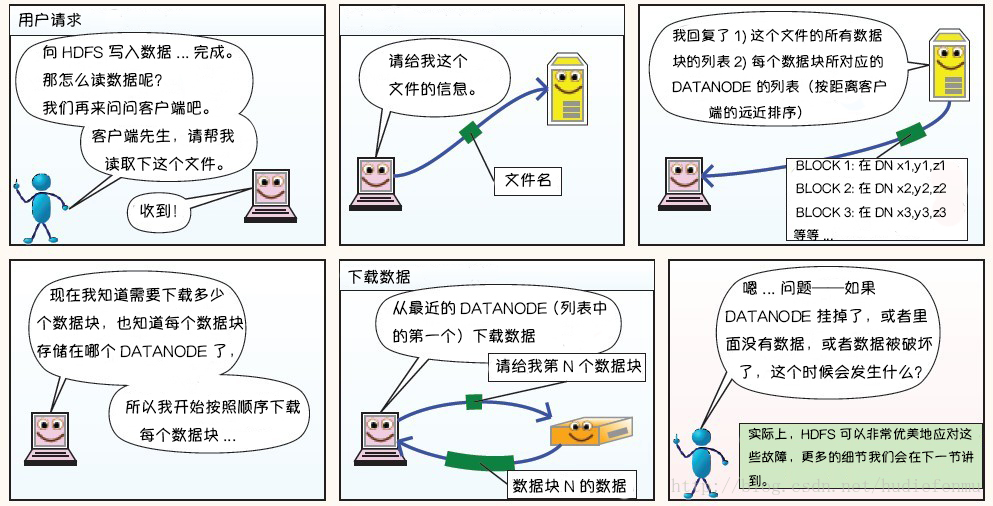
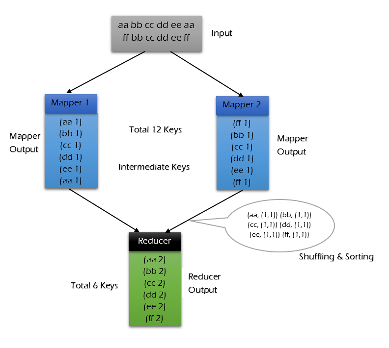
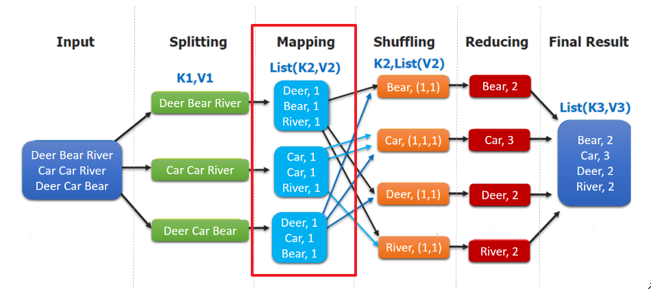
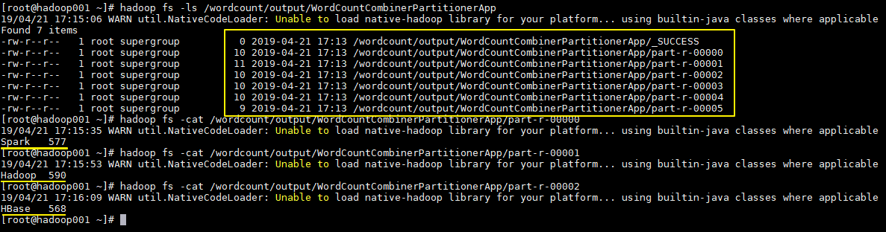
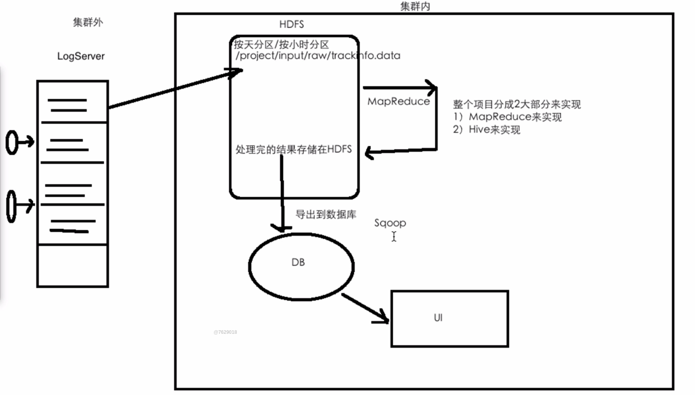
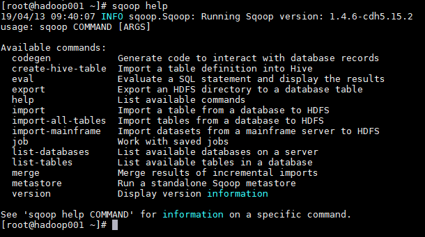
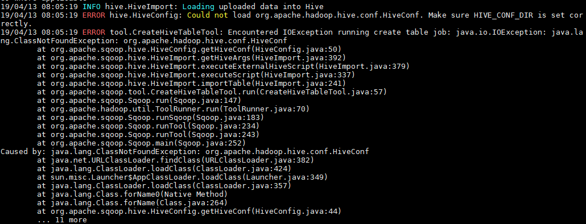

## 一、第一部分——HDFS

### 1.1介绍

**HDFS** （Hadoop Distributed File System）是 Hadoop 下的分布式文件系统，是 Hadoop 的核心组件之一，具有高容错、高吞吐量等特性，可以部署在低成本的硬件上。

在现代的企业环境中，单机容量往往无法存储大量数据，需要跨机器存储。统一管理分布在集群上的文件系统称为**分布式文件系统**。

 HDFS  使用多台计算机存储文件，并且提供统一的访问接口，像是访问一个普通文件系统一样使用分布式文件系统。

硬件的错误是非常常见的，在一个HDFS集群里，有着成百上千的服务器，每个机器只存储文件的部分数据，默认使用3个副本，且集群中有着一个可以监控集群状况的组件。

HDFS更多的用来做数据批处理，存储大规模数据，不适合低延时数据访问和小文件存储，不适合实时访问。

### 1.2 HDFS 设计架构


HDFS 遵循主/从（master/slave）架构，由三部分组成： **NameNode** 和 **DataNode** 以及 **SecondaryNamenode**：

- **NameNode** : 充当master的职责，负责管理整个**文件系统的元数据**，它提供客户端对文件的访问，还负责集群元数据的存储，记录着文件中各个数据块的位置信息。元数据保存在内存中，保存的是文件、block、DataNode之间的映射关系。
- **DataNode**：充当slave，负责管理用户的**文件数据块**，执行块的创建，删除等操作。每一个数据块都可以在多个 DataNode 上存储多个副本，默认为3个，默认每块128M。文件内容存放在本地磁盘上，维护block id到DataNode本地文件的映射关系。
- **Secondary NameNode** ：辅助 NameNode 管理元数据信息，可以理解为NameNode的备份作用，但是又不全是备份。用来监控 HDFS 状态的辅助后台程序，每隔一段时间获取 HDFS 元数据的快照。

### 1.3 详解文件系统命名空间

HDFS 的 ` 文件系统命名空间 ` 的层次结构与大多数文件系统类似 (如 Linux下的/home/Documents/dev/BigData/Hadoop/HadoopPictures)， 支持目录和文件的创建、移动、删除和重命名等操作，支持配置用户和访问权限，但不支持硬链接和软连接。`NameNode` 负责维护文件系统名称空间，记录对名称空间或其属性的任何更改，应用程序可以自己指定副本数。

### 1.4 数据复制

由于 Hadoop 被设计运行在廉价的机器上，这意味着硬件是不可靠的，为了保证容错性，HDFS 提供了数据复制机制。HDFS 将每一个文件存储为一系列**块**，每个块由多个副本来保证容错，块的大小和复制因子可以自行配置（默认情况下，块大小是 128M，默认复制因子是 3）。


### 1.5 数据复制的实现原理

大型的 HDFS 实例在通常分布在多个机架的多台服务器上，不同机架上的两台服务器之间通过交换机进行通讯。在大多数情况下，同一机架中的服务器间的网络带宽大于不同机架中的服务器之间的带宽。因此 HDFS 采用机架感知副本放置策略，对于常见情况，当复制因子为 3 时，HDFS 的放置策略是：

低版本Hadoop（2.9.0以下），第一个副本在client所处的节点上。如果客户端在集群外，随机选一个。第二个副本和第一个副本位于相同机架，随机节点。第三个副本位于不同机架，随机节点。

高版本Hadoop（2.9.0以及以后），第一个副本在client所处的节点上。如果客户端在集群外，随机选一个。第二个副本和第一个副本位于不相同机架的随机节点上。第三个副本和第二个副本位于相同机架，节点随机。

此策略可以减少机架间的写入流量，从而提高写入性能。

### 1.6  副本的选择

为了最大限度地减少带宽消耗和读取延迟，HDFS 在执行读取请求时，优先读取距离读取器最近的副本。如果在与读取器节点相同的机架上存在副本，则优先选择该副本。如果 HDFS 群集跨越多个数据中心，则优先选择本地数据中心上的副本。

### 1.7 架构的稳定性

#### 1. 心跳机制和重新复制

每个 DataNode 定期向 NameNode 发送心跳消息，如果超过指定时间没有收到心跳消息，则将 DataNode 标记为死亡。NameNode 不会将任何新的 IO 请求转发给标记为死亡的 DataNode，也不会再使用这些 DataNode 上的数据。 由于数据不再可用，可能会导致某些块的复制因子小于其指定值，NameNode 会跟踪这些块，并在必要的时候进行重新复制。

#### 2. 数据的完整性

由于存储设备故障等原因，存储在 DataNode 上的数据块也会发生损坏。为了避免读取到已经损坏的数据而导致错误，HDFS 提供了数据完整性校验机制来保证数据的完整性，具体操作如下：

当客户端创建 HDFS 文件时，它会计算文件的每个块的 ` 校验和 `，并将 ` 校验和 ` 存储在同一 HDFS 命名空间下的单独的隐藏文件中。当客户端检索文件内容时，它会验证从每个 DataNode 接收的数据是否与存储在关联校验和文件中的 ` 校验和 ` 匹配。如果匹配失败，则证明数据已经损坏，此时客户端会选择从其他 DataNode 获取该块的其他可用副本。

#### 3.元数据的磁盘故障

`FsImage` 和 `EditLog` 是 HDFS 的核心数据，这些数据的意外丢失可能会导致整个 HDFS 服务不可用。为了避免这个问题，可以配置 NameNode 使其支持 `FsImage` 和 `EditLog` 多副本同步，这样 `FsImage` 或 `EditLog` 的任何改变都会引起每个副本 `FsImage` 和 `EditLog` 的同步更新。

#### 4.支持快照

快照支持在特定时刻存储数据副本，在数据意外损坏时，可以通过回滚操作恢复到健康的数据状态。

#### 5.HDFS 的安全模式

**安全模式是hadoop的一种保护机制，用于保证集群中的数据块的安全性**。当集群启动的时候，会首先进入安全模式。当系统处于安全模式时会检查数据块的完整性。

假设我们设置的副本数（即参数dfs.replication）是3，那么在datanode上就应该有3个副本存在，假设只存在2个副本，那么比例就是2/3=0.666。hdfs默认的副本率0.999。我们的副本率0.666明显小于0.999，因此系统会自动的复制副本到其他dataNode，使得副本率不小于0.999。如果系统中有5个副本，超过我们设定的3个副本，那么系统也会删除多于的2个副本。

**在安全模式状态下，文件系统只接受读数据请求，而不接受删除、修改等变更请求**。在，当整个系统达到安全标准时，HDFS自动离开安全模式。30s

安全模式操作命令

```shell
hdfs  dfsadmin  -safemode  get #查看安全模式状态
hdfs  dfsadmin  -safemode  enter #进入安全模式
hdfs  dfsadmin  -safemode  leave #离开安全模式
```

## 三、图解HDFS存储原理

> 说明：以下图片引用自博客：[翻译经典 HDFS 原理讲解漫画](https://blog.csdn.net/hudiefenmu/article/details/37655491)

### 3.1 HDFS写数据原理


1. Client 发起文件上传请求，通过 RPC 与 NameNode 建立通讯, NameNode 检查目标文件是否已存在，父目录是否存在，返回是否可以上传；
2. Client 请求第一个 block 该传输到哪些 DataNode 服务器上；
3. NameNode 根据配置文件中指定的备份数量及机架感知原理进行文件分配, 返回可用的 DataNode 的地址如：A, B, C；

4. Client 请求 3 台 DataNode 中的一台 A 上传数据（本质上是一个 RPC 调用，建立 pipeline ），A 收到请求会继续调用 B，然后 B 调用 C，将整个 pipeline 建立完成， 后逐级返回 client；

5. Client 开始往 A 上传第一个 block（先从磁盘读取数据放到一个本地内存缓存），以 packet 为单位（默认64K），A 收到一个 packet 就会传给 B，B 传给 C。A 每传一个 packet 会放入一个应答队列等待应答；

6. 数据被分割成一个个 packet 数据包在 pipeline 上依次传输，在 pipeline 反方向上， 逐个发送 ack（命令正确应答），最终由 pipeline 中第一个 DataNode 节点 A 将 pipelineack 发送给 Client；

7. 当一个 block 传输完成之后，Client 再次请求 NameNode 上传第二个 block，重复步骤 2；

### 3.2 HDFS读数据原理



1. Client向NameNode发起RPC请求，来确定请求文件block所在的位置；
2. NameNode会视情况返回文件的部分或者全部block列表，对于每个block，NameNode 都会返回含有该 block 副本的 DataNode 地址；  这些返回的 DN 地址，会按照集群拓扑结构得出 DataNode  与客户端的距离，然后进行排序，排序两个规则：网络拓扑结构中距离 Client 近的排靠前；心跳机制中超时汇报的 DN 状态为  STALE，这样的排靠后；
3. Client 选取排序靠前的 DataNode 来读取 block，如果客户端本身就是DataNode，那么将从本地直接获取数据(短路读取特性)；
4. 底层上本质是建立 Socket Stream（FSDataInputStream），重复的调用父类 DataInputStream 的 read 方法，直到这个块上的数据读取完毕；
5. 当读完列表的 block 后，若文件读取还没有结束，客户端会继续向NameNode 获取下一批的 block 列表；
6. 读取完一个 block 都会进行 checksum 验证，如果读取 DataNode 时出现错误，客户端会通知 NameNode，然后再从下一个拥有该 block 副本的DataNode 继续读。
7. **read 方法是并行的读取 block 信息，不是一块一块的读取**；NameNode 只是返回Client请求包含块的DataNode地址，并不是返回请求块的数据；
8. 最终读取来所有的 block 会合并成一个完整的最终文件。

> 从 HDFS 文件读写过程中，可以看出，HDFS 文件写入时是串行写入的，数据包先发送给节点A，然后节点A发送给B，B在给C；而HDFS文件读取是并行的， 客户端 Client 直接并行读取block所在的节点。

### 3.3 HDFS故障类型和其检测方法


### 3.4 读写故障的处理

 

### 3.5 DataNode 故障处理


### 3.6 NameNode 工作机制以及元数据管理


### 3.7 namenode 与 datanode 启动

- **namenode工作机制**

1. 第一次启动namenode格式化后，创建fsimage和edits文件。如果不是第一次启动，直接加载编辑日志和镜像文件到内存。
2. 客户端对元数据进行增删改的请求。
3. namenode记录操作日志，更新滚动日志。
4. namenode在内存中对数据进行增删改查。

- **secondary namenode工作机制**

1. secondary namenode询问 namenode 是否需要 checkpoint。直接带回 namenode 是否检查结果。
2. secondary namenode 请求执行 checkpoint。
3. namenode 滚动正在写的edits日志。
4. 将滚动前的编辑日志和镜像文件拷贝到 secondary namenode。
5. secondary namenode 加载编辑日志和镜像文件到内存，并合并。
6. 生成新的镜像文件 fsimage.chkpoint。
7. 拷贝 fsimage.chkpoint 到 namenode。
8. namenode将 fsimage.chkpoint 重新命名成fsimage。

### 3.8 FSImage与edits详解

所有的元数据信息都保存在了FsImage与Eidts文件当中，这两个文件就记录了所有的数据的元数据信息，元数据信息的保存目录配置在了 **hdfs-site.xml** 当中

```xml
<!--fsimage文件存储的路径-->
<property>
    <name>dfs.namenode.name.dir</name>
    <value>file:///opt/hadoop-2.6.0-cdh5.14.0/hadoopDatas/namenodeDatas</value>
</property>
<!-- edits文件存储的路径 -->
<property>
    <name>dfs.namenode.edits.dir</name>
    <value>file:///opt/hadoop-2.6.0-cdh5.14.0/hadoopDatas/dfs/nn/edits</value>
</property>
```

客户端对hdfs进行写文件时会首先被记录在edits文件中。edits修改时元数据也会更新。每次hdfs更新时edits先更新后客户端才会看到最新信息。

fsimage：是namenode中关于元数据的镜像，一般称为检查点。

**一般开始时对namenode的操作都放在edits中，为什么不放在fsimage中呢？**

因为fsimage是namenode的完整的镜像，内容很大，如果每次都加载到内存的话生成树状拓扑结构，这是非常耗内存和CPU。

fsimage内容包含了namenode管理下的所有datanode中文件及文件block及block所在的datanode的元数据信息。随着edits内容增大，就需要在一定时间点和fsimage合并。

### 3.9 FSimage文件当中的文件信息查看

- 使用命令 hdfs  oiv

```text
cd  /opt/hadoop-2.6.0-cdh5.14.0/hadoopDatas/namenodeDatas/current
hdfs oiv -i fsimage_0000000000000000112 -p XML -o hello.xml
```

### 3.10 edits当中的文件信息查看

- 查看命令 hdfs  oev

```text
cd  /opt/hadoop-2.6.0-cdh5.14.0/hadoopDatas/dfs/nn/edits
hdfs oev -i  edits_0000000000000000112-0000000000000000113 -o myedit.xml -p XML
```

### 3.11 secondarynameNode如何辅助管理FSImage与Edits文件

1. secnonaryNN通知NameNode切换editlog。
2. secondaryNN从NameNode中获得FSImage和editlog(通过http方式)。
3. secondaryNN将FSImage载入内存，然后开始合并editlog，合并之后成为新的fsimage。
4. secondaryNN将新的fsimage发回给NameNode。
5. NameNode用新的fsimage替换旧的fsimage。


完成合并的是 secondarynamenode，会请求namenode停止使用edits，暂时将新写操作放入一个新的文件中（edits.new)。

secondarynamenode从namenode中**通过http get获得edits**，因为要和fsimage合并，所以也是通过http get 的方式把fsimage加载到内存，然后逐一执行具体对文件系统的操作，与fsimage合并，生成新的fsimage，然后把fsimage发送给namenode，**通过http post的方式**。

namenode从secondarynamenode获得了fsimage后会把原有的fsimage替换为新的fsimage，把edits.new变成edits。同时会更新fsimage。

hadoop进入安全模式时需要管理员使用dfsadmin的save namespace来创建新的检查点。

secondarynamenode在合并edits和fsimage时需要消耗的内存和namenode差不多，所以一般把namenode和secondarynamenode放在不同的机器上。

fsimage与edits的合并时机取决于两个参数，第一个参数是默认1小时fsimage与edits合并一次。

- 第一个参数：时间达到一个小时fsimage与edits就会进行合并

```text
dfs.namenode.checkpoint.period     3600
```

- 第二个参数：hdfs操作达到1000000次也会进行合并

```text
dfs.namenode.checkpoint.txns       1000000
```

- 第三个参数：每隔多长时间检查一次hdfs的操作次数

```text
dfs.namenode.checkpoint.check.period   60
```

### 3.12 namenode元数据信息多目录配置

为了保证元数据的安全性，我们一般都是先确定好我们的磁盘挂载目录，将元数据的磁盘做RAID1

namenode的本地目录可以配置成多个，且每个目录存放内容相同，增加了可靠性。

- 具体配置方案:

  **hdfs-site.xml**

```text
	<property>
         <name>dfs.namenode.name.dir</name>
         <value>file:///export/servers/hadoop-2.6.0-cdh5.14.0/hadoopDatas/namenodeDatas</value>
    </property>
```

### 3.13 namenode故障恢复

在我们的secondaryNamenode对namenode当中的fsimage和edits进行合并的时候，每次都会先将namenode的fsimage与edits文件拷贝一份过来，所以fsimage与edits文件在secondarNamendoe当中也会保存有一份，如果namenode的fsimage与edits文件损坏，那么我们可以将secondaryNamenode当中的fsimage与edits拷贝过去给namenode继续使用，只不过有可能会丢失一部分数据。这里涉及到几个配置选项

- namenode保存fsimage的配置路径

```text
<!--  namenode元数据存储路径，实际工作当中一般使用SSD固态硬盘，并使用多个固态硬盘隔开，冗余元数据 -->
	<property>
		<name>dfs.namenode.name.dir</name>
		<value>file:///export/servers/hadoop-2.6.0-cdh5.14.0/hadoopDatas/namenodeDatas</value>
	</property>
```

- namenode保存edits文件的配置路径

```text
<property>
		<name>dfs.namenode.edits.dir</name>
		<value>file:///export/servers/hadoop-2.6.0-cdh5.14.0/hadoopDatas/dfs/nn/edits</value>
</property>
```

- secondaryNamenode保存fsimage文件的配置路径

```text
<property>
		<name>dfs.namenode.checkpoint.dir</name>
		<value>file:///export/servers/hadoop-2.6.0-cdh5.14.0/hadoopDatas/dfs/snn/name</value>
</property>
```

- secondaryNamenode保存edits文件的配置路径

```text
<property>
		<name>dfs.namenode.checkpoint.edits.dir</name>
		<value>file:///export/servers/hadoop-2.6.0-cdh5.14.0/hadoopDatas/dfs/nn/snn/edits</value>
</property>
```

**接下来我们来模拟namenode的故障恢复功能**

1. 杀死namenode进程: 使用jps查看namenode的进程号 , kill -9 直接杀死。
2. 删除namenode的fsimage文件和edits文件。

> 根据上述配置, 找到namenode放置fsimage和edits路径. 直接全部rm -rf 删除。

1. 拷贝secondaryNamenode的fsimage与edits文件到namenode的fsimage与edits文件夹下面去。

> 根据上述配置, 找到secondaryNamenode的fsimage和edits路径, 将内容 使用cp -r 全部复制到namenode对应的目录下即可。

1. 重新启动namenode, 观察数据是否存在

### 3.14 DataNode工作机制以及数据存储

- **datanode工作机制**

1. 一个数据块在datanode上以文件形式存储在磁盘上，包括两个文件，一个是数据本身，一个是元数据包括数据块的长度，块数据的校验和，以及时间戳。
2. DataNode启动后向namenode注册，通过后，周期性（1小时）的向namenode上报所有的块信息。(dfs.blockreport.intervalMsec)。
3. 心跳是每3秒一次，心跳返回结果带有namenode给该datanode的命令如复制块数据到另一台机器，或删除某个数据块。如果超过10分钟没有收到某个datanode的心跳，则认为该节点不可用。
4. 集群运行中可以安全加入和退出一些机器。

- **数据完整性**

1. 当DataNode读取block的时候，它会计算checksum。
2. 如果计算后的checksum，与block创建时值不一样，说明block已经损坏。
3. client读取其他DataNode上的block。
4. datanode在其文件创建后周期验证checksum。

- **掉线时限参数设置**

datanode进程死亡或者网络故障造成datanode无法与namenode通信，namenode不会立即把该节点判定为死亡，要经过一段时间，这段时间暂称作超时时长。HDFS默认的超时时长为10分钟+30秒。如果定义超时时间为timeout，则超时时长的计算公式为：

**timeout  = 2 \* dfs.namenode.heartbeat.recheck-interval + 10 \* dfs.heartbeat.interval。**

而默认的dfs.namenode.heartbeat.recheck-interval 大小为5分钟，dfs.heartbeat.interval默认为3秒。

需要注意的是hdfs-site.xml **配置文件中的heartbeat.recheck.interval的单位为毫秒**，**dfs.heartbeat.interval的单位为秒**。

```xml
<property>
    <name>dfs.namenode.heartbeat.recheck-interval</name>
    <value>300000</value>
</property>
<property>
    <name>dfs.heartbeat.interval </name>
    <value>3</value>
</property>
```

- **DataNode的目录结构**

  和namenode不同的是，datanode的存储目录是初始阶段自动创建的，不需要额外格式化。

在/opt/hadoop-2.6.0-cdh5.14.0/hadoopDatas/datanodeDatas/current这个目录下查看版本号

```shell
cat VERSION 

#Thu Mar 14 07:58:46 CST 2019
storageID=DS-47bcc6d5-c9b7-4c88-9cc8-6154b8a2bf39
clusterID=CID-dac2e9fa-65d2-4963-a7b5-bb4d0280d3f4
cTime=0
datanodeUuid=c44514a0-9ed6-4642-b3a8-5af79f03d7a4
storageType=DATA_NODE
layoutVersion=-56
```

具体解释:

storageID：存储id号。

clusterID集群id，全局唯一。

cTime属性标记了datanode存储系统的创建时间，对于刚刚格式化的存储系统，这个属性为0；但是在文件系统升级之后，该值会更新到新的时间戳。

datanodeUuid：datanode的唯一识别码。

storageType：存储类型。

layoutVersion是一个负整数。通常只有HDFS增加新特性时才会更新这个版本号。

- **datanode多目录配置**

datanode也可以配置成多个目录，每个目录存储的数据不一样。即：数据不是副本。具体配置如下： - 只需要在value中使用逗号分隔出多个存储目录即可

```shell
  cd /opt/hadoop-2.6.0-cdh5.14.0/etc/hadoop
  <!--  定义dataNode数据存储的节点位置，实际工作中，一般先确定磁盘的挂载目录，然后多个目录用，进行分割  -->
          <property>
                  <name>dfs.datanode.data.dir</name>
                  <value>file:///opt/hadoop-2.6.0-cdh5.14.0/hadoopDatas/datanodeDatas</value>
          </property>
```

### 3.15 服役新数据节点

需求说明:

随着公司业务的增长，数据量越来越大，原有的数据节点的容量已经不能满足存储数据的需求，需要在原有集群基础上动态添加新的数据节点。

#### 3.15.1 环境准备

1. 复制一台新的虚拟机出来

> 将我们纯净的虚拟机复制一台出来，作为我们新的节点

2. 修改mac地址以及IP地址

```shell
修改mac地址命令
vim /etc/udev/rules.d/70-persistent-net.rules
修改ip地址命令
vim /etc/sysconfig/network-scripts/ifcfg-eth0
```

3. 关闭防火墙，关闭selinux

```shell
关闭防火墙
service iptables stop
关闭selinux
vim /etc/selinux/config
```

4. 更改主机名

```shell
更改主机名命令，将node04主机名更改为node04.hadoop.com
vim /etc/sysconfig/network
```

5. 四台机器更改主机名与IP地址映射

```shell
四台机器都要添加hosts文件
vim /etc/hosts

192.168.52.100 node01.hadoop.com  node01
192.168.52.110 node02.hadoop.com  node02
192.168.52.120 node03.hadoop.com  node03
192.168.52.130 node04.hadoop.com  node04
```

6. node04服务器关机重启

```shell
node04执行以下命令关机重启
reboot -h now
```

7. node04安装jdk

```shell
node04统一两个路径
mkdir -p /export/softwares/
mkdir -p /export/servers/
```

**然后解压jdk安装包，配置环境变量**

8. 解压hadoop安装包

```shell
在node04服务器上面解压hadoop安装包到/export/servers , node01执行以下命令将hadoop安装包拷贝到node04服务器
cd /export/softwares/
scp hadoop-2.6.0-cdh5.14.0-自己编译后的版本.tar.gz node04:$PWD

node04解压安装包
tar -zxf hadoop-2.6.0-cdh5.14.0-自己编译后的版本.tar.gz -C /export/servers/
```

9. 将node01关于hadoop的配置文件全部拷贝到node04

```shell
node01执行以下命令，将hadoop的配置文件全部拷贝到node04服务器上面
cd /export/servers/hadoop-2.6.0-cdh5.14.0/etc/hadoop/
scp ./* node04:$PWD
```

#### 3.15.2 服役新节点具体步骤

1. 创建dfs.hosts文件

```shell
在node01也就是namenode所在的机器的/export/servers/hadoop-2.6.0-cdh5.14.0/etc/hadoop目录下创建dfs.hosts文件

[root@node01 hadoop]# cd /export/servers/hadoop-2.6.0-cdh5.14.0/etc/hadoop
[root@node01 hadoop]# touch dfs.hosts
[root@node01 hadoop]# vim dfs.hosts

添加如下主机名称（包含新服役的节点）
node01
node02
node03
node04
```

2. node01编辑hdfs-site.xml添加以下配置

> 在namenode的hdfs-site.xml配置文件中增加dfs.hosts属性

```shell
node01执行以下命令 :

cd /export/servers/hadoop-2.6.0-cdh5.14.0/etc/hadoop
vim hdfs-site.xml

# 添加一下内容
	<property>
         <name>dfs.hosts</name>
         <value>/export/servers/hadoop-2.6.0-cdh5.14.0/etc/hadoop/dfs.hosts</value>
    </property>
    <!--动态上下线配置: 如果配置文件中有, 就不需要配置-->
    <property>
		<name>dfs.hosts</name>
		<value>/export/servers/hadoop-2.6.0-cdh5.14.0/etc/hadoop/accept_host</value>
	</property>
	
	<property>
		<name>dfs.hosts.exclude</name>
		<value>/export/servers/hadoop-2.6.0-cdh5.14.0/etc/hadoop/deny_host</value>
	</property>
```

3. 刷新namenode

- node01执行以下命令刷新namenode

```shell
[root@node01 hadoop]# hdfs dfsadmin -refreshNodes
Refresh nodes successful
```

4. 更新resourceManager节点

- node01执行以下命令刷新resourceManager

```shell
[root@node01 hadoop]# yarn rmadmin -refreshNodes
19/03/16 11:19:47 INFO client.RMProxy: Connecting to ResourceManager at node01/192.168.52.100:8033
```

5. namenode的slaves文件增加新服务节点主机名称

> node01编辑slaves文件，并添加新增节点的主机，更改完后，slaves文件不需要分发到其他机器上面去

```shell
node01执行以下命令编辑slaves文件 :
	cd /export/servers/hadoop-2.6.0-cdh5.14.0/etc/hadoop
	vim slaves
	
添加一下内容: 	
node01
node02
node03
node04
```

6. 单独启动新增节点

```shell
node04服务器执行以下命令，启动datanode和nodemanager : 
cd /export/servers/hadoop-2.6.0-cdh5.14.0/
sbin/hadoop-daemon.sh start datanode
sbin/yarn-daemon.sh start nodemanager
```

7. 使用负载均衡命令，让数据均匀负载所有机器

```shell
node01执行以下命令 : 
cd /export/servers/hadoop-2.6.0-cdh5.14.0/
sbin/start-balancer.sh
```

#### 3.15.3 退役旧数据

1. 创建dfs.hosts.exclude配置文件

在namenod所在服务器的/export/servers/hadoop-2.6.0-cdh5.14.0/etc/hadoop目录下创建dfs.hosts.exclude文件，并添加需要退役的主机名称

```shell
node01执行以下命令 : 
	cd /export/servers/hadoop-2.6.0-cdh5.14.0/etc/hadoop
	touch dfs.hosts.exclude
	vim dfs.hosts.exclude
添加以下内容:
	node04.hadoop.com

特别注意：该文件当中一定要写真正的主机名或者ip地址都行，不能写node04
```

2. 编辑namenode所在机器的hdfs-site.xml

> 编辑namenode所在的机器的hdfs-site.xml配置文件，添加以下配置

```shell
cd /export/servers/hadoop-2.6.0-cdh5.14.0/etc/hadoop
vim hdfs-site.xml

#添加一下内容:
	<property>
         <name>dfs.hosts.exclude</name>
         <value>/export/servers/hadoop-2.6.0-cdh5.14.0/etc/hadoop/dfs.hosts.exclude</value>
   </property>
```

3. 刷新namenode，刷新resourceManager

```shell
在namenode所在的机器执行以下命令，刷新namenode，刷新resourceManager : 

hdfs dfsadmin -refreshNodes
yarn rmadmin -refreshNodes
```

4. 节点退役完成，停止该节点进程

等待退役节点状态为decommissioned（所有块已经复制完成），停止该节点及节点资源管理器。注意：如果副本数是3，服役的节点小于等于3，是不能退役成功的，需要修改副本数后才能退役。

```shell
node04执行以下命令，停止该节点进程 : 
	cd /export/servers/hadoop-2.6.0-cdh5.14.0
	sbin/hadoop-daemon.sh stop datanode
	sbin/yarn-daemon.sh stop nodemanager
```

5. 从include文件中删除退役节点

```shell
namenode所在节点也就是node01执行以下命令删除退役节点 :
	cd /export/servers/hadoop-2.6.0-cdh5.14.0/etc/hadoop
	vim dfs.hosts
	
删除后的内容: 删除了node04
node01
node02
node03
```

6. node01执行一下命令刷新namenode，刷新resourceManager

```shell
hdfs dfsadmin -refreshNodes
yarn rmadmin -refreshNodes
```

7. 从namenode的slave文件中删除退役节点

```shell
namenode所在机器也就是node01执行以下命令从slaves文件中删除退役节点 : 
cd /export/servers/hadoop-2.6.0-cdh5.14.0/etc/hadoop
vim slaves
删除后的内容: 删除了 node04 
node01
node02
node03
```

8. 如果数据负载不均衡，执行以下命令进行均衡负载

```shell
node01执行以下命令进行均衡负载
cd /export/servers/hadoop-2.6.0-cdh5.14.0/
sbin/start-balancer.sh
```

### 3.16 hdfs快照snapShot管理

快照顾名思义，就是相当于对我们的hdfs文件系统做一个备份，我们可以通过快照对我们指定的文件夹设置备份，但是添加快照之后，并不会立即复制所有文件，而是指向同一个文件。当写入发生时，才会产生新文件

1. 快照使用基本语法

```text
1、 开启指定目录的快照功能
	hdfs dfsadmin  -allowSnapshot  路径 
2、禁用指定目录的快照功能（默认就是禁用状态）
	hdfs dfsadmin  -disallowSnapshot  路径
3、给某个路径创建快照snapshot
	hdfs dfs -createSnapshot  路径
4、指定快照名称进行创建快照snapshot
	hdfs dfs  -createSanpshot 路径 名称    
5、给快照重新命名
	hdfs dfs  -renameSnapshot  路径 旧名称  新名称
6、列出当前用户所有可快照目录
	hdfs lsSnapshottableDir  
7、比较两个快照的目录不同之处
	hdfs snapshotDiff  路径1  路径2
8、删除快照snapshot
	hdfs dfs -deleteSnapshot <path> <snapshotName> 
```

2. 快照操作实际案例

```text
1、开启与禁用指定目录的快照

[root@node01 hadoop-2.6.0-cdh5.14.0]# hdfs dfsadmin -allowSnapshot /user

Allowing snaphot on /user succeeded

[root@node01 hadoop-2.6.0-cdh5.14.0]# hdfs dfsadmin -disallowSnapshot /user

Disallowing snaphot on /user succeeded

2、对指定目录创建快照

注意：创建快照之前，先要允许该目录创建快照

[root@node01 hadoop-2.6.0-cdh5.14.0]# hdfs dfsadmin -allowSnapshot /user

Allowing snaphot on /user succeeded

[root@node01 hadoop-2.6.0-cdh5.14.0]# hdfs dfs -createSnapshot /user    

Created snapshot /user/.snapshot/s20190317-210906.549

通过web浏览器访问快照

http://node01:50070/explorer.html#/user/.snapshot/s20190317-210906.549

3、指定名称创建快照

[root@node01 hadoop-2.6.0-cdh5.14.0]# hdfs dfs -createSnapshot /user mysnap1

Created snapshot /user/.snapshot/mysnap1

4、重命名快照

hdfs dfs -renameSnapshot /user mysnap1 mysnap2
 
5、列出当前用户所有可以快照的目录

hdfs lsSnapshottableDir

6、比较两个快照不同之处

hdfs dfs -createSnapshot /user snap1

hdfs dfs -createSnapshot /user snap2

hdfs snapshotDiff  snap1 snap2

7、删除快照

hdfs dfs -deleteSnapshot /user snap1
```

## 四、HDFS常用操作

HDFS的操作跟shell的操作一致，在hadoop目录下进行操作，前缀hadoop fs 或者hdfs dfs加上下面的各类操作，常用的，例如：

|操作 | 功能 |  
|--|--|
|-put | 将文件上传 |
-ls | 显示当前仓库中有哪些文件
-cat |查看文件
-mkdir | 创建一个文件夹
-get | 从hdfs上获得一份文件到本地
-mv | 移动某个文件到某个位置
-cp | 将一个文件拷贝一份
-getmerge | 将两个文件合并起来
-rm | 删除一个文件
-rmdir | 删除一个为空的文件夹
-rmr | 此命令相当于-rm -r，删除一个文件夹
-text | 查看某个文件
-R | 递归显示某个文件夹中的文件

## 五、HDFS API的初识

1. 首先在IDEA上，使用Maven来构建项目。创建一个maven-quickstart项目，引入下面的pom文件

```xml
<?xml version="1.0" encoding="UTF-8"?>

<project xmlns="http://maven.apache.org/POM/4.0.0" xmlns:xsi="http://www.w3.org/2001/XMLSchema-instance"
  xsi:schemaLocation="http://maven.apache.org/POM/4.0.0 http://maven.apache.org/xsd/maven-4.0.0.xsd">
  <modelVersion>4.0.0</modelVersion>

  <groupId>org.example</groupId>
  <artifactId>com.zyx.bigdata</artifactId>
  <version>1.0-SNAPSHOT</version>

  <name>com.zyx.bigdata</name>
  <!-- FIXME change it to the project's website -->
  <url>http://www.example.com</url>

  <properties>
    <project.build.sourceEncoding>UTF-8</project.build.sourceEncoding>
    <maven.compiler.source>1.8</maven.compiler.source>
    <maven.compiler.target>1.8</maven.compiler.target>
    <hadoop.version>2.6.0-cdh5.15.1</hadoop.version>

  </properties>
  <repositories>
    <repository>
      <id>cloudera</id>
      <url>https://repository.cloudera.com/artifactory/cloudera-repos</url>
    </repository>
  </repositories>
  <dependencies>
    <dependency>
      <groupId>junit</groupId>
      <artifactId>junit</artifactId>
      <version>4.11</version>
      <scope>test</scope>
    </dependency>


    <dependency>
      <groupId>org.apache.hadoop</groupId>
      <artifactId>hadoop-client</artifactId>
      <version>${hadoop.version}</version>
    </dependency>

  </dependencies>

  <build>
    <pluginManagement><!-- lock down plugins versions to avoid using Maven defaults (may be moved to parent pom) -->
      <plugins>
        <!-- clean lifecycle, see https://maven.apache.org/ref/current/maven-core/lifecycles.html#clean_Lifecycle -->
        <plugin>
          <artifactId>maven-clean-plugin</artifactId>
          <version>3.1.0</version>
        </plugin>
        <!-- default lifecycle, jar packaging: see https://maven.apache.org/ref/current/maven-core/default-bindings.html#Plugin_bindings_for_jar_packaging -->
        <plugin>
          <artifactId>maven-resources-plugin</artifactId>
          <version>3.0.2</version>
        </plugin>
        <plugin>
          <artifactId>maven-compiler-plugin</artifactId>
          <version>3.8.0</version>
        </plugin>
        <plugin>
          <artifactId>maven-surefire-plugin</artifactId>
          <version>2.22.1</version>
        </plugin>
        <plugin>
          <artifactId>maven-jar-plugin</artifactId>
          <version>3.0.2</version>
        </plugin>
        <plugin>
          <artifactId>maven-install-plugin</artifactId>
          <version>2.5.2</version>
        </plugin>
        <plugin>
          <artifactId>maven-deploy-plugin</artifactId>
          <version>2.8.2</version>
        </plugin>
        <!-- site lifecycle, see https://maven.apache.org/ref/current/maven-core/lifecycles.html#site_Lifecycle -->
        <plugin>
          <artifactId>maven-site-plugin</artifactId>
          <version>3.7.1</version>
        </plugin>
        <plugin>
          <artifactId>maven-project-info-reports-plugin</artifactId>
          <version>3.0.0</version>
        </plugin>
      </plugins>
    </pluginManagement>
  </build>
</project>
```

2. 使用HDFS API进行目录的创建，1.首先创建configuration 2.获取filesystem 3.设置相关的操作路径 4.调用api操作

```java
package org.example;

import org.apache.hadoop.conf.Configuration;
import org.apache.hadoop.fs.*;
import org.apache.hadoop.io.IOUtils;

import java.net.URI;

/**
 * 使用Java操作HDFS API
 * 1.首先创建configuration
 * 2.获取filesystem
 * 3.设置相关的操作路径
 * 4.调用api操作
 */
public class HdfsApp {

    public static final String HDFS_PATH = "hdfs://willhope-pc:8020";

    public static void main(String[] args) throws Exception {
        Configuration configuration = new Configuration();
        configuration.set("dfs.replication","1");
        //使用此抽象类来访问hdfs文件系统，设置服务地址和配置信息，如果使用的是虚拟机，则需要传入当前用户名
        FileSystem fileSystem = FileSystem.get(new URI(HDFS_PATH),configuration);

        System.out.println("---------进行文件目录的创建---------");

        boolean result = fileSystem.mkdirs(new Path("/hdfsapi/test"));
        System.out.println(result);

        System.out.println("---------上传本地文件到HDFS上---------");
        fileSystem.copyFromLocalFile(new Path("/home/willhope/Desktop/Marvel.txt"),new Path("/hdfsapi/test"));


        System.out.println("---------查看HDFS上某文件的内容---------");
        //从hdfs上读取文件时，使用FSDataInputStream类
        FSDataInputStream fsDataInputStream = fileSystem.open(new Path("/hdfsapi/test/Marvel.txt"));
        IOUtils.copyBytes(fsDataInputStream, System.out,1024);

        System.out.println("---------创建文件上传到HDFS上---------");
        //向hdfs上写文件时，使用FSDataOutputStream类
        FSDataOutputStream fsDataOutputStream = fileSystem.create(new Path("/hdfsapi/test/a.txt"));
        fsDataOutputStream.writeUTF("My-bigdata-learning");
        fsDataOutputStream.flush();
        fsDataOutputStream.close();

        System.out.println("---------对HDFS上文件名的更改---------");
        boolean res = fileSystem.rename(new Path("/hdfsapi/test/a.txt"),new Path("/hdfsapi/test/hello.txt"));
        System.out.println(res);

        System.out.println("---------从HDFS上下载文件---------");
        fileSystem.copyToLocalFile(new Path("/hdfsapi/test/hello.txt"),new Path("/home/willhope/Documents/"));

        System.out.println("---------列出HDFS上某目录下所有文件信息---------");
//        FileStatus[] fileStatuses = fileSystem.listStatus(new Path("/hdfsapi/test/"));
//        System.out.println(Arrays.asList(fileStatuses).toString());
        RemoteIterator<LocatedFileStatus> fileStatus = fileSystem.listFiles(new Path("/hdfsapi/test/"),true);
        while (fileStatus.hasNext()){
            LocatedFileStatus locatedFileStatus = fileStatus.next();
            String isDir = locatedFileStatus.isDirectory()?"文件夹":"文件";
            String permission = locatedFileStatus.getPermission().toString();
            short replication = locatedFileStatus.getReplication();
            long length = locatedFileStatus.getLen();
            String path = locatedFileStatus.getPath().toString();

            System.out.println(isDir+"\t"+permission+"\t"+replication+"\t"
                +length+"\t"+path);
        }

        System.out.println("---------查看HDFS上某文件的块信息---------");
        FileStatus fileStatus2 = fileSystem.getFileStatus(new Path("/hdfsapi/test/hello.txt"));
        BlockLocation[] blocks = fileSystem.getFileBlockLocations(fileStatus2,0,fileStatus2.getLen());

        for (BlockLocation block : blocks){
            for (String name : block.getNames()){
                System.out.println(name+":"+block.getOffset()+":"+block.getLength());
            }
        }

        System.out.println("---------删除HDFS上的文件---------");
        boolean rest = fileSystem.delete(new Path("/hdfsapi/test/hello.txt"),true);
        System.out.println(rest);

    }
}

```

## 六、HDFS实战

1. 项目需求：使用HDFS JavaAPI完成HDFS文件系统上的文件的词频统计，即仅使用HDFS完成wordcount项目。

2. 先自定义一个上下文类MyContext，这个类主要用来做缓存，暂存数据。

```java

import java.util.HashMap;
import java.util.Map;

public class MyContext {
    

    //定义一个哈希表，用来做数据缓存
    private Map<Object, Object> cacheMap = new HashMap<>();


    public Map<Object, Object> getCacheMap(){
        return cacheMap;
    }

    /**
     * 写数据到缓存中去
     * @param key 单词
     * @param value 次数
     */
    public void write(Object key , Object value){
        cacheMap.put(key, value);
    }

    /**
     * 从缓存中获取值
     * @param key 单词
     * @return 单词对应词频
     */
    public Object get(Object key){
        return cacheMap.get(key);
    }

}

```

3. 自定义一个MyMapper接口，用一个WordCountMapper类实现这个接口，WordCountMapper类主要用来将文本分割，并且进行统计。

```java

public interface MyMapper {
    /**
     *
     * @param line 读取到的每行数据
     * @param context 上下文/缓存
     */
    void map(String line , MyContext context);
}


/**
 * 自定义单词处理类WordCountMapper，实现MyMapper接口
 */
public class WordCountMapper implements MyMapper{

    @Override
    public void map(String line, MyContext context) {

        //按照文本的分隔符将读取的每行数据进行分割
        String[] words = line.split("\t");

        //遍历数组中
        for(String word : words){
            //将单词写入到上下文中
            Object value = context.get(word);
            if(value == null){ // 表示没出现过该单词
                context.write(word,1);
            }else{
                int v = Integer.parseInt(value.toString());
                context.write(word, v+1);  // 取出单词对应的次数+1
            }
        }

    }
}

```

4. 定义HDFSapp主类，操作hdfs。

```java

import org.apache.hadoop.conf.Configuration;
import org.apache.hadoop.fs.*;
import java.io.BufferedReader;
import java.io.InputStreamReader;
import java.net.URI;
import java.util.Map;
import java.util.Set;

/**
 * 使用HDFS API完成wordcount
 * 需求：统计结果后，将统计结果输出到HDFS上
 *
 * 功能拆解：
 *  读取HDFS上的文件  ==>使用HDFS  API
 *  业务处理，按照分隔符分割 ==>抽象出Mapper
 *  缓存处理结果  ==>Context
 *  将结果写到HDFS上  ==>HDFS API
 *
 */
public class HDFSapp {

    public static final String HDFS_PATH = "hdfs://willhope-pc:8020";
    public static final Configuration configuration = new Configuration();
    public static final Path input = new Path("/hdfsapi/test/data.txt");
    public static final Path output = new Path("/hdfsapi/output/");

    public static void main(String[] args) throws Exception{

        //设置副本数为1
        configuration.set("dfs.replication","1");

        //获取要操作的HDFS文件系统
        FileSystem fileSystem = FileSystem.get(new URI(HDFS_PATH),configuration);
        //列出当前文件的信息
        RemoteIterator<LocatedFileStatus> remoteIterator = fileSystem.listFiles(input,false);
        //定义缓存类
        MyContext context = new MyContext();
        //定义词频统计类
        MyMapper mapper = new WordCountMapper();

        while(remoteIterator.hasNext()){
            LocatedFileStatus file = remoteIterator.next();
            FSDataInputStream in = fileSystem.open(file.getPath());
            BufferedReader reader = new BufferedReader(new InputStreamReader(in));

            String line = "";   // 用来接收读取的每行数据
            while((line = reader.readLine())!=null){
                mapper.map(line,context);
            }
            reader.close();
            in.close();
        }

        Map<Object,Object> contextMap = context.getCacheMap();

        //创建一个HDFS目录以及文件，将结果写入到此文件中
        /** new Path(a,b) Resolve a child path against a parent path. */
        FSDataOutputStream out = fileSystem.create(new Path(output , new Path("wc.out")));

        //使此map可迭代
        Set<Map.Entry<Object, Object>> entries = contextMap.entrySet();
        //循环取出写入
        for(Map.Entry<Object , Object> entry : entries){
            out.write((entry.getKey().toString()+"\t"+entry.getValue()+"\n").getBytes());
        }

        out.close();
        fileSystem.close();
    }


}


```

4. 对上面代码的重构。上面的代码中存在大量的地址代码，这属于硬编码，在编程中比较忌讳。因此，需要建立一个resources文件夹，将非业务逻辑的地址代码编写成一个文件hdfs.properties。

```

INPUT_PATH=/hdfsapi/test/data.txt
OUTPUT_PATH=/hdfsapi/output/
OUTPUT_FILE=wc.out
HDFS_URI=hdfs://willhope-pc:8020

```

5. 定义一个读取properties的类ParamsUtils。

```java

import java.io.IOException;
import java.util.Properties;

/**
 * 读取属性配置文件
 */
public class ParamsUtils {
    private static Properties properties = new Properties();
    static {
        try {
            properties.load(ParamsUtils.class.getClassLoader().getResourceAsStream("hdfs.properties"));
        }catch (IOException e){
            e.printStackTrace();
        }
    }

    public static Properties getProperties() throws Exception{
        return properties;
    }

}


```

6. 设置一个常量类Constants，将properties的内容，设置成常量

```java

public class Constants {

    public static final String INPUT_PATH ="INPUT_PATH";
    public static final String OUTPUT_PATH ="OUTPUT_PATH";
    public static final String OUTPUT_FILE ="OUTPUT_FILE";
    public static final String HDFS_URI ="HDFS_URI";

}

```

7. 重构HDFSapp类

```java

import org.apache.hadoop.conf.Configuration;
import org.apache.hadoop.fs.*;
import java.io.BufferedReader;
import java.io.InputStreamReader;
import java.net.URI;
import java.util.Map;
import java.util.Properties;
import java.util.Set;

/**
 * 使用HDFS API完成wordcount
 * 需求：统计结果后，将统计结果输出到HDFS上
 *
 * 功能拆解：
 *  读取HDFS上的文件  ==>使用HDFS  API
 *  业务处理，按照分隔符分割 ==>抽象出Mapper
 *  缓存处理结果  ==>Context
 *  将结果写到HDFS上  ==>HDFS API
 *
 */
public class HDFSapp2 {


    public static void main(String[] args) throws Exception{
        Properties properties = ParamsUtils.getProperties();
        Configuration configuration = new Configuration();
        //设置副本数为1
        configuration.set("dfs.replication","1");
        Path input = new Path(properties.getProperty(Constants.INPUT_PATH));
        Path output = new Path(properties.getProperty(Constants.OUTPUT_PATH));
        //获取要操作的HDFS文件系统
        FileSystem fileSystem = FileSystem.get(new URI(properties.getProperty(Constants.HDFS_URI)),configuration);
        //列出当前文件的信息和块信息
        RemoteIterator<LocatedFileStatus> remoteIterator = fileSystem.listFiles(input,false);
        MyContext context = new MyContext();
        MyMapper mapper = new WordCountMapper();

        while(remoteIterator.hasNext()){
            LocatedFileStatus file = remoteIterator.next();
            FSDataInputStream in = fileSystem.open(file.getPath());
            BufferedReader reader = new BufferedReader(new InputStreamReader(in));

            String line = "";   // 用来接收读取的每行数据
            while((line = reader.readLine())!=null){
                mapper.map(line,context);
            }
            reader.close();
            in.close();
        }

        Map<Object,Object> contextMap = context.getCacheMap();

        //创建一个HDFS目录以及文件，将结果写入到此文件中
        /** new Path(a,b) Resolve a child path against a parent path. */
        FSDataOutputStream out = fileSystem.create(new Path(output , new Path(properties.getProperty(Constants.OUTPUT_FILE))));

        //使此map可迭代
        Set<Map.Entry<Object, Object>> entries = contextMap.entrySet();
        //循环取出写入
        for(Map.Entry<Object , Object> entry : entries){
            out.write((entry.getKey().toString()+"\t"+entry.getValue()+"\n").getBytes());
        }

        out.close();
        fileSystem.close();
    }


}

```

8. 上面的代码运行后，发现，处理的数据，没有忽略大小写，因此更改WordCountMapper的逻辑。只需要追加toLowerCase()，使得所有的字符都转换为小写。String[] words = line.toLowerCase().split("\t");

```java

public class WordCountMapper implements MyMapper{

    @Override
    public void map(String line, MyContext context) {

        //按照文本的分隔符将读取的每行数据进行分割
        String[] words = line.toLowerCase().split("\t");

        //遍历数组中
        for(String word : words){
            //将单词写入到上下文中
            Object value = context.get(word);
            if(value == null){ // 表示没出现过该单词
                context.write(word,1);
            }else{
                int v = Integer.parseInt(value.toString());
                context.write(word, v+1);  // 取出单词对应的次数+1
            }
        }

    }
}

```

9. 通过上面的代码，又发现一个问题，MyMapper mapper = new WordCountMapper();是在主函数中定义的，如果，mapper的逻辑更改了，或者有其他的不同的业务要处理，要添加新的类，这样就得又重新定义。因此，为了方便处理逻辑的更换，把处理逻辑的类写到properties中，使用反射进行加载。

```

INPUT_PATH=/hdfsapi/test/data.txt
OUTPUT_PATH=/hdfsapi/output/
OUTPUT_FILE=wc.out
HDFS_URI=hdfs://willhope-pc:8020
public static final String MAPPER_CLASS="MAPPER_CLASS";

```

同时，在Constants类中，添加常量MAPPER_CLASS。

```java

public class Constants {
    public static final String INPUT_PATH ="INPUT_PATH";
    public static final String OUTPUT_PATH ="OUTPUT_PATH";
    public static final String OUTPUT_FILE ="OUTPUT_FILE";
    public static final String HDFS_URI ="HDFS_URI";
    public static final String MAPPER_CLASS="MAPPER_CLASS";
}

```

再将HDFSapp中的MyMapper mapper = new WordCountMapper();更改成下面的代码：

```java
//通过反射加载类，创建对象
Class<?> clazz= Class.forName(properties.getProperty(Constants.MAPPER_CLASS));
MyMapper mapper = (MyMapper)clazz.newInstance();
```

# 第二部分——MapReduce

## 一、MapReduce概述

源自Google的MapReduce论文，论文发表于2004年12月。

Hadoop MapReduce 是一个分布式计算框架，思想核心是“分而治之”，适用于大量复杂的任务处理场景（大规模数据处理场景），用于编写批处理应用程序。编写好的程序可以提交到 Hadoop 集群上用于并行离线处理大规模的数据集，不适用实时处理。

Map负责“分”，即把复杂的任务分解为若干个“简单的任务”来并行处理。可以进行拆分的前提是这些小任务可以并行计算，彼此间几乎没有依赖关系。

Reduce负责“合”，即对map阶段的结果进行全局汇总。


## 二、MapReduce编程模型简述

这里以词频统计为例进行说明，MapReduce 处理的流程如下：


1. **input** : 读取文本文件，输入数据；

2. **splitting** : 将文件按照行进行拆分，此时得到的 `K1` 行数，`V1` 表示对应行的文本内容；

3. **mapping** : 此部分并行将每一行按照拆分规则进行拆分，拆分规则有程序员编写，拆分得到的 `List(K2,V2)`，其中 `K2` 代表每一个单词，由于是做词频统计，所以 `V2` 的值为 1，代表出现 1 次；

4. **shuffling** ： 由于 `Mapping` 操作可能是在不同的机器上并行处理的，所以需要通过 `shuffling` 将相同 `key` 值的数据分发到同一个节点上去合并，这样才能统计出最终的结果，此时得到 `K2` 为每一个单词，`List(V2)` 为可迭代集合，`V2` 就是 Mapping 中的 V2；

   shuffling 是 Mapreduce 的核心，它分布在 Mapreduce 的 map 阶段和 reduce 阶段。一般把从 Map 产生输出开始到 Reduce 取得数据作为输入之前的过程称作 shuffle。

   1. **`Collect阶段`**：将 MapTask 的结果输出到默认大小为 100M 的环形缓冲区，保存的是 key/value，Partition 分区信息等。
   2. **`Spill阶段`**：当内存中的数据量达到一定的阀值的时候，就会将数据写入本地磁盘，在将数据写入磁盘之前需要对数据进行一次排序的操作，如果配置了 combiner，还会将有相同分区号和 key 的数据进行排序。
   3. **`Merge阶段`**：把所有溢出的临时文件进行一次合并操作，以确保一个 MapTask 最终只产生一个中间数据文件。
   4. **`Copy阶段`**：ReduceTask 启动 Fetcher 线程到已经完成 MapTask 的节点上复制一份属于自己的数据，这些数据默认会保存在内存的缓冲区中，当内存的缓冲区达到一定的阀值的时候，就会将数据写到磁盘之上。
   5. **`Merge阶段`**：在 ReduceTask 远程复制数据的同时，会在后台开启两个线程对内存到本地的数据文件进行合并操作。
   6. **`Sort阶段`**：在对数据进行合并的同时，会进行排序操作，由于 MapTask 阶段已经对数据进行了局部的排序，ReduceTask 只需保证 Copy 的数据的最终整体有效性即可。

   Shuffle 中的缓冲区大小会影响到 mapreduce 程序的执行效率，原则上说，缓冲区越大，磁盘io的次数越少，执行速度就越快

   缓冲区的大小可以通过参数调整,  参数：`mapreduce.task.io.sort.mb`  默认100M。

5. **Reducing** : 设置整合归并规则。这里的案例是统计单词出现的总次数，所以 `Reducing` 对 `List(V2)` 进行归约求和操作，最终输出。

MapReduce 编程模型中 `splitting` 和 `shuffing` 操作都是由框架实现的，需要我们自己编程实现的只有 `mapping` 和 `reducing`，这也就是 MapReduce 这个称呼的来源。MapReduce 框架专门用于 `<key，value>` 键值对处理，它将作业的输入视为一组 `<key，value>` 对，并生成一组 `<key，value>` 对作为输出。输出和输出的 `key` 和 `value` 都必须实现Writable 接口。

```
(input) <k1, v1> -> map -> <k2, v2> -> combine -> <k2, v2> -> reduce -> <k3, v3> (output)
```

## 三、combiner & partitioner


### 3.1 InputFormat & RecordReaders 

`InputFormat` 将输出文件拆分为多个 `InputSplit`，并由 `RecordReaders` 将 `InputSplit` 转换为标准的<key，value>键值对，作为 map 的输出。这一步的意义在于只有先进行逻辑拆分并转为标准的键值对格式后，才能为多个 `map` 提供输入，以便进行并行处理。

### 3.2 Combiner

`combiner` 是 `map` 运算后的可选操作，它实际上是一个本地化的 `reduce` 操作，它主要是在 `map` 计算出中间文件后做一个简单的合并重复 `key` 值的操作。这里以词频统计为例：

`map` 在遇到一个 hadoop 的单词时就会记录为 1，但是这篇文章里 hadoop 可能会出现 n 多次，那么 `map` 输出文件冗余就会很多，因此在 `reduce` 计算前对相同的 key 做一个合并操作，那么需要传输的数据量就会减少，传输效率就可以得到提升。

但并非所有场景都适合使用 `combiner`，使用它的原则是 `combiner` 的输出不会影响到 `reduce` 计算的最终输入，例如：求总数，最大值，最小值时都可以使用 `combiner`，但是做平均值计算则不能使用 `combiner`。

不使用 combiner 的情况：



使用 combiner 的情况：

 

可以看到使用 combiner 的时候，需要传输到 reducer 中的数据由 12keys，降低到 10keys。降低的幅度取决于你 keys 的重复率，下文词频统计案例会演示用 combiner 降低数百倍的传输量。

### 3.3 Partitioner

`partitioner` 可以理解成分类器，将 `map` 的输出按照 key 值的不同分别分给对应的 `reducer`，支持自定义实现，下文案例会给出演示。

## 四、MapReduce初识

WordCount词频统计案例

### 4.1 项目简介

这里给出一个经典的词频统计的案例：统计如下样本数据中每个单词出现的次数。

```
Spark	HBase
Hive	Flink	Storm	Hadoop	HBase	Spark
Flink
HBase	Storm
HBase	Hadoop	Hive	Flink
HBase	Flink	Hive	Storm
Hive	Flink	Hadoop
HBase	Hive
Hadoop	Spark	HBase	Storm
HBase	Hadoop	Hive	Flink
HBase	Flink	Hive	Storm
Hive	Flink	Hadoop
HBase	Hive
```

### 4.2 WordCountMapper

自定义mapper类，实现将每行数据按照指定分隔符进行拆分，继承Hadoop提供的Mapper类，并且重写map函数，在map函数中，实现拆分的逻辑。这里需要注意在 MapReduce 中必须使用 Hadoop 定义的类型，因为 Hadoop 预定义的类型都是可序列化，可比较的，所有类型均实现了 `WritableComparable` 接口。

Mapper类里声明了

1. **setup方法**： 我们Mapper类当中的初始化方法，我们一些对象的初始化工作都可以放到这个方法里面来实现
2. **map方法**： 读取的每一行数据，都会来调用一次map方法，这个方法也是我们最重要的方法，可以通过这个方法来实现我们每一条数据的处理
3. **cleanup方法**： 在我们整个maptask执行完成之后，会马上调用cleanup方法，这个方法主要是用于做我们的一些清理工作，例如连接的断开，资源的关闭等等
4. **run方法**： 如果我们需要更精细的控制我们的整个MapTask的执行，那么我们可以覆写这个方法，实现对我们所有的MapTask更精确的操作控制

```java
import org.apache.hadoop.mapreduce.Mapper;

import java.io.IOException;

/**
 * KEYIN: Map任务读取数据的key，offset，是每行数据的起始位置的偏移量，也可直接理解为行数，Long类型
 * VALUEIN: Map任务读取数据的value，其实就是一行行的字符串，String类型
 *
 * 其实keyin，valuein是splitting阶段执行的将文件按照行进行拆分操作，此时得到的keyin表示行数，valuein表示对应行的文本内容；
 *
 * 经过Mapping操作，自定义拆分规则后，得到下面(KEYOUT,VALUEOUT)
 *
 * KEYOUT: Map任务结束后的输出key，词频统计，此key就是单词，String类型
 * VALUEOUT: Map任务结束的输出value，为每个单词追加数字1，Interger，或者Long类型
 *
 * 其中keyout，valueout是一个list，即list(keyout,valueout)
 * 例如 hello    word    hello，输出后，就是list(hello,1) list(word,1) list(hello,1)
 *
 * Long,String,Integer是Java里的数据类型，但是在Hadoop中，这些类型要使用Hadoop自定义的类型。对应的类型如下：
 * LongWritable，Text，IntWritable
 *
 */
public class WordCountMapper extends Mapper<LongWritable,Text,Text, IntWritable> {

    @Override
    protected void map(LongWritable key, Text value, Context context) throws IOException, InterruptedException {
        // 把value对应的行数据按照指定的分隔符拆分
        String[] words = value.toString().split("\t");
        for (String word : words){
        //使用上下文将结果写出去，当前的word是Java的String类型，追加数字是int类型，要转换为Hadoop的类型，这些类型都是类，因此做一个封装
            context.write(new Text(word) , new IntWritable(1));
        }
    }
}
```

`WordCountMapper` 对应下图的 Mapping 操作：



`WordCountMapper` 继承自 `Mappe` 类，这是一个泛型类，定义如下：

```java
WordCountMapper extends Mapper<LongWritable, Text, Text, IntWritable>

public class Mapper<KEYIN, VALUEIN, KEYOUT, VALUEOUT> {
   ......
}
```

+ **KEYIN** : `mapping` 输入 key 的类型，即每行的偏移量 (每行第一个字符在整个文本中的位置)，`Long` 类型，对应 Hadoop 中的 `LongWritable` 类型；
+ **VALUEIN** : `mapping` 输入 value 的类型，即每行数据；`String` 类型，对应 Hadoop 中 `Text` 类型；
+ **KEYOUT** ：`mapping` 输出的 key 的类型，即每个单词；`String` 类型，对应 Hadoop 中 `Text` 类型；
+ **VALUEOUT**：`mapping` 输出 value 的类型，即每个单词出现的次数；这里用 `int` 类型，对应 `IntWritable` 类型。

### 4.3 WordCountReducer

Reducer类中声明了如下的方法：

1. **setup方法**： 在我们的ReduceTask初始化之后马上调用，我们的一些对象的初始化工作，都可以在这个类当中实现
2. **reduce方法**： 所有从MapTask发送过来的数据，都会调用reduce方法，这个方法也是我们reduce当中最重要的方法，可以通过这个方法实现我们的数据的处理
3. **cleanup方法**： 在我们整个ReduceTask执行完成之后，会马上调用cleanup方法，这个方法主要就是在我们reduce阶段处理做我们一些清理工作，例如连接的断开，资源的关闭等等
4. **run方法**： 如果我们需要更精细的控制我们的整个ReduceTask的执行，那么我们可以覆写这个方法，实现对我们所有的ReduceTask更精确的操作控制

在 Reduce 中进行单词出现次数的统计：

```java
package org.example.mapreduce.mrpreliminary;

import org.apache.hadoop.io.IntWritable;
import org.apache.hadoop.io.Text;
import org.apache.hadoop.mapreduce.Reducer;

import java.io.IOException;
import java.util.Iterator;

public class WordCountReducer extends Reducer<Text, IntWritable , Text , IntWritable> {

    /**
     *  mapping到reducing阶段中间有一个shuffling,
     *  通过 shuffling 将相同 key 值的数据分发到同一个节点上去合并，
     *  这样才能统计出最终的结果，
     *  此时得到 K2 为每一个单词，
     *  List(V2) 为可迭代集合，
     *  V2 就是 Mapping 中的 V2；
     *
     *  例如 hello    word    hello
     *
     *  map结束输出list(hello,1)，list(word,1)，list(hello,1)
     *  shuffle结束后输出 hello，list(1,1)  word，list(1)
     *  reduce接收  hello，list(1,1)  word，list(1)进行处理
     *
     * @param key 单词
     * @param values 可迭代的list集合
     * @param context 上下文
     * @throws IOException
     * @throws InterruptedException
     */
    @Override
    protected void reduce(Text key, Iterable<IntWritable> values, Context context) throws IOException, InterruptedException {
        //定义count用来计数
        int count = 0;

        //values是一个可以迭代的集合，将其赋值给一个迭代器
        Iterator<IntWritable> iterator = values.iterator();

        //通过迭代器取出集合中的元素
        while(iterator.hasNext()){
            IntWritable value = iterator.next();
            //使用get方法，将取出的单个元素返回成int类型
            count += value.get();
        }

        //将结果写出去
        context.write(key , new IntWritable(count));
    }
}

```

如下图，`shuffling` 的输出是 reduce 的输入。这里的 key 是每个单词，values 是一个可迭代的数据类型，类似 `(1,1,1,...)`。


### 4.4 WordCountApp

组装 MapReduce 作业，并提交到服务器运行，代码如下：

```java

import org.apache.hadoop.conf.Configuration;
import org.apache.hadoop.fs.FileSystem;
import org.apache.hadoop.fs.Path;
import org.apache.hadoop.io.IntWritable;
import org.apache.hadoop.io.Text;
import org.apache.hadoop.mapreduce.Job;
import org.apache.hadoop.mapreduce.lib.input.FileInputFormat;
import org.apache.hadoop.mapreduce.lib.output.FileOutputFormat;

import java.net.URI;

/**
 * 组装作业 并提交到集群运行
 */
public class WordCountApp {


    // 这里为了直观显示参数 使用了硬编码，实际开发中可以通过外部传参
    private static final String HDFS_PATH = "hdfs://willhope-pc:8020";
    //如果使用虚拟机则要定义下面的用户名，以防止权限不足
//    private static final String HADOOP_USER_NAME = "root";

    public static void main(String[] args) throws Exception {

        // 需要指明 hadoop 用户名，否则在 HDFS 上创建目录时可能会抛出权限不足的异常
//        System.setProperty("HADOOP_USER_NAME", HADOOP_USER_NAME);

        Configuration configuration = new Configuration();
        // 指明 HDFS 的地址
        configuration.set("fs.defaultFS", HDFS_PATH);
        configuration.set("dfs.replication","1");
        // 创建一个 Job
        Job job = Job.getInstance(configuration);

        // 设置Job对应的主类
        job.setJarByClass(WordCountApp.class);

        // 设置Job对应参数：设置 Mapper 和 Reducer处理类
        job.setMapperClass(WordCountMapper.class);
        job.setReducerClass(WordCountReducer.class);

        // 设置 Mapper 输出 key 和 value 的类型
        job.setMapOutputKeyClass(Text.class);
        job.setMapOutputValueClass(IntWritable.class);

        // 设置 Reducer 输出 key 和 value 的类型
        job.setOutputKeyClass(Text.class);
        job.setOutputValueClass(IntWritable.class);

        // 如果输出目录已经存在，则必须先删除，否则重复运行程序时会抛出异常
//        FileSystem fileSystem = FileSystem.get(new URI(HDFS_PATH), configuration, HADOOP_USER_NAME);
        FileSystem fileSystem = FileSystem.get(new URI(HDFS_PATH), configuration);
        Path inputPath = new Path("/wordcount/input");
        Path outputPath = new Path("/wordcount/output");
        if (fileSystem.exists(outputPath)) {
            fileSystem.delete(outputPath, true);
        }

        // 设置作业输入文件和输出文件的路径
        FileInputFormat.setInputPaths(job, inputPath);
        FileOutputFormat.setOutputPath(job, outputPath);

        // 使用wautForCompletion方法，将作业提交到群集并等待它完成，参数设置为 true 代表打印显示对应的进度
        boolean result = job.waitForCompletion(true);

        // 关闭之前创建的 fileSystem
        fileSystem.close();

        // 根据作业结果,终止当前运行的 Java 虚拟机,退出程序
        System.exit(result ? 0 : -1);

    }
}
```

需要注意的是：如果不设置 `Mapper` 操作的输出类型，则程序默认它和 `Reducer` 操作输出的类型相同。

### 4.5 提交到服务器运行

在实际开发中，可以在本机配置 hadoop 开发环境，直接在 IDE 中启动进行测试。这里主要介绍一下打包提交到服务器运行。由于本项目没有使用除 Hadoop 外的第三方依赖，直接打包即可：

```shell
# mvn clean package
```

使用以下命令提交作业：

```shell
hadoop jar /willhope/usrlib/hadoop-word-count-1.0.jar \
org.example.mapreduce.mrpreliminary.WordCountApp \
/wordcount/input/data.txt /wordcount/output/
```


### 4.6 本地测试

在IDEA的当前项目中，创建一个input目录，在此目录中放入要处理的数据文件。使用本地测试运行wordcount，map和reduce不变，只需要更改driver类。代码如下：

```java
import org.apache.hadoop.conf.Configuration;
import org.apache.hadoop.fs.Path;
import org.apache.hadoop.io.IntWritable;
import org.apache.hadoop.io.Text;
import org.apache.hadoop.mapreduce.Job;
import org.apache.hadoop.mapreduce.lib.input.FileInputFormat;
import org.apache.hadoop.mapreduce.lib.output.FileOutputFormat;

/**
 * 使用本地文件进行统计，将结果输出到本地
 */
public class WordCountLocalApp {

    public static void main(String[] args) throws Exception {

        Configuration configuration = new Configuration();
        // 指明 HDFS 的地址
        configuration.set("dfs.replication","1");
        // 创建一个 Job
        Job job = Job.getInstance(configuration);

        // 设置Job对应的主类
        job.setJarByClass(WordCountLocalApp.class);

        // 设置Job对应参数：设置 Mapper 和 Reducer处理类
        job.setMapperClass(WordCountMapper.class);
        job.setReducerClass(WordCountReducer.class);

        // 设置 Mapper 输出 key 和 value 的类型
        job.setMapOutputKeyClass(Text.class);
        job.setMapOutputValueClass(IntWritable.class);

        // 设置 Reducer 输出 key 和 value 的类型
        job.setOutputKeyClass(Text.class);
        job.setOutputValueClass(IntWritable.class);


        // 设置作业输入文件和输出文件的路径
        FileInputFormat.setInputPaths(job, new Path("input"));
        FileOutputFormat.setOutputPath(job, new Path("output"));

        // 使用wautForCompletion方法，将作业提交到群集并等待它完成，参数设置为 true 代表打印显示对应的进度
        boolean result = job.waitForCompletion(true);
        // 根据作业结果,终止当前运行的 Java 虚拟机,退出程序
        System.exit(result ? 0 : -1);

    }
}


```

### 4.7 数据文本忽略大小写问题

如果想要的结果不区分到小写，让结果转换成大写或小写，只需要在Mapper类map函数写出数据时，设置大小写。

```java
//转换为小写
context.write(new Text(word.toLowerCase()) , new IntWritable(1));
//转换为大写
context.write(new Text(word.toUpperCase()) , new IntWritable(1));
```


## 五、词频统计案例进阶之Combiner

### 5.1 代码实现

想要使用 `combiner` 功能只要在组装作业时，添加下面一行代码即可：

```java
// 设置 Combiner
job.setCombinerClass(WordCountReducer.class);
```

### 5.2 执行结果

加入 `combiner` 后统计结果是不会有变化的，但是可以从打印的日志看出 `combiner` 的效果：

没有加入 `combiner` 的打印日志：


加入 `combiner` 后的打印日志如下：


这里我们只有一个输入文件并且小于 128M，所以只有一个 Map 进行处理。可以看到经过 combiner 后，records 由 `3519` 降低为 `6`(样本中单词种类就只有 6 种)，在这个用例中 combiner 就能极大地降低需要传输的数据量。

Combiner有着局限性，不适合除法，求平均等操作。

## 六、词频统计案例进阶之Partitioner

### 6.1  默认的Partitioner

这里假设有个需求：将不同单词的统计结果输出到不同文件。这种需求实际上比较常见，比如统计产品的销量时，需要将结果按照产品种类进行拆分。要实现这个功能，就需要用到自定义 `Partitioner`。

这里先介绍下 MapReduce 默认的分类规则：在构建 job 时候，如果不指定，默认的使用的是 `HashPartitioner`：对 key 值进行哈希散列并对 `numReduceTasks` 取余。其实现如下：

```java
public class HashPartitioner<K, V> extends Partitioner<K, V> {

  public int getPartition(K key, V value,
                          int numReduceTasks) {
    return (key.hashCode() & Integer.MAX_VALUE) % numReduceTasks;
  }

}
```

### 6.2 自定义Partitioner

这里我们继承 `Partitioner` 自定义分类规则，这里按照单词进行分类：

```java
public class CustomPartitioner extends Partitioner<Text, IntWritable> {

    public int getPartition(Text text, IntWritable intWritable, int numPartitions) {
        return WordCountDataUtils.WORD_LIST.indexOf(text.toString());
    }
}
```

在构建 `job` 时候指定使用我们自己的分类规则，并设置 `reduce` 的个数：

```java
// 设置自定义分区规则
job.setPartitionerClass(CustomPartitioner.class);
// 设置 reduce 个数
job.setNumReduceTasks(WordCountDataUtils.WORD_LIST.size());
```

### 6.3  执行结果

执行结果如下，分别生成 6 个文件，每个文件中为对应单词的统计结果：




## 七、MapReduce实战

### 7.1 项目需求

本地处理access日志，存放于AccessInput目录下：

```
1363157985066 	13726230503	00-FD-07-A4-72-B8:CMCC	120.196.100.82	i02.c.aliimg.com		24	27	2481	24681	200
1363157995052 	13826544101	5C-0E-8B-C7-F1-E0:CMCC	120.197.40.4			4	0	264	0	200
1363157991076 	13926435656	20-10-7A-28-CC-0A:CMCC	120.196.100.99			2	4	132	1512	200
1363154400022 	13926251106	5C-0E-8B-8B-B1-50:CMCC	120.197.40.4			4	0	240	0	200
1363157993044 	18211575961	94-71-AC-CD-E6-18:CMCC-EASY	120.196.100.99	iface.qiyi.com	视频网站	15	12	1527	2106	200
1363157995074 	84138413	5C-0E-8B-8C-E8-20:7DaysInn	120.197.40.4	122.72.52.12		20	16	4116	1432	200
1363157993055 	13560439658	C4-17-FE-BA-DE-D9:CMCC	120.196.100.99			18	15	1116	954	200
1363157995033 	15920133257	5C-0E-8B-C7-BA-20:CMCC	120.197.40.4	sug.so.360.cn	信息安全	20	20	3156	2936	200
1363157983019 	13719199419	68-A1-B7-03-07-B1:CMCC-EASY	120.196.100.82			4	0	240	0	200
1363157984041 	13660577991	5C-0E-8B-92-5C-20:CMCC-EASY	120.197.40.4	s19.cnzz.com	站点统计	24	9	6960	690	200
1363157973098 	15013685858	5C-0E-8B-C7-F7-90:CMCC	120.197.40.4	rank.ie.sogou.com	搜索引擎	28	27	3659	3538	200
1363157986029 	15989002119	E8-99-C4-4E-93-E0:CMCC-EASY	120.196.100.99	www.umeng.com	站点统计	3	3	1938	180	200
1363157992093 	13560439658	C4-17-FE-BA-DE-D9:CMCC	120.196.100.99			15	9	918	4938	200
1363157986041 	13480253104	5C-0E-8B-C7-FC-80:CMCC-EASY	120.197.40.4			3	3	180	180	200
1363157984040 	13602846565	5C-0E-8B-8B-B6-00:CMCC	120.197.40.4	2052.flash2-http.qq.com	综合门户	15	12	1938	2910	200
1363157995093 	13922314466	00-FD-07-A2-EC-BA:CMCC	120.196.100.82	img.qfc.cn		12	12	3008	3720	200
1363157982040 	13502468823	5C-0A-5B-6A-0B-D4:CMCC-EASY	120.196.100.99	y0.ifengimg.com	综合门户	57	102	7335	110349	200
1363157986072 	18320173382	84-25-DB-4F-10-1A:CMCC-EASY	120.196.100.99	input.shouji.sogou.com	搜索引擎	21	18	9531	2412	200
1363157990043 	13925057413	00-1F-64-E1-E6-9A:CMCC	120.196.100.55	t3.baidu.com	搜索引擎	69	63	11058	48243	200
1363157988072 	13760778710	00-FD-07-A4-7B-08:CMCC	120.196.100.82			2	2	120	120	200
1363157985066 	13726238888	00-FD-07-A4-72-B8:CMCC	120.196.100.82	i02.c.aliimg.com		24	27	2481	24681	200
1363157993055 	13560436666	C4-17-FE-BA-DE-D9:CMCC	120.196.100.99			18	15	1116	954	200
1363157985066 	13726238888	00-FD-07-A4-72-B8:CMCC	120.196.100.82	i02.c.aliimg.com		24	27	10000	20000	200
```

第二个字段是电话号，倒数第三个字段是上行流量、倒数第二个下行流量。

需求：统计每个手机号上行流量和、下行流量和、总的流量（上行+下行）。需要根据手机号进行分组，将该手机的上行和下行流量加起来。

### 7.2 需求实现

1. 首先需要定义一个Access类，这个类是我们的自定义复杂类型，主要用来将需求中的所需要的项提取出来。

```java
import org.apache.hadoop.io.Writable;

import java.io.DataInput;
import java.io.DataOutput;
import java.io.IOException;

/**
 * 自定义一个复杂类型
 * 1. 按照hadoop规范，需要实现Writable接口
 * 2. 按照Hadoop规范，需要重写write和readFields这两个方法
 * 3. 定义一个默认的构造方法
 */
public class Access implements Writable{

    private String phone;
    private long up;
    private long down;
    private long sum;

    public Access(){}

    public String getPhone() {
        return phone;
    }

    public void setPhone(String phone) {
        this.phone = phone;
    }

    public long getUp() {
        return up;
    }

    public void setUp(long up) {
        this.up = up;
    }

    public long getDown() {
        return down;
    }

    public void setDown(long down) {
        this.down = down;
    }

    public long getSum() {
        return sum;
    }

    public void setSum(long sum) {
        this.sum = sum;
    }

    @Override
    public void write(DataOutput out) throws IOException {
        //将需求中所需要的项写出去
        out.writeUTF(phone);
        out.writeLong(up);
        out.writeLong(down);
        out.writeLong(sum);

    }

    @Override
    public void readFields(DataInput in) throws IOException {

        this.phone = in.readUTF();
        this.up = in.readLong();
        this.down = in.readLong();
        this.sum = in.readLong();
    }

    @Override
    public String toString() {
        return "Access{" +
                "phone='" + phone + '\'' +
                ", up=" + up +
                ", down=" + down +
                ", sum=" + sum +
                '}';
    }
}


```

2. Mapper阶段：需要将输入的数据，安行拆分出手机号、上行流量、下行流量、求出总和，将手机号作为key，将Access作为value输出。

```java
import org.apache.hadoop.io.LongWritable;
import org.apache.hadoop.io.Text;
import org.apache.hadoop.mapreduce.Mapper;

import java.io.IOException;

/**
 * 自定义Mapper类
 */
public class AccessMapper extends Mapper<LongWritable , Text , Text , Access> {

    @Override
    protected void map(LongWritable key, Text value, Context context) throws IOException, InterruptedException {

        String[] lines = value.toString().split("\t");
        String phone = lines[1];
        Long up = Long.parseLong(lines[lines.length-3]);
        Long down = Long.parseLong(lines[lines.length-2]);

        context.write(new Text(phone),new Access(phone,up,down));
    }
}
```

3. Reducer阶段：

```java
import org.apache.hadoop.io.Text;
import org.apache.hadoop.mapreduce.Reducer;

import java.io.IOException;

public class AccessReducer extends Reducer<Text,Access,Text,Access> {

    @Override
    protected void reduce(Text key, Iterable<Access> values, Context context) throws IOException, InterruptedException {

        long ups = 0;
        long downs = 0;

        for (Access access : values){
            ups += access.getUp();
            downs += access.getDown();
        }


        context.write(key , new Access(key.toString(),ups,downs));
    }
}
```

4. Driver类

```java

import org.apache.hadoop.conf.Configuration;
import org.apache.hadoop.fs.Path;
import org.apache.hadoop.io.Text;
import org.apache.hadoop.mapreduce.Job;
import org.apache.hadoop.mapreduce.lib.input.FileInputFormat;
import org.apache.hadoop.mapreduce.lib.output.FileOutputFormat;

public class AccessLocalApp {

    public static void main(String[] args) throws Exception{

        Configuration configuration = new Configuration();
        configuration.set("dfs.replication","1");

        Job job = Job.getInstance(configuration);

        //设置主类
        job.setJarByClass(AccessLocalApp.class);

        //设置mapper和reducer主类‘
        job.setMapperClass(AccessMapper.class);
        job.setReducerClass(AccessReducer.class);

        //设置mapper输出类型
        job.setMapOutputKeyClass(Text.class);
        job.setMapOutputValueClass(Access.class);

        //设置reducer输出类型
        job.setOutputKeyClass(Text.class);
        job.setOutputValueClass(Access.class);

        //设置输入输出文件目录
        FileInputFormat.setInputPaths(job,new Path("AccessInput"));
        FileOutputFormat.setOutputPath(job,new Path("AccessOutput"));

        //提交
        job.waitForCompletion(true);
    }


}
```

5. 运行结果

```

13480253104	Access{phone='13480253104', up=180, down=180, sum=360}
13502468823	Access{phone='13502468823', up=7335, down=110349, sum=117684}
13560436666	Access{phone='13560436666', up=1116, down=954, sum=2070}
13560439658	Access{phone='13560439658', up=2034, down=5892, sum=7926}
13602846565	Access{phone='13602846565', up=1938, down=2910, sum=4848}
13660577991	Access{phone='13660577991', up=6960, down=690, sum=7650}
13719199419	Access{phone='13719199419', up=240, down=0, sum=240}
13726230503	Access{phone='13726230503', up=2481, down=24681, sum=27162}
13726238888	Access{phone='13726238888', up=12481, down=44681, sum=57162}
13760778710	Access{phone='13760778710', up=120, down=120, sum=240}
13826544101	Access{phone='13826544101', up=264, down=0, sum=264}
13922314466	Access{phone='13922314466', up=3008, down=3720, sum=6728}
13925057413	Access{phone='13925057413', up=11058, down=48243, sum=59301}
13926251106	Access{phone='13926251106', up=240, down=0, sum=240}
13926435656	Access{phone='13926435656', up=132, down=1512, sum=1644}
15013685858	Access{phone='15013685858', up=3659, down=3538, sum=7197}
15920133257	Access{phone='15920133257', up=3156, down=2936, sum=6092}
15989002119	Access{phone='15989002119', up=1938, down=180, sum=2118}
18211575961	Access{phone='18211575961', up=1527, down=2106, sum=3633}
18320173382	Access{phone='18320173382', up=9531, down=2412, sum=11943}
84138413	Access{phone='84138413', up=4116, down=1432, sum=5548}
```

发现上面的运行结果不好看，电话号的显示重复了，而且，有Access{}的出现。对于电话号的重复问题，我们可以使用NullWritable来作为reducer阶段输出的key。而Access{}则是在Access类中，修改重写的toString方法。

```java

//在Access类中，修改toString方法
    @Override
    public String toString() {
        return  phone + "\t" +
                ", " + up +
                ", " + down +
                ", " + sum ;
    }

//在reducer类处，修改第三个参数为NullWritable
public class AccessReducer extends Reducer<Text,Access, NullWritable,Access>

//在reducer类写出时，使用NullWritable.get()
context.write(NullWritable.get() , new Access(key.toString(),ups,downs));

//再修改driver中reducer输出类
job.setOutputKeyClass(NullWritable.class);

```

6. 将统计结果进行分区

定义一个自定义分区类，设置分区规则。Patitioner类接收的类型是map的输出类型。我们将以13开头的，15开头的和其他开头的结果各自存放在一个文件中。即定义了3个分区。

```java
import org.apache.hadoop.io.Text;
import org.apache.hadoop.mapreduce.Partitioner;

/**
 * 自定义分区
 * Partitioner需要传入map的输出类型
 */
public class AccessPartitioner extends Partitioner<Text, Access> {

    /**
     * @param text 手机号
     */
    @Override
    public int getPartition(Text text, Access access, int numPartitions) {

        if(text.toString().startsWith("13")){
            return 0;
        }else if(text.toString().startsWith("15")){
            return 1;
        }else {
            return 2;
        }
    }
}
```

在Driver类中，要加载partitioner类，并设置reduce的个数

```java

    //设置自定义分区规则
    job.setPartitionerClass(AccessPartitioner.class);
    //设置分区数，即设置reduce个数，分区逻辑分了几个，reduce就写几个
    job.setNumReduceTasks(3);

```

## 八、MapReduce的工作机制

### 8.1 MapTask工作机制

**简单步骤**

inputFile通过split被逻辑切分为多个split文件，通过Record按行读取内容给map（用户自己实现的）进行处理，数据被map处理结束之后交给OutputCollector收集器，对其结果key进行分区（默认使用hash分区），然后写入buffer，每个map task都有一个内存缓冲区，存储着map的输出结果，当缓冲区快满的时候需要将缓冲区的数据以一个临时文件的方式存放到磁盘，当整个map  task结束后再对磁盘中这个map task产生的所有临时文件做合并，生成最终的正式输出文件，然后等待reduce task来拉数据。

**详细步骤**

1. 读取数据组件 **InputFormat** (默认 TextInputFormat) 会通过 `getSplits` 方法对输入目录中文件进行逻辑切片规划得到 `block`, 有多少个 `block`就对应启动多少个 `MapTask`
2. 将输入文件切分为 `block` 之后, 由 `RecordReader` 对象 (默认是LineRecordReader) 进行**读取**, 以 `\n` 作为分隔符, 读取一行数据, 返回 `<key，value>`. Key 表示每行首字符偏移值, Value 表示这一行文本内容
3. 读取 `block` 返回 `<key,value>`, **进入用户自己继承的 Mapper 类中**，执行用户重写的 map 函数, RecordReader 读取一行这里调用一次
4. Mapper 逻辑结束之后, 将 Mapper 的每条结果通过 `context.write` 进行collect数据收集. 在 collect 中, 会先对其进行分区处理，默认使用 **HashPartitioner**

> MapReduce 提供 Partitioner 接口, 它的作用就是根据 Key 或 Value 及 Reducer  的数量来决定当前的这对输出数据最终应该交由哪个 Reduce task 处理, 默认对 Key Hash 后再以 Reducer 数量取模.  默认的取模方式只是为了平均 Reducer 的处理能力, 如果用户自己对 Partitioner 有需求, 可以订制并设置到 Job 上

5. 接下来, 会将数据写入内存, 内存中这片区域叫做环形缓冲区, 缓冲区的作用是批量收集 Mapper 结果, 减少磁盘 IO 的影响. 我们的 **Key/Value 对以及 Partition 的结果都会被写入缓冲区**. 当然, 写入之前，Key 与 Value 值都会被序列化成字节数组

> 环形缓冲区其实是一个数组, 数组中存放着 Key, Value 的序列化数据和 Key, Value 的元数据信息, 包括 Partition, Key 的起始位置, Value 的起始位置以及 Value 的长度. 环形结构是一个抽象概念。 
>  缓冲区是有大小限制, 默认是 100MB. 当 Mapper 的输出结果很多时, 就可能会撑爆内存,  所以需要在一定条件下将缓冲区中的数据临时写入磁盘, 然后重新利用这块缓冲区. 这个从内存往磁盘写数据的过程被称为 Spill, 中文可译为溢写. 这个溢写是由单独线程来完成, 不影响往缓冲区写 Mapper 结果的线程. 溢写线程启动时不应该阻止 Mapper 的结果输出,  所以整个缓冲区有个溢写的比例 spill.percent. 这个比例默认是 0.8, 也就是当缓冲区的数据已经达到阈值 buffer size * spill percent = 100MB * 0.8 = 80MB, 溢写线程启动, 锁定这 80MB 的内存, 执行溢写过程.  Mapper 的输出结果还可以往剩下的 20MB 内存中写, 互不影响

6. 当溢写线程启动后, 需要**对这 80MB 空间内的 Key 做排序 (Sort)**. 排序是 MapReduce 模型默认的行为, 这里的排序也是对序列化的字节做的排序

> 如果 Job 设置过 Combiner, 那么现在就是使用 Combiner 的时候了. 将有相同 Key 的 Key/Value 对的 Value 合并在起来, 减少溢写到磁盘的数据量. Combiner 会优化 MapReduce 的中间结果, 所以它在整个模型中会多次使用 \	 那哪些场景才能使用 Combiner 呢? 从这里分析, Combiner 的输出是 Reducer 的输入, Combiner  绝不能改变最终的计算结果. Combiner 只应该用于那种 Reduce 的输入 Key/Value 与输出 Key/Value  类型完全一致, 且不影响最终结果的场景. 比如累加, 最大值等. Combiner 的使用一定得慎重, 如果用好, 它对 Job  执行效率有帮助, 反之会影响 Reducer 的最终结果

7. **合并溢写文件**, 每次溢写会在磁盘上生成一个临时文件 (写之前判断是否有 Combiner), 如果 Mapper 的输出结果真的很大, 有多次这样的溢写发生, 磁盘上相应的就会有多个临时文件存在. 当整个数据处理结束之后开始对磁盘中的临时文件进行 Merge 合并, 因为最终的文件只有一个,  写入磁盘, 并且为这个文件提供了一个索引文件, 以记录每个reduce对应数据的偏移量

【mapTask的一些基础设置配置】

| 配置                               | 默认值                           | 解释                       |
| ---------------------------------- | -------------------------------- | -------------------------- |
| `mapreduce.task.io.sort.mb`        | 100                              | 设置环型缓冲区的内存值大小 |
| `mapreduce.map.sort.spill.percent` | 0.8                              | 设置溢写的比例             |
| `mapreduce.cluster.local.dir`      | `${hadoop.tmp.dir}/mapred/local` | 溢写数据目录               |
| `mapreduce.task.io.sort.factor`    | 10                               | 设置一次合并多少个溢写文件 |

### 8.2 ReduceTask工作机制

**简单步骤**

Reduce 大致分为 copy、sort、reduce 三个阶段，重点在前两个阶段。copy 阶段包含一个 eventFetcher  来获取已完成的 map 列表，由 Fetcher 线程去 copy 数据，在此过程中会启动两个 merge 线程，分别为  inMemoryMerger 和 onDiskMerger，分别将内存中的数据 merge 到磁盘和将磁盘中的数据进行 merge。待数据  copy 完成之后，copy 阶段就完成了，开始进行 sort 阶段，sort 阶段主要是执行 finalMerge 操作，纯粹的 sort  阶段，完成之后就是 reduce 阶段，调用用户定义的 reduce 函数进行处理。

**详细步骤**

1. **Copy阶段**。简单地拉取数据。Reduce进程启动一些数据copy线程(Fetcher)，通过HTTP方式请求maptask获取属于自己的文件。
2. **Merge阶段**。这里的merge如map端的merge动作，只是数组中存放的是不同map端copy来的数值。Copy过来的数据会先放入内存缓冲区中，这里的缓冲区大小要比map端的更为灵活。merge有三种形式：内存到内存；内存到磁盘；磁盘到磁盘。默认情况下第一种形式不启用。当内存中的数据量到达一定阈值，就启动内存到磁盘的merge。与map  端类似，这也是溢写的过程，这个过程中如果你设置有Combiner，也是会启用的，然后在磁盘中生成了众多的溢写文件。第二种merge方式一直在运行，直到没有map端的数据时才结束，然后启动第三种磁盘到磁盘的merge方式生成最终的文件。
3. **合并排序**。把分散的数据合并成一个大的数据后，还会再对合并后的数据排序。
4. **对排序后的键值对调用reduce方法**。键相等的键值对调用一次reduce方法，每次调用会产生零个或者多个键值对，最后把这些输出的键值对写入到HDFS文件中。

# 第三部分——Yarn

## 一、Yarn 简介

YARN是Hadoop2引入的通用的资源管理和任务调度的平台，可以在YARN上运行MapReduce、Tez、Spark等多种计算框架，只要计算框架实现了YARN所定义的接口，都可以运行在这套通用的Hadoop资源管理和任务调度平台上。

Hadoop 1.0是由HDFS和MapReduce V1组成的，YARN出现之前是MapReduce V1来负责资源管理和任务调度，MapReduce V1由JobTracker和TaskTracker两部分组成。

**MapReduce V1有如下缺点**：

1. 扩展性差：

   在MapReduce V1中，JobTracker同时负责资源管理和任务调度，而JobTracker只有一个节点，所以JobTracker成为了制约系统性能的一个瓶颈，制约了Hadoop平台的扩展性。

2. 可靠性低：

   MapReduce V1中JobTracker存在单点故障问题，所以可靠性低。

3. 资源利用率低：

   MapReduce V1采用了基于槽位的资源分配模型，槽位是一种粗粒度的资源划分单位。

​		一是通常情况下为一个job分配的槽位不会被全部利用。

​		二是一个MapReduce任务的Map阶段和Reduce阶段会划分了固定的槽位，并且不可以共用，很多时候一种类型的槽位资源很紧张而另外一种类型的槽位很空闲，导致资源利用率低。

4. 不支持多种计算框架

MapReduce V1这种资源管理和任务调度方式只适合MapReduce这种计算框架，而MapReduce这种离线计算框架很多时候不能满足应用需求。

**yarn的优点**：

1. 支持多种计算框架

   YARN是通用的资源管理和任务调度平台，只要实现了YARN的接口的计算框架都可以运行在YARN上。

2. 资源利用率高

   多种计算框架可以共用一套集群资源，让资源充分利用起来，提高了利用率。

3. 运维成本低

   避免一个框架一个集群的模式，YARN降低了集群的运维成本。

4. 数据可共享

   共享集群模式可以让多种框架共享数据和硬件资源，减少数据移动带来的成本。

## 二、YARN架构

 

YARN的基本设计思想是将MapReduce  V1中的JobTracker拆分为两个独立的服务：ResourceManager和ApplicationMaster。ResourceManager负责整个系统的资源管理和分配，ApplicationMaster负责单个应用程序的的管理。

### 2.1 ResourceManager

`ResourceManager` 通常在独立的机器上以后台进程的形式运行，它是整个集群资源的主要协调者和管理者。`ResourceManager` 负责给用户提交的所有应用程序分配资源，它根据应用程序优先级、队列容量、ACLs、数据位置等信息，做出决策，然后以共享的、安全的、多租户的方式制定分配策略，调度集群资源。

### 2.2 NodeManager

`NodeManager` 是 YARN 集群中的每个具体节点的管理者。主要负责该节点内所有容器的生命周期的管理，监视资源和跟踪节点健康。具体如下：

- 启动时向 `ResourceManager` 注册并定时发送心跳消息，等待 `ResourceManager` 的指令；
- 维护 `Container` 的生命周期，监控 `Container` 的资源使用情况；
- 管理任务运行时的相关依赖，根据 `ApplicationMaster` 的需要，在启动 `Container` 之前将需要的程序及其依赖拷贝到本地。

### 2.3 ApplicationMaster 

在用户提交一个应用程序时，YARN 会启动一个轻量级的进程 `ApplicationMaster`。`ApplicationMaster` 负责协调来自 `ResourceManager` 的资源，并通过 `NodeManager` 监视容器内资源的使用情况，同时还负责任务的监控与容错。具体如下：

- 根据应用的运行状态来决定动态计算资源需求；
- 向 `ResourceManager` 申请资源，监控申请的资源的使用情况；
- 跟踪任务状态和进度，报告资源的使用情况和应用的进度信息；
- 负责任务的容错。

### 2.4 Container

`Container` 是 YARN 中的资源抽象，它封装了某个节点上的多维度资源，如内存、CPU、磁盘、网络等。当 AM 向 RM 申请资源时，RM 为 AM 返回的资源是用 `Container` 表示的。YARN 会为每个任务分配一个 `Container`，该任务只能使用该 `Container` 中描述的资源。`ApplicationMaster` 可在 `Container` 内运行任何类型的任务。例如，`MapReduce ApplicationMaster` 请求一个容器来启动 map 或 reduce 任务，而 `Giraph ApplicationMaster` 请求一个容器来运行 Giraph 任务。

## 三、YARN工作原理简述


当jobclient向YARN提交一个应用程序后，YARN将分两个阶段运行这个应用程序：一是启动ApplicationMaster;第二个阶段是由ApplicationMaster创建应用程序，为它申请资源，监控运行直到结束。

具体步骤如下:

1. 用户向YARN提交一个应用程序，并指定ApplicationMaster程序、启动ApplicationMaster的命令、用户程序。
2. RM为这个应用程序分配第一个Container，并与之对应的NM通讯，要求它在这个Container中启动应用程序ApplicationMaster。
3. ApplicationMaster向RM注册，然后拆分为内部各个子任务，为各个内部任务申请资源，并监控这些任务的运行，直到结束。
4. AM采用轮询的方式向RM申请和领取资源。
5. RM为AM分配资源，以Container形式返回
6. AM申请到资源后，便与之对应的NM通讯，要求NM启动任务。
7. NodeManager为任务设置好运行环境，将任务启动命令写到一个脚本中，并通过运行这个脚本启动任务
8. 各个任务向AM汇报自己的状态和进度，以便当任务失败时可以重启任务。
9. 应用程序完成后，ApplicationMaster向ResourceManager注销并关闭自己

## 四、YARN工作原理详述


### 4.1 作业提交

client 调用 job.waitForCompletion 方法，向整个集群提交 MapReduce 作业 (第 1 步) 。新的作业 ID(应用 ID) 由资源管理器分配 (第 2 步)。作业的 client 核实作业的输出, 计算输入的 split, 将作业的资源 (包括 Jar 包，配置文件, split 信息) 拷贝给 HDFS(第 3 步)。 最后, 通过调用资源管理器的 submitApplication() 来提交作业 (第 4 步)。

### 4.2 作业初始化

当资源管理器收到 submitApplciation() 的请求时, 就将该请求发给调度器 (scheduler), 调度器分配 container, 然后资源管理器在该 container 内启动应用管理器进程, 由节点管理器监控 (第 5 步)。

MapReduce 作业的应用管理器是一个主类为 MRAppMaster 的 Java 应用，其通过创造一些 bookkeeping 对象来监控作业的进度,  得到任务的进度和完成报告 (第 6 步)。然后其通过分布式文件系统得到由客户端计算好的输入 split(第 7 步)，然后为每个输入 split 创建一个 map 任务, 根据 mapreduce.job.reduces 创建 reduce 任务对象。

### 4.3 任务分配

如果作业很小, 应用管理器会选择在其自己的 JVM 中运行任务。

如果不是小作业,  那么应用管理器向资源管理器请求 container 来运行所有的 map 和 reduce 任务 (第 8 步)。这些请求是通过心跳来传输的,  包括每个 map 任务的数据位置，比如存放输入 split 的主机名和机架 (rack)，调度器利用这些信息来调度任务，尽量将任务分配给存储数据的节点, 或者分配给和存放输入 split 的节点相同机架的节点。

### 4.4 任务运行

当一个任务由资源管理器的调度器分配给一个 container 后，应用管理器通过联系节点管理器来启动 container(第 9 步)。任务由一个主类为 YarnChild 的 Java 应用执行， 在运行任务之前首先本地化任务需要的资源，比如作业配置，JAR 文件,  以及分布式缓存的所有文件 (第 10 步。 最后, 运行 map 或 reduce 任务 (第 11 步)。

YarnChild 运行在一个专用的 JVM 中, 但是 YARN 不支持 JVM 重用。

### 4.5 进度和状态更新

YARN 中的任务将其进度和状态 (包括 counter) 返回给应用管理器, 客户端每秒 (通 mapreduce.client.progressmonitor.pollinterval 设置) 向应用管理器请求进度更新, 展示给用户。

### 4.6 作业完成

除了向应用管理器请求作业进度外,  客户端每 5 分钟都会通过调用 waitForCompletion() 来检查作业是否完成，时间间隔可以通过 mapreduce.client.completion.pollinterval 来设置。作业完成之后,  应用管理器和 container 会清理工作状态， OutputCommiter 的作业清理方法也会被调用。作业的信息会被作业历史服务器存储以备之后用户核查。

## 五、提交作业到YARN上运行

这里以提交 Hadoop Examples 中计算 Pi 的 MApReduce 程序为例，相关 Jar 包在 Hadoop 安装目录的 `share/hadoop/mapreduce` 目录下：

```shell
# 提交格式: hadoop jar jar包路径 主类名称 主类参数
# hadoop jar hadoop-mapreduce-examples-2.6.0-cdh5.15.1.jar pi 3 3
```

## 六、ResourceManager和NodeManager

### 6.1 resourceManager基本介绍

ResourceManager负责集群中所有资源的统一管理和分配，它接收来自各个NodeManager的资源汇报信息，并把这些信息按照一定的策略分配给各个ApplicationMaster。

**RM的职能**

1. 与客户端交互，处理客户端的请求。
2. 启动和管理AM，并在它运行失败时候重新启动它。
3. 管理NM，接收来自于NM的资源汇报信息，并向NM下达管理指令。
4. 资源管理和调度，接收来自于AM的资源请求，并为它分配资源

### 6.2 ResourceManager的5大构成

**用户交互模块**:

1. clientRMService : 为普通用户服务，处理请求，如：提交应用程序、终止程序、获取程序状态
2. adminService :  给管理员提供的服务。普通用户交互模块是ClientRMService，管理员交互模块是AdminService，之所以要将两个模块分开，用不同的通信通道发送给ResourceManager，是因为要避免普通用户的请求过多导致管理员请求被阻塞
3. WebApp :  更友好的展示集群资源和程序运行状态

**NM管理模块**:

1. NMLivelinessMonitor : 监控NM是否活着，如果指定时间内未收到心跳，就从集群中移除。RM会通过心跳告诉AM某个NM上的Container失效，如果Am判断需要重新执行，则AM重新向RM申请资源。
2. NodesListManager : 维护inlude（正常）和exlude（异常）的NM节点列表。默认情况下，两个列表都为空，可以由管理员添加节点。exlude列表里的NM不允许与RM进行通信。
3. ResourceTrackerService : 处理来自NM的请求，包括注册和心跳。注册是NM启动时的操作，包括节点ID和可用资源上线等。心跳包括各个Container运行状态，运行Application列表、节点健康状态

**AM管理模块**:

1. AMLivelinessMonitor : 监控AM是否还活着，如果指定时间内没有接受到心跳，则将正在运行的Container置为失败状态，而AM会被重新分配到另一个节点上
2. ApplicationMasterLauncher: 要求某一个NM启动ApplicationMaster，它处理创建AM的请求和kill AM的请求
3. ApplicationMasterService :  处理来自AM的请求，包括注册、心跳、清理。注册是在AM启动时发送给ApplicationMasterService的；心跳是周期性的，包括请求资源的类型、待释放的Container列表；清理是程序结束后发送给RM，以回收资源清理内存空间；

**Application管理模块**:

1. ApplicationACLLsManager : 管理应用程序的访问权限，分为查看权限和修改权限。
2. RMAppManager : 管理应用程序的启动和关闭
3. ContainerAllocationExpirer :  RM分配Container给AM后，不允许AM长时间不对Container使用，因为会降低集群的利用率，如果超时（时间可以设置）还没有在NM上启动Container，RM就强制回收Container。

**状态机管理模块**:

1. RMApp : RMApp维护一个应用程序的的整个运行周期，一个应用程序可能有多个实例，RMApp维护的是所有实例的
2. RMAppAttempt : RMAppAttempt维护一个应用程序实例的一次尝试的整个生命周期
3. RMContainer : RMContainer维护一个Container的整个运行周期（可能和任务的周期不一致）
4. RMNode : RMNode维护一个NodeManager的生命周期，包括启动到运行结束的整个过程。

**安全模块**:

- RM自带了全面的权限管理机制。主要由ClientToAMSecretManager、ContainerTokenSecretManager、ApplicationTokenSecretManager等模块组成。

**资源分配模块**：

- ResourceScheduler：ResourceScheduler是资源调度器，他按照一定的约束条件将资源分配给各个应用程序。RM自带了一个批处理资源调度器（FIFO）和两个多用户调度器Fair Scheduler 和Capacity Scheduler。

### 6.3 ApplicationMaster的启动


1. 客户端提交一个任务给RM，ClientRMService负责处理客户端请求
2. ClentRMService通知RMAppManager。
3. RMAppManager为应用程序创建一个RMApp对象来维护任务的状态。
4. RMApp启动任务，创建RMAppAttempt对象。
5. RMAppAttempt进行一些初始化工作，然后通知ResourceScheduler申请资源。
6. ResourceScheduler为任务分配资源后，创建一个RMContainer维护Container状态
7. 并通知RMAppAttempt，已经分配资源。
8. RMAppAttempt通知ApplicationMasterLauncher在资源上启动AM。
9. 在NodeManager的已分配资源上启动AM
10. AM启动后向ApplicationMasterService注册。

### 6.4 申请和分配Container

AM向RM请求资源和RM为AM分配资源是两个阶段的循环过程：

- 阶段一：AM请求资源请求并领取资源的过程，这个过程是AM发送请求、RM记录请求。
- 阶段二：NM向RM汇报各个Container运行状态，如果RM发现它上面有空闲的资源就分配给等待的AM。


具体过程如下：

**阶段一**：

1. AM通过RPC函数向RM发送资源需求信息，包括新的资源需求描述、待释放的Container列表、请求加入黑名单的节点列表、请求移除黑名单的节点列表等
2. RM的ApplicationMasterService负责处理AM的请求。一旦收到请求，就通知RMAppAttempt，更新应用程序执行进度，在AMLivenessMonitor中记录更新时间。
3. ApplicationMasterService调用ResourceScheduler，将AM的资源需求汇报给ResourceScheduler。
4. ResouceScheduler首先读取待释放的Container列表，通知RMContainer更改状态，杀死要释放的Container，然后将新的资源需求记录，如果资源足够就记录已经分配好资源。

**阶段二**：

1. NM通过RPC向RM汇报各自的各个Container的运行情况
2. RM的ResourceTrackerService负责处理来自NM的汇报，收到汇报后，就通知RMNode更改Container状态，并通知ResourceScheduler。
3. ResourceScheduler收到通知后，如果有可分配的空闲资源，就将资源分配给等待资源的AM，等待AM下次心跳将资源领取走。

### 6.5 NodeManager

NM是单个节点上的代理，功能包括与ResourceManager保持通讯、管理Container的生命周期、监控Container的资源使用、追踪节点健康状态、管理日志。

**状态机**

NodeManager维护着三类状态机，分别是Application、Container、LocalizedResource。

1. Application状态机

   RM上有一个整个集群上Application信息列表，而一个NM上也有一个处在它自己节点的Application的信息列表，NodeManager上的Application状态机维护着NodeManager上Application的状态。

这有利于对一个NM节点上的同一个Application所有的Container进行统一管理。

1. Container状态机

   Container状态机维护NodeManager上所有Container的生命周期。

2. LocalizedResource状态机

   LocalizedResource状态是NodeManager上用于维护一个资源生命周期的数据结构。资源包括文件、JAR包等。

**Container生命周期的管理**

NodeManager中的ContainerManager负责接收AM发来的请求以启动Container，Container的启动过程分三个阶段：资源本地化、启动并运行Container、资源清理。

1. 资源本地化

资源本地化主要是进行分布是缓存工作，分为应用程序初始化和Container本地化。

2. 运行Container

Container运行是由ContainerLauncher服务完成启动后，调用ContainerExecutor来进行的。主要流程为：将待运行的Container所需要的环境变量和运行命令写到Shell脚本launch_container.sh中，并将启动该脚本的命令写入default_container_executor.sh中，然后通过运行该脚本启动container。

3. 资源清理

container清理是资源本地化的逆过程，是指当container运行完成后，NodeManager来回收资源。

## 七、Yarn的ApplicationMaster

ApplicationMaster实际上是特定计算框架的一个实例，每种计算框架都有自己独特的ApplicationMaster，负责与ResourceManager协商资源，并和NodeManager协同来执行和监控Container。MapReduce只是可以运行在YARN上一种计算框架。

### 7.1 applicationMaster的职能

Application启动后，将负责以下任务：

1. 初始化向ResourceManager报告自己的活跃信息的进程  (注册)
2. 计算应用程序的的资源需求。
3. 将需求转换为YARN调度器可以理解的ResourceRequest。
4. 与调度器协商申请资源
5. 与NodeManager协同合作使用分配的Container。
6. 跟踪正在运行的Container状态，监控它的运行。
7. 对Container或者节点失败的情况进行处理，在必要的情况下重新申请资源。

### 7.2 报告活跃

1. 注册

ApplicationMaster执行的第一个操作就是向ResourceManager注册，注册时AM告诉RM它的IPC的地址和网页的URL。

IPC地址是面向客户端的服务地址；网页URL是AM的一个Web服务的地址，客户端可以通过Http获取应用程序的状态和信息。

注册后，RM返回AM可以使用的信息，包括：YARN接受的资源的大小范围、应用程序的ACL信息。

2. 心跳

注册成功后，AM需要周期性地发送心跳到RM确认他还活着。参数yarn.am.liveness-monitor.expiry配置AM心跳最大周期，如果RM发现超过这个时间还没有收到AM的心跳，那么就判断AM已经死掉。

### 7.3 资源需求

AM所需要的资源分为静态资源和动态资源。

1. 静态资源

在任务提交时就能确定，并且在AM运行时不再变化的资源是静态资源，比如MapReduce程序中的Map的数量。

2. 动态资源

AM在运行时确定要请求数量的资源是动态资源。

### 7.4 调度任务

当AM的资源请求数量达到一定数量或者到了心跳时，AM才会发送心跳到RM，请求资源，心跳是以ResourceRequest形式发送的，包括的信息有：resourceAsks、ContainerID、containersToBeReleased。

RM响应的信息包括：新分配的Container列表、已经完成了的Container状态、集群可用的资源上限。

### 7.5 启动container

1. AM从RM那里得到了Container后就可以启动Container了。
2. AM首先构造ContainerLaunchContext对象，包括分配资源的大小、安全令牌、启动Container执行的命令、进程环境、必要的文件等
3. AM与NM通讯，发送StartContainerRequest请求，逐一或者批量启动Container。
4. NM通过StartContainerResponse回应请求，包括：成功启动的Container列表、失败的Container信信息等。
5. 整个过程中，AM没有跟RM进行通信。
6. AM也可以发送StopContainerRequest请求来停止Container。

### 7.6 完成的container

当Container执行结束时，由RM通知AM Container的状态，AM解释Container状态并决定如何继续操作。所以YARN平台只是负责为计算框架提供Container信息。

### 7.7 AM的失败和恢复

当AM失效后，YARN只负责重新启动一个AM，任务恢复到失效前的状态是由AM自己完成的。AM为了能实现恢复任务的目标，可以采用以下方案：将任务的状态持久化到外部存储中。比如：MapReduce框架的ApplicationMaster会将已完成的任务持久化，失效后的恢复时可以将已完成的任务恢复，重新运行未完成的任务。

### 7.8 applicationMaster启动过程


## 八、Yarn的资源调度

1. 资源调度器的职能

资源调度器是YARN最核心的组件之一，是一个插拔式的服务组件，负责整个集群资源的管理和分配。YARN提供了三种可用的资源调度器：FIFO、Capacity Scheduler、Fair Scheduler。

2. 资源调度器的分类

不同的任务类型对资源有着不同的负责质量要求，有的任务对时间要求不是很高(如Hive)，有的任务要求及时返还结果(如HBase)，有的任务是CPU密集型的(如过滤、统计类作业)，有的是I/O密集型的(如数据挖掘、机器学习)，所以简单的一种调度器并不能完全符合所有的任务类型。

有两种调度器的设计思路：

一是在一个物理Hadoop集群上虚拟多个Hadoop集群，这些集群各自有自己全套的Hadoop服务，典型的代表是HOD(Hadoop On Demand)调度器，Hadoop2.0中已经过时。

另一种是扩展YARN调度器。典型的是Capacity Scheduler、Fair Scheduler。

3. 基本架构

**插拔式组件**

YARN里的资源调度器是可插拔的，ResourceManager在初始化时根据配置创建一个调度器，可以通过参数yarn.resourcemanager.scheduler.class参数来设置调度器的主类是哪个，默认是CapacityScheduler，配置值为：org.apache.hadoop.yarn.server.resourcemanager.scheduler.capacity.CapacityScheduler。

所有的资源调度器都要实现接口org.apache.hadoop.yarn.server.resourcemanager.scheduler.ResourceScheduler。

**事件处理器**

YARN的资源管理器实际上是一个事件处理器，它处理6个SchedulerEventType类型的事件。

**事件说明**:

- Node_Removed 集群中移除一个计算节点，资源调度器需要收到该事件后从可分配的资源总量中移除相应的资源量。
- Node_Added 集群增加一个节点
- Application_added RM收到一个新的Application。
- Application_Remove 表示一个Application运行结束
- Container_expired 当一个Container分配给AM后，如果在一段时间内AM没有启动Container，就触发这个事件。调度器会对该Container进行回收。
- Node_Update RM收到NM的心跳后，就会触发Node_Update事件。

### 8.1 资源调度三种模型介绍

究竟使用哪种调度模型，取决于这个配置项，apache版本的hadoop默认使用的是capacity  scheduler调度方式。CDH版本的默认使用的是fair scheduler调度方式 : yarn-site.xml

```text
yarn.resourcemanager.scheduler.class
```

1. 双层资源调度模型

YARN使用了双层资源调度模型。

第一层：ResourceManager中的调度器将资源分配给各个ApplicationMaster。这一层调度由YARN的资源调度器来实现。

第二层：ApplicationMaster再进一步将资源分配给它内部的各个任务。这一层的调度由用户程序这个计算框架来实现。

YARN的资源分配过程是异步的，YARN的调度器分配给AM资源后，先将资源存入一个缓冲区内，当AM下次心跳时来领取资源。

资源分配过程如下7个步骤：

- 步骤1：NodeManager通过周期性的心跳汇报节点信息 : 告诉resourceManager当前剩余的资源信息
- 步骤2：RM为NM返回一个应答，包括要释放的Container列表。
- 步骤3：RM收到NM汇报的信息后，会出发资源调度器的Node_Update事件。
- 步骤4：资源调度器收到Node_Update事件后，会按照一定的策略将该节点上资源分配给各个应用程序，并将分配结果存入一个内存数据结构中。
- 步骤5：应用程序的ApplicationMaster周期性地向RM发送心跳，以领取最新分配的Container。
- 步骤6：RM收到AM的心跳后，将分配给它的Container以心跳应答的方式返回给ApplicationMaster
- 步骤7：AM收到新分配的Container后，会将这些Container进一步分配给他的内部子任务。

1. 资源保证机制

YARN采用增量资源分配机制来保证资源的分配。

增量资源分配机制是指当YARN暂时不能满足应用程序的资源要求时，将现有的一个节点上的资源预留，等到这个节点上累计释放的资源满足了要求，再分配给ApplicationMaster。

这种增量资源分配机制虽然会造成资源的浪费，但是能保证AM肯定会得到资源，不会被饿死。

2. 资源分配算法

YARN的资源调度器采用了主资源公平调度算法（DRF）来支持多维度资源调度。

3. 资源抢占模型

资源调度器中，每个队列可以设置一个最小资源量和最大资源量。为了提高集群使用效率，资源调度器会将负载较轻的队列资源分配给负载较重的队列使用，当负载较轻的队列突然接到了新的任务时，调度器才会将本属于该队列的资源分配给它，但是此时资源有可能正被其他队列使用，因此调度器必须等待其他队列释放资源，如果一段时间后发现资源还未得到释放，则进行资源抢占。

关于资源抢占的实现，涉及到一下两个问题：

- 如何决定是否抢占某个队列的资源
- 如何使得资源抢占代价最小

资源抢占是通过杀死正在使用的Container实现的，由于Container已经处于运行状态，直接杀死Container会造成已经完成的计算白白浪费，为了尽可能地避免资源浪费，YARN优先选择优先级低的Container做为资源抢占的对象，并且不会立刻杀死Container，而是将释放资源的任务留给ApplicationMaster中的应用程序，以期望他能采取一定的措施来执行释放这些Container，比如保存一些状态后退出，如果一段时间后，ApplicationMaster仍未主动杀死Container，则RM再强制杀死这些Container。

### 8.2 层级队列管理机制FIFO调度策略


Hadoop1.0中使用了平级队列的组织方式，而后来采用了层级队列的组织方式。

层级队列的特点：

- 子队列

队列可以嵌套，每个队列都可以包含子队列；用户只能将应用程序提交到叶子队列中。

- 最小容量

每个子队列均有一个最小容量比属性，表示可以使用的父队列容量的百分比。

调度器总是优先选择当前资源使用率最低的队列，并为之分配资源。

指定了最小容量，但是不会保证会保持最小容量，同样会被分配给其他队列。

- 最大容量

队列指定了最大容量，任何时候队列使用的资源都不会超过最大容量。

默认情况下队列的最大容量是无限大。

- 用户权限管理

管理员可以配置每个叶子节点队列对应的操作系统的用户和用户组。

- 系统资源管理

管理员设置了每个队列的容量，每个用户可以用资源的量，调度器根据这些配置来进行资源调度

队列命名规则:

为了防止队列名称的冲突和便于识别队列，YARN采用了自顶向下的路径命名规则，父队列和子队列名称采用.拼接。

### 8.3 Capacity Scheduler


Capacity Scheduler是Yahoo!开发的多用户调度器。主要有以下几个特点：

- 容量保证

管理员可以为队列设置最低保证和资源使用上限，同一个队列里的应用程序可以共享使用队列资源。

- 灵活性:

一个队列里的资源有剩余，可以暂时共享给其他队列，一旦该队列有的新的任务，其他队列会归还资源，这样尽量地提高了集群的利用率。

- 多重租赁

支持多用户共享集群和多应用程序同时运行

- 安全保证

每个队列有严格的ACL列表，限制了用户的权限

- 动态更新配置文件

管理员对参数的配置是动态的。

配置方案:

Capacity Scheduler的所有配置都在capactiy-scheduler.xml里，管理员修改后，要通过命令来刷写队列：yarn mradmin –refreshQueues

Capacity Scheduler不允许管理员动态地减少队列数目，且更新的配置参数值应该是合法值。

以下以队列tongyong为例来说明参数配置：

【资源分配相关参数】

```xml
 <property>
    <name>yarn.scheduler.capacity.root.tongyong.capacity</name>
    <value>10</value>
    <description>队列资源容量百分比</description>
  </property>

  <property>
    <name>yarn.scheduler.capacity.root.tongyong.user-limit-factor</name>
    <value>3</value>
    <description>
     每个用户最多可以使用的资源量百分比
    </description>
  </property>

  <property>
    <name>yarn.scheduler.capacity.root.tongyong.maximum-capacity</name>
    <value>30</value>
    <description>
      队列资源的使用的最高上限，由于存在资源共享，所以队列使用的资源可能会超过capacity设置的量，但是不会超过maximum-capacity设置的量
    </description>
  </property>

  <property>                                                                         
    <name>yarn.scheduler.capacity.root.tongyong.minimum-user-limit-percent</name>   
    <value>30</value>
    <description>用户资源限制的百分比，当值为30时，如果有两个用户，每个用户不能超过50%，当有3个用户时，每个用户不能超过33%，当超过三个用户时，每个用户不能超过30%
    </description>                                                                   
 </property>
```

【限制应用程序数目相关参数】

```xml
<property>
        <name>yarn.scheduler.capacity.root.tongyong.maximum-applications</name>
        <value>200</value>
         <description>
           队列中同时处于等待和运行状态的应用程序的数量，如果多于这个数量的应用程序将被拒绝。
        </description>
 </property>
 <property>
        <name>yarn.scheduler.capacity.root.tongyong.maximum-am-resource-percent</name>
        <value>0.1</value>
        <description>
          集群中用于运行应用程序ApplicationMaster的资源比例上限，该参数通常用于限制处于活动状态的应用程序的数目。
       </description>
 </property>
```

【队列的访问和权限控制参数】

```xml
<property>
    <name>yarn.scheduler.capacity.root.tongyong.state</name>
    <value>RUNNING</value>
    <description>
      队列状态，可以为STOPPED或者为RUNNING。如果改为STOPPED，用户将不能向集群中提交作业，但是正在运行的将正常结束。
    </description>
</property>
<property>
    <name>yarn.scheduler.capacity.root.tongyong.acl_submit_applications</name>
    <value>root,tongyong,user1,user2</value>
    <description>
      限定哪些用户可以向队列里提交应用程序，该属性有继承性，子队列默认和父队列的配置是一样的。
    </description>
</property>
<property>
    <name>yarn.scheduler.capacity.root.tongyong.acl_administer_queue</name>
    <value>root,tongyong</value>
    <description>
      限定哪些用户可以管理当前队列里的应用程序。
    </description>
</property>
```

### 8.4 Fair Scheduler


基本特点:

1. 资源公平共享

默认是Fair策略分配资源，Fair 策略是一种基于最大最小公平算法实现的，所有应用程序平分资源。

2. 支持资源抢占

某个队列中有剩余资源时，调度器会将这些资源共享给其他队列，当该队列有了新的应用程序提交过来后，调度器会回收资源，调度器采用先等待再强制回收的策略。

3. 负载均衡

Fair Scheduler提供了一个基于任务数目的负载均衡机制，尽可能将系统中的任务均匀分布到各个节点上。

4. 调度策略配置灵活

可以每个队列选用不同的调度策略：FIFO、Fair、DRF

5. 提高小应用程序的响应时间

小作业也可以分配大资源，可以快速地运行完成

# 第四部分——电商日志分析项目

## 一、什么是用户行为日志？

电商网站（例如淘宝、京东）的后端会记录每一个用户在网站上的操作，将每次访问的行为（访问，搜索，评论，历史订单）等等记录成独立的日志。电商网站会分析这些日志，对用户进行个性化推荐，对公司运营非常有帮助。

如今，不止电商进行个性化推荐，新闻媒体，论答平台，视频平台，游戏也会进行个性化推荐，这些信息会帮助企业获取非常大的利润。但此项技术会带来”信息房茧“的缺陷。

现在的个性化推荐会使用实时推荐，使用flink、storm等框架。

本项目提供trackinfo的日志，存放在ProjectInput目录中，该日志是某个网站某时刻浏览的所有用户信息。

## 二、项目需求

  - 统计页面的浏览量
  - 统计各个省份的浏览量
  - 统计页面的访问量

  首先分析出日志的字段和规律（挑出重要的字段）

    1. 第二个字段：网址
    2. 第十四个字段：ip地址     ===》   ip地址还可以进一步的进行解析，分析出用户所在的地区：国家、省份、城市
    3. 第十八个字段：时间

  常用术语

    1. PV（访问量）
    2. UV（独立访问亮）--一台设备客户端的访问量
    3. IP（用户独立的ip地址）
    4. key word（关键字）
    5. cookie
    6. Impression（印象），一个广告被点击的数量
    7. 收藏量、浏览回头率、宝贝访客数、进店时间、平均访问时间


  - 数据处理流程及其技术架构



## 三、需求实现版本一

### 3.1 页面的浏览量的统计

以前写项目的时候，我们通常将mapper、reducer和Driver类分开写，不过对于稍微大点的项目来说这过于繁琐。因此针对需求多的项目，把不同需求的mapper、reducer和Driver放到同一个类中。

创建一个PVStatApp类，实现浏览量的统计。由于所给日志，是某个网站某时刻浏览的所有用户信息，每个用户的信息占用一行，因此只需要统计行就可以。

```java
import org.apache.hadoop.conf.Configuration;
import org.apache.hadoop.fs.Path;
import org.apache.hadoop.io.LongWritable;
import org.apache.hadoop.io.NullWritable;
import org.apache.hadoop.io.Text;
import org.apache.hadoop.mapreduce.Job;
import org.apache.hadoop.mapreduce.Mapper;
import org.apache.hadoop.mapreduce.Reducer;
import org.apache.hadoop.mapreduce.lib.input.FileInputFormat;
import org.apache.hadoop.mapreduce.lib.output.FileOutputFormat;

import java.io.IOException;

/**
 *  统计浏览量
 */
public class PVStatApp {

    public static void main(String[] args) throws Exception{
        Configuration configuration = new Configuration();;
        configuration.set("dfs.replication","1");
        Job job = Job.getInstance(configuration);

        //设置Driver类
        job.setJarByClass(PVStatApp.class);

        //加载Mapper和Reducer类
        job.setMapperClass(PVMapper.class);
        job.setReducerClass(PVReducer.class);

        //设置Mapper输出key和value
        job.setMapOutputKeyClass(Text.class);
        job.setMapOutputValueClass(LongWritable.class);

        //设置Reducer输出key和value
        job.setOutputKeyClass(NullWritable.class);
        job.setOutputValueClass(LongWritable.class);

        //设置输入和输出路径
        FileInputFormat.setInputPaths(job,new Path("ProjectInput/trackinfo.txt"));
        FileOutputFormat.setOutputPath(job,new Path("ProjectOutput/version1/pvstat"));

        //提交
        job.waitForCompletion(true);
    }

    static class PVMapper extends Mapper<LongWritable, Text,Text,LongWritable>{

        //这里设置两个固定的参数，因为统计浏览量，我们并不关注某个字段，只需要统计行数即可。
        private Text KEY = new Text("key");
        private LongWritable ONE = new LongWritable(1);

        @Override
        protected void map(LongWritable key, Text value, Context context) throws IOException, InterruptedException {
            context.write(KEY,ONE);
        }
    }

    static class PVReducer extends Reducer<Text,LongWritable, NullWritable,LongWritable>{
        @Override
        protected void reduce(Text key, Iterable<LongWritable> values, Context context) throws IOException, InterruptedException {
            long count = 0;
            for (LongWritable value : values){
                count++;
            }

            context.write(NullWritable.get(),new LongWritable(count));
        }
    }

}

```

### 3.2 各个省份浏览量的统计

要统计各个省份的浏览量。第一步：就得先将日志的每行信息进行拆分，将我们所需要的字段存放在map中。然后，针对每行中的ip地址进行解析，提取出省份，城市信息。对于ip解析类，这里借助一个开源的代码，IPParser和IPSeeker类，都存放在src/main/java/org/example/project/utils下。之后，我们需要自定义一个LogParser日志解析类。将我们自定义的日志解析类使用slf4j进行装载，然后拆分日志的行数据，提取我们所需要的字段，再将ip进行解析。


```java
package org.example.project.utils;

import org.apache.commons.lang.StringUtils;
import org.slf4j.Logger;
import org.slf4j.LoggerFactory;

import java.util.HashMap;
import java.util.Map;

/**
 * 定义一个日志解析类
 */
public class LogParser {


    //装载日志解析本类
    private Logger logger = LoggerFactory.getLogger(LogParser.class);
    /**
     *
     * @param log 日志
     * @return map类型
     */
    public Map<String, String> parse(String log)  {

        //解析信息
        Map<String, String> logInfo = new HashMap<String,String>();

        //获取ip解析类
        IPParser ipParse = IPParser.getInstance();
        //当日志不为空的时候
        if(StringUtils.isNotBlank(log)) {
            String[] splits = log.split("\001");

            String ip = splits[13];
            String url = splits[1];
            String sessionId = splits[10];
            String time = splits[17];

            logInfo.put("ip",ip);
            logInfo.put("url",url);
            logInfo.put("sessionId",sessionId);
            logInfo.put("time",time);

            //对IP进行解析
            IPParser.RegionInfo regionInfo = ipParse.analyseIp(ip);

            logInfo.put("country",regionInfo.getCountry());
            logInfo.put("province",regionInfo.getProvince());
            logInfo.put("city",regionInfo.getCity());

        } else{
            logger.error("日志记录的格式不正确：" + log);
        }

        return logInfo;
    }


  /**
     * ETL过后的数据，每个字段之间的分隔符发生了变化，因此需要更改相应的分隔符
     * @param log 日志
     * @return
     */
    public Map<String, String> parse2(String log)  {

        //解析信息
        Map<String, String> logInfo = new HashMap<String,String>();

        //获取ip解析类
        IPParser ipParse = IPParser.getInstance();
        //当日志不为空的时候
        if(StringUtils.isNotBlank(log)) {
            String[] splits = log.split("\t");

            String ip = splits[0];
            String country = splits[1];
            String province = splits[2];
            String city = splits[3];
            String url = splits[4];
            String time = splits[6];
            String pageId = splits[7];

            logInfo.put("ip",ip);
            logInfo.put("country",country);
            logInfo.put("province",province);
            logInfo.put("city",city);
            logInfo.put("url",url);
            logInfo.put("time",time);
            logInfo.put("pageId",pageId);

        } else{
            logger.error("日志记录的格式不正确：" + log);
        }

        return logInfo;
    }

    //测试类
    public static void main(String[] args) {

        LogParser logParser = new LogParser();

        Map<String, String> map = logParser.parse("20946835322\u0001http://www.yihaodian.com/1/?tracker_u=2225501&type=3\u0001http://www.baidu.com/s?wd=1%E5%8F%B7%E5%BA%97&rsv_bp=0&ch=&tn=baidu&bar=&rsv_spt=3&ie=utf-8&rsv_sug3=5&rsv_sug=0&rsv_sug1=4&rsv_sug4=313&inputT=4235\u00011号店\u00011\u0001SKAPHD3JZYH9EE9ACB1NGA9VDQHNJMX1NY9T\u0001\u0001\u0001\u0001\u0001PPG4SWG71358HGRJGQHQQBXY9GF96CVU\u00012225501\u0001\\N\u0001124.79.172.232\u0001\u0001msessionid:YR9H5YU7RZ8Y94EBJNZ2P5W8DT37Q9JH,unionKey:2225501\u0001\u00012013-07-21 09:30:01\u0001\\N\u0001http://www.baidu.com/s?wd=1%E5%8F%B7%E5%BA%97&rsv_bp=0&ch=&tn=baidu&bar=&rsv_spt=3&ie=utf-8&rsv_sug3=5&rsv_sug=0&rsv_sug1=4&rsv_sug4=313&inputT=4235\u00011\u0001\u0001\\N\u0001null\u0001-10\u0001\u0001\u0001\u0001\u0001Mozilla/5.0 (compatible; MSIE 10.0; Windows NT 6.1; WOW64; Trident/6.0; SLCC2; .NET CLR 2.0.50727; .NET CLR 3.5.30729; .NET CLR 3.0.30729; MATP; Media Center PC 6.0; .NET4.0C; InfoPath.2; .NET4.0E)\u0001Win32\u0001\u0001\u0001\u0001\u0001\u0001上海市\u00011\u0001\u00012013-07-21 09:30:01\u0001上海市\u0001\u000166\u0001\u0001\u0001\u0001\u0001\\N\u0001\\N\u0001\\N\u0001\\N\u00012013-07-21");

        for(Map.Entry<String, String> entry : map.entrySet()){

            System.out.println(entry.getKey()+":"+entry.getValue());
        }

    }

}


```

写完日志解析类后，我们需要编写mapreducer代码。创建一个ProvinceStatApp类。

```java
import org.apache.commons.lang.StringUtils;
import org.apache.hadoop.conf.Configuration;
import org.apache.hadoop.fs.FileSystem;
import org.apache.hadoop.fs.Path;
import org.apache.hadoop.io.LongWritable;
import org.apache.hadoop.io.Text;
import org.apache.hadoop.mapreduce.Job;
import org.apache.hadoop.mapreduce.Mapper;
import org.apache.hadoop.mapreduce.Reducer;
import org.apache.hadoop.mapreduce.lib.input.FileInputFormat;
import org.apache.hadoop.mapreduce.lib.output.FileOutputFormat;
import org.example.project.utils.IPParser;
import org.example.project.utils.LogParser;

import java.io.IOException;
import java.util.Map;

/**
 * 省份统计
 */
public class ProvinceStatApp {
    // Driver端的代码：八股文
    public static void main(String[] args) throws Exception {
        Configuration configuration = new Configuration();

        // 如果输出目录已经存在，则先删除
        FileSystem fileSystem = FileSystem.get(configuration);
        Path outputPath = new Path("ProjectOutput/version1/provincestat");
        if(fileSystem.exists(outputPath)) {
            fileSystem.delete(outputPath,true);
        }

        Job job = Job.getInstance(configuration);
        job.setJarByClass(ProvinceStatApp.class);

        job.setMapperClass(MyMapper.class);
        job.setReducerClass(MyReducer.class);

        job.setMapOutputKeyClass(Text.class);
        job.setMapOutputValueClass(LongWritable.class);

        job.setOutputKeyClass(Text.class);
        job.setOutputValueClass(LongWritable.class);

        FileInputFormat.setInputPaths(job, new Path("ProjectInput/trackinfo.txt"));
        FileOutputFormat.setOutputPath(job, outputPath);

        job.waitForCompletion(true);
    }

    static class MyMapper extends Mapper<LongWritable, Text, Text, LongWritable> {

        private LogParser parser;
        private LongWritable ONE = new LongWritable(1);

        @Override
        protected void setup(Context context) throws IOException, InterruptedException {
            parser = new LogParser();
        }

        @Override
        protected void map(LongWritable key, Text value, Context context) throws IOException, InterruptedException {
            String log = value.toString();
            Map<String, String> logInfo = parser.parse(log);
            //先判断ip是否不为空
            if (StringUtils.isNotBlank(logInfo.get("ip"))) {
                IPParser.RegionInfo regionInfo = IPParser.getInstance().analyseIp(logInfo.get("ip"));
                String province = regionInfo.getProvince();
                if (StringUtils.isNotBlank(province)) {
                    context.write(new Text(province), ONE);
                } else {
                    //province得不到的时候设置为-
                    context.write(new Text("-"), ONE);
                }
            } else {
                //ip得不到的时候，设置为-
                context.write(new Text("-"), ONE);
            }

        }
    }

    static class MyReducer extends Reducer<Text, LongWritable, Text, LongWritable> {

        @Override
        protected void reduce(Text key, Iterable<LongWritable> values, Context context) throws IOException, InterruptedException {

            long count = 0;
            for (LongWritable access : values) {
                count++;
            }
            context.write(key, new LongWritable(count));

        }
    }

}
```

### 3.3 统计页面的访问量

在原始的日志中，我们会发现浏览网页的url非常长，不适合直接处理。为了方便获取页面url信息，设置一个GetPageId类，主要用来获取日志中url信息中的pageid，每个页面的pageid是独一无二的。因此定义一个工具类GetPageId，把符合规则的pageid获取到，然后进行统计。

```java

import org.apache.commons.lang.StringUtils;

import java.util.regex.Matcher;
import java.util.regex.Pattern;

public class GetPageId {

    public static String getPageId(String url) {
        String pageId = "";
        if (StringUtils.isBlank(url)) {
            return pageId;
        }

        //设置获取规则
        Pattern pat = Pattern.compile("topicId=[0-9]+");
        Matcher matcher = pat.matcher(url);

        if (matcher.find()) {
            pageId = matcher.group().split("topicId=")[1];
        }

        return pageId;
    }

}
```

抽取出pageid后，创建一个PageStatApp，用来统计页面浏览量

```java

public class PageStatApp {


    public static void main(String[] args) throws Exception{

        Configuration configuration = new Configuration();

        // 如果输出目录已经存在，则先删除
        FileSystem fileSystem = FileSystem.get(configuration);
        Path outputPath = new Path("ProjectOutput/version1/pagestat");
        if(fileSystem.exists(outputPath)) {
            fileSystem.delete(outputPath,true);
        }

        Job job = Job.getInstance(configuration);
        job.setJarByClass(PageStatApp.class);

        job.setMapperClass(MyMapper.class);
        job.setReducerClass(MyReducer.class);

        job.setMapOutputKeyClass(Text.class);
        job.setMapOutputValueClass(LongWritable.class);

        job.setOutputKeyClass(Text.class);
        job.setOutputValueClass(LongWritable.class);

        FileInputFormat.setInputPaths(job, new Path("ProjectInput/trackinfo.txt"));
        FileOutputFormat.setOutputPath(job, outputPath);

        job.waitForCompletion(true);
    }


    static class MyMapper extends Mapper<LongWritable, Text, Text, LongWritable>{
        private LogParser parser;
        private LongWritable ONE = new LongWritable(1);

        @Override
        protected void setup(Context context) throws IOException, InterruptedException {
            parser = new LogParser();
        }

        @Override
        protected void map(LongWritable key, Text value, Context context) throws IOException, InterruptedException {
            String log = value.toString();
            Map<String, String> logInfo = parser.parse(log);

            if (StringUtils.isNotBlank(logInfo.get("url"))) {
                String pageId = GetPageId.getPageId(logInfo.get("url"));
                context.write(new Text(pageId),ONE);
            } else {
                context.write(new Text("-"), ONE);
            }

        }
    }


    static class MyReducer extends Reducer<Text, LongWritable, Text, LongWritable>{
        @Override
        protected void reduce(Text key, Iterable<LongWritable> values, Context context) throws IOException, InterruptedException {

            long count = 0;
            for (LongWritable access : values) {
                count++;
            }
            context.write(key, new LongWritable(count));

        }
    }

}
```

## 四、需求实现版本二

### 4.1 ETL处理

本次项目提供的数据量只有160MB左右，而通常我们要处理的数据是几TB或者几PB的数据。对于庞大的数据量，不能每次处理业务时，把整个数据都进行计算，这样会耗费很多时间。因此，通常我们会对数据先进行ETL（Extract-Transform-Load）处理，抽取出我们所需要的数据，形成新的文本。再进行mapreducer处理。

对于本项目的数据，我们抽取ip、time、url、pageid、以及通过ip解析出的country、province和city。

创建一个ETLApp类，只需要一个map函数来处理，将输出的key设置为NullWritable即可。经过ETL处理后的数据只有37MB大小。

```java

import org.apache.hadoop.conf.Configuration;
import org.apache.hadoop.fs.FileSystem;
import org.apache.hadoop.fs.Path;
import org.apache.hadoop.io.LongWritable;
import org.apache.hadoop.io.NullWritable;
import org.apache.hadoop.io.Text;
import org.apache.hadoop.mapreduce.Job;
import org.apache.hadoop.mapreduce.Mapper;
import org.apache.hadoop.mapreduce.lib.input.FileInputFormat;
import org.apache.hadoop.mapreduce.lib.output.FileOutputFormat;
import org.example.project.utils.GetPageId;
import org.example.project.utils.LogParser;

import java.io.IOException;
import java.util.Map;

public class ETLApp {


    public static void main(String[] args) throws Exception{

        Configuration configuration = new Configuration();
        configuration.set("dfs.replication","1");


        // Path inputPath = new Path(args[0]);
        // Path outputPath = new Path(args[1]);

        FileSystem fileSystem = FileSystem.get(configuration);
        Path outPath = new Path("ProjectInput/etl");
        if(fileSystem.exists(outPath)){
            fileSystem.delete(outPath,true);
        }


        Job job = Job.getInstance(configuration);

        job.setJarByClass(ETLApp.class);

        job.setMapperClass(MyMapper.class);

        job.setMapOutputKeyClass(NullWritable.class);
        job.setMapOutputValueClass(Text.class);

        FileInputFormat.setInputPaths(job, "ProjectInput/trackinfo.txt");
        FileOutputFormat.setOutputPath(job, outPath);

        job.waitForCompletion(true);

    }


    static class MyMapper extends Mapper<LongWritable, Text, NullWritable, Text> {

        private LogParser parser;
        private LongWritable ONE = new LongWritable(1);

        @Override
        protected void setup(Context context) throws IOException, InterruptedException {
            parser = new LogParser();
        }

        @Override
        protected void map(LongWritable key, Text value, Context context) throws IOException, InterruptedException {
            String log = value.toString();
            Map<String, String> logInfo = parser.parse(log);

            String ip = logInfo.get("ip");
            String country = logInfo.get("country");
            String province = logInfo.get("province");
            String city = logInfo.get("city");
            String url = logInfo.get("url");
            String time = logInfo.get("time");
            String pageId = GetPageId.getPageId(url);

            StringBuilder stringBuilder = new StringBuilder();
            stringBuilder.append(ip).append("\t");
            stringBuilder.append(country).append("\t");
            stringBuilder.append(province).append("\t");
            stringBuilder.append(city).append("\t");
            stringBuilder.append(url).append("\t");
            stringBuilder.append(time).append("\t");
            stringBuilder.append(pageId).append("\t");

            context.write(NullWritable.get(),new Text(stringBuilder.toString()));
        }
    }

}


```


### 4.2 页面的浏览量的统计V2

通过ETL后，我们只需要将原先的PVStatApp中的输入路径进行修改即可。代码如下：

```java

import org.apache.hadoop.conf.Configuration;
import org.apache.hadoop.fs.FileSystem;
import org.apache.hadoop.fs.Path;
import org.apache.hadoop.io.LongWritable;
import org.apache.hadoop.io.NullWritable;
import org.apache.hadoop.io.Text;
import org.apache.hadoop.mapreduce.Job;
import org.apache.hadoop.mapreduce.Mapper;
import org.apache.hadoop.mapreduce.Reducer;
import org.apache.hadoop.mapreduce.lib.input.FileInputFormat;
import org.apache.hadoop.mapreduce.lib.output.FileOutputFormat;

import java.io.IOException;

public class PVStatApp2 {

    public static void main(String[] args) throws Exception{
        Configuration configuration = new Configuration();;
        configuration.set("dfs.replication","1");

        // Path inputPath = new Path(args[0]);
        // Path outputPath = new Path(args[1]);

        FileSystem fileSystem = FileSystem.get(configuration);
        Path outputPath = new Path("ProjectOutput/version2/pvstat");
        if(fileSystem.exists(outputPath)){
            fileSystem.delete(outputPath,true);
        }

        Job job = Job.getInstance(configuration);

        //设置Driver类
        job.setJarByClass(PVStatApp2.class);

        //加载Mapper和Reducer类
        job.setMapperClass(PVMapper.class);
        job.setReducerClass(PVReducer.class);

        //设置Mapper输出key和value
        job.setMapOutputKeyClass(Text.class);
        job.setMapOutputValueClass(LongWritable.class);

        //设置Reducer输出key和value
        job.setOutputKeyClass(NullWritable.class);
        job.setOutputValueClass(LongWritable.class);

        //设置输入和输出路径
        FileInputFormat.setInputPaths(job,new Path("ProjectInput/etl/part-r-00000"));
        FileOutputFormat.setOutputPath(job,outputPath);

        //提交
        job.waitForCompletion(true);
    }

    static class PVMapper extends Mapper<LongWritable, Text,Text,LongWritable> {

        //这里设置两个固定的参数，因为统计浏览量，我们并不关注某个字段，只需要统计行数即可。
        private Text KEY = new Text("key");
        private LongWritable ONE = new LongWritable(1);

        @Override
        protected void map(LongWritable key, Text value, Context context) throws IOException, InterruptedException {
            context.write(KEY,ONE);
        }
    }

    static class PVReducer extends Reducer<Text,LongWritable, NullWritable,LongWritable> {
        @Override
        protected void reduce(Text key, Iterable<LongWritable> values, Context context) throws IOException, InterruptedException {
            long count = 0;
            for (LongWritable value : values){
                count++;
            }

            context.write(NullWritable.get(),new LongWritable(count));
        }
    }

}


```

### 4.3 各个省份浏览量的统计V2

通过ETL后的日志各个字段的位置发生了变化，因此在解析日志时，我们需要重新在LogParse类中的parse方法，重新定义一个parse2方法，将etl后的日志各个字段位置重新解析。

```java

import org.apache.hadoop.conf.Configuration;
import org.apache.hadoop.fs.FileSystem;
import org.apache.hadoop.fs.Path;
import org.apache.hadoop.io.LongWritable;
import org.apache.hadoop.io.Text;
import org.apache.hadoop.mapreduce.Job;
import org.apache.hadoop.mapreduce.Mapper;
import org.apache.hadoop.mapreduce.Reducer;
import org.apache.hadoop.mapreduce.lib.input.FileInputFormat;
import org.apache.hadoop.mapreduce.lib.output.FileOutputFormat;
import org.example.project.utils.LogParser;

import java.io.IOException;
import java.util.Map;

/**
 * 省份统计
 */
public class ProvinceStatApp2 {


    // Driver端的代码：八股文
    public static void main(String[] args) throws Exception {
        Configuration configuration = new Configuration();

        // Path inputPath = new Path(args[0]);
        // Path outputPath = new Path(args[1]);

        // 如果输出目录已经存在，则先删除
        FileSystem fileSystem = FileSystem.get(configuration);
        Path outputPath = new Path("ProjectOutput/version2/provincestat");
        if(fileSystem.exists(outputPath)) {
            fileSystem.delete(outputPath,true);
        }

        Job job = Job.getInstance(configuration);
        job.setJarByClass(ProvinceStatApp2.class);

        job.setMapperClass(MyMapper.class);
        job.setReducerClass(MyReducer.class);

        job.setMapOutputKeyClass(Text.class);
        job.setMapOutputValueClass(LongWritable.class);

        job.setOutputKeyClass(Text.class);
        job.setOutputValueClass(LongWritable.class);

        FileInputFormat.setInputPaths(job, new Path("ProjectInput/etl/part-r-00000"));
        FileOutputFormat.setOutputPath(job, outputPath);

        job.waitForCompletion(true);
    }

    static class MyMapper extends Mapper<LongWritable, Text, Text, LongWritable> {

        private LogParser parser;
        private LongWritable ONE = new LongWritable(1);

        @Override
        protected void setup(Context context) throws IOException, InterruptedException {
            parser = new LogParser();
        }

        @Override
        protected void map(LongWritable key, Text value, Context context) throws IOException, InterruptedException {
            String log = value.toString();
            Map<String, String> logInfo = parser.parse2(log);

            context.write(new Text(logInfo.get("province")), ONE);

        }
    }

    static class MyReducer extends Reducer<Text, LongWritable, Text, LongWritable> {

        @Override
        protected void reduce(Text key, Iterable<LongWritable> values, Context context) throws IOException, InterruptedException {

            long count = 0;
            for (LongWritable access : values) {
                count++;
            }
            context.write(key, new LongWritable(count));

        }
    }


}

```


### 4.4 统计页面的访问量V2


```java

import org.apache.commons.lang.StringUtils;
import org.apache.hadoop.conf.Configuration;
import org.apache.hadoop.fs.FileSystem;
import org.apache.hadoop.fs.Path;
import org.apache.hadoop.io.LongWritable;
import org.apache.hadoop.io.Text;
import org.apache.hadoop.mapreduce.Job;
import org.apache.hadoop.mapreduce.Mapper;
import org.apache.hadoop.mapreduce.Reducer;
import org.apache.hadoop.mapreduce.lib.input.FileInputFormat;
import org.apache.hadoop.mapreduce.lib.output.FileOutputFormat;
import org.example.project.utils.GetPageId;
import org.example.project.utils.LogParser;

import java.io.IOException;
import java.util.Map;

public class PageStatApp2 {


    public static void main(String[] args) throws Exception{

        Configuration configuration = new Configuration();
        configuration.set("dfs.replication","1");

        // Path inputPath = new Path(args[0]);
        // Path outputPath = new Path(args[1]);

        // 如果输出目录已经存在，则先删除
        FileSystem fileSystem = FileSystem.get(configuration);
        Path outputPath = new Path("ProjectOutput/version2/pagestat");
        if(fileSystem.exists(outputPath)) {
            fileSystem.delete(outputPath,true);
        }

        Job job = Job.getInstance(configuration);
        job.setJarByClass(PageStatApp2.class);

        job.setMapperClass(MyMapper.class);
        job.setReducerClass(MyReducer.class);

        job.setMapOutputKeyClass(Text.class);
        job.setMapOutputValueClass(LongWritable.class);

        job.setOutputKeyClass(Text.class);
        job.setOutputValueClass(LongWritable.class);

        FileInputFormat.setInputPaths(job, new Path("ProjectInput/etl/part-r-00000"));
        FileOutputFormat.setOutputPath(job, outputPath);

        job.waitForCompletion(true);
    }


    static class MyMapper extends Mapper<LongWritable, Text, Text, LongWritable>{
        private LogParser parser;
        private LongWritable ONE = new LongWritable(1);

        @Override
        protected void setup(Context context) throws IOException, InterruptedException {
            parser = new LogParser();
        }

        @Override
        protected void map(LongWritable key, Text value, Context context) throws IOException, InterruptedException {
            String log = value.toString();
            Map<String, String> logInfo = parser.parse2(log);

            if (StringUtils.isNotBlank(logInfo.get("url"))) {
                String pageId = GetPageId.getPageId(logInfo.get("url"));
                context.write(new Text(pageId),ONE);
            } else {
                context.write(new Text("-"), ONE);
            }

        }
    }


    static class MyReducer extends Reducer<Text, LongWritable, Text, LongWritable>{
        @Override
        protected void reduce(Text key, Iterable<LongWritable> values, Context context) throws IOException, InterruptedException {

            long count = 0;
            for (LongWritable access : values) {
                count++;
            }
            context.write(key, new LongWritable(count));

        }
    }

}

```

### 4.5 提交到服务器端运行

提交到服务器端，需要做一下几个方面的准备。

1. 因为引入的是外部ip解析数据qqwry.dat，在打包项目到服务器的时候，我们需要将Utils目录下的IPParser类中的ipFilePath修改成此文件在本地的地址，不能写成在IDEA中项目下的地址。

```java

    private static final String ipFilePath = "ip/qqwry.dat";

    修改为

    private static final String ipFilePath = "/home/willhope/JetBrain/DevFile/com.zyx.bigdata/ip/qqwry.dat";

```

2. 在本地测试数据时，数据的地址都是写死固定的，但提交到服务器时，我们需要将这些地址进行修改。把输入地址写成args[0]，输出地址写成args[1]。

```java

    //inputpath在上面的项目中并没有定义，通常写的是 FileInputFormat.setInputPaths(job, new Path("ProjectInput/etl/part-r-00000"))
    //这样不方便，最好写成下面的方式
   Path intputPath = new Path("ProjectOutput/version2/pagestat");
   FileInputFormat.setInputPaths(job, intputPath);

   Path outputPath = new Path("ProjectOutput/version2/pagestat");

  修改为

   Path intputPath = new Path(args[0]);

   Path outputPath = new Path(args[1]);

```

3. 使用maven编译项目，cd进入到项目所在目录中，执行mvn clean package -DskipTests。执行完后，就会生成一个target目录，里面有一个jar包，jar包的名字就是项目的名字。

4. 将日志数据传入到hdfs上面。

首先创建日志要存放的目录

hadoop fs -mkdir -p /project/input

其次上传日志文件到该目录下

hadoop fs -put trackinfo.txt /project/input

编写一个shell文件，用来统计页面的浏览量 vi pvstat.sh

hadoop jar /home/willhope/JetBrain/DevFile/com.zyx.bigdata/target/com.zyx.bigdata-1.0-SNAPSHOT.jar org.example.project.version1.PVStatApp hdfs://willhope-pc:8020/project/input hdfs://willhope-pc:8020/project/output/version1/pvstat

然后保存，执行chmod u+x pvstat.sh，然后在执行./pvstat.sh

查看结果，hadoop f -text /project/output/version1/pvstat/part*

其他类同理。


# 第五部分——Hive   

## 一、Hive产生的背景

使用MR进行数据处理的时候，需要编写大量的代码，要分别实现map，reduce，driver三大类，并且，在生产环境中运行时，需要将开发项目编译，打包，上传数据到HDFS等等，会非常的繁琐，开发过程无法快速应对业务需求的变化。

Hive，是构建在Hadoop之上的数据仓库工具，可以将结构化的数据文件映射为一张数据库表。Hive使用类似SQL的写法HQL，可以使关系型数据库的开发人员很容易操作，但Hive的底层支持多种不同的执行引擎，**在1.x时支持MR，在2.x时支持Spark**。其本质是将SQL转换为MapReduce/Spark的任务进行运算，底层由HDFS来提供数据的存储，说白了hive可以理解为一个将SQL转换为MapReduce/Spark的任务的工具，甚至更进一步可以说hive就是一个MapReduce/Spark Sql的客户端。即，用户编写SQL，Hive将其转化为MR，MR在HDFS上进行操作。

为什么要使用Hive？因为简单，容易上手，比MR开容易很多。为超大数据集设计的计算/扩展能力，提供统一元数据管理。Hive数据存放在HDFS上，元数据信息存放在MySQL中（元数据可理解为一个表，存放，表的名字，表的字段，存放在HDFS的位置）。**Hive、Spark SQL、Impala其中任意一个创建的表，其他两者都可以使用，这使得开发人员可以随意更改开发框架。**

## 二、Hive体系架构


基本组成:

**用户接口**：包括CLI、JDBC/ODBC、WebGUI。其中，CLI(command line interface)为shell命令行；JDBC/ODBC是Hive的JAVA实现，与传统数据库JDBC类似；WebGUI是通过浏览器访问Hive。

**元数据存储**：通常是存储在关系数据库如mysql/derby中。Hive 将元数据存储在数据库中。Hive 中的元数据包括表的名字，表的列和分区及其属性，表的属性（是否为外部表等），表的数据所在目录等。

**解释器、编译器、优化器、执行器**:完成HQL 查询语句从词法分析、语法分析、编译、优化以及查询计划的生成。生成的查询计划存储在HDFS 中，并在随后有MapReduce 调用执行。

## 三、Hive部署架构


## 四、Hive和关系型数据库的区别

1. **查询语言**。由于 SQL 被广泛的应用在数据仓库中，因此，专门针对 Hive 的特性设计了类 SQL 的查询语言 HQL。熟悉 SQL 开发的开发者可以很方便的使用 Hive 进行开发。
2. **数据存储位置**。Hive 是建立在 Hadoop 之上的，所有 Hive 的数据都是存储在 HDFS 中的。而数据库则可以将数据保存在块设备或者本地文件系统中。
3. **数据格式**。Hive  中没有定义专门的数据格式，数据格式可以由用户指定，用户定义数据格式需要指定三个属性：列分隔符（通常为空格、”\t”、”\x001″）、行分隔符（”\n”）以及读取文件数据的方法（Hive 中默认有三个文件格式 TextFile，SequenceFile 以及 RCFile，可以支持ParquetFile，ORC格式）。由于在加载数据的过程中，不需要从用户数据格式到  Hive 定义的数据格式的转换，因此，Hive 在加载的过程中不会对数据本身进行任何修改，而只是将数据内容复制或者移动到相应的 HDFS  目录中。而在数据库中，不同的数据库有不同的存储引擎，定义了自己的数据格式。所有数据都会按照一定的组织存储，因此，数据库加载数据的过程会比较耗时。
4. **数据更新**。由于 Hive 是针对数据仓库应用设计的，而数据仓库的内容是读多写少的。因此，Hive  中不支持对数据的改写和添加，所有的数据都是在加载的时候中确定好的。而数据库中的数据通常是需要经常进行修改的，因此可以使用 INSERT INTO ...  VALUES 添加数据，使用 UPDATE ... SET 修改数据。
5. **索引**。之前已经说过，Hive 在加载数据的过程中不会对数据进行任何处理，甚至不会对数据进行扫描，因此也没有对数据中的某些 Key 建立索引。Hive  要访问数据中满足条件的特定值时，需要暴力扫描整个数据，因此访问延迟较高。由于 MapReduce 的引入， Hive  可以并行访问数据，因此即使没有索引，对于大数据量的访问，Hive  仍然可以体现出优势。数据库中，通常会针对一个或者几个列建立索引，因此对于少量的特定条件的数据的访问，数据库可以有很高的效率，较低的延迟。由于数据的访问延迟较高，决定了 Hive 不适合在线数据查询。
6. **执行**。Hive 中大多数查询的执行是通过 Hadoop 提供的 MapReduce 来实现的，而数据库通常有自己的执行引擎。
7. **执行延迟**。之前提到，Hive 在查询数据的时候，由于没有索引，需要扫描整个表，因此延迟较高。另外一个导致 Hive 执行延迟高的因素是 MapReduce 框架。由于  MapReduce 本身具有较高的延迟，因此在利用 MapReduce 执行 Hive  查询时，也会有较高的延迟。相对的，数据库的执行延迟较低。当然，这个低是有条件的，即数据规模较小，当数据规模大到超过数据库的处理能力的时候，Hive 的并行计算显然能体现出优势。
8. **可扩展性**。由于 Hive 是建立在 Hadoop  之上的，因此 Hive 的可扩展性是和 Hadoop 的可扩展性是一致的（世界上最大的 Hadoop 集群在 Yahoo!，2009年的规模在  4000 台节点左右）。而数据库由于 ACID 语义的严格限制，扩展行非常有限。目前最先进的并行数据库 Oracle 在理论上的扩展能力也只有  100 台左右。
9. **数据规模**。由于 Hive 建立在集群上并可以利用 MapReduce 进行并行计算，因此可以支持很大规模的数据；对应的，数据库可以支持的数据规模较小。

总结：hive具有sql数据库的外表，但应用场景完全不同，hive只适合用来做批量数据统计分析。

## 五、Hive部署操作

在 http://archive.cloudera.com/cdh5/cdh/5/ 找到hive-1.1.0-cdh5.15.1.tar.gz这个包，将其下载下来，解压到app目录下。将hive添加到系统环境中，方便使用，但是这里最好重新启动一下机器。在使用hive前，必须先将hadoop平台的所有东西启动起来。

进入hive目录进行配置，修改配置conf目录下的hive-env.sh、hive-site.xml，再拷贝MySQL驱动包到$HIVE_HOME/lib，但前提是要准备安装一个MySQL数据库，sudo apt-get install去安装一个MySQL数据库https://www.cnblogs.com/julyme/p/5969626.html

```xml

<!--本部分写在hive-site.xml，注意更换你的mysql配置-->
<?xml version="1.0"?>
<?xml-stylesheet type="text/xsl" href="configuration.xsl"?>

<configuration>
    <property>
      <name>javax.jdo.option.ConnectionURL</name>
      <value>jdbc:mysql://willhope:3306/hadoop_hive?createDatabaseIfNotExist=true</value>
    </property>

    <property>
      <name>javax.jdo.option.ConnectionDriverName</name>
      <value>com.mysql.jdbc.Driver</value>
    </property>

    <property>
      <name>javax.jdo.option.ConnectionUserName</name>
      <value>root</value>
    </property>

    <property>
      <name>javax.jdo.option.ConnectionPassword</name>
      <value>123456</value>
    </property>
</configuration>
```

这部分写在hive-env.sh中

```bash
HADOOP_HOME=/home/willhope/app/hadoop-2.6.0-cdh5.15.1（注意更换你的地址）
```

## 六、Hive配置遇到的坑

遇到一个坑，以前学的时候用的是别人提供的镜像没有这种问题，现在学的时候用的是deepin，在配置好各种内容，启动hive，在hive中查询时，总是会提出Error: Syntax error: Encountered “” at line 1, column 64。

搜到网上各种教程，说是hive默认的是derby，要进行初始化。然而跟着网上的教程做，发现依然无法解决上面的错。

最终，解决方法是，删除原来的hive，然后重新配置好hive，在启动hive之前，进行初始化，进入到bin目录，执行 ./schematool -dbType mysql -initSchema -verbose，schemaTool completed则表明成功，并且会完成在mysql中数据库的创建（也就是hive-site.xml中配置的数据库），此时数据库中的表都是空的，没有内容。然后在bin下执行hive，执行create database test_db后，表中就有内容了，以及其他查询操作，即可成功。（在hive执行sql语句时，会发现一个ssl警告，可以忽略，也可以在hive-site.xml，配置数据库名字那一行createDatabaseIfNotexist=true后面添加上;ssl=true）

## 七、Hive的数据类型与各种表结构

### 7.1基本数据类型

Hive的基本数据类型有：`TINYINT，SAMLLINT，INT，BIGINT，BOOLEAN，FLOAT，DOUBLE，STRING，TIMESTAMP(V0.8.0+)和BINARY(V0.8.0+)`。

Hive的集合类型有：`STRUCT，MAP和ARRAY`。

### 7.2数据模型

Hive主要有四种数据模型(即表)：内部表、外部表、分区表和桶表。

> **内部表：**Hive中的内部表和传统数据库中的表在概念上是类似的，Hive的每个表都有自己的存储目录，除了外部表外，所有的表数据都存放在配置在`hive-site.xml`文件的`${hive.metastore.warehouse.dir}/table_name`目录下。
>
> ```sql
> CREATE TABLE IF NOT EXISTS students(user_no INT,name STRING,sex STRING,  
>          grade STRING COMMOT '班级'）COMMONT '学生表'  
> ROW FORMAT DELIMITED 
> FIELDS TERMINATED BY ','
> STORE AS TEXTFILE;  
> ```
>
> **外部表：**被external修饰的为外部表（external table），外部表指向已经存在在Hadoop HDFS上的数据，除了在删除外部表时只删除元数据而不会删除表数据外，其他和内部表很像。
>
> ```sql
> CREATE EXTERNAL TABLE IF NOT EXISTS students(user_no INT,name STRING,sex STRING,  
>          class STRING COMMOT '班级'）COMMONT '学生表'  
> ROW FORMAT DELIMITED  
> FIELDS TERMINATED BY ','  
> STORE AS SEQUENCEFILE 
> LOCATION '/usr/test/data/students.txt';   
> ```
>
> **分区表：**分区表的每一个分区都对应数据库中相应分区列的一个索引，但是其组织方式和传统的关系型数据库不同。在Hive中，分区表的每一个分区都对应表下的一个目录，所有的分区的数据都存储在对应的目录中。
>
> 比如说，分区表partitinTable有包含nation(国家)、ds(日期)和city(城市)3个分区，其中nation = china，ds = 20130506，city = Shanghai则对应HDFS上的目录为：
>
> `/datawarehouse/partitinTable/nation=china/city=Shanghai/ds=20130506/`。
>
> 分区中定义的变量名不能和表中的列相同。
>
> 创建分区表：
>
> ```sql
> CREATE TABLE IF NOT EXISTS students(user_no INT,name STRING,sex STRING,
>          class STRING COMMOT '班级'）COMMONT '学生表'  
> PARTITIONED BY (ds STRING,country STRING)  
> ROW FORMAT DELIMITED  
> FIELDS TERMINATED BY ','  
> STORE AS SEQUENCEFILE;
> ```
>
> **分桶表：**桶表就是对指定列进行哈希(hash)计算，然后会根据hash值进行切分数据，将具有不同hash值的数据写到每个桶对应的文件中。
>
> 将数据按照指定的字段进行分成多个桶中去，说白了就是将数据按照字段进行划分，可以将数据按照字段划分到**多个文件**当中去。
>
> 创建分桶表：
>
> ```sql
> CREATE TABLE IF NOT EXISTS students(user_no INT,name STRING,sex STRING,  
>          class STRING COMMOT '班级',score SMALLINT COMMOT '总分'）COMMONT '学生表'  
> PARTITIONED BY (ds STRING,country STRING)  
> CLUSTERED BY(user_no) SORTED BY(score) INTO 32 BUCKETS  
> ROW FORMAT DELIMITED  
> FIELDS TERMINATED BY ','  
> STORE AS SEQUENCEFILE;      
> ```

表的元数据保存传统的数据库的表中，**当前hive只支持Derby和MySQL数据库**。

### 7.3行式存储和列式存储

Hive支持的存储数的格式主要有：TEXTFILE（行式存储） 、SEQUENCEFILE(行式存储)、ORC（列式存储）、PARQUET（列式存储）。


上图左边为逻辑表，右边第一个为行式存储，第二个为列式存储。

**行存储的特点：** 查询满足条件的一整行数据的时候，列存储则需要去每个聚集的字段找到对应的每个列的值，行存储只需要找到其中一个值，其余的值都在相邻地方，所以此时行存储查询的速度更快。select  *

**列存储的特点：** 因为每个字段的数据聚集存储，在查询只需要少数几个字段的时候，能大大减少读取的数据量；每个字段的数据类型一定是相同的，列式存储可以针对性的设计更好的设计压缩算法。  select   某些字段效率更高。

### 7.4 TEXTFILE格式

默认格式，数据不做压缩，磁盘开销大，数据解析开销大。可结合Gzip、Bzip2使用(系统自动检查，执行查询时自动解压)，但使用这种方式，hive不会对数据进行切分，从而无法对数据进行并行操作。

### 7.5 ORC格式

Orc (Optimized Row Columnar)是hive 0.11版里引入的新的存储格式。

可以看到每个Orc文件由1个或多个stripe组成，每个stripe250MB大小，这个Stripe实际相当于RowGroup概念，不过大小由4MB->250MB，这样能提升顺序读的吞吐率。每个Stripe里有三部分组成，分别是Index Data,Row Data,Stripe Footer：


1. Index Data：一个轻量级的index，默认是每隔1W行做一个索引。这里做的索引只是记录某行的各字段在Row Data中的offset。
2. Row Data：存的是具体的数据，先取部分行，然后对这些行按列进行存储。对每个列进行了编码，分成多个Stream来存储。
3. Stripe Footer：存的是各个stripe的元数据信息

每个文件有一个File  Footer，这里面存的是每个Stripe的行数，每个Column的数据类型信息等；每个文件的尾部是一个PostScript，这里面记录了整个文件的压缩类型以及FileFooter的长度信息等。在读取文件时，会seek到文件尾部读PostScript，从里面解析到File Footer长度，再读FileFooter，从里面解析到各个Stripe信息，再读各个Stripe，即从后往前读。

### 7.6 PARQUET格式

Parquet是面向分析型业务的列式存储格式，由Twitter和Cloudera合作开发，2015年5月从Apache的孵化器里毕业成为Apache顶级项目。

Parquet文件是以二进制方式存储的，所以是不可以直接读取的，文件中包括该文件的数据和元数据，因此Parquet格式文件是自解析的。

通常情况下，在存储Parquet数据的时候会按照Block大小设置行组的大小，由于一般情况下每一个Mapper任务处理数据的最小单位是一个Block，这样可以把每一个行组由一个Mapper任务处理，增大任务执行并行度。Parquet文件的格式如下图所示。


上图展示了一个Parquet文件的内容，一个文件中可以存储多个行组，文件的首位都是该文件的Magic Code，用于校验它是否是一个Parquet文件，Footer  length记录了文件元数据的大小，通过该值和文件长度可以计算出元数据的偏移量，文件的元数据中包括每一个行组的元数据信息和该文件存储数据的Schema信息。除了文件中每一个行组的元数据，每一页的开始都会存储该页的元数据，在Parquet中，有三种类型的页：数据页、字典页和索引页。数据页用于存储当前行组中该列的值，字典页存储该列值的编码字典，每一个列块中最多包含一个字典页，索引页用来存储当前行组下该列的索引，目前Parquet中还不支持索引页。

### 7.7 Hive压缩格式

在实际工作当中，hive当中处理的数据，一般都需要经过压缩，前期我们在学习hadoop的时候，已经配置过hadoop的压缩，我们这里的hive也是一样的可以使用压缩来节省我们的MR处理的网络带宽

mr支持的压缩格式:

| 压缩格式 | 工具  | 算法    | 文件扩展名 | 是否可切分 |
| -------- | ----- | ------- | ---------- | ---------- |
| DEFAULT  | 无    | DEFAULT | .deflate   | 否         |
| Gzip     | gzip  | DEFAULT | .gz        | 否         |
| bzip2    | bzip2 | bzip2   | .bz2       | 是         |
| LZO      | lzop  | LZO     | .lzo       | 否         |
| LZ4      | 无    | LZ4     | .lz4       | 否         |
| Snappy   | 无    | Snappy  | .snappy    | 否         |

hadoop支持的解压缩的类：

| 压缩格式 | 对应的编码/解码器                          |
| -------- | ------------------------------------------ |
| DEFLATE  | org.apache.hadoop.io.compress.DefaultCodec |
| gzip     | org.apache.hadoop.io.compress.GzipCodec    |
| bzip2    | org.apache.hadoop.io.compress.BZip2Codec   |
| LZO      | com.hadoop.compression.lzo.LzopCodec       |
| LZ4      | org.apache.hadoop.io.compress.Lz4Codec     |
| Snappy   | org.apache.hadoop.io.compress.SnappyCodec  |

压缩性能的比较：

| 压缩算法 | 原始文件大小 | 压缩文件大小 | 压缩速度 | 解压速度 |
| -------- | ------------ | ------------ | -------- | -------- |
| gzip     | 8.3GB        | 1.8GB        | 17.5MB/s | 58MB/s   |
| bzip2    | 8.3GB        | 1.1GB        | 2.4MB/s  | 9.5MB/s  |
| LZO      | 8.3GB        | 2.9GB        | 49.3MB/s | 74.6MB/s |

Snappy生成的压缩文件要大20%到100%。在64位模式下的core i7处理器的单内核上，Snappy以250 MB/秒或更多的速度压缩，并以500 MB/秒或更多的速度解压。

实现压缩hadoop需要配置的压缩参数:


hive配置压缩的方式:

1. 开启map端的压缩方式:

```text
1.1）开启hive中间传输数据压缩功能
	hive (default)>set hive.exec.compress.intermediate=true;
1.2）开启mapreduce中map输出压缩功能
	hive (default)>set mapreduce.map.output.compress=true;
1.3）设置mapreduce中map输出数据的压缩方式
	hive (default)>set mapreduce.map.output.compress.codec= org.apache.hadoop.io.compress.SnappyCodec;
1.4）执行查询语句
	select count(1) from score;
```

2. 开启reduce端的压缩方式

```text
1）开启hive最终输出数据压缩功能
	hive (default)>set hive.exec.compress.output=true;
2）开启mapreduce最终输出数据压缩
	hive (default)>set mapreduce.output.fileoutputformat.compress=true;
3）设置mapreduce最终数据输出压缩方式
	hive (default)> set mapreduce.output.fileoutputformat.compress.codec = org.apache.hadoop.io.compress.SnappyCodec;
4）设置mapreduce最终数据输出压缩为块压缩
	hive (default)>set mapreduce.output.fileoutputformat.compress.type=BLOCK;
5）测试一下输出结果是否是压缩文件
	insert overwrite local directory '/export/servers/snappy' select * from score distribute by s_id sort by s_id desc;
```

### 7.8 存储和压缩相结合

ORC存储方式的压缩：

| Key                      | Default    | Notes                                       |
| ------------------------ | ---------- | ------------------------------------------- |
| orc.compress             | ZLIB       | 高级压缩(可选: NONE, ZLIB, SNAPPY)          |
| orc.compress.size        | 262,144    | 每个压缩块中的字节数                        |
| orc.stripe.size          | 67,108,864 | 每条stripe中的字节数                        |
| orc.row.index.stride     | 10,000     | 索引条目之间的行数(必须是>= 1000)           |
| orc.create.index         | true       | 是否创建行索引                              |
| orc.bloom.filter.columns | ""         | 逗号分隔的列名列表，应该为其创建bloom过滤器 |
| orc.bloom.filter.fpp     | 0.05       | bloom过滤器的假阳性概率(必须是>0.0和<1.0)   |

创建一个非压缩的ORC存储方式：

```sql
1）建表语句
    create table log_orc_none(
    track_time string,
    url string,
    session_id string,
    referer string,
    ip string,
    end_user_id string,
    city_id string
    )ROW FORMAT DELIMITED FIELDS TERMINATED BY '\t' STORED AS orc tblproperties ("orc.compress"="NONE");
2）插入数据
	insert into table log_orc_none select * from log_text ;
3）查看插入后数据
	dfs -du -h /user/hive/warehouse/myhive.db/log_orc_none;
	结果显示:
	7.7 M  /user/hive/warehouse/log_orc_none/123456_0
```

创建一个SNAPPY压缩的ORC存储方式：

```sql
1）建表语句
    create table log_orc_snappy(
    track_time string,
    url string,
    session_id string,
    referer string,
    ip string,
    end_user_id string,
    city_id string
    )ROW FORMAT DELIMITED FIELDS TERMINATED BY '\t' STORED AS orc tblproperties ("orc.compress"="SNAPPY");
2）插入数据
	insert into table log_orc_snappy select * from log_text ;
3）查看插入后数据
	dfs -du -h /user/hive/warehouse/myhive.db/log_orc_snappy ;
	结果显示: 
	3.8 M  /user/hive/warehouse/log_orc_snappy/123456_0
4）上一节中默认创建的ORC存储方式，导入数据后的大小为
	2.8 M  /user/hive/warehouse/log_orc/123456_0
	比Snappy压缩的还小。原因是orc存储文件默认采用ZLIB压缩。比snappy压缩的小。
5）存储方式和压缩总结：
	在实际的项目开发当中，hive表的数据存储格式一般选择：orc或parquet。压缩方式一般选择snappy。
```

### 7.9 主流存储文件性能对比

从存储文件的压缩比和查询速度两个角度对比。

压缩比比较：

- TextFile

```sql
（1）创建表，存储数据格式为TEXTFILE
    create table log_text (
    track_time string,
    url string,
    session_id string,
    referer string,
    ip string,
    end_user_id string,
    city_id string
    )ROW FORMAT DELIMITED FIELDS TERMINATED BY '\t' STORED AS TEXTFILE ;

（2）向表中加载数据
	load data local inpath '/export/servers/hivedatas/log.data' into table log_text ;

（3）查看表中数据大小，大小为18.1M
	dfs -du -h /user/hive/warehouse/myhive.db/log_text;
	结果显示: 
	18.1 M  /user/hive/warehouse/log_text/log.data
```

- ORC

```sql
（1）创建表，存储数据格式为ORC
    create table log_orc(
    track_time string,
    url string,
    session_id string,
    referer string,
    ip string,
    end_user_id string,
    city_id string
    )ROW FORMAT DELIMITED FIELDS TERMINATED BY '\t' STORED AS orc ;

（2）向表中加载数据
	insert into table log_orc select * from log_text ;

（3）查看表中数据大小
	dfs -du -h /user/hive/warehouse/myhive.db/log_orc;
	结果显示:
	2.8 M  /user/hive/warehouse/log_orc/123456_0
```

- Parquet

```sql
1）创建表，存储数据格式为parquet
    create table log_parquet(
    track_time string,
    url string,
    session_id string,
    referer string,
    ip string,
    end_user_id string,
    city_id string
    )ROW FORMAT DELIMITED FIELDS TERMINATED BY '\t' STORED AS PARQUET ;	

2）向表中加载数据
	insert into table log_parquet select * from log_text ;

3）查看表中数据大小
	dfs -du -h /user/hive/warehouse/myhive.db/log_parquet;
	结果显示:
	13.1 M  /user/hive/warehouse/log_parquet/123456_0
```

数据压缩比结论:

**ORC >  Parquet >  textFile**

存储文件的查询效率测试

- textFile

```sql
hive (default)> select count(*) from log_text;
_c0
100000
Time taken: 21.54 seconds, Fetched: 1 row(s)  
```

- ORC

```sql
hive (default)> select count(*) from log_orc;
_c0
100000
Time taken: 20.867 seconds, Fetched: 1 row(s) 
```

- Parquet

```sql
hive (default)> select count(*) from log_parquet; 
_c0
100000
Time taken: 22.922 seconds, Fetched: 1 row(s)
```

存储文件的查询效率比较:

**ORC > TextFile > Parquet**

## 八、Hive的常用操作

### 8.1 数据抽样

#### 8.1.1 随机抽样

关键词：**rand()函数**。

使用rand()函数进行随机抽样，limit关键字限制抽样返回的数据，其中rand函数前的distribute和sort关键字可以保证数据在mapper和reducer阶段是随机分布的。

案例如下：

```sql
select * from table_name 
where col=xxx 
distribute by rand() sort by rand() 
limit num; 
```

使用order 关键词:

案例如下：

```sql
select * from table_name 
where col=xxx 
order by rand() 
limit num; 
```

经测试对比，千万级数据中进行随机抽样 order by方式耗时更长，大约多30秒左右。

#### 8.8.2 块抽样

关键词：**tablesample()函数**。

1. tablesample(n percent) 根据hive表数据的大小按比例抽取数据，并保存到新的hive表中。如：抽取原hive表中10%的数据

> 注意：测试过程中发现，select语句不能带where条件且不支持子查询，可通过新建中间表或使用随机抽样解决。

```sql
select * from xxx tablesample(10 percent) 数字与percent之间要有空格
```

1. tablesample(nM) 指定抽样数据的大小，单位为M。

```sql
select * from xxx tablesample(20M) 数字与M之间不要有空格
```

1. tablesample(n rows) 指定抽样数据的行数，其中n代表每个map任务均取n行数据，map数量可通过hive表的简单查询语句确认（关键词：number of mappers: x)

```sql
select * from xxx tablesample(100 rows) 数字与rows之间要有空格
```

#### 8.8.3 桶表抽样

关键词：**tablesample (bucket x out of y [on colname])**。

其中x是要抽样的桶编号，桶编号从1开始，colname表示抽样的列，y表示桶的数量。

hive中分桶其实就是根据某一个字段Hash取模，放入指定数据的桶中，比如将表table_1按照ID分成100个桶，其算法是hash(id) % 100，这样，hash(id) % 100 = 0的数据被放到第一个桶中，hash(id) % 100 =  1的记录被放到第二个桶中。创建分桶表的关键语句为：CLUSTER BY语句。

例如：将表随机分成10组，抽取其中的第一个桶的数据：

```sql
select * from table_01 
tablesample(bucket 1 out of 10 on rand())
```

### 8.2 基本SQL操作

/user/hive/warehouse是Hive默认的存储在HDFS上的路径

#### 8.2.1 对数据库的操作

- 创建数据库:

```sql
create database if not exists myhive;
说明：hive的表存放位置模式是由hive-site.xml当中的一个属性指定的 :hive.metastore.warehouse.dir

创建数据库并指定hdfs存储位置 :
create database myhive2 location '/myhive2';
```

- 修改数据库:

```sql
alter  database  myhive2  set  dbproperties('createtime'='20210329');
```

> 说明：可以使用alter  database 命令来修改数据库的一些属性。但是数据库的元数据信息是不可更改的，包括数据库的名称以及数据库所在的位置

- 查看数据库详细信息

```sql
查看数据库基本信息
hive (myhive)> desc  database  myhive2;

查看数据库更多详细信息
hive (myhive)> desc database extended  myhive2;
```

- 删除数据库

```sql
删除一个空数据库，如果数据库下面有数据表，那么就会报错
drop  database  myhive2;

强制删除数据库，包含数据库下面的表一起删除
drop  database  myhive  cascade; 
```

#### 8.2.2 对内部表的操作

- 建内部表:

```sql
hive (myhive)> use myhive; -- 使用myhive数据库
hive (myhive)> create table stu(id int,name string);
hive (myhive)> insert into stu values (1,"zhangsan");
hive (myhive)> insert into stu values (1,"zhangsan"),(2,"lisi");  -- 一次插入多条数据
hive (myhive)> select * from stu;
```

- hive建表时候的字段类型:

| **分类** | **类型**   | **描述**                                       | **字面量示例**                                               |
| -------- | ---------- | ---------------------------------------------- | ------------------------------------------------------------ |
| 原始类型 | BOOLEAN    | true/false                                     | TRUE                                                         |
|          | TINYINT    | 1字节的有符号整数 -128~127                     | 1Y                                                           |
|          | SMALLINT   | 2个字节的有符号整数，-32768~32767              | 1S                                                           |
|          | **INT**    | 4个字节的带符号整数                            | 1                                                            |
|          | BIGINT     | 8字节带符号整数                                | 1L                                                           |
|          | FLOAT      | 4字节单精度浮点数1.0                           |                                                              |
|          | DOUBLE     | 8字节双精度浮点数                              | 1.0                                                          |
|          | DEICIMAL   | 任意精度的带符号小数                           | 1.0                                                          |
|          | **STRING** | 字符串，变长                                   | “a”,’b’                                                      |
|          | VARCHAR    | 变长字符串                                     | “a”,’b’                                                      |
|          | CHAR       | 固定长度字符串                                 | “a”,’b’                                                      |
|          | BINARY     | 字节数组                                       | 无法表示                                                     |
|          | TIMESTAMP  | 时间戳，毫秒值精度                             | 122327493795                                                 |
|          | **DATE**   | 日期                                           | ‘2016-03-29’                                                 |
|          | INTERVAL   | 时间频率间隔                                   |                                                              |
| 复杂类型 | ARRAY      | 有序的的同类型的集合                           | array(1,2)                                                   |
|          | MAP        | key-value,key必须为原始类型，value可以任意类型 | map(‘a’,1,’b’,2)                                             |
|          | STRUCT     | 字段集合,类型可以不同                          | struct(‘1’,1,1.0), named_stract(‘col1’,’1’,’col2’,1,’clo3’,1.0) |
|          | UNION      | 在有限取值范围内的一个值                       | create_union(1,’a’,63)                                       |

> **对decimal类型简单解释下**：
>  用法：decimal(11,2) 代表最多有11位数字，其中后2位是小数，整数部分是9位；如果整数部分超过9位，则这个字段就会变成null；如果小数部分不足2位，则后面用0补齐两位，如果小数部分超过两位，则超出部分四舍五入
>  也可直接写 decimal，后面不指定位数，默认是 decimal(10,0)  整数10位，没有小数

- 创建表并指定字段之间的分隔符

```sql
create  table if not exists stu2(id int ,name string) row format delimited fields terminated by '\t' stored as textfile location '/user/stu2';
```

> row format delimited fields terminated by '\t'  指定字段分隔符，默认分隔符为 '\001'
>  stored as 指定存储格式
>  location 指定存储位置

- 根据查询结果创建表

```sql
create table stu3 as select * from stu2;
```

- 根据已经存在的表结构创建表

```sql
create table stu4 like stu2;
```

- 查询表的结构

```sql
只查询表内字段及属性
desc stu2;

详细查询
desc formatted  stu2;
```

- 查询创建表的语句

```sql
show create table stu2;
```

#### 8.2.3 对外部表操作

> 外部表因为是指定其他的hdfs路径的数据加载到表当中来，所以hive表会认为自己不完全独占这份数据，所以删除hive表的时候，数据仍然存放在hdfs当中，不会删掉，只会删除表的元数据

- 构建外部表

```sql
create external table student (s_id string,s_name string) row format delimited fields terminated by '\t';
```

- 从本地文件系统向表中加载数据

```sql
追加操作
load data local inpath '/export/servers/hivedatas/student.csv' into table student;

覆盖操作
load data local inpath '/export/servers/hivedatas/student.csv' overwrite  into table student;
```

- 从hdfs文件系统向表中加载数据

```sql
load data inpath '/hivedatas/techer.csv' into table techer;

加载数据到指定分区
load data inpath '/hivedatas/techer.csv' into table techer partition(cur_date=20201210);
```

> - **注意**：
>    1.使用 load data local 表示从本地文件系统加载，文件会拷贝到hdfs上
>    2.使用 load data 表示从hdfs文件系统加载，文件会直接移动到hive相关目录下，注意不是拷贝过去，因为hive认为hdfs文件已经有3副本了，没必要再次拷贝了
>    3.如果表是分区表，load 时不指定分区会报错
>    4.如果加载相同文件名的文件，会被自动重命名

#### 8.2.4 对分区表的操作

- 创建分区表的语法

```sql
create table score(s_id string, s_score int) partitioned by (month string);
```

- 创建一个表带多个分区

```sql
create table score2 (s_id string, s_score int) partitioned by (year string,month string,day string);
```

> **注意：
>  hive表创建的时候可以用 location 指定一个文件或者文件夹，当指定文件夹时，hive会加载文件夹下的所有文件，当表中无分区时，这个文件夹下不能再有文件夹，否则报错
>  当表是分区表时，比如 partitioned by (day string)， 则这个文件夹下的每一个文件夹就是一个分区，且文件夹名为 day=20201123 这种格式，然后使用：msck  repair   table  score; 修复表结构，成功之后即可看到数据已经全部加载到表当中去了**

- 加载数据到一个分区的表中

```sql
load data local inpath '/export/servers/hivedatas/score.csv' into table score partition (month='201806');
```

- 加载数据到一个多分区的表中去

```sql
load data local inpath '/export/servers/hivedatas/score.csv' into table score2 partition(year='2018',month='06',day='01');
```

- 查看分区

```sql
show  partitions  score;
```

- 添加一个分区

```sql
alter table score add partition(month='201805');
```

- 同时添加多个分区

```sql
 alter table score add partition(month='201804') partition(month = '201803');
```

> 注意：添加分区之后就可以在hdfs文件系统当中看到表下面多了一个文件夹

- 删除分区

```sql
 alter table score drop partition(month = '201806');
```

#### 8.2.5 对分桶表操作

> 将数据按照指定的字段进行分成多个桶中去，就是按照分桶字段进行哈希划分到多个文件当中去
>  分区就是分文件夹，分桶就是分文件

> 分桶优点：
>  \1. 提高join查询效率
>  \2. 提高抽样效率

- 开启hive的捅表功能

```sql
set hive.enforce.bucketing=true;
```

- 设置reduce的个数

```sql
set mapreduce.job.reduces=3;
```

- 创建桶表

```sql
create table course (c_id string,c_name string) clustered by(c_id) into 3 buckets;
```

> 桶表的数据加载：由于桶表的数据加载通过hdfs  dfs  -put文件或者通过load  data均不可以，只能通过insert  overwrite 进行加载
>  所以把文件加载到桶表中，需要先创建普通表，并通过insert  overwrite的方式将普通表的数据通过查询的方式加载到桶表当中去

- 通过insert  overwrite给桶表中加载数据

```sql
insert overwrite table course select * from course_common cluster by(c_id);  -- 最后指定桶字段
```

#### 8.2.6 修改表和删除表

- 修改表名称

```sql
alter  table  old_table_name  rename  to  new_table_name;
```

- 增加/修改列信息

```sql
查询表结构
desc score5;

添加列
alter table score5 add columns (mycol string, mysco string);

更新列
alter table score5 change column mysco mysconew int;
```

- 删除表操作

```sql
drop table score5;
```

- 清空表操作

```sql
truncate table score6;

说明：只能清空管理表，也就是内部表；清空外部表，会产生错误
```

> **注意：truncate 和 drop：
>  如果 hdfs 开启了回收站，drop 删除的表数据是可以从回收站恢复的，表结构恢复不了，需要自己重新创建；truncate 清空的表是不进回收站的，所以无法恢复truncate清空的表
>  所以 truncate 一定慎用，一旦清空将无力回天**

#### 8.2.7 向hive表中加载数据

- 直接向分区表中插入数据

```sql
insert into table score partition(month ='201807') values ('001','002','100');
```

- 通过load方式加载数据

```sql
 load data local inpath '/export/servers/hivedatas/score.csv' overwrite into table score partition(month='201806');
```

- 通过查询方式加载数据

```sql
insert overwrite table score2 partition(month = '201806') select s_id,c_id,s_score from score1;
```

- 查询语句中创建表并加载数据

```sql
create table score2 as select * from score1;
```

- 在创建表是通过location指定加载数据的路径

```sql
create external table score6 (s_id string,c_id string,s_score int) row format delimited fields terminated by ',' location '/myscore';
```

- export导出与import 导入 hive表数据（内部表操作）

```sql
create table techer2 like techer; --依据已有表结构创建表

export table techer to  '/export/techer';

import table techer2 from '/export/techer';
```

#### 8.2.8 hive表中数据导出

- insert导出

```sql
将查询的结果导出到本地
insert overwrite local directory '/export/servers/exporthive' select * from score;

将查询的结果格式化导出到本地
insert overwrite local directory '/export/servers/exporthive' row format delimited fields terminated by '\t' collection items terminated by '#' select * from student;

将查询的结果导出到HDFS上(没有local)
insert overwrite directory '/export/servers/exporthive' row format delimited fields terminated by '\t' collection items terminated by '#' select * from score;
```

- Hadoop命令导出到本地

```sql
dfs -get /export/servers/exporthive/000000_0 /export/servers/exporthive/local.txt;
```

- hive shell 命令导出

```sql
基本语法：（hive -f/-e 执行语句或者脚本 > file）

hive -e "select * from myhive.score;" > /export/servers/exporthive/score.txt

hive -f export.sh > /export/servers/exporthive/score.txt
```

- export导出到HDFS上

```sql
export table score to '/export/exporthive/score';
```

### 8.3 hive的DQL查询语法

#### 8.3.1 单表查询

```sql
SELECT [ALL | DISTINCT] select_expr, select_expr, ... 
FROM table_reference
[WHERE where_condition] 
[GROUP BY col_list [HAVING condition]] 
[CLUSTER BY col_list 
  | [DISTRIBUTE BY col_list] [SORT BY| ORDER BY col_list] 
] 
[LIMIT number]
```

> 注意：
>  1、order by 会对输入做全局排序，因此只有一个reducer，会导致当输入规模较大时，需要较长的计算时间。
>  2、sort by不是全局排序，其在数据进入reducer前完成排序。因此，如果用sort by进行排序，并且设置mapred.reduce.tasks>1，则sort by只保证每个reducer的输出有序，不保证全局有序。
>  3、distribute by(字段)根据指定的字段将数据分到不同的reducer，且分发算法是hash散列。
>  4、Cluster by(字段) 除了具有Distribute by的功能外，还会对该字段进行排序。
>  因此，如果分桶和sort字段是同一个时，此时，cluster by = distribute by + sort by

- WHERE语句

```sql
select * from score where s_score < 60;
```

> 注意：
>  小于某个值是不包含null的，如上查询结果是把 s_score 为 null 的行剔除的

- GROUP BY 分组

```sql
select s_id ,avg(s_score) from score group by s_id;

分组后对数据进行筛选，使用having
select s_id ,avg(s_score) avgscore from score group by s_id having avgscore > 85;
```

> 注意：
>  如果使用 group by 分组，则 select 后面只能写分组的字段或者聚合函数
>  where和having区别：
>  1 having是在 group by 分完组之后再对数据进行筛选，所以having 要筛选的字段只能是分组字段或者聚合函数
>  2 where 是从数据表中的字段直接进行的筛选的，所以不能跟在gruop by后面，也不能使用聚合函数

- join 连接

```sql
INNER JOIN 内连接：只有进行连接的两个表中都存在与连接条件相匹配的数据才会被保留下来
select * from techer t [inner] join course c on t.t_id = c.t_id; -- inner 可省略

LEFT OUTER JOIN 左外连接：左边所有数据会被返回，右边符合条件的被返回
select * from techer t left join course c on t.t_id = c.t_id; -- outer可省略

RIGHT OUTER JOIN 右外连接：右边所有数据会被返回，左边符合条件的被返回、
select * from techer t right join course c on t.t_id = c.t_id;

FULL OUTER JOIN 满外(全外)连接: 将会返回所有表中符合条件的所有记录。如果任一表的指定字段没有符合条件的值的话，那么就使用NULL值替代。
SELECT * FROM techer t FULL JOIN course c ON t.t_id = c.t_id ;
```

> 注：1. hive2版本已经支持不等值连接，就是 join on条件后面可以使用大于小于符号了;并且也支持 join on 条件后跟or (早前版本 on 后只支持 = 和 and，不支持 > < 和 or)
>  2.如hive执行引擎使用MapReduce，一个join就会启动一个job，一条sql语句中如有多个join，则会启动多个job

> 注意：表之间用逗号(,)连接和 inner join 是一样的
>  select * from table_a,table_b where table_a.id=table_b.id;
>  它们的执行效率没有区别，只是书写方式不同，用逗号是sql 89标准，join 是sql 92标准。用逗号连接后面过滤条件用 where ，用 join 连接后面过滤条件是 on。

- order by 排序

```sql
全局排序，只会有一个reduce
ASC（ascend）: 升序（默认） DESC（descend）: 降序
SELECT * FROM student s LEFT JOIN score sco ON s.s_id = sco.s_id ORDER BY sco.s_score DESC;
```

> 注意：order by 是全局排序，所以最后只有一个reduce，也就是在一个节点执行，如果数据量太大，就会耗费较长时间

- sort by 局部排序

```sql
每个MapReduce内部进行排序，对全局结果集来说不是排序。

设置reduce个数
set mapreduce.job.reduces=3;

查看设置reduce个数
set mapreduce.job.reduces;

查询成绩按照成绩降序排列
select * from score sort by s_score;
 
将查询结果导入到文件中（按照成绩降序排列）
insert overwrite local directory '/export/servers/hivedatas/sort' select * from score sort by s_score;
```

- distribute by  分区排序

```sql
distribute by：类似MR中partition，进行分区，结合sort by使用

设置reduce的个数，将我们对应的s_id划分到对应的reduce当中去
set mapreduce.job.reduces=7;

通过distribute by  进行数据的分区
select * from score distribute by s_id sort by s_score;
```

> 注意：Hive要求 distribute by 语句要写在 sort by 语句之前

- cluster by

```text
当distribute by和sort by字段相同时，可以使用cluster by方式.
cluster by除了具有distribute by的功能外还兼具sort by的功能。但是排序只能是正序排序，不能指定排序规则为ASC或者DESC。

以下两种写法等价
select * from score cluster by s_id;
select * from score distribute by s_id sort by s_id;
```

### 8.4 Hive函数

#### 8.4.1 聚合函数

```sql
hive支持 count(),max(),min(),sum(),avg() 等常用的聚合函数
```

> 注意：
>  聚合操作时要注意null值
>  count(*) 包含null值，统计所有行数
>  count(id) 不包含null值
>  min 求最小值是不包含null，除非所有值都是null
>  avg 求平均值也是不包含null

- 非空集合总体变量函数: var_pop

```text
语法: var_pop(col)
返回值: double
说明: 统计结果集中col非空集合的总体变量（忽略null）
```

- 非空集合样本变量函数: var_samp

```text
语法: var_samp (col)
返回值: double
说明: 统计结果集中col非空集合的样本变量（忽略null）
```

- 总体标准偏离函数: stddev_pop

```sql
语法: stddev_pop(col)
返回值: double
说明: 该函数计算总体标准偏离，并返回总体变量的平方根，其返回值与VAR_POP函数的平方根相同
```

- 中位数函数: percentile

```sql
语法: percentile(BIGINT col, p)
返回值: double
说明: 求准确的第pth个百分位数，p必须介于0和1之间，但是col字段目前只支持整数，不支持浮点数类型
```

#### 8.4.2 关系运算

```sql
支持：等值(=)、不等值(!= 或 <>)、小于(<)、小于等于(<=)、大于(>)、大于等于(>=)

空值判断(is null)、非空判断(is not null)
```

- LIKE比较: LIKE

```sql
语法: A LIKE B
操作类型: strings
描述: 如果字符串A或者字符串B为NULL，则返回NULL；如果字符串A符合表达式B 的正则语法，则为TRUE；否则为FALSE。B中字符”_”表示任意单个字符，而字符”%”表示任意数量的字符。
```

- JAVA的LIKE操作: RLIKE

```text
语法: A RLIKE B
操作类型: strings
描述: 如果字符串A或者字符串B为NULL，则返回NULL；如果字符串A符合JAVA正则表达式B的正则语法，则为TRUE；否则为FALSE。
```

- REGEXP操作: REGEXP

```text
语法: A REGEXP B
操作类型: strings
描述: 功能与RLIKE相同
示例：select 1 from tableName where 'footbar' REGEXP '^f.*r$';
结果：1
```

#### 8.4.3 数学运算

```sql
支持所有数值类型：加(+)、减(-)、乘(*)、除(/)、取余(%)、位与(&)、位或(|)、位异或(^)、位取反(~)
```

#### 8.4.4 逻辑运算

```sql
支持：逻辑与(and)、逻辑或(or)、逻辑非(not)
```

#### 8.4.5 数值运算

- 取整函数: round

```sql
语法: round(double a)
返回值: BIGINT
说明: 返回double类型的整数值部分 （遵循四舍五入）
示例：select round(3.1415926) from tableName;
结果：3
```

- 指定精度取整函数: round

```sql
语法: round(double a, int d)
返回值: DOUBLE
说明: 返回指定精度d的double类型
hive> select round(3.1415926,4) from tableName;
3.1416
```

- 向下取整函数: floor

```sql
语法: floor(double a)
返回值: BIGINT
说明: 返回等于或者小于该double变量的最大的整数
hive> select floor(3.641) from tableName;
3
```

- 向上取整函数: ceil

```sql
语法: ceil(double a)
返回值: BIGINT
说明: 返回等于或者大于该double变量的最小的整数
hive> select ceil(3.1415926) from tableName;
4
```

- 取随机数函数: rand

```sql
语法: rand(),rand(int seed)
返回值: double
说明: 返回一个0到1范围内的随机数。如果指定种子seed，则会等到一个稳定的随机数序列
hive> select rand() from tableName; -- 每次执行此语句得到的结果都不同
0.5577432776034763

hive> select rand(100) ;  -- 只要指定种子，每次执行此语句得到的结果一样的
0.7220096548596434
```

- 自然指数函数: exp

```sql
语法: exp(double a)
返回值: double
说明: 返回自然对数e的a次方
hive> select exp(2) ;
7.38905609893065
```

- 以10为底对数函数: log10

```sql
语法: log10(double a)
返回值: double
说明: 返回以10为底的a的对数
hive> select log10(100) ;
2.0
```

> 此外还有：以2为底对数函数: log2()、对数函数: log()

- 幂运算函数: pow

```sql
语法: pow(double a, double p)
返回值: double
说明: 返回a的p次幂
hive> select pow(2,4) ;
16.0
```

- 开平方函数: sqrt

```sql
语法: sqrt(double a)
返回值: double
说明: 返回a的平方根
hive> select sqrt(16) ;
4.0
```

- 二进制函数: bin

```sql
语法: bin(BIGINT a)
返回值: string
说明: 返回a的二进制代码表示
hive> select bin(7) ;
111
```

> 十六进制函数: hex()、将十六进制转化为字符串函数: unhex()
>  进制转换函数: conv(bigint num, int from_base, int to_base) 说明: 将数值num从from_base进制转化到to_base进制

> 此外还有很多数学函数： 绝对值函数: abs()、正取余函数: pmod()、正弦函数: sin()、反正弦函数: asin()、余弦函数: cos()、反余弦函数: acos()、positive函数: positive()、negative函数: negative()

#### 8.4.6 条件函数

- If函数: if

```sql
语法: if(boolean testCondition, T valueTrue, T valueFalseOrNull)
返回值: T
说明: 当条件testCondition为TRUE时，返回valueTrue；否则返回valueFalseOrNull
hive> select if(1=2,100,200) ;
200
hive> select if(1=1,100,200) ;
100
```

- 非空查找函数: coalesce

```sql
语法: coalesce(T v1, T v2, …)
返回值: T
说明: 返回参数中的第一个非空值；如果所有值都为NULL，那么返回NULL
hive> select coalesce(null,'100','50') ;
100
```

- 条件判断函数：case when (两种写法，其一)

```sql
语法: case when a then b [when c then d]* [else e] end
返回值: T
说明：如果a为TRUE,则返回b；如果c为TRUE，则返回d；否则返回e
hive> select case when 1=2 then 'tom' when 2=2 then 'mary' else 'tim' end from tableName;
mary
```

- 条件判断函数：case when (两种写法，其二)

```sql
语法: case a when b then c [when d then e]* [else f] end
返回值: T
说明：如果a等于b，那么返回c；如果a等于d，那么返回e；否则返回f
hive> Select case 100 when 50 then 'tom' when 100 then 'mary' else 'tim' end from tableName;
mary
```

#### 8.4.7 日期函数

> 注：以下SQL语句中的 from tableName 可去掉，不影响查询结果

- 获取当前UNIX时间戳函数: unix_timestamp

```sql
语法: unix_timestamp()
返回值: bigint
说明: 获得当前时区的UNIX时间戳
hive> select unix_timestamp() from tableName;
1616906976
```

- UNIX时间戳转日期函数: from_unixtime

```sql
语法: from_unixtime(bigint unixtime[, string format])
返回值: string
说明: 转化UNIX时间戳（从1970-01-01 00:00:00 UTC到指定时间的秒数）到当前时区的时间格式
hive> select from_unixtime(1616906976,'yyyyMMdd') from tableName;
20210328
```

- 日期转UNIX时间戳函数: unix_timestamp

```sql
语法: unix_timestamp(string date)
返回值: bigint
说明: 转换格式为"yyyy-MM-dd HH:mm:ss"的日期到UNIX时间戳。如果转化失败，则返回0。
hive>  select unix_timestamp('2021-03-08 14:21:15') from tableName;
1615184475
```

- 指定格式日期转UNIX时间戳函数: unix_timestamp

```sql
语法: unix_timestamp(string date, string pattern)
返回值: bigint
说明: 转换pattern格式的日期到UNIX时间戳。如果转化失败，则返回0。
hive>  select unix_timestamp('2021-03-08 14:21:15','yyyyMMdd HH:mm:ss') from tableName;
1615184475
```

- 日期时间转日期函数: to_date

```sql
语法: to_date(string timestamp)
返回值: string
说明: 返回日期时间字段中的日期部分。
hive> select to_date('2021-03-28 14:03:01') from tableName;
2021-03-28
```

- 日期转年函数: year

```sql
语法: year(string date)
返回值: int
说明: 返回日期中的年。
hive> select year('2021-03-28 10:03:01') from tableName;
2021
hive> select year('2021-03-28') from tableName;
2021
```

- 日期转月函数: month

```sql
语法: month (string date)
返回值: int
说明: 返回日期中的月份。
hive> select month('2020-12-28 12:03:01') from tableName;
12
hive> select month('2021-03-08') from tableName;
8
```

- 日期转天函数: day

```sql
语法: day (string date)
返回值: int
说明: 返回日期中的天。
hive> select day('2020-12-08 10:03:01') from tableName;
8
hive> select day('2020-12-24') from tableName;
24
```

- 日期转小时函数: hour

```sql
语法: hour (string date)
返回值: int
说明: 返回日期中的小时。
hive> select hour('2020-12-08 10:03:01') from tableName;
10
```

- 日期转分钟函数: minute

```sql
语法: minute (string date)
返回值: int
说明: 返回日期中的分钟。
hive> select minute('2020-12-08 10:03:01') from tableName;
3
```

- 日期转秒函数: second

```sql
语法: second (string date)
返回值: int
说明: 返回日期中的秒。
hive> select second('2020-12-08 10:03:01') from tableName;
1
```

- 日期转周函数: weekofyear

```sql
语法: weekofyear (string date)
返回值: int
说明: 返回日期在当前的周数。
hive> select weekofyear('2020-12-08 10:03:01') from tableName;
49
```

- 日期比较函数: datediff

```sql
语法: datediff(string enddate, string startdate)
返回值: int
说明: 返回结束日期减去开始日期的天数。
hive> select datediff('2020-12-08','2012-05-09') from tableName;
213
```

- 日期增加函数: date_add

```sql
语法: date_add(string startdate, int days)
返回值: string
说明: 返回开始日期startdate增加days天后的日期。
hive> select date_add('2020-12-08',10) from tableName;
2020-12-18
```

- 日期减少函数: date_sub

```sql
语法: date_sub (string startdate, int days)
返回值: string
说明: 返回开始日期startdate减少days天后的日期。
hive> select date_sub('2020-12-08',10) from tableName;
2020-11-28
```

#### 8.4.8 字符串函数

- 字符串长度函数：length

```sql
语法: length(string A)
返回值: int
说明：返回字符串A的长度
hive> select length('abcedfg') from tableName;
7
```

- 字符串反转函数：reverse

```sql
语法: reverse(string A)
返回值: string
说明：返回字符串A的反转结果
hive> select reverse('abcedfg') from tableName;
gfdecba
```

- 字符串连接函数：concat

```sql
语法: concat(string A, string B…)
返回值: string
说明：返回输入字符串连接后的结果，支持任意个输入字符串
hive> select concat('abc','def’,'gh')from tableName;
abcdefgh
```

- 带分隔符字符串连接函数：concat_ws

```sql
语法: concat_ws(string SEP, string A, string B…)
返回值: string
说明：返回输入字符串连接后的结果，SEP表示各个字符串间的分隔符
hive> select concat_ws(',','abc','def','gh')from tableName;
abc,def,gh
```

- 字符串截取函数：substr,substring

```sql
语法: substr(string A, int start),substring(string A, int start)
返回值: string
说明：返回字符串A从start位置到结尾的字符串
hive> select substr('abcde',3) from tableName;
cde
hive> select substring('abcde',3) from tableName;
cde
hive> select substr('abcde',-1) from tableName; （和ORACLE相同）
e
```

- 字符串截取函数：substr,substring

```sql
语法: substr(string A, int start, int len),substring(string A, int start, int len)
返回值: string
说明：返回字符串A从start位置开始，长度为len的字符串
hive> select substr('abcde',3,2) from tableName;
cd
hive> select substring('abcde',3,2) from tableName;
cd
hive>select substring('abcde',-2,2) from tableName;
de
```

- 字符串转大写函数：upper,ucase

```sql
语法: upper(string A) ucase(string A)
返回值: string
说明：返回字符串A的大写格式
hive> select upper('abSEd') from tableName;
ABSED
hive> select ucase('abSEd') from tableName;
ABSED
```

- 字符串转小写函数：lower,lcase

```sql
语法: lower(string A) lcase(string A)
返回值: string
说明：返回字符串A的小写格式
hive> select lower('abSEd') from tableName;
absed
hive> select lcase('abSEd') from tableName;
absed
```

- 去空格函数：trim

```sql
语法: trim(string A)
返回值: string
说明：去除字符串两边的空格
hive> select trim(' abc ') from tableName;
abc
```

- 左边去空格函数：ltrim

```sql
语法: ltrim(string A)
返回值: string
说明：去除字符串左边的空格
hive> select ltrim(' abc ') from tableName;
abc
```

- 右边去空格函数：rtrim

```sql
语法: rtrim(string A)
返回值: string
说明：去除字符串右边的空格
hive> select rtrim(' abc ') from tableName;
abc
```

- 正则表达式替换函数：regexp_replace

```sql
语法: regexp_replace(string A, string B, string C)
返回值: string
说明：将字符串A中的符合java正则表达式B的部分替换为C。注意，在有些情况下要使用转义字符,类似oracle中的regexp_replace函数。
hive> select regexp_replace('foobar', 'oo|ar', '') from tableName;
fb
```

- 正则表达式解析函数：regexp_extract

```sql
语法: regexp_extract(string subject, string pattern, int index)
返回值: string
说明：将字符串subject按照pattern正则表达式的规则拆分，返回index指定的字符。
hive> select regexp_extract('foothebar', 'foo(.*?)(bar)', 1) from tableName;
the
hive> select regexp_extract('foothebar', 'foo(.*?)(bar)', 2) from tableName;
bar
hive> select regexp_extract('foothebar', 'foo(.*?)(bar)', 0) from tableName;
foothebar
strong>注意，在有些情况下要使用转义字符，下面的等号要用双竖线转义，这是java正则表达式的规则。
select data_field,
regexp_extract(data_field,'.*?bgStart\\=([^&]+)',1) as aaa,
regexp_extract(data_field,'.*?contentLoaded_headStart\\=([^&]+)',1) as bbb,
regexp_extract(data_field,'.*?AppLoad2Req\\=([^&]+)',1) as ccc 
from pt_nginx_loginlog_st 
where pt = '2021-03-28' limit 2;
```

- URL解析函数：parse_url

```sql
语法: parse_url(string urlString, string partToExtract [, string keyToExtract])
返回值: string
说明：返回URL中指定的部分。partToExtract的有效值为：HOST, PATH, QUERY, REF, PROTOCOL, AUTHORITY, FILE, and USERINFO.
hive> select parse_url
('https://www.tableName.com/path1/p.php?k1=v1&k2=v2#Ref1', 'HOST') 
from tableName;
www.tableName.com 
hive> select parse_url
('https://www.tableName.com/path1/p.php?k1=v1&k2=v2#Ref1', 'QUERY', 'k1')
 from tableName;
v1
```

- json解析函数：get_json_object

```sql
语法: get_json_object(string json_string, string path)
返回值: string
说明：解析json的字符串json_string,返回path指定的内容。如果输入的json字符串无效，那么返回NULL。
hive> select  get_json_object('{"store":{"fruit":\[{"weight":8,"type":"apple"},{"weight":9,"type":"pear"}], "bicycle":{"price":19.95,"color":"red"} },"email":"amy@only_for_json_udf_test.net","owner":"amy"}','$.owner') from tableName;
```

- 空格字符串函数：space

```sql
语法: space(int n)
返回值: string
说明：返回长度为n的字符串
hive> select space(10) from tableName;
hive> select length(space(10)) from tableName;
10
```

- 重复字符串函数：repeat

```sql
语法: repeat(string str, int n)
返回值: string
说明：返回重复n次后的str字符串
hive> select repeat('abc',5) from tableName;
abcabcabcabcabc
```

- 首字符ascii函数：ascii

```sql
语法: ascii(string str)
返回值: int
说明：返回字符串str第一个字符的ascii码
hive> select ascii('abcde') from tableName;
97
```

- 左补足函数：lpad

```sql
语法: lpad(string str, int len, string pad)
返回值: string
说明：将str进行用pad进行左补足到len位
hive> select lpad('abc',10,'td') from tableName;
tdtdtdtabc
注意：与GP，ORACLE不同，pad 不能默认
```

- 右补足函数：rpad

```sql
语法: rpad(string str, int len, string pad)
返回值: string
说明：将str进行用pad进行右补足到len位
hive> select rpad('abc',10,'td') from tableName;
abctdtdtdt
```

- 分割字符串函数: split

```sql
语法: split(string str, string pat)
返回值: array
说明: 按照pat字符串分割str，会返回分割后的字符串数组
hive> select split('abtcdtef','t') from tableName;
["ab","cd","ef"]
```

- 集合查找函数: find_in_set

```sql
语法: find_in_set(string str, string strList)
返回值: int
说明: 返回str在strlist第一次出现的位置，strlist是用逗号分割的字符串。如果没有找该str字符，则返回0
hive> select find_in_set('ab','ef,ab,de') from tableName;
2
hive> select find_in_set('at','ef,ab,de') from tableName;
0
```

### 8.5 复合类型构建操作

- Map类型构建: map

```sql
语法: map (key1, value1, key2, value2, …)
说明：根据输入的key和value对构建map类型
hive> Create table mapTable as select map('100','tom','200','mary') as t from tableName;
hive> describe mapTable;
t       map<string ,string>
hive> select t from tableName;
{"100":"tom","200":"mary"}
```

- Struct类型构建: struct

```sql
语法: struct(val1, val2, val3, …)
说明：根据输入的参数构建结构体struct类型
hive> create table struct_table as select struct('tom','mary','tim') as t from tableName;
hive> describe struct_table;
t       struct<col1:string ,col2:string,col3:string>
hive> select t from tableName;
{"col1":"tom","col2":"mary","col3":"tim"}
```

- array类型构建: array

```sql
语法: array(val1, val2, …)
说明：根据输入的参数构建数组array类型
hive> create table arr_table as select array("tom","mary","tim") as t from tableName;
hive> describe tableName;
t       array<string>
hive> select t from tableName;
["tom","mary","tim"]
```

### 8.6 复杂类型访问操作

- array类型访问: A[n]

```sql
语法: A[n]
操作类型: A为array类型，n为int类型
说明：返回数组A中的第n个变量值。数组的起始下标为0。比如，A是个值为['foo', 'bar']的数组类型，那么A[0]将返回'foo',而A[1]将返回'bar'
hive> create table arr_table2 as select array("tom","mary","tim") as t
 from tableName;
hive> select t[0],t[1] from arr_table2;
tom     mary    tim
```

- map类型访问: M[key]

```sql
语法: M[key]
操作类型: M为map类型，key为map中的key值
说明：返回map类型M中，key值为指定值的value值。比如，M是值为{'f' -> 'foo', 'b' -> 'bar', 'all' -> 'foobar'}的map类型，那么M['all']将会返回'foobar'
hive> Create table map_table2 as select map('100','tom','200','mary') as t from tableName;
hive> select t['200'],t['100'] from map_table2;
mary    tom
```

- struct类型访问: S.x

```sql
语法: S.x
操作类型: S为struct类型
说明：返回结构体S中的x字段。比如，对于结构体struct foobar {int foo, int bar}，foobar.foo返回结构体中的foo字段
hive> create table str_table2 as select struct('tom','mary','tim') as t from tableName;
hive> describe tableName;
t       struct<col1:string ,col2:string,col3:string>
hive> select t.col1,t.col3 from str_table2;
tom     tim
```

### 8.7 复杂类型长度统计函数

- Map类型长度函数: size(Map<k .V>)

```sql
语法: size(Map<k .V>)
返回值: int
说明: 返回map类型的长度
hive> select size(t) from map_table2;
2
```

- array类型长度函数: size(Array)

```sql
语法: size(Array<T>)
返回值: int
说明: 返回array类型的长度
hive> select size(t) from arr_table2;
4
```

- 类型转换函数 

```sql
类型转换函数: cast
语法: cast(expr as <type>)
返回值: Expected "=" to follow "type"
说明: 返回转换后的数据类型
hive> select cast('1' as bigint) from tableName;
1
```

### 8.8 hive当中的lateral view 与 explode以及reflect和窗口函数

#### 8.8.1 使用explode函数将hive表中的Map和Array字段数据进行拆分

```
lateral view用于和split、explode等UDTF一起使用的，能将一行数据拆分成多行数据，在此基础上可以对拆分的数据进行聚合，lateral view首先为原始表的每行调用UDTF，UDTF会把一行拆分成一行或者多行，lateral view在把结果组合，产生一个支持别名表的虚拟表。

其中explode还可以用于将hive一列中复杂的array或者map结构拆分成多行
```

需求：现在有数据格式如下

```sql
zhangsan	child1,child2,child3,child4	k1:v1,k2:v2

lisi	child5,child6,child7,child8	k3:v3,k4:v4
字段之间使用\t分割，需求将所有的child进行拆开成为一列
+----------+--+
| mychild  |
+----------+--+
| child1   |
| child2   |
| child3   |
| child4   |
| child5   |
| child6   |
| child7   |
| child8   |
+----------+--+
将map的key和value也进行拆开，成为如下结果
+-----------+-------------+--+
| mymapkey  | mymapvalue  |
+-----------+-------------+--+
| k1        | v1          |
| k2        | v2          |
| k3        | v3          |
| k4        | v4          |
+-----------+-------------+--+
```

- 创建hive数据库

```sql
创建hive数据库
hive (default)> create database hive_explode;
hive (default)> use hive_explode;
```

- 创建hive表，然后使用explode拆分map和array

```sql
hive (hive_explode)> create  table t3(name string,children array<string>,address Map<string,string>) row format delimited fields terminated by '\t'  collection items terminated by ',' map keys terminated by ':' stored as textFile;
```

- 加载数据

```sql
node03执行以下命令创建表数据文件
	mkdir -p /export/servers/hivedatas/
	cd /export/servers/hivedatas/
	vim maparray
内容如下:
zhangsan	child1,child2,child3,child4	k1:v1,k2:v2
lisi	child5,child6,child7,child8	k3:v3,k4:v4

hive表当中加载数据
hive (hive_explode)> load data local inpath '/export/servers/hivedatas/maparray' into table t3;
```

- 使用explode将hive当中数据拆开

```sql
将array当中的数据拆分开
hive (hive_explode)> SELECT explode(children) AS myChild FROM t3;

将map当中的数据拆分开

hive (hive_explode)> SELECT explode(address) AS (myMapKey, myMapValue) FROM t3;
```

#### 8.8.2 使用explode拆分json字符串

需求: 需求：现在有一些数据格式如下：

```sql
a:shandong,b:beijing,c:hebei|1,2,3,4,5,6,7,8,9|[{"source":"7fresh","monthSales":4900,"userCount":1900,"score":"9.9"},{"source":"jd","monthSales":2090,"userCount":78981,"score":"9.8"},{"source":"jdmart","monthSales":6987,"userCount":1600,"score":"9.0"}]
```

其中字段与字段之间的分隔符是 |

我们要解析得到所有的monthSales对应的值为以下这一列（行转列）

4900

2090

6987

- 创建hive表

```sql
hive (hive_explode)> create table explode_lateral_view
                   > (`area` string,
                   > `goods_id` string,
                   > `sale_info` string)
                   > ROW FORMAT DELIMITED
                   > FIELDS TERMINATED BY '|'
                   > STORED AS textfile;
```

- 准备数据并加载数据

```sql
准备数据如下
cd /export/servers/hivedatas
vim explode_json

a:shandong,b:beijing,c:hebei|1,2,3,4,5,6,7,8,9|[{"source":"7fresh","monthSales":4900,"userCount":1900,"score":"9.9"},{"source":"jd","monthSales":2090,"userCount":78981,"score":"9.8"},{"source":"jdmart","monthSales":6987,"userCount":1600,"score":"9.0"}]

加载数据到hive表当中去
hive (hive_explode)> load data local inpath '/export/servers/hivedatas/explode_json' overwrite into table explode_lateral_view;
```

- 使用explode拆分Array

```sql
hive (hive_explode)> select explode(split(goods_id,',')) as goods_id from explode_lateral_view;
```

- 使用explode拆解Map

```sql
hive (hive_explode)> select explode(split(area,',')) as area from explode_lateral_view;
```

- 拆解json字段

```sql
hive (hive_explode)> select explode(split(regexp_replace(regexp_replace(sale_info,'\\[\\{',''),'}]',''),'},\\{')) as  sale_info from explode_lateral_view;

然后我们想用get_json_object来获取key为monthSales的数据：

hive (hive_explode)> select get_json_object(explode(split(regexp_replace(regexp_replace(sale_info,'\\[\\{',''),'}]',''),'},\\{')),'$.monthSales') as  sale_info from explode_lateral_view;


然后挂了FAILED: SemanticException [Error 10081]: UDTF's are not supported outside the SELECT clause, nor nested in expressions
UDTF explode不能写在别的函数内
如果你这么写，想查两个字段，select explode(split(area,',')) as area,good_id from explode_lateral_view;
会报错FAILED: SemanticException 1:40 Only a single expression in the SELECT clause is supported with UDTF's. Error encountered near token 'good_id'
使用UDTF的时候，只支持一个字段，这时候就需要LATERAL VIEW出场了
```

#### 8.8.3 配合LATERAL  VIEW使用

```
配合lateral view查询多个字段
hive (hive_explode)> select goods_id2,sale_info from explode_lateral_view LATERAL VIEW explode(split(goods_id,','))goods as goods_id2;

其中LATERAL VIEW explode(split(goods_id,','))goods相当于一个虚拟表，与原表explode_lateral_view笛卡尔积关联
也可以多重使用
hive (hive_explode)> select goods_id2,sale_info,area2
                    from explode_lateral_view 
                    LATERAL VIEW explode(split(goods_id,','))goods as goods_id2 
                    LATERAL VIEW explode(split(area,','))area as area2;也是三个表笛卡尔积的结果
```

最终，我们可以通过下面的句子，把这个json格式的一行数据，完全转换成二维表的方式展现

```sql
hive (hive_explode)> select get_json_object(concat('{',sale_info_1,'}'),'$.source') as source,get_json_object(concat('{',sale_info_1,'}'),'$.monthSales') as monthSales,get_json_object(concat('{',sale_info_1,'}'),'$.userCount') as monthSales,get_json_object(concat('{',sale_info_1,'}'),'$.score') as monthSales from explode_lateral_view LATERAL VIEW explode(split(regexp_replace(regexp_replace(sale_info,'\\[\\{',''),'}]',''),'},\\{'))sale_info as sale_info_1;
```

总结：

Lateral View通常和UDTF一起出现，为了解决UDTF不允许在select字段的问题。 Multiple Lateral View可以实现类似笛卡尔乘积。 Outer关键字可以把不输出的UDTF的空结果，输出成NULL，防止丢失数据。

#### 8.8.4 行转列

相关参数说明:

```
CONCAT(string A/col, string B/col…)：返回输入字符串连接后的结果，支持任意个输入字符串;

CONCAT_WS(separator, str1, str2,...)：它是一个特殊形式的 CONCAT()。第一个参数剩余参数间的分隔符。分隔符可以是与剩余参数一样的字符串。如果分隔符是 NULL，返回值也将为 NULL。这个函数会跳过分隔符参数后的任何 NULL 和空字符串。分隔符将被加到被连接的字符串之间;

COLLECT_SET(col)：函数只接受基本数据类型，它的主要作用是将某字段的值进行去重汇总，产生array类型字段。
```

数据准备:

| name   | constellation | blood_type |
| ------ | ------------- | ---------- |
| 孙悟空 | 白羊座        | A          |
| 老王   | 射手座        | A          |
| 宋宋   | 白羊座        | B          |
| 猪八戒 | 白羊座        | A          |
| 凤姐   | 射手座        | A          |

需求: 把星座和血型一样的人归类到一起。结果如下：

```sql
射手座,A            老王|凤姐
白羊座,A            孙悟空|猪八戒
白羊座,B            宋宋
```

实现步骤:

- 创建本地constellation.txt，导入数据

```sql
node03服务器执行以下命令创建文件，注意数据使用\t进行分割
cd /export/servers/hivedatas
vim constellation.txt

数据如下: 
孙悟空	白羊座	A
老王	射手座	A
宋宋	白羊座	B       
猪八戒	白羊座	A
凤姐	射手座	A
```

- 创建hive表并导入数据

```sql
创建hive表并加载数据
hive (hive_explode)> create table person_info(
                    name string, 
                    constellation string, 
                    blood_type string) 
                    row format delimited fields terminated by "\t";
                    
加载数据
hive (hive_explode)> load data local inpath '/export/servers/hivedatas/constellation.txt' into table person_info;
```

- 按需求查询数据

```sql
hive (hive_explode)> select
                        t1.base,
                        concat_ws('|', collect_set(t1.name)) name
                    from
                        (select
                            name,
                            concat(constellation, "," , blood_type) base
                        from
                            person_info) t1
                    group by
                        t1.base;
```

#### 8.8.5 列转行

所需函数:

```
EXPLODE(col)：将hive一列中复杂的array或者map结构拆分成多行。

LATERAL VIEW

	用法：LATERAL VIEW udtf(expression) tableAlias AS columnAlias

	解释：用于和split, explode等UDTF一起使用，它能够将一列数据拆成多行数据，在此基础上可以对拆分后的数据进行聚合。
```

数据准备:

```sql
cd /export/servers/hivedatas
vim movie.txt
文件内容如下:  数据字段之间使用\t进行分割
《疑犯追踪》	悬疑,动作,科幻,剧情
《Lie to me》	悬疑,警匪,动作,心理,剧情
《战狼2》	战争,动作,灾难
```

需求: 将电影分类中的数组数据展开。结果如下：

```sql
《疑犯追踪》	悬疑
《疑犯追踪》	动作
《疑犯追踪》	科幻
《疑犯追踪》	剧情
《Lie to me》	悬疑
《Lie to me》	警匪
《Lie to me》	动作
《Lie to me》	心理
《Lie to me》	剧情
《战狼2》	战争
《战狼2》	动作
《战狼2》	灾难
```

实现步骤:

- 创建hive表

```sql
create table movie_info(
    movie string, 
    category array<string>) 
row format delimited fields terminated by "\t"
collection items terminated by ",";
```

- 加载数据

```sql
load data local inpath "/export/servers/hivedatas/movie.txt" into table movie_info;
```

- 按需求查询数据

```sql
select
    movie,
    category_name
from 
    movie_info lateral view explode(category) table_tmp as category_name;
```

#### 8.8.6 reflect函数

```
reflect函数可以支持在sql中调用java中的自带函数，秒杀一切udf函数。
```

需求1: 使用java.lang.Math当中的Max求两列中最大值

实现步骤:

- 创建hive表

```sql
create table test_udf(col1 int,col2 int) row format delimited fields terminated by ',';
```

- 准备数据并加载数据

```sql
cd /export/servers/hivedatas
vim test_udf 

文件内容如下:
1,2
4,3
6,4
7,5
5,6
```

- 加载数据

```sql
hive (hive_explode)> load data local inpath '/export/servers/hivedatas/test_udf' overwrite into table test_udf;
```

- 使用java.lang.Math当中的Max求两列当中的最大值

```sql
hive (hive_explode)> select reflect("java.lang.Math","max",col1,col2) from test_udf;
```

需求2: 文件中不同的记录来执行不同的java的内置函数

实现步骤:

- 创建hive表

```sql
hive (hive_explode)> create table test_udf2(class_name string,method_name string,col1 int , col2 int) row format delimited fields terminated by ',';
```

- 准备数据

```sql
cd /export/servers/hivedatas
vim test_udf2

文件内容如下:
java.lang.Math,min,1,2
java.lang.Math,max,2,3
```

- 加载数据

```sql
hive (hive_explode)> load data local inpath '/export/servers/hivedatas/test_udf2' overwrite into table test_udf2;
```

- 执行查询

```sql
hive (hive_explode)> select reflect(class_name,method_name,col1,col2) from test_udf2;
```

需求3: 判断是否为数字

实现方式:

```
使用apache commons中的函数，commons下的jar已经包含在hadoop的classpath中，所以可以直接使用。
select reflect("org.apache.commons.lang.math.NumberUtils","isNumber","123")
```

### 8.9 窗口函数与分析函数

在sql中有一类函数叫做聚合函数,例如sum()、avg()、max()等等,这类函数可以将多行数据按照规则聚集为一行,一般来讲聚集后的行数是要少于聚集前的行数的。但是有时我们想要既显示聚集前的数据,又要显示聚集后的数据,这时我们便引入了窗口函数。窗口函数又叫OLAP函数/分析函数，窗口函数兼具分组和排序功能。

窗口函数最重要的关键字是 **partition by** 和 **order by。**

具体语法如下：**over (partition by xxx order by xxx)**

### 8.10 sum、avg、min、max

准备数据

```sql
建表语句:
create table test_t1(
cookieid string,
createtime string,   --day 
pv int
) row format delimited 
fields terminated by ',';

加载数据：
load data local inpath '/root/hivedata/test_t1.dat' into table test_t1;

cookie1,2020-04-10,1
cookie1,2020-04-11,5
cookie1,2020-04-12,7
cookie1,2020-04-13,3
cookie1,2020-04-14,2
cookie1,2020-04-15,4
cookie1,2020-04-16,4

开启智能本地模式
SET hive.exec.mode.local.auto=true;
```

SUM函数和窗口函数的配合使用：结果和ORDER BY相关,默认为升序。

```sql
select cookieid,createtime,pv,
sum(pv) over(partition by cookieid order by createtime) as pv1 
from test_t1;

select cookieid,createtime,pv,
sum(pv) over(partition by cookieid order by createtime rows between unbounded preceding and current row) as pv2
from test_t1;

select cookieid,createtime,pv,
sum(pv) over(partition by cookieid) as pv3
from test_t1;

select cookieid,createtime,pv,
sum(pv) over(partition by cookieid order by createtime rows between 3 preceding and current row) as pv4
from test_t1;

select cookieid,createtime,pv,
sum(pv) over(partition by cookieid order by createtime rows between 3 preceding and 1 following) as pv5
from test_t1;

select cookieid,createtime,pv,
sum(pv) over(partition by cookieid order by createtime rows between current row and unbounded following) as pv6
from test_t1;


pv1: 分组内从起点到当前行的pv累积，如，11号的pv1=10号的pv+11号的pv, 12号=10号+11号+12号
pv2: 同pv1
pv3: 分组内(cookie1)所有的pv累加
pv4: 分组内当前行+往前3行，如，11号=10号+11号， 12号=10号+11号+12号，
	                       13号=10号+11号+12号+13号， 14号=11号+12号+13号+14号
pv5: 分组内当前行+往前3行+往后1行，如，14号=11号+12号+13号+14号+15号=5+7+3+2+4=21
pv6: 分组内当前行+往后所有行，如，13号=13号+14号+15号+16号=3+2+4+4=13，
							 14号=14号+15号+16号=2+4+4=10
如果不指定rows between,默认为从起点到当前行;

如果不指定order by，则将分组内所有值累加;

关键是理解rows between含义,也叫做window子句：

	preceding：往前

	following：往后

	current row：当前行

	unbounded：起点

	unbounded preceding 表示从前面的起点

	unbounded following：表示到后面的终点

AVG，MIN，MAX，和SUM用法一样。
```

### 8.11 row_number、rank、dense_rank、ntile

准备数据

```sql
cookie1,2020-04-10,1
cookie1,2020-04-11,5
cookie1,2020-04-12,7
cookie1,2020-04-13,3
cookie1,2020-04-14,2
cookie1,2020-04-15,4
cookie1,2020-04-16,4
cookie2,2020-04-10,2
cookie2,2020-04-11,3
cookie2,2020-04-12,5
cookie2,2020-04-13,6
cookie2,2020-04-14,3
cookie2,2020-04-15,9
cookie2,2020-04-16,7
 
CREATE TABLE test_t2 (
cookieid string,
createtime string,   --day 
pv INT
) ROW FORMAT DELIMITED 
FIELDS TERMINATED BY ',' 
stored as textfile;
  
加载数据：
load data local inpath '/root/hivedata/test_t2.dat' into table test_t2;
```

- ROW_NUMBER()使用

  ROW_NUMBER()从1开始，按照顺序，生成分组内记录的序列。

```sql
SELECT 
cookieid,
createtime,
pv,
ROW_NUMBER() OVER(PARTITION BY cookieid ORDER BY pv desc) AS rn 
FROM test_t2;
```

- RANK 和 DENSE_RANK使用

  RANK() 生成数据项在分组中的排名，排名相等会在名次中留下空位 。

  DENSE_RANK()生成数据项在分组中的排名，排名相等会在名次中不会留下空位。

```sql
SELECT 
cookieid,
createtime,
pv,
RANK() OVER(PARTITION BY cookieid ORDER BY pv desc) AS rn1,
DENSE_RANK() OVER(PARTITION BY cookieid ORDER BY pv desc) AS rn2,
ROW_NUMBER() OVER(PARTITION BY cookieid ORDER BY pv DESC) AS rn3 
FROM test_t2 
WHERE cookieid = 'cookie1';
```

- NTILE

  有时会有这样的需求:如果数据排序后分为三部分，业务人员只关心其中的一部分，如何将这中间的三分之一数据拿出来呢?NTILE函数即可以满足。

  ntile可以看成是：把有序的数据集合平均分配到指定的数量（num）个桶中, 将桶号分配给每一行。如果不能平均分配，则优先分配较小编号的桶，并且各个桶中能放的行数最多相差1。

  然后可以根据桶号，选取前或后 n分之几的数据。数据会完整展示出来，只是给相应的数据打标签；具体要取几分之几的数据，需要再嵌套一层根据标签取出。

```sql
SELECT 
cookieid,
createtime,
pv,
NTILE(2) OVER(PARTITION BY cookieid ORDER BY createtime) AS rn1,
NTILE(3) OVER(PARTITION BY cookieid ORDER BY createtime) AS rn2,
NTILE(4) OVER(ORDER BY createtime) AS rn3
FROM test_t2 
ORDER BY cookieid,createtime;
```

### 8.12 其他一些窗口函数

#### 8.12.1 lag,lead,first_value,last_value

- LAG
   **LAG(col,n,DEFAULT) 用于统计窗口内往上第n行值**第一个参数为列名，第二个参数为往上第n行（可选，默认为1），第三个参数为默认值（当往上第n行为NULL时候，取默认值，如不指定，则为NULL）

```sql
SELECT cookieid,
createtime,
url,
ROW_NUMBER() OVER(PARTITION BY cookieid ORDER BY createtime) AS rn,
LAG(createtime,1,'1970-01-01 00:00:00') OVER(PARTITION BY cookieid ORDER BY createtime) AS last_1_time,
LAG(createtime,2) OVER(PARTITION BY cookieid ORDER BY createtime) AS last_2_time 
FROM test_t4;


last_1_time: 指定了往上第1行的值，default为'1970-01-01 00:00:00'  
             			 cookie1第一行，往上1行为NULL,因此取默认值 1970-01-01 00:00:00
             			 cookie1第三行，往上1行值为第二行值，2015-04-10 10:00:02
             			 cookie1第六行，往上1行值为第五行值，2015-04-10 10:50:01
last_2_time: 指定了往上第2行的值，为指定默认值
  						 cookie1第一行，往上2行为NULL
  						 cookie1第二行，往上2行为NULL
  						 cookie1第四行，往上2行为第二行值，2015-04-10 10:00:02
  						 cookie1第七行，往上2行为第五行值，2015-04-10 10:50:01
```

- LEAD

与LAG相反 **LEAD(col,n,DEFAULT) 用于统计窗口内往下第n行值** 第一个参数为列名，第二个参数为往下第n行（可选，默认为1），第三个参数为默认值（当往下第n行为NULL时候，取默认值，如不指定，则为NULL）

```sql
SELECT cookieid,
createtime,
url,
ROW_NUMBER() OVER(PARTITION BY cookieid ORDER BY createtime) AS rn,
LEAD(createtime,1,'1970-01-01 00:00:00') OVER(PARTITION BY cookieid ORDER BY createtime) AS next_1_time,
LEAD(createtime,2) OVER(PARTITION BY cookieid ORDER BY createtime) AS next_2_time 
FROM test_t4;
```

- FIRST_VALUE

  取分组内排序后，截止到当前行，第一个值

```sql
 SELECT cookieid,
 createtime,
 url,
 ROW_NUMBER() OVER(PARTITION BY cookieid ORDER BY createtime) AS rn,
 FIRST_VALUE(url) OVER(PARTITION BY cookieid ORDER BY createtime) AS first1 
 FROM test_t4;
```

- LAST_VALUE

取分组内排序后，截止到当前行，最后一个值

```sql
SELECT cookieid,
createtime,
url,
ROW_NUMBER() OVER(PARTITION BY cookieid ORDER BY createtime) AS rn,
LAST_VALUE(url) OVER(PARTITION BY cookieid ORDER BY createtime) AS last1 
FROM test_t4;
```

如果想要取分组内排序后最后一个值，则需要变通一下：

```sql
SELECT cookieid,
createtime,
url,
ROW_NUMBER() OVER(PARTITION BY cookieid ORDER BY createtime) AS rn,
LAST_VALUE(url) OVER(PARTITION BY cookieid ORDER BY createtime) AS last1,
FIRST_VALUE(url) OVER(PARTITION BY cookieid ORDER BY createtime DESC) AS last2 
FROM test_t4 
ORDER BY cookieid,createtime;
```

**特别注意order  by**

如果不指定ORDER BY，则进行排序混乱，会出现错误的结果

```sql
SELECT cookieid,
createtime,
url,
FIRST_VALUE(url) OVER(PARTITION BY cookieid) AS first2  
FROM test_t4;
```

#### 8.12.2 cume_dist,percent_rank

这两个序列分析函数不是很常用，**注意： 序列函数不支持WINDOW子句**

- 数据准备

```sql
d1,user1,1000
d1,user2,2000
d1,user3,3000
d2,user4,4000
d2,user5,5000
 
CREATE EXTERNAL TABLE test_t3 (
dept STRING,
userid string,
sal INT
) ROW FORMAT DELIMITED 
FIELDS TERMINATED BY ',' 
stored as textfile;

加载数据：
load data local inpath '/root/hivedata/test_t3.dat' into table test_t3;
```

------

- CUME_DIST  和order byd的排序顺序有关系

  CUME_DIST 小于等于当前值的行数/分组内总行数  order 默认顺序 正序 升序 比如，统计小于等于当前薪水的人数，所占总人数的比例

```sql
 SELECT 
 dept,
 userid,
 sal,
 CUME_DIST() OVER(ORDER BY sal) AS rn1,
 CUME_DIST() OVER(PARTITION BY dept ORDER BY sal) AS rn2 
 FROM test_t3;
 
 rn1: 没有partition,所有数据均为1组，总行数为5，
      第一行：小于等于1000的行数为1，因此，1/5=0.2
      第三行：小于等于3000的行数为3，因此，3/5=0.6
 rn2: 按照部门分组，dpet=d1的行数为3,
      第二行：小于等于2000的行数为2，因此，2/3=0.6666666666666666
```

- PERCENT_RANK

  PERCENT_RANK 分组内当前行的RANK值-1/分组内总行数-1

  经调研 该函数显示现实意义不明朗 有待于继续考证

```sql
  SELECT 
  dept,
  userid,
  sal,
  PERCENT_RANK() OVER(ORDER BY sal) AS rn1,   --分组内
  RANK() OVER(ORDER BY sal) AS rn11,          --分组内RANK值
  SUM(1) OVER(PARTITION BY NULL) AS rn12,     --分组内总行数
  PERCENT_RANK() OVER(PARTITION BY dept ORDER BY sal) AS rn2 
  FROM test_t3;
  
  rn1: rn1 = (rn11-1) / (rn12-1) 
  	   第一行,(1-1)/(5-1)=0/4=0
  	   第二行,(2-1)/(5-1)=1/4=0.25
  	   第四行,(4-1)/(5-1)=3/4=0.75
  rn2: 按照dept分组，
       dept=d1的总行数为3
       第一行，(1-1)/(3-1)=0
       第三行，(3-1)/(3-1)=1
```

#### 8.12.3 grouping sets,grouping__id,cube,rollup

```
这几个分析函数通常用于OLAP中，不能累加，而且需要根据不同维度上钻和下钻的指标统计，比如，分小时、天、月的UV数。
```

- 数据准备

```sql
2020-03,2020-03-10,cookie1
2020-03,2020-03-10,cookie5
2020-03,2020-03-12,cookie7
2020-04,2020-04-12,cookie3
2020-04,2020-04-13,cookie2
2020-04,2020-04-13,cookie4
2020-04,2020-04-16,cookie4
2020-03,2020-03-10,cookie2
2020-03,2020-03-10,cookie3
2020-04,2020-04-12,cookie5
2020-04,2020-04-13,cookie6
2020-04,2020-04-15,cookie3
2020-04,2020-04-15,cookie2
2020-04,2020-04-16,cookie1
 
CREATE TABLE test_t5 (
month STRING,
day STRING, 
cookieid STRING 
) ROW FORMAT DELIMITED 
FIELDS TERMINATED BY ',' 
stored as textfile;

加载数据：
load data local inpath '/root/hivedata/test_t5.dat' into table test_t5;
```

- GROUPING SETS

grouping sets是一种将多个group by 逻辑写在一个sql语句中的便利写法。

等价于将不同维度的GROUP BY结果集进行UNION ALL。

**GROUPING__ID**，表示结果属于哪一个分组集合。

```sql
SELECT 
month,
day,
COUNT(DISTINCT cookieid) AS uv,
GROUPING__ID 
FROM test_t5 
GROUP BY month,day 
GROUPING SETS (month,day) 
ORDER BY GROUPING__ID;

grouping_id表示这一组结果属于哪个分组集合，
根据grouping sets中的分组条件month，day，1是代表month，2是代表day

等价于 
SELECT month,NULL,COUNT(DISTINCT cookieid) AS uv,1 AS GROUPING__ID FROM test_t5 GROUP BY month UNION ALL 
SELECT NULL as month,day,COUNT(DISTINCT cookieid) AS uv,2 AS GROUPING__ID FROM test_t5 GROUP BY day;
```

再如：

```sql
SELECT 
month,
day,
COUNT(DISTINCT cookieid) AS uv,
GROUPING__ID 
FROM test_t5 
GROUP BY month,day 
GROUPING SETS (month,day,(month,day)) 
ORDER BY GROUPING__ID;

等价于
SELECT month,NULL,COUNT(DISTINCT cookieid) AS uv,1 AS GROUPING__ID FROM test_t5 GROUP BY month 
UNION ALL 
SELECT NULL,day,COUNT(DISTINCT cookieid) AS uv,2 AS GROUPING__ID FROM test_t5 GROUP BY day
UNION ALL 
SELECT month,day,COUNT(DISTINCT cookieid) AS uv,3 AS GROUPING__ID FROM test_t5 GROUP BY month,day;
```

- CUBE

根据GROUP BY的维度的所有组合进行聚合。

```sql
SELECT 
month,
day,
COUNT(DISTINCT cookieid) AS uv,
GROUPING__ID 
FROM test_t5 
GROUP BY month,day 
WITH CUBE 
ORDER BY GROUPING__ID;

等价于
SELECT NULL,NULL,COUNT(DISTINCT cookieid) AS uv,0 AS GROUPING__ID FROM test_t5
UNION ALL 
SELECT month,NULL,COUNT(DISTINCT cookieid) AS uv,1 AS GROUPING__ID FROM test_t5 GROUP BY month 
UNION ALL 
SELECT NULL,day,COUNT(DISTINCT cookieid) AS uv,2 AS GROUPING__ID FROM test_t5 GROUP BY day
UNION ALL 
SELECT month,day,COUNT(DISTINCT cookieid) AS uv,3 AS GROUPING__ID FROM test_t5 GROUP BY month,day;
```

- ROLLUP

是CUBE的子集，以最左侧的维度为主，从该维度进行层级聚合。

```sql
比如，以month维度进行层级聚合：
SELECT 
month,
day,
COUNT(DISTINCT cookieid) AS uv,
GROUPING__ID  
FROM test_t5 
GROUP BY month,day
WITH ROLLUP 
ORDER BY GROUPING__ID;

--把month和day调换顺序，则以day维度进行层级聚合：
 
SELECT 
day,
month,
COUNT(DISTINCT cookieid) AS uv,
GROUPING__ID  
FROM test_t5 
GROUP BY day,month 
WITH ROLLUP 
ORDER BY GROUPING__ID;
（这里，根据天和月进行聚合，和根据天聚合结果一样，因为有父子关系，如果是其他维度组合的话，就会不一样）
```

## 九、Hive SQL执行顺序

Hive Sql与mysql的执行顺序不太一样，下面举例说明：

```sql
select
  sum(b.order_amount) sum_amount,
  count(a.userkey) count_user
from user_info a
left join user_order b
  on a.idno=b.idno
where a.idno > '112233'
group by a.idno
  having count_user>1
limit 10;
```

上面这条 sql 语句是可以成功执行的，我们看下它在 MR 中的执行顺序：

**Map 阶段**：

1. 执行 from，进行表的查找与加载；
2. 执行 where，**注意**：sql 语句中 left join 写在 where 之前的，但是实际执行先执行 where 操作，因为 Hive 会对语句进行优化，如果符合谓词下推规则，将进行谓词下推；
3. 执行 left join 操作，按照 key 进行表的关联；
4. 执行输出列的操作，**注意：** select 后面只有两个字段（order_amount，userkey），此时 Hive 是否只输出这两个字段呢，当然不是，因为 group by 的是 idno，如果只输出 select 的两个字段，后面 group by 将没有办法对 idno 进行分组，**所以此时输出的字段有三个：idno，order_amount，userkey**;
5. 执行 map 端的 group by，此时的分组方式采用的是**哈希分组**，按照 idno 分组，进行 order_amount 的 sum 操作和 userkey 的 count 操作，最后按照 idno 进行排序（group by 默认会附带排序操作）；

**Reduce 阶段**：

1. 执行 reduce 端的 group by，此时的分组方式采用的是**合并分组**，对 map 端发来的数据按照 idno 进行分组合并，同时进行聚合操作 sum(order_amount)和 count(userkey)；
2. 执行 select，**此时输出的就只有 select 的两个字段**：sum(order_amount) as sum_amount，count(userkey) as count_user;
3. 执行 having，此时才开始执行 group by 后的 having 操作，对 count_user 进行过滤，**注意**：因为上一步输出的只有 select 的两个字段了，所以 having 的过滤字段只能是这两个字段；
4. 执行 limit，限制输出的行数为 10。

Hive 中 sql 语句的执行顺序如下：

**from .. where .. join .. on .. select .. group by .. select .. having .. distinct .. order by .. limit .. union/union all**

> 可以看到 group by 是在两个 select 之间，我们知道 Hive 是默认开启 map 端的 group by 分组的，所以**在 map 端是 select 先执行，在 reduce 端是 group by 先执行**。

## 十、Hive执行计划

Hive  SQL的执行计划描述SQL实际执行的整体轮廓，通过执行计划能了解SQL程序在转换成相应计算引擎的执行逻辑，掌握了执行逻辑也就能更好地把握程序出现的瓶颈点，从而能够实现更有针对性的优化。此外还能帮助开发者识别看似等价的SQL其实是不等价的，看似不等价的SQL其实是等价的SQL。**可以说执行计划是打开SQL优化大门的一把钥匙**。

要想学SQL执行计划，就需要学习查看执行计划的命令：`explain`，在查询语句的SQL前面加上关键字explain是查看执行计划的基本方法。

学会explain，能够给我们工作中使用hive带来极大的便利！

### 10.1 查看SQL的执行计划

Hive提供的执行计划目前可以查看的信息有以下几种：

- **explain**：查看执行计划的基本信息；
- **explain dependency**：dependency在explain语句中使用会产生有关计划中输入的额外信息。它显示了输入的各种属性；
- **explain authorization**：查看SQL操作相关权限的信息；
- **explain vectorization**：查看SQL的向量化描述信息，显示为什么未对Map和Reduce进行矢量化。从 Hive 2.3.0 开始支持；
- **explain analyze**：用实际的行数注释计划。从 Hive 2.2.0 开始支持；
- **explain cbo**：输出由Calcite优化器生成的计划。CBO 从 Hive 4.0.0 版本开始支持；
- **explain locks**：这对于了解系统将获得哪些锁以运行指定的查询很有用。LOCKS 从 Hive 3.2.0 开始支持；
- **explain ast**：输出查询的抽象语法树。AST 在 Hive 2.1.0 版本删除了，存在bug，转储AST可能会导致OOM错误，将在4.0.0版本修复；
- **explain extended**：加上 extended 可以输出有关计划的额外信息。这通常是物理信息，例如文件名，这些额外信息对我们用处不大；

#### 10.1.1 explain 的用法

**Hive提供了explain命令来展示一个查询的执行计划**，这个执行计划对于我们了解底层原理，Hive 调优，排查数据倾斜等很有帮助。

使用语法如下：

```sql
explain query;
```

在 hive cli 中输入以下命令(hive 2.3.7)：

```sql
explain select sum(id) from test1;
```

得到结果：

```sql
STAGE DEPENDENCIES:
  Stage-1 is a root stage
  Stage-0 depends on stages: Stage-1

STAGE PLANS:
  Stage: Stage-1
    Map Reduce
      Map Operator Tree:
          TableScan
            alias: test1
            Statistics: Num rows: 6 Data size: 75 Basic stats: COMPLETE Column stats: NONE
            Select Operator
              expressions: id (type: int)
              outputColumnNames: id
              Statistics: Num rows: 6 Data size: 75 Basic stats: COMPLETE Column stats: NONE
              Group By Operator
                aggregations: sum(id)
                mode: hash
                outputColumnNames: _col0
                Statistics: Num rows: 1 Data size: 8 Basic stats: COMPLETE Column stats: NONE
                Reduce Output Operator
                  sort order:
                  Statistics: Num rows: 1 Data size: 8 Basic stats: COMPLETE Column stats: NONE
                  value expressions: _col0 (type: bigint)
      Reduce Operator Tree:
        Group By Operator
          aggregations: sum(VALUE._col0)
          mode: mergepartial
          outputColumnNames: _col0
          Statistics: Num rows: 1 Data size: 8 Basic stats: COMPLETE Column stats: NONE
          File Output Operator
            compressed: false
            Statistics: Num rows: 1 Data size: 8 Basic stats: COMPLETE Column stats: NONE
            table:
                input format: org.apache.hadoop.mapred.SequenceFileInputFormat
                output format: org.apache.hadoop.hive.ql.io.HiveSequenceFileOutputFormat
                serde: org.apache.hadoop.hive.serde2.lazy.LazySimpleSerDe

  Stage: Stage-0
    Fetch Operator
      limit: -1
      Processor Tree:
        ListSink
```

看完以上内容有什么感受，是不是感觉都看不懂，不要着急，下面将会详细讲解每个参数，相信你学完下面的内容之后再看 explain 的查询结果将游刃有余。

> **一个HIVE查询被转换为一个由一个或多个stage组成的序列（有向无环图DAG）。这些stage可以是MapReduce stage，也可以是负责元数据存储的stage，也可以是负责文件系统的操作（比如移动和重命名）的stage**。

我们将上述结果拆分看，先从最外层开始，包含两个大的部分：

1. stage dependencies： 各个stage之间的依赖性
2. stage plan： 各个stage的执行计划

先看第一部分 stage dependencies ，包含两个 stage，Stage-1 是根stage，说明这是开始的stage，Stage-0 依赖 Stage-1，Stage-1执行完成后执行Stage-0。

再看第二部分 stage plan，里面有一个 Map Reduce，一个MR的执行计划分为两个部分：

1. Map Operator Tree： MAP端的执行计划树
2. Reduce Operator Tree： Reduce端的执行计划树

这两个执行计划树里面包含这条sql语句的 operator：

1. **TableScan：表扫描操作**，map端第一个操作肯定是加载表，所以就是表扫描操作，常见的属性：
   - alias： 表名称
   - Statistics： 表统计信息，包含表中数据条数，数据大小等
2. **Select Operator： 选取操作**，常见的属性 ：
   - expressions：需要的字段名称及字段类型
   - outputColumnNames：输出的列名称
   - Statistics：表统计信息，包含表中数据条数，数据大小等
3. **Group By Operator：分组聚合操作**，常见的属性：
   - aggregations：显示聚合函数信息
   - mode：聚合模式，值有 hash：随机聚合，就是hash partition；partial：局部聚合；final：最终聚合
   - keys：分组的字段，如果没有分组，则没有此字段
   - outputColumnNames：聚合之后输出列名
   - Statistics： 表统计信息，包含分组聚合之后的数据条数，数据大小等
4. **Reduce Output Operator：输出到reduce操作**，常见属性：
   - sort order：值为空 不排序；值为 + 正序排序，值为 - 倒序排序；值为 +-  排序的列为两列，第一列为正序，第二列为倒序
5. **Filter Operator：过滤操作**，常见的属性：
   - predicate：过滤条件，如sql语句中的where id>=1，则此处显示(id >= 1)
6. **Map Join Operator：join 操作**，常见的属性：
   - condition map：join方式 ，如Inner Join 0 to 1 Left Outer Join0 to 2
   - keys: join 的条件字段
   - outputColumnNames： join 完成之后输出的字段
   - Statistics： join 完成之后生成的数据条数，大小等
7. **File Output Operator：文件输出操作**，常见的属性
   - compressed：是否压缩
   - table：表的信息，包含输入输出文件格式化方式，序列化方式等
8. **Fetch Operator 客户端获取数据操作**，常见的属性：
   - limit，值为 -1 表示不限制条数，其他值为限制的条数

#### 10.1.2 explain 的使用场景

> 本节介绍 explain 能够为我们在生产实践中带来哪些便利及解决我们哪些迷惑

##### 案例一：join 语句会过滤 null 的值吗？

现在，我们在hive cli 输入以下查询计划语句

```sql
select a.id,b.user_name from test1 a join test2 b on a.id=b.id;
```

问：**上面这条 join 语句会过滤 id 为 null 的值吗**

执行下面语句：

```sql
explain select a.id,b.user_name from test1 a join test2 b on a.id=b.id;
```

我们来看结果 (为了适应页面展示，仅截取了部分输出信息)：

```sql
TableScan
 alias: a
 Statistics: Num rows: 6 Data size: 75 Basic stats: COMPLETE Column stats: NONE
 Filter Operator
    predicate: id is not null (type: boolean)
    Statistics: Num rows: 6 Data size: 75 Basic stats: COMPLETE Column stats: NONE
    Select Operator
        expressions: id (type: int)
        outputColumnNames: _col0
        Statistics: Num rows: 6 Data size: 75 Basic stats: COMPLETE Column stats: NONE
        HashTable Sink Operator
           keys:
             0 _col0 (type: int)
             1 _col0 (type: int)
 ...
```

从上述结果可以看到 **predicate: id is not null** 这样一行，**说明 join 时会自动过滤掉关联字段为 null 值的情况，但 left join 或 full join 是不会自动过滤null值的**，大家可以自行尝试下。

##### 案例二：group by 分组语句会进行排序吗？

看下面这条sql

```sql
select id,max(user_name) from test1 group by id;
```

问：**group by 分组语句会进行排序吗**

直接来看 explain 之后结果 (为了适应页面展示，仅截取了部分输出信息)

```sql
 TableScan
    alias: test1
    Statistics: Num rows: 9 Data size: 108 Basic stats: COMPLETE Column stats: NONE
    Select Operator
        expressions: id (type: int), user_name (type: string)
        outputColumnNames: id, user_name
        Statistics: Num rows: 9 Data size: 108 Basic stats: COMPLETE Column stats: NONE
        Group By Operator
           aggregations: max(user_name)
           keys: id (type: int)
           mode: hash
           outputColumnNames: _col0, _col1
           Statistics: Num rows: 9 Data size: 108 Basic stats: COMPLETE Column stats: NONE
           Reduce Output Operator
             key expressions: _col0 (type: int)
             sort order: +
             Map-reduce partition columns: _col0 (type: int)
             Statistics: Num rows: 9 Data size: 108 Basic stats: COMPLETE Column stats: NONE
             value expressions: _col1 (type: string)
 ...
```

我们看 Group By Operator，里面有 keys: id (type: int) 说明按照 id 进行分组的，再往下看还有 sort order: + ，**说明是按照 id 字段进行正序排序的**。

##### 案例三：哪条sql执行效率高呢？

观察两条sql语句

```sql
SELECT
	a.id,
	b.user_name
FROM
	test1 a
JOIN test2 b ON a.id = b.id
WHERE
	a.id > 2;
SELECT
	a.id,
	b.user_name
FROM
	(SELECT * FROM test1 WHERE id > 2) a
JOIN test2 b ON a.id = b.id;
```

**这两条sql语句输出的结果是一样的，但是哪条sql执行效率高呢**？

有人说第一条sql执行效率高，因为第二条sql有子查询，子查询会影响性能；

有人说第二条sql执行效率高，因为先过滤之后，在进行join时的条数减少了，所以执行效率就高了。

到底哪条sql效率高呢，我们直接在sql语句前面加上 explain，看下执行计划不就知道了嘛！

在第一条sql语句前加上 explain，得到如下结果

```sql
hive (default)> explain select a.id,b.user_name from test1 a join test2 b on a.id=b.id where a.id >2;
OK
Explain
STAGE DEPENDENCIES:
  Stage-4 is a root stage
  Stage-3 depends on stages: Stage-4
  Stage-0 depends on stages: Stage-3

STAGE PLANS:
  Stage: Stage-4
    Map Reduce Local Work
      Alias -> Map Local Tables:
        $hdt$_0:a
          Fetch Operator
            limit: -1
      Alias -> Map Local Operator Tree:
        $hdt$_0:a
          TableScan
            alias: a
            Statistics: Num rows: 6 Data size: 75 Basic stats: COMPLETE Column stats: NONE
            Filter Operator
              predicate: (id > 2) (type: boolean)
              Statistics: Num rows: 2 Data size: 25 Basic stats: COMPLETE Column stats: NONE
              Select Operator
                expressions: id (type: int)
                outputColumnNames: _col0
                Statistics: Num rows: 2 Data size: 25 Basic stats: COMPLETE Column stats: NONE
                HashTable Sink Operator
                  keys:
                    0 _col0 (type: int)
                    1 _col0 (type: int)

  Stage: Stage-3
    Map Reduce
      Map Operator Tree:
          TableScan
            alias: b
            Statistics: Num rows: 6 Data size: 75 Basic stats: COMPLETE Column stats: NONE
            Filter Operator
              predicate: (id > 2) (type: boolean)
              Statistics: Num rows: 2 Data size: 25 Basic stats: COMPLETE Column stats: NONE
              Select Operator
                expressions: id (type: int), user_name (type: string)
                outputColumnNames: _col0, _col1
                Statistics: Num rows: 2 Data size: 25 Basic stats: COMPLETE Column stats: NONE
                Map Join Operator
                  condition map:
                       Inner Join 0 to 1
                  keys:
                    0 _col0 (type: int)
                    1 _col0 (type: int)
                  outputColumnNames: _col0, _col2
                  Statistics: Num rows: 2 Data size: 27 Basic stats: COMPLETE Column stats: NONE
                  Select Operator
                    expressions: _col0 (type: int), _col2 (type: string)
                    outputColumnNames: _col0, _col1
                    Statistics: Num rows: 2 Data size: 27 Basic stats: COMPLETE Column stats: NONE
                    File Output Operator
                      compressed: false
                      Statistics: Num rows: 2 Data size: 27 Basic stats: COMPLETE Column stats: NONE
                      table:
                          input format: org.apache.hadoop.mapred.SequenceFileInputFormat
                          output format: org.apache.hadoop.hive.ql.io.HiveSequenceFileOutputFormat
                          serde: org.apache.hadoop.hive.serde2.lazy.LazySimpleSerDe
      Local Work:
        Map Reduce Local Work

  Stage: Stage-0
    Fetch Operator
      limit: -1
      Processor Tree:
        ListSink
```

在第二条sql语句前加上 explain，得到如下结果

```sql
hive (default)> explain select a.id,b.user_name from(select * from  test1 where id>2 ) a join test2 b on a.id=b.id;
OK
Explain
STAGE DEPENDENCIES:
  Stage-4 is a root stage
  Stage-3 depends on stages: Stage-4
  Stage-0 depends on stages: Stage-3

STAGE PLANS:
  Stage: Stage-4
    Map Reduce Local Work
      Alias -> Map Local Tables:
        $hdt$_0:test1
          Fetch Operator
            limit: -1
      Alias -> Map Local Operator Tree:
        $hdt$_0:test1
          TableScan
            alias: test1
            Statistics: Num rows: 6 Data size: 75 Basic stats: COMPLETE Column stats: NONE
            Filter Operator
              predicate: (id > 2) (type: boolean)
              Statistics: Num rows: 2 Data size: 25 Basic stats: COMPLETE Column stats: NONE
              Select Operator
                expressions: id (type: int)
                outputColumnNames: _col0
                Statistics: Num rows: 2 Data size: 25 Basic stats: COMPLETE Column stats: NONE
                HashTable Sink Operator
                  keys:
                    0 _col0 (type: int)
                    1 _col0 (type: int)

  Stage: Stage-3
    Map Reduce
      Map Operator Tree:
          TableScan
            alias: b
            Statistics: Num rows: 6 Data size: 75 Basic stats: COMPLETE Column stats: NONE
            Filter Operator
              predicate: (id > 2) (type: boolean)
              Statistics: Num rows: 2 Data size: 25 Basic stats: COMPLETE Column stats: NONE
              Select Operator
                expressions: id (type: int), user_name (type: string)
                outputColumnNames: _col0, _col1
                Statistics: Num rows: 2 Data size: 25 Basic stats: COMPLETE Column stats: NONE
                Map Join Operator
                  condition map:
                       Inner Join 0 to 1
                  keys:
                    0 _col0 (type: int)
                    1 _col0 (type: int)
                  outputColumnNames: _col0, _col2
                  Statistics: Num rows: 2 Data size: 27 Basic stats: COMPLETE Column stats: NONE
                  Select Operator
                    expressions: _col0 (type: int), _col2 (type: string)
                    outputColumnNames: _col0, _col1
                    Statistics: Num rows: 2 Data size: 27 Basic stats: COMPLETE Column stats: NONE
                    File Output Operator
                      compressed: false
                      Statistics: Num rows: 2 Data size: 27 Basic stats: COMPLETE Column stats: NONE
                      table:
                          input format: org.apache.hadoop.mapred.SequenceFileInputFormat
                          output format: org.apache.hadoop.hive.ql.io.HiveSequenceFileOutputFormat
                          serde: org.apache.hadoop.hive.serde2.lazy.LazySimpleSerDe
      Local Work:
        Map Reduce Local Work

  Stage: Stage-0
    Fetch Operator
      limit: -1
      Processor Tree:
        ListSink
```

大家有什么发现，除了表别名不一样，其他的执行计划完全一样，都是先进行 where 条件过滤，在进行 join 条件关联。**说明 hive 底层会自动帮我们进行优化，所以这两条sql语句执行效率是一样的**。

以上仅列举了3个我们生产中既熟悉又有点迷糊的例子，explain 还有很多其他的用途，如查看stage的依赖情况、排查数据倾斜、hive 调优等，小伙伴们可以自行尝试。

#### 10.1.3 explain dependency的用法

explain dependency用于描述一段SQL需要的数据来源，输出是一个json格式的数据，里面包含以下两个部分的内容：

- **input_partitions**：描述一段SQL依赖的数据来源表分区，里面存储的是分区名的列表，如果整段SQL包含的所有表都是非分区表，则显示为空。
- **input_tables**：描述一段SQL依赖的数据来源表，里面存储的是Hive表名的列表。

**使用explain dependency查看SQL查询非分区普通表**，在 hive cli 中输入以下命令：

```sql
explain dependency select s_age,count(1) num from student_orc;
```

得到结果：

```sql
{"input_partitions":[],"input_tables":[{"tablename":"default@student_tb _orc","tabletype":"MANAGED_TABLE"}]}
```

**使用explain dependency查看SQL查询分区表**，在 hive cli 中输入以下命令：

```sql
explain dependency select s_age,count(1) num from student_orc_partition;
```

得到结果：

```json
{"input_partitions":[{"partitionName":"default@student_orc_partition@ part=0"}, 
{"partitionName":"default@student_orc_partition@part=1"}, 
{"partitionName":"default@student_orc_partition@part=2"}, 
{"partitionName":"default@student_orc_partition@part=3"},
{"partitionName":"default@student_orc_partition@part=4"}, 
{"partitionName":"default@student_orc_partition@part=5"},
{"partitionName":"default@student_orc_partition@part=6"},
{"partitionName":"default@student_orc_partition@part=7"},
{"partitionName":"default@student_orc_partition@part=8"},
{"partitionName":"default@student_orc_partition@part=9"}], 
"input_tables":[{"tablename":"default@student_orc_partition", "tabletype":"MANAGED_TABLE"}]
```

explain dependency的使用场景有两个：

- **场景一**：快速排除。快速排除因为读取不到相应分区的数据而导致任务数据输出异常。例如，在一个以天分区的任务中，上游任务因为生产过程不可控因素出现异常或者空跑，导致下游任务引发异常。通过这种方式，可以快速查看SQL读取的分区是否出现异常。
- **场景二**：理清表的输入，帮助理解程序的运行，特别是有助于理解有多重子查询，多表连接的依赖输入。

下面通过两个案例来看explain dependency的实际运用：

##### 案例一：识别看似等价的代码

对于刚接触SQL的程序员，很容易将

```
select * from a inner join b on a.no=b.no and a.f>1 and a.f<3;
```

等价于

```
select * from a inner join b on a.no=b.no where a.f>1 and a.f<3;
```

我们可以通过案例来查看下它们的区别：

*代码1*：

```sql
select 
a.s_no 
from student_orc_partition a 
inner join 
student_orc_partition_only b 
on a.s_no=b.s_no and a.part=b.part and a.part>=1 and a.part<=2;
```

*代码2*：

```sql
select 
a.s_no 
from student_orc_partition a 
inner join 
student_orc_partition_only b 
on a.s_no=b.s_no and a.part=b.part 
where a.part>=1 and a.part<=2;
```

我们看下上述两段代码explain dependency的输出结果：

**代码1的explain dependency结果**：

```json
{"input_partitions": 
[{"partitionName":"default@student_orc_partition@part=0"}, 
{"partitionName":"default@student_orc_partition@part=1"}, 
{"partitionName":"default@student_orc_partition@part=2"},
{"partitionName":"default@student_orc_partition_only@part=1"}, 
{"partitionName":"default@student_orc_partition_only@part=2"}], 
"input_tables": [{"tablename":"default@student_orc_partition","tabletype":"MANAGED_TABLE"}, {"tablename":"default@student_orc_partition_only","tabletype":"MANAGED_TABLE"}]}
```

**代码2的explain dependency结果**：

```json
{"input_partitions": 
[{"partitionName":"default@student_orc_partition@part=1"}, 
{"partitionName" : "default@student_orc_partition@part=2"},
{"partitionName" :"default@student_orc_partition_only@part=1"},
{"partitionName":"default@student_orc_partition_only@part=2"}], 
"input_tables": [{"tablename":"default@student_orc_partition","tabletype":"MANAGED_TABLE"}, {"tablename":"default@student_orc_partition_only","tabletype":"MANAGED_TABLE"}]}
```

通过上面的输出结果可以看到，其实上述的两个SQL并不等价，代码1在内连接（inner  join）中的连接条件（on）中加入非等值的过滤条件后，并没有将内连接的左右两个表按照过滤条件进行过滤，内连接在执行时会多读取part=0的分区数据。而在代码2中，会过滤掉不符合条件的分区。

##### 案例二：识别SQL读取数据范围的差别

*代码1*：

```sql
explain dependency
select
a.s_no 
from student_orc_partition a 
left join 
student_orc_partition_only b 
on a.s_no=b.s_no and a.part=b.part and b.part>=1 and b.part<=2;
```

*代码2*：

```sql
explain dependency 
select 
a.s_no 
from student_orc_partition a 
left join 
student_orc_partition_only b 
on a.s_no=b.s_no and a.part=b.part and a.part>=1 and a.part<=2;
```

以上两个代码的数据读取范围是一样的吗？答案是不一样，我们通过explain dependency来看下：

**代码1的explain dependency结果**：

```json
{"input_partitions": 
[{"partitionName": "default@student_orc_partition@part=0"}, 
{"partitionName":"default@student_orc_partition@part=1"}, …中间省略7个分区
{"partitionName":"default@student_orc_partition@part=9"}, 
{"partitionName":"default@student_orc_partition_only@part=1"}, 
{"partitionName":"default@student_orc_partition_only@part=2"}], 
"input_tables": [{"tablename":"default@student_orc_partition","tabletype":"MANAGED_TABLE"}, {"tablename":"default@student_orc_partition_only","tabletype":"MANAGED_TABLE"}]}
```

**代码2的explain dependency结果**：

```json
{"input_partitions": 
[{"partitionName":"default@student_orc_partition@part=0"}, 
{"partitionName":"default@student_orc_partition@part=1"}, …中间省略7个分区 
{"partitionName":"default@student_orc_partition@part=9"}, 
{"partitionName":"default@student_orc_partition_only@part=0"}, 
{"partitionName":"default@student_orc_partition_only@part=1"}, …中间省略7个分区 
{"partitionName":"default@student_orc_partition_only@part=9"}],
"input_tables": [{"tablename":"default@student_orc_partition","tabletype":"MANAGED_TABLE"}, {"tablename":"default@student_orc_partition_only","tabletype":"MANAGED_TABLE"}]}
```

可以看到，对左外连接在连接条件中加入非等值过滤的条件，**如果过滤条件是作用于右表（b表）有起到过滤的效果，则右表只要扫描两个分区即可，但是左表（a表）会进行全表扫描。如果过滤条件是针对左表，则完全没有起到过滤的作用，那么两个表将进行全表扫描**。这时的情况就如同全外连接一样都需要对两个数据进行全表扫描。

在使用过程中，容易认为代码片段2可以像代码片段1一样进行数据过滤，通过查看explain dependency的输出结果，可以知道不是如此。

#### 10.1.4 explain authorization 的用法

通过explain authorization可以知道当前SQL访问的数据来源（INPUTS） 和数据输出（OUTPUTS），以及当前Hive的访问用户 （CURRENT_USER）和操作（OPERATION）。

在 hive cli 中输入以下命令：

```sql
explain authorization 
select variance(s_score) from student_tb_orc;
```

结果如下：

```sql
INPUTS: 
  default@student_tb_orc 
OUTPUTS: 
  hdfs://node01:8020/tmp/hive/hdfs/cbf182a5-8258-4157-9194- 90f1475a3ed5/-mr-10000 
CURRENT_USER: 
  hdfs 
OPERATION: 
  QUERY 
AUTHORIZATION_FAILURES: 
  No privilege 'Select' found for inputs { database:default, table:student_ tb_orc, columnName:s_score}
```

从上面的信息可知：

上面案例的数据来源是defalut数据库中的 student_tb_orc表；

数据的输出路径是hdfs://node01:8020/tmp/hive/hdfs/cbf182a5-8258-4157-9194-90f1475a3ed5/-mr-10000；

当前的操作用户是hdfs，操作是查询；

观察上面的信息我们还会看到AUTHORIZATION_FAILURES信息，提示对当前的输入没有查询权限，但如果运行上面的SQL的话也能够正常运行。为什么会出现这种情况？**Hive在默认不配置权限管理的情况下不进行权限验证，所有的用户在Hive里面都是超级管理员，即使不对特定的用户进行赋权，也能够正常查询**。

#### 10.1.5 最后

通过上面对explain的介绍，可以发现explain中有很多值得我们去研究的内容，读懂 explain 的执行计划有利于我们优化Hive SQL，同时也能提升我们对SQL的掌控力。

## 十一、Hive SQL底层执行原理

### 11.1 Hive 底层执行架构

我们先来看下 Hive 的底层执行架构图， Hive 的主要组件与 Hadoop 交互的过程：


在 Hive 这一侧，总共有五个组件：

1. UI：用户界面。可看作我们提交SQL语句的命令行界面。
2. DRIVER：驱动程序。接收查询的组件。该组件实现了会话句柄的概念。
3. COMPILER：编译器。负责将 SQL 转化为平台可执行的执行计划。对不同的查询块和查询表达式进行语义分析，并最终借助表和从 metastore 查找的分区元数据来生成执行计划。
4. METASTORE：元数据库。存储 Hive 中各种表和分区的所有结构信息。
5. EXECUTION ENGINE：执行引擎。负责提交 COMPILER 阶段编译好的执行计划到不同的平台上。

上图的基本流程是：

**步骤1**：UI 调用 DRIVER 的接口；

**步骤2**：DRIVER 为查询创建会话句柄，并将查询发送到 COMPILER(编译器)生成执行计划；

**步骤3和4**：编译器从元数据存储中获取本次查询所需要的元数据，该元数据用于对查询树中的表达式进行类型检查，以及基于查询谓词修建分区；

**步骤5**：编译器生成的计划是分阶段的DAG，每个阶段要么是 map/reduce 作业，要么是一个元数据或者HDFS上的操作。将生成的计划发给 DRIVER。

如果是 map/reduce 作业，该计划包括 map operator trees 和一个  reduce operator tree，执行引擎将会把这些作业发送给 MapReduce ：

**步骤6、6.1、6.2和6.3**：执行引擎将这些阶段提交给适当的组件。在每个 task(mapper/reducer)  中，从HDFS文件中读取与表或中间输出相关联的数据，并通过相关算子树传递这些数据。最终这些数据通过序列化器写入到一个临时HDFS文件中（如果不需要 reduce 阶段，则在 map 中操作）。临时文件用于向计划中后面的 map/reduce 阶段提供数据。

**步骤7、8和9**：最终的临时文件将移动到表的位置，确保不读取脏数据(文件重命名在HDFS中是原子操作)。对于用户的查询，临时文件的内容由执行引擎直接从HDFS读取，然后通过Driver发送到UI。

### 11.2 Hive SQL 编译成 MapReduce 过程

编译 SQL 的任务是在上节中介绍的 COMPILER（编译器组件）中完成的。Hive将SQL转化为MapReduce任务，整个编译过程分为六个阶段：


1. **词法、语法解析**: Antlr 定义 SQL 的语法规则，完成 SQL 词法，语法解析，将 SQL 转化为抽象语法树 AST Tree；

> *Antlr*是一种语言识别的工具，可以用来构造领域语言。使用Antlr构造特定的语言只需要编写一个语法文件，定义词法和语法替换规则即可，Antlr完成了词法分析、语法分析、语义分析、中间代码生成的过程。

1. **语义解析**: 遍历 AST Tree，抽象出查询的基本组成单元 QueryBlock；
2. **生成逻辑执行计划**: 遍历 QueryBlock，翻译为执行操作树 OperatorTree；
3. **优化逻辑执行计划**: 逻辑层优化器进行 OperatorTree 变换，合并 Operator，达到减少 MapReduce Job，减少数据传输及 shuffle 数据量；
4. **生成物理执行计划**: 遍历 OperatorTree，翻译为 MapReduce 任务；
5. **优化物理执行计划**: 物理层优化器进行 MapReduce 任务的变换，生成最终的执行计划。

##### 11.2.1 下面对这六个阶段详细解析：

为便于理解，我们拿一个简单的查询语句进行展示，对5月23号的地区维表进行查询：

```sql
select * from dim.dim_region where dt = '2021-05-23';
```

**阶段一**：词法、语法解析

根据Antlr定义的sql语法规则，将相关sql进行词法、语法解析，转化为抽象语法树AST Tree：

```sql
ABSTRACT SYNTAX TREE:
TOK_QUERY
    TOK_FROM 
    TOK_TABREF
           TOK_TABNAME
               dim
                 dim_region
    TOK_INSERT
      TOK_DESTINATION
          TOK_DIR
              TOK_TMP_FILE
        TOK_SELECT
          TOK_SELEXPR
              TOK_ALLCOLREF
        TOK_WHERE
          =
              TOK_TABLE_OR_COL
                  dt
                    '2021-05-23'
```

**阶段二**：语义解析

遍历AST Tree，抽象出查询的基本组成单元QueryBlock：

AST Tree生成后由于其复杂度依旧较高，不便于翻译为mapreduce程序，需要进行进一步抽象和结构化，形成QueryBlock。

QueryBlock是一条SQL最基本的组成单元，包括三个部分：输入源，计算过程，输出。简单来讲一个QueryBlock就是一个子查询。

QueryBlock的生成过程为一个递归过程，先序遍历 AST Tree ，遇到不同的 Token 节点(理解为特殊标记)，保存到相应的属性中。

**阶段三**：生成逻辑执行计划

遍历QueryBlock，翻译为执行操作树OperatorTree：

Hive最终生成的MapReduce任务，Map阶段和Reduce阶段均由OperatorTree组成。

基本的操作符包括：

- TableScanOperator
- SelectOperator
- FilterOperator
- JoinOperator
- GroupByOperator
- ReduceSinkOperator`

Operator在Map Reduce阶段之间的数据传递都是一个流式的过程。每一个Operator对一行数据完成操作后之后将数据传递给childOperator计算。

由于Join/GroupBy/OrderBy均需要在Reduce阶段完成，所以在生成相应操作的Operator之前都会先生成一个ReduceSinkOperator，将字段组合并序列化为Reduce Key/value, Partition Key。

**阶段四**：优化逻辑执行计划

Hive中的逻辑查询优化可以大致分为以下几类：

- 投影修剪
- 推导传递谓词
- 谓词下推
- 将Select-Select，Filter-Filter合并为单个操作
- 多路 Join
- 查询重写以适应某些列值的Join倾斜

**阶段五**：生成物理执行计划

生成物理执行计划即是将逻辑执行计划生成的OperatorTree转化为MapReduce Job的过程，主要分为下面几个阶段：

1. 对输出表生成MoveTask
2. 从OperatorTree的其中一个根节点向下深度优先遍历
3. ReduceSinkOperator标示Map/Reduce的界限，多个Job间的界限
4. 遍历其他根节点，遇过碰到JoinOperator合并MapReduceTask
5. 生成StatTask更新元数据
6. 剪断Map与Reduce间的Operator的关系

**阶段六**：优化物理执行计划

Hive中的物理优化可以大致分为以下几类：

- 分区修剪(Partition Pruning)
- 基于分区和桶的扫描修剪(Scan pruning)
- 如果查询基于抽样，则扫描修剪
- 在某些情况下，在 map 端应用 Group By
- 在 mapper 上执行 Join
- 优化 Union，使Union只在 map 端执行
- 在多路 Join 中，根据用户提示决定最后流哪个表
- 删除不必要的 ReduceSinkOperators
- 对于带有Limit子句的查询，减少需要为该表扫描的文件数
- 对于带有Limit子句的查询，通过限制 ReduceSinkOperator 生成的内容来限制来自 mapper 的输出
- 减少用户提交的SQL查询所需的Tez作业数量
- 如果是简单的提取查询，避免使用MapReduce作业
- 对于带有聚合的简单获取查询，执行不带 MapReduce 任务的聚合
- 重写 Group By 查询使用索引表代替原来的表
- 当表扫描之上的谓词是相等谓词且谓词中的列具有索引时，使用索引扫描

------

经过以上六个阶段，SQL 就被解析映射成了集群上的 MapReduce 任务。

### 11.3 SQL编译成MapReduce具体原理

在阶段五-生成物理执行计划，即遍历 OperatorTree，翻译为 MapReduce 任务，这个过程具体是怎么转化的呢

我们接下来举几个常用 SQL 语句转化为 MapReduce 的具体步骤：

##### 11.3.1 Join的实现原理

以下面这个SQL为例，讲解 join 的实现：

```sql
select u.name, o.orderid from order o join user u on o.uid = u.uid;
```

在map的输出value中为不同表的数据打上tag标记，在reduce阶段根据tag判断数据来源。MapReduce的过程如下：


##### 11.3.2 Group By的实现原理

以下面这个SQL为例，讲解 group by 的实现：

```sql
select rank, isonline, count(*) from city group by rank, isonline;
```

将GroupBy的字段组合为map的输出key值，利用MapReduce的排序，在reduce阶段保存LastKey区分不同的key。MapReduce的过程如下:


##### 11.3.3 Distinct的实现原理

以下面这个SQL为例，讲解 distinct 的实现：

```sql
select dealid, count(distinct uid) num from order group by dealid;
```

当只有一个distinct字段时，如果不考虑Map阶段的Hash  GroupBy，只需要将GroupBy字段和Distinct字段组合为map输出key，利用mapreduce的排序，同时将GroupBy字段作为reduce的key，在reduce阶段保存LastKey即可完成去重:


## 十二、Hive千亿级数据倾斜

### 12.1 数据倾斜问题剖析

数据倾斜是分布式系统不可避免的问题，任何分布式系统都有几率发生数据倾斜，但有些小伙伴在平时工作中感知不是很明显，这里要注意本篇文章的标题—“*千亿级数据*”，**为什么说千亿级**，因为如果一个任务的数据量只有几百万，它即使发生了数据倾斜，所有数据都跑到一台机器去执行，对于几百万的数据量，一台机器执行起来还是毫无压力的，这时数据倾斜对我们感知不大，只有数据达到一个量级时，一台机器应付不了这么多的数据，这时如果发生数据倾斜，那么最后就很难算出结果。

所以就需要我们对数据倾斜的问题进行优化，尽量避免或减轻数据倾斜带来的影响。

> 在解决数据倾斜问题之前，还要再提一句：没有瓶颈时谈论优化，都是自寻烦恼。

大家想想，在map和reduce两个阶段中，最容易出现数据倾斜的就是reduce阶段，因为map到reduce会经过shuffle阶段，在shuffle中默认会按照key进行hash，**如果相同的key过多，那么hash的结果就是大量相同的key进入到同一个reduce中**，导致数据倾斜。

那么有没有可能在map阶段就发生数据倾斜呢，是有这种可能的。

一个任务中，数据文件在进入map阶段之前会进行切分，默认是128M一个数据块，但是如果**当对文件使用GZIP压缩等不支持文件分割操作的压缩方式**时，MR任务读取压缩后的文件时，是对它切分不了的，该压缩文件只会被一个任务所读取，如果有一个超大的不可切分的压缩文件被一个map读取时，就会发生map阶段的数据倾斜。

所以，从本质上来说，**发生数据倾斜的原因有两种：一是任务中需要处理大量相同的key的数据。二是任务读取不可分割的大文件**。

### 12.2 数据倾斜解决方案

MapReduce和Spark中的数据倾斜解决方案原理都是类似的，以下讨论Hive使用MapReduce引擎引发的数据倾斜，Spark数据倾斜也可以此为参照。

#### 12.2.1 空值引发的数据倾斜

实际业务中有些大量的null值或者一些无意义的数据参与到计算作业中，表中有大量的null值，如果表之间进行join操作，就会有shuffle产生，这样所有的null值都会被分配到一个reduce中，必然产生数据倾斜。

之前有小伙伴问，如果A、B两表join操作，假如A表中需要join的字段为null，但是B表中需要join的字段不为null，这两个字段根本就join不上啊，为什么还会放到一个reduce中呢？

这里我们需要明确一个概念，数据放到同一个reduce中的原因不是因为字段能不能join上，而是因为shuffle阶段的hash操作，只要key的hash结果是一样的，它们就会被拉到同一个reduce中。

**解决方案**：

第一种：可以直接不让null值参与join操作，即不让null值有shuffle阶段

```sql
SELECT *
FROM log a
	JOIN users b
	ON a.user_id IS NOT NULL
		AND a.user_id = b.user_id
UNION ALL
SELECT *
FROM log a
WHERE a.user_id IS NULL;
```

第二种：因为null值参与shuffle时的hash结果是一样的，那么我们可以给null值随机赋值，这样它们的hash结果就不一样，就会进到不同的reduce中：

```sql
SELECT *
FROM log a
	LEFT JOIN users b ON CASE 
			WHEN a.user_id IS NULL THEN concat('hive_', rand())
			ELSE a.user_id
		END = b.user_id;
```

#### 12.2.2 不同数据类型引发的数据倾斜

对于两个表join，表a中需要join的字段key为int，表b中key字段既有string类型也有int类型。当按照key进行两个表的join操作时，默认的Hash操作会按int型的id来进行分配，这样所有的string类型都被分配成同一个id，结果就是所有的string类型的字段进入到一个reduce中，引发数据倾斜。

**解决方案**：

如果key字段既有string类型也有int类型，默认的hash就都会按int类型来分配，那我们直接把int类型都转为string就好了，这样key字段都为string，hash时就按照string类型分配了：

```sql
SELECT *
FROM users a
	LEFT JOIN logs b ON a.usr_id = CAST(b.user_id AS string);
```

#### 12.2.3 不可拆分大文件引发的数据倾斜

当集群的数据量增长到一定规模，有些数据需要归档或者转储，这时候往往会对数据进行压缩；**当对文件使用GZIP压缩等不支持文件分割操作的压缩方式，在日后有作业涉及读取压缩后的文件时，该压缩文件只会被一个任务所读取**。如果该压缩文件很大，则处理该文件的Map需要花费的时间会远多于读取普通文件的Map时间，该Map任务会成为作业运行的瓶颈。这种情况也就是Map读取文件的数据倾斜。

**解决方案：**

这种数据倾斜问题没有什么好的解决方案，只能将使用GZIP压缩等不支持文件分割的文件转为bzip和zip等支持文件分割的压缩方式。

所以，**我们在对文件进行压缩时，为避免因不可拆分大文件而引发数据读取的倾斜，在数据压缩的时候可以采用bzip2和Zip等支持文件分割的压缩算法**。

#### 12.2.4 数据膨胀引发的数据倾斜

在多维聚合计算时，如果进行分组聚合的字段过多，如下：

```
select a，b，c，count（1）from log group by a，b，c with rollup;
```

> 注：对于最后的`with rollup`关键字不知道大家用过没，with rollup是用来在分组统计数据的基础上再进行统计汇总，即用来得到group by的汇总信息。

如果上面的log表的数据量很大，并且Map端的聚合不能很好地起到数据压缩的情况下，会导致Map端产出的数据急速膨胀，这种情况容易导致作业内存溢出的异常。如果log表含有数据倾斜key，会加剧Shuffle过程的数据倾斜。

**解决方案**：

可以拆分上面的sql，将`with rollup`拆分成如下几个sql：

```sql
SELECT a, b, c, COUNT(1)
FROM log
GROUP BY a, b, c;

SELECT a, b, NULL, COUNT(1)
FROM log
GROUP BY a, b;

SELECT a, NULL, NULL, COUNT(1)
FROM log
GROUP BY a;

SELECT NULL, NULL, NULL, COUNT(1)
FROM log;
```

但是，上面这种方式不太好，因为现在是对3个字段进行分组聚合，那如果是5个或者10个字段呢，那么需要拆解的SQL语句会更多。

在Hive中可以通过参数 `hive.new.job.grouping.set.cardinality` 配置的方式自动控制作业的拆解，该参数默认值是30。表示针对grouping  sets/rollups/cubes这类多维聚合的操作，如果最后拆解的键组合大于该值，会启用新的任务去处理大于该值之外的组合。如果在处理数据时，某个分组聚合的列有较大的倾斜，可以适当调小该值。

#### 12.2.5 表连接时引发的数据倾斜

两表进行普通的repartition join时，如果表连接的键存在倾斜，那么在 Shuffle 阶段必然会引起数据倾斜。

**解决方案**：

通常做法是将倾斜的数据存到分布式缓存中，分发到各个 Map任务所在节点。在Map阶段完成join操作，即MapJoin，这避免了 Shuffle，从而避免了数据倾斜。

> MapJoin是Hive的一种优化操作，**其适用于小表JOIN大表的场景**，由于表的JOIN操作是在Map端且在内存进行的，所以其并不需要启动Reduce任务也就不需要经过shuffle阶段，从而能在一定程度上节省资源提高JOIN效率。

在Hive 0.11版本之前，如果想在Map阶段完成join操作，必须使用MAPJOIN来标记显示地启动该优化操作，**由于其需要将小表加载进内存所以要注意小表的大小**。

如将a表放到Map端内存中执行，在Hive 0.11版本之前需要这样写：

```sql
select /* +mapjoin(a) */ a.id , a.name, b.age 
from a join b 
on a.id = b.id;
```

如果想将多个表放到Map端内存中，只需在mapjoin()中写多个表名称即可，用逗号分隔，如将a表和c表放到Map端内存中，则 `/* +mapjoin(a,c) */` 。

在Hive 0.11版本及之后，Hive默认启动该优化，也就是不在需要显示的使用MAPJOIN标记，其会在必要的时候触发该优化操作将普通JOIN转换成MapJoin，可以通过以下两个属性来设置该优化的触发时机：

`hive.auto.convert.join=true` 默认值为true，自动开启MAPJOIN优化。

`hive.mapjoin.smalltable.filesize=2500000` 默认值为2500000(25M)，通过配置该属性来确定使用该优化的表的大小，如果表的大小小于此值就会被加载进内存中。

**注意**：使用默认启动该优化的方式如果出现莫名其妙的BUG(比如MAPJOIN并不起作用)，就将以下两个属性置为fase手动使用MAPJOIN标记来启动该优化:

`hive.auto.convert.join=false` (关闭自动MAPJOIN转换操作)

`hive.ignore.mapjoin.hint=false` (不忽略MAPJOIN标记)

再提一句：将表放到Map端内存时，如果节点的内存很大，但还是出现内存溢出的情况，我们可以通过这个参数 `mapreduce.map.memory.mb` 调节Map端内存的大小。

#### 12.2.6 确实无法减少数据量引发的数据倾斜

在一些操作中，我们没有办法减少数据量，如在使用 collect_list 函数时：

```sql
select s_age,collect_list(s_score) list_score
from student
group by s_age
```

> collect_list：将分组中的某列转为一个数组返回。

在上述sql中，s_age有数据倾斜，但如果数据量大到一定的数量，会导致处理倾斜的Reduce任务产生内存溢出的异常。

> collect_list输出一个数组，中间结果会放到内存中，所以如果collect_list聚合太多数据，会导致内存溢出。

有小伙伴说这是 group by 分组引起的数据倾斜，可以开启`hive.groupby.skewindata`参数来优化。我们接下来分析下：

开启该配置会将作业拆解成两个作业，第一个作业会尽可能将Map的数据平均分配到Reduce阶段，并在这个阶段实现数据的预聚合，以减少第二个作业处理的数据量；第二个作业在第一个作业处理的数据基础上进行结果的聚合。

`hive.groupby.skewindata`的核心作用在于生成的第一个作业能够有效减少数量。但是对于collect_list这类要求全量操作所有数据的中间结果的函数来说，明显起不到作用，反而因为引入新的作业增加了磁盘和网络I/O的负担，而导致性能变得更为低下。

**解决方案**：

这类问题最直接的方式就是调整reduce所执行的内存大小。

调整reduce的内存大小使用`mapreduce.reduce.memory.mb`这个配置。

### 12.3 总结

通过上面的内容我们发现，**shuffle阶段堪称性能的杀手**，为什么这么说，一方面shuffle阶段是最容易引起数据倾斜的；另一方面shuffle的过程中会产生大量的磁盘I/O、网络I/O 以及压缩、解压缩、序列化和反序列化等。这些操作都是严重影响性能的。

所以围绕shuffle和数据倾斜有很多的调优点：

- Mapper 端的Buffer 设置为多大？ Buffer 设置得大，可提升性能，减少磁盘I/O ，但是对内存有要求，对GC 有压力； Buffer 设置得小，可能不占用那么多内存， 但是可能频繁的磁盘I/O 、频繁的网络I/O 。

## 十三、Hive解析JSON

### 13.1 get_json_object

- 语法：`get_json_object(json_string, '$.key')`
- 说明：解析json的字符串json_string,返回path指定的内容。如果输入的json字符串无效，那么返回NULL。**这个函数每次只能返回一个数据项。**
- 示例：

```sql
select 
get_json_object('{"name":"zhangsan","age":18}','$.name'); 
```

- 结果：

|   name   |
| :------: |
| zhangsan |

如果既要解析name字段，也解析age字段，则可以这样写：

```sql
select 
get_json_object('{"name":"zhangsan","age":18}','$.name'),
get_json_object('{"name":"zhangsan","age":18}','$.age');
```

但是如果要解析的字段有很多，再这样写就太麻烦了，所以就有了 `json_tuple` 这个函数。

### 13.2 json_tuple

- 语法： `json_tuple(json_string, k1, k2 ...)`
- 说明：解析json的字符串json_string,可指定多个json数据中的key，返回对应的value。如果输入的json字符串无效，那么返回NULL。
- 示例：

```sql
select 
b.name
,b.age
from tableName a lateral view
json_tuple('{"name":"zhangsan","age":18}','name','age') b as name,age;
```

- 结果:

|   name   | age  |
| :------: | :--: |
| zhangsan |  18  |

**注意**：上面的`json_tuple`函数中没有$.

如果在使用`json_tuple`函数时加上$.就会解析失败：

```sql
select 
b.name
,b.age
from tableName a lateral view
json_tuple('{"name":"zhangsan","age":18}','$.name','$.age') b as name,age;
```

结果:

| name | age  |
| :--: | :--: |
| NULL | NULL |

字段全是NULL，所以`json_tuple`函数不需要加$.了，否则会解析不到。

*总结*：json_tuple相当于get_json_object的优势就是一次可以解析多个json字段。但是如果我们有个json数组，这两个函数都无法处理。

### 13.3 Hive解析json数组

#### 13.3.1 嵌套子查询解析json数组

如果有一个hive表，表中 json_str 字段的内容如下：

|                           json_str                           |
| :----------------------------------------------------------: |
| [{"website":"baidu.com","name":"百度"},{"website":"google.com","name":"谷歌"}] |

我们想把这个字段解析出来，形成如下的结构：

|  website   | name |
| :--------: | :--: |
| baidu.com  | 百度 |
| google.com | 谷歌 |

要解析这个json数组，仅用上面介绍的两个函数就解析不出来了，还需用到如下介绍的几个函数：

#### 13.3.2 explode函数

- 语法： `explode(Array OR Map)`
- 说明：explode()函数接收一个array或者map类型的数据作为输入，然后将array或map里面的元素按照每行的形式输出，即将hive一列中复杂的array或者map结构拆分成多行显示，也被称为列转行函数。
- 示例：

```sql
-- 解析array
hive> select explode(array('A','B','C'));
OK
A
B
C
-- 解析map
hive> select explode(map('A',10,'B',20,'C',30));
OK
A       10
B       20
C       30
```

#### 13.3.3 regexp_replace函数

- 语法: regexp_replace(string A, string B, string C)
- 说明：将字符串A中的符合java正则表达式B的部分替换为C。注意，在有些情况下要使用转义字符，类似oracle中的regexp_replace函数。
- 示例：

```sql
hive> select regexp_replace('foobar', 'oo|ar', ''); 
OK
fb
```

上述示例将字符串中的 oo 或 ar 替换为''。

------

有了上述几个函数，接下来我们来解析json_str字段的内容：

- 1. 先将json数组中的元素解析出来，转化为每行显示：

```sql
hive> SELECT explode(split(regexp_replace(regexp_replace('[{"website":"baidu.com","name":"百度"},{"website":"google.com","name":"谷歌"}]', '\\[|\\]',''),'\\}\\,\\{','\\}\\;\\{'),'\\;'));
OK
{"website":"baidu.com","name":"百度"}
{"website":"google.com","name":"谷歌"}
```

对上述sql进行简要说明：

```sql
SELECT explode(split(
    regexp_replace(
        regexp_replace(
            '[
                {"website":"baidu.com","name":"百度"},
                {"website":"google.com","name":"谷歌"}
            ]', 
            '\\[|\\]' , ''), 将json数组两边的中括号去掉
            
              '\\}\\,\\{' , '\\}\\;\\{'), 将json数组元素之间的逗号换成分号
                
                 '\\;') 以分号作为分隔符(split函数以分号作为分隔)
          );  
```

> 为什么要将json数组元素之间的逗号换成分号？
>  因为**元素内**的分隔也是逗号，如果不将**元素之间**的逗号换掉的话，后面用split函数分隔时也会把元素内的数据给分隔，这不是我们想要的结果。

- 1. 上步已经把一个json数组转化为多个json字符串了，接下来结合son_tuple函数来解析json里面的字段：

```sql
select 
json_tuple(explode(split(
regexp_replace(regexp_replace('[{"website":"baidu.com","name":"百度"},{"website":"google.com","name":"谷歌"}]', '\\[|\\]',''),'\\}\\,\\{','\\}\\;\\{'),'\\;')) 
, 'website', 'name') ;
```

执行上述语句，结果报错了：
 `FAILED: SemanticException [Error 10081]: UDTF's are not supported outside the SELECT clause, nor nested in expressions`

意思是**UDTF函数不能写在别的函数内，也就是这里的explode函数不能写在json_tuple里面**。

既然explode函数不能写在别的json_tuple里面，那我们可以用**子查询**方式，如下所示：

```sql
select json_tuple(json, 'website', 'name') 
from (
select explode(split(regexp_replace(regexp_replace('[{"website":"baidu.com","name":"百度"},{"website":"google.com","name":"谷歌"}]', '\\[|\\]',''),'\\}\\,\\{','\\}\\;\\{'),'\\;')) 
as json) t;
```

执行上述语句，没有报错，执行结果如下：

```sql
www.baidu.com   百度
google.com      谷歌
```

#### 13.3.4 使用 lateral view 解析json数组

hive表中 goods_id 和 json_str 字段的内容如下：

| goods_id |                           json_str                           |
| :------: | :----------------------------------------------------------: |
|  1,2,3   | [{"source":"7fresh","monthSales":4900,"userCount":1900,"score":"9.9"},{"source":"jd","monthSales":2090,"userCount":78981,"score":"9.8"},{"source":"jdmart","monthSales":6987,"userCount":1600,"score":"9.0"}] |

**目的**：把 goods_id 字段和 json_str 字段中的monthSales解析出来。

下面我们就开始解析：

1. 拆分goods_id字段及将json数组转化成多个json字符串：

```sql
select 
explode(split(goods_id,',')) as good_id,
explode(split(regexp_replace(regexp_replace(json_str , '\\[|\\]',''),'\\}\\,\\{','\\}\\;\\{'),'\\;')) 
as sale_info 
from tableName;
```

执行上述语句，结果报错：
`FAILED: SemanticException 3:0 Only a single expression in the SELECT clause is  supported with UDTF's. Error encountered near token 'sale_info'`

意思是**用UDTF的时候，SELECT 只支持一个字段**。而上述语句select中有两个字段，所以报错了。

那怎么办呢，要解决这个问题，还得再介绍一个hive语法：

#### 13.3.5 lateral view

lateral view用于和split、explode等UDTF一起使用的，能将一行数据拆分成多行数据，在此基础上可以对拆分的数据进行聚合，lateral  view首先为原始表的每行调用UDTF，UDTF会把一行拆分成一行或者多行，lateral view在把结果组合，产生一个支持别名表的虚拟表。

- 示例：

假设我们有一张用户兴趣爱好表 hobbies_table，它有两列数据，第一列是name，第二列是用户兴趣爱好的id_list，是一个数组，存储兴趣爱好的id值：

|   name   | id_list |
| :------: | :-----: |
| zhangsan | [1,2,3] |
|   lisi   | [3,4,5] |

**我们要统计所有兴趣id在所有用户中出现的次数**：

1. 对兴趣id进行解析：

```sql
SELECT name, hobby_id 
FROM hobbies_table 
LATERAL VIEW explode(id_list) tmp_table AS hobby_id;
```

上述sql执行结果：

|   name   | hobby_id |
| :------: | :------: |
| zhangsan |    1     |
| zhangsan |    2     |
| zhangsan |    3     |
|   lisi   |    3     |
|   lisi   |    4     |
|   lisi   |    5     |

将id_list拆分完之后统计在用户中出现的次数就简单了，按照hobby_id进行分组聚合即可：

```sql
SELECT hobby_id ,count(name) client_num
FROM hobbies_table 
LATERAL VIEW explode(id_list) tmp_table AS hobby_id
group by hobby_id;
```

结果：

| hobby_id | client_num |
| :------: | :--------: |
|    1     |     1      |
|    2     |     1      |
|    3     |     2      |
|    4     |     1      |
|    5     |     1      |

------

介绍完 `lateral view` 之后，我们再来解决上面遇到的**用UDTF的时候，SELECT 只支持一个字段**的问题：

```sql
select good_id,get_json_object(sale_json,'$.monthSales') as monthSales
from tableName 
LATERAL VIEW explode(split(goods_id,','))goods as good_id 
LATERAL VIEW explode(split(regexp_replace(regexp_replace(json_str , '\\[|\\]',''),'\\}\\,\\{','\\}\\;\\{'),'\\;')) sales as sale_json;
```

> **注意**：上述语句是三个表**笛卡尔积**的结果，所以此方式适用于数据量不是很大的情况。

上述语句执行结果如下：

| goods_id | monthSales |
| :------: | :--------: |
|    1     |    4900    |
|    1     |    2090    |
|    1     |    6987    |
|    2     |    4900    |
|    2     |    2090    |
|    2     |    6987    |
|    3     |    4900    |
|    3     |    2090    |
|    3     |    6987    |

如果表中还有其他字段，我们可以根据其他字段筛选出符合结果的数据。

**总结：lateral view通常和UDTF一起出现，为了解决UDTF不允许在select存在多个字段的问题**。

## 十四、Hive SQL最容易出错的地方

在进行数仓搭建和数据分析时最常用的就是 sql，其语法简洁明了，易于理解，目前大数据领域的几大主流框架全部都支持sql语法，包括 hive，spark，flink等，所以sql在大数据领域有着不可替代的作用，需要我们重点掌握。

在使用sql时如果不熟悉或不仔细，那么在进行查询分析时极容易出错，接下来我们就来看下几个容易出错的sql语句及使用注意事项。

### 14.1 decimal

hive 除了支持 int,double,string等常用类型，也支持 decimal 类型，用于在数据库中存储精确的数值，常用在表示金额的字段上

**注意事项：**

如：decimal(11,2) 代表最多有11位数字，其中后2位是小数，整数部分是9位；
 如果**整数部分超过9位，则这个字段就会变成null，如果整数部分不超过9位，则原字段显示**；
 如果**小数部分不足2位，则后面用0补齐两位，如果小数部分超过两位，则超出部分四舍五入**；
 也可直接写 decimal，后面不指定位数，默认是 decimal(10,0) 整数10位，没有小数

### 14.2 location

```text
表创建的时候可以用 location 指定一个文件或者文件夹
create  table stu(id int ,name string)  location '/user/stu2';
```

**注意事项：**

创建表时使用location， 当**指定文件夹时，hive会加载文件夹下的所有文件，当表中无分区时，这个文件夹下不能再有文件夹，否则报错。**
 当表是分区表时，比如 partitioned by (day string)， 则这个文件夹下的每一个文件夹就是一个分区，且文件夹名为 day=20201123 这种格式，然后使用：**msck  repair   table  score**; 修复表结构，成功之后即可看到数据已经全部加载到表当中去了

### 14.3 load data 和 load data local

```sql
从hdfs上加载文件
load data inpath '/hivedatas/techer.csv' into table techer;

从本地系统加载文件
load data local inpath '/user/test/techer.csv' into table techer;
```

**注意事项：**

1. 使用 load data local 表示**从本地文件系统加载，文件会拷贝到hdfs上**
2. 使用 load data 表示**从hdfs文件系统加载，文件会直接移动到hive相关目录下**，注意不是拷贝过去，因为hive认为hdfs文件已经有3副本了，没必要再次拷贝了
3. 如果表是分区表，load 时不指定分区会报错
4. 如果加载相同文件名的文件，会被自动重命名

### 14.4 drop 和 truncate

```sql
删除表操作
drop table score1;

清空表操作
truncate table score2;
```

**注意事项：**

如果 **hdfs 开启了回收站，drop 删除的表数据是可以从回收站恢复的**，表结构恢复不了，需要自己重新创建；**truncate 清空的表是不进回收站的，所以无法恢复truncate清空的表。**
 所以 truncate 一定慎用，一旦清空除物理恢复外将无力回天

### 14.5 join 连接

```sql
INNER JOIN 内连接：只有进行连接的两个表中都存在与连接条件相匹配的数据才会被保留下来
select * from techer t [inner] join course c on t.t_id = c.t_id; -- inner 可省略

LEFT OUTER JOIN 左外连接：左边所有数据会被返回，右边符合条件的被返回
select * from techer t left join course c on t.t_id = c.t_id; -- outer可省略

RIGHT OUTER JOIN 右外连接：右边所有数据会被返回，左边符合条件的被返回、
select * from techer t right join course c on t.t_id = c.t_id;

FULL OUTER JOIN 满外(全外)连接: 将会返回所有表中符合条件的所有记录。如果任一表的指定字段没有符合条件的值的话，那么就使用NULL值替代。
SELECT * FROM techer t FULL JOIN course c ON t.t_id = c.t_id ;
```

**注意事项：**

1. hive2版本已经支持不等值连接，就是 **join on条件后面可以使用大于小于符号;并且也支持 join on 条件后跟or** (早前版本 on 后只支持 = 和 and，不支持 > < 和 or)
2. 如hive执行引擎使用MapReduce，一个join就会启动一个job，一条sql语句中如有多个join，则会启动多个job

**注意**：表之间用逗号(,)连接和 inner join 是一样的，例：

```sql
select tableA.id, tableB.name from tableA , tableB where tableA.id=tableB.id;   
和   
select tableA.id, tableB.name from tableA join tableB on tableA.id=tableB.id;   
```

**它们的执行效率没有区别，只是书写方式不同**，用逗号是sql 89标准，join 是sql 92标准。用逗号连接后面过滤条件用 where ，用 join 连接后面过滤条件是 on。

### 14.6 left semi join

```sql
为什么把这个单独拿出来说，因为它和其他的 join 语句不太一样，
这个语句的作用和 in/exists 作用是一样的，是 in/exists 更高效的实现
SELECT A.* FROM A where id in (select id from B)

SELECT A.* FROM A left semi join B ON A.id=B.id

上述两个 sql 语句执行结果完全一样，只不过第二个执行效率高
```

**注意事项：**

1. left semi join 的限制是：join 子句中右边的表**只能在 on 子句中设置过滤条件**，在 where 子句、select 子句或其他地方过滤都不行。
2. left semi join 中 on 后面的过滤条件**只能是等于号**，不能是其他的。
3. left semi join 是只传递表的 join key 给 map 阶段，因此left semi join 中最后 select 的**结果只许出现左表**。
4. 因为 left semi join 是 in(keySet) 的关系，遇到**右表重复记录，左表会跳过**

### 14.7 聚合函数中 null 值

```sql
hive支持 count(),max(),min(),sum(),avg() 等常用的聚合函数
```

**注意事项：**

**聚合操作时要注意 null 值**：

count(*) 包含 null 值，统计所有行数；
 count(id) 不包含id为 null 的值；
 min **求最小值是不包含 null**，除非所有值都是 null；
 avg **求平均值也是不包含 null**。

**以上需要特别注意，null 值最容易导致算出错误的结果**

### 14.8 运算符中 null 值

```sql
hive 中支持常用的算术运算符(+,-,*,/)  
比较运算符(>, <, =)
逻辑运算符(in, not in)

以上运算符计算时要特别注意 null 值
```

**注意事项：**

1. **每行中的列字段相加或相减，如果含有 null 值，则结果为 null**
    例：有一张商品表（product）

| id   | price | dis_amount |
| ---- | ----- | ---------- |
| 1    | 100   | 20         |
| 2    | 120   | null       |

各字段含义： id (商品id)、price (价格)、dis_amount (优惠金额)

我想算**每个商品优惠后实际的价格**，sql如下：

```sql
select id, price - dis_amount as real_amount from product;
```

得到结果如下：

| id   | real_amount |
| ---- | ----------- |
| 1    | 80          |
| 2    | null        |

id=2的商品价格为 null，结果是错误的。

我们可以**对 null 值进行处理**，sql如下：

```sql
select id, price - coalesce(dis_amount,0) as real_amount from product;

使用 coalesce 函数进行 null 值处理下，得到的结果就是准确的

coalesce 函数是返回第一个不为空的值
如上sql：如果dis_amount不为空，则返回dis_amount，如果为空，则返回0
```

1. **小于是不包含 null 值**，如 id < 10；是不包含 id 为 null 值的。
2. **not in 是不包含 null 值的**，如 city not in ('北京','上海')，这个条件得出的结果是 city 中不包含 北京，上海和 null 的城市。

### 14.9 and 和 or

在sql语句的过滤条件或运算中，如果有多个条件或多个运算，我们都会考虑优先级，如乘除优先级高于加减，乘除或者加减它们之间优先级平等，谁在前就先算谁。那 and 和 or 呢，看似 and 和 or 优先级平等，谁在前先算谁，但是，**and 的优先级高于 or**。

**注意事项：**

例：
 还是一张商品表（product）

| id   | classify | price |
| ---- | -------- | ----- |
| 1    | 电器     | 70    |
| 2    | 电器     | 130   |
| 3    | 电器     | 80    |
| 4    | 家具     | 150   |
| 5    | 家具     | 60    |
| 6    | 食品     | 120   |

我想要统计下电器或者家具这两类中价格大于100的商品，sql如下：

```sql
select * from product where classify = '电器' or classify = '家具' and price>100
```

得到结果

| id   | classify | price |
| ---- | -------- | ----- |
| 1    | 电器     | 70    |
| 2    | 电器     | 130   |
| 3    | 电器     | 80    |
| 4    | 家具     | 150   |

结果是错误的，把所有的电器类型都查询出来了，原因就是 and 优先级高于 or，上面的sql语句实际执行的是，先找出 classify = '家具' and price>100 的，然后在找出 classify = '电器' 的

正确的 sql 就是加个括号，先计算括号里面的：

```sql
select * from product where (classify = '电器' or classify = '家具') and price>100
```

## 十四、电商日志分析项目Hive版

Hive版 针对ETL后的数据进行处理。

1. 首先，创建一张表，用来存放ETL后的数据内容。

```sql
create external table trackinfo(
   ip string,
   country string,
   province string,
   city string,
   url string,
   time string,
   page string
)partitioned by (day string)
row format delimited fields terminated by '\t'
location '/project/trackinfo/';
```

2. 在hdfs上创建一个目录存放ETL数据，并且上传数据。也可以上传原始数据，然后使用mvn编译的jar的ETL类将原始数据进行处理。

```sql
hadoop fs -mkdir -p /project/input/

hadoop fs -put /home/willhope/Documents/dev/BigData-Learning/Hadoop/codes/电商项目/ProjectInput/part-r-00000 /project/input

# 查看文件大小
hadoop fs -du -s -h /project/input/part-r-00000
```

3. 加载数据

```sql
#加载数据后，原先目录中的数据就没有了，若后面要使用，需要重新上传
load data inpath 'hdfs://willhope-pc:8020/project/input/part-r-00000' overwrite into table trackinfo partition(day='2013-07-21');
```

4. 查询表中数据

```sql
select * from trackinfo where day='2013-07-21' limit 5;
```

5. 统计有多少数据，即统计页面浏览量


```sql
select count(*) from trackinfo where day='2013-07-21';
```

6. 统计各个省份的浏览量

```sql
select province,count(*) from trackinfo where day='2013-07-21' group by province;
```

7. 创建目标表，将查询的结果存放在表中。例如统计各个省份的浏览量

```sql
# 创建目标表
create table trackinfo_provincestat(
    province string,
    cnt bigint    
)partitioned by(day string)
row format delimited fields terminated by '\t';


# 插入查询后的数据
insert overwrite table trackinfo_provincestat partition(day='2013-07-21')
select province,count(*) as cnt from trackinfo where day='2013-07-21' group by province;
```

# 第六部分——Sqoop

## 一、Sqoop 基本命令

### 1.1 查看所有命令

```shell
# sqoop help
```



### 1.2 查看某条命令的具体使用方法

```shell
# sqoop help 命令名
```


## 二、Sqoop 与 MySQL

### 2.1 查询MySQL所有数据库

通常用于 Sqoop 与 MySQL 连通测试：

```shell
sqoop list-databases \
--connect jdbc:mysql://hadoop001:3306/ \
--username root \
--password 123456
```

 

### 2. 查询指定数据库中所有数据表

```shell
sqoop list-tables \
--connect jdbc:mysql://hadoop001:3306/mysql \
--username root \
--password 123456
```

## 三、Sqoop 与 HDFS

### 3.1 MySQL数据导入到HDFS

#### 1. 导入命令

示例：导出 MySQL 数据库中的 `help_keyword` 表到 HDFS 的 `/sqoop` 目录下，如果导入目录存在则先删除再导入，使用 3 个 `map tasks` 并行导入。

> 注：help_keyword 是 MySQL 内置的一张字典表，之后的示例均使用这张表。

```shell
sqoop import \
--connect jdbc:mysql://hadoop001:3306/mysql \     
--username root \
--password 123456 \
--table help_keyword \           # 待导入的表
--delete-target-dir \            # 目标目录存在则先删除
--target-dir /sqoop \            # 导入的目标目录
--fields-terminated-by '\t'  \   # 指定导出数据的分隔符
-m 3                             # 指定并行执行的 map tasks 数量
```

日志输出如下，可以看到输入数据被平均 `split` 为三份，分别由三个 `map task` 进行处理。数据默认以表的主键列作为拆分依据，如果你的表没有主键，有以下两种方案：

+ 添加 `-- 
  reset-to-one-mapper` 参数，代表只启动一个 `map task`，即不并行执行；
+ 若仍希望并行执行，则可以使用 `--split-by <column-name>` 指明拆分数据的参考列。


#### 2. 导入验证

```shell
# 查看导入后的目录
hadoop fs -ls  -R /sqoop
# 查看导入内容
hadoop fs -text  /sqoop/part-m-00000
```

查看 HDFS 导入目录,可以看到表中数据被分为 3 部分进行存储，这是由指定的并行度决定的。


### 3.2 HDFS数据导出到MySQL

```shell
sqoop export  \
    --connect jdbc:mysql://hadoop001:3306/mysql \
    --username root \
    --password 123456 \
    --table help_keyword_from_hdfs \        # 导出数据存储在 MySQL 的 help_keyword_from_hdf 的表中
    --export-dir /sqoop  \
    --input-fields-terminated-by '\t'\
    --m 3 
```

表必须预先创建，建表语句如下：

```sql
CREATE TABLE help_keyword_from_hdfs LIKE help_keyword ;
```

## 四、Sqoop 与 Hive

### 4.1 MySQL数据导入到Hive

Sqoop 导入数据到 Hive 是通过先将数据导入到 HDFS 上的临时目录，然后再将数据从 HDFS 上 `Load` 到 Hive 中，最后将临时目录删除。可以使用 `target-dir` 来指定临时目录。

#### 1. 导入命令

```shell
sqoop import \
  --connect jdbc:mysql://hadoop001:3306/mysql \
  --username root \
  --password 123456 \
  --table help_keyword \        # 待导入的表     
  --delete-target-dir \         # 如果临时目录存在删除
  --target-dir /sqoop_hive  \   # 临时目录位置
  --hive-database sqoop_test \  # 导入到 Hive 的 sqoop_test 数据库，数据库需要预先创建。不指定则默认为 default 库
  --hive-import \               # 导入到 Hive
  --hive-overwrite \            # 如果 Hive 表中有数据则覆盖，这会清除表中原有的数据，然后再写入
  -m 3                          # 并行度
```

导入到 Hive 中的 `sqoop_test` 数据库需要预先创建，不指定则默认使用 Hive 中的 `default` 库。

```shell
 # 查看 hive 中的所有数据库
 hive>  SHOW DATABASES;
 # 创建 sqoop_test 数据库
 hive>  CREATE DATABASE sqoop_test;
```

#### 2. 导入验证

```shell
# 查看 sqoop_test 数据库的所有表
 hive>  SHOW  TABLES  IN  sqoop_test;
# 查看表中数据
 hive> SELECT * FROM sqoop_test.help_keyword;
```


#### 3. 可能出现的问题

 

如果执行报错 `java.io.IOException: java.lang.ClassNotFoundException: org.apache.hadoop.hive.conf.HiveConf`，则需将 Hive 安装目录下 `lib` 下的 `hive-exec-**.jar` 放到 sqoop 的 `lib` 。

```shell
[root@hadoop001 lib]# ll hive-exec-*
-rw-r--r--. 1 1106 4001 19632031 11 月 13 21:45 hive-exec-1.1.0-cdh5.15.2.jar
[root@hadoop001 lib]# cp hive-exec-1.1.0-cdh5.15.2.jar  ${SQOOP_HOME}/lib
```

### 4.2 Hive 导出数据到MySQL

由于 Hive 的数据是存储在 HDFS 上的，所以 Hive 导入数据到 MySQL，实际上就是 HDFS 导入数据到 MySQL。

#### 1. 查看Hive表在HDFS的存储位置

```shell
# 进入对应的数据库
hive> use sqoop_test;
# 查看表信息
hive> desc formatted help_keyword;
```

`Location` 属性为其存储位置：


这里可以查看一下这个目录，文件结构如下：


#### 3.2 执行导出命令

```shell
sqoop export  \
    --connect jdbc:mysql://hadoop001:3306/mysql \
    --username root \
    --password 123456 \
    --table help_keyword_from_hive \
    --export-dir /user/hive/warehouse/sqoop_test.db/help_keyword  \
    -input-fields-terminated-by '\001' \             # 需要注意的是 hive 中默认的分隔符为 \001
    --m 3 
```
MySQL 中的表需要预先创建：

```sql
CREATE TABLE help_keyword_from_hive LIKE help_keyword ;
```

## 五、Sqoop 与 HBase

> 本小节只讲解从 RDBMS 导入数据到 HBase，因为暂时没有命令能够从 HBase 直接导出数据到 RDBMS。

### 5.1 MySQL导入数据到HBase

#### 1. 导入数据

将 `help_keyword` 表中数据导入到 HBase 上的 `help_keyword_hbase` 表中，使用原表的主键 `help_keyword_id` 作为 `RowKey`，原表的所有列都会在 `keywordInfo` 列族下，目前只支持全部导入到一个列族下，不支持分别指定列族。

```shell
sqoop import \
    --connect jdbc:mysql://willhope-pc:3306/mysql \
    --username root \
    --password 123456 \
    --table help_keyword \              # 待导入的表
    --hbase-table help_keyword_hbase \  # hbase 表名称，表需要预先创建
    --column-family keywordInfo \       # 所有列导入到 keywordInfo 列族下 
    --hbase-row-key help_keyword_id     # 使用原表的 help_keyword_id 作为 RowKey
```

导入的 HBase 表需要预先创建：

```shell
# 查看所有表
hbase> list
# 创建表
hbase> create 'help_keyword_hbase', 'keywordInfo'
# 查看表信息
hbase> desc 'help_keyword_hbase'
```

#### 2. 导入验证

使用 `scan` 查看表数据：


## 六、全库导出

Sqoop 支持通过 `import-all-tables` 命令进行全库导出到 HDFS/Hive，但需要注意有以下两个限制：

+ 所有表必须有主键；或者使用 `--
reset-to-one-mapper`，代表只启动一个 `map task`;
+ 你不能使用非默认的分割列，也不能通过 WHERE 子句添加任何限制。

> 第二点解释得比较拗口，这里列出官方原本的说明：
>
> + You must not intend to use non-default splitting column, nor impose any conditions via a `WHERE` clause.

全库导出到 HDFS：

```shell
sqoop import-all-tables \
    --connect jdbc:mysql://willhope-pc:3306/数据库名 \
    --username root \
    --password 123456 \
    --warehouse-dir  /sqoop_all \     # 每个表会单独导出到一个目录，需要用此参数指明所有目录的父目录
    --fields-terminated-by '\t'  \
    -m 3
```

全库导出到 Hive：

```shell
sqoop import-all-tables -Dorg.apache.sqoop.splitter.allow_text_splitter=true \
  --connect jdbc:mysql://willhope-pc:3306/数据库名 \
  --username root \
  --password root \
  --hive-database sqoop_test \         # 导出到 Hive 对应的库   
  --hive-import \
  --hive-overwrite \
  -m 3
```

## 七、Sqoop 数据过滤

### 7.1 query参数

Sqoop 支持使用 `query` 参数定义查询 SQL，从而可以导出任何想要的结果集。使用示例如下：

```shell
sqoop import \
  --connect jdbc:mysql://willhope-pc:3306/mysql \
  --username root \
  --password 123456 \
  --query 'select * from help_keyword where  $CONDITIONS and  help_keyword_id < 50' \  
  --delete-target-dir \            
  --target-dir /sqoop_hive  \ 
  --hive-database sqoop_test \           # 指定导入目标数据库 不指定则默认使用 Hive 中的 default 库
  --hive-table filter_help_keyword \     # 指定导入目标表
  --split-by help_keyword_id \           # 指定用于 split 的列      
  --hive-import \                        # 导入到 Hive
  --hive-overwrite \                     、
  -m 3                                  
```

在使用 `query` 进行数据过滤时，需要注意以下三点：

+ 必须用 `--hive-table` 指明目标表；
+ 如果并行度 `-m` 不为 1 或者没有指定 `--
reset-to-one-mapper`，则需要用 ` --split-by ` 指明参考列；
+ SQL 的 `where` 字句必须包含 `$CONDITIONS`，这是固定写法，作用是动态替换。


### 7.2 增量导入

```shell
sqoop import \
    --connect jdbc:mysql://willhope-pc:3306/mysql \
    --username root \
    --password 123456 \
    --table help_keyword \
    --target-dir /sqoop_hive  \
    --hive-database sqoop_test \         
    --incremental  append  \             # 指明模式
    --check-column  help_keyword_id \    # 指明用于增量导入的参考列
    --last-value 300  \                  # 指定参考列上次导入的最大值
    --hive-import \   
    -m 3  
```

`incremental` 参数有以下两个可选的选项：

+ **append**：要求参考列的值必须是递增的，所有大于 `last-value` 的值都会被导入；
+ **lastmodified**：要求参考列的值必须是 `timestamp` 类型，且插入数据时候要在参考列插入当前时间戳，更新数据时也要更新参考列的时间戳，所有时间晚于 ``last-value`` 的数据都会被导入。

通过上面的解释我们可以看出来，其实 Sqoop 的增量导入并没有太多神器的地方，就是依靠维护的参考列来判断哪些是增量数据。当然我们也可以使用上面介绍的 `query` 参数来进行手动的增量导出，这样反而更加灵活。

## 八、类型支持

Sqoop 默认支持数据库的大多数字段类型，但是某些特殊类型是不支持的。遇到不支持的类型，程序会抛出异常 `Hive does not support the SQL type for column xxx` 异常，此时可以通过下面两个参数进行强制类型转换：

+ **--map-column-java\<mapping>**   ：重写 SQL 到 Java 类型的映射；
+  **--map-column-hive \<mapping>** ： 重写 Hive 到 Java 类型的映射。

示例如下，将原先 `id` 字段强制转为 String 类型，`value` 字段强制转为 Integer 类型：

```bash
$ sqoop import ... --map-column-java id=String,value=Integer
```

# 第七部分——Hbase

HBase 涉及的知识点如下图所示，本文将逐一讲解：


## 一、HBase 基础

### 1.1 HBase 基本介绍

**简介**

HBase 是 BigTable 的开源 Java 版本。**是建立在 HDFS 之上**，提供高可靠性、高性能、列存储、可伸缩、实时读写 NoSql 的数据库系统。

它介于 NoSql 和 RDBMS 之间，仅能通过主键(row key)和主键的 range 来检索数据，仅支持单行事务(可通过 hive 支持来实现多表 join 等复杂操作)。

主要用来存储结构化和半结构化的松散数据。

Hbase 查询数据功能很简单，不支持 join 等复杂操作，不支持复杂的事务（行级的事务） Hbase 中支持的数据类型：byte[] 与 hadoop 一样，Hbase 目标主要依靠**横向扩展**，通过不断增加廉价的商用服务器，来增加计算和存储能力。

HBase 中的表一般有这样的特点：

- 大：一个表可以有上十亿行，上百万列
- 面向列:面向列(族)的存储和权限控制，列(族)独立检索。
- 稀疏:对于为空(null)的列，并不占用存储空间，因此，表可以设计的非常稀疏。

**HBase 的发展历程**

HBase 的原型是 Google 的 BigTable 论文，受到了该论文思想的启发，目前作为 Hadoop 的子项目来开发维护，用于支持结构化的数据存储。

官方网站：`http://hbase.apache.org`

- 2006 年 Google 发表 BigTable 白皮书
- 2006 年开始开发 HBase
- 2008 HBase 成为了 Hadoop 的子项目
- 2010 年 HBase 成为 Apache 顶级项目

### 1.2 HBase 与 Hadoop 的关系

**HDFS**

- 为分布式存储提供文件系统
- 针对存储大尺寸的文件进行优化，不需要对 HDFS 上的文件进行随机读写
- 直接使用文件
- 数据模型不灵活
- 使用文件系统和处理框架
- 优化一次写入，多次读取的方式

**HBase**

- 提供表状的面向列的数据存储
- 针对表状数据的随机读写进行优化
- 使用 key-value 操作数据
- 提供灵活的数据模型
- 使用表状存储，支持 MapReduce，依赖 HDFS
- 优化了多次读，以及多次写

### 1.3 RDBMS 与 HBase 的对比

**关系型数据库**

***结构\***：

- 数据库以表的形式存在
- 支持 FAT、NTFS、EXT、文件系统
- 使用 Commit log 存储日志
- 参考系统是坐标系统
- 使用主键（PK）
- 支持分区
- 使用行、列、单元格

***功能\***：

- 支持向上扩展
- 使用 SQL 查询
- 面向行，即每一行都是一个连续单元
- 数据总量依赖于服务器配置
- 具有 ACID 支持
- 适合结构化数据
- 传统关系型数据库一般都是中心化的
- 支持事务
- 支持 Join

**HBase**

***结构\***：

- 数据库以 region 的形式存在
- 支持 HDFS 文件系统
- 使用 WAL（Write-Ahead Logs）存储日志
- 参考系统是 Zookeeper
- 使用行键（row key）
- 支持分片
- 使用行、列、列族和单元格

***功能\***：

- 支持向外扩展
- 使用 API 和 MapReduce 来访问 HBase 表数据
- 面向列，即每一列都是一个连续的单元
- 数据总量不依赖具体某台机器，而取决于机器数量
- HBase 不支持 ACID（Atomicity、Consistency、Isolation、Durability）
- 适合结构化数据和非结构化数据
- 一般都是分布式的
- HBase 不支持事务
- 不支持 Join

### 1.4 HBase 特征简要

1. 海量存储

**Hbase 适合存储 PB 级别的海量数据，在 PB 级别的数据以及采用廉价 PC 存储的情况下，能在几十到百毫秒内返回数据**。这与 Hbase 的极易扩展性息息相关。正式因为 Hbase 良好的扩展性，才为海量数据的存储提供了便利。

2. 列式存储

这里的列式存储其实说的是列族存储，Hbase 是根据列族来存储数据的。列族下面可以有非常多的列，列族在创建表的时候就必须指定。

3. 极易扩展

Hbase 的扩展性主要体现在两个方面，一个是基于上层处理能力（RegionServer）的扩展，一个是基于存储的扩展（HDFS）。 通过横向添加 RegionSever 的机器，进行水平扩展，提升 Hbase 上层的处理能力，提升 Hbsae 服务更多 Region 的能力。 备注：RegionServer 的作用是管理 region、承接业务的访问，这个后面会详细的介绍通过横向添加 Datanode 的机器，进行存储层扩容，提升 Hbase 的数据存储能力和提升后端存储的读写能力。

4. 高并发

由于目前大部分使用 Hbase 的架构，都是采用的廉价 PC，因此单个 IO 的延迟其实并不小，一般在几十到上百 ms 之间。这里说的高并发，主要是在并发的情况下，Hbase 的单个 IO 延迟下降并不多。能获得高并发、低延迟的服务。

5. 稀疏

稀疏主要是针对 Hbase 列的灵活性，在列族中，你可以指定任意多的列，在列数据为空的情况下，是不会占用存储空间的。

## 二、HBase 基础架构


- **HMaster**

***功能\***：

1. 监控 RegionServer
2. 处理 RegionServer 故障转移
3. 处理元数据的变更
4. 处理 region 的分配或移除
5. 在空闲时间进行数据的负载均衡
6. 通过 Zookeeper 发布自己的位置给客户端

------

- **RegionServer**

***功能\***：

1. 负责存储 HBase 的实际数据
2. 处理分配给它的 Region
3. 刷新缓存到 HDFS
4. 维护 HLog
5. 执行压缩
6. 负责处理 Region 分片

***组件\***：

1. **Write-Ahead logs**

HBase 的修改记录，当对 HBase  读写数据的时候，数据不是直接写进磁盘，它会在内存中保留一段时间（时间以及数据量阈值可以设定）。但把数据保存在内存中可能有更高的概率引起数据丢失，为了解决这个问题，数据会先写在一个叫做 Write-Ahead logfile 的文件中，然后再写入内存中。所以在系统出现故障的时候，数据可以通过这个日志文件重建。

1. **HFile**

这是在磁盘上保存原始数据的实际的物理文件，是实际的存储文件。

2. **Store**

HFile 存储在 Store 中，一个 Store 对应 HBase 表中的一个列族。

3. **MemStore**

顾名思义，就是内存存储，位于内存中，用来保存当前的数据操作，所以当数据保存在 WAL 中之后，RegsionServer 会在内存中存储键值对。

4. **Region**

Hbase 表的分片，HBase 表会根据 RowKey 值被切分成不同的 region 存储在 RegionServer 中，在一个 RegionServer 中可以有多个不同的 region。

## 三、HBase 常用 shell 操作

### 3.1 添加操作

1. 进入 HBase 客户端命令操作界面

```shell
$ bin/hbase shell
```

1. 查看帮助命令

```shell
hbase(main):001:0> help
```

1. 查看当前数据库中有哪些表

```shell
hbase(main):002:0> list
```

1. 创建一张表

创建 user 表，包含 info、data 两个列族

```shell
hbase(main):010:0> create 'user', 'info', 'data'
```

或者

```shell
hbase(main):010:0> create 'user', {NAME => 'info', VERSIONS => '3'}，{NAME => 'data'}
```

1. 添加数据操作

向 user 表中插入信息，row key 为 rk0001，列族 info 中添加 name 列标示符，值为 zhangsan

```shell
hbase(main):011:0> put 'user', 'rk0001', 'info:name', 'zhangsan'
```

向 user 表中插入信息，row key 为 rk0001，列族 info 中添加 gender 列标示符，值为 female

```shell
hbase(main):012:0> put 'user', 'rk0001', 'info:gender', 'female'
```

向 user 表中插入信息，row key 为 rk0001，列族 info 中添加 age 列标示符，值为 20

```shell
hbase(main):013:0> put 'user', 'rk0001', 'info:age', 20
```

向 user 表中插入信息，row key 为 rk0001，列族 data 中添加 pic 列标示符，值为 picture

```shell
hbase(main):014:0> put 'user', 'rk0001', 'data:pic', 'picture'
```

### 3.2 查询操作

1. 通过 rowkey 进行查询

获取 user 表中 row key 为 rk0001 的所有信息

```shell
hbase(main):015:0> get 'user', 'rk0001'
```

1. 查看 rowkey 下面的某个列族的信息

获取 user 表中 row key 为 rk0001，info 列族的所有信息

```shell
hbase(main):016:0> get 'user', 'rk0001', 'info'
```

1. 查看 rowkey 指定列族指定字段的值

获取 user 表中 row key 为 rk0001，info 列族的 name、age 列标示符的信息

```shell
hbase(main):017:0> get 'user', 'rk0001', 'info:name', 'info:age'
```

1. 查看 rowkey 指定多个列族的信息

获取 user 表中 row key 为 rk0001，info、data 列族的信息

```shell
hbase(main):018:0> get 'user', 'rk0001', 'info', 'data'
```

或者这样写

```shell
hbase(main):019:0> get 'user', 'rk0001', {COLUMN => ['info', 'data']}
```

或者这样写

```shell
hbase(main):020:0> get 'user', 'rk0001', {COLUMN => ['info:name', 'data:pic']}
```

1. 指定 rowkey 与列值查询

获取 user 表中 row key 为 rk0001，cell 的值为 zhangsan 的信息

```shell
hbase(main):030:0> get 'user', 'rk0001', {FILTER => "ValueFilter(=, 'binary:zhangsan')"}
```

1. 指定 rowkey 与列值模糊查询

获取 user 表中 row key 为 rk0001，列标示符中含有 a 的信息

```shell
hbase(main):031:0> get 'user', 'rk0001', {FILTER => "(QualifierFilter(=,'substring:a'))"}
```

继续插入一批数据

```shell
hbase(main):032:0> put 'user', 'rk0002', 'info:name', 'fanbingbing'
hbase(main):033:0> put 'user', 'rk0002', 'info:gender', 'female'
hbase(main):034:0> put 'user', 'rk0002', 'info:nationality', '中国'
hbase(main):035:0> get 'user', 'rk0002', {FILTER => "ValueFilter(=, 'binary:中国')"}
```

1. 查询所有数据

查询 user 表中的所有信息

```shell
scan 'user'
```

2. 列族查询

查询 user 表中列族为 info 的信息

```shell
scan 'user', {COLUMNS => 'info'}
scan 'user', {COLUMNS => 'info', RAW => true, VERSIONS => 5}
scan 'user', {COLUMNS => 'info', RAW => true, VERSIONS => 3}
```

3. 多列族查询

查询 user 表中列族为 info 和 data 的信息

```shell
scan 'user', {COLUMNS => ['info', 'data']}
scan 'user', {COLUMNS => ['info:name', 'data:pic']}
```

4. 指定列族与某个列名查询

查询 user 表中列族为 info、列标示符为 name 的信息

```shell
scan 'user', {COLUMNS => 'info:name'}
```

5. 指定列族与列名以及限定版本查询

查询 user 表中列族为 info、列标示符为 name 的信息,并且版本最新的 5 个

```shell
scan 'user', {COLUMNS => 'info:name', VERSIONS => 5}
```

6. 指定多个列族与按照数据值模糊查询

查询 user 表中列族为 info 和 data 且列标示符中含有 a 字符的信息

```shell
scan 'user', {COLUMNS => ['info', 'data'], FILTER => "(QualifierFilter(=,'substring:a'))"}
```

7. rowkey 的范围值查询

查询 user 表中列族为 info，rk 范围是(rk0001, rk0003)的数据

```shell
scan 'user', {COLUMNS => 'info', STARTROW => 'rk0001', ENDROW => 'rk0003'}
```

8. 指定 rowkey 模糊查询

查询 user 表中 row key 以 rk 字符开头的

```shell
scan 'user',{FILTER=>"PrefixFilter('rk')"}
```

9. 指定数据范围值查询

查询 user 表中指定范围的数据

```shell
scan 'user', {TIMERANGE => [1392368783980, 1392380169184]}
```

10. 统计一张表有多少行数据

```shell
count 'user'
```

### 3.3 更新操作

1. 更新数据值

更新操作同插入操作一模一样，只不过有数据就更新，没数据就添加。

2. 更新版本号

将 user 表的 f1 列族版本号改为 5

```shell
hbase(main):050:0> alter 'user', NAME => 'info', VERSIONS => 5
```

### 3.4 删除操作

1. 指定 rowkey 以及列名进行删除

删除 user 表 row key 为 rk0001，列标示符为 info:name 的数据

```shell
hbase(main):045:0> delete 'user', 'rk0001', 'info:name'
```

2. 指定 rowkey，列名以及字段值进行删除

删除 user 表 row key 为 rk0001，列标示符为 info:name，timestamp 为 1392383705316 的数据

```shell
delete 'user', 'rk0001', 'info:name', 1392383705316
```

3. 删除一个列族

删除一个列族

```shell
alter 'user', NAME => 'info', METHOD => 'delete'
```

或者

```shell
alter 'user', NAME => 'info', METHOD => 'delete'
```

4. 清空表数据

```shell
hbase(main):017:0> truncate 'user'
```

5. 删除表

**首先需要先让该表为 disable 状态**，使用命令：

```shell
hbase(main):049:0> disable 'user
```

然后才能 drop 这个表，使用命令：

```shell
 hbase(main):050:0> drop 'user'
```

> **注意**：如果直接 drop 表，会报错：Drop the named table. Table must first be disabled

## 四、HBase 的高级 shell 管理命令

1. status

例如：显示服务器状态

```shell
hbase(main):058:0> status 'node01'
```

2. whoami

显示 HBase 当前用户，例如：

```shell
hbase> whoami
```

3. list

显示当前所有的表

```shell
hbase> list
```

4. count

统计指定表的记录数，例如：

```shell
hbase> count 'user'
```

5. describe

展示表结构信息

```shell
hbase> describe 'user'
```

6. exists

检查表是否存在，适用于表量特别多的情况

```shell
hbase> exists 'user'
```

7. is_enabled、is_disabled

检查表是否启用或禁用

```shell
hbase> is_enabled 'user'
```

8. alter

该命令可以改变表和列族的模式，例如：

为当前表增加列族：

```shell
hbase> alter 'user', NAME => 'CF2', VERSIONS => 2
```

为当前表删除列族：

```shell
hbase(main):002:0>  alter 'user', 'delete' => 'CF2'
```

9. disable/enable

禁用一张表/启用一张表

10. drop

删除一张表，记得在删除表之前必须先禁用

11. truncate

清空表

## 五、HBase 的 Java API 开发

### 5.1 开发 javaAPI 操作 HBase 表数据

1. **创建表 myuser**

```java
@Test
    public void createTable() throws IOException {
        //创建配置文件对象，并指定zookeeper的连接地址
        Configuration configuration = HBaseConfiguration.create();
        configuration.set("hbase.zookeeper.property.clientPort", "2181");
        configuration.set("hbase.zookeeper.quorum", "node01,node02,node03");
        //集群配置↓
        //configuration.set("hbase.zookeeper.quorum", "101.236.39.141,101.236.46.114,101.236.46.113");
        configuration.set("hbase.master", "node01:60000");

        Connection connection = ConnectionFactory.createConnection(configuration);
        Admin admin = connection.getAdmin();
        //通过HTableDescriptor来实现我们表的参数设置，包括表名，列族等等
        HTableDescriptor hTableDescriptor = new HTableDescriptor(TableName.valueOf("myuser"));
        //添加列族
        hTableDescriptor.addFamily(new HColumnDescriptor("f1"));
        //添加列族
        hTableDescriptor.addFamily(new HColumnDescriptor("f2"));
        //创建表
        boolean myuser = admin.tableExists(TableName.valueOf("myuser"));
        if(!myuser){
            admin.createTable(hTableDescriptor);
        }
        //关闭客户端连接
        admin.close();
    }
```

1. **向表中添加数据**

```java
@Test
    public  void  addDatas() throws IOException {
        //获取连接
        Configuration configuration = HBaseConfiguration.create();
        configuration.set("hbase.zookeeper.quorum", "node01:2181,node02:2181");
        Connection connection = ConnectionFactory.createConnection(configuration);
        //获取表
        Table myuser = connection.getTable(TableName.valueOf("myuser"));
        //创建put对象，并指定rowkey
        Put put = new Put("0001".getBytes());
        put.addColumn("f1".getBytes(),"id".getBytes(), Bytes.toBytes(1));
        put.addColumn("f1".getBytes(),"name".getBytes(), Bytes.toBytes("张三"));
        put.addColumn("f1".getBytes(),"age".getBytes(), Bytes.toBytes(18));

        put.addColumn("f2".getBytes(),"address".getBytes(), Bytes.toBytes("地球人"));
        put.addColumn("f2".getBytes(),"phone".getBytes(), Bytes.toBytes("15874102589"));
        //插入数据
        myuser.put(put);
        //关闭表
        myuser.close();
    }
```

1. 查询数据

**初始化一批数据到 HBase 当中用于查询**

```java
@Test
    public void insertBatchData() throws IOException {

        //获取连接
        Configuration configuration = HBaseConfiguration.create();
        configuration.set("hbase.zookeeper.quorum", "node01:2181,node02:2181");
        Connection connection = ConnectionFactory.createConnection(configuration);
        //获取表
        Table myuser = connection.getTable(TableName.valueOf("myuser"));
        //创建put对象，并指定rowkey
        Put put = new Put("0002".getBytes());
        put.addColumn("f1".getBytes(),"id".getBytes(),Bytes.toBytes(1));
        put.addColumn("f1".getBytes(),"name".getBytes(),Bytes.toBytes("曹操"));
        put.addColumn("f1".getBytes(),"age".getBytes(),Bytes.toBytes(30));
        put.addColumn("f2".getBytes(),"sex".getBytes(),Bytes.toBytes("1"));
        put.addColumn("f2".getBytes(),"address".getBytes(),Bytes.toBytes("沛国谯县"));
        put.addColumn("f2".getBytes(),"phone".getBytes(),Bytes.toBytes("16888888888"));
        put.addColumn("f2".getBytes(),"say".getBytes(),Bytes.toBytes("helloworld"));

        Put put2 = new Put("0003".getBytes());
        put2.addColumn("f1".getBytes(),"id".getBytes(),Bytes.toBytes(2));
        put2.addColumn("f1".getBytes(),"name".getBytes(),Bytes.toBytes("刘备"));
        put2.addColumn("f1".getBytes(),"age".getBytes(),Bytes.toBytes(32));
        put2.addColumn("f2".getBytes(),"sex".getBytes(),Bytes.toBytes("1"));
        put2.addColumn("f2".getBytes(),"address".getBytes(),Bytes.toBytes("幽州涿郡涿县"));
        put2.addColumn("f2".getBytes(),"phone".getBytes(),Bytes.toBytes("17888888888"));
        put2.addColumn("f2".getBytes(),"say".getBytes(),Bytes.toBytes("talk is cheap , show me the code"));


        Put put3 = new Put("0004".getBytes());
        put3.addColumn("f1".getBytes(),"id".getBytes(),Bytes.toBytes(3));
        put3.addColumn("f1".getBytes(),"name".getBytes(),Bytes.toBytes("孙权"));
        put3.addColumn("f1".getBytes(),"age".getBytes(),Bytes.toBytes(35));
        put3.addColumn("f2".getBytes(),"sex".getBytes(),Bytes.toBytes("1"));
        put3.addColumn("f2".getBytes(),"address".getBytes(),Bytes.toBytes("下邳"));
        put3.addColumn("f2".getBytes(),"phone".getBytes(),Bytes.toBytes("12888888888"));
        put3.addColumn("f2".getBytes(),"say".getBytes(),Bytes.toBytes("what are you 弄啥嘞！"));

        Put put4 = new Put("0005".getBytes());
        put4.addColumn("f1".getBytes(),"id".getBytes(),Bytes.toBytes(4));
        put4.addColumn("f1".getBytes(),"name".getBytes(),Bytes.toBytes("诸葛亮"));
        put4.addColumn("f1".getBytes(),"age".getBytes(),Bytes.toBytes(28));
        put4.addColumn("f2".getBytes(),"sex".getBytes(),Bytes.toBytes("1"));
        put4.addColumn("f2".getBytes(),"address".getBytes(),Bytes.toBytes("四川隆中"));
        put4.addColumn("f2".getBytes(),"phone".getBytes(),Bytes.toBytes("14888888888"));
        put4.addColumn("f2".getBytes(),"say".getBytes(),Bytes.toBytes("出师表你背了嘛"));

        Put put5 = new Put("0005".getBytes());
        put5.addColumn("f1".getBytes(),"id".getBytes(),Bytes.toBytes(5));
        put5.addColumn("f1".getBytes(),"name".getBytes(),Bytes.toBytes("司马懿"));
        put5.addColumn("f1".getBytes(),"age".getBytes(),Bytes.toBytes(27));
        put5.addColumn("f2".getBytes(),"sex".getBytes(),Bytes.toBytes("1"));
        put5.addColumn("f2".getBytes(),"address".getBytes(),Bytes.toBytes("哪里人有待考究"));
        put5.addColumn("f2".getBytes(),"phone".getBytes(),Bytes.toBytes("15888888888"));
        put5.addColumn("f2".getBytes(),"say".getBytes(),Bytes.toBytes("跟诸葛亮死掐"));


        Put put6 = new Put("0006".getBytes());
        put6.addColumn("f1".getBytes(),"id".getBytes(),Bytes.toBytes(5));
        put6.addColumn("f1".getBytes(),"name".getBytes(),Bytes.toBytes("xiaobubu—吕布"));
        put6.addColumn("f1".getBytes(),"age".getBytes(),Bytes.toBytes(28));
        put6.addColumn("f2".getBytes(),"sex".getBytes(),Bytes.toBytes("1"));
        put6.addColumn("f2".getBytes(),"address".getBytes(),Bytes.toBytes("内蒙人"));
        put6.addColumn("f2".getBytes(),"phone".getBytes(),Bytes.toBytes("15788888888"));
        put6.addColumn("f2".getBytes(),"say".getBytes(),Bytes.toBytes("貂蝉去哪了"));

        List<Put> listPut = new ArrayList<Put>();
        listPut.add(put);
        listPut.add(put2);
        listPut.add(put3);
        listPut.add(put4);
        listPut.add(put5);
        listPut.add(put6);

        myuser.put(listPut);
        myuser.close();
    }
```

**按照 rowkey 进行查询获取所有列的所有值**

查询主键 rowkey 为 0003 的人：

```java
 @Test
    public  void searchData() throws IOException {
        Configuration configuration = HBaseConfiguration.create();
        configuration.set("hbase.zookeeper.quorum","node01:2181,node02:2181,node03:2181");
        Connection connection = ConnectionFactory.createConnection(configuration);
        Table myuser = connection.getTable(TableName.valueOf("myuser"));

        Get get = new Get(Bytes.toBytes("0003"));
        Result result = myuser.get(get);
        Cell[] cells = result.rawCells();
        //获取所有的列名称以及列的值
        for (Cell cell : cells) {
            //注意，如果列属性是int类型，那么这里就不会显示
            System.out.println(Bytes.toString(cell.getQualifierArray(),cell.getQualifierOffset(),cell.getQualifierLength()));
            System.out.println(Bytes.toString(cell.getValueArray(),cell.getValueOffset(),cell.getValueLength()));
        }

        myuser.close();
}
```

**按照 rowkey 查询指定列族下面的指定列的值**：

```java
@Test
    public void searchData2() throws IOException {
        //获取连接
        Configuration configuration = HBaseConfiguration.create();
        configuration.set("hbase.zookeeper.quorum","node01:2181,node02:2181,node03:2181");
        Connection connection = ConnectionFactory.createConnection(configuration);
        Table myuser = connection.getTable(TableName.valueOf("myuser"));
        //通过rowKey进行查询
        Get get = new Get("0003".getBytes());
get.addColumn("f1".getBytes(),"id".getBytes());

        Result result = myuser.get(get);
        System.out.println(Bytes.toInt(result.getValue("f1".getBytes(), "id".getBytes())));
        System.out.println(Bytes.toInt(result.getValue("f1".getBytes(), "age".getBytes())));
        System.out.println(Bytes.toString(result.getValue("f1".getBytes(), "name".getBytes())));
        myuser.close();
}
```

**通过 startRowKey 和 endRowKey 进行扫描**：

```java
 @Test
    public  void scanRowKey() throws IOException {
        //获取连接
        Configuration configuration = HBaseConfiguration.create();
        configuration.set("hbase.zookeeper.quorum","node01:2181,node02:2181,node03:2181");
        Connection connection = ConnectionFactory.createConnection(configuration);
        Table myuser = connection.getTable(TableName.valueOf("myuser"));
        Scan scan = new Scan();
        scan.setStartRow("0004".getBytes());
        scan.setStopRow("0006".getBytes());
        ResultScanner resultScanner = myuser.getScanner(scan);
        for (Result result : resultScanner) {
            //获取rowkey
            System.out.println(Bytes.toString(result.getRow()));
            //遍历获取得到所有的列族以及所有的列的名称
            KeyValue[] raw = result.raw();
            for (KeyValue keyValue : raw) {
                //获取所属列族
                System.out.println(Bytes.toString(keyValue.getFamilyArray(),keyValue.getFamilyOffset(),keyValue.getFamilyLength()));
                System.out.println(Bytes.toString(keyValue.getQualifierArray(),keyValue.getQualifierOffset(),keyValue.getQualifierLength()));
            }
            //指定列族以及列打印列当中的数据出来
            System.out.println(Bytes.toInt(result.getValue("f1".getBytes(), "id".getBytes())));
            System.out.println(Bytes.toInt(result.getValue("f1".getBytes(), "age".getBytes())));
            System.out.println(Bytes.toString(result.getValue("f1".getBytes(), "name".getBytes())));
        }
        myuser.close();
    }
```

**通过 scan 进行全表扫描**：

```java
@Test
    public void scanAllData() throws IOException {
        //获取连接
        Configuration configuration = HBaseConfiguration.create();
        configuration.set("hbase.zookeeper.quorum","node01:2181,node02:2181,node03:2181");
        Connection connection = ConnectionFactory.createConnection(configuration);
        Table myuser = connection.getTable(TableName.valueOf("myuser"));

        Scan scan = new Scan();
        ResultScanner resultScanner = myuser.getScanner(scan);
        for (Result result : resultScanner) {
            //获取rowkey
            System.out.println(Bytes.toString(result.getRow()));

            //指定列族以及列打印列当中的数据出来
            System.out.println(Bytes.toInt(result.getValue("f1".getBytes(), "id".getBytes())));
            System.out.println(Bytes.toInt(result.getValue("f1".getBytes(), "age".getBytes())));
            System.out.println(Bytes.toString(result.getValue("f1".getBytes(), "name".getBytes())));
        }
        myuser.close();
    }
```

### 5.2 过滤器查询

过滤器的类型很多，但是可以分为两大类——**比较过滤器，专用过滤器**。

**过滤器的作用是在服务端判断数据是否满足条件，然后只将满足条件的数据返回给客户端**；

hbase 过滤器的比较运算符：

```text
LESS  <
LESS_OR_EQUAL <=
EQUAL =
NOT_EQUAL <>
GREATER_OR_EQUAL >=
GREATER >
NO_OP 排除所有
```

Hbase 过滤器的比较器（指定比较机制）：

```text
BinaryComparator  按字节索引顺序比较指定字节数组，采用Bytes.compareTo(byte[])
BinaryPrefixComparator 跟前面相同，只是比较左端的数据是否相同
NullComparator 判断给定的是否为空
BitComparator 按位比较
RegexStringComparator 提供一个正则的比较器，仅支持 EQUAL 和非EQUAL
SubstringComparator 判断提供的子串是否出现在value中。
```

#### [#](https://www.fivedata.cn/pages/a5f323/#_1-比较过滤器) 1) 比较过滤器

1. rowKey 过滤器 RowFilter

通过 RowFilter 过滤比 rowKey 0003 小的所有值出来

```java
@Test
    public  void rowKeyFilter() throws IOException {
        //获取连接
        Configuration configuration = HBaseConfiguration.create();
        configuration.set("hbase.zookeeper.quorum","node01:2181,node02:2181,node03:2181");
        Connection connection = ConnectionFactory.createConnection(configuration);
        Table myuser = connection.getTable(TableName.valueOf("myuser"));

        Scan scan = new Scan();
        RowFilter rowFilter = new RowFilter(CompareFilter.CompareOp.LESS_OR_EQUAL, new BinaryComparator(Bytes.toBytes("0003")));

        scan.setFilter(rowFilter);
        ResultScanner resultScanner = myuser.getScanner(scan);
        for (Result result : resultScanner) {
            //获取rowkey
            System.out.println(Bytes.toString(result.getRow()));

            //指定列族以及列打印列当中的数据出来
            System.out.println(Bytes.toInt(result.getValue("f1".getBytes(), "id".getBytes())));
            System.out.println(Bytes.toInt(result.getValue("f1".getBytes(), "age".getBytes())));
            System.out.println(Bytes.toString(result.getValue("f1".getBytes(), "name".getBytes())));
        }
        myuser.close();
    }
```

1. 列族过滤器 FamilyFilter

查询比 f2 列族小的所有的列族内的数据

```java
@Test
    public  void familyFilter() throws IOException {
        //获取连接
        Configuration configuration = HBaseConfiguration.create();
        configuration.set("hbase.zookeeper.quorum","node01:2181,node02:2181,node03:2181");
        Connection connection = ConnectionFactory.createConnection(configuration);
        Table myuser = connection.getTable(TableName.valueOf("myuser"));
        Scan scan = new Scan();
        FamilyFilter familyFilter = new FamilyFilter(CompareFilter.CompareOp.LESS, new SubstringComparator("f2"));
        scan.setFilter(familyFilter);
        ResultScanner resultScanner = myuser.getScanner(scan);
        for (Result result : resultScanner) {
            //获取rowkey
            System.out.println(Bytes.toString(result.getRow()));
            //指定列族以及列打印列当中的数据出来
            System.out.println(Bytes.toInt(result.getValue("f1".getBytes(), "id".getBytes())));
            System.out.println(Bytes.toInt(result.getValue("f1".getBytes(), "age".getBytes())));
            System.out.println(Bytes.toString(result.getValue("f1".getBytes(), "name".getBytes())));
        }
        myuser.close();
    }
```

1. 列过滤器 QualifierFilter

只查询 name 列的值

```java
@Test
public  void qualifierFilter() throws IOException {
        //获取连接
        Configuration configuration = HBaseConfiguration.create();
        configuration.set("hbase.zookeeper.quorum","node01:2181,node02:2181,node03:2181");
        Connection connection = ConnectionFactory.createConnection(configuration);
        Table myuser = connection.getTable(TableName.valueOf("myuser"));
        Scan scan = new Scan();
        QualifierFilter qualifierFilter = new QualifierFilter(CompareFilter.CompareOp.EQUAL, new SubstringComparator("name"));
        scan.setFilter(qualifierFilter);
        ResultScanner resultScanner = myuser.getScanner(scan);
        for (Result result : resultScanner) {
            //获取rowkey
            System.out.println(Bytes.toString(result.getRow()));
            //指定列族以及列打印列当中的数据出来
        //    System.out.println(Bytes.toInt(result.getValue("f1".getBytes(), "id".getBytes())));
            System.out.println(Bytes.toString(result.getValue("f1".getBytes(), "name".getBytes())));
        }
        myuser.close();
}
```

1. 列值过滤器 ValueFilter

查询所有列当中包含 8 的数据

```java
@Test
public  void valueFilter() throws IOException {
        //获取连接
        Configuration configuration = HBaseConfiguration.create();
        configuration.set("hbase.zookeeper.quorum","node01:2181,node02:2181,node03:2181");
        Connection connection = ConnectionFactory.createConnection(configuration);
        Table myuser = connection.getTable(TableName.valueOf("myuser"));
        Scan scan = new Scan();
        ValueFilter valueFilter = new ValueFilter(CompareFilter.CompareOp.EQUAL, new SubstringComparator("8"));

        scan.setFilter(valueFilter);
        ResultScanner resultScanner = myuser.getScanner(scan);
        for (Result result : resultScanner) {
            //获取rowkey
            System.out.println(Bytes.toString(result.getRow()));
            //指定列族以及列打印列当中的数据出来
            //    System.out.println(Bytes.toInt(result.getValue("f1".getBytes(), "id".getBytes())));
            System.out.println(Bytes.toString(result.getValue("f2".getBytes(), "phone".getBytes())));
        }
        myuser.close();
}
```

#### [#](https://www.fivedata.cn/pages/a5f323/#_2-专用过滤器) 2) 专用过滤器

1. 单列值过滤器 SingleColumnValueFilter

SingleColumnValueFilter 会返回满足条件的整列值的所有字段

```java
@Test
public void singleColumnFilter() throws IOException {
        //获取连接
        Configuration configuration = HBaseConfiguration.create();
        configuration.set("hbase.zookeeper.quorum","node01:2181,node02:2181,node03:2181");
        Connection connection = ConnectionFactory.createConnection(configuration);
        Table myuser = connection.getTable(TableName.valueOf("myuser"));
        Scan scan = new Scan();
        SingleColumnValueFilter singleColumnValueFilter = new SingleColumnValueFilter("f1".getBytes(), "name".getBytes(), CompareFilter.CompareOp.EQUAL, "刘备".getBytes());
        scan.setFilter(singleColumnValueFilter);
        ResultScanner resultScanner = myuser.getScanner(scan);
        for (Result result : resultScanner) {
            //获取rowkey
            System.out.println(Bytes.toString(result.getRow()));
            //指定列族以及列打印列当中的数据出来
            System.out.println(Bytes.toInt(result.getValue("f1".getBytes(), "id".getBytes())));
            System.out.println(Bytes.toString(result.getValue("f1".getBytes(), "name".getBytes())));
            System.out.println(Bytes.toString(result.getValue("f2".getBytes(), "phone".getBytes())));
        }
        myuser.close();
}
```

1. 列值排除过滤器 SingleColumnValueExcludeFilter

与 SingleColumnValueFilter 相反，会排除掉指定的列，其他的列全部返回

1. rowkey 前缀过滤器 PrefixFilter

查询以 00 开头的所有前缀的 rowkey

```java
@Test
public void preFilter() throws IOException {

        //获取连接
        Configuration configuration = HBaseConfiguration.create();
        configuration.set("hbase.zookeeper.quorum","node01:2181,node02:2181,node03:2181");
        Connection connection = ConnectionFactory.createConnection(configuration);
        Table myuser = connection.getTable(TableName.valueOf("myuser"));
        Scan scan = new Scan();
        PrefixFilter prefixFilter = new PrefixFilter("00".getBytes());
        scan.setFilter(prefixFilter);
        ResultScanner resultScanner = myuser.getScanner(scan);
        for (Result result : resultScanner) {
            //获取rowkey
            System.out.println(Bytes.toString(result.getRow()));
            //指定列族以及列打印列当中的数据出来
            System.out.println(Bytes.toInt(result.getValue("f1".getBytes(), "id".getBytes())));
            System.out.println(Bytes.toString(result.getValue("f1".getBytes(), "name".getBytes())));
            System.out.println(Bytes.toString(result.getValue("f2".getBytes(), "phone".getBytes())));
        }
        myuser.close();
}
```

1. 分页过滤器 PageFilter

分页过滤器 PageFilter

```java
@Test
public void pageFilter2() throws IOException {
        //获取连接
        Configuration configuration = HBaseConfiguration.create();
        configuration.set("hbase.zookeeper.quorum", "node01:2181,node02:2181,node03:2181");
        Connection connection = ConnectionFactory.createConnection(configuration);
        Table myuser = connection.getTable(TableName.valueOf("myuser"));
        int pageNum = 3;
        int pageSize = 2;
        Scan scan = new Scan();
        if (pageNum == 1) {
            PageFilter filter = new PageFilter(pageSize);
            scan.setStartRow(Bytes.toBytes(""));
            scan.setFilter(filter);
            scan.setMaxResultSize(pageSize);
            ResultScanner scanner = myuser.getScanner(scan);
            for (Result result : scanner) {
                //获取rowkey
                System.out.println(Bytes.toString(result.getRow()));
                //指定列族以及列打印列当中的数据出来
//            System.out.println(Bytes.toInt(result.getValue("f1".getBytes(), "id".getBytes())));
                System.out.println(Bytes.toString(result.getValue("f1".getBytes(), "name".getBytes())));
                //System.out.println(Bytes.toString(result.getValue("f2".getBytes(), "phone".getBytes())));
            }

        }else{
            String startRowKey ="";
            PageFilter filter = new PageFilter((pageNum - 1) * pageSize + 1  );
            scan.setStartRow(startRowKey.getBytes());
            scan.setMaxResultSize((pageNum - 1) * pageSize + 1);
            scan.setFilter(filter);
            ResultScanner scanner = myuser.getScanner(scan);
            for (Result result : scanner) {
                byte[] row = result.getRow();
                startRowKey =  new String(row);
            }
            Scan scan2 = new Scan();
            scan2.setStartRow(startRowKey.getBytes());
            scan2.setMaxResultSize(Long.valueOf(pageSize));
            PageFilter filter2 = new PageFilter(pageSize);
            scan2.setFilter(filter2);

            ResultScanner scanner1 = myuser.getScanner(scan2);
            for (Result result : scanner1) {
                byte[] row = result.getRow();
                System.out.println(new String(row));
            }
        }
        myuser.close();
}
```

#### [#](https://www.fivedata.cn/pages/a5f323/#_3-多过滤器综合查询-filterlist) 3) 多过滤器综合查询 FilterList

**需求**：使用 SingleColumnValueFilter 查询 f1 列族，name 为刘备的数据，并且同时满足 rowkey 的前缀以 00 开头的数据（PrefixFilter）

```java
@Test
public void manyFilter() throws IOException {
        //获取连接
        Configuration configuration = HBaseConfiguration.create();
        configuration.set("hbase.zookeeper.quorum", "node01:2181,node02:2181,node03:2181");
        Connection connection = ConnectionFactory.createConnection(configuration);
        Table myuser = connection.getTable(TableName.valueOf("myuser"));
        Scan scan = new Scan();
        FilterList filterList = new FilterList();

        SingleColumnValueFilter singleColumnValueFilter = new SingleColumnValueFilter("f1".getBytes(), "name".getBytes(), CompareFilter.CompareOp.EQUAL, "刘备".getBytes());
        PrefixFilter prefixFilter = new PrefixFilter("00".getBytes());
        filterList.addFilter(singleColumnValueFilter);
        filterList.addFilter(prefixFilter);
        scan.setFilter(filterList);
        ResultScanner scanner = myuser.getScanner(scan);
        for (Result result : scanner) {
            //获取rowkey
            System.out.println(Bytes.toString(result.getRow()));
            //指定列族以及列打印列当中的数据出来
//            System.out.println(Bytes.toInt(result.getValue("f1".getBytes(), "id".getBytes())));
            System.out.println(Bytes.toString(result.getValue("f1".getBytes(), "name".getBytes())));
            //System.out.println(Bytes.toString(result.getValue("f2".getBytes(), "phone".getBytes())));
        }
        myuser.close();
}
```

### 5.3 根据 rowkey 删除数据

```java
@Test
public  void  deleteByRowKey() throws IOException {
        //获取连接
        Configuration configuration = HBaseConfiguration.create();
        configuration.set("hbase.zookeeper.quorum","node01:2181,node02:2181,node03:2181");
        Connection connection = ConnectionFactory.createConnection(configuration);
        Table myuser = connection.getTable(TableName.valueOf("myuser"));
        Delete delete = new Delete("0001".getBytes());
        myuser.delete(delete);
        myuser.close();
}
```

### 5.4 删除表操作

```java
@Test
public void  deleteTable() throws IOException {
        //获取连接
        Configuration configuration = HBaseConfiguration.create();
        configuration.set("hbase.zookeeper.quorum","node01:2181,node02:2181,node03:2181");
        Connection connection = ConnectionFactory.createConnection(configuration);
        Admin admin = connection.getAdmin();
        admin.disableTable(TableName.valueOf("myuser"));
        admin.deleteTable(TableName.valueOf("myuser"));
        admin.close();
}
```

## 六、HBase 底层原理

### 6.1 系统架构


根据这幅图，解释下HBase中各个组件

#### [#](https://www.fivedata.cn/pages/7d482b/#_1-client) 1) Client

1. 包含访问hbase的接口，**Client维护着一些cache来加快对hbase的访问**，比如regione的位置信息.

#### [#](https://www.fivedata.cn/pages/7d482b/#_2-zookeeper) 2) Zookeeper

HBase可以使用内置的Zookeeper，也可以使用外置的，在实际生产环境，为了保持统一性，一般使用外置Zookeeper。

Zookeeper在HBase中的作用：

1. 保证任何时候，集群中只有一个master
2. 存贮所有Region的寻址入口
3. 实时监控Region Server的状态，将Region server的上线和下线信息实时通知给Master

#### [#](https://www.fivedata.cn/pages/7d482b/#_3-hmaster) 3) HMaster

1. 为Region server分配region
2. **负责region server的负载均衡**
3. 发现失效的region server并重新分配其上的region
4. HDFS上的垃圾文件回收
5. 处理schema更新请求

#### [#](https://www.fivedata.cn/pages/7d482b/#_4-hregion-server) 4) HRegion Server

1. HRegion server**维护HMaster分配给它的region**，处理对这些region的IO请求
2. HRegion server负责切分在运行过程中变得过大的region 从图中可以看到，**Client访问HBase上数据的过程并不需要HMaster参与**（寻址访问Zookeeper和HRegion server，数据读写访问HRegione server）

**HMaster仅仅维护者table和HRegion的元数据信息，负载很低。**

### 6.2 HBase的表数据模型


#### [#](https://www.fivedata.cn/pages/7d482b/#_1-行键-row-key) 1) 行键 Row Key

与nosql数据库一样,row key是用来检索记录的主键。访问hbase table中的行，只有三种方式：

1. 通过单个row key访问
2. 通过row key的range
3. 全表扫描

Row Key 行键可以是任意字符串(**最大长度是 64KB**，实际应用中长度一般为 10-100bytes)，在hbase内部，row key保存为字节数组。

**Hbase会对表中的数据按照rowkey排序(字典顺序)**

存储时，数据按照Row key的字典序(byte order)排序存储。设计key时，要充分排序存储这个特性，将经常一起读取的行存储放到一起。(位置相关性)。

注意： 字典序对int排序的结果是 1,10,100,11,12,13,14,15,16,17,18,19,2,20,21 ... 。**要保持整形的自然序，行键必须用0作左填充。**

**行的一次读写是原子操作 (不论一次读写多少列)**。这个设计决策能够使用户很容易的理解程序在对同一个行进行并发更新操作时的行为。

#### [#](https://www.fivedata.cn/pages/7d482b/#_2-列族-column-family) 2) 列族 Column Family

**HBase表中的每个列，都归属于某个列族**。列族是表的schema的一部分(而列不是)，**必须在使用表之前定义**。

列名都以列族作为前缀。例如 courses:history ，  courses:math 都属于 courses 这个列族。

**访问控制、磁盘和内存的使用统计都是在列族层面进行的。 列族越多，在取一行数据时所要参与IO、搜寻的文件就越多，所以，如果没有必要，不要设置太多的列族。**

#### [#](https://www.fivedata.cn/pages/7d482b/#_3-列-column) 3) 列 Column

列族下面的具体列，属于某一个ColumnFamily，类似于在mysql当中创建的具体的列。

#### [#](https://www.fivedata.cn/pages/7d482b/#_4-时间戳-timestamp) 4) 时间戳 Timestamp

HBase中通过row和columns确定的为一个存贮单元称为cell。每个 cell都保存着同一份数据的多个版本。版本通过时间戳来索引。时间戳的类型是 64位整型。**时间戳可以由hbase(在数据写入时自动 )赋值**，此时时间戳是精确到毫秒的当前系统时间。时间戳也可以由客户显式赋值。如果应用程序要避免数据版本冲突，就必须自己生成具有唯一性的时间戳。**每个 cell中，不同版本的数据按照时间倒序排序**，即最新的数据排在最前面。

为了避免数据存在过多版本造成的的管理 (包括存贮和索引)负担，hbase提供了两种数据版本回收方式：

1. 保存数据的最后n个版本
2. 保存最近一段时间内的版本（设置数据的生命周期TTL）。

用户可以针对每个列族进行设置。

#### [#](https://www.fivedata.cn/pages/7d482b/#_5-单元-cell) 5) 单元 Cell

由{row key, column( =<family> + <label>), version} 唯一确定的单元。 cell中的数据是没有类型的，全部是字节码形式存贮。

#### [#](https://www.fivedata.cn/pages/7d482b/#_6-版本号-versionnum) 6) 版本号 VersionNum

数据的版本号，每条数据可以有多个版本号，默认值为系统时间戳，类型为Long。

### 6.3 物理存储

#### [#](https://www.fivedata.cn/pages/7d482b/#_1-整体结构) 1) 整体结构


1. Table 中的所有行都按照 Row Key 的字典序排列。
2. **Table 在行的方向上分割为多个 HRegion。**
3. HRegion按大小分割的(默认10G)，每个表一开始只有一  个HRegion，随着数据不断插入表，HRegion不断增大，当增大到一个阀值的时候，HRegion就会等分会两个新的HRegion。当Table 中的行不断增多，就会有越来越多的 HRegion。
4. **HRegion 是 HBase 中分布式存储和负载均衡的最小单元。\**最小单元就表示不同的 HRegion 可以分布在不同的 HRegion Server 上。但\**一个 HRegion 是不会拆分到多个 Server 上的。**
5. **HRegion 虽然是负载均衡的最小单元，但并不是物理存储的最小单元。** 事实上，HRegion 由一个或者多个 Store 组成，**每个 Store 保存一个 Column Family。** 每个 Strore 又由一个 MemStore 和0至多个 StoreFile 组成。如上图。

#### [#](https://www.fivedata.cn/pages/7d482b/#_2-storefile-和-hfile-结构) 2) StoreFile 和 HFile 结构

StoreFile以HFile格式保存在HDFS上。

HFile的格式为：


首先HFile文件是不定长的，长度固定的只有其中的两块：Trailer和FileInfo。正如图中所示的，Trailer中有指针指向其他数 据块的起始点。

File Info中记录了文件的一些Meta信息，例如：AVG_KEY_LEN, AVG_VALUE_LEN, LAST_KEY, COMPARATOR, MAX_SEQ_ID_KEY等。

Data Index和Meta Index块记录了每个Data块和Meta块的起始点。

Data Block是HBase I/O的基本单元，为了提高效率，HRegionServer中有基于LRU的Block  Cache机制。每个Data块的大小可以在创建一个Table的时候通过参数指定，大号的Block有利于顺序Scan，小号Block利于随机查询。 每个Data块除了开头的Magic以外就是一个个KeyValue对拼接而成, Magic内容就是一些随机数字，目的是防止数据损坏。

HFile里面的每个KeyValue对就是一个简单的byte数组。但是这个byte数组里面包含了很多项，并且有固定的结构。我们来看看里面的具体结构：


开始是两个固定长度的数值，分别表示Key的长度和Value的长度。紧接着是Key，开始是固定长度的数值，表示RowKey的长度，紧接着是  RowKey，然后是固定长度的数值，表示Family的长度，然后是Family，接着是Qualifier，然后是两个固定长度的数值，表示Time Stamp和Key Type（Put/Delete）。Value部分没有这么复杂的结构，就是纯粹的二进制数据了。

HFile分为六个部分：

1. Data Block 段–保存表中的数据，这部分可以被压缩.
2. Meta Block 段 (可选的)–保存用户自定义的kv对，可以被压缩。
3. File Info 段–Hfile的元信息，不被压缩，用户也可以在这一部分添加自己的元信息。
4. Data Block Index 段–Data Block的索引。每条索引的key是被索引的block的第一条记录的key。
5. Meta Block Index段 (可选的)–Meta Block的索引。
6. Trailer–这一段是定长的。保存了每一段的偏移量，读取一个HFile时，会首先读取Trailer，Trailer保存了每个段的起始位置(段的Magic Number用来做安全check)，然后，DataBlock  Index会被读取到内存中，这样，当检索某个key时，不需要扫描整个HFile，而只需从内存中找到key所在的block，通过一次磁盘io将整个 block读取到内存中，再找到需要的key。DataBlock Index采用LRU机制淘汰。

HFile的Data Block，Meta Block通常采用压缩方式存储，压缩之后可以大大减少网络IO和磁盘IO，随之而来的开销当然是需要花费cpu进行压缩和解压缩。 目前HFile的压缩支持两种方式：Gzip，Lzo。

#### [#](https://www.fivedata.cn/pages/7d482b/#_3-memstore与storefile) 3) Memstore与StoreFile

**一个 HRegion 由多个 Store 组成，每个 Store 包含一个列族的所有数据 Store 包括位于内存的 Memstore 和位于硬盘的 StoreFile。**

写操作先写入 Memstore，当 Memstore 中的数据量达到某个阈值，HRegionServer 启动 FlashCache 进程写入 StoreFile，每次写入形成单独一个 StoreFile

当 StoreFile 大小超过一定阈值后，会把当前的 HRegion 分割成两个，并由 HMaster 分配给相应的 HRegion 服务器，实现负载均衡

**客户端检索数据时，先在memstore找，找不到再找storefile。**

#### [#](https://www.fivedata.cn/pages/7d482b/#_4-hlog-wal-log) 4) HLog(WAL log)

WAL 意为Write ahead log，类似 mysql 中的 binlog,用来 做灾难恢复时用，Hlog记录数据的所有变更,一旦数据修改，就可以从log中进行恢复。

**每个Region Server维护一个Hlog,而不是每个Region一个**。这样不同region(来自不同table)的日志会混在一起，这样做的目的是不断追加单个文件相对于同时写多个文件而言，可以减少磁盘寻址次数，**因此可以提高对table的写性能**。带来的麻烦是，如果一台region server下线，为了**恢复其上的region，需要将region server上的log进行拆分**，然后分发到其它region server上进行恢复。

**HLog文件就是一个普通的Hadoop Sequence File：**

1. HLog Sequence File  的Key是HLogKey对象，HLogKey中记录了写入数据的归属信息，除了table和region名字外，同时还包括 sequence  number和timestamp，timestamp是”写入时间”，sequence  number的起始值为0，或者是最近一次存入文件系统中sequence number。
2. HLog Sequece File的Value是HBase的KeyValue对象，即对应HFile中的KeyValue，可参见上文描述。

### 6.4 读写过程

#### [#](https://www.fivedata.cn/pages/7d482b/#_1-读请求过程) 1) 读请求过程：

HRegionServer保存着meta表以及表数据，要访问表数据，首先Client先去访问zookeeper，从zookeeper里面获取meta表所在的位置信息，即找到这个meta表在哪个HRegionServer上保存着。

接着Client通过刚才获取到的HRegionServer的IP来访问Meta表所在的HRegionServer，从而读取到Meta，进而获取到Meta表中存放的元数据。

Client通过元数据中存储的信息，访问对应的HRegionServer，然后扫描所在HRegionServer的Memstore和Storefile来查询数据。

最后HRegionServer把查询到的数据响应给Client。

查看meta表信息

```sql
hbase(main):011:0> scan 'hbase:meta'
```

#### [#](https://www.fivedata.cn/pages/7d482b/#_2-写请求过程) 2) 写请求过程：

Client也是先访问zookeeper，找到Meta表，并获取Meta表元数据。

确定当前将要写入的数据所对应的HRegion和HRegionServer服务器。

Client向该HRegionServer服务器发起写入数据请求，然后HRegionServer收到请求并响应。

Client先把数据写入到HLog，以防止数据丢失。

然后将数据写入到Memstore。

如果HLog和Memstore均写入成功，则这条数据写入成功

如果Memstore达到阈值，会把Memstore中的数据flush到Storefile中。

当Storefile越来越多，会触发Compact合并操作，把过多的Storefile合并成一个大的Storefile。

当Storefile越来越大，Region也会越来越大，达到阈值后，会触发Split操作，将Region一分为二。

细节描述：

HBase使用MemStore和StoreFile存储对表的更新。 数据在更新时首先写入Log(WAL log)和内存(MemStore)中，MemStore中的数据是排序的，**当MemStore累计到一定阈值时，就会创建一个新的MemStore**，并且将老的MemStore添加到flush队列，由单独的线程flush到磁盘上，成为一个StoreFile。于此同时，系统会在zookeeper中记录一个redo point，表示这个时刻之前的变更已经持久化了。 当系统出现意外时，可能导致内存(MemStore)中的数据丢失，此时使用Log(WAL log)来恢复checkpoint之后的数据。

**StoreFile是只读的，一旦创建后就不可以再修改。因此HBase的更新其实是不断追加的操作。当一个Store中的StoreFile达到一定的阈值后，就会进行一次合并(minor_compact,  major_compact),将对同一个key的修改合并到一起，形成一个大的StoreFile，当StoreFile的大小达到一定阈值后，又会对 StoreFile进行split，等分为两个StoreFile。**

由于对表的更新是不断追加的，compact时，需要访问Store中全部的 StoreFile和MemStore，将他们按row  key进行合并，由于StoreFile和MemStore都是经过排序的，并且StoreFile带有内存中索引，合并的过程还是比较快。

### 6.5 HRegion管理

#### [#](https://www.fivedata.cn/pages/7d482b/#_1-hregion分配) 1) HRegion分配

任何时刻，**一个HRegion只能分配给一个HRegion Server**。HMaster记录了当前有哪些可用的HRegion Server。以及当前哪些HRegion分配给了哪些HRegion  Server，哪些HRegion还没有分配。当需要分配的新的HRegion，并且有一个HRegion  Server上有可用空间时，HMaster就给这个HRegion Server发送一个装载请求，把HRegion分配给这个HRegion  Server。HRegion Server得到请求后，就开始对此HRegion提供服务。

#### [#](https://www.fivedata.cn/pages/7d482b/#_2-hregion-server上线) 2) HRegion Server上线

**HMaster使用zookeeper来跟踪HRegion Server状态**。当某个HRegion  Server启动时，会首先在zookeeper上的server目录下建立代表自己的znode。由于HMaster订阅了server目录上的变更消息，当server目录下的文件出现新增或删除操作时，HMaster可以得到来自zookeeper的实时通知。因此一旦HRegion Server上线，HMaster能马上得到消息。

#### [#](https://www.fivedata.cn/pages/7d482b/#_3-hregion-server下线) 3) HRegion Server下线

当HRegion Server下线时，它和zookeeper的会话断开，zookeeper而自动释放代表这台server的文件上的独占锁。HMaster就可以确定：

1. HRegion Server和zookeeper之间的网络断开了。
2. HRegion Server挂了。

无论哪种情况，HRegion Server都无法继续为它的HRegion提供服务了，此时HMaster会删除server目录下代表这台HRegion Server的znode数据，并将这台HRegion Server的HRegion分配给其它还活着的节点。

### 6.6 HMaster工作机制

#### [#](https://www.fivedata.cn/pages/7d482b/#_1-master上线) 1) master上线

master启动进行以下步骤:

1. 从zookeeper上**获取唯一一个代表active master的锁**，用来阻止其它HMaster成为master。
2. 扫描zookeeper上的server父节点，获得当前可用的HRegion Server列表。
3. 和每个HRegion Server通信，获得当前已分配的HRegion和HRegion Server的对应关系。
4. 扫描.META.region的集合，计算得到当前还未分配的HRegion，将他们放入待分配HRegion列表。

#### [#](https://www.fivedata.cn/pages/7d482b/#_2-master下线) 2) master下线

由于**HMaster只维护表和region的元数据**，而不参与表数据IO的过程，HMaster下线仅导致所有元数据的修改被冻结(无法创建删除表，无法修改表的schema，无法进行HRegion的负载均衡，无法处理HRegion 上下线，无法进行HRegion的合并，唯一例外的是HRegion的split可以正常进行，因为只有HRegion Server参与)，**表的数据读写还可以正常进行**。因此**HMaster下线短时间内对整个HBase集群没有影响**。

从上线过程可以看到，HMaster保存的信息全是可以冗余信息（都可以从系统其它地方收集到或者计算出来）

因此，一般HBase集群中总是有一个HMaster在提供服务，还有一个以上的‘HMaster’在等待时机抢占它的位置。

### 6.7 HBase三个重要机制

#### [#](https://www.fivedata.cn/pages/7d482b/#_1-flush机制) 1) flush机制

1.（**hbase.regionserver.global.memstore.size**）默认;堆大小的40% regionServer的全局memstore的大小，超过该大小会触发flush到磁盘的操作,默认是堆大小的40%,而且regionserver级别的flush会阻塞客户端读写

2.（**hbase.hregion.memstore.flush.size**）默认：128M 单个region里memstore的缓存大小，超过那么整个HRegion就会flush,

3.（**hbase.regionserver.optionalcacheflushinterval**）默认：1h 内存中的文件在自动刷新之前能够存活的最长时间

4.（**hbase.regionserver.global.memstore.size.lower.limit**）默认：堆大小 * 0.4 * 0.95 有时候集群的“写负载”非常高，写入量一直超过flush的量，这时，我们就希望memstore不要超过一定的安全设置。在这种情况下，写操作就要被阻塞一直到memstore恢复到一个“可管理”的大小, 这个大小就是默认值是堆大小 * 0.4 *  0.95，也就是当regionserver级别的flush操作发送后,会阻塞客户端写,一直阻塞到整个regionserver级别的memstore的大小为 堆大小 * 0.4 *0.95为止

5.（**hbase.hregion.preclose.flush.size**）默认为：5M 当一个 region 中的 memstore 的大小大于这个值的时候，我们又触发了region的  close时，会先运行“pre-flush”操作，清理这个需要关闭的memstore，然后 将这个 region 下线。当一个 region  下线了，我们无法再进行任何写操作。 如果一个 memstore 很大的时候，flush  操作会消耗很多时间。"pre-flush"  操作意味着在 region 下线之前，会先把 memstore 清空。这样在最终执行 close 操作的时候，flush 操作会很快。

6.（**hbase.hstore.compactionThreshold**）默认：超过3个 一个store里面允许存的hfile的个数，超过这个个数会被写到新的一个hfile里面  也即是每个region的每个列族对应的memstore在flush为hfile的时候，默认情况下当超过3个hfile的时候就会对这些文件进行合并重写为一个新文件，设置个数越大可以减少触发合并的时间，但是每次合并的时间就会越长

#### [#](https://www.fivedata.cn/pages/7d482b/#_2-compact机制) 2) compact机制

把小的storeFile文件合并成大的HFile文件。 清理过期的数据，包括删除的数据 将数据的版本号保存为1个。

#### [#](https://www.fivedata.cn/pages/7d482b/#_3-split机制) 3) split机制

当HRegion达到阈值，会把过大的HRegion一分为二。 默认一个HFile达到10Gb的时候就会进行切分。

## 七、HBase 与 MapReduce 的集成

HBase 当中的数据最终都是存储在 HDFS 上面的，HBase 天生的支持 MR 的操作，我们可以通过 MR 直接处理 HBase 当中的数据，并且 MR 可以将处理后的结果直接存储到 HBase 当中去。

### 7.1 需求一

读取 HBase 当中一张表的数据，然后将数据写入到 HBase 当中的另外一张表当中去。

**注意**：我们可以使用 TableMapper 与 TableReducer 来实现从 HBase 当中读取与写入数据。

这里我们将 myuser 这张表当中 f1 列族的 name 和 age 字段写入到 myuser2 这张表的 f1 列族当中去。

***需求一\***：读取 myuser 这张表当中的数据写入到 HBase 的另外一张表当中去：

**第一步**：创建 myuser2 这张表

> 注意：列族的名字要与 myuser 表的列族名字相同

```shell
hbase(main):010:0> create 'myuser2','f1'
```

**第二步**：开发 MR 的程序

```java
public class HBaseMR extends Configured implements Tool{


    public static class HBaseMapper extends  TableMapper<Text,Put>{
        /**
         *
         * @param key  我们的主键rowkey
         * @param value  我们一行数据所有列的值都封装在value里面了
         * @param context
         * @throws IOException
         * @throws InterruptedException
         */
        @Override
        protected void map(ImmutableBytesWritable key, Result value, Context context) throws IOException, InterruptedException {
            byte[] bytes = key.get();
            String rowKey = Bytes.toString(bytes);
            Put put = new Put(key.get());
            Cell[] cells = value.rawCells();
            for (Cell cell : cells) {
                if("f1".equals(Bytes.toString(CellUtil.cloneFamily(cell)))){
                    if("name".equals(Bytes.toString(CellUtil.cloneQualifier(cell)))){
                        put.add(cell);
                    }
                    if("age".equals(Bytes.toString(CellUtil.cloneQualifier(cell)))){
                        put.add(cell);
                    }
                }
            }
           if(!put.isEmpty()){
                context.write(new Text(rowKey),put);
            }
        }
    }
    public static class HBaseReducer extends TableReducer<Text,Put,ImmutableBytesWritable>{
        @Override
        protected void reduce(Text key, Iterable<Put> values, Context context) throws IOException, InterruptedException {
            for (Put value : values) {
                context.write(null,value);
            }
        }
    }
    @Override
    public int run(String[] args) throws Exception {
        Job job = Job.getInstance(super.getConf(), "hbaseMr");
        job.setJarByClass(this.getClass());
        Scan scan = new Scan();
        scan.setCaching(500);
        scan.setCacheBlocks(false);
        //使用TableMapReduceUtil 工具类来初始化我们的mapper
        TableMapReduceUtil.initTableMapperJob(TableName.valueOf("myuser"),scan,HBaseMapper.class,Text.class,Put.class,job);
        //使用TableMapReduceUtil 工具类来初始化我们的reducer
        TableMapReduceUtil.initTableReducerJob("myuser2",HBaseReducer.class,job);

        job.setNumReduceTasks(1);

        boolean b = job.waitForCompletion(true);
        return b?0:1;
    }
    public static void main(String[] args) throws Exception {
        //创建HBaseConfiguration配置
        Configuration configuration = HBaseConfiguration.create();
        int run = ToolRunner.run(configuration, new HBaseMR(), args);
        System.exit(run);
    }
}
```

**第三步**：打包运行

将我们打好的 jar 包放到服务器上执行：

```shell
yarn jar hbaseStudy-1.0-SNAPSHOT.jar  cn.yuan_more.hbasemr.HBaseMR
```

### 7.2 需求二

读取 HDFS 文件，写入到 HBase 表当中去

**第一步**：准备数据文件

准备数据文件，并将数据文件上传到 HDFS 上面去。

**第二步**：开发 MR 程序

```java
public class Hdfs2Hbase extends Configured implements Tool{
    @Override
    public int run(String[] args) throws Exception {
        Job job = Job.getInstance(super.getConf(), "hdfs2Hbase");
        job.setJarByClass(Hdfs2Hbase.class);
        job.setInputFormatClass(TextInputFormat.class);
        TextInputFormat.addInputPath(job,new Path("hdfs://node01:8020/hbase/input"));
        job.setMapperClass(HdfsMapper.class);
        job.setMapOutputKeyClass(Text.class);
        job.setMapOutputValueClass(NullWritable.class);

        TableMapReduceUtil.initTableReducerJob("myuser2",HBaseReducer.class,job);
        job.setNumReduceTasks(1);
        boolean b = job.waitForCompletion(true);

        return b?0:1;
    }


    public static void main(String[] args) throws Exception {
        Configuration configuration = HBaseConfiguration.create();
        int run = ToolRunner.run(configuration, new Hdfs2Hbase(), args);
        System.exit(run);
    }


    public static class HdfsMapper extends Mapper<LongWritable,Text,Text,NullWritable>{
        @Override
        protected void map(LongWritable key, Text value, Context context) throws IOException, InterruptedException {
            context.write(value,NullWritable.get());
        }
    }

    public static class HBaseReducer extends TableReducer<Text,NullWritable,ImmutableBytesWritable>{

        @Override
        protected void reduce(Text key, Iterable<NullWritable> values, Context context) throws IOException, InterruptedException {
            String[] split = key.toString().split("\t");
            Put put = new Put(Bytes.toBytes(split[0]));
            put.addColumn("f1".getBytes(),"name".getBytes(),split[1].getBytes());
            put.addColumn("f1".getBytes(),"age".getBytes(),Bytes.toBytes(Integer.parseInt(split[2])));
            context.write(new ImmutableBytesWritable(Bytes.toBytes(split[0])),put);
        }
    }
}
```

### 7.3 需求三

通过 bulkload 的方式批量加载数据到 HBase 当中去

加载数据到 HBase 当中去的方式多种多样，我们可以使用 HBase 的 javaAPI 或者使用 sqoop 将我们的数据写入或者导入到 HBase 当中去，但是这些方式不是慢就是在导入的过程的占用 Region 资料导致效率低下，**我们也可以通过 MR 的程序，将我们的数据直接转换成 HBase 的最终存储格式 HFile，然后直接 load 数据到 HBase 当中去即可**。

HBase 中每张 Table 在根目录（/HBase）下用一个文件夹存储，Table 名为文件夹名，在 Table 文件夹下每个 Region  同样用一个文件夹存储，每个 Region 文件夹下的每个列族也用文件夹存储，而每个列族下存储的就是一些 HFile 文件，HFile 就是  HBase 数据在 HFDS 下存储格式，所以 HBase 存储文件最终在 hdfs 上面的表现形式就是  HFile，如果我们可以直接将数据转换为 HFile 的格式，那么我们的 HBase 就可以直接读取加载 HFile  格式的文件，就可以直接读取了。

优点：

1. 导入过程不占用 Region 资源
2. 能快速导入海量的数据
3. 节省内存

**第一步**：定义 mapper 类

```java
public class LoadMapper  extends Mapper<LongWritable,Text,ImmutableBytesWritable,Put>{
    @Override
    protected void map(LongWritable key, Text value, Mapper.Context context) throws IOException, InterruptedException {
        String[] split = value.toString().split("\t");
        Put put = new Put(Bytes.toBytes(split[0]));
        put.addColumn("f1".getBytes(),"name".getBytes(),split[1].getBytes());
        put.addColumn("f1".getBytes(),"age".getBytes(),Bytes.toBytes(Integer.parseInt(split[2])));
        context.write(new ImmutableBytesWritable(Bytes.toBytes(split[0])),put);
    }
}
```

**第二步**：开发 main 程序入口类

```java
public class HBaseLoad  extends Configured implements Tool {
    @Override
    public int run(String[] args) throws Exception {
        final String INPUT_PATH= "hdfs://node01:8020/hbase/input";
        final String OUTPUT_PATH= "hdfs://node01:8020/hbase/output_hfile";
        Configuration conf = HBaseConfiguration.create();
        Connection connection = ConnectionFactory.createConnection(conf);
        Table table = connection.getTable(TableName.valueOf("myuser2"));
        Job job= Job.getInstance(conf);
        job.setJarByClass(HBaseLoad.class);
        job.setMapperClass(LoadMapper.class);
        job.setMapOutputKeyClass(ImmutableBytesWritable.class);
        job.setMapOutputValueClass(Put.class);
        job.setOutputFormatClass(HFileOutputFormat2.class);
        HFileOutputFormat2.configureIncrementalLoad(job,table,connection.getRegionLocator(TableName.valueOf("myuser2")));
        FileInputFormat.addInputPath(job,new Path(INPUT_PATH));
        FileOutputFormat.setOutputPath(job,new Path(OUTPUT_PATH));
        boolean b = job.waitForCompletion(true);
        return b?0:1;
    }

    public static void main(String[] args) throws Exception {
        Configuration configuration = HBaseConfiguration.create();
        int run = ToolRunner.run(configuration, new HBaseLoad(), args);
        System.exit(run);
    }
}
```

**第三步**：将代码打成 jar 包然后运行

```shell
yarn jar original-hbaseStudy-1.0-SNAPSHOT.jar  cn.yuan_more.hbasemr.HBaseLoad
```

**第四步**：开发代码，加载数据

将输出路径下面的 HFile 文件，加载到 hbase 表当中去

```java
public class LoadData {
    public static void main(String[] args) throws Exception {
        Configuration configuration = HBaseConfiguration.create();
        configuration.set("hbase.zookeeper.property.clientPort", "2181");
        configuration.set("hbase.zookeeper.quorum", "node01,node02,node03");

        Connection connection =  ConnectionFactory.createConnection(configuration);
        Admin admin = connection.getAdmin();
        Table table = connection.getTable(TableName.valueOf("myuser2"));
        LoadIncrementalHFiles load = new LoadIncrementalHFiles(configuration);
        load.doBulkLoad(new Path("hdfs://node01:8020/hbase/output_hfile"), admin,table,connection.getRegionLocator(TableName.valueOf("myuser2")));
    }
}
```

或者我们也可以通过命令行来进行加载数据。

先将 hbase 的 jar 包添加到 hadoop 的 classpath 路径下

```shell
export HADOOP_CLASSPATH=`${HBASE_HOME}/bin/hbase mapredcp`
```

然后执行以下命令，将 hbase 的 HFile 直接导入到表 myuser2 当中来

```shell
yarn jar /servers/hbase/lib/hbase-server-1.2.0.jar completebulkload /hbase/output_hfile myuser2
```

## 八、HBase 的预分区

### 8.1 为何要预分区？

- 增加数据读写效率
- 负载均衡，防止数据倾斜
- 方便集群容灾调度 region
- 优化 Map 数量

### 8.2 如何预分区？

每一个 region 维护着 startRow 与 endRowKey，如果加入的数据符合某个 region 维护的 rowKey 范围，则该数据交给这个 region 维护。

### 8.3 如何设定预分区？

#### [#](https://www.fivedata.cn/pages/55848e/#_1-手动指定预分区) 1) 手动指定预分区

```shell
hbase(main):001:0> create 'staff','info','partition1',SPLITS => ['1000','2000','3000','4000']
```

完成后如图：


#### [#](https://www.fivedata.cn/pages/55848e/#_2-使用-16-进制算法生成预分区) 2) 使用 16 进制算法生成预分区

```shell
hbase(main):003:0> create 'staff2','info','partition2',{NUMREGIONS => 15, SPLITALGO => 'HexStringSplit'}
```

完成后如图：


#### [#](https://www.fivedata.cn/pages/55848e/#_3-分区规则创建于文件中) 3) 分区规则创建于文件中

创建 splits.txt 文件内容如下：

vim splits.txt

```text
aaaa
bbbb
cccc
dddd
```

然后执行：

```shell
然后执行：
hbase(main):004:0> create 'staff3','partition2',SPLITS_FILE => '/export/servers/splits.txt'
```

完成后如图：


#### [#](https://www.fivedata.cn/pages/55848e/#_4-使用-javaapi-创建预分区) 4) 使用 JavaAPI 创建预分区

代码如下：

```java
@Test
    public void hbaseSplit() throws IOException {
        //获取连接
        Configuration configuration = HBaseConfiguration.create();
        configuration.set("hbase.zookeeper.quorum", "node01:2181,node02:2181,node03:2181");
        Connection connection = ConnectionFactory.createConnection(configuration);
        Admin admin = connection.getAdmin();
        //自定义算法，产生一系列Hash散列值存储在二维数组中
        byte[][] splitKeys = {{1,2,3,4,5},{'a','b','c','d','e'}};


        //通过HTableDescriptor来实现我们表的参数设置，包括表名，列族等等
        HTableDescriptor hTableDescriptor = new HTableDescriptor(TableName.valueOf("stuff4"));
        //添加列族
        hTableDescriptor.addFamily(new HColumnDescriptor("f1"));
        //添加列族
        hTableDescriptor.addFamily(new HColumnDescriptor("f2"));
        admin.createTable(hTableDescriptor,splitKeys);
        admin.close();
    }
```

## 九、HBase 的 rowKey 设计技巧

HBase 是三维有序存储的，通过 rowkey（行键），column key（column family 和 qualifier）和 TimeStamp（时间戳）这个三个维度可以对 HBase 中的数据进行快速定位。

**HBase 中 rowkey 可以唯一标识一行记录**，在 HBase 查询的时候，有以下几种方式：

1. 通过 get 方式，指定 rowkey 获取唯一一条记录；
2. 通过 scan 方式，设置 startRow 和 stopRow 参数进行范围匹配；
3. 全表扫描，即直接扫描整张表中所有行记录。

### 9.1 rowkey 长度原则

rowkey 是一个二进制码流，可以是任意字符串，最大长度 64kb，实际应用中一般为 10-100bytes，以 byte[]形式保存，一般设计成定长。

**建议越短越好，不要超过 16 个字节**，原因如下：

- 数据的持久化文件 HFile 中是按照 KeyValue 存储的，如果 rowkey 过长，比如超过 100 字节，1000w 行数据，光 rowkey  就要占用 100*1000w=10 亿个字节，将近 1G 数据，这样会极大影响 HFile 的存储效率；
- MemStore 将缓存部分数据到内存，如果 rowkey 字段过长，内存的有效利用率就会降低，系统不能缓存更多的数据，这样会降低检索效率。

### 9.2 rowkey 散列原则

如果 rowkey 按照时间戳的方式递增，不要将时间放在二进制码的前面，建议将 rowkey 的高位作为散列字段，由程序随机生成，低位放时间字段，这样将提高数据均衡分布在每个 RegionServer，以实现负载均衡的几率。

如果没有散列字段，首字段直接是时间信息，所有的数据都会集中在一个 RegionServer 上，这样在数据检索的时候负载会集中在个别的 RegionServer 上，造成热点问题，会降低查询效率。

### 9.3 rowkey 唯一原则

必须在设计上保证其唯一性，rowkey 是按照字典顺序排序存储的，因此，设计 rowkey 的时候，要充分利用这个排序的特点，将经常读取的数据存储到一块，将最近可能会被访问的数据放到一块。

### 9.4 什么是热点

HBase 中的行是按照 rowkey 的字典顺序排序的，这种设计优化了 scan 操作，可以将相关的行以及会被一起读取的行存取在临近位置，便于 scan。然而糟糕的 rowkey 设计是热点的源头。

热点发生在大量的 client 直接访问集群的一个或极少数个节点（访问可能是读，写或者其他操作）。大量访问会使热点 region  所在的单个机器超出自身承受能力，引起性能下降甚至 region 不可用，这也会影响同一个 RegionServer 上的其他  region，由于主机无法服务其他 region 的请求。

设计良好的数据访问模式以使集群被充分，均衡的利用。为了避免写热点，设计 rowkey 使得不同行在同一个 region，但是在更多数据情况下，数据应该被写入集群的多个 region，而不是一个。

**下面是一些常见的避免热点的方法以及它们的优缺点**：

#### [#](https://www.fivedata.cn/pages/22c8d3/#_1-加盐) 1) 加盐

这里所说的加盐不是密码学中的加盐，而是在 rowkey 的前面增加随机数，具体就是给 rowkey 分配一个随机前缀以使得它和之前的 rowkey  的开头不同。分配的前缀种类数量应该和你想使用数据分散到不同的 region 的数量一致。加盐之后的 rowkey  就会根据随机生成的前缀分散到各个 region 上，以避免热点。

#### [#](https://www.fivedata.cn/pages/22c8d3/#_2-哈希) 2) 哈希

哈希会使同一行永远用一个前缀加盐。哈希也可以使负载分散到整个集群，但是读却是可以预测的。使用确定的哈希可以让客户端重构完整的 rowkey，可以使用 get 操作准确获取某一个行数据。

#### [#](https://www.fivedata.cn/pages/22c8d3/#_3-反转) 3) 反转

第三种防止热点的方法时反转固定长度或者数字格式的 rowkey。这样可以使得 rowkey 中经常改变的部分（最没有意义的部分）放在前面。这样可以有效的随机 rowkey，但是牺牲了 rowkey 的有序性。

反转 rowkey 的例子以手机号为 rowkey，可以将手机号反转后的字符串作为 rowkey，这样的就避免了以手机号那样比较固定开头导致热点问题。

#### [#](https://www.fivedata.cn/pages/22c8d3/#_3-时间戳反转) 4) 时间戳反转

一个常见的数据处理问题是快速获取数据的最近版本，使用反转的时间戳作为 rowkey 的一部分对这个问题十分有用，可以用  Long.Max_Value - timestamp  追加到 key 的末尾，例如   [key][reverse_timestamp] , [key]  的最新值可以通过 scan [key]获得[key]的第一条记录，因为  HBase 中 rowkey 是有序的，第一条记录是最后录入的数据。

**其他一些建议**：

- 尽量减少行键和列族的大小在 HBase 中，value 永远和它的 key 一起传输的。当具体的值在系统间传输时，它的 rowkey，列名，时间戳也会一起传输。如果你的 rowkey 和列名很大，这个时候它们将会占用大量的存储空间。
- 列族尽可能越短越好，最好是一个字符。
- 冗长的属性名虽然可读性好，但是更短的属性名存储在 HBase 中会更好。
