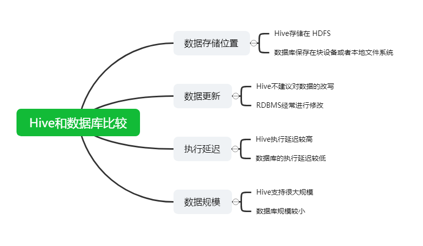

# 大数据面试总结

## 一、HDFS

### 1. 请说下HDFS读写流程

> 这个问题虽然见过无数次，面试官问过无数次，还是有不少面试者不能完整的说出来，所以请务必记住。并且很多问题都是从HDFS读写流程中引申出来的。

**HDFS写流程**：

1. Client客户端发送上传请求，**通过RPC与NameNode建立通信**，NameNode检查该用户是否有上传权限，以及上传的文件是否在HDFS对应的目录下重名，如果这两者有任意一个不满足，则直接报错，如果两者都满足，则返回给客户端一个可以上传的信息；
2. Client根据文件的大小进行切分，默认128M一块，切分完成之后给NameNode发送请求第一个block块上传到哪些服务器上；
3. NameNode收到请求之后，根据网络拓扑和机架感知以及副本机制进行文件分配，返回可用的DataNode的地址；

> 注：Hadoop在设计时考虑到数据的安全与高效, **数据文件默认在HDFS上存放三份, 存储策略为本地一份，同机架内其它某一节点上一份, 不同机架的某一节点上一份**。

1. 客户端收到地址之后与服务器地址列表中的一个节点如A进行通信，本质上就是RPC调用，建立pipeline，A收到请求后会继续调用B，B在调用C，将整个pipeline建立完成，逐级返回Client；
2. Client开始向A上发送第一个block（**先从磁盘读取数据然后放到本地内存缓存**），**以packet（数据包，64kb）为单位，A收到一个packet就会发送给B，然后B发送给C，A每传完一个packet就会放入一个应答队列等待应答**；
3. 数据被分割成一个个的packet数据包在pipeline上依次传输，**在pipeline反向传输中，逐个发送ack（命令正确应答）**，最终由pipeline中第一个DataNode节点A将pipelineack发送给Client；
4. 当一个block传输完成之后, Client再次请求NameNode上传第二个block，NameNode重新选择三台DataNode给Client。

**HDFS读流程**：

1. Client向NameNode发送RPC请求。请求文件block的位置；
2. NameNode收到请求之后会检查用户权限以及是否有这个文件，如果都符合，则会视情况返回部分或全部的block列表，对于每个block，NameNode都会返回含有该block副本的DataNode地址；这些返回的DataNode地址，会按照集群拓扑结构得出DataNode与客户端的距离，然后进行排序，**排序两个规则**：网络拓扑结构中距离 Client 近的排靠前；心跳机制中超时汇报的DataNode状态为STALE，这样的排靠后；
3. Client选取排序靠前的DataNode来读取block，如果客户端本身就是DataNode,那么将从本地直接获取数据(**短路读取特性**)；
4. 底层上本质是建立Socket Stream（FSDataInputStream），重复的调用父类DataInputStream的read方法，直到这个块上的数据读取完毕；
5. 当读完列表的block后，若文件读取还没有结束，客户端会继续向NameNode 获取下一批的block列表；
6. **读取完一个block都会进行checksum验证**，如果读取DataNode时出现错误，客户端会通知NameNode，然后再从下一个拥有该block副本的DataNode 继续读；
7. **read方法是并行的读取block信息，不是一块一块的读取**；NameNode只是返回Client请求包含块的DataNode地址，**并不是返回请求块的数据**；
8. 最终读取来所有的block会合并成一个完整的最终文件；

### 2. HDFS在读取文件的时候，如果其中一个块突然损坏了怎么办

客户端读取完DataNode上的块之后会进行checksum验证，也就是把客户端读取到本地的块与HDFS上的原始块进行校验，如果发现校验结果不一致，客户端会通知NameNode，然后再**从下一个拥有该block副本的DataNode继续读**。

### 3. HDFS在上传文件的时候，如果其中一个DataNode突然挂掉了怎么办

客户端上传文件时与DataNode建立pipeline管道，管道的正方向是客户端向DataNode发送的数据包，管道反向是DataNode向客户端发送ack确认，也就是正确接收到数据包之后发送一个已确认接收到的应答。

当DataNode突然挂掉了，客户端接收不到这个DataNode发送的ack确认，客户端会通知NameNode，NameNode检查该块的副本与规定的不符，NameNode会通知DataNode去复制副本，并将挂掉的DataNode作下线处理，不再让它参与文件上传与下载。

### 4. NameNode在启动的时候会做哪些操作

NameNode数据存储在内存和本地磁盘，本地磁盘数据存储在**fsimage镜像文件和edits编辑日志文件**。

*首次启动NameNode*：

1. **格式化文件系统，为了生成fsimage镜像文件**；
2. 启动NameNode：
   - 读取fsimage文件，将文件内容加载进内存
   - 等待DataNade注册与发送block report
3. 启动DataNode：
   - 向NameNode注册
   - 发送block report
   - 检查fsimage中记录的块的数量和block report中的块的总数是否相同
4. 对文件系统进行操作（创建目录，上传文件，删除文件等）：
   - 此时内存中已经有文件系统改变的信息，但是磁盘中没有文件系统改变的信息，此时会将这些改变信息写入edits文件中，edits文件中存储的是文件系统元数据改变的信息。

*第二次启动NameNode*：

1. 读取fsimage和edits文件；
2. 将fsimage和edits文件合并成新的fsimage文件；
3. 创建新的edits文件，内容开始为空；
4. 启动DataNode。

### 5. Secondary NameNode了解吗，它的工作机制是怎样的

Secondary NameNode是合并NameNode的edit logs到fsimage文件中；

它的具体工作机制：

1. Secondary NameNode询问NameNode是否需要checkpoint。直接带回NameNode是否检查结果；
2. Secondary NameNode请求执行checkpoint；
3. NameNode滚动正在写的edits日志；
4. 将滚动前的编辑日志和镜像文件拷贝到Secondary NameNode；
5. Secondary NameNode加载编辑日志和镜像文件到内存，并合并；
6. 生成新的镜像文件fsimage.chkpoint；
7. 拷贝fsimage.chkpoint到NameNode；
8. NameNode将fsimage.chkpoint重新命名成fsimage；

所以如果NameNode中的元数据丢失，是可以从Secondary NameNode恢复一部分元数据信息的，但不是全部，因为NameNode正在写的edits日志还没有拷贝到Secondary NameNode，这部分恢复不了。

### 6. Secondary NameNode不能恢复NameNode的全部数据，那如何保证NameNode数据存储安全

这个问题就要说NameNode的高可用了，即 **NameNode HA**。

一个NameNode有单点故障的问题，那就配置双NameNode，配置有两个关键点，一是必须要保证这两个NameNode的元数据信息必须要同步的，二是一个NameNode挂掉之后另一个要立马补上。

1. **元数据信息同步在 HA 方案中采用的是“共享存储”**。每次写文件时，需要将日志同步写入共享存储，这个步骤成功才能认定写文件成功。然后备份节点定期从共享存储同步日志，以便进行主备切换。
2. 监控NameNode状态采用zookeeper，两个NameNode节点的状态存放在zookeeper中，另外两个NameNode节点分别有一个进程监控程序，实施读取zookeeper中有NameNode的状态，来判断当前的NameNode是不是已经down机。如果Standby的NameNode节点的ZKFC发现主节点已经挂掉，那么就会强制给原本的Active NameNode节点发送强制关闭请求，之后将备用的NameNode设置为Active。

> **如果面试官再问HA中的 共享存储 是怎么实现的知道吗？**
>  可以进行解释下：NameNode 共享存储方案有很多，比如Linux HA, VMware FT, QJM等，目前社区已经把由Clouderea公司实现的基于QJM（Quorum Journal Manager）的方案合并到HDFS的trunk之中并且作为**默认的共享存储**实现。
>  基于QJM的共享存储系统**主要用于保存EditLog，并不保存FSImage文件**。FSImage文件还是在NameNode的本地磁盘上。
>  QJM共享存储的基本思想来自于Paxos算法，采用多个称为JournalNode的节点组成的JournalNode集群来存储EditLog。每个JournalNode保存同样的EditLog副本。每次NameNode写EditLog的时候，除了向本地磁盘写入 EditLog  之外，也会并行地向JournalNode集群之中的每一个JournalNode发送写请求，只要大多数的JournalNode节点返回成功就认为向JournalNode集群写入EditLog成功。如果有2N+1台JournalNode，那么根据大多数的原则，最多可以容忍有N台JournalNode节点挂掉。

### 7. 在NameNode HA中，会出现脑裂问题吗？怎么解决脑裂

> 假设 NameNode1 当前为 Active 状态，NameNode2 当前为 Standby 状态。如果某一时刻 NameNode1 对应的  ZKFailoverController 进程发生了“假死”现象，那么 Zookeeper 服务端会认为 NameNode1  挂掉了，根据前面的主备切换逻辑，NameNode2 会替代 NameNode1 进入 Active 状态。但是此时 NameNode1  可能仍然处于 Active 状态正常运行，这样 NameNode1 和 NameNode2 都处于 Active  状态，都可以对外提供服务。这种情况称为脑裂。

脑裂对于NameNode这类对数据一致性要求非常高的系统来说是灾难性的，数据会发生错乱且无法恢复。zookeeper社区对这种问题的解决方法叫做 fencing，中文翻译为隔离，也就是想办法把旧的 Active NameNode 隔离起来，使它不能正常对外提供服务。

在进行 fencing 的时候，会执行以下的操作：

1. 首先尝试调用这个旧 Active NameNode 的 HAServiceProtocol RPC 接口的 transitionToStandby 方法，看能不能把它转换为 Standby 状态。
2. 如果 transitionToStandby 方法调用失败，那么就执行 Hadoop 配置文件之中预定义的隔离措施，Hadoop 目前主要提供两种隔离措施，通常会选择 sshfence：
   - sshfence：通过 SSH 登录到目标机器上，执行命令 fuser 将对应的进程杀死；
   - shellfence：执行一个用户自定义的 shell 脚本来将对应的进程隔离。

### 8. 小文件过多会有什么危害，如何避免

Hadoop上大量HDFS元数据信息存储在NameNode内存中,因此过多的小文件必定会压垮NameNode的内存。

每个元数据对象约占150byte，所以如果有1千万个小文件，每个文件占用一个block，则NameNode大约需要2G空间。如果存储1亿个文件，则NameNode需要20G空间。

显而易见的解决这个问题的方法就是合并小文件,可以选择在客户端上传时执行一定的策略先合并,或者是使用Hadoop的`CombineFileInputFormat\<K,V\>`实现小文件的合并。

### 9. 请说下HDFS的组织架构

1. **Client**：客户端
   - 切分文件。文件上传HDFS的时候，Client将文件切分成一个一个的Block，然后进行存储
   - 与NameNode交互，获取文件的位置信息
   - 与DataNode交互，读取或者写入数据
   - Client提供一些命令来管理HDFS，比如启动关闭HDFS、访问HDFS目录及内容等
2. **NameNode**：名称节点，也称主节点，存储数据的元数据信息，不存储具体的数据
   - 管理HDFS的名称空间
   - 管理数据块（Block）映射信息
   - 配置副本策略
   - 处理客户端读写请求
3. **DataNode**：数据节点，也称从节点。NameNode下达命令，DataNode执行实际的操作
   - 存储实际的数据块
   - 执行数据块的读/写操作
4. **Secondary NameNode**：并非NameNode的热备。当NameNode挂掉的时候，它并不能马上替换NameNode并提供服务
   - 辅助NameNode，分担其工作量
   - 定期合并Fsimage和Edits，并推送给NameNode
   - 在紧急情况下，可辅助恢复NameNode

### 10. 请说下MR中Map Task的工作机制

**简单概述**：

inputFile通过split被切割为多个split文件，通过Record按行读取内容给map（自己写的处理逻辑的方法） ，数据被map处理完之后交给OutputCollect收集器，对其结果key进行分区（默认使用的hashPartitioner），然后写入buffer，**每个map task 都有一个内存缓冲区**（环形缓冲区），存放着map的输出结果，当缓冲区快满的时候需要将缓冲区的数据以一个临时文件的方式溢写到磁盘，当整个map task 结束后再对磁盘中这个maptask产生的所有临时文件做合并，生成最终的正式输出文件，然后等待reduce task的拉取。

**详细步骤**：

1. 读取数据组件 InputFormat (默认 TextInputFormat) 会通过 getSplits 方法对输入目录中的文件进行逻辑切片规划得到 block，有多少个 block就对应启动多少个 MapTask。
2. 将输入文件切分为 block 之后，由 RecordReader 对象 (默认是LineRecordReader) 进行读取，以 \n 作为分隔符,  读取一行数据, 返回 <key，value>， Key 表示每行首字符偏移值，Value 表示这一行文本内容。
3. 读取 block 返回 <key,value>, 进入用户自己继承的 Mapper 类中，执行用户重写的 map 函数，RecordReader 读取一行这里调用一次。
4. Mapper 逻辑结束之后，将 Mapper 的每条结果通过 context.write 进行collect数据收集。在 collect 中，会先对其进行分区处理，默认使用 HashPartitioner。
5. **接下来，会将数据写入内存，内存中这片区域叫做环形缓冲区(默认100M)，缓冲区的作用是 批量收集 Mapper 结果，减少磁盘 IO 的影响。我们的 Key/Value 对以及 Partition  的结果都会被写入缓冲区。当然，写入之前，Key 与 Value 值都会被序列化成字节数组**。
6. 当环形缓冲区的数据达到溢写比列(默认0.8)，也就是80M时，溢写线程启动，**需要对这 80MB 空间内的 Key 做排序 (Sort)**。排序是 MapReduce 模型默认的行为，这里的排序也是对序列化的字节做的排序。
7. 合并溢写文件，每次溢写会在磁盘上生成一个临时文件 (写之前判断是否有 Combiner)，如果 Mapper  的输出结果真的很大，有多次这样的溢写发生，磁盘上相应的就会有多个临时文件存在。当整个数据处理结束之后开始对磁盘中的临时文件进行 Merge  合并，因为最终的文件只有一个写入磁盘，并且为这个文件提供了一个索引文件，以记录每个reduce对应数据的偏移量。

### 11. 请说下MR中Reduce Task的工作机制

**简单描述**：

Reduce 大致分为 copy、sort、reduce 三个阶段，重点在前两个阶段。

copy 阶段包含一个 eventFetcher 来获取已完成的 map 列表，由 Fetcher 线程去 copy 数据，在此过程中会启动两个  merge 线程，分别为 inMemoryMerger 和 onDiskMerger，分别将内存中的数据 merge 到磁盘和将磁盘中的数据进行 merge。待数据 copy 完成之后，copy 阶段就完成了。

开始进行 sort 阶段，sort 阶段主要是执行 finalMerge 操作，纯粹的 sort 阶段，完成之后就是 reduce 阶段，调用用户定义的 reduce 函数进行处理。

**详细步骤**：

1. **Copy阶段**：简单地拉取数据。Reduce进程启动一些数据copy线程(Fetcher)，通过HTTP方式请求maptask获取属于自己的文件（map task 的分区会标识每个map task属于哪个reduce task ，默认reduce task的标识从0开始）。

2. **Merge阶段**：在远程拷贝数据的同时，ReduceTask启动了两个后台线程对内存和磁盘上的文件进行合并，以防止内存使用过多或磁盘上文件过多。

   merge有三种形式：内存到内存；内存到磁盘；磁盘到磁盘。默认情况下第一种形式不启用。当内存中的数据量到达一定阈值，就直接启动内存到磁盘的merge。与map端类似，这也是溢写的过程，这个过程中如果你设置有Combiner，也是会启用的，然后在磁盘中生成了众多的溢写文件。内存到磁盘的merge方式一直在运行，直到没有map端的数据时才结束，然后启动第三种磁盘到磁盘的merge方式生成最终的文件。

3. **合并排序**：把分散的数据合并成一个大的数据后，还会再对合并后的数据排序。

4. **对排序后的键值对调用reduce方法**：键相等的键值对调用一次reduce方法，每次调用会产生零个或者多个键值对，最后把这些输出的键值对写入到HDFS文件中。

### 12. 请说下MR中Shuffle阶段

shuffle阶段分为四个步骤：依次为：分区，排序，规约，分组，其中前三个步骤在map阶段完成，最后一个步骤在reduce阶段完成。

shuffle 是 Mapreduce 的核心，它分布在 Mapreduce 的 map 阶段和 reduce 阶段。一般把从 Map 产生输出开始到 Reduce 取得数据作为输入之前的过程称作 shuffle。

1. **Collect阶段**：将 MapTask 的结果输出到默认大小为 100M 的环形缓冲区，保存的是 key/value，Partition 分区信息等。
2. **Spill阶段**：当内存中的数据量达到一定的阀值的时候，就会将数据写入本地磁盘，在将数据写入磁盘之前需要对数据进行一次排序的操作，如果配置了 combiner，还会将有相同分区号和 key 的数据进行排序。
3. **MapTask阶段的Merge**：把所有溢出的临时文件进行一次合并操作，以确保一个 MapTask 最终只产生一个中间数据文件。
4. **Copy阶段**：ReduceTask 启动 Fetcher 线程到已经完成 MapTask 的节点上复制一份属于自己的数据，这些数据默认会保存在内存的缓冲区中，当内存的缓冲区达到一定的阀值的时候，就会将数据写到磁盘之上。
5. **ReduceTask阶段的Merge**：在 ReduceTask 远程复制数据的同时，会在后台开启两个线程对内存到本地的数据文件进行合并操作。
6. **Sort阶段**：在对数据进行合并的同时，会进行排序操作，由于 MapTask 阶段已经对数据进行了局部的排序，ReduceTask 只需保证 Copy 的数据的最终整体有效性即可。

> Shuffle 中的缓冲区大小会影响到 mapreduce 程序的执行效率，原则上说，缓冲区越大，磁盘io的次数越少，执行速度就越快。
>  缓冲区的大小可以通过参数调整,  参数：`mapreduce.task.io.sort.mb`  默认100M

### 13. Shuffle阶段的数据压缩机制了解吗

在shuffle阶段，可以看到数据通过大量的拷贝，从map阶段输出的数据，都要通过网络拷贝，发送到reduce阶段，这一过程中，涉及到大量的网络IO，如果数据能够进行压缩，那么数据的发送量就会少得多。

hadoop当中支持的压缩算法：
 gzip、bzip2、LZO、LZ4、**Snappy**，这几种压缩算法综合压缩和解压缩的速率，谷歌的Snappy是最优的，一般都选择Snappy压缩。谷歌出品，必属精品。

### 14. 在写MR时，什么情况下可以使用规约

规约（combiner）是不能够影响任务的运行结果的局部汇总，适用于求和类，不适用于求平均值，如果reduce的输入参数类型和输出参数的类型是一样的，则规约的类可以使用reduce类，只需要在驱动类中指明规约的类即可。

### 15. YARN集群的架构和工作原理知道多少

YARN的基本设计思想是将MapReduce V1中的JobTracker拆分为两个独立的服务：ResourceManager和ApplicationMaster。

ResourceManager负责整个系统的资源管理和分配，ApplicationMaster负责单个应用程序的的管理。

1. **ResourceManager**： RM是一个全局的资源管理器，负责整个系统的资源管理和分配，它主要由两个部分组成：调度器（Scheduler）和应用程序管理器（Application Manager）。

调度器根据容量、队列等限制条件，将系统中的资源分配给正在运行的应用程序，在保证容量、公平性和服务等级的前提下，优化集群资源利用率，让所有的资源都被充分利用应用程序管理器负责管理整个系统中的所有的应用程序，包括应用程序的提交、与调度器协商资源以启动ApplicationMaster、监控ApplicationMaster运行状态并在失败时重启它。

2. **ApplicationMaster**： 用户提交的一个应用程序会对应于一个ApplicationMaster，它的主要功能有：

- 与RM调度器协商以获得资源，资源以Container表示。
- 将得到的任务进一步分配给内部的任务。
- 与NM通信以启动/停止任务。
- 监控所有的内部任务状态，并在任务运行失败的时候重新为任务申请资源以重启任务。

3. **NodeManager**： NodeManager是每个节点上的资源和任务管理器，一方面，它会定期地向RM汇报本节点上的资源使用情况和各个Container的运行状态；另一方面，他接收并处理来自AM的Container启动和停止请求。

4. **Container**： Container是YARN中的资源抽象，封装了各种资源。**一个应用程序会分配一个Container，这个应用程序只能使用这个Container中描述的资源**。不同于MapReduceV1中槽位slot的资源封装，Container是一个动态资源的划分单位，更能充分利用资源。

### 16. YARN的任务提交流程是怎样的

当jobclient向YARN提交一个应用程序后，YARN将分两个阶段运行这个应用程序：一是启动ApplicationMaster;第二个阶段是由ApplicationMaster创建应用程序，为它申请资源，监控运行直到结束。 具体步骤如下:

1. 用户向YARN提交一个应用程序，并指定ApplicationMaster程序、启动ApplicationMaster的命令、用户程序。
2. RM为这个应用程序分配第一个Container，并与之对应的NM通讯，要求它在这个Container中启动应用程序ApplicationMaster。
3. ApplicationMaster向RM注册，然后拆分为内部各个子任务，为各个内部任务申请资源，并监控这些任务的运行，直到结束。
4. AM采用轮询的方式向RM申请和领取资源。
5. RM为AM分配资源，以Container形式返回。
6. AM申请到资源后，便与之对应的NM通讯，要求NM启动任务。
7. NodeManager为任务设置好运行环境，将任务启动命令写到一个脚本中，并通过运行这个脚本启动任务。
8. 各个任务向AM汇报自己的状态和进度，以便当任务失败时可以重启任务。
9. 应用程序完成后，ApplicationMaster向ResourceManager注销并关闭自己。

### 17. YARN的资源调度三种模型了解吗

在Yarn中有三种调度器可以选择：FIFO Scheduler ，Capacity Scheduler，Fair Scheduler。

Apache版本的hadoop默认使用的是Capacity  Scheduler调度方式。CDH版本的默认使用的是Fair Scheduler调度方式

**FIFO Scheduler**（先来先服务）：

FIFO Scheduler把应用按提交的顺序排成一个队列，这是一个先进先出队列，在进行资源分配的时候，先给队列中最头上的应用进行分配资源，待最头上的应用需求满足后再给下一个分配，以此类推。

FIFO Scheduler是最简单也是最容易理解的调度器，也不需要任何配置，但它并不适用于共享集群。大的应用可能会占用所有集群资源，这就导致其它应用被阻塞，比如有个大任务在执行，占用了全部的资源，再提交一个小任务，则此小任务会一直被阻塞。

**Capacity Scheduler**（能力调度器）：

对于Capacity调度器，有一个专门的队列用来运行小任务，但是为小任务专门设置一个队列会预先占用一定的集群资源，这就导致大任务的执行时间会落后于使用FIFO调度器时的时间。

**Fair Scheduler**（公平调度器）：

在Fair调度器中，我们不需要预先占用一定的系统资源，Fair调度器会为所有运行的job动态的调整系统资源。

比如：当第一个大job提交时，只有这一个job在运行，此时它获得了所有集群资源；当第二个小任务提交后，Fair调度器会分配一半资源给这个小任务，让这两个任务公平的共享集群资源。

需要注意的是，在Fair调度器中，从第二个任务提交到获得资源会有一定的延迟，因为它需要等待第一个任务释放占用的Container。小任务执行完成之后也会释放自己占用的资源，大任务又获得了全部的系统资源。最终的效果就是Fair调度器即得到了高的资源利用率又能保证小任务及时完成。

## 二、Hive

### 1.请说下Hive和数据库的区别



Hive 和数据库除了拥有类似的查询语言，再无类似之处。 

1）[数据存储](https://cloud.tencent.com/product/cdcs?from=10680)位置 Hive 存储在 HDFS 。数据库将数据保存在块设备或者本地文件系统中。 

2）数据更新 Hive中不建议对数据的改写。而数据库中的数据通常是需要经常进行修改的。

3）执行延迟 Hive 执行延迟较高。数据库的执行延迟较低。当然，这个是有条件的，即数据规模较小，当数据规模大到超过数据库的处理能力的时候，Hive的[并行计算](https://cloud.tencent.com/product/gpu?from=10680)显然能体现出优势。 

4）数据规模 Hive支持很大规模的数据计算；数据库可以支持的数据规模较小。

### 2.内部表和外部表

1）内部表`又叫管理表`：当我们删除一个管理表时，Hive也会删除这个`表数据`。管理表不适合和其他工具共享数据。 

2）外部表：删除该表并不会删除掉原始数据，删除的是表的`元数据`。

详答版：

>  未被 external 修饰的是内部表（managed table），被 external 修饰的为外部表 （external table）
>
>  区别：  内部表数据由 Hive 自身管理，外部表数据由 HDFS 管理；  
>
> 内部表数据存储的位置是hive.metastore.warehouse.dir（默认：/user/hive/warehouse），外部表数据的存储位置由自己制定（如果没有 LOCATION， Hive 将在HDFS上的/user/hive/warehouse 文件夹下以外部表的表名创建一个文件夹，并将属于这个表的数据存放在这里）； 
>
> 删除内部表会直接删除元数据（metadata）及存储数据；删除外部表仅仅会删除元数据，HDFS 上的文件并不会被删除； 

### 3.Hive中order by，sort by，distribute by和cluster by的区别

`Sort By`：在同一个分区内排序 

`Order By`：全局排序，只有一个Reducer； 

`Distrbute By`：类似 MapReduce 中Partition，进行分区，一般结合sort by使用。 

`Cluster By`：当 Distribute by 和 Sort by 字段相同时，可以使用Cluster by方式。 Cluster by 除了具有 Distribute by 的功能外还兼具 Sort by 的功能。但是只能升序排序，不能指定排序规则为ASC或者DESC。

### 4.UDF、UDAF、UDTF的区别

当Hive自带的函数无法满足我们的业务处理需求时，hive允许我们自定义函数来满足需求。

 根据自定义函数的类别分为以下三种：

- `UDF：User-Defined-Function`，用户自定义函数，数据是一进一出，功能类似于大多数数学函数或者字符串处理函数； 
- `UDAF：User-Defined Aggregation Function`，用户自定义聚合函数，数据是多进一出，功能类似于 count/max/min； 
- `UDTF：User-Defined Table-Generating Functions`，用户自定义表生成函数，数据是一进多处，功能类似于lateral view explore()；

### 5.Rank排名函数

- RANK() 排序相同时会重复，总数`不会变`； 

- DENSE_RANK() 排序相同时会重复，总数`会减少`； 
- ROW_NUMBER() 根据`顺序`计算排名。 在实际开发中，以上三个rank函数通常是和开窗函数一起使用的。

### 6. Hive有索引吗

Hive支持索引（3.0版本之前），但是Hive的索引与关系型数据库中的索引并不相同，比如，Hive不支持主键或者外键。并且Hive索引提供的功能很有限，效率也并不高，因此Hive索引很少使用。

- 索引适用的场景：

适用于不更新的静态字段。以免总是重建索引数据。每次建立、更新数据后，都要重建索引以构建索引表。

- Hive索引的机制如下：

hive在指定列上建立索引，会产生一张索引表（Hive的一张物理表），里面的字段包括：索引列的值、该值对应的HDFS文件路径、该值在文件中的偏移量。

Hive 0.8版本后引入bitmap索引处理器，这个处理器适用于去重后，值较少的列（例如，某字段的取值只可能是几个枚举值） 因为索引是用空间换时间，索引列的取值过多会导致建立bitmap索引表过大。

**注意**：Hive中每次有数据时需要及时更新索引，相当于重建一个新表，否则会影响数据查询的效率和准确性，**Hive官方文档已经明确表示Hive的索引不推荐被使用，在新版本的Hive中已经被废弃了**。

**扩展**：Hive是在0.7版本之后支持索引的，在0.8版本后引入bitmap索引处理器，在3.0版本开始移除索引的功能，取而代之的是2.3版本开始的物化视图，自动重写的物化视图替代了索引的功能。

### 7. 运维如何对hive进行调度

1. 将hive的sql定义在脚本当中；
2. 使用azkaban或者oozie进行任务的调度；
3. 监控任务调度页面。

### 8. ORC、Parquet等列式存储的优点

ORC和Parquet都是高性能的存储方式，这两种存储格式总会带来存储和性能上的提升。

**Parquet**:

1. Parquet支持嵌套的数据模型，类似于Protocol Buffers，每一个数据模型的schema包含多个字段，每一个字段有三个属性：重复次数、数据类型和字段名。
    重复次数可以是以下三种：required(只出现1次)，repeated(出现0次或多次)，optional(出现0次或1次)。每一个字段的数据类型可以分成两种： group(复杂类型)和primitive(基本类型)。
2. Parquet中没有Map、Array这样的复杂数据结构，但是可以通过repeated和group组合来实现的。
3. 由于Parquet支持的数据模型比较松散，可能一条记录中存在比较深的嵌套关系，如果为每一条记录都维护一个类似的树状结可能会占用较大的存储空间，因此Dremel论文中提出了一种高效的对于嵌套数据格式的压缩算法：Striping/Assembly算法。通过Striping/Assembly算法，parquet可以使用较少的存储空间表示复杂的嵌套格式，并且通常Repetition level和Definition level都是较小的整数值，可以通过RLE算法对其进行压缩，进一步降低存储空间。
4. Parquet文件是以二进制方式存储的，是不可以直接读取和修改的，Parquet文件是自解析的，文件中包括该文件的数据和元数据。

**ORC**:

1. ORC文件是自描述的，它的元数据使用Protocol Buffers序列化，并且文件中的数据尽可能的压缩以降低存储空间的消耗。
2. 和Parquet类似，ORC文件也是以二进制方式存储的，所以是不可以直接读取，ORC文件也是自解析的，它包含许多的元数据，这些元数据都是同构ProtoBuffer进行序列化的。
3. ORC会尽可能合并多个离散的区间尽可能的减少I/O次数。
4. ORC中使用了更加精确的索引信息，使得在读取数据时可以指定从任意一行开始读取，更细粒度的统计信息使得读取ORC文件跳过整个row group，ORC默认会对任何一块数据和索引信息使用ZLIB压缩，因此ORC文件占用的存储空间也更小。
5. 在新版本的ORC中也加入了对Bloom Filter的支持，它可以进一 步提升谓词下推的效率，在Hive 1.2.0版本以后也加入了对此的支 持。

### 9. 数据建模用的哪些模型？

1. 星型模型


星形模式(Star Schema)是最常用的维度建模方式。星型模式是以事实表为中心，所有的维度表直接连接在事实表上，像星星一样。 星形模式的维度建模由一个事实表和一组维表成，且具有以下特点：

a. 维表只和事实表关联，维表之间没有关联；

b. 每个维表主键为单列，且该主键放置在事实表中，作为两边连接的外键；

c. 以事实表为核心，维表围绕核心呈星形分布。

2. 雪花模型


雪花模式(Snowflake Schema)是对星形模式的扩展。**雪花模式的维度表可以拥有其他维度表的**，虽然这种模型相比星型更规范一些，但是由于这种模型不太容易理解，维护成本比较高，而且性能方面需要关联多层维表，性能比星型模型要低。

3. 星座模型


星座模式是星型模式延伸而来，星型模式是基于一张事实表的，而**星座模式是基于多张事实表的，而且共享维度信息**。前面介绍的两种维度建模方法都是多维表对应单事实表，但在很多时候维度空间内的事实表不止一个，而一个维表也可能被多个事实表用到。在业务发展后期，绝大部分维度建模都采用的是星座模式。

数仓建模详细介绍可查看：[通俗易懂数仓建模](https://mp.weixin.qq.com/s/-W4Fh3fDhMJTyj92RuNOaw)

### 10. 为什么要对数据仓库分层？

- **用空间换时间**，通过大量的预处理来提升应用系统的用户体验（效率），因此数据仓库会存在大量冗余的数据。
- 如果不分层的话，如果源业务系统的业务规则发生变化将会影响整个数据清洗过程，工作量巨大。
- **通过数据分层管理可以简化数据清洗的过程**，因为把原来一步的工作分到了多个步骤去完成，相当于把一个复杂的工作拆成了多个简单的工作，把一个大的黑盒变成了一个白盒，每一层的处理逻辑都相对简单和容易理解，这样我们比较容易保证每一个步骤的正确性，当数据发生错误的时候，往往我们只需要局部调整某个步骤即可。

数据仓库详细介绍可查看：[万字详解整个数据仓库建设体系](https://mp.weixin.qq.com/s/h6HnkROzljralUj2aZyNUQ)

### 11. 使用过Hive解析JSON串吗

**Hive处理json数据总体来说有两个方向的路走**：

1. 将json以字符串的方式整个入Hive表，然后通过使用UDF函数解析已经导入到hive中的数据，比如使用`LATERAL VIEW json_tuple`的方法，获取所需要的列名。
2. 在导入之前将json拆成各个字段，导入Hive表的数据是已经解析过的。这将需要使用第三方的 SerDe。

详细介绍可查看：[Hive解析Json数组超全讲解](https://mp.weixin.qq.com/s/awCvlb9BzCRX-Da1_l1FYg)

### 12. sort by 和 order by 的区别

**order by 会对输入做全局排序，因此只有一个reducer**（多个reducer无法保证全局有序）只有一个reducer，会导致当输入规模较大时，需要较长的计算时间。

sort by不是全局排序，其在数据进入reducer前完成排序. 因此，如果用sort by进行排序，并且设置mapred.reduce.tasks>1， 则**sort by只保证每个reducer的输出有序，不保证全局有序**。

### 13. 数据倾斜怎么解决

数据倾斜问题主要有以下几种：

1. 空值引发的数据倾斜
2. 不同数据类型引发的数据倾斜
3. 不可拆分大文件引发的数据倾斜
4. 数据膨胀引发的数据倾斜
5. 表连接时引发的数据倾斜
6. 确实无法减少数据量引发的数据倾斜

以上倾斜问题的具体解决方案可查看：[Hive千亿级数据倾斜解决方案](https://mp.weixin.qq.com/s/hz_6io_ZybbOlmBQE4KSBQ)

**注意**：对于 left join 或者 right join 来说，不会对关联的字段自动去除null值，对于 inner join 来说，会对关联的字段自动去除null值。

小伙伴们在阅读时注意下，在上面的文章（Hive千亿级数据倾斜解决方案）中，有一处sql出现了上述问题（举例的时候原本是想使用left join的，结果手误写成了join）。此问题由公众号读者发现，感谢这位读者指正。

### 14. Hive 小文件过多怎么解决

#### 1. 使用 hive 自带的 concatenate 命令，自动合并小文件

使用方法：

```sql
#对于非分区表
alter table A concatenate;

#对于分区表
alter table B partition(day=20201224) concatenate;
```

> 注意：
>  1、concatenate 命令只支持 RCFILE 和 ORC 文件类型。
>  2、使用concatenate命令合并小文件时不能指定合并后的文件数量，但可以多次执行该命令。
>  3、当多次使用concatenate后文件数量不在变化，这个跟参数 mapreduce.input.fileinputformat.split.minsize=256mb 的设置有关，可设定每个文件的最小size。

#### 2. 调整参数减少Map数量

设置map输入合并小文件的相关参数（执行Map前进行小文件合并）：

在mapper中将多个文件合成一个split作为输入（`CombineHiveInputFormat`底层是Hadoop的`CombineFileInputFormat`方法）：

```sql
set hive.input.format=org.apache.hadoop.hive.ql.io.CombineHiveInputFormat; -- 默认
```

每个Map最大输入大小（这个值决定了合并后文件的数量）：

```sql
set mapred.max.split.size=256000000;   -- 256M
```

一个节点上split的至少大小（这个值决定了多个DataNode上的文件是否需要合并）：

```sql
set mapred.min.split.size.per.node=100000000;  -- 100M
```

一个交换机下split的至少大小(这个值决定了多个交换机上的文件是否需要合并)：

```sql
set mapred.min.split.size.per.rack=100000000;  -- 100M
```

#### 3. 减少Reduce的数量

reduce 的个数决定了输出的文件的个数，所以可以调整reduce的个数控制hive表的文件数量。

hive中的分区函数 distribute by 正好是控制MR中partition分区的，可以通过设置reduce的数量，结合分区函数让数据均衡的进入每个reduce即可：

```sql
#设置reduce的数量有两种方式，第一种是直接设置reduce个数
set mapreduce.job.reduces=10;

#第二种是设置每个reduce的大小，Hive会根据数据总大小猜测确定一个reduce个数
set hive.exec.reducers.bytes.per.reducer=5120000000; -- 默认是1G，设置为5G

#执行以下语句，将数据均衡的分配到reduce中
set mapreduce.job.reduces=10;
insert overwrite table A partition(dt)
select * from B
distribute by rand();
```

对于上述语句解释：如设置reduce数量为10，使用 rand()， 随机生成一个数 `x % 10` ， 这样数据就会随机进入 reduce 中，防止出现有的文件过大或过小。

#### 4. 使用hadoop的archive将小文件归档

Hadoop Archive简称HAR，是一个高效地将小文件放入HDFS块中的文件存档工具，它能够将多个小文件打包成一个HAR文件，这样在减少namenode内存使用的同时，仍然允许对文件进行透明的访问。

```sql
#用来控制归档是否可用
set hive.archive.enabled=true;
#通知Hive在创建归档时是否可以设置父目录
set hive.archive.har.parentdir.settable=true;
#控制需要归档文件的大小
set har.partfile.size=1099511627776;

使用以下命令进行归档：
ALTER TABLE A ARCHIVE PARTITION(dt='2021-05-07', hr='12');

对已归档的分区恢复为原文件：
ALTER TABLE A UNARCHIVE PARTITION(dt='2021-05-07', hr='12');
```

> 注意:
>  **归档的分区可以查看不能 insert overwrite，必须先 unarchive**

Hive 小文件问题具体可查看：[解决hive小文件过多问题](https://mp.weixin.qq.com/s?__biz=Mzg2MzU2MDYzOA==&mid=2247483683&idx=1&sn=14b25010032bdf0d375080e48de36d7f&chksm=ce77f7f2f9007ee49d773367f2d7abbf708a2e0e18a55794fcd797944ac73ccc88a41d253d6b&token=1679639512&lang=zh_CN#rd)

### 15. Hive优化有哪些

**1. 数据存储及压缩**

针对hive中表的存储格式通常有orc和parquet，压缩格式一般使用snappy。相比与textfile格式表，orc占有更少的存储。因为hive底层使用MR计算架构，数据流是hdfs到磁盘再到hdfs，而且会有很多次，所以使用orc数据格式和snappy压缩策略可以降低IO读写，还能降低网络传输量，这样在一定程度上可以节省存储，还能提升hql任务执行效率；

**2. 通过调参优化**

并行执行，调节parallel参数；

调节jvm参数，重用jvm；

设置map、reduce的参数；开启strict mode模式；

关闭推测执行设置。

**3. 有效地减小数据集将大表拆分成子表；结合使用外部表和分区表。**

**4. SQL优化**

- 大表对大表：尽量减少数据集，可以通过分区表，避免扫描全表或者全字段；
- 大表对小表：设置自动识别小表，将小表放入内存中去执行。

Hive优化详细剖析可查看：[Hive企业级性能优化](https://mp.weixin.qq.com/s/0YL0skTG9448Os3Md7CIzg)

## 三、HBase

### 1. Hbase的功能与应用场景？

- 功能：Hbase是一个分布式的、基于分布式`内存和HDFS`的按列存储的`NoSQL`数据库

- 应用：Hbase适合于需要实时的对大量数据进行`快速、随机读写`访问的场景

### 2. Hbase有什么特点？

- `分布式`的，可以实现高并发的数据读写 
- `上层`构建分布式内存，可以实现高性能、随机、实时的读写 
- `底层`基于HDFS，可以实现大数据
- `按列存储`，基于列实现数据存储，灵活性更高

### 3. Hbase设计思想是什么？

设计思想、`冷热数据分离`，Hbase将新数据直接写入内存中，如果内存中存储的数据过多，就将内存的数据写入HDFS 

–热数据是指刚产生的数据，先写内存，大概率的情况下，可以直接从内存中读取 

–冷数据是指先产生的数据，将内存中产生很久的数据写入HDFS中，被读取的概率较小

### 4. Hbase与HDFS的区别是什么？

- Hbase是一个高性能实时随机读写数据的数据库存储系统，用于实现`实时`数据存储 
- HDFS是一个分布式离线大数据文件存储系统，用于实现`离线`的文件存储

### 5. Hbase与MySQL的区别是什么？

- HBase是分布式NoSQL数据库，可以实现高性能的`大数据`存储
- MySQL是RDBMS关系型数据库，只能实现`小数据量`的结构化数据存储

### 6. Hbase与Hive的区别是什么？

- Hive是通过构建元数据，映射HDFS文件构建成表，本质还是HDFS，实现`离线`大数据仓库

- Hbase是通过构建上层分布式内存，底层HDFS，实现大数据`实时`存储的NoSQL数据库

### 7. Hbase的按列存储是什么？

- Hbase按列存储的设计是指Hbase中的最`小操作单元`是列，可以实现对每一行的每一列进行读写
- 每一行的列都是`动态的`，每一行可以拥有不同的列

### 8. 请简述NameSpace、Rowkey、ColumnFamily及多版本的功能及含义

- `Namespace`：命名空间，类似于数据库的设计，用于区分不同的业务表 
- `Rowkey`：行健，类似于主键的设计，唯一标识一条数据并且作为Hbase中的唯一索引 
- `ColumnFamily`：列族，用于将列进行分组，底层用于区分存储不同的列，提高查询性能 
- `多版本`：Hbase中允许一列存储多个版本的值，并通过数据写入的时间戳来区分不同版本

### 9. 请简述Hbase的分布式主从架构

- 主节点：`HMaster`：管理节点、负责管理集群的从节点、元数据以及所有Region的分配 
- 从节点：`HRegionServer`：存储节点，负责实现所有数据的存储，管理Region，构建分布式内存

### 10. 请简述Table表与RegionServer的关系

- `Table`是Hbase中的表对象，一张表可以划分为多个Region分区 
- `RegionServer`是Hbase中实现[数据存储](https://cloud.tencent.com/product/cdcs?from=10680)的节点，负责存储每个Region

## 四、Kafka

### 1. 请简述如何使用Kafka Simple Java API 实现数据消费？描述具体的类及方法

- step1：构建消费者连接对象：KafkaConsumer 

–需要配置对象：管理配置，例如连接地址：Properties

-  step2：消费者需要订阅Topic 

–KafkaConsumer：subscribe（List） 

- step3：消费数据 

–KafkaConsumer：poll：实现拉取消费数据

–ConsumerRecords：拉取到的所有数据集合 

–ConsumerRecord：消费到的每一条数据 

- topic：获取数据中的Topic 
- partition：获取数据中的分区编号 
- offset：获取数据的offset 
- key：获取数据中的Key 
- value：获取数据中的Value

### 2. 请简述Kafka生产数据时如何保证生产数据不丢失？

- acks机制：当接收方收到数据以后，就会返回一个确认的ack消息 
- 生产者向Kafka生产数据，根据配置要求Kafka返回ACK 

–ack=0：生产者不管Kafka有没有收到，直接发送下一条 

- 优点：快 •缺点：容易导致数据丢失，概率比较高 

–ack=1：生产者将数据发送给Kafka，Kafka等待这个分区leader副本写入成功，返回ack确认，生产者发送下一条 

- 优点：性能和安全上做了平衡

- 缺点：依旧存在数据丢失的概率，但是概率比较小 –ack=all/-1：生产者将数据发送给Kafka，Kafka等待这个分区所有副本全部写入，返回ack确认，生产者发送下一条

- 优点：[数据安全](https://cloud.tencent.com/solution/data_protection?from=10680) 
- 缺点：慢 
- 如果使用ack=all，可以搭配min.insync.replicas参数一起使用，可以提高效率 

–min.insync.replicas：表示最少同步几个副本以后，就返回ack 

- 如果生产者没有收到ack，就使用重试机制，重新发送上一条消息，直到收到ack

### 3. 请简述Kafka生产数据时如何保证生产数据不重复？

•数据重复的场景：Kafka写入数据，返回`ack`，但是ack丢失，生产者没有收到ack，重新写入数据，导致Kafka数据重复

•Kafka中使用幂等性机制来保证生产数据不重复 

–step1：发送数据时，给每条数据增加一个数据id的编号，每次下一条数据的编号自增1 

–step2：Kafka将数据写入，并记住写入的数据id 

–step3：如果下一条数据的id与上一次的数据id一致，就不写入，直接返回ack

### 4. Kafka中生产者的数据分区规则是什么，如何自定义分区规则？

- 如果指定了分区：就写入指定的分区 

- 如果没有指定分区，就判断是否指定了Key 

–如果指定了Key：根据Key的Hash取余分区 

–如果没有指定Key：根据黏性分区来实现 

- 自定义分区 

–开发一个类实现Partitioner接口 

–实现partition方法 

–在生产者中指定分区器的配置

### 5. Kafka中消费者消费数据的规则是什么？

- 消费者根据`Offset`对Topic中的分区进行消费 

- 第一次消费：根据auto.offset.reset属性进行消费 

–latest：从最新的位置开始消费 

–earliest：从头开始消费 

- 第二次消费：根据上一次的offset+1继续消费

### 6. 为什么要设计Segment？

- 加快查询效率：将数据划分到多个小文件中，通过offset匹配可以定位某个文件，从小数据量中找到需要的数据 

- 提高删除性能：以Segment为单位进行删除，避免以每一条数据进行删除，影响性能

### 7. 什么是AR、ISR、OSR？

- AR：all replicas 

–所有副本 = ISR + OSR 

- ISR：In-sync-replicas 

–表示正在同步的副本 =》 可用副本分区 

–如果Leader故障，会从ISR中选举一个新的leader 

- OSR：Out-sync-replicas 

–表示不健康的副本 =》 不可用副本 

–判断依据 

如果这个从副本在这个时间内没有与leader副本同步数据，认为这个副本是不正常的 参数设置: replica.lag.time.max.ms = 10000

### 8. 什么是HW、LEO？

- HW：表示当前leader副本中所有Follower都已经同步的位置 + 1，高水位线 

- LEO：表示当前leader副本最新的数据位置 + 1 

- 消费者能消费到的位置是HW：为了保证消费者消费分区数据的统一性

### 9. 什么是一次性语义？

- at-most-once：最多一次 

- at-least-once：至少一次 

- exactly-once：有且仅有一次

### 10. Kafka如何保证消费者消费数据不重复不丢失？

- Kafka消费者通过Offset实现数据消费，只要保证各种场景下能正常实现Offset的记录即可 

- 保证消费数据不重复需要每次消费处理完成以后，将Offset存储在外部存储中，例如MySQL、Zookeeper、Redis中 

- 保证以消费分区、处理分区、记录分区的offset的顺序实现消费处理 

- 如果故障重启，只要从外部系统中读取上一次的Offset继续消费即可

- 