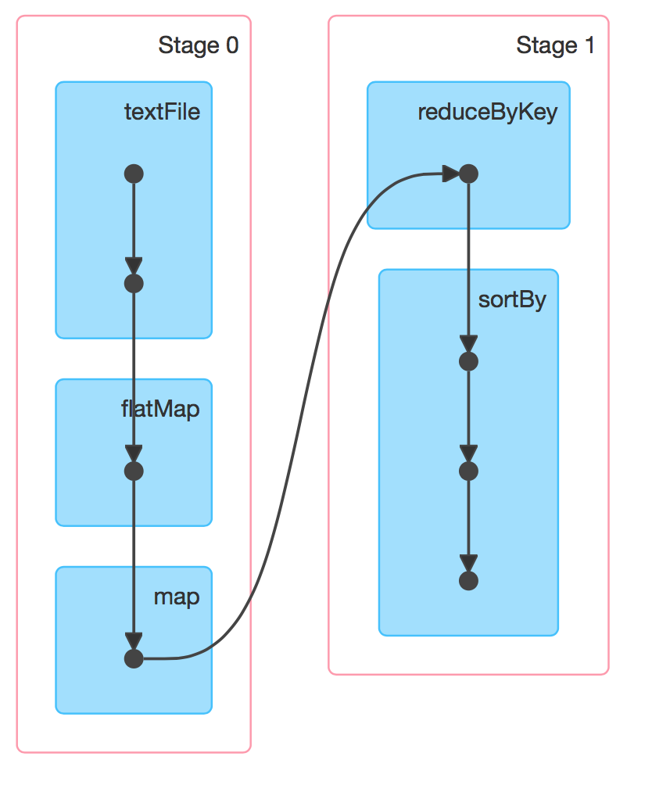
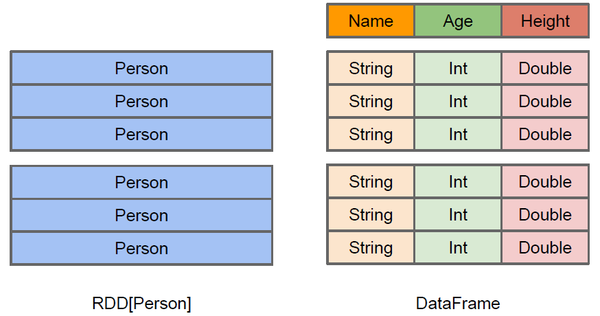
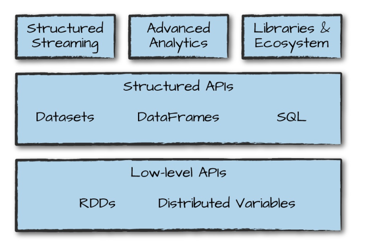

# 第一部分——Spark 基础

## 一、Spark产生的背景

MapReduce局限性：代码非常繁琐，只能支持map和reduce方法，执行效率低下。map处理完后的数据回写到磁盘上，reduce再从磁盘上把数据拉取过来，因此执行效率低下。map和reduce都会对应一个jvm，因此作业量大，则线程开销非常庞大。不适合迭代多次，交互感很低，不支持流式处理。虽然 MapReduce 提供了对数据访问和计算的抽象，但是对于数据的复用就是简单的将中间数据写到一个稳定的文件系统中(例如  HDFS)，所以会产生数据的复制备份，磁盘的 I/O 以及数据的序列化，所以在遇到需要在多个计算之间复用中间结果的操作时效率就会非常的低。

在hadoop上框架多样化，每个框架各干各自的事：批处理：MapReduce、Hive、Pig  流式处理：Strom、Jstrom  交互式计算：Impala

这使得学习、运维成本非常高。因此Spark由此而生。

## 二、Spark发展历史

1、2009年，Spark诞生于伯克利大学AMPLab，属于伯克利大学的研究性项目；

2、2010 年，通过BSD 许可协议正式对外开源发布；

3、2012年，Spark第一篇论文发布，第一个正式版（Spark 0.6.0）发布；

4、2013年，成为了Aparch基金项目；发布Spark Streaming、Spark Mllib（机器学习）、Shark（Spark on Hadoop）；

5、2014 年，Spark 成为 Apache 的顶级项目； 5 月底 Spark1.0.0 发布；发布 Spark Graphx（图计算）、Spark SQL代替Shark；

6、2015年，推出DataFrame（大数据分析）；2015年至今，Spark在国内IT行业变得愈发火爆，大量的公司开始重点部署或者使用Spark来替代MapReduce、Hive、Storm等传统的大数据计算框架；

7、2016年，推出dataset（更强的数据分析手段）；

8、2017年，structured streaming 发布；

9、2018年，Spark2.4.0发布，成为全球最大的开源项目。

## 三、Spark基本组件

Spark Core：Spark 核心 API，提供 DAG 分布式内存计算框架

Spark SQL：提供交互式查询 API

Spark Streaming：实时流处理

SparkML：机器学习 API

Spark Graphx：图形计算


## 四、Spark和Hadoop的对比

|   对比类型   |                 Hadoop                 | Spark                                                     |
| :----------: | :------------------------------------: | --------------------------------------------------------- |
|     类型     |  分布式基础平台, 包含计算, 存储, 调度  | 分布式计算工具                                            |
|     场景     |         大规模数据集上的批处理         | 迭代计算, 交互式计算, 流计算                              |
|     价格     |           对机器要求低, 便宜           | 对内存有要求, 相对较贵                                    |
|   编程范式   | Map+Reduce, API 较为底层, 算法适应性差 | RDD 组成 DAG 有向无环图, API 较为顶层, 方便使用           |
| 数据存储结构 |  读 – 处理 - 写磁盘 - 读 - 处理 - 写   | 读 - 处理 - 写内存 - 读 - 处理 -（需要的时候）写磁盘 - 写 |
|   运行方式   |    Task 以进程方式维护, 任务启动慢     | Task 以线程方式维护, 任务启动快                           |

Spark 是在借鉴了 MapReduce 之上发展而来的，继承了其分布式并行计算的优点并改进了 MapReduce 明显的缺陷，尽管 Spark 相对于 Hadoop 而言具有较大优势，但 Spark 并不能完全替代 Hadoop，Spark 主要用于替代 Hadoop  中的 MapReduce 计算模型。存储依然可以使用 HDFS，但是中间结果可以存放在内存中；调度可以使用 Spark  内置的，也可以使用更成熟的调度系统 YARN 等。

Spark 与 Hadoop 的差异具体如下：

首先，Spark 把中间数据放到内存中，迭代运算效率高。MapReduce 中计算结果需要落地，保存到磁盘上，这样势必会影响整体速度，而 Spark 支持 DAG 图（有向无环图）的分布式并行计算的编程框架，减少了迭代过程中数据的落地，提高了处理效率。（延迟加载）

其次，Spark 容错性高。Spark 引进了弹性分布式数据集 RDD (Resilient DistributedDataset) 的抽象，它是分布在一组节点中的只读对象集合，这些集合是弹性的，如果数据集一部分丢失，则可以根据“血统”（即允许基于数据衍生过程）对它们进行重建。另外在RDD 计算时可以通过 CheckPoint 来实现容错。

最后，Spark 更加通用。mapreduce 只提供了 Map 和 Reduce 两种操作，Spark 提供的数据集操作类型有很多，大致分为：Transformations 和 Actions 两大类。Transformations包括 Map、Filter、FlatMap、Sample、GroupByKey、ReduceByKey、Union、Join、Cogroup、MapValues、Sort 等多种操作类型，同时还提供 Count, Actions 包括 Collect、Reduce、Lookup 和 Save 等操作

**Spark的特点：**

1. Spark 是 MapReduce 的替代方案，而且兼容 HDFS、Hive，可融入 Hadoop 的生态系统，以弥补 MapReduce 的不足。
2. 使用先进的 DAG 调度程序，查询优化器和物理执行引擎，以实现性能上的保证；
3. 多语言支持，目前支持的有 Java，Scala，Python 和 R,提供了 80 多个高级 API，可以轻松地构建应用程序；
4. **Spark 可以用于批处理、交互式查询(Spark SQL)、实时流处理(Spark Streaming)、机器学习(Spark MLlib)和图计算(GraphX)**。这些不同类型的处理都可以在同一个应用中无缝使用；
5. 丰富的部署模式：支持本地模式和自带的集群模式，也支持在 Hadoop，Mesos，Kubernetes 上运行；
6. 多数据源支持：支持访问 HDFS，Alluxio，Cassandra，HBase，Hive 以及数百个其他数据源中的数据


## 五、集群架构

| Term（术语）    | Meaning（含义）                                              |
| --------------- | ------------------------------------------------------------ |
| Application     | Spark 应用程序，由集群上的一个 Driver 节点和多个 Executor 节点组成。 |
| Driver program  | 主运用程序，该进程运行应用的 main() 方法并且创建  SparkContext |
| Cluster manager | 集群资源管理器（例如，Standlone Manager，Mesos，YARN）       |
| Worker node     | 执行计算任务的工作节点                                       |
| Executor        | 位于工作节点上的应用进程，负责执行计算任务并且将输出数据保存到内存或者磁盘中 |
| Task            | 被发送到 Executor 中的工作单元                               |


**执行过程**：

1. 用户程序创建 Spark Context 后，它会连接到集群资源管理器，集群资源管理器会为用户程序分配计算资源，并启动 Executor；
2. Dirver 将计算程序划分为不同的执行阶段和多个 Task，之后将 Task 发送给 Executor；
3. Executor 负责执行 Task，并将执行状态汇报给 Driver，同时也会将当前节点资源的使用情况汇报给集群资源管理器。

# 第二部分——Spark Core

## 一、为什么要RDD

在许多迭代式算法(比如机器学习、图算法等)和交互式数据挖掘中，不同计算阶段之间会重用中间结果，即一个阶段的输出结果会作为下一个阶段的输入。但是，之前的 MapReduce 框架采用非循环式的数据流模型，把中间结果写入到 HDFS 中，带来了大量的数据复制、磁盘 IO  和序列化开销。且这些框架只能支持一些特定的计算模式(map/reduce)，并没有提供一种通用的数据抽象。

RDD(Resilient Distributed Dataset)叫做弹性分布式数据集，是 Spark 中最基本的数据抽象，代表一个不可变、可分区、里面的元素可并行计算的集合。 

#### RDD 主要属性

进入 RDD 的源码中看下：


在源码中可以看到有对 RDD 介绍的注释，我们来翻译下：

1. *A list of partitions* ： 一组分片(Partition)/一个分区(Partition)列表，即数据集的基本组成单位。 对于 RDD 来说，每个分片都会被一个计算任务处理，分片数决定并行度。 用户可以在创建 RDD 时指定 RDD 的分片个数，如果没有指定，那么就会采用默认值。
2. *A function for computing each split* ： 一个函数会被作用在每一个分区。 Spark 中 RDD 的计算是以分片为单位的，compute 函数会被作用到每个分区上。
3. *A list of dependencies on other RDDs* ： 一个 RDD 会依赖于其他多个 RDD。 RDD 的每次转换都会生成一个新的 RDD，所以 RDD 之间就会形成类似于流水线一样的前后依赖关系。在部分分区数据丢失时，Spark 可以通过这个依赖关系重新计算丢失的分区数据，而不是对 RDD 的所有分区进行重新计算。(Spark 的容错机制)
4. *Optionally, a Partitioner for key-value RDDs (e.g. to say that the RDD is hash-partitioned)*： 可选项，对于 KV 类型的 RDD 会有一个 Partitioner，即 RDD 的分区函数，默认为 HashPartitioner。
5. *Optionally, a list of preferred locations to compute each split on (e.g. block locations for an HDFS file)*： 可选项,一个列表，存储存取每个 Partition 的优先位置(preferred location)。 对于一个 HDFS 文件来说，这个列表保存的就是每个 Partition 所在的块的位置。按照"移动数据不如移动计算"的理念，Spark 在进行任务调度的时候，会尽可能选择那些存有数据的 worker 节点来进行任务计算。

**总结**

RDD 是一个数据集的表示，不仅表示了数据集，还表示了这个数据集从哪来，如何计算，主要属性包括：

1. 分区列表
2. 计算函数
3. 依赖关系
4. 分区函数(默认是 hash)
5. 最佳位置

分区列表、分区函数、最佳位置，这三个属性其实说的就是数据集在哪，在哪计算更合适，如何分区；
 计算函数、依赖关系，这两个属性其实说的是数据集怎么来的。

## 二、 RDD-API

### [#](https://www.fivedata.cn/pages/149a37/#_1-rdd-的创建方式) 1) RDD 的创建方式

1. 由外部存储系统的数据集创建，包括本地的文件系统，还有所有 Hadoop 支持的数据集，比如 HDFS、Cassandra、HBase 等：
    `val rdd1 = sc.textFile("hdfs://node1:8020/wordcount/input/words.txt")`
2. 通过已有的 RDD 经过算子转换生成新的 RDD：
    `val rdd2=rdd1.flatMap(_.split(" "))`
3. 由一个已经存在的 Scala 集合创建：
    `val rdd3 = sc.parallelize(Array(1,2,3,4,5,6,7,8))` 或者
    `val rdd4 = sc.makeRDD(List(1,2,3,4,5,6,7,8))`

makeRDD 方法底层调用了 parallelize 方法：


### [#](https://www.fivedata.cn/pages/149a37/#_2-rdd-的算子分类) 2) RDD 的算子分类

RDD 的算子分为两类:

1. *Transformation*转换操作:**返回一个新的 RDD**
2. *Action*动作操作:**返回值不是 RDD(无返回值或返回其他的)**

> ❣️ 注意:
>  1、RDD 不实际存储真正要计算的数据，而是记录了数据的位置在哪里，数据的转换关系(调用了什么方法，传入什么函数)。
>  2、RDD 中的所有转换都是惰性求值/延迟执行的，也就是说并不会直接计算。只有当发生一个要求返回结果给 Driver 的 Action 动作时，这些转换才会真正运行。
>  3、之所以使用惰性求值/延迟执行，是因为这样可以在 Action 时对 RDD 操作形成 DAG 有向无环图进行 Stage 的划分和并行优化，这种设计让 Spark 更加有效率地运行。

### [#](https://www.fivedata.cn/pages/149a37/#_3-transformation-转换算子) 3) Transformation 转换算子

|                       转换算子                       |                             含义                             |
| :--------------------------------------------------: | :----------------------------------------------------------: |
|                    **map**(func)                     | 返回一个新的 RDD，该 RDD 由每一个输入元素经过 func 函数转换后组成 |
|                   **filter**(func)                   | 返回一个新的 RDD，该 RDD 由经过 func 函数计算后返回值为 true 的输入元素组成 |
|                  **flatMap**(func)                   | 类似于 map，但是每一个输入元素可以被映射为 0 或多个输出元素(所以 func 应该返回一个序列，而不是单一元素) |
|               **mapPartitions**(func)                | 类似于 map，但独立地在 RDD 的每一个分片上运行，因此在类型为 T 的 RDD 上运行时，func 的函数类型必须是 Iterator[T] => Iterator[U] |
|           **mapPartitionsWithIndex**(func)           | 类似于 mapPartitions，但 func 带有一个整数参数表示分片的索引值，因此在类型为 T 的 RDD 上运行时，func 的函数类型必须是(Int, Interator[T]) => Iterator[U] |
|       sample(withReplacement, fraction, seed)        | 根据 fraction 指定的比例对数据进行采样，可以选择是否使用随机数进行替换，seed 用于指定随机数生成器种子 |
|               **union**(otherDataset)                |         对源 RDD 和参数 RDD 求并集后返回一个新的 RDD         |
|              intersection(otherDataset)              |         对源 RDD 和参数 RDD 求交集后返回一个新的 RDD         |
|              **distinct**([numTasks]))               |             对源 RDD 进行去重后返回一个新的 RDD              |
|              **groupByKey**([numTasks])              |   在一个(K,V)的 RDD 上调用，返回一个(K, Iterator[V])的 RDD   |
|          **reduceByKey**(func, [numTasks])           | 在一个(K,V)的 RDD 上调用，返回一个(K,V)的 RDD，使用指定的 reduce 函数，将相同 key 的值聚合到一起，与 groupByKey 类似，reduce 任务的个数可以通过第二个可选的参数来设置 |
| aggregateByKey(zeroValue)(seqOp, combOp, [numTasks]) | 对 PairRDD 中相同的 Key 值进行聚合操作，在聚合过程中同样使用了一个中立的初始值。和 aggregate 函数类似，aggregateByKey 返回值的类型不需要和 RDD 中 value 的类型一致 |
|        **sortByKey**([ascending], [numTasks])        | 在一个(K,V)的 RDD 上调用，K 必须实现 Ordered 接口，返回一个按照 key 进行排序的(K,V)的 RDD |
|         sortBy(func,[ascending], [numTasks])         |                与 sortByKey 类似，但是更灵活                 |
|          **join**(otherDataset, [numTasks])          | 在类型为(K,V)和(K,W)的 RDD 上调用，返回一个相同 key 对应的所有元素对在一起的(K,(V,W))的 RDD |
|          cogroup(otherDataset, [numTasks])           | 在类型为(K,V)和(K,W)的 RDD 上调用，返回一个(K,(Iterable,Iterable))类型的 RDD |
|               cartesian(otherDataset)                |                           笛卡尔积                           |
|               pipe(command, [envVars])               |                     对 rdd 进行管道操作                      |
|             **coalesce**(numPartitions)              | 减少 RDD 的分区数到指定值。在过滤大量数据之后，可以执行此操作 |
|            **repartition**(numPartitions)            |                       重新给 RDD 分区                        |

### [#](https://www.fivedata.cn/pages/149a37/#_4-action-动作算子) 4) Action 动作算子

|                动作算子                 |                             含义                             |
| :-------------------------------------: | :----------------------------------------------------------: |
|              reduce(func)               | 通过 func 函数聚集 RDD 中的所有元素，这个功能必须是可交换且可并联的 |
|                collect()                |        在驱动程序中，以数组的形式返回数据集的所有元素        |
|                 count()                 |                     返回 RDD 的元素个数                      |
|                 first()                 |            返回 RDD 的第一个元素(类似于 take(1))             |
|                 take(n)                 |           返回一个由数据集的前 n 个元素组成的数组            |
| takeSample(withReplacement,num, [seed]) | 返回一个数组，该数组由从数据集中随机采样的 num 个元素组成，可以选择是否用随机数替换不足的部分，seed 用于指定随机数生成器种子 |
|       takeOrdered(n, [ordering])        |           返回自然顺序或者自定义顺序的前 n 个元素            |
|        **saveAsTextFile**(path)         | 将数据集的元素以 textfile 的形式保存到 HDFS 文件系统或者其他支持的文件系统，对于每个元素，Spark 将会调用 toString 方法，将它装换为文件中的文本 |
|      **saveAsSequenceFile**(path)       | 将数据集中的元素以 Hadoop sequencefile 的格式保存到指定的目录下，可以使 HDFS 或者其他 Hadoop 支持的文件系统 |
|         saveAsObjectFile(path)          |    将数据集的元素，以 Java 序列化的方式保存到指定的目录下    |
|            **countByKey**()             | 针对(K,V)类型的 RDD，返回一个(K,Int)的 map，表示每一个 key 对应的元素个数 |
|              foreach(func)              |        在数据集的每一个元素上，运行函数 func 进行更新        |
|       **foreachPartition**(func)        |            在数据集的每一个分区上，运行函数 func             |

***统计操作：\***

|      算子      |           含义            |
| :------------: | :-----------------------: |
|     count      |           个数            |
|      mean      |           均值            |
|      sum       |           求和            |
|      max       |          最大值           |
|      min       |          最小值           |
|   *variance*   |           方差            |
| sampleVariance |     从采样中计算方差      |
|    *stdev*     | 标准差:衡量数据的离散程度 |
|  sampleStdev   |       采样的标准差        |
|     stats      |       查看统计结果        |

### [#](https://www.fivedata.cn/pages/149a37/#_4-rdd-算子练习) 4) RDD 算子练习

- **需求**：

给定一个键值对 RDD：

```scala
val rdd = sc.parallelize(Array(("spark",2),("hadoop",6),("hadoop",4),("spark",6)))
```

key 表示图书名称，value 表示某天图书销量

请计算每个键对应的平均值，也就是计算每种图书的每天平均销量。

最终结果:("spark",4),("hadoop",5)。

- **答案 1**：

```scala
val rdd = sc.parallelize(Array(("spark",2),("hadoop",6),("hadoop",4),("spark",6)))
val rdd2 = rdd.groupByKey()
rdd2.collect
//Array[(String, Iterable[Int])] = Array((spark,CompactBuffer(2, 6)), (hadoop,CompactBuffer(6, 4)))
rdd2.mapValues(v=>v.sum/v.size).collect
Array[(String, Int)] = Array((spark,4), (hadoop,5))
```

- **答案 2**：

```scala
val rdd = sc.parallelize(Array(("spark",2),("hadoop",6),("hadoop",4),("spark",6)))
val rdd2 = rdd.groupByKey()
rdd2.collect
//Array[(String, Iterable[Int])] = Array((spark,CompactBuffer(2, 6)), (hadoop,CompactBuffer(6, 4)))

val rdd3 = rdd2.map(t=>(t._1,t._2.sum /t._2.size))
rdd3.collect
//Array[(String, Int)] = Array((spark,4), (hadoop,5))
```

## 三、 RDD 的持久化/缓存

在实际开发中某些 RDD 的计算或转换可能会比较耗费时间，如果这些 RDD 后续还会频繁的被使用到，那么可以将这些 RDD 进行持久化/缓存，这样下次再使用到的时候就不用再重新计算了，提高了程序运行的效率。

```scala
val rdd1 = sc.textFile("hdfs://node01:8020/words.txt")
val rdd2 = rdd1.flatMap(x=>x.split(" ")).map((_,1)).reduceByKey(_+_)
rdd2.cache //缓存/持久化
rdd2.sortBy(_._2,false).collect//触发action,会去读取HDFS的文件,rdd2会真正执行持久化
rdd2.sortBy(_._2,false).collect//触发action,会去读缓存中的数据,执行速度会比之前快,因为rdd2已经持久化到内存中了
```

#### [#](https://www.fivedata.cn/pages/149a37/#持久化-缓存-api-详解) 持久化/缓存 API 详解

- *persist 方法和 cache 方法*

RDD 通过 persist 或 cache 方法可以将前面的计算结果缓存，但是并不是这两个方法被调用时立即缓存，而是触发后面的 action 时，该 RDD 将会被缓存在计算节点的内存中，并供后面重用。
 通过查看 RDD 的源码发现 cache 最终也是调用了 persist 无参方法(默认存储只存在内存中)：


- *存储级别*

默认的存储级别都是仅在内存存储一份，Spark 的存储级别还有好多种，存储级别在 object StorageLevel 中定义的。

|              持久化级别               |                             说明                             |
| :-----------------------------------: | :----------------------------------------------------------: |
|          **MORY_ONLY(默认)**          | 将 RDD 以非序列化的 Java 对象存储在 JVM 中。 如果没有足够的内存存储 RDD，则某些分区将不会被缓存，每次需要时都会重新计算。 这是默认级别 |
| **MORY_AND_DISK(开发中可以使用这个)** | 将 RDD 以非序列化的 Java 对象存储在 JVM 中。如果数据在内存中放不下，则溢写到磁盘上．需要时则会从磁盘上读取 |
|   MEMORY_ONLY_SER (Java and Scala)    | 将 RDD 以序列化的 Java 对象(每个分区一个字节数组)的方式存储．这通常比非序列化对象(deserialized objects)更具空间效率，特别是在使用快速序列化的情况下，但是这种方式读取数据会消耗更多的 CPU |
| MEMORY_AND_DISK_SER (Java and Scala)  | 与 MEMORY_ONLY_SER 类似，但如果数据在内存中放不下，则溢写到磁盘上，而不是每次需要重新计算它们 |
|               DISK_ONLY               |                   将 RDD 分区存储在磁盘上                    |
|  MEMORY_ONLY_2, MEMORY_AND_DISK_2 等  | 与上面的储存级别相同，只不过将持久化数据存为两份，备份每个分区存储在两个集群节点上 |
|           OFF_HEAP(实验中)            | 与 MEMORY_ONLY_SER 类似，但将数据存储在堆外内存中。 (即不是直接存储在 JVM 内存中) |

**总结：**

1. RDD 持久化/缓存的目的是为了提高后续操作的速度
2. 缓存的级别有很多，默认只存在内存中,开发中使用 memory_and_disk
3. 只有执行 action 操作的时候才会真正将 RDD 数据进行持久化/缓存
4. 实际开发中如果某一个 RDD 后续会被频繁的使用，可以将该 RDD 进行持久化/缓存

## 四、 RDD 容错机制 Checkpoint

- **持久化的局限：**

持久化/缓存可以把数据放在内存中，虽然是快速的，但是也是最不可靠的；也可以把数据放在磁盘上，也不是完全可靠的！例如磁盘会损坏等。

- **问题解决：**

Checkpoint 的产生就是为了更加可靠的数据持久化，在 Checkpoint 的时候一般把数据放在在 HDFS 上，这就天然的借助了 HDFS 天生的高容错、高可靠来实现数据最大程度上的安全，实现了 RDD 的容错和高可用。

*用法*：

```scala
SparkContext.setCheckpointDir("目录") //HDFS的目录

RDD.checkpoint
```

- **总结：**
- *开发中如何保证数据的安全性性及读取效率：* 可以对频繁使用且重要的数据，先做缓存/持久化，再做 checkpint 操作。
- *持久化和 Checkpoint 的区别：*

1. 位置： Persist 和 Cache 只能保存在本地的磁盘和内存中(或者堆外内存--实验中) Checkpoint 可以保存数据到 HDFS 这类可靠的存储上。
2. 生命周期： Cache 和 Persist 的 RDD 会在程序结束后会被清除或者手动调用 unpersist 方法 Checkpoint 的 RDD 在程序结束后依然存在，不会被删除。

## 五、 RDD 依赖关系

#### [#](https://www.fivedata.cn/pages/149a37/#_1-宽窄依赖) 1) 宽窄依赖

- *两种依赖关系类型*： RDD 和它依赖的父 RDD 的关系有两种不同的类型，即 **宽依赖**(wide dependency/shuffle dependency) **窄依赖**(narrow dependency)


- *图解：*


- *如何区分宽窄依赖：*

窄依赖:父 RDD 的一个分区只会被子 RDD 的一个分区依赖；
 宽依赖:父 RDD 的一个分区会被子 RDD 的多个分区依赖(涉及到 shuffle)。

#### [#](https://www.fivedata.cn/pages/149a37/#_2-为什么要设计宽窄依赖) 2) 为什么要设计宽窄依赖

1. *对于窄依赖：*

窄依赖的多个分区可以并行计算；
 窄依赖的一个分区的数据如果丢失只需要重新计算对应的分区的数据就可以了。

1. *对于宽依赖：*

划分 Stage(阶段)的依据:对于宽依赖,必须等到上一阶段计算完成才能计算下一阶段。

## 六、 DAG 的生成和划分 Stage

#### [#](https://www.fivedata.cn/pages/149a37/#_1-dag-介绍) 1) DAG 介绍

- *DAG 是什么：*

DAG(Directed Acyclic Graph 有向无环图)指的是数据转换执行的过程，有方向，无闭环(其实就是 RDD 执行的流程)；
 原始的 RDD 通过一系列的转换操作就形成了 DAG 有向无环图，任务执行时，可以按照 DAG 的描述，执行真正的计算(数据被操作的一个过程)。

- *DAG 的边界*

开始:通过 SparkContext 创建的 RDD；
 结束:触发 Action，一旦触发 Action 就形成了一个完整的 DAG。

#### [#](https://www.fivedata.cn/pages/149a37/#_2-dag-划分-stage) 2) DAG 划分 Stage


**一个 Spark 程序可以有多个 DAG(有几个 Action，就有几个 DAG，上图最后只有一个 Action（图中未表现）,那么就是一个 DAG)**。

一个 DAG 可以有多个 Stage(根据宽依赖/shuffle 进行划分)。

**同一个 Stage 可以有多个 Task 并行执行**(**task 数=分区数**，如上图，Stage1 中有三个分区 P1、P2、P3，对应的也有三个 Task)。

可以看到这个 DAG 中只 reduceByKey 操作是一个宽依赖，Spark 内核会以此为边界将其前后划分成不同的 Stage。

同时我们可以注意到，在图中 Stage1 中，**从 textFile 到 flatMap 到 map 都是窄依赖，这几步操作可以形成一个流水线操作，通过 flatMap 操作生成的 partition 可以不用等待整个 RDD 计算结束，而是继续进行 map 操作，这样大大提高了计算的效率**。

- *为什么要划分 Stage?* --并行计算

一个复杂的业务逻辑如果有 shuffle，那么就意味着前面阶段产生结果后，才能执行下一个阶段，即下一个阶段的计算要依赖上一个阶段的数据。那么我们按照 shuffle  进行划分(也就是按照宽依赖就行划分)，就可以将一个 DAG 划分成多个 Stage/阶段，在同一个 Stage  中，会有多个算子操作，可以形成一个 pipeline 流水线，流水线内的多个平行的分区可以并行执行。

- *如何划分 DAG 的 stage？*

对于窄依赖，partition 的转换处理在 stage 中完成计算，不划分(将窄依赖尽量放在在同一个 stage 中，可以实现流水线计算)。

对于宽依赖，由于有 shuffle 的存在，只能在父 RDD 处理完成后，才能开始接下来的计算，也就是说需要要划分 stage。

**总结：**

Spark 会根据 shuffle/宽依赖使用回溯算法来对 DAG 进行 Stage 划分，从后往前，遇到宽依赖就断开，遇到窄依赖就把当前的 RDD 加入到当前的 stage/阶段中

具体的划分算法请参见 AMP 实验室发表的论文： 《Resilient Distributed Datasets: A Fault-Tolerant Abstraction for In-Memory Cluster Computing》
 `http://xueshu.baidu.com/usercenter/paper/show?paperid=b33564e60f0a7e7a1889a9da10963461&site=xueshu_se`

## 七、 RDD 累加器和广播变量

在默认情况下，当 Spark  在集群的多个不同节点的多个任务上并行运行一个函数时，它会把函数中涉及到的每个变量，在每个任务上都生成一个副本。但是，有时候需要在多个任务之间共享变量，或者在任务(Task)和任务控制节点(Driver Program)之间共享变量。

为了满足这种需求，Spark 提供了两种类型的变量：

1. **累加器 accumulators**：累加器支持在所有不同节点之间进行累加计算(比如计数或者求和)。
2. **广播变量 broadcast variables**：广播变量用来把变量在所有节点的内存之间进行共享，在每个机器上缓存一个只读的变量，而不是为机器上的每个任务都生成一个副本。

#### [#](https://www.fivedata.cn/pages/149a37/#_1-累加器) 1) 累加器

**1. 不使用累加器**

```scala
var counter = 0
val data = Seq(1, 2, 3)
data.foreach(x => counter += x)
println("Counter value: "+ counter)
```

运行结果：

```scala
Counter value: 6
```

如果我们将 data 转换成 RDD，再来重新计算：

```scala
var counter = 0
val data = Seq(1, 2, 3)
var rdd = sc.parallelize(data)
rdd.foreach(x => counter += x)
println("Counter value: "+ counter)
```

运行结果：

```scala
Counter value: 0
```

**2. 使用累加器**

通常在向 Spark 传递函数时，比如使用 map() 函数或者用 filter()  传条件时，可以使用驱动器程序中定义的变量，但是集群中运行的每个任务都会得到这些变量的一份新的副本，更新这些副本的值也不会影响驱动器中的对应变量。这时使用累加器就可以实现我们想要的效果:

**val xx: Accumulator[Int] = sc.accumulator(0)**

**3. 代码示例**：

```scala
import org.apache.spark.rdd.RDD
import org.apache.spark.{Accumulator, SparkConf, SparkContext}

object AccumulatorTest {
  def main(args: Array[String]): Unit = {
    val conf: SparkConf = new SparkConf().setAppName("wc").setMaster("local[*]")
    val sc: SparkContext = new SparkContext(conf)
    sc.setLogLevel("WARN")

    //使用scala集合完成累加
    var counter1: Int = 0;
    var data = Seq(1,2,3)
    data.foreach(x => counter1 += x )
    println(counter1)//6

    println("+++++++++++++++++++++++++")

    //使用RDD进行累加
    var counter2: Int = 0;
    val dataRDD: RDD[Int] = sc.parallelize(data) //分布式集合的[1,2,3]
    dataRDD.foreach(x => counter2 += x)
    println(counter2)//0
    //注意：上面的RDD操作运行结果是0
    //因为foreach中的函数是传递给Worker中的Executor执行,用到了counter2变量
    //而counter2变量在Driver端定义的,在传递给Executor的时候,各个Executor都有了一份counter2
    //最后各个Executor将各自个x加到自己的counter2上面了,和Driver端的counter2没有关系

    //那这个问题得解决啊!不能因为使用了Spark连累加都做不了了啊!
    //如果解决?---使用累加器
    val counter3: Accumulator[Int] = sc.accumulator(0)
    dataRDD.foreach(x => counter3 += x)
    println(counter3)//6
  }
}
```

#### [#](https://www.fivedata.cn/pages/149a37/#_2-广播变量) 2) 广播变量

**1. 不使用广播变量**

**2. 使用广播变量**

**3. 代码示例**：

关键词：**sc.broadcast()**

```scala
import org.apache.spark.broadcast.Broadcast
import org.apache.spark.rdd.RDD
import org.apache.spark.{SparkConf, SparkContext}

object BroadcastVariablesTest {
  def main(args: Array[String]): Unit = {
    val conf: SparkConf = new SparkConf().setAppName("wc").setMaster("local[*]")
    val sc: SparkContext = new SparkContext(conf)
    sc.setLogLevel("WARN")

    //不使用广播变量
    val kvFruit: RDD[(Int, String)] = sc.parallelize(List((1,"apple"),(2,"orange"),(3,"banana"),(4,"grape")))
    val fruitMap: collection.Map[Int, String] =kvFruit.collectAsMap
    //scala.collection.Map[Int,String] = Map(2 -> orange, 4 -> grape, 1 -> apple, 3 -> banana)
    val fruitIds: RDD[Int] = sc.parallelize(List(2,4,1,3))
    //根据水果编号取水果名称
    val fruitNames: RDD[String] = fruitIds.map(x=>fruitMap(x))
    fruitNames.foreach(println)
    //注意:以上代码看似一点问题没有,但是考虑到数据量如果较大,且Task数较多,
    //那么会导致,被各个Task共用到的fruitMap会被多次传输
    //应该要减少fruitMap的传输,一台机器上一个,被该台机器中的Task共用即可
    //如何做到?---使用广播变量
    //注意:广播变量的值不能被修改,如需修改可以将数据存到外部数据源,如MySQL、Redis
    println("=====================")
    val BroadcastFruitMap: Broadcast[collection.Map[Int, String]] = sc.broadcast(fruitMap)
    val fruitNames2: RDD[String] = fruitIds.map(x=>BroadcastFruitMap.value(x))
    fruitNames2.foreach(println)

  }
}
```

# 第三部分——Spark SQL

## 一、Spark SQL的产生

SQL是关系型数据库的标准，现在大数据框架，对于那些关系型数据库的开发人员来说成本太高，企业也依赖关系型数据库，sql非常易于学习。

Hive:类似sql的HQL，但是底层应用的MR，这样性能很低。因此hive做了改进，hive on tez，hive on spark。hive on spark ==》shark，shark推出时很受欢迎，基于内存速度快，基于内存的列式存储（很大提升数据处理的效率），缺点：为了实现兼容spark，hql的解析、逻辑执行计划生成和优化依赖hive，仅仅只是把物理执行计划从mr作业替换成spark。后续shark终止，重新设计了Spark SQL，属于Spark社区。但是Hive on Spark依然存在，属于hive社区，进行维护。

Spark sql 支持多种数据源，多种优化技术，扩展性很好


## 二、Spark SQL愿景与特点

### 2.1 愿景

写更少的代码；读更少的数据；将优化交给底层优化器

### 2.2 特点

Spark SQL 主要用于结构化数据的处理。其具有以下特点：

- 能够将 SQL 查询与 Spark 程序无缝混合，允许您使用 SQL 或 DataFrame API 对结构化数据进行查询；
- 支持多种数据源，包括 Hive，Avro，Parquet，ORC，JSON 和 JDBC；
- 支持 HiveQL 语法以及用户自定义函数 (UDF)，允许你访问现有的 Hive 仓库；
- 支持标准的 JDBC 和 ODBC 连接；
- 支持优化器，列式存储和代码生成等特性，以提高查询效率。


## 三、Spark SQL

### [#](https://www.fivedata.cn/pages/bdd1d1/#_1-数据分析方式) 1. 数据分析方式

#### [#](https://www.fivedata.cn/pages/bdd1d1/#_1-命令式) 1) 命令式

在前面的 RDD 部分, 非常明显可以感觉的到是命令式的, 主要特征是通过一个算子, 可以得到一个结果, 通过结果再进行后续计算。

```scala
sc.textFile("...")
  .flatMap(_.split(" "))
  .map((_, 1))
  .reduceByKey(_ + _)
  .collect()
```

1. *命令式的优点*

- 操作粒度更细，能够控制数据的每一个处理环节；
- 操作更明确，步骤更清晰，容易维护；
- 支持半/非结构化数据的操作。

1. *命令式的缺点*

- 需要一定的代码功底；
- 写起来比较麻烦。

#### [#](https://www.fivedata.cn/pages/bdd1d1/#_2-sql) 2) SQL

对于一些数据科学家/数据库管理员/DBA, 要求他们为了做一个非常简单的查询, 写一大堆代码, 明显是一件非常残忍的事情, 所以 SQL on Hadoop 是一个非常重要的方向。

```sql
SELECT
   name,
   age,
   school
FROM students
WHERE age > 10
```

1. *SQL 的优点*

表达非常清晰, 比如说这段 SQL 明显就是为了查询三个字段，条件是查询年龄大于 10 岁的。

1. *SQL 的缺点*

- 试想一下 3 层嵌套的 SQL 维护起来应该挺力不从心的吧；
- 试想一下如果使用 SQL 来实现机器学习算法也挺为难的吧。

#### [#](https://www.fivedata.cn/pages/bdd1d1/#_3-总结) 3) 总结

SQL 擅长数据分析和通过简单的语法表示查询，命令式操作适合过程式处理和算法性的处理。

在 Spark 出现之前，对于结构化数据的查询和处理， 一个工具一向只能支持 SQL 或者命令式，使用者被迫要使用多个工具来适应两种场景，并且多个工具配合起来比较费劲。

而 Spark 出现了以后，统一了两种数据处理范式是一种革新性的进步。

### [#](https://www.fivedata.cn/pages/bdd1d1/#_2-sparksql-前世今生) 2. SparkSQL 前世今生

SQL 是数据分析领域一个非常重要的范式，所以 Spark 一直想要支持这种范式，而伴随着一些决策失误，这个过程其实还是非常曲折的。

#### [#](https://www.fivedata.cn/pages/bdd1d1/#_1-发展历史) 1) 发展历史


- **Hive**

*解决的问题*:

Hive 实现了 SQL on Hadoop，使用 MapReduce 执行任务 简化了 MapReduce 任务。

*新的问题*:

Hive 的查询延迟比较高，原因是使用 MapReduce 做计算。

- **Shark**

*解决的问题*：

Shark 改写 Hive 的物理执行计划， 使用 Spark 代替 MapReduce 物理引擎 使用列式内存存储。以上两点使得 Shark 的查询效率很高。

*新的问题*：

Shark 执行计划的生成严重依赖 Hive，想要增加新的优化非常困难；

Hive 是进程级别的并行，Spark 是线程级别的并行，所以 Hive 中很多线程不安全的代码不适用于 Spark；

由于以上问题，Shark 维护了 Hive 的一个分支，并且无法合并进主线，难以为继；

在 2014 年 7 月 1 日的 Spark Summit 上，Databricks 宣布终止对 Shark 的开发，将重点放到 Spark SQL 上。

- **SparkSQL-DataFrame**

*解决的问题*：

Spark SQL 执行计划和优化交给优化器 Catalyst；

内建了一套简单的 SQL 解析器，可以不使用 HQL；

还引入和 DataFrame 这样的 DSL API，完全可以不依赖任何 Hive 的组件

*新的问题*：

对于初期版本的 SparkSQL，依然有挺多问题，例如只能支持 SQL 的使用，不能很好的兼容命令式，入口不够统一等。

- **SparkSQL-Dataset**

SparkSQL 在 1.6 时代，增加了一个新的 API，叫做 Dataset，Dataset 统一和结合了 SQL 的访问和命令式 API 的使用，这是一个划时代的进步。

在 Dataset 中可以轻易的做到使用 SQL 查询并且筛选数据，然后使用命令式 API 进行探索式分析。

### [#](https://www.fivedata.cn/pages/bdd1d1/#_3-hive-和-sparksql) 3. Hive 和 SparkSQL

Hive 是将 SQL 转为 MapReduce。

SparkSQL 可以理解成是将 SQL 解析成：“RDD + 优化” 再执行。


### [#](https://www.fivedata.cn/pages/bdd1d1/#_4-数据分类和-sparksql-适用场景) 4. 数据分类和 SparkSQL 适用场景

#### [#](https://www.fivedata.cn/pages/bdd1d1/#_1-结构化数据) 1) 结构化数据

一般指数据有固定的 **Schema**(约束)，例如在用户表中，name 字段是 String 型，那么每一条数据的 name 字段值都可以当作 String 来使用：

|  id  |   name   |            url            | alexa | country |
| :--: | :------: | :-----------------------: | :---: | :-----: |
|  1   |  Google  |  https://www.google.cm/   |   1   |   USA   |
|  2   |   淘宝   |  https://www.taobao.com/  |  13   |   CN    |
|  3   | 菜鸟教程 |  https://www.runoob.com/  | 4689  |   CN    |
|  4   |   微博   |     http://weibo.com/     |  20   |   CN    |
|  5   | Facebook | https://www.facebook.com/ |   3   |   USA   |

#### [#](https://www.fivedata.cn/pages/bdd1d1/#_2-半结构化数据) 2) 半结构化数据

般指的是数据没有固定的 Schema，但是数据本身是有结构的。

- 没有固定 Schema

指的是半结构化数据是没有固定的 Schema 的，可以理解为没有显式指定 Schema。

比如说一个用户信息的 JSON 文件， 
 第 1 条数据的 phone_num 有可能是数字， 
 第 2 条数据的 phone_num 虽说应该也是数字，但是如果指定为 String，也是可以的， 
 因为没有指定 Schema，没有显式的强制的约束。

- 有结构

虽说半结构化数据是没有显式指定 Schema 的，也没有约束，但是半结构化数据本身是有有隐式的结构的，也就是数据自身可以描述自身。

例如 JSON 文件，其中的某一条数据是有字段这个概念的，每个字段也有类型的概念，所以说 JSON 是可以描述自身的，也就是数据本身携带有元信息。

#### [#](https://www.fivedata.cn/pages/bdd1d1/#_3-总结-2) 3) 总结

- **数据分类总结**：

|              |             定义              |                       特点                        |               举例                |
| :----------: | :---------------------------: | :-----------------------------------------------: | :-------------------------------: |
|  结构化数据  |        有固定的 Schema        |                 有预定义的 Schema                 |         关系型数据库的表          |
| 半结构化数据 | 没有固定的 Schema，但是有结构 | 没有固定的 Schema，有结构信息，数据一般是自描述的 | 指一些有结构的文件格式，例如 JSON |
| 非结构化数据 |  没有固定 Schema，也没有结构  |            没有固定 Schema，也没有结构            |       指图片/音频之类的格式       |

- **Spark 处理什么样的数据**？

RDD 主要用于处理非结构化数据 、半结构化数据、结构化；

SparkSQL 主要用于处理结构化数据(较为规范的半结构化数据也可以处理)。

- **总结**：

SparkSQL 是一个既支持 SQL 又支持命令式数据处理的工具；

SparkSQL 的主要适用场景是处理结构化数据(较为规范的半结构化数据也可以处理)。

### [#](https://www.fivedata.cn/pages/bdd1d1/#_5-spark-sql-数据抽象) 5. Spark SQL 数据抽象

#### [#](https://www.fivedata.cn/pages/bdd1d1/#_1-dataframe) 1) DataFrame

- **什么是 DataFrame**

DataFrame 的前身是 SchemaRDD，从 Spark 1.3.0 开始 SchemaRDD 更名为 DataFrame。并不再直接继承自 RDD，而是自己实现了 RDD 的绝大多数功能。

DataFrame 是一种以 RDD 为基础的分布式数据集，类似于传统数据库的二维表格，带有 Schema 元信息(可以理解为数据库的列名和类型)。

- **总结**:

**DataFrame 就是一个分布式的表**；

**DataFrame = RDD - 泛型 + SQL 的操作 + 优化**。

#### [#](https://www.fivedata.cn/pages/bdd1d1/#_2-dataset) 2) DataSet

- **DataSet**：

DataSet 是在 Spark1.6 中添加的新的接口。

与 RDD 相比，保存了更多的描述信息，概念上等同于关系型数据库中的二维表。

与 DataFrame 相比，保存了类型信息，是强类型的，提供了编译时类型检查。

调用 Dataset 的方法先会生成逻辑计划，然后被 spark 的优化器进行优化，最终生成物理计划，然后提交到集群中运行！

DataSet 包含了 DataFrame 的功能。

**Spark2.0 中两者统一，DataFrame 表示为 DataSet[Row]，即 DataSet 的子集。**

**DataFrame 其实就是 Dateset[Row]**：


#### [#](https://www.fivedata.cn/pages/bdd1d1/#_3-rdd、dataframe、dataset-的区别) 3) RDD、DataFrame、DataSet 的区别

1. **结构图解**：


- RDD[Person]：

  以 Person 为类型参数，但不了解 其内部结构。

- DataFrame：

  提供了详细的结构信息 schema 列的名称和类型。这样看起来就像一张表了。

- DataSet[Person]

  不光有 schema 信息，还有类型信息。

1. **数据图解**：

- 假设 RDD 中的两行数据长这样：

  ```
   RDD[Person]：
  ```

- 

- 那么 DataFrame 中的数据长这样：

  DataFrame = RDD[Person] - 泛型 + Schema + SQL 操作 + 优化：


- 那么 Dataset 中的数据长这样：

  Dataset[Person] = DataFrame + 泛型：


- Dataset 也可能长这样:Dataset[Row]：

  即 DataFrame = DataSet[Row]：


#### [#](https://www.fivedata.cn/pages/bdd1d1/#_4-总结) 4) 总结

**DataFrame = RDD - 泛型 + Schema + SQL + 优化**

**DataSet = DataFrame + 泛型**

**DataSet = RDD + Schema + SQL + 优化**

### [#](https://www.fivedata.cn/pages/bdd1d1/#_6-spark-sql-应用) 6. Spark SQL 应用

- 在 spark2.0 版本之前

  SQLContext 是创建 DataFrame 和执行 SQL 的入口。

  HiveContext 通过 hive sql 语句操作 hive 表数据，兼容 hive 操作，hiveContext 继承自 SQLContext。

- 在 spark2.0 之后

  这些都统一于 SparkSession，SparkSession 封装了 SqlContext 及 HiveContext；

  实现了 SQLContext 及 HiveContext 所有功能；

  通过 SparkSession 还可以获取到 SparkConetxt。

#### [#](https://www.fivedata.cn/pages/bdd1d1/#_1-创建-dataframe-dataset) 1) 创建 DataFrame/DataSet

- **读取文本文件**：

1. 在本地创建一个文件，有 id、name、age 三列，用空格分隔，然后上传到 hdfs 上。

vim /root/person.txt

```text
1 zhangsan 20
2 lisi 29
3 wangwu 25
4 zhaoliu 30
5 tianqi 35
6 kobe 40
```

1. 打开 spark-shell

```
spark/bin/spark-shell
```

创建 RDD

```
val lineRDD= sc.textFile("hdfs://node1:8020/person.txt").map(_.split(" ")) //RDD[Array[String]]
```

1. 定义 case class(相当于表的 schema)

```
case class Person(id:Int, name:String, age:Int)
```

1. 将 RDD 和 case class 关联 val personRDD = lineRDD.map(x => Person(x(0).toInt, x(1), x(2).toInt)) //RDD[Person]
2. 将 RDD 转换成 DataFrame

```
val personDF = personRDD.toDF //DataFrame
```

1. 查看数据和 schema

personDF.show

```text
+---+--------+---+
| id|    name|age|
+---+--------+---+
|  1|zhangsan| 20|
|  2|    lisi| 29|
|  3|  wangwu| 25|
|  4| zhaoliu| 30|
|  5|  tianqi| 35|
|  6|    kobe| 40|
+---+--------+---+
```

personDF.printSchema

1. 注册表

```
personDF.createOrReplaceTempView("t_person")
```

1. 执行 SQL

```
spark.sql("select id,name from t_person where id > 3").show
```

1. 也可以通过 SparkSession 构建 DataFrame

```scala
val dataFrame=spark.read.text("hdfs://node1:8020/person.txt")
dataFrame.show //注意：直接读取的文本文件没有完整schema信息
dataFrame.printSchema
```

- **读取 json 文件**:

```
val jsonDF= spark.read.json("file:///resources/people.json")
```

接下来就可以使用 DataFrame 的函数操作

```
jsonDF.show
```

> 注意：直接读取 json 文件有 schema 信息，因为 json 文件本身含有 Schema 信息，SparkSQL 可以自动解析。

- **读取 parquet 文件**：

```
val parquetDF=spark.read.parquet("file:///resources/users.parquet")
```

接下来就可以使用 DataFrame 的函数操作

```
parquetDF.show
```

> 注意：直接读取 parquet 文件有 schema 信息，因为 parquet 文件中保存了列的信息。

#### [#](https://www.fivedata.cn/pages/bdd1d1/#_2-两种查询风格-dsl-和-sql) 2) 两种查询风格：DSL 和 SQL

- 准备工作：

先读取文件并转换为 DataFrame 或 DataSet：

```scala
val lineRDD= sc.textFile("hdfs://node1:8020/person.txt").map(_.split(" "))
case class Person(id:Int, name:String, age:Int)
val personRDD = lineRDD.map(x => Person(x(0).toInt, x(1), x(2).toInt))
val personDF = personRDD.toDF
personDF.show
//val personDS = personRDD.toDS
//personDS.show
```

- **DSL 风格**:

SparkSQL 提供了一个领域特定语言(DSL)以方便操作结构化数据

1. 查看 name 字段的数据

```scala
personDF.select(personDF.col("name")).show
personDF.select(personDF("name")).show
personDF.select(col("name")).show
personDF.select("name").show
```

1. 查看 name 和 age 字段数据

```scala
personDF.select("name", "age").show
```

1. 查询所有的 name 和 age，并将 age+1

```scala
personDF.select(personDF.col("name"), personDF.col("age") + 1).show
personDF.select(personDF("name"), personDF("age") + 1).show
personDF.select(col("name"), col("age") + 1).show
personDF.select("name","age").show
//personDF.select("name", "age"+1).show
personDF.select($"name",$"age",$"age"+1).show
```

1. 过滤 age 大于等于 25 的，使用 filter 方法过滤

```scala
personDF.filter(col("age") >= 25).show
personDF.filter($"age" >25).show
```

1. 统计年龄大于 30 的人数

```scala
personDF.filter(col("age")>30).count()
personDF.filter($"age" >30).count()
```

1. 按年龄进行分组并统计相同年龄的人数

```scala
personDF.groupBy("age").count().show
```

- **SQL 风格**:

DataFrame 的一个强大之处就是我们可以将它看作是一个关系型数据表，然后可以通过在程序中使用 spark.sql() 来执行 SQL 查询，结果将作为一个 DataFrame 返回。

如果想使用 SQL 风格的语法，需要将 DataFrame 注册成表,采用如下的方式：

```scala
personDF.createOrReplaceTempView("t_person")
spark.sql("select * from t_person").show
```

1. 显示表的描述信息

```scala
spark.sql("desc t_person").show
```

1. 查询年龄最大的前两名

```scala
spark.sql("select * from t_person order by age desc limit 2").show
```

1. 查询年龄大于 30 的人的信息

```scala
spark.sql("select * from t_person where age > 30 ").show
```

1. 使用 SQL 风格完成 DSL 中的需求

```scala
spark.sql("select name, age + 1 from t_person").show
spark.sql("select name, age from t_person where age > 25").show
spark.sql("select count(age) from t_person where age > 30").show
spark.sql("select age, count(age) from t_person group by age").show
```

- **总结**：

1. **DataFrame 和 DataSet 都可以通过 RDD 来进行创建**；
2. **也可以通过读取普通文本创建--注意:直接读取没有完整的约束,需要通过 RDD+Schema**；
3. **通过 josn/parquet 会有完整的约束**；
4. **不管是 DataFrame 还是 DataSet 都可以注册成表，之后就可以使用 SQL 进行查询了! 也可以使用 DSL**!

#### [#](https://www.fivedata.cn/pages/bdd1d1/#_3-spark-sql-完成-wordcount) 3) Spark SQL 完成 WordCount

- **SQL 风格**：

```scala
import org.apache.spark.SparkContext
import org.apache.spark.sql.{DataFrame, Dataset, SparkSession}


object WordCount {
  def main(args: Array[String]): Unit = {
    //1.创建SparkSession
    val spark: SparkSession = SparkSession.builder().master("local[*]").appName("SparkSQL").getOrCreate()
    val sc: SparkContext = spark.sparkContext
    sc.setLogLevel("WARN")
    //2.读取文件
    val fileDF: DataFrame = spark.read.text("D:\\data\\words.txt")
    val fileDS: Dataset[String] = spark.read.textFile("D:\\data\\words.txt")
    //fileDF.show()
    //fileDS.show()
    //3.对每一行按照空格进行切分并压平
    //fileDF.flatMap(_.split(" ")) //注意:错误,因为DF没有泛型,不知道_是String
    import spark.implicits._
    val wordDS: Dataset[String] = fileDS.flatMap(_.split(" "))//注意:正确,因为DS有泛型,知道_是String
    //wordDS.show()
    /*
    +-----+
    |value|
    +-----+
    |hello|
    |   me|
    |hello|
    |  you|
      ...
     */
    //4.对上面的数据进行WordCount
    wordDS.createOrReplaceTempView("t_word")
    val sql =
      """
        |select value ,count(value) as count
        |from t_word
        |group by value
        |order by count desc
      """.stripMargin
    spark.sql(sql).show()

    sc.stop()
    spark.stop()
  }
}
```

- **DSL 风格**：

```scala
import org.apache.spark.SparkContext
import org.apache.spark.sql.{DataFrame, Dataset, SparkSession}


object WordCount2 {
  def main(args: Array[String]): Unit = {
    //1.创建SparkSession
    val spark: SparkSession = SparkSession.builder().master("local[*]").appName("SparkSQL").getOrCreate()
    val sc: SparkContext = spark.sparkContext
    sc.setLogLevel("WARN")
    //2.读取文件
    val fileDF: DataFrame = spark.read.text("D:\\data\\words.txt")
    val fileDS: Dataset[String] = spark.read.textFile("D:\\data\\words.txt")
    //fileDF.show()
    //fileDS.show()
    //3.对每一行按照空格进行切分并压平
    //fileDF.flatMap(_.split(" ")) //注意:错误,因为DF没有泛型,不知道_是String
    import spark.implicits._
    val wordDS: Dataset[String] = fileDS.flatMap(_.split(" "))//注意:正确,因为DS有泛型,知道_是String
    //wordDS.show()
    /*
    +-----+
    |value|
    +-----+
    |hello|
    |   me|
    |hello|
    |  you|
      ...
     */
    //4.对上面的数据进行WordCount
    wordDS.groupBy("value").count().orderBy($"count".desc).show()

    sc.stop()
    spark.stop()
  }
}
```

#### [#](https://www.fivedata.cn/pages/bdd1d1/#_4-spark-sql-多数据源交互) 4) Spark SQL 多数据源交互

- **读数据**：

读取 json 文件：

```
spark.read.json("D:\\data\\output\\json").show()
```

读取 csv 文件：

```
spark.read.csv("D:\\data\\output\\csv").toDF("id","name","age").show()
```

读取 parquet 文件：

```
spark.read.parquet("D:\\data\\output\\parquet").show()
```

读取 mysql 表：

```scala
val prop = new Properties()
    prop.setProperty("user","root")
    prop.setProperty("password","root")
spark.read.jdbc(
"jdbc:mysql://localhost:3306/bigdata?characterEncoding=UTF-8","person",prop).show()
```

- **写数据**：

写入 json 文件：

```
personDF.write.json("D:\\data\\output\\json")
```

写入 csv 文件：

```
personDF.write.csv("D:\\data\\output\\csv")
```

写入 parquet 文件：

```
personDF.write.parquet("D:\\data\\output\\parquet")
```

写入 mysql 表：

```scala
val prop = new Properties()
    prop.setProperty("user","root")
    prop.setProperty("password","root")
personDF.write.mode(SaveMode.Overwrite).jdbc(
"jdbc:mysql://localhost:3306/bigdata?characterEncoding=UTF-8","person",prop)
```

## 三、Spark SQL操作数据

主要由以下的方法：

1. Spark1.x中的SQLContext/HiveContext的使用
2. Spark2.x中的SparkSession的使用
3. spark-shell/spark-sql的使用
4. thriftserver/beeline的使用
5. jdbc方式编程访问

下面的代码存放于sparksqloperatedata文件夹中。

### 3.1 SQLContext的用法

在IDEA中使用maven创建一个scala项目，然后设置pom.xml文件,可从提供的项目中直接复制。准备一份json文件，这份文件在spark目录中的examples/src/main/resources文件夹中，复制一份 cp people.json ~/app/data

```json

people.json文件

{"name":"Michael"}
{"name":"Andy", "age":30}
{"name":"Justin", "age":19}

```

编写scala代码：

```scala
package org.example.sparksqlpreliminary

import org.apache.spark.sql.SQLContext
import org.apache.spark.{SparkConf, SparkContext}

object SQLContextApp {

  def main(args: Array[String]): Unit = {

    //如果要在服务器提交作业，这个地址要写成val path = args(0)。
    // 也可以本地测试时候这么写，然后在IDEA中设置传入的参数。
    val path = "file:///home/willhope/app/data/people.json"

    /**
     * 1.设置sparkConf，加载主类，就像是MR中的Driver类。以及设置local[N]代表在本地运行，
     * 使用N个线程，也就是说可以同时执行N个程序，
     * 虽然在本地运行，但是因为cpu大多是多个核心，所以使用多个线程会加速执行，
     * 那么local[2]就代表2个线程
     */
    val sparkConf = new SparkConf()
    //本地测试的时候要使用这句话，如果提交到服务器时，这句话可以不写
    sparkConf.setAppName("SQLContextApp").setMaster("local[2]")

    /**
     * 2.创建SparkContext，我在这里将其翻译为spark环境，或者spark容器，
     * 通常情况下翻译为上下文，但这样不利于理解。让spark容器加载设置的sparkConf
     */
    val sc = new SparkContext(sparkConf)

    /**
     * 3.创建SQLContext，创建sql容器，将SparkContext对象加载
     */
    val sqlContext = new SQLContext(sc)


    /**
     * 4.使用SQLContext做相关的处理，例如读取json文件，传入路径
     */
    val people = sqlContext.read.format("json").load(path)
    //printSchema函数展示文件的结构
    people.printSchema()
    //show函数展示文件的内容
    people.show()


    /**
     * 5.关闭资源
     */
    sc.stop()

  }

}

```

在IDEA中执行后，我们会发现

```
//解析出的字段
root
 |-- age: long (nullable = true)
 |-- name: string (nullable = true)

//显示结果
+----+--------+
| age|    name|
+----+--------+
|null| Michael|
|  30|    Andy|
|  19|  Justin|
|  20|zhangsan|
+----+--------+

```

在生产中，肯定是在服务器上提交的，因此要将项目进行打包，到项目所在的目录中进行maven编译，执行mvn clean package -DskipTests，之后在项目所在目录下的target目录下，就会有这个项目的sql-1.0.jar包，把此jar包复制一份到/home/willhope/lib/目录中，然后写脚本执行在终端中提交。

Spark提交，下面这些是提交时要注意的参数

```bash
 /spark-submit \
  --name <job-name> \
  --class <main-class>
  --master <master-url> \
  --deploy-mode <deploy-mode> \
  --conf <key>=<value> \
  ... # other options
  <application-jar> \
  [application-arguments]

# 在工作当中，要把下面的这些代码放在shell文件中执行
  spark-submit \
  --name SQLContextApp \
  --class org.example.sparksqlpreliminary.SQLContextApp \
  --master local[2] \
  /home/willhope/lib/sql-1.0.jar \
  /home/willhope/app/spark-2.1.0-bin-2.6.0-cdh5.15.1/examples/src/main/resources/people.json
```

Java版本代码：

```java

import org.apache.spark.SparkConf;
import org.apache.spark.SparkContext;
import org.apache.spark.sql.Dataset;
import org.apache.spark.sql.Row;
import org.apache.spark.sql.SQLContext;

public class SQLConetextJ {

    public static void main(String[] args) {

        //1. 设置文件路径
        String path = "/home/willhope/app/data/people.json";

        //2. 设置sparkconf
        SparkConf sparkConf = new SparkConf().setAppName("SQLConetextJ").setMaster("local[2]");

        //3. 设置spark环境，加载sparkConf
        SparkContext sparkContext = new SparkContext(sparkConf);

        //4. 设置sparksql
        SQLContext sqlContext = new SQLContext(sparkContext);

        //5. 相关处理，按行获取文件内容
        Dataset<Row> people = sqlContext.read().format("json").load(path);
        people.printSchema();
        people.show();

        //6. 关闭资源
        sparkContext.stop();

    }

}

```

### 3.2 HiveContext的使用

spark操作hive，编写的代码基本与SQLContext一致。

scala版本

```scala

import org.apache.spark.sql.hive.HiveContext
import org.apache.spark.{SparkConf, SparkContext}

object HiveContextApp {

  def main(args: Array[String]): Unit = {

    // 1. 设置sparkConf
    val sparkConf = new SparkConf()
    //本地测试的时候要使用这句话，如果提交到服务器时，这句话可以不写
    sparkConf.setAppName("HiveContextApp").setMaster("local[2]")

    // 2. 设置spark环境
    val sparkContext = new SparkContext(sparkConf)

    //3. 设置hivecontext
    val hiveContext = new HiveContext(sparkContext)

    //4. 进行相关处理
    hiveContext.table("emp").show

    //5. 关闭资源
    sparkContext.stop()

  }

}

```

到项目所在的目录中进行maven编译，执行mvn clean package -DskipTests,之后在项目所在目录下的target目录下就会有这个项目的jar包。然后写脚本执行在终端中提交。这里与上面的不同，因为访问的是hive，因此无须添加要处理文件路径，但是要添加上访问mysql数据库的jar包。

```bash
  spark-submit \
  --name HiveContextApp \
  --class com.scala.spark.HiveContextApp \
  --jars ~/software/mysql-connector-java-5.1.27-bin.jar  \
  --master local[2] \
  /home/willhope/lib/sql-1.0.jar \
```

java代码：

```java
import org.apache.spark.SparkConf;
import org.apache.spark.SparkContext;
import org.apache.spark.sql.hive.HiveContext;

public class HiveConetextJ {

    public static void main(String[] args) {

        // 1. 设置spark配置
        SparkConf sparkConf = new SparkConf().setMaster("local[2]").setAppName("HiveConetextJ");

        // 2. 创建spark环境
        SparkContext sc = new SparkContext(sparkConf);

        // 3. 设置hive环境
        HiveContext hiveContext = new HiveContext(sc);

        // 4. 相关处理
        hiveContext.table("emp").show();

        // 5. 关闭资源
        sc.stop();

    }

}

```

### 3.3 SparkSession的使用

Spark session是spark2.x推荐的，可以替代SQLContext和HiveContext的作用，而且代码量大大降低

scala版本：

```scala
import org.apache.spark.sql.SparkSession

object SparkSessionApp {

  def main(args: Array[String]): Unit = {

    // 1. 使用SparkSession加载主类
    val sparkSession  = SparkSession.builder().appName("SparkSessionApp").master("local[2]").getOrCreate()

    // 2. 读取json文件
//    sparkSession.read.format("json").load("")
    //或者使用
    val people = sparkSession.read.json("file:///home/willhope/app/data/people.json")
    people.show()

    sparkSession.stop()

  }
}


```

java版本：


```java
import org.apache.spark.sql.Dataset;
import org.apache.spark.sql.Row;
import org.apache.spark.sql.SparkSession;

public class SparkSessionJ {


    public static void main(String[] args) {


        // 1. 设置文件路径

        String inputPath = "/home/willhope/app/data/people.json";

        // 2. 创建SparkSession
        SparkSession sparkSession = SparkSession.builder().master("local[2]").appName("SparkSessionJ").getOrCreate();


        // 3. 进行相关的处理
        Dataset<Row> people = sparkSession.read().json(inputPath);
        people.printSchema();
        people.show();

        sparkSession.stop();
    }

}

```

### 3.4 Spark-shell的使用

在使用前，将hadoop所有项启动，hive启动起来。

要在Spark-shell访问hive，要先切换到hive目录下的conf目录，将hive-site.xml文件拷贝到Spark目录下的conf。cp hive-site.xml /home/willhope/app/spark-2.4.4-bin-2.6.0-cdh5.15.1/conf/，然后将hive目录下的lib下的mysql驱动jar包拷贝到spark目录下的jars中。也可以在spark目录下的bin目录下，添加路径执行./spark-shell --master local[2] --jars /home/willhope/software/mysql-connector-java-5.1.47.jar

配置好了一切后，启动./spark-shell --master local[2]，然后输入spark.sql("show tables").show，可访问hive下的表，注意，sql()的括号中用来写sql语句。

```sql

  1. spark.sql("show tables").show
  # 结果
 
  +--------+--------------------+-----------+
  |database|           tableName|isTemporary|
  +--------+--------------------+-----------+
  | default|          track_info|      false|
  | default|track_info_provin...|      false|
  +--------+--------------------+-----------+

  2. spark.sql("select * from track_info").show
  # 结果，这个表中有30万行数据，但只显示前20行，spark速度非常快。
  +---------------+--------------------+--------------------+-------------------+-------+--------+------+----+----------+
  |             ip|                 url|                  id|               time|country|province|  city|page|       day|
  +---------------+--------------------+--------------------+-------------------+-------+--------+------+----+----------+
  |   106.3.114.42|http://www.yihaod...|3T4QEMG2BQ93ATS98...|2013-07-21 11:24:56|   中国|  北京市|     -|   -|2013-07-21|
  |  58.219.82.109|http://www.yihaod...|3T489Y1W6TECTAKDF...|2013-07-21 13:57:11|   中国|  江苏省|无锡市|   -|2013-07-21|
  |  58.219.82.109|http://search.yih...|3T489Y1W6TECTAKDF...|2013-07-21 13:50:48|   中国|  江苏省|无锡市|   -|2013-07-21|
  |  58.219.82.109|http://search.yih...|3T489Y1W6TECTAKDF...|2013-07-21 13:57:16|   中国|  江苏省|无锡市|   -|2013-07-21|
  |  58.219.82.109|http://www.yihaod...|3T489Y1W6TECTAKDF...|2013-07-21 13:50:13|   中国|  江苏省|无锡市|   -|2013-07-21|
  |  218.11.179.22|http://www.yihaod...|3T3WSNPKS9M3AYS9Z...|2013-07-21 08:00:13|   中国|  河北省|邢台市|   -|2013-07-21|
  |  218.11.179.22|http://www.yihaod...|3T3WSNPKS9M3AYS9Z...|2013-07-21 08:00:20|   中国|  河北省|邢台市|   -|2013-07-21|
  | 123.123.202.45|http://search.1ma...|3T25C9M46884Y5G8V...|2013-07-21 11:55:28|   中国|  北京市|     -|   -|2013-07-21|
  | 123.123.202.45|http://t.1mall.co...|3T25C9M46884Y5G8V...|2013-07-21 11:55:21|   中国|  北京市|     -|   -|2013-07-21|
  |118.212.191.216|http://m.1mall.co...|3T22N5JG3SJD5425F...|2013-07-21 19:07:19|   中国|  江西省|南昌市|   -|2013-07-21|
  |   27.46.113.79|http://www.yihaod...|3T1KYPAPHWPSCWB3P...|2013-07-21 21:21:16|   中国|  广东省|深圳市|   -|2013-07-21|
  |   27.46.113.79|http://www.yihaod...|3T1KYPAPHWPSCWB3P...|2013-07-21 21:20:09|   中国|  广东省|深圳市|   -|2013-07-21|
  |   27.46.113.79|http://www.yihaod...|3T1KYPAPHWPSCWB3P...|2013-07-21 21:21:02|   中国|  广东省|深圳市|   -|2013-07-21|
  |   27.46.113.94|http://www.yihaod...|3T1KYPAPHWPSCWB3P...|2013-07-21 21:21:16|   中国|  广东省|深圳市|   -|2013-07-21|
  |   27.46.113.79|http://www.yihaod...|3T1KYPAPHWPSCWB3P...|2013-07-21 21:21:01|   中国|  广东省|深圳市|   -|2013-07-21|
  |   27.46.113.94|http://www.yihaod...|3T1KYPAPHWPSCWB3P...|2013-07-21 21:19:08|   中国|  广东省|深圳市|   -|2013-07-21|
  |   27.46.113.79|http://www.yihaod...|3T1KYPAPHWPSCWB3P...|2013-07-21 21:21:02|   中国|  广东省|深圳市|   -|2013-07-21|
  |   27.46.113.79|http://www.yihaod...|3T1KYPAPHWPSCWB3P...|2013-07-21 21:18:56|   中国|  广东省|深圳市|   -|2013-07-21|
  |   27.46.113.79|http://www.yihaod...|3T1KYPAPHWPSCWB3P...|2013-07-21 21:18:55|   中国|  广东省|深圳市|   -|2013-07-21|
  |   27.46.113.94|http://www.yihaod...|3T1KYPAPHWPSCWB3P...|2013-07-21 21:18:49|   中国|  广东省|深圳市|   -|2013-07-21|
  +---------------+--------------------+--------------------+-------------------+-------+--------+------+----+----------+
  only showing top 20 rows

  3.  spark.sql("select * from emp e join dept d on e.deptno=d.deptno").show
  # 结果
  +-----+------+---------+----+----------+------+------+------+------+----------+--------+
  |empno| ename|      job| mgr|  hiredate|   sal|  comm|deptno|deptno|     dname|     loc|
  +-----+------+---------+----+----------+------+------+------+------+----------+--------+
  | 7369| SMITH|    CLERK|7902|1980-12-17| 800.0|  null|    20|    20|  RESEARCH|  DALLAS|
  | 7499| ALLEN| SALESMAN|7698| 1981-2-20|1600.0| 300.0|    30|    30|     SALES| CHICAGO|
  | 7521|  WARD| SALESMAN|7698| 1981-2-22|1250.0| 500.0|    30|    30|     SALES| CHICAGO|
  | 7566| JONES|  MANAGER|7839|  1981-4-2|2975.0|  null|    20|    20|  RESEARCH|  DALLAS|
  | 7654|MARTIN| SALESMAN|7698| 1981-9-28|1250.0|1400.0|    30|    30|     SALES| CHICAGO|
  | 7698| BLAKE|  MANAGER|7839|  1981-5-1|2850.0|  null|    30|    30|     SALES| CHICAGO|
  | 7782| CLARK|  MANAGER|7839|  1981-6-9|2450.0|  null|    10|    10|ACCOUNTING|NEW YORK|
  | 7788| SCOTT|  ANALYST|7566| 1987-4-19|3000.0|  null|    20|    20|  RESEARCH|  DALLAS|
  | 7839|  KING|PRESIDENT|null|1981-11-17|5000.0|  null|    10|    10|ACCOUNTING|NEW YORK|
  | 7844|TURNER| SALESMAN|7698|  1981-9-8|1500.0|   0.0|    30|    30|     SALES| CHICAGO|
  | 7876| ADAMS|    CLERK|7788| 1987-5-23|1100.0|  null|    20|    20|  RESEARCH|  DALLAS|
  | 7900| JAMES|    CLERK|7698| 1981-12-3| 950.0|  null|    30|    30|     SALES| CHICAGO|
  | 7902|  FORD|  ANALYST|7566| 1981-12-3|3000.0|  null|    20|    20|  RESEARCH|  DALLAS|
  | 7934|MILLER|    CLERK|7782| 1982-1-23|1300.0|  null|    10|    10|ACCOUNTING|NEW YORK|
  +-----+------+---------+----+----------+------+------+------+------+----------+--------+


```

### 3.5 Spark-sql的使用

其实与spark-shell用法相同，在spark目录下的bin目录下，添加路径执行./spark-sql --master local[2]，可以在浏览器输入 http://willhope-pc:4040/jobs/ 查看，这里启动后，其实就相当于启动了一个mysql控制台那种，可以直接写sql语句。在浏览器中刷新，可以看到刚才作业的完成情况。

  ```sql
  # 创建一张表
  create table t(key string,value string);

  # 然后查看是否创建成功
  show tables;

  # 查看执行计划
  explain extended select a.key*(2+3), b.value from  t a join t b on a.key = b.key and a.key > 3;

  == Parsed Logical Plan ==
  'Project [unresolvedalias(('a.key * (2 + 3)), None), 'b.value]
  +- 'Join Inner, (('a.key = 'b.key) && ('a.key > 3))
    :- 'UnresolvedRelation `t`, a
    +- 'UnresolvedRelation `t`, b

  == Analyzed Logical Plan ==
  (CAST(key AS DOUBLE) * CAST((2 + 3) AS DOUBLE)): double, value: string
  Project [(cast(key#321 as double) * cast((2 + 3) as double)) AS (CAST(key AS DOUBLE) * CAST((2 + 3) AS DOUBLE))#325, value#324]
  +- Join Inner, ((key#321 = key#323) && (cast(key#321 as double) > cast(3 as double)))
    :- SubqueryAlias a
    :  +- MetastoreRelation default, t
    +- SubqueryAlias b
        +- MetastoreRelation default, t

  == Optimized Logical Plan ==
  Project [(cast(key#321 as double) * 5.0) AS (CAST(key AS DOUBLE) * CAST((2 + 3) AS DOUBLE))#325, value#324]
  +- Join Inner, (key#321 = key#323)
    :- Project [key#321]
    :  +- Filter (isnotnull(key#321) && (cast(key#321 as double) > 3.0))
    :     +- MetastoreRelation default, t
    +- Filter (isnotnull(key#323) && (cast(key#323 as double) > 3.0))
        +- MetastoreRelation default, t

  == Physical Plan ==
  *Project [(cast(key#321 as double) * 5.0) AS (CAST(key AS DOUBLE) * CAST((2 + 3) AS DOUBLE))#325, value#324]
  +- *SortMergeJoin [key#321], [key#323], Inner
    :- *Sort [key#321 ASC NULLS FIRST], false, 0
    :  +- Exchange hashpartitioning(key#321, 200)
    :     +- *Filter (isnotnull(key#321) && (cast(key#321 as double) > 3.0))
    :        +- HiveTableScan [key#321], MetastoreRelation default, t
    +- *Sort [key#323 ASC NULLS FIRST], false, 0
        +- Exchange hashpartitioning(key#323, 200)
          +- *Filter (isnotnull(key#323) && (cast(key#323 as double) > 3.0))
              +- HiveTableScan [key#323, value#324], MetastoreRelation default, t

  ```

### 3.6 thriftserver/beeline的使用

前者是服务器，后者是客户端的意思，hive中的server称为hiveserver，spark中的server称为thriftserver。

1. 在spark目录中的sbin目录下启动./sbin/start-thriftserver.sh。可在 http://willhope-pc:4041/sqlserver/ 中查看，这里本应该是4040，但是如果之前启动了spark-sql，那么这个端口应该更改为4041，因为端口被占用，然后会自动加1

2. 在spark目录中bin目录下启动beeline。./beeline -u jdbc:hive2://localhost:10000 -n willhope （注意这里的用户名是系统用户名），这个可以启动多个。

3. 启动成功后，出现 0: jdbc:hive2://localhost:10000> 

4. 执行show tables;即可查看hive中表的情况。在 http://willhope-pc:4041/sqlserver/ 中刷新，可以查看作业执行情况。

5. 修改thriftserver启动占用的默认端口号：

```
./start-thriftserver.sh  \
--master local[2] \
--jars ~/software/mysql-connector-java-5.1.27-bin.jar  \   这句如果添加了mysql的jar到jars目录中，则不用写
--hiveconf hive.server2.thrift.port=14000 

beeline -u jdbc:hive2://localhost:14000 -n willhope
```

6. thriftserver和普通的spark-shell/spark-sql有什么区别？
  - spark-shell、spark-sql都是一个spark  application；
  - thriftserver， 不管你启动多少个客户端(beeline/code)，只要连到一个server，永远都是一个spark application
这里已经解决了一个数据共享的问题，多个客户端可以共享数据；


### 3.7 jdbc编程访问

使用jdbc访问hive。

scala版本：

```scala
import java.sql.DriverManager

/**
 *  jdbc编程访问
 */
object SparkSQLThriftServerApp {

  def main(args: Array[String]): Unit = {

    Class.forName("org.apache.hive.jdbc.HiveDriver")

    val connection = DriverManager.getConnection("jdbc:hive2://localhost:10000","willhope","") //密码不写
    val pstmt = connection.prepareStatement("select empno,ename from emp")
    val res = pstmt.executeQuery()
    while (res.next()){
      println("empno:"+res.getInt("empno") + ",ename:" + res.getString("ename"))
    }

    res.close()
    pstmt.close()
    connection.close()
  }

}

```

java版本：

```java
import java.sql.Connection;
import java.sql.DriverManager;
import java.sql.PreparedStatement;
import java.sql.ResultSet;

public class ThriftServerJ {

    public static void main(String[] args) throws Exception{

        Class.forName("org.apache.hive.jdbc.HiveDriver");

        Connection connection = DriverManager.getConnection("jdbc:hive2://localhost:10000","willhope","");

        PreparedStatement pstmt = connection.prepareStatement("select empno,ename from emp");

        ResultSet res = pstmt.executeQuery();

        while ((res.next())){
            System.out.println("empno:"+res.getInt("empno") + ",ename:" + res.getString("ename"));
        }

        res.close();
        pstmt.close();
        connection.close();

    }

}

```

## 四、RDD介绍

### 4.1 Spark RDD 定义与特点

`RDD` 全称为 Resilient Distributed Datasets(弹性分布式数据集)，是 Spark 最基本的数据抽象，它是只读的、分区记录的集合，支持并行操作，可以由外部数据集或其他 RDD 转换而来，它具有以下特性：

+ 一个 RDD 由一个或者多个分区（Partitions）组成。对于 RDD 来说，每个分区会被一个计算任务所处理，用户可以在创建 RDD 时指定其分区个数，如果没有指定，则默认采用程序所分配到的 CPU 的核心数；
+ RDD 拥有一个用于计算分区的函数 compute；
+ RDD 会保存彼此间的依赖关系，RDD 的每次转换都会生成一个新的依赖关系，这种 RDD 之间的依赖关系就像流水线一样。在部分分区数据丢失后，可以通过这种依赖关系重新计算丢失的分区数据，而不是对 RDD 的所有分区进行重新计算；
+ Key-Value 型的 RDD 还拥有 Partitioner(分区器)，用于决定数据被存储在哪个分区中，目前 Spark 中支持 HashPartitioner(按照哈希分区) 和 RangeParationer(按照范围进行分区)；
+ 一个优先位置列表 (可选)，用于存储每个分区的优先位置 (prefered location)。对于一个 HDFS 文件来说，这个列表保存的就是每个分区所在的块的位置，按照“移动数据不如移动计算“的理念，Spark 在进行任务调度的时候，会尽可能的将计算任务分配到其所要处理数据块的存储位置。

`RDD[T]` 抽象类的部分相关代码如下：

```scala
// 由子类实现以计算给定分区
def compute(split: Partition, context: TaskContext): Iterator[T]

// 获取所有分区
protected def getPartitions: Array[Partition]

// 获取所有依赖关系
protected def getDependencies: Seq[Dependency[_]] = deps

// 获取优先位置列表
protected def getPreferredLocations(split: Partition): Seq[String] = Nil

// 分区器 由子类重写以指定它们的分区方式
@transient val partitioner: Option[Partitioner] = None
```

### 4.2 创建RDD

RDD 有两种创建方式，分别介绍如下：

#### 1. 由现有集合创建

这里使用 `spark-shell` 进行测试，启动命令如下：

```shell
spark-shell --master local[4]
```

启动 `spark-shell` 后，程序会自动创建应用上下文，相当于执行了下面的 Scala 语句：

```scala
val conf = new SparkConf().setAppName("Spark shell").setMaster("local[4]")
val sc = new SparkContext(conf)
```

由现有集合创建 RDD，你可以在创建时指定其分区个数，如果没有指定，则采用程序所分配到的 CPU 的核心数：

```scala
val data = Array(1, 2, 3, 4, 5)
// 由现有集合创建 RDD,默认分区数为程序所分配到的 CPU 的核心数
val dataRDD = sc.parallelize(data) 
// 查看分区数
dataRDD.getNumPartitions
// 明确指定分区数
val dataRDD = sc.parallelize(data,2)
```

执行结果如下：


#### 2. 引用外部存储系统中的数据集

引用外部存储系统中的数据集，例如本地文件系统，HDFS，HBase 或支持 Hadoop InputFormat 的任何数据源。

```scala
val fileRDD = sc.textFile("/usr/file/emp.txt")
// 获取第一行文本
fileRDD.take(1)
```

使用外部存储系统时需要注意以下两点：

+ 如果在集群环境下从本地文件系统读取数据，则要求该文件必须在集群中所有机器上都存在，且路径相同；
+ 支持目录路径，支持压缩文件，支持使用通配符。

### 4.3 textFile & wholeTextFiles

两者都可以用来读取外部文件，但是返回格式是不同的：

+ **textFile**：其返回格式是 `RDD[String]` ，返回的是就是文件内容，RDD 中每一个元素对应一行数据；
+ **wholeTextFiles**：其返回格式是 `RDD[(String, String)]`，元组中第一个参数是文件路径，第二个参数是文件内容；
+ 两者都提供第二个参数来控制最小分区数；
+ 从 HDFS 上读取文件时，Spark 会为每个块创建一个分区。

```scala
def textFile(path: String,minPartitions: Int = defaultMinPartitions): RDD[String] = withScope {...}
def wholeTextFiles(path: String,minPartitions: Int = defaultMinPartitions): RDD[(String, String)]={..}
```

### 4.4 操作RDD

RDD 支持两种类型的操作：*transformations*（转换，从现有数据集创建新数据集）和 *actions*（在数据集上运行计算后将值返回到驱动程序）。RDD 中的所有转换操作都是惰性的，它们只是记住这些转换操作，但不会立即执行，只有遇到 *action* 操作后才会真正的进行计算，这类似于函数式编程中的惰性求值。

```scala
val list = List(1, 2, 3)
// map 是一个 transformations 操作，而 foreach 是一个 actions 操作
sc.parallelize(list).map(_ * 10).foreach(println)
// 输出： 10 20 30
```

### 4.5 缓存RDD

#### 1. 缓存级别

Spark 速度非常快的一个原因是 RDD 支持缓存。成功缓存后，如果之后的操作使用到了该数据集，则直接从缓存中获取。虽然缓存也有丢失的风险，但是由于 RDD 之间的依赖关系，如果某个分区的缓存数据丢失，只需要重新计算该分区即可。

Spark 支持多种缓存级别 ：

| Storage Level（存储级别）                | Meaning（含义）                                              |
| ---------------------------------------- | ------------------------------------------------------------ |
| `MEMORY_ONLY`                            | 默认的缓存级别，将 RDD 以反序列化的 Java 对象的形式存储在 JVM 中。如果内存空间不够，则部分分区数据将不再缓存。 |
| `MEMORY_AND_DISK`                        | 将 RDD 以反序列化的 Java 对象的形式存储 JVM 中。如果内存空间不够，将未缓存的分区数据存储到磁盘，在需要使用这些分区时从磁盘读取。 |
| `MEMORY_ONLY_SER`                        | 将 RDD 以序列化的 Java 对象的形式进行存储（每个分区为一个 byte 数组）。这种方式比反序列化对象节省存储空间，但在读取时会增加 CPU 的计算负担。仅支持 Java 和 Scala 。 |
| `MEMORY_AND_DISK_SER`                    | 类似于 `MEMORY_ONLY_SER`，但是溢出的分区数据会存储到磁盘，而不是在用到它们时重新计算。仅支持 Java 和 Scala。 |
| `DISK_ONLY`                              | 只在磁盘上缓存 RDD                                           |
| `MEMORY_ONLY_2`,`MEMORY_AND_DISK_2`, etc | 与上面的对应级别功能相同，但是会为每个分区在集群中的两个节点上建立副本。 |
| `OFF_HEAP`                               | 与 `MEMORY_ONLY_SER` 类似，但将数据存储在堆外内存中。这需要启用堆外内存。 |

> 启动堆外内存需要配置两个参数：
>
> + **spark.memory.offHeap.enabled** ：是否开启堆外内存，默认值为 false，需要设置为 true；
> + **spark.memory.offHeap.size** : 堆外内存空间的大小，默认值为 0，需要设置为正值。

#### 2. 使用缓存

缓存数据的方法有两个：`persist` 和 `cache` 。`cache` 内部调用的也是 `persist`，它是 `persist` 的特殊化形式，等价于 `persist(StorageLevel.MEMORY_ONLY)`。示例如下：

```scala
// 所有存储级别均定义在 StorageLevel 对象中
fileRDD.persist(StorageLevel.MEMORY_AND_DISK)
fileRDD.cache()
```

#### 3. 移除缓存

Spark 会自动监视每个节点上的缓存使用情况，并按照最近最少使用（LRU）的规则删除旧数据分区。当然，你也可以使用 `RDD.unpersist()` 方法进行手动删除。


### 4.6 理解shuffle

#### 1. shuffle介绍

在 Spark 中，一个任务对应一个分区，通常不会跨分区操作数据。但如果遇到 `reduceByKey` 等操作，Spark 必须从所有分区读取数据，并查找所有键的所有值，然后汇总在一起以计算每个键的最终结果 ，这称为 `Shuffle`。

 


#### 2. Shuffle的影响

Shuffle 是一项昂贵的操作，因为它通常会跨节点操作数据，这会涉及磁盘 I/O，网络 I/O，和数据序列化。某些 Shuffle 操作还会消耗大量的堆内存，因为它们使用堆内存来临时存储需要网络传输的数据。Shuffle 还会在磁盘上生成大量中间文件，从 Spark 1.3 开始，这些文件将被保留，直到相应的 RDD 不再使用并进行垃圾回收，这样做是为了避免在计算时重复创建 Shuffle 文件。如果应用程序长期保留对这些 RDD 的引用，则垃圾回收可能在很长一段时间后才会发生，这意味着长时间运行的 Spark 作业可能会占用大量磁盘空间，通常可以使用 `spark.local.dir` 参数来指定这些临时文件的存储目录。

#### 3. 导致Shuffle的操作

由于 Shuffle 操作对性能的影响比较大，所以需要特别注意使用，以下操作都会导致 Shuffle：

+ **涉及到重新分区操作**： 如 `repartition` 和 `coalesce`；
+ **所有涉及到 ByKey 的操作**：如 `groupByKey` 和 `reduceByKey`，但 `countByKey` 除外；
+ **联结操作**：如 `cogroup` 和 `join`。


### 4.7 宽依赖和窄依赖

RDD 和它的父 RDD(s) 之间的依赖关系分为两种不同的类型：

- **窄依赖 (narrow dependency)**：父 RDDs 的一个分区最多被子 RDDs 一个分区所依赖；
- **宽依赖 (wide dependency)**：父 RDDs 的一个分区可以被子 RDDs 的多个子分区所依赖。

如下图，每一个方框表示一个 RDD，带有颜色的矩形表示分区：


区分这两种依赖是非常有用的：

+ 首先，窄依赖允许在一个集群节点上以流水线的方式（pipeline）对父分区数据进行计算，例如先执行 map 操作，然后执行 filter 操作。而宽依赖则需要计算好所有父分区的数据，然后再在节点之间进行 Shuffle，这与 MapReduce 类似。
+ 窄依赖能够更有效地进行数据恢复，因为只需重新对丢失分区的父分区进行计算，且不同节点之间可以并行计算；而对于宽依赖而言，如果数据丢失，则需要对所有父分区数据进行计算并再次 Shuffle。

### 4.8 DAG的生成

RDD(s) 及其之间的依赖关系组成了 DAG(有向无环图)，DAG 定义了这些 RDD(s) 之间的 Lineage(血统) 关系，通过血统关系，如果一个 RDD 的部分或者全部计算结果丢失了，也可以重新进行计算。那么 Spark 是如何根据 DAG 来生成计算任务呢？主要是根据依赖关系的不同将 DAG 划分为不同的计算阶段 (Stage)：

+ 对于窄依赖，由于分区的依赖关系是确定的，其转换操作可以在同一个线程执行，所以可以划分到同一个执行阶段；
+ 对于宽依赖，由于 Shuffle 的存在，只能在父 RDD(s) 被 Shuffle 处理完成后，才能开始接下来的计算，因此遇到宽依赖就需要重新划分阶段。




## 五、DataFrame & Dataset

### 5.1 Spark Dataframe

为了支持结构化数据的处理，Spark SQL 提供了新的数据结构 DataFrame。与RDD不同，DataFrame 是一个由列(列名、列的属性)组成的数据集。它在概念上等同于关系数据库中的表或 R/Python 语言中的 `data frame`。它是一个不可变的分布式数据集合。 Spark中的DataFrame允许开发人员将数据结构(类型)加到分布式数据集合上，从而实现更高级别的抽象。 由于 Spark SQL 支持多种语言的开发，所以每种语言都定义了 `DataFrame` 的抽象，主要如下：

| 语言   | 主要抽象                                     |
| ------ | -------------------------------------------- |
| Scala  | Dataset[T] & DataFrame (Dataset[Row] 的别名) |
| Java   | Dataset[T]                                   |
| Python | DataFrame                                    |
| R      | DataFrame                                    |

` 注 ：` Dataframe的本质就是一个Dataset，这也就是为什么使用Java编写使用Dataframe时，写的是Dataset<Row>。也可以理解为是在RDD上加了一个schema，因为RDD只是一个分布式数据集，没有列名、列属性等等，给RDD套上一个schema形成以一个表结构式的数据，就是Dataframe，且1.3版本以前，Dataframe就称为SchemaRDD。 

### 5.2. Spark Dataset

Apache Spark中的Dataset是DataFrame API的扩展，它提供了类型安全(type-safe)，面向对象(object-oriented)的编程接口。 Dataset利用优化器可以让用户通过类似于sql的表达式对数据进行查询。Dataset 也是分布式的数据集合，集成了 RDD 和 DataFrame 的优点，具备强类型的特点，同时支持 Lambda 函数，但只能在 Scala 和 Java 语言中使用。在 Spark 2.0 后，为了方便开发者，Spark 将 DataFrame 和 Dataset 的 API 融合到一起，提供了结构化的 API(Structured API)，即用户可以通过一套标准的 API 就能完成对两者的操作。

### 5.3 RDD、DataFrame和DataSet的比较

#### 1. 起始版本

RDD – 自Spark 1.0起

DataFrames – 自Spark 1.3起

DataSet – 自Spark 1.6起

#### 2. 数据表示形式

RDD是分布在集群中许多机器上的数据元素的分布式集合。 RDD是一组表示数据的Java或Scala对象。例如下图中，RDD操作Person对象，而不知道Person中具体的值，属性。

DataFrame是命名列构成的分布式数据集合。 它在概念上类似于关系数据库中的表。例如下图中，Dataframe知道每个person的属性，值，以及属性所定义的数据类型，可方便操作某一个属性及其值。

Dataset是DataFrame API的扩展，提供RDD API的类型安全，面向对象的编程接口以及Catalyst查询优化器的性能优势和DataFrame API的堆外存储机制的功能。

 

#### 3. 数据格式

RDD可以轻松有效地处理结构化和非结构化的数据。 和Dataframe和DataSet一样，RDD不会推断出所获取的数据的结构类型，需要用户来指定它。

DataFrame仅适用于结构化和半结构化数据。 它的数据以命名列的形式组织起来。

DataSet可以有效地处理结构化和非结构化数据。 它表示行(row)的JVM对象或行对象集合形式的数据。 它通过编码器以表格形式(tabular forms)表示。

#### 4. 编译时类型安全

RDD提供了一种熟悉的面向对象编程风格，具有编译时类型安全性。

DataFrame如果您尝试访问表中不存在的列，则编译错误。 它仅在运行时检测属性错误。

DataSet可以在编译时检查类型, 它提供编译时类型安全性。

**编译时类型(静态类型)与运行时类型安全的解释**

静态类型 (Static-typing) 与运行时类型安全 (runtime type-safety) 主要表现如下:

在实际使用中，如果你用的是 Spark SQL 的查询语句，则直到运行时你才会发现有语法错误，而如果你用的是 DataFrame 和 Dataset，则在编译时就可以发现错误 (这节省了开发时间和整体代价)。DataFrame 和 Dataset 主要区别在于：

在 DataFrame 中，当你调用了 API 之外的函数，编译器就会报错，但如果你使用了一个不存在的字段名字，编译器依然无法发现。而 Dataset 的 API 都是用 Lambda 函数和 JVM 类型对象表示的，所有不匹配的类型参数在编译时就会被发现。

以上这些最终都被解释成关于类型安全图谱，对应开发中的语法和分析错误。在图谱中，Dataset 最严格，但对于开发者来说效率最高。


上面的描述可能并没有那么直观，下面的给出一个 IDEA 中代码编译的示例：

 

这里一个可能的疑惑是 DataFrame 明明是有确定的 Scheme 结构 (即列名、列字段类型都是已知的)，但是为什么还是无法对列名进行推断和错误判断，这是因为 DataFrame 是 Untyped 的。

**Untyped & Typed的解释** 

在上面我们介绍过 DataFrame API 被标记为 `Untyped API`，而 DataSet API 被标记为 `Typed API`。DataFrame 的 `Untyped` 是相对于语言或 API 层面而言，它确实有明确的 Scheme 结构，即列名，列类型都是确定的，但这些信息完全由 Spark 来维护，Spark 只会在运行时检查这些类型和指定类型是否一致。这也就是为什么在 Spark 2.0 之后，官方推荐把 DataFrame 看做是 `DatSet[Row]`，Row 是 Spark 中定义的一个 `trait`，其子类中封装了列字段的信息。

相对而言，DataSet 是 `Typed` 的，即强类型。如下面代码，DataSet 的类型由 Case Class(Scala) 或者 Java Bean(Java) 来明确指定的，在这里即每一行数据代表一个 `Person`，这些信息由 JVM 来保证正确性，所以字段名错误和类型错误在编译的时候就会被 IDE 所发现。

```scala
case class Person(name: String, age: Long)
val dataSet: Dataset[Person] = spark.read.json("people.json").as[Person]
```

#### 5. 序列化

RDD每当Spark需要在集群内分发数据或将数据写入磁盘时，它就会使用Java序列化。序列化单个Java和Scala对象的开销很昂贵，并且需要在节点之间发送数据和结构。

Spark DataFrame可以将数据序列化为二进制格式的堆外存储（在内存中），然后直接在此堆内存上执行许多转换。无需使用java序列化来编码数据。它提供了一个Tungsten物理执行后端，来管理内存并动态生成字节码以进行表达式评估。

DataSet在序列化数据时，Spark中的数据集API具有编码器的概念，该编码器处理JVM对象与表格表示之间的转换。它使用spark内部Tungsten二进制格式存储表格表示。数据集允许对序列化数据执行操作并改善内存使用。它允许按需访问单个属性，而不会消灭整个对象。

#### 6. 垃圾回收

RDD 创建和销毁单个对象会导致垃圾回收。

DataFrame 避免在为数据集中的每一行构造单个对象时引起的垃圾回收。

DataSet因为序列化是通过Tungsten进行的，它使用了off heap数据序列化，不需要垃圾回收器来摧毁对象

#### 7. 效率/内存使用

RDD 在java和scala对象上单独执行序列化时，效率会降低，这需要花费大量时间。

DataFrame 使用off heap内存进行序列化可以减少开销。 它动态生成字节代码，以便可以对该序列化数据执行许多操作。 无需对小型操作进行反序列化。

DataSet它允许对序列化数据执行操作并改善内存使用。 因此，它可以允许按需访问单个属性，而无需反序列化整个对象。

#### 8. 编程语言支持

RDD 提供Java，Scala，Python和R语言的API。 因此，此功能为开发人员提供了灵活性。

DataFrame同样也提供Java，Scala，Python和R语言的API。

DataSet 的一些API目前仅支持Scala和Java，对Python和R语言的API在陆续开发中。

#### 9. 聚合操作(Aggregation)

RDD API执行简单的分组和聚合操作的速度较慢。

DataFrame API非常易于使用。 探索性分析更快，在大型数据集上创建汇总统计数据。

Dataset中，对大量数据集执行聚合操作的速度更快。

### 5.4 结论

+ 当我们需要对数据集进行底层的转换和操作时， 可以选择使用RDD。
+ RDD 适合非结构化数据的处理，而 DataFrame & DataSet 更适合结构化数据和半结构化的处理。
+ 当我们需要高级抽象时，可以使用DataFrame和Dataset API。
+ DataFrame & DataSet 可以通过统一的 Structured API 进行访问，而 RDDs 则更适合函数式编程的场景。
+ 相比于 DataFrame 而言，DataSet 是强类型的 (Typed)，有着更为严格的静态类型检查。
+ DataSets、DataFrames、SQL 的底层都依赖了 RDDs API，并对外提供结构化的访问接口。
+ 对于非结构化数据，例如媒体流或文本流，同样可以使用DataFrame和Dataset API。
+ 我们可以使用DataFrame和Dataset 中的高级的方法。 例如，filter, maps, aggregation, sum, SQL queries以及通过列访问数据等，如果您不关心在按名称或列处理或访问数据属性时强加架构（例如列式格式）。
+ 如果我们想要在编译时更高程度的类型安全性。RDD提供更底层功能， DataFrame和Dataset则允许创建一些自定义的结构，拥有高级的特定操作，节省空间并高速执行。为了确保我们的代码能够尽可能的利用Tungsten优化带来的好处，推荐使用Scala的 Dataset API（而不是RDD API）。Dataset即拥有DataFrame带来的relational transformation的便捷，也拥有RDD中的functional transformation的优势。

 

## 六、DataFrame API操作初识

### 6.1 DataFrame的基本操作

方法介绍：


|   方法名    |                  方法介绍                  |
| :---------: | :----------------------------------------: |
| printSchema |       输出Dataframe对应的schema信息        |
|    show     | 默认最多显示20条记录，但可自定义显示数据数 |
|   select    |                  查询数据                  |
|     col     |               对某列进行操作               |
|     as      |                   起别名                   |
|   filter    |               过滤即条件判断               |
|  group by   |                根据某列分组                |
|    count    |                    计数                    |

scala 版本代码：

```scala

import org.apache.spark.sql.SparkSession

/**
 * DataFrame API基本操作
 */
object DataFrameApp {

  def main(args: Array[String]): Unit = {

    //将json文件加载成一个dataframe
    val spark = SparkSession.builder().appName("DataFrameApp").master("local[2]").getOrCreate()

    //将json文件加载成一个dataframe
    val peopleDF = spark.read.format("json").load("file:///home/willhope/app/data/people.json")

    //输出dataframe对应的schema信息
    peopleDF.printSchema()

    //输出数据集的前20条，可以自己在括号中写数量
    peopleDF.show()

    //输出某个列的内容
    peopleDF.select("name").show()

    //输出年龄列，并将年龄+10,select name from table
    peopleDF.select(peopleDF.col("name") , peopleDF.col("age")+10).show()

    //起个别名,输出年龄列，并将年龄+10,select name , age + 10  as age2 from table;
    peopleDF.select(peopleDF.col("name") , (peopleDF.col("age")+10).as("age2")).show()

    //根据某一列的值进行过滤： select * from table where age > 19
    peopleDF.filter(peopleDF.col("age")>19).show()

    //根据某一列进行分组，然后在进行局和操作：select age , count(1) from table group by age
    peopleDF.groupBy("age").count().show()

    spark.stop()
  }

}

```

Java 版本代码： 与scala代码有些许不同，主要体现在，scala中+,>,<都是方法，而在Java中，不能直接使用，需要用plus，$greater()，$less()

```java

package dataframe;

import org.apache.spark.sql.Dataset;
import org.apache.spark.sql.Row;
import org.apache.spark.sql.SparkSession;

public class DataFrameJ {

    public static void main(String[] args) {


        String inputPath = "/home/willhope/app/data/people.json";

        // 1. SparkSession设置主类，master
        SparkSession sparkSession = SparkSession.builder().master("local[2]").appName("DataFrameJ").getOrCreate();

        // 2. 读取文件
        Dataset<Row> peopleDs = sparkSession.read().format("json").load(inputPath);

        // 3. 相关操作
        //输出dataframe对应的schema信息
        peopleDs.printSchema();

        //显示记录，括号里面可以填写想要输出的行数
        peopleDs.show();

        //查询name列的数据：select name from table
        peopleDs.select("name").show();

        //查询某几列所有数据，并对列进行计算：select name,age + 10 as age2 from table;
        //注意Java中不能写+10，写成plus()，在scala中+是方法
        peopleDs.select(peopleDs.col("name"), (peopleDs.col("age").plus(10)).as("age2")).show();

        //过滤年龄大于19岁的人
        //注意Java中不能写>19，写成$greater()，在scala中>是方法
        peopleDs.filter(peopleDs.col("age").$greater(19)).show();

        //根据某一列分组，然后再聚合操作select age,count(1) from table group by age
        peopleDs.groupBy("age").count().show();

        sparkSession.stop();

    }

}
```

### 6.2 DataFrame与RDD之间的相互操作

#### 1. 操作方式一——反射

所谓的反射，即事先知道RDD数据的字段和字段类型，然后创建一个相应的类，属性，然后将RDD的数据进行某些相关操作后，将数据赋值给创建的类，形成对象。

scala版本：

```scala
import org.apache.spark.sql.SparkSession
/**
 * DataFrame 与 RDD 的互相操作
 */

object DataFrameRDDReflection {

  def main(args: Array[String]): Unit = {

    // 1. 输入地址
    val inputPath = "file:///home/willhope/app/data/infos.txt"

    //2. SparkSession设置
    val sparkSession = SparkSession.builder().master("local[2]").appName("DataFrameRDDReflection").getOrCreate()

    //3. RDD ==> DataFrame
    // 首先通过sparkContext的textFile()读取文件，获得RDD，返回类型为String。
    // 这里可以理解为将文本内容进行行分割，就像MapReduce的map阶段前，将文本行分割
    val rdd = sparkSession.sparkContext.textFile(inputPath)

    //导入隐式转换，注意这个implicits前面的值是我们设置的SparkSession的名
    import sparkSession.implicits._
    //将数据按照分隔符分割，split分割后，返回的是一个String类型数组，然后将数组中的内容取出来，并且转换类型，赋值给定义的类
    val infoDF = rdd.map(_.split(",")).map(line => Info(line(0).toInt , line(1),line(2).toInt)).toDF()

    /**
     * infoDF的操作方式一：使用DataFrame的API
     */
    //展示
    infoDF.show()
    //过滤
    infoDF.filter(infoDF.col("age") > 30).show()

    /**
     * infoDF的操作方式二：使用SparkSql的API
     * 如果对编程不了解，也可以采用sql的方式来解决，创建一张临时的表，然后可以直接使用spark-sql
     */
    //注册一张临时的表，可以理解为视图，可以方便使用sql语句来进行操作
    infoDF.createOrReplaceGlobalTempView("infos")
    sparkSession.sql("select * from infos where age > 30").show()

    //4. SparkSession停止
    sparkSession.stop()

  }
  case class Info(id:Int , name:String , age:Int)

}
```

java版本：

首先需要定义一个person类

```java
package dataframe;

public class Person{

    Integer id;

    String name;

    Integer age;

    public Person() {
        this.id = 0;
        this.name = "";
        this.age = 0;
    }

    public Person(Integer id, String name, Integer age) {
        this.id = id;
        this.name = name;
        this.age = age;
    }

    public Integer getId() {
        return id;
    }

    public void setId(Integer id) {
        this.id = id;
    }

    public String getName() {
        return name;
    }

    public void setName(String name) {
        this.name = name;
    }

    public Integer getAge() {
        return age;
    }

    public void setAge(Integer age) {
        this.age = age;
    }
}
```

其次，进行相应的处理

```java
package dataframe;

import org.apache.spark.api.java.JavaRDD;
import org.apache.spark.sql.Dataset;
import org.apache.spark.sql.Row;
import org.apache.spark.sql.SparkSession;

public class DataFrameRDDReflection {


    public static void main(String[] args) {

         //1. 设置文件路径
        String inputPath = "file:///home/willhope/app/data/infos.txt";

        //2. 设置SparkSession，master
        SparkSession sparkSession = SparkSession.builder().master("local[2]").appName("DataFrameRDDReflection").getOrCreate();

        //3. 读取文件，生成RDD
        JavaRDD<String> javaRDD = sparkSession.sparkContext().textFile(inputPath,1).toJavaRDD();

        //4. 处理RDD，获取各个字段，并将其返回成对象RDD
        JavaRDD<Person> personJavaRDD = javaRDD.map(line -> {
            String[] infos = line.split(",");
            Integer id = Integer.parseInt(infos[0]);
            String name  = infos[1];
            Integer age = Integer.parseInt(infos[2]);
            return new Person(id ,name, age);
        });

        //5. 将RDD转换为Dataframe
        Dataset<Row> personDF = sparkSession.createDataFrame(personJavaRDD,Person.class);

        //6. Dataframe操作
        personDF.show();
        personDF.printSchema();
        personDF.filter(personDF.col("age").$greater(20)).show();

        //创建临时表，进行sql操作
//        personDF.createOrReplaceGlobalTempView("t_person");
//        sparkSession.sql("select * from t_person order by age desc").show();

        //关闭资源
        sparkSession.stop();
    }

}
```

#### 2. 操作方式二——编程方式

编程方式，事先不知道列的情况下使用此方法。但是，通常优先考虑反射方法

scala版本：

```scala

package org.example.dataframe

import org.apache.spark.sql.{Row, SparkSession}
import org.apache.spark.sql.types.{IntegerType, StringType, StructField, StructType}

object DataFrameRDDProgram {

  def main(args: Array[String]): Unit = {

    //1. 设置文件路径
    val inputPath = "file:///home/willhope/app/data/infos.txt"

    //2. 设置SparkSession，master
    val spark = SparkSession.builder().appName("DataFrameRDDProgram").master("local[2]").getOrCreate()

    //3. sparkContext可以获取到rdd，textfile可以从hdfs上读取文件，或者从本地获取文件
    val rdd = spark.sparkContext.textFile(inputPath)

    //4. 处理文件内容，不需要像反射方法中定义类，使用Row接收数据即可
    val infoRDD = rdd.map(_.split(",")).map(line => Row(line(0).toInt, line(1), line(2).toInt))

    //5. 设置structType，设置Row数据的结构，第三个参数表示能否为空
    val structType = StructType(Array(StructField("id",IntegerType,true),
      StructField("name",StringType,true),
      StructField("age",IntegerType,true)
    ))

    //6. 将rdd转换为Dataframe
    val infoDF = spark.createDataFrame(infoRDD,structType)
    infoDF.printSchema()
    infoDF.show()

    infoDF.filter(infoDF.col("age") > 30).show()

    //如果对编程不了解，也可以采用sql的方式来解决，创建一张临时的表，然后可以直接使用spark-sql
//    infoDF.createOrReplaceTempView("infos")
//    spark.sql("select * from infos where age>30").show()
    spark.stop()
  }

}
```

java版本：

```java

package dataframe;

import org.apache.spark.api.java.JavaRDD;
import org.apache.spark.sql.Dataset;
import org.apache.spark.sql.Row;
import org.apache.spark.sql.RowFactory;
import org.apache.spark.sql.SparkSession;
import org.apache.spark.sql.types.DataTypes;
import org.apache.spark.sql.types.StructField;
import org.apache.spark.sql.types.StructType;

import java.util.ArrayList;
import java.util.List;

public class DataFrameRDDProgram {

  public static void main(String[] args) {
      String inputPath = "file:///home/willhope/app/data/infos.txt";

      //2. 设置SparkSession，master
      SparkSession sparkSession = SparkSession.builder().master("local[2]").appName("DataFrameRDDProgram").getOrCreate();

      //3. 读取文件，生成RDD
      JavaRDD<String> javaRDD = sparkSession.sparkContext().textFile(inputPath,1).toJavaRDD();

      //4. 处理原始数据RDD，生成新的RDD
      JavaRDD<Row> rowJavaRDD = javaRDD.map(
              line -> {
                  String[] infos = line.split(",");
                  Integer id = Integer.parseInt(infos[0]);
                  String name = infos[1];
                  Integer age = Integer.parseInt(infos[2]);
                  Row row = RowFactory.create(id, name, age);
                  return row;
              }
      );

      //5. 创建自定义数据类型
      List<StructField> fields = new ArrayList<>();
      StructField field_id = DataTypes.createStructField("id",DataTypes.IntegerType,true);
      StructField field_name = DataTypes.createStructField("name", DataTypes.StringType, true);
      StructField field_age = DataTypes.createStructField("age", DataTypes.IntegerType, true);
      fields.add(field_id);
      fields.add(field_name);
      fields.add(field_age);
      //6. 将自定义的数据类型StructType化，生成schema
      StructType schema = DataTypes.createStructType(fields);

      //7. 把RDD和schema关联起来并查询
      Dataset<Row> personDataFrame = sparkSession.createDataFrame(rowJavaRDD, schema);
      personDataFrame.printSchema();
      personDataFrame.show();
      personDataFrame.filter(personDataFrame.col("age").$greater(20)).show();

      //创建临时表，进行sql操作
//        personDF.createOrReplaceGlobalTempView("t_person");
//        sparkSession.sql("select * from t_person order by age desc").show();

      //关闭资源
      sparkSession.stop();
  }
}

```

#### 3. DataFrame的其他主要操作

scala版本：这段代码就不放入文件夹中了，跟第一节代码没多大区别。看一下即可

```scala

import org.apache.spark.sql.{Row, SparkSession}


/**
 * 展示dataframe中其他的操作
 */
object DataFrameCase {

  def main(args: Array[String]): Unit = {

    val spark = SparkSession.builder().appName("DataFrameApp").master("local[2]").getOrCreate()

    //sparkContext可以获取到rdd，textfile可以从hdfs上读取文件，或者从本地获取文件
    val rdd = spark.sparkContext.textFile("file:///home/willhope/sparkdata/student.data")

    //注意：需要导入隐式转换
    import  spark.implicits._
    val studentDF = rdd.map(_.split("\\|")).map(line => Student(line(0).toInt, line(1), line(2),line(3))).toDF()
   
    //只显示前20条
    studentDF.show()
    
    //指定显示条数
    studentDF.show(30)
    
    //查看前10条记录，可以不加foreach，但是会显示的很乱
    studentDF.take(10).foreach(println)
    
    //显示第一条记录
    studentDF.first()
    
    //显示前三条
    studentDF.head(3)
    
    //查询指定的列
    studentDF.select("email").show(30,false)

    //查询多个指定的列
    studentDF.select("name","email").show(30,false)

    //显示名字为空的和为Null的列
    studentDF.filter("name = '' or name = 'NULL'").show()

    //显示以M开头的人的信息，其中substr等价与substring
    studentDF.filter("substr(name,0,1)='M'").show()

    //查看spark-sql中内置的功能函数，显示1000条
    spark.sql("show functions").show(1000)

    //排序，默认升序
    studentDF.sort(studentDF("name")).show()
    //设置为降序
    studentDF.sort(studentDF("name").desc).show()
    //名字的升序，id的降序排列
    studentDF.sort(studentDF("name").asc , studentDF("id").desc).show()

    //将列名重命名
    studentDF.select(studentDF("name").as("student_name")).show()

    //内联结
    val studentDF2 = rdd.map(_.split("\\|")).map(line => Student(line(0).toInt, line(1), line(2),line(3))).toDF()
    //在内联结的时候，等于号必须写3个
    studentDF.join(studentDF2 , studentDF.col("id") === studentDF2.col("id")).show()

    spark.stop()
  }
  case class Student(id : Int , name : String , phone : String , email : String)
}

```

` 上面的代码每次在IDEA中执行时，都会非常慢，因此，我们转换到spark-shell上面运行，会比较快一些。`

在Spark的bin目录下，执行

```shell

./spark-shell --master local[2]

val rdd = spark.sparkContext.textFile("file:///home/willhope/app/data/student.data")

case class Student(id : Int , name : String , phone : String , email : String)

val studentDF = rdd.map(_.split("\\|")).map(line => Student(line(0).toInt, line(1), line(2),line(3))).toDF()
  
studentDF.show(30)

# 结果

+---+--------+--------------+--------------------+
| id|    name|         phone|               email|
+---+--------+--------------+--------------------+
|  1|   Burke|1-300-746-8446|ullamcorper.velit...|
|  2|   Kamal|1-668-571-5046|pede.Suspendisse@...|
|  3|    Olga|1-956-311-1686|Aenean.eget.metus...|
|  4|   Belle|1-246-894-6340|vitae.aliquet.nec...|
|  5|  Trevor|1-300-527-4967|dapibus.id@acturp...|
|  6|  Laurel|1-691-379-9921|adipiscing@consec...|
|  7|    Sara|1-608-140-1995|Donec.nibh@enimEt...|
|  8|  Kaseem|1-881-586-2689|cursus.et.magna@e...|
|  9|     Lev|1-916-367-5608|Vivamus.nisi@ipsu...|
| 10|    Maya|1-271-683-2698|accumsan.convalli...|
| 11|     Emi|1-467-270-1337|        est@nunc.com|
| 12|   Caleb|1-683-212-0896|Suspendisse@Quisq...|
| 13|Florence|1-603-575-2444|sit.amet.dapibus@...|
| 14|   Anika|1-856-828-7883|euismod@ligulaeli...|
| 15|   Tarik|1-398-171-2268|turpis@felisorci.com|
| 16|   Amena|1-878-250-3129|lorem.luctus.ut@s...|
| 17| Blossom|1-154-406-9596|Nunc.commodo.auct...|
| 18|     Guy|1-869-521-3230|senectus.et.netus...|
| 19| Malachi|1-608-637-2772|Proin.mi.Aliquam@...|
| 20|  Edward|1-711-710-6552|lectus@aliquetlib...|
| 21|        |1-711-710-6552|lectus@aliquetlib...|
| 22|        |1-711-710-6552|lectus@aliquetlib...|
| 23|    NULL|1-711-710-6552|lectus@aliquetlib...|
+---+--------+--------------+--------------------+

studentDF.take(10).foreach(println)

# 结果

[1,Burke,1-300-746-8446,ullamcorper.velit.in@ametnullaDonec.co.uk]
[2,Kamal,1-668-571-5046,pede.Suspendisse@interdumenim.edu]
[3,Olga,1-956-311-1686,Aenean.eget.metus@dictumcursusNunc.edu]
[4,Belle,1-246-894-6340,vitae.aliquet.nec@neque.co.uk]
[5,Trevor,1-300-527-4967,dapibus.id@acturpisegestas.net]
[6,Laurel,1-691-379-9921,adipiscing@consectetueripsum.edu]
[7,Sara,1-608-140-1995,Donec.nibh@enimEtiamimperdiet.edu]
[8,Kaseem,1-881-586-2689,cursus.et.magna@euismod.org]
[9,Lev,1-916-367-5608,Vivamus.nisi@ipsumdolor.com]
[10,Maya,1-271-683-2698,accumsan.convallis@ornarelectusjusto.edu]

其他的省略

```

## 七、DataSet API操作初识

1.6版本出现的，强类型，支持Lambda表达式，Dataframe能用的，DataSet大部分都能用，目前支持Java和Scala。DataSet需要用Dataframe使用as来转换。

### 7.1 使用DataSet处理csv文件

scala版本：

```scala

package org.example.dataframe

import org.apache.spark.sql.SparkSession

object DatasetApp {
  def main(args: Array[String]): Unit = {

    val spark = SparkSession.builder().appName("DatasetApp").master("local[2]").getOrCreate()

    //注意需要导入隐式转换
    import spark.implicits._
    //设置文件路径
    val path = "file:///home/willhope/app/data/sales.csv"

    //spark解析csv文件，此功能属于外部数据源方法，先用dataframe处理，然后在转为dataset
    //第一个option()方法，传入header，表示csv文件中第一行是属性，要获取到这些属性
    //第二个option()方法，传入inferSchema，表示自动推导csv中各个属性结构
    //返回的是Dataframe类型
    val df = spark.read.option("header","true").option("inferSchema","true").csv(path)
    df.show()

    //df转换为ds，as后面设置一个类型，这个类型就是自定义的类，用来接受csv中的属性
    val ds = df.as[Sales]
    //仅仅取出id
    ds.map(line=>line.itemId).show()

    spark.stop()
  }

  //此类的数据定义就是csv上面的header属性
  case class Sales(transactionId:Int,customerId:Int,itemId:Int,amountPaid:Double)

}

```

java版本：

首先，我们需要看下所给文件的属性都有哪些，通过RDD自动推断文件的schema，按照schema所显示的属性和数据类型，编写相对应的类，在类中将文件属性定义好。这里定义一个Sales类。

```java
package dataframe;

public class Sales {

    int transactionId;
    int customerId;
    int itemId;
    double amountPaid;

    public Sales(){
        this.transactionId = 0;
        this.customerId = 0;
        this.itemId = 0;
        this.amountPaid = 0.0;
    }

    public Sales(int transactionId, int customerId, int itemId, double amountPaid) {
        this.transactionId = transactionId;
        this.customerId = customerId;
        this.itemId = itemId;
        this.amountPaid = amountPaid;
    }

    public int getTransactionId() {
        return transactionId;
    }

    public void setTransactionId(int transactionId) {
        this.transactionId = transactionId;
    }

    public int getCustomerId() {
        return customerId;
    }

    public void setCustomerId(int customerId) {
        this.customerId = customerId;
    }

    public int getItemId() {
        return itemId;
    }

    public void setItemId(int itemId) {
        this.itemId = itemId;
    }

    public double getAmountPaid() {
        return amountPaid;
    }

    public void setAmountPaid(double amountPaid) {
        this.amountPaid = amountPaid;
    }
}
```

其次，我们将文件进行解析。

```java
import org.apache.spark.api.java.function.MapFunction;
import org.apache.spark.sql.Dataset;
import org.apache.spark.sql.Encoders;
import org.apache.spark.sql.Row;
import org.apache.spark.sql.SparkSession;

public class DataSetApp2 {

    public static void main(String[] args) {

        //设置文件路径
        String path = "file:///home/willhope/app/data/sales.csv";

        //设置SparkSession
        SparkSession sparkSession = SparkSession.builder().appName("DataSetApp2").master("local[2]").getOrCreate();

        //读取文件，获得RDD
        Dataset<Row> dataFrame = sparkSession.read().option("header","true")
                .option("inferSchema","true")
                .csv(path);
        //通过这个方法，我们可以得出文件具体属性和类型，有了此方法，我们能够很快的定义一个相应的类
        dataFrame.printSchema();
        dataFrame.show();

        //转换成dataset
        Dataset<Sales> dataset = dataFrame.as(Encoders.bean(Sales.class));
        dataset.map(
                (MapFunction<Sales, Integer>) (Sales s)->s.transactionId,Encoders.INT()
        ).show();

        // 关闭资源
        sparkSession.stop();
    }

}
```

## 八、External data source

### 8.1 什么是外部数据源

用户角度：

	需要方便快速从不同的数据源（json、parquet、rdbms等），经过混合处理（json join parquet等），	再将处理结果以特定的格式（json、parquet）写回到指定的系统（HDFS、S3）上去

外部数据源：

  自Spark SQL 1.2 开始引入外部数据源API，使spark可以快速访问各种外部数据源，从而进行读写。

  读取：spark.read.format("格式").load(path)

  写回：spark.write.format("格式").save(path)

### 8.2 scala操作parquet文件

scala版本

```scala
import org.apache.spark.sql.SparkSession

object ParquetApp {

  def main(args: Array[String]): Unit = {

    //1. 设置文件路径
    val inputPath = "file:///home/willhope/app/data/users.parquet"
    val outputPath = "file:///home/willhope/app/data/userjsonout"

    //2. 设置SparkSession，master
    val spark = SparkSession.builder().appName("ParquetApp").master("local[2]").getOrCreate()

    //3. 读取文件，设置文件的格式，获取Dataframe，处理parquet文件时，可以不指定format，因为spark默认处理parquet
    val userDF = spark.read.format("parquet").load(inputPath)
    userDF.printSchema()
    userDF.show()


    //4. 上面三句可以更改为下面一句
//    spark.read.format("parquet").option("path",inputPath).load().show()

    //5. 显示自己需要的两列
    userDF.select("name","favorite_color").show()

    //6. 将显示的两列写出到json文件中
    userDF.select("name","favorite_color").write.format("json").save(outputPath)

    // 关闭SparkSession
    spark.close()

  }

}
```

java版本：

```java
package exdatasource;

import org.apache.spark.sql.Dataset;
import org.apache.spark.sql.Row;
import org.apache.spark.sql.SparkSession;

public class ParquetApp {


    public static void main(String[] args) {

        //1. 设置路径
        String inputPath = "file:///home/willhope/app/data/users.parquet";
        String outputPath = "file:///home/willhope/app/data/userjsonout";

        //2. 获取SparkSession
        SparkSession sparkSession = SparkSession.builder().master("local[2]").appName("ParquetApp").getOrCreate();

        //3. 相关处理
        Dataset<Row> users = sparkSession.read().parquet(inputPath);
        users.printSchema();
        users.show();
        users.select("name", "favorite_color").show();

        //4. 导出数据为json格式
        users.select("name", "favorite_color").write().json(outputPath);

        // 关闭资源
        sparkSession.stop();
    }
}

```

### 8.3 spark-sql操作parquet

```s
# 创建表，并添加数据
CREATE TEMPORARY VIEW parquetTable
USING org.apache.spark.sql.parquet
OPTIONS (
  localpath "/home/willhope/app/spark-2.4.4-bin-2.6.0-cdh5.15.1/examples/src/main/resources/users.parquet"
);

# 查询
SELECT * FROM parquetTable
```

### 8.4 外部数据源API操作hive表

打开spark-shell，在bin目录下./spark-shell --master local[2]

查看hive表有哪些数据库 : spark.sql("show databases").show 

选择数据库:spark.sql("use test_db")

查看当前数据库中有哪些表有数据 : spark.sql("show tables").show //这个默认查看default数据库中的表

重新选择数据库:spark.sql("use default")

读取表的数据：spark.table("track_info_province_stat").show

统计各个省的数量：spark.sql("select province , count(1)  as num from track_info_province_stat group by province").show

将结果写回：spark.sql("select province , count(1)  as num from track_info_province_stat group by province").write.saveAsTable("hive_table_test")

在执行数据写回时，有一个200，这是spark在shuffle或者join时默认的分区，可以自定义设置：spark.sqlContext.setConf("spark.sql.shuffle.partitions","10"）通过spark.sqlContext.getConf("spark.sql.shuffle.partitions")来获取数量值。

### 8.5 外部数据源API操作MySQL

在spark-shell中执行

```scala

val jdbcDF = spark.read.format("jdbc").option("url", "jdbc:mysql://localhost:3306/hadoop_hive").option("dbtable", "hadoop_hive.TBLS").option("user", "root").option("password", "123456").option("driver", "com.mysql.jdbc.Driver").load()

//显示schema
jdbcDF.printSchema

```

结果展示：

```

root
 |-- TBL_ID: long (nullable = true)
 |-- CREATE_TIME: integer (nullable = true)
 |-- DB_ID: long (nullable = true)
 |-- LAST_ACCESS_TIME: integer (nullable = true)
 |-- OWNER: string (nullable = true)
 |-- RETENTION: integer (nullable = true)
 |-- SD_ID: long (nullable = true)
 |-- TBL_NAME: string (nullable = true)
 |-- TBL_TYPE: string (nullable = true)
 |-- VIEW_EXPANDED_TEXT: string (nullable = true)
 |-- VIEW_ORIGINAL_TEXT: string (nullable = true)
 |-- LINK_TARGET_ID: long (nullable = true)

# 显示表信息
jdbcDF.show

# 结果
+------+-----------+-----+----------------+--------+---------+-----+--------------------+--------------+------------------+------------------+--------------+
|TBL_ID|CREATE_TIME|DB_ID|LAST_ACCESS_TIME|   OWNER|RETENTION|SD_ID|            TBL_NAME|      TBL_TYPE|VIEW_EXPANDED_TEXT|VIEW_ORIGINAL_TEXT|LINK_TARGET_ID|
+------+-----------+-----+----------------+--------+---------+-----+--------------------+--------------+------------------+------------------+--------------+
|     9| 1580547501|    1|               0|willhope|        0|   12|          track_info|EXTERNAL_TABLE|              null|              null|          null|
|    10| 1580549739|    1|               0|willhope|        0|   14|track_info_provin...| MANAGED_TABLE|              null|              null|          null|
|    11| 1581157740|    1|               0|willhope|        0|   16|                   t| MANAGED_TABLE|              null|              null|          null|
|    16| 1581302295|    1|               0|willhope|        0|   21|     hive_table_test| MANAGED_TABLE|              null|              null|          null|
+------+-----------+-----+----------------+--------+---------+-----+--------------------+--------------+------------------+------------------+--------------+

# 查询TBL_ID,TBL_NAME
jdbcDF.select("TBL_ID","TBL_NAME").show

# 结果
+------+--------------------+
|TBL_ID|            TBL_NAME|
+------+--------------------+
|    16|     hive_table_test|
|    11|                   t|
|     9|          track_info|
|    10|track_info_provin...|
+------+--------------------+

```

也可以在IDEA中使用下面这种编码

```scala
package org.example.exdatasource

import org.apache.spark.sql.SparkSession

object JDBCMySQL {

  val spark = SparkSession.builder().appName("JDBCMySQL").master("local[2]").getOrCreate()

  val jdbcDF = spark.read.format("jdbc").option("url", "jdbc:mysql://localhost:3306/hadoop_hive").option("dbtable", "hadoop_hive.TBLS").option("user", "root").option("password", "123456").option("driver", "com.mysql.jdbc.Driver").load()

  jdbcDF.printSchema

  jdbcDF.show

  jdbcDF.select("TBL_ID","TBL_NAME").show


}

```

或者这种编码：

```scala
package org.example.exdatasource

import java.util.Properties

import org.apache.spark.sql.SparkSession

object JDBCMySQL2 {

  val connectionProperties = new Properties()
  connectionProperties.put("user", "root")
  connectionProperties.put("password", "123456")
  connectionProperties.put("driver", "com.mysql.jdbc.Driver")

  val spark = SparkSession.builder().appName("JDBCMySQL").master("local[2]").getOrCreate()

  val jdbcDF2 = spark.read.jdbc("jdbc:mysql://localhost:3306", "hadoop_hive.TBLS", connectionProperties)

}

```

也可以使用spark-sql执行，创建一张临时视图，对视图进行sql操作。

```sql
CREATE TEMPORARY VIEW jdbcTable
USING org.apache.spark.sql.jdbc
OPTIONS (
  url "jdbc:mysql://localhost:3306",
  dbtable "hadoop_hive.TBLS",
  user 'root',
  password '123456',
  driver 'com.mysql.jdbc.Driver'
);
```

查看表中内容，show tables;

查询jdbcTable，select * from jdbcTable;

### 8.5 Hive和MySQL的综合使用


#### 1. 关联MySQL和Hive表数据

+ 在MySQL中操作

```sql
create database spark;

use spark;

CREATE TABLE DEPT(
DEPTNO int(2) PRIMARY KEY,
DNAME VARCHAR(14) ,
LOC VARCHAR(13) ) ;

INSERT INTO DEPT VALUES(10,'ACCOUNTING','NEW YORK');
INSERT INTO DEPT VALUES(20,'RESEARCH','DALLAS');
INSERT INTO DEPT VALUES(30,'SALES','CHICAGO');
INSERT INTO DEPT VALUES(40,'OPERATIONS','BOSTON');

select * from DEPT;
```
+ 在Hive中创建一个emp表，这个表之前创建过，这里省略。

我们需要关联MySQL中DEPT表的deptno和emp表中的deptno。

#### 2. 使用外部数据源综合查询hive和mysql的表数据

```scala

import org.apache.spark.sql.SparkSession

/**
 * 使用外部数据源综合查询Hive和MySQL的表数据
 */

object HiveMySQLApp {

  def main(args: Array[String]): Unit = {
    val spark = SparkSession.builder().appName("HiveMySQLApp").master("local[2]").getOrCreate()

    //加载hive表
    val hiveDF = spark.table("emp")

    //加载MySQL表
    val mysqlDF = spark.read.format("jdbc").option("url", "jdbc:mysql://localhost:3306/spark").option("dbtable", "spark.DEPT").option("user", "root").option("password", "123456").option("driver", "com.mysql.jdbc.Driver").load()

    //join操作
    val resultDF = hiveDF.join(mysqlDF , hiveDF.col("deptno") === mysqlDF.col("DEPTNO"))
    resultDF.show()

    resultDF.select(hiveDF.col("empno"),hiveDF.col("ename"),mysqlDF.col("deptno"),mysqlDF.col("dname")).show()

    spark.stop()
  }

}

```

# 第三部分——Spark SQL行为日志处理实战

## 一、项目梳理

日志记录用户行为：用户每次访问网站时所有的行为数据（访问、浏览、搜索、点击...）用户行为轨迹、流量日志，根据这些行为，对用户进行推荐，在后台对用户进行分析，并为用户贴上标签。用户行为日志生成的渠道来自，web服务器。

### 1.1 日志数据内容

` 本次实战项目，原始数据压缩后有500MB，github无法上传这么大的数据。这里提供一份数据access.log，存放于Data文件夹中，或者使用从原始数据中抽取的10000条数据，生成一个新的文件10000_access.log ，此文件只有2.7MB`。

一般的日志处理方式，我们是需要进行分区的，按照日志中的访问时间进行相应的分区，比如：d,h,m5(每5分钟一个分区)数据处理流程，本次项目按照天进行分区。日志内容一般包括下面几点：

1）访问的系统属性： 操作系统、浏览器等等

2）访问特征：访问时间、点击的url、从哪个url跳转过来的(referer)、页面上的停留时间，访问过程耗费流量等

3）访问信息：session_id，访问ip(访问城市)，访问时间和区域

例如：2013-05-19 13:00:00     http://www.taobao.com/17/?tracker_u=1624169&type=1      B58W48U4WKZCJ5D1T3Z9ZY88RU7QA7B1        http://hao.360.cn/      1.196.34.243   

本项目日志示例：183.162.52.7 - - [10/Nov/2016:00:01:02 +0800] "POST /api3/getadv HTTP/1.1" 200 813 "www.imooc.com" "-" cid=0&timestamp=1478707261865&uid=2871142&marking=androidbanner&secrect=a6e8e14701ffe9f6063934780d9e2e6d&token=f51e97d1cb1a9caac669ea8acc162b96 "mukewang/5.0.0 (Android 5.1.1; Xiaomi Redmi 3 Build/LMY47V),Network 2G/3G" "-" 10.100.134.244:80 200 0.027 0.027

### 1.2 数据处理流程

1）数据采集

Flume：web日志写入到HDFS

2）数据清洗ETL

脏数据Spark、Hive、MapReduce 或者是其他的一些分布式计算框架  清洗完之后的数据可以存放在HDFS(Hive/Spark SQL的表)

3）数据处理

按照我们的需要进行相应业务的统计和分析 Spark、Hive、MapReduce 或者是其他的一些分布式计算框架

4）处理结果入库

结果可以存放到RDBMS、NoSQL

5）数据的可视化

通过图形化展示的方式展现出来：饼图、柱状图、地图、折线图  ECharts、HUE、Zeppelin（后两个一般是大数据开发人员使用的）

**离线数据处理架构**


### 1.3 项目需求

需求一：统计慕课网主站最受欢迎的课程/手记的Top N访问次数

需求二：根据地市统计慕课网主站最受欢迎的Top N课程，根据IP地址提取出城市信息

需求三：按流量统计慕课网主站最受欢迎的Top N课程


## 二、项目实战

### 2.1 日志清洗案例

这里使用的是从原文件抽取的日志，10000_access.log。

我们所需要的字段：访问时间、访问URL、耗费的流量、访问IP地址信息
我们所需要输出的，即进行处理后输出的内容：URL、cmsType(video/article)、cmsId(编号)、流量、ip、城市信息、访问时间、天

数据清洗的代码，scala版本：

首先，我们需要对日志中的所需要的字段进行提取，其次，由于日志中的时间格式非常乱，需要一个日志处理类。日期处理类如下：

```scala
package org.example.project.etl

import java.util.{Date, Locale}

import org.apache.commons.lang3.time.FastDateFormat

/**
 * 日期时间解析工具类:
 * 注意：SimpleDateFormat是线程不安全
 */
object DateUtils {

  //输入文件日期时间格式
  //10/Nov/2016:00:01:02 +0800
  val YYYYMMDDHHMM_TIME_FORMAT = FastDateFormat.getInstance("dd/MMM/yyyy:HH:mm:ss Z", Locale.ENGLISH)

  //目标日期格式
  val TARGET_FORMAT = FastDateFormat.getInstance("yyyy-MM-dd HH:mm:ss")


  /**
   * 获取时间：yyyy-MM-dd HH:mm:ss
   */
  def parse(time: String) = {
    TARGET_FORMAT.format(new Date(getTime(time)))
  }

  /**
   * 获取输入日志时间：long类型
   *
   * time: [10/Nov/2016:00:01:02 +0800]
   */
  def getTime(time: String) = {
    try {
      YYYYMMDDHHMM_TIME_FORMAT.parse(time.substring(time.indexOf("[") + 1,
        time.lastIndexOf("]"))).getTime
    } catch {
      case e: Exception => {
        0l
      }
    }
  }

  def main(args: Array[String]) {
    println(parse("[10/Nov/2016:00:01:02 +0800]"))
  }

}


```

日志处理类：

```scala
package org.example.project.etl

import org.apache.spark.sql.SparkSession

/**
 * 第一步清洗：抽取出我们所需要的指定列的数据
 */
object SparkStatFormatJob {

  def main(args: Array[String]) {

    val spark = SparkSession.builder().appName("SparkStatFormatJob")
      .master("local[2]").getOrCreate()

    val acccess = spark.sparkContext.textFile("file:///home/willhope/app/data/10000_access.log")

    //acccess.take(10).foreach(println)

    acccess.map(line => {
      val splits = line.split(" ")
      val ip = splits(0)

      /**
       * 原始日志的第三个和第四个字段拼接起来就是完整的访问时间：
       * [10/Nov/2016:00:01:02 +0800] ==> yyyy-MM-dd HH:mm:ss
       */
      val time = splits(3) + " " + splits(4)
      val url = splits(11).replaceAll("\"","")
      val traffic = splits(9)
      //      (ip, DateUtils.parse(time), url, traffic)
      DateUtils.parse(time) + "\t" + url + "\t" + traffic + "\t" + ip
    }).saveAsTextFile("file:///home/willhope/app/data/output/")

    spark.stop()
  }

}

```

` 我们上面处理好的数据量有些小，这里，我们将使用一个现成的处理好的数据文件access.log，这个文件比较大，存放在BigData-Learning/Spark/data/access.log。将处理好的日志中的url，再次进行解析，我们需要一个ip解析包，解析日志中的ip，分析出地市信息。`


### 2.2 ip解析包的下载

使用github上已有的开源项目

1. git clone https://github.com/wzhe06/ipdatabase.git

2. 编译下载的项目：mvn clean package -DskipTests 会出现一个target目录，里面有一个jar包。如果出现pom.xml中log4j有错误，将版本改为1.2.17，然后重新编译。也可以使用现成的jar包，已经放在项目中了。

3. 安装jar包到自己的maven仓库
mvn install:install-file -Dfile=/home/willhope/Documents/dev/ipdatabase/target/ipdatabase-1.0-SNAPSHOT.jar -DgroupId=com.ggstar -DartifactId=ipdatabase -Dversion=1.0 -Dpackaging=jar

4. 在IDEA中使用，在项目的pom.xml中进行引用

```xml

    <dependency>
      <groupId>com.ggstar</groupId>
      <artifactId>ipdatabase</artifactId>
      <version>1.0</version>
    </dependency>

    <dependency>
      <groupId>org.apache.poi</groupId>
      <artifactId>poi-ooxml</artifactId>
      <version>3.14</version>
    </dependency>
    
    <dependency>
      <groupId>org.apache.poi</groupId>
      <artifactId>poi</artifactId>
      <version>3.14</version>
    </dependency>

    <dependency>
      <groupId>mysql</groupId>
      <artifactId>mysql-connector-java</artifactId>
      <version>5.1.38</version>
    </dependency>

```
5. 将开源ipdatabase项目中，resources目录下的三个相关文件，添加到工程目录的resources文件夹下。

### 2.3 数据清洗以及地市信息的处理

1. 首先，我们需要创建一个ip解析类IpUtils，使用这个开源的项目，将ip进行解析

```scala
import com.ggstar.util.ip.IpHelper

/**
 * IP解析工具类
 */
object IpUtils {

  def getCity(ip:String)={
    IpHelper.findRegionByIp(ip)
  }

  //测试是否能输出北京市
//  def main(args: Array[String]): Unit = {
//    println(getCity("58.30.15.255"))
//  }
}
```
2. 其次，我们要自定义需要输出的字段以及相对应的数据类型，定义一个AccessConvertUtil。

```scala
import org.apache.spark.sql.Row
import org.apache.spark.sql.types.{LongType, StringType, StructField, StructType}

/**
 * 访问日志转换(输入==>输出)工具类
 */
object AccessConvertUtil {

  //定义的输出的字段
  val struct = StructType(
    Array(
      StructField("url",StringType),
      StructField("cmsType",StringType),
      StructField("cmsId",LongType),
      StructField("traffic",LongType),
      StructField("ip",StringType),
      StructField("city",StringType),
      StructField("time",StringType),
      StructField("day",StringType)
    )
  )

  /**
   * 根据输入的每一行信息转换成输出的样式
   * @param log  输入的每一行记录信息
   */
  def parseLog(log:String) = {

    try{
      val splits = log.split("\t")

      val url = splits(1)
      val traffic = splits(2).toLong
      val ip = splits(3)

      val domain = "http://www.imooc.com/"
      val cms = url.substring(url.indexOf(domain) + domain.length)
      val cmsTypeId = cms.split("/")

      var cmsType = ""
      var cmsId = 0l
      if(cmsTypeId.length > 1) {
        cmsType = cmsTypeId(0)
        cmsId = cmsTypeId(1).toLong
      }

      val city = IpUtils.getCity(ip)
      val time = splits(0)
      val day = time.substring(0,10).replaceAll("-","")

      //这个row里面的字段要和struct中的字段对应上
      Row(url, cmsType, cmsId, traffic, ip, city, time, day)
    } catch {
      case e:Exception => Row(0)
    }
  }
}


```

3. 定义一个我们的Driver类SparkStatCleanJob，将数据进行处理后，保存到本地

```scala

import org.apache.spark.sql.{SaveMode, SparkSession}

object SparkStatCleanJob {

  def main(args: Array[String]) {
    val spark = SparkSession.builder().appName("SparkStatCleanJob")
      .master("local[2]").getOrCreate()

    val accessRDD = spark.sparkContext.textFile("/home/willhope/Documents/dev/BigData-Learning/Spark/data/access.log")

    //accessRDD.take(10).foreach(println)

    //RDD ==> DF
    val accessDF = spark.createDataFrame(accessRDD.map(x => AccessConvertUtil.parseLog(x)),
      AccessConvertUtil.struct)

//        accessDF.printSchema()
//        accessDF.show(false)
    //如果resources目录下有hdfs.xml和core.xml两个文件，则地址写本地的话，会报错。将两个文件删除后，就不会有问题
//    accessDF.write.format("parquet").partitionBy("day").save("/home/willhope/Documents/dev/BigData-Learning/Spark/data/logClean")
    //coalesce设置成一个分区，如果输出路径已经存在，使用mode()覆盖源目录下的文件
    accessDF.coalesce(1).write.format("parquet").mode(SaveMode.Overwrite).partitionBy("day").save("/home/willhope/Documents/dev/BigData-Learning/Spark/data/logClean")

    spark.stop
  }
}


```

### 2.4 需求一实现：统计最受欢迎的课程/手记的Top N访问次数


#### 1. 创建数据库以及数据表

首先，创建一个数据库access，create database access character set utf8；

其次，创建一张表day_video_access_topn_stat，用来存放每天课程访问次数TopN的数据。

```sql
create table day_video_access_topn_stat(
day varchar(8) not null,
cms_id bigint(10) not null,
times bigint(10) not null,
primary key (day,cms_id)
);
```

#### 2.创建该表所对应的实体类

根据JavaEE的开发经验，我们需要对表创建一个相对应的实体类

```scala

/**
 * 每天发课程访问次数实体类
 * @param day
 * @param cmsId
 * @param times
 */
case class DayVideoAccessStat(day : String,cmsId:Long,times:Long) {

}


```

#### 3. 创建MySQL操作工具类

然后创建相应的MySQL操作类，主要用来链接MySQL数据库，释放数据库连接

```scala

import java.sql.{Connection, DriverManager, PreparedStatement}

/**
 * 操作MySQL类
 */
object MySQLUtils {

  def getConnection() = {
    //一定要设置编码，否则会出错误
    DriverManager.getConnection("jdbc:mysql://localhost:3306/access?useUnicode=true&characterEncoding=utf8&user=root&password=123456")

  }

  /**
   * 释放数据库等资源
   * @param connection
   * @param pstmt
   */
  def release(connection:Connection,pstmt:PreparedStatement)={
    try{
      if(pstmt != null){
        pstmt.close()
      }
    }catch {
      case e : Exception => e.printStackTrace()
    }finally {
      if(connection != null){
        connection.close()
      }
    }
  }


}


```

####　４. 创建DAO层操作将数据存放表中

最后创建相应的操作类，即DAO层类，只包含操作表的方法，操作数据库中的表，对数据进行统计

```scala

import java.sql.{PreparedStatement, Connection}

import scala.collection.mutable.ListBuffer

/**
 * 各个维度统计的DAO操作
 */
object StatDAO {


  /**
   * 批量保存DayVideoAccessStat到数据库
   */
  def insertDayVideoAccessTopN(list: ListBuffer[DayVideoAccessStat]): Unit = {

    var connection: Connection = null
    var pstmt: PreparedStatement = null

    try{
      connection = MySQLUtils.getConnection()

      //设置手动提交
      connection.set
      Commit(false)

      val sql = "insert into day_video_access_topn_stat(day,cms_id,times)values(?,?,?)"
      pstmt = connection.prepareStatement(sql)

      for(ele <- list){
        pstmt.setString(1,ele.day)
        pstmt.setLong(2,ele.cmsId)
        pstmt.setLong(3,ele.times)

        //使用batch能够更好的拥有性能
        pstmt.addBatch()
      }

      // 提交
      pstmt.executeBatch()
      connection.commit()

    }catch {
      case e : Exception => e.printStackTrace()
    }finally {
      MySQLUtils.release(connection,pstmt)
    }

  }

}


```

#### 5. 创建TopN统计函数并将结果写入MySQL

```scala

import org.apache.spark.sql.functions._
import org.apache.spark.sql.{DataFrame, SparkSession}

/**
 * TopN统计Spark作业
 */
object TopNStatJob {


  def main(args: Array[String]): Unit = {

    val spark = SparkSession.builder().appName("TopNStatJob").config("spark.sql.sources.partitionColumnTypeInference.enabled","false")
      .master("local[2]").getOrCreate()

    val acDF = spark.read.format("parquet").load("/home/willhope/Documents/dev/BigData-Learning/Spark/data/logClean")

    acDF.printSchema()
    //printSchema发现，day的属性是Integer类型，但是我们原先定义的是String类型，我们需要在SparkSession中设置参数
    /**
     * root
     * |-- url: string (nullable = true)
     * |-- cmsType: string (nullable = true)
     * |-- cmsId: long (nullable = true)
     * |-- traffic: long (nullable = true)
     * |-- ip: string (nullable = true)
     * |-- city: string (nullable = true)
     * |-- time: string (nullable = true)
     * |-- day: integer (nullable = true)
     */

    acDF.show(false)

    videoAccessTopNStat(spark,acDF,"20170511")

    spark.stop()

  }


  /**
   * 最受欢迎的TopN课程
   */
  def videoAccessTopNStat(spark: SparkSession, accessDF:DataFrame, day:String): Unit = {

    /**
     * 使用DataFrame的方式进行统计
     */
    import spark.implicits._
    //$ "" 相当于column，agg是聚合函数放在org.apache.spark.sql.functions._包下面
    val videoAccessTopNDF = accessDF.filter($"day" === day && $"cmsType" === "video")
      .groupBy("day","cmsId").agg(count("cmsId").as("times")).orderBy($"times".desc)

    /**
     * 使用临时表形式，sql进行查询
     */
//    accessDF.createOrReplaceTempView("access_logs")
//    val videoAccessTopNDF = spark.sql("select from access_logs where day=$day and cmsType='video' group by day,cmsId order by times desc")

    /**
     * 将统计结果写入到MySQL中
     */
    try{
      videoAccessTopNDF.foreachPartition(partitionOfRecords => {
      val list = new ListBuffer[DayVideoAccessStat]

      partitionOfRecords.foreach(info =>{
        val day = info.getAs[String]("day")
        val cmsId = info.getAs[Long]("cmsId")
        val times = info.getAs[Long]("times")

        list.append(DayVideoAccessStat(day,cmsId,times))
      })
      StatDAO.insertDayVideoAccessTopN(list)
    })
    }catch {
      case e : Exception => e.printStackTrace()
    }


    videoAccessTopNDF.show(false)

  }

}

```

### 2.5 需求二实现：按照地市统计最受欢迎的课程/手记的Top N访问次数

#### 1. MySQL中创建对应的表

```sql

create table day_video_city_access_topn_stat(
day varchar(8) not null,
cms_id bigint(10) not null,
city varchar(20) not null,
times bigint(10) not null,
times_rank int not null,
primary key(day,cms_id,city)
);

```

#### 2. 创建该表对应的实体类

```scala

/**
 * 创建按地市信息
 * @param day
 * @param cmsId
 * @param times
 * @param timesRank
 */
case class DayCityVideoAccessStat(day:String,cmsId:Long,times:String,timesRank:Int)

```

#### 3. 创建DAO层操作将数据存放表中

在StatDAO类中，添加insertDayCityVideoAccessTopN方法，批量保存DayCityVideoAccessStat到数据库

```scala

 /**
   * 批量保存DayCityVideoAccessStat到数据库
   */
  def insertDayCityVideoAccessTopN(list: ListBuffer[DayCityVideoAccessStat]): Unit = {

    var connection: Connection = null
    var pstmt: PreparedStatement = null

    try{
      connection = MySQLUtils.getConnection()

      //设置手动提交
      connection.set
      Commit(false)

      val sql = "insert into day_video_city_access_topn_stat(day,cms_id,city,times,times_rank)values(?,?,?,?,?)"
      pstmt = connection.prepareStatement(sql)

      for(ele <- list){
        pstmt.setString(1,ele.day)
        pstmt.setLong(2,ele.cmsId)
        pstmt.setString(3,ele.city)
        pstmt.setString(4,ele.times)
        pstmt.setInt(5,ele.timesRank)

        //使用batch能够更好的拥有性能
        pstmt.addBatch()
      }

      // 提交
      pstmt.executeBatch()
      connection.commit()

    }catch {
      case e : Exception => e.printStackTrace()
    }finally {
      MySQLUtils.release(connection,pstmt)
    }

  }

```


#### 4. 创建地市TopN统计函数并将结果写入MySQL

在TopNStat类中添加cityAccessTopNStat函数，并将结果写入MySQL中。并在main函数中调用此方法。

```scala

   /**
   * 按照地市信息进行TopN统计
   * @param spark
   * @param accessDF
   * @param day
   */
  def cityAccessTopNStat(spark: SparkSession, accessDF: DataFrame, day: String) = {

    /**
     * 使用DataFrame的方式进行统计
     */
    import spark.implicits._
    //$ "" 相当于column，agg是聚合函数放在org.apache.spark.sql.functions._包下面
    val cityAccessTopNDF = accessDF.filter($"day" === day && $"cmsType" === "video")
      .groupBy("day","city","cmsId").agg(count("cmsId").as("times")).orderBy($"times".desc)

    //使用窗口函数window,用于将数据进行划分
    val cityDF = cityAccessTopNDF.select(cityAccessTopNDF("day"),
      cityAccessTopNDF("cmsId"),
      cityAccessTopNDF("city"),
      cityAccessTopNDF("times"),
      row_number().over(Window.partitionBy(cityAccessTopNDF("city")).orderBy(cityAccessTopNDF("times").desc)
      ) .as("times_rank")
    ).filter("times_rank <= 3")//.show(false)

    /**
     * 将统计结果写入到MySQL中
     */
    try{
      cityDF.foreachPartition(partitionOfRecords => {
        val list = new ListBuffer[DayCityVideoAccessStat]

        partitionOfRecords.foreach(info =>{
          val day = info.getAs[String]("day")
          val cmsId = info.getAs[Long]("cmsId")
          val city = info.getAs[String]("city")
          val times = info.getAs[Long]("times")
          val timesRank = info.getAs[Int]("times_rank")
          list.append(DayCityVideoAccessStat(day,cmsId,city,times,timesRank))
        })
        StatDAO.insertDayCityVideoAccessTopN(list)
      })
    }catch {
      case e : Exception => e.printStackTrace()
    }

//    cityAccessTopNDF.show(false)

  }

```

### 2.6 需求三实现：按流量统计慕课网主站最受欢迎的Top N课程

#### 1. 创建数据库表
```sql

create table day_video_traffics_topn_stat(
day varchar(8) not null,
cms_id bigint(10) not null,
traffics bigint(20) not null,
primary key(day,cms_id)
);

```

#### 2. 创建对应的实体类

```scala

/**
 * 创建day_video_traffics_topn_stat对应的实体类
 * @param day
 * @param cmsId
 * @param traffics
 */
case class DayVideoTrafficsStat(day:String,cmsId:Long,traffics:Long)


```

#### 3. 创建DAO层操作将数据存放表中

在StatDAO类中，添加insertDayVideoTrafficsTopN方法，批量保存DayVideoTrafficsStat到数据库

```scala

 /**
   * 批量保存DayVideoTrafficsStat到数据库
   */
  def insertDayVideoTrafficsTopN(list: ListBuffer[DayVideoTrafficsStat]): Unit = {

    var connection: Connection = null
    var pstmt: PreparedStatement = null

    try {
      connection = MySQLUtils.getConnection()

      connection.set
      Commit(false) //设置手动提交

      val sql = "insert into day_video_traffics_topn_stat(day,cms_id,traffics) values (?,?,?) "
      pstmt = connection.prepareStatement(sql)

      for (ele <- list) {
        pstmt.setString(1, ele.day)
        pstmt.setLong(2, ele.cmsId)
        pstmt.setLong(3, ele.traffics)
        pstmt.addBatch()
      }

      pstmt.executeBatch() // 执行批量处理
      connection.commit() //手工提交
    } catch {
      case e: Exception => e.printStackTrace()
    } finally {
      MySQLUtils.release(connection, pstmt)
    }
  }

```

#### 4. 按照流量进行TopN统计并将结果写入MySQL

在TopNStat类中添加cityAccessTopNStat函数，并将结果写入MySQL中。并在main函数中调用此方法。

```scala

  /**
   * 按照流量进行TopN统计
   * @param spark
   * @param accessDF
   * @param day
   */
  def videoTrafficsTopNStat(spark: SparkSession, accessDF: DataFrame, day: String) = {
    import spark.implicits._

    val videoTrafficsTopNDF = accessDF.filter($"day" === day && $"cmsType" === "video")
      .groupBy("day","cmsId")
      .agg(count("traffic").as("traffics")).orderBy($"traffics".desc)
    /**
     * 将统计结果写入到MySQL中
     */
    try {
      videoTrafficsTopNDF.foreachPartition(partitionOfRecords => {
        val list = new ListBuffer[DayVideoTrafficsStat]

        partitionOfRecords.foreach(info => {
          val day = info.getAs[String]("day")
          val cmsId = info.getAs[Long]("cmsId")
          val traffics = info.getAs[Long]("traffics")
          list.append(DayVideoTrafficsStat(day, cmsId, traffics))
        })

        StatDAO.insertDayVideoTrafficsTopN(list)
      })
    } catch {
      case e:Exception => e.printStackTrace()
    }
  }

  def main(args: Array[String]): Unit = {

    val spark = SparkSession.builder().appName("TopNStatJob").config("spark.sql.sources.partitionColumnTypeInference.enabled","false")
      .master("local[2]").getOrCreate()

    val acDF = spark.read.format("parquet").load("/home/willhope/Documents/dev/BigData-Learning/Spark/data/logClean")

    acDF.printSchema()
    //printSchema发现，day的属性是Integer类型，但是我们原先定义的是String类型，我们需要在SparkSession中设置参数
    /**
     * root
     * |-- url: string (nullable = true)
     * |-- cmsType: string (nullable = true)
     * |-- cmsId: long (nullable = true)
     * |-- traffic: long (nullable = true)
     * |-- ip: string (nullable = true)
     * |-- city: string (nullable = true)
     * |-- time: string (nullable = true)
     * |-- day: integer (nullable = true)
     */

    acDF.show(false)

    val day = "20170511"
//    videoAccessTopNStat(spark,acDF,day)

//        cityAccessTopNStat(spark,acDF,day)

    videoTrafficsTopNStat(spark,acDF,day)

    spark.stop()

  }
```


### 2.7 创建按时间删除数据表

在DAO层，我们需要添加一个删除表内容的操作，用于指定删除某一天的表内容。

```scala

/**
   * 按照传入的时间，进行删除表
   * @param day
   */
  def deleteData(day:String):Unit={
    val tables = Array("day_video_access_topn_stat","day_video_city_access_topn_stat","day_video_traffics_topn_stat")

    var connection : Connection = null
    var pstmt: PreparedStatement = null
    try{
      connection = MySQLUtils.getConnection()

      for (table <- tables){
        //相当于delete from table ... day = 传入的参数
        val deleteSQL = s"delete from $table where day = ?"
        pstmt = connection.prepareStatement(deleteSQL)
        pstmt.setString(1,day)
        pstmt.execute()
      }

    }catch {
      case e : Exception => e.printStackTrace()
    }finally {
      MySQLUtils.release(connection,pstmt)
    }
  }

```

### 2.8 Spark on YARN

在Spark中，支持4种可插拔的集群管理模式运行模式：

1）Local：开发时使用

2）Standalone： 是Spark自带的，如果一个集群是Standalone的话，那么就需要在多台机器上同时部署Spark环境

3）YARN：建议大家在生产上使用该模式，统一使用YARN进行整个集群作业(MR、Spark)的资源调度

4）Mesos：很少使用

不管使用什么模式，Spark应用程序的代码是一模一样的，只需要在提交的时候通过--master参数来指定我们的运行模式即可

#### 1. Spark on Yarn的两种模式

- Spark on Yarn的Client模式

	Driver运行在Client端(提交Spark作业的机器)

	Client会和请求到的Container进行通信来完成作业的调度和执行，Client是不能退出的

	日志信息会在控制台输出：便于我们测试

- spark on Yarn的Cluster模式

	Driver运行在ApplicationMaster中

	Client只要提交完作业之后就可以关掉，因为作业已经在YARN上运行了

	日志是在终端看不到的，因为日志是在Driver上，只能通过yarn logs -applicationIdapplication_id

#### 2. 提交到Yarn上进行测试

首先，将这句话 export HADOOP_CONF_DIR=/home/willhope/app/hadoop-2.6.0-cdh5.15.1/etc/hadoop 配置到spark目录下的conf下的env.sh中。这里使用Spark自带的测试用例进行测试。

```bash

./bin/spark-submit \
--class org.apache.spark.examples.SparkPi \
--master yarn \
--executor-memory 1G \
--num-executors 1 \
/home/willhope/app/spark-2.4.4-bin-2.6.0-cdh5.15.1/examples/jars/spark-examples_2.11-2.4.4.jar \
4

```
此处的yarn就是我们的yarn client模式。如果是yarn cluster模式的话，需要将--master 后面的yarn更改为yarn-cluster

```bash

./bin/spark-submit \
--class org.apache.spark.examples.SparkPi \
--master yarn-cluster \
--executor-memory 1G \
--num-executors 1 \
/home/willhope/app/spark-2.4.4-bin-2.6.0-cdh5.15.1/examples/jars/spark-examples_2.11-2.4.4.jar \
4

```

结果的查看

在spark目录下执行 yarn logs -applicationId application_1581676454713_0001，如果没有配置则看不见。可以在网页上面看 http://willhope-pc:8088 ，然后点击任务的history，然后再点击logs，再点击stdout  

### 2.9 将数据清洗作业跑在Yarn上

复制一份SparkStatCleanJob更改为SparkStatCleanJobYarn，将main方法更改为如下：

```scala
package org.example.project.log

import org.apache.spark.sql.{SaveMode, SparkSession}

/**
 * 运行在Yarn上
 */
object SparkStatCleanJobYarn {

  def main(args: Array[String]) {

    if(args.length != 2){
      println("Usage: SparkStatCleanJobYarn <inputPath> <outputPath>")
      System.exit(1)
    }

    val Array(inputPath , outputPath) = args

    val spark = SparkSession.builder().getOrCreate()

    val accessRDD = spark.sparkContext.textFile(inputPath)

    //accessRDD.take(10).foreach(println)

    //RDD ==> DF
    val accessDF = spark.createDataFrame(accessRDD.map(x => AccessConvertUtil.parseLog(x)),
      AccessConvertUtil.struct)

    accessDF.coalesce(1).write.format("parquet").mode(SaveMode.Overwrite).partitionBy("day").save(outputPath)

    spark.stop
  }
}


```

打包时要注意，pom.xml中需要给每个dependency下面添加<scope>provided</scope>，以及添加如下build。

```xml
    <dependency>
      <groupId>org.scala-lang</groupId>
      <artifactId>scala-library</artifactId>
      <version>${scala.version}</version>
      <scope>provided</scope>
    </dependency>
    <dependency>
      <groupId>org.apache.spark</groupId>
      <artifactId>spark-core_2.11</artifactId>
      <version>${spark.version}</version>
      <scope>provided</scope>
    </dependency>
    <dependency>
      <groupId>org.apache.spark</groupId>
      <artifactId>spark-sql_2.11</artifactId>
      <version>${spark.version}</version>
      <scope>provided</scope>
    </dependency>
    <dependency>
      <groupId>org.apache.spark</groupId>
      <artifactId>spark-hive_2.11</artifactId>
      <version>${spark.version}</version>
      <scope>provided</scope>
    </dependency>
    <dependency>
      <groupId>org.spark-project.hive</groupId>
      <artifactId>hive-jdbc</artifactId>
      <version>1.2.1.spark2</version>
      <scope>provided</scope>
    </dependency>


  <build>
    <sourceDirectory>src/main/scala</sourceDirectory>
    <testSourceDirectory>src/test/scala</testSourceDirectory>
    <plugins>
        <plugin>
          <artifactId>maven-assembly-plugin</artifactId>
          <configuration>
            <archive>
              <manifest>
                <mainClass></mainClass>
              </manifest>
            </archive>
            <descriptorRefs>
              <descriptorRef>jar-with-dependencies</descriptorRef>
            </descriptorRefs>
          </configuration>
        </plugin>
      </plugins>
 </build>

```

在这个项目的目录下，使用 mvn assembly:assembly 进行打包，之后会在项目的target目录下产生一个sql-1.0-jar-with-dependencies.jar，然后拷贝一份将其放到自己顺手使用的目录下。再在spark目录下进行提交：

先将要处理的access.log上传到hdfs上的access/input的目录下，然后在hdfs创建输出的目录access/output,在执行下面的语句进行提交，提交后，会输出一个parquet格式的文件。

`注意：--files在spark中的使用`，我们需要将ip解析的文件添加进去。本地测试时，这两个文件存放在resources目录下，现在放在/home/willhope/lib/下面。

```

./bin/spark-submit \
--class org.example.project.log.SparkStatCleanJobYarn \
--name SparkStatCleanJobYarn \
--master yarn \
--executor-memory 1G \
--num-executors 1 \
--files /home/willhope/lib/ipDatabase.csv,/home/hadoop/lib/ipRegion.xlsx \
/home/willhope/lib/sql-1.0-jar-with-dependencies.jar \
hdfs://willhope-pc:8020/access/input/* hdfs://willhope-pc:8020/access/output

```

我们在spark-shell中查看一下是否有数据：

```
spark.read.format("parquet").load("hdfs://willhope-pc:8020/access/output/day=20170511/part-00000-71d465d1-7338-4016-8d1a-729504a9f95e.snappy.parquet").show(false)
```
### 2.10 将统计作业跑在Yarn上

复制一份TopNStatJob更改为TopNStatJobYarn，将里面的main函数更改为

```scala

package org.example.project.log

import org.apache.spark.sql.expressions.Window
import org.apache.spark.sql.functions._
import org.apache.spark.sql.{DataFrame, SparkSession}

import scala.collection.mutable.ListBuffer

/**
 * TopN统计Spark作业
 */
object TopNStatJobYarn {

  /**
   * 最受欢迎的TopN课程
   */
  def videoAccessTopNStat(spark: SparkSession, accessDF:DataFrame, day:String): Unit = {

    /**
     * 使用DataFrame的方式进行统计
     */
    import spark.implicits._
    //$ "" 相当于column，agg是聚合函数放在org.apache.spark.sql.functions._包下面
    val videoAccessTopNDF = accessDF.filter($"day" === day && $"cmsType" === "video")
      .groupBy("day","cmsId").agg(count("cmsId").as("times")).orderBy($"times".desc)

    /**
     * 使用临时表形式，sql进行查询
     */
//    accessDF.createOrReplaceTempView("access_logs")
//    val videoAccessTopNDF = spark.sql("select from access_logs where day=$day and cmsType='video' group by day,cmsId order by times desc")

    /**
     * 将统计结果写入到MySQL中
     */
    try{
      videoAccessTopNDF.foreachPartition(partitionOfRecords => {
      val list = new ListBuffer[DayVideoAccessStat]

      partitionOfRecords.foreach(info =>{
        val day = info.getAs[String]("day")
        val cmsId = info.getAs[Long]("cmsId")
        val times = info.getAs[Long]("times")

        list.append(DayVideoAccessStat(day,cmsId,times))
      })
      StatDAO.insertDayVideoAccessTopN(list)
    })
    }catch {
      case e : Exception => e.printStackTrace()
    }


    videoAccessTopNDF.show(false)

  }


  /**
   * 按照地市进行统计TopN课程
   * @param spark
   * @param accessDF
   * @param day
   */
  def cityAccessTopNStat(spark: SparkSession, accessDF:DataFrame, day:String): Unit = {
    import spark.implicits._

    val cityAccessTopNDF = accessDF.filter($"day" === day && $"cmsType" === "video")
      .groupBy("day","city","cmsId")
      .agg(count("cmsId").as("times"))

    //cityAccessTopNDF.show(false)

    //Window函数在Spark SQL的使用

    val top3DF = cityAccessTopNDF.select(
      cityAccessTopNDF("day"),
      cityAccessTopNDF("city"),
      cityAccessTopNDF("cmsId"),
      cityAccessTopNDF("times"),
      row_number().over(Window.partitionBy(cityAccessTopNDF("city"))
        .orderBy(cityAccessTopNDF("times").desc)
      ).as("times_rank")
    ).filter("times_rank <=3") //.show(false)  //Top3


    /**
     * 将统计结果写入到MySQL中
     */
    try {
      top3DF.foreachPartition(partitionOfRecords => {
        val list = new ListBuffer[DayCityVideoAccessStat]

        partitionOfRecords.foreach(info => {
          val day = info.getAs[String]("day")
          val cmsId = info.getAs[Long]("cmsId")
          val city = info.getAs[String]("city")
          val times = info.getAs[Long]("times")
          val timesRank = info.getAs[Int]("times_rank")
          list.append(DayCityVideoAccessStat(day, cmsId, city, times, timesRank))
        })

        StatDAO.insertDayCityVideoAccessTopN(list)
      })
    } catch {
      case e:Exception => e.printStackTrace()
    }

  }

  /**
   * 按照流量进行TopN统计
   *
   * @param spark
   * @param accessDF
   * @param day
   */
  def videoTrafficsTopNStat(spark: SparkSession, accessDF: DataFrame, day: String) = {
    import spark.implicits._

    val videoTrafficsTopNDF = accessDF.filter($"day" === day && $"cmsType" === "video")
      .groupBy("day","cmsId")
      .agg(count("traffic").as("traffics")).orderBy($"traffics".desc)
    /**
     * 将统计结果写入到MySQL中
     */
    try {
      videoTrafficsTopNDF.foreachPartition(partitionOfRecords => {
        val list = new ListBuffer[DayVideoTrafficsStat]

        partitionOfRecords.foreach(info => {
          val day = info.getAs[String]("day")
          val cmsId = info.getAs[Long]("cmsId")
          val traffics = info.getAs[Long]("traffics")
          list.append(DayVideoTrafficsStat(day, cmsId, traffics))
        })

        StatDAO.insertDayVideoTrafficsTopN(list)
      })
    } catch {
      case e:Exception => e.printStackTrace()
    }
  }

  def main(args: Array[String]): Unit = {
    if(args.length != 2){
      println("Usage : TopNStatJobYarn <inputPath> <day>")
      System.exit(1)
    }

    val Array(inputPath , day) = args

    //我们自定义的结构体中time是string类型，但是spark会将此类型改变为int类型，因此使用config方法让其禁止更改
    val spark = SparkSession.builder().appName("TopNStatJobYarn")
      .config("spark.sql.sources.partitionColumnTypeInference.enabled","false")
      .master("local[2]").getOrCreate()

    val accessDF = spark.read.format("parquet").load(inputPath)

    //    accessDF.printSchema()
    //    accessDF.show(false)

    StatDAO.deleteData(day)


    //使用dataFrame统计,最受学生欢迎的TopN课程
    videoAccessTopNStat(spark,accessDF,day)

    //按照地市进行统计TopN课程
    cityAccessTopNStat(spark , accessDF,day)

    //按照流量进行统计
    videoTrafficsTopNStat(spark , accessDF,day)

    spark.stop()

  }

}


```

在这个项目的目录下，先使用mvn clean，再使用 mvn assembly:assembly 进行打包，之后会在项目的target目录下产生一个sql-1.0-jar-with-dependencies.jar，然后将其放到当前用户目录下的lib中。再在spark目录下进行提交：

提交

```

./bin/spark-submit \
--class org.example.project.log.TopNStatJobYarn \
--name TopNStatJobYarn \
--master yarn \
--executor-memory 1G \
--num-executors 1 \
/home/willhope/lib/sql-1.0-jar-with-dependencies.jar \
hdfs://willhope:8020/access/output 20170511 

```
## 三、项目优化

### 3.1 存储格式的选择

存储格式的选择：http://www.infoq.com/cn/articles/bigdata-store-choose/

### 3.2 压缩格式的选择

压缩格式的选择：https://www.ibm.com/developerworks/cn/opensource/os-cn-hadoop-compression-analysis/

### 3.3 代码优化

在数据统计操作的时候，我们需要使用高性能算子。

例如：通常情况下我们创建的Dataframe需要与MySQL进行打交道的时候，我们第一步先调用foreachPartition(),在对每一个partition进行for循环，使用list将所有数据构件好，之后再定义sql语句，遍历list取出数据，使用JDBC的addBatch()方法提高效率，在批量更新SQL操作的时候建议使用addBatch，这样效率是高些，数据量越大越能体现出来。

其次，我们需要合理复用已有的程序，如果多个函数中，我们重复进行一个操作，那就可以将此操作使用函数进行一个封装，或者我们需要重复写一个变量，那个将其抽取出来，写成参数传入函数。我们要多学习设计模式方面的知识，使得我们的程序更具有健壮性。

### 3.3 调整并行度

spark.sql.shuffle.partitions可用来进行设置partition的数量，一个partition就是一个task。默认的partition值为200，在实际工程中，partition值如果设置的不合理，则会影响性能。

```

./bin/spark-submit \
--class org.example.project.log.TopNStatJobYarn \
--name TopNStatJobYarn \
--master yarn \
--executor-memory 1G \
--num-executors 1 \
--conf spark.sql.shuffle.partitions=100 \
/home/hadoop/lib/sql-1.0-jar-with-dependencies.jar \
hdfs://hadoop001:8020/access/output 20170511 
```

### 3.4 关闭分区字段自动推断

我们在main函数中设置SparkSession和主类时，可以讲分区字段自动推断关闭，来提升性能。

```scala
    val spark = SparkSession.builder().appName("TopNStatJob").config("spark.sql.sources.partitionColumnTypeInference.enabled","false")
      .master("local[2]").getOrCreate()，
```

# 第四部分——Spark Streaming

## 一、实时流处理的概述

离线处理时效性非常低，如果要对需求进行分钟级别，秒级别的处理，则离线处理就不能满足。

如果对时效性要求高，处理的数据量大，数据变化快等等问题，则要求使用实时流式处理，常见的场景就是电商的秒杀系统和推荐系统，淘宝双十一的交易等等。电信行业中，流量卡在快要使用完的时候，会发短息告知用户的流量使用情况，这个例子就是一个实时处理。

实时计算24小时不间歇，流式计算，滔滔江水，绵绵不绝。

- 离线计算与实时计算的对比

1）数据来源

离线：HDFS 历史数据，数据量比较大

实时：消息队列，实时新增/修改记录过来的某一笔数据

2）处理过程

离线：MR

实时：Spark（DataStream、ss）

3）处理速度

离线：慢

实时：快速

4）进程

离线：启动+销毁

实时：7 × 24小时

- 实时流处理框架的对比

Apache storm ： 真正的实时处理，每进来一个数据就会处理。

Apache Spark Streaming ： 按照时间间隔将作业拆分为多个批处理。

IBM Stream、Yahoo！S4

LinkedIn Kafka：Kafka已经不仅仅是一个消息队列。

Flink：既可以流式处理，也可以批处理，类似Spark

- 实时流处理架构与技术选型

web/app ===>  webserver(产生的access.log)  ====> Flume采集  ===> Kafka(用来当缓冲) ===>  Spark/Storm  ===> RDBMS/NoSQL ===> 可视化展示

## 二、日志收集框架Flume

Webserver服务器集群是独立于大数据集群的，因此，要使用Flume将Webserver产生的日志进行收集到hadoop平台上。

- Flume概述

官网 ： flume.apache.org

分布式、高可靠和高可用性地进行有效的收集、聚合和移动到目的地。webserver ===> flume ===> hdfs

flume的核心组件：

1）source  从外部收集

2）channel  从source聚集

3）sink  从channel收集后输出

- Flume安装

1）在终端下载： wget：http://archive.cloudera.com/cdh5/cdh/5/flume-ng-1.6.0-cdh5.15.1.tar.gz

2）解压缩： tar -zxvf flume-ng-1.6.0-cdh5.15.1.tar.gz /home/willhope/app

3)添加环境变量： sudo vi /etc/profile

```
# flume environment

export FLUME_HOME=/home/willhope/app/apache-flume-1.6.0-cdh5.15.1-bin

export PATH=$FLUME_HOME/bin:$PATH
```

4)生效 source /etc/profile

5)到flume下面的conf目录设置

```
cp flume-env.sh.template flume-env.sh
vi flume-env.sh
export JAVA_HOME=/..........  在终端输入echo JAVA_HOME可以查看
```

6）查看安装成功

在flume的bin目录下输入：flume-ng version

- Flume实战

使用flume的关键就是写配置文件

A)配置Source

B)配置Channel

C)配置Sink

D)把以上三个组件串起来

a1:agent名称

r1：source名称

c1：channel名称

- Agent选型一：

在flume目录下的conf目录中写一个example.conf文件，如下，将a1.sources.r1.bind = willhope-PC更改好自己的用户
```
# Name the components on this agent
a1.sources = r1
a1.sinks = k1
a1.channels = c1

# Describe/configure the source
a1.sources.r1.type = netcat
a1.sources.r1.bind = willhope-PC
a1.sources.r1.port = 44444

# Describe the sink
a1.sinks.k1.type = logger

# Use a channel which buffers events in memory
a1.channels.c1.type = memory

# Bind the source and sink to the channel
a1.sources.r1.channels = c1
a1.sinks.k1.channel = c1
```

启动agent

flume-ng agent --name a1 --conf $FLUME_HOME/conf --conf-file $FLUME_HOME/conf/example.conf -Dflume.root.logger=INFO,console

- Agent选型二：

exec source + memory channel + logger sink

在flume目录下的conf目录中写一个exec-memory-logger.conf文件

```
# Name the components on this agent
a1.sources = r1
a1.sinks = k1
a1.channels = c1

# Describe/configure the source
a1.sources.r1.type = exec
a1.sources.r1.command = tail -F /home/willhope/data/flumedata/data.log
a1.sources.r1.shell = /bin/sh -c

# Describe the sink
a1.sinks.k1.type = logger

# Use a channel which buffers events in memory
a1.channels.c1.type = memory

# Bind the source and sink to the channel
a1.sources.r1.channels = c1
a1.sinks.k1.channel = c1
```

启动agent

flume-ng agent --name a1 --conf $FLUME_HOME/conf --conf-file $FLUME_HOME/conf/exec-memory-logger.conf -Dflume.root.logger=INFO,console

- Agent选型三：

exec source + memory channel + hdfs sink

在flume目录下的conf目录中写一个exec-memory-hdfs.conf文件

```
# Name the components on this agent
a1.sources = r1
a1.sinks = k1
a1.channels = c1

# Describe/configure the source
a1.sources.r1.type = exec
a1.sources.r1.command = tail -F hdfs://willhope-pc:8020/flume/data.log
a1.sources.r1.shell = /bin/sh -c

# Describe the sink
a1.sinks.k1.type = hdfs

# Use a channel which buffers events in memory
a1.channels.c1.type = memory

# Bind the source and sink to the channel
a1.sources.r1.channels = c1
a1.sinks.k1.channel = c1
```

启动agent

flume-ng agent --name a1 --conf $FLUME_HOME/conf --conf-file $FLUME_HOME/conf/exec-memory-hdfs.conf -Dflume.root.logger=INFO,console

- Agent选型四：**（重点）**

A服务器的日志转移到B服务器，因此有两个agent。机器A上监控一个文件，当我们访问网站时会有用户行为日志记录到access.log，avro sink把新产生的日志输出到对应的avro source制定的hostname和port上，通过avro source对应的agent将我们的日志输出到控制台(Kafka)

1）在flume目录下的conf目录中写一个exec-memory-avro.conf文件，此类型为exec source + memory channel + avro sink 

```
# Name the components on this agent
exec-memory-avro.sources = exec-source
exec-memory-avro.sinks = avro-sink
exec-memory-avro.channels = memory-channel

# Describe/configure the source
exec-memory-avro.sources.exec-source.type = exec
exec-memory-avro.sources.exec-source.command = tail -F /home/willhope/data/flumedata/data.log
exec-memory-avro.sources.exec-source.shell = /bin/sh -c

# Describe the sink
exec-memory-avro.sinks.avro-sink.type = avro
exec-memory-avro.sinks.avro-sink.hostname = willhope-PC
exec-memory-avro.sinks.avro-sink.port = 44444

# Use a channel which buffers events in memory
exec-memory-avro.channels.memory-channel.type = memory

# Bind the source and sink to the channel
exec-memory-avro.sources.exec-source.channels = memory-channel
exec-memory-avro.sinks.avro-sink.channel = memory-channel
```

2）在flume目录下的conf目录中写一个avro-memory-logger.conf文件，此类型为 avro source  + memory channel + logger sink

```
# Name the components on this agent
avro-memory-logger.sources = avro-source
avro-memory-logger.sinks = logger-sink
avro-memory-logger.channels = memory-channel

# Describe/configure the source
avro-memory-logger.sources.avro-source.type = avro
avro-memory-logger.sources.avro-source.bind = willhope-PC
avro-memory-logger.sources.avro-source.port = 44444


# Describe the sink
avro-memory-logger.sinks.logger-sink.type = logger

# Use a channel which buffers events in memory
avro-memory-logger.channels.memory-channel.type = memory

# Bind the source and sink to the channel
avro-memory-logger.sources.avro-source.channels = memory-channel
avro-memory-logger.sinks.logger-sink.channel = memory-channel
```

启动agent

flume-ng agent --name avro-memory-logger --conf $FLUME_HOME/conf --conf-file $FLUME_HOME/conf/avro-memory-logger.conf -Dflume.root.logger=INFO,console

再启动agent

flume-ng agent --name exec-memory-avro --conf $FLUME_HOME/conf --conf-file $FLUME_HOME/conf/exec-memory-avro.conf -Dflume.root.logger=INFO,console

### 1． 概述

Flume是Cloudera提供的一个高可用的，高可靠的，分布式的海量日志采集、聚合和传输的软件。

Flume的核心是把数据从数据源(source)收集过来，再将收集到的数据送到指定的目的地(sink)。为了保证输送的过程一定成功，在送到目的地(sink)之前，会先缓存数据(channel),待数据真正到达目的地(sink)后，flume在删除自己缓存的数据。

Flume支持定制各类数据发送方，用于收集各类型数据；同时，Flume支持定制各种数据接收方，用于最终存储数据。一般的采集需求，通过对flume的简单配置即可实现。针对特殊场景也具备良好的自定义扩展能力。因此，flume可以适用于大部分的日常数据采集场景。

当前Flume有两个版本。Flume 0.9X版本的统称Flume OG（original generation），Flume1.X版本的统称Flume NG（next  generation）。由于Flume NG经过核心组件、核心配置以及代码架构重构，与Flume  OG有很大不同，使用时请注意区分。改动的另一原因是将Flume纳入 apache 旗下，Cloudera Flume 改名为 Apache  Flume。

### 2． 运行机制

Flume系统中核心的角色是**agent**，agent本身是一个Java进程，一般运行在日志收集节点。


每一个agent相当于一个数据传递员，内部有三个组件：

**Source**：采集源，用于跟数据源对接，以获取数据；

**Sink**：下沉地，采集数据的传送目的，用于往下一级agent传递数据或者往

​      最终存储系统传递数据；

**Channel**：agent内部的数据传输通道，用于从source将数据传递到sink；

在整个数据的传输的过程中，流动的是**event**，它是Flume内部数据传输的最基本单元。event将传输的数据进行封装。如果是文本文件，通常是一行记录，event也是事务的基本单位。event从source，流向channel，再到sink，本身为一个字节数组，并可携带headers(头信息)信息。event代表着一个数据的最小完整单元，从外部数据源来，向外部的目的地去。

一个完整的event包括：event headers、event body、event信息，其中event信息就是flume收集到的日记记录。

### 3． Flume采集系统结构图

#### 3.1． 简单结构

单个agent采集数据


#### 3.2． 复杂结构

多级agent之间串联


### 4. Flume安装部署

- Flume的安装非常简单

上传安装包到数据源所在节点上

然后解压  tar -zxvf apache-flume-1.6.0-bin.tar.gz

然后进入flume的目录，修改conf下的flume-env.sh，在里面配置JAVA_HOME

- 根据数据采集需求**配置采集方案**，描述在配置文件中(文件名可任意自定义)
- **指定采集方案配置文件**，在相应的节点上启动flume agent

先用一个最简单的例子来测试一下程序环境是否正常

使用flume监听所在节点的44444端口，使用nc命令向指定端口发送数据，看flume能否接收到数据并打印到控制台上。

**1、 先在flume的conf目录下新建一个文件**

vi   netcat-logger.conf

```shell
# 定义这个agent中各组件的名字 
a1.sources = r1  
a1.sinks = k1   
a1.channels = c1    

# 描述和配置source组件：r1   
a1.sources.r1.type = netcat 
a1.sources.r1.bind = localhost  
a1.sources.r1.port = 44444  

# 描述和配置sink组件：k1   
a1.sinks.k1.type = logger       

# 描述和配置channel组件，此处使用是内存缓存的方式  
a1.channels.c1.type = memory  
a1.channels.c1.capacity = 1000  
a1.channels.c1.transactionCapacity = 100     

# 描述和配置source  channel   sink之间的连接关系   
a1.sources.r1.channels = c1   
a1.sinks.k1.channel   = c1   
```

**2、启动agent去采集数据**

```shell
 bin/flume-ng   agent -c conf -f conf/netcat-logger.conf -n a1  -Dflume.root.logger=INFO,console   
```

-c conf   指定flume自身的配置文件所在目录

-f conf/netcat-logger.con  指定我们所描述的采集方案

-n a1  指定我们这个agent的名字

**3、测试**

先要往agent采集监听的端口上发送数据，让agent有数据可采。

随便在一个能跟agent节点联网的机器上：

telnet 命令如果不存在使用：yum -y install telnet进行联网安装

telnet anget-hostname  port   （telnet localhost 44444）

### 5. Flume简单案例

#### 1． 采集目录到HDFS

采集需求：**服务器的某特定目录下，会不断产生新的文件，每当有新文件出现，就需要把文件采集到HDFS中去**

根据需求，首先定义以下3大要素

- 采集源，即source——监控文件目录 :  **spooldir**
- 下沉目标，即sink——HDFS文件系统  :  **hdfs sink**
- source和sink之间的传递通道——channel，可用file channel 也可以用内存channel

配置文件编写：

```shell
# Name the components on this agent   
a1.sources = r1  
a1.sinks = k1  
a1.channels = c1       

# Describe/configure the source  
##注意：不能往监控目中重复丢同名文件  
a1.sources.r1.type = spooldir  
a1.sources.r1.spoolDir = /root/logs  
a1.sources.r1.fileHeader = true     

# Describe the sink 
a1.sinks.k1.type = hdfs  
a1.sinks.k1.hdfs.path =/flume/events/%y-%m-%d/%H%M/   
a1.sinks.k1.hdfs.filePrefix = events-   
a1.sinks.k1.hdfs.round = true  
a1.sinks.k1.hdfs.roundValue = 10  
a1.sinks.k1.hdfs.roundUnit = minute 
a1.sinks.k1.hdfs.rollInterval = 3  
a1.sinks.k1.hdfs.rollSize = 1024  
a1.sinks.k1.hdfs.rollCount = 5  
a1.sinks.k1.hdfs.batchSize = 1  
a1.sinks.k1.hdfs.useLocalTimeStamp = true  

#生成的文件类型，默认是Sequencefile，可用DataStream，则为普通文本  
a1.sinks.k1.hdfs.fileType = DataStream      

# Use a channel which buffers events in   memory   
a1.channels.c1.type = memory  
a1.channels.c1.capacity = 1000 
a1.channels.c1.transactionCapacity = 100    

# Bind the source and sink to the channel  
a1.sources.r1.channels = c1 
a1.sinks.k1.channel = c1   
```

Channel参数解释：

capacity：默认该通道中最大的可以存储的event数量

trasactionCapacity：每次最大可以从source中拿到或者送到sink中的event数量

#### 2． 采集文件到HDFS

采集需求：**比如业务系统使用log4j生成的日志，日志内容不断增加，需要把追加到日志文件中的数据实时采集到hdfs**

根据需求，首先定义以下3大要素

- 采集源，即source——监控文件内容更新 :  exec  ‘tail -F file’
- 下沉目标，即sink——HDFS文件系统  :  hdfs sink
- Source和sink之间的传递通道——channel，可用file channel 也可以用 内存channel

配置文件编写：

```shell
# Name the components on this agent  
a1.sources = r1   
a1.sinks = k1  
a1.channels = c1       

# Describe/configure the source  
a1.sources.r1.type = exec   
a1.sources.r1.command = tail -F /root/logs/test.log 
a1.sources.r1.channels = c1      

# Describe the sink  
a1.sinks.k1.type = hdfs  
a1.sinks.k1.hdfs.path = /flume/tailout/%y-%m-%d/%H%M/  
a1.sinks.k1.hdfs.filePrefix = events-  
a1.sinks.k1.hdfs.round = true  
a1.sinks.k1.hdfs.roundValue = 10  
a1.sinks.k1.hdfs.roundUnit = minute 
a1.sinks.k1.hdfs.rollInterval = 3  
a1.sinks.k1.hdfs.rollSize = 20
a1.sinks.k1.hdfs.rollCount = 5 
a1.sinks.k1.hdfs.batchSize = 1  
a1.sinks.k1.hdfs.useLocalTimeStamp = true  
#生成的文件类型，默认是Sequencefile，可用DataStream，则为普通文本  
a1.sinks.k1.hdfs.fileType = DataStream     

# Use a channel which buffers events in   memory   
a1.channels.c1.type = memory  
a1.channels.c1.capacity = 1000  
a1.channels.c1.transactionCapacity = 100      

# Bind the source and sink to the channel 
a1.sources.r1.channels = c1 
a1.sinks.k1.channel = c1   
```

**参数解析：**

- **rollInterval**

默认值：30

hdfs sink间隔多长将临时文件滚动成最终目标文件，单位：秒；

如果设置成0，则表示不根据时间来滚动文件；

注：滚动（roll）指的是，hdfs sink将临时文件重命名成最终目标文件，并新打开一个临时文件来写入数据；

- **rollSize**

默认值：1024

当临时文件达到该大小（单位：bytes）时，滚动成目标文件；

如果设置成0，则表示不根据临时文件大小来滚动文件；

- **rollCount**

默认值：10

当events数据达到该数量时候，将临时文件滚动成目标文件；

如果设置成0，则表示不根据events数据来滚动文件；

- **round**

默认值：false

是否启用时间上的“舍弃”，这里的“舍弃”，类似于“四舍五入”。

- **roundValue**

默认值：1

时间上进行“舍弃”的值；

- **roundUnit**

默认值：seconds

时间上进行“舍弃”的单位，包含：second,minute,hour

示例：

a1.sinks.k1.hdfs.path = /flume/events/%y-%m-%d/%H%M/%S

a1.sinks.k1.hdfs.round = true

a1.sinks.k1.hdfs.roundValue = 10

a1.sinks.k1.hdfs.roundUnit = minute

当时间为2015-10-16 17:38:59时候，hdfs.path依然会被解析为：

/flume/events/20151016/17:30/00

因为设置的是舍弃10分钟内的时间，因此，该目录每10分钟新生成一个。

### 6. Flume的load-balance、failover

负载均衡是用于解决一台机器(一个进程)无法解决所有请求而产生的一种算法。**Load balancing Sink Processor**能够实现load balance功能，如下图Agent1是一个路由节点，负责将Channel暂存的Event均衡到对应的多个Sink组件上，而每个Sink组件分别连接到一个独立的Agent上，示例配置，如下所示：


```shell
a1.sinkgroups = g1  
a1.sinkgroups.g1.sinks = k1 k2 k3  
a1.sinkgroups.g1.processor.type = load_balance  
a1.sinkgroups.g1.processor.backoff = true  #如果开启，则将失败的sink放入黑名单  
a1.sinkgroups.g1.processor.selector = round_robin  # 另外还支持random   
a1.sinkgroups.g1.processor.selector.maxTimeOut=10000   #在黑名单放置的超时时间，超时结束时，若仍然无法接收，则超时时间呈指数增长  
```

**Failover Sink Processor**能够实现failover功能，具体流程类似load balance，但是内部处理机制与load balance完全不同。

Failover Sink  Processor维护一个优先级Sink组件列表，只要有一个Sink组件可用，Event就被传递到下一个组件。故障转移机制的作用是将失败的Sink降级到一个池，在这些池中它们被分配一个冷却时间，随着故障的连续，在重试之前冷却时间增加。一旦Sink成功发送一个事件，它将恢复到活动池。 Sink具有与之相关的优先级，数量越大，优先级越高。

例如，具有优先级为100的sink在优先级为80的Sink之前被激活。如果在发送事件时汇聚失败，则接下来将尝试下一个具有最高优先级的Sink发送事件。如果没有指定优先级，则根据在配置中指定Sink的顺序来确定优先级。

示例配置如下所示：

```shell
a1.sinkgroups = g1  
a1.sinkgroups.g1.sinks = k1 k2 k3  
a1.sinkgroups.g1.processor.type = failover  
a1.sinkgroups.g1.processor.priority.k1 = 5  #优先级值, 绝对值越大表示优先级越高 
a1.sinkgroups.g1.processor.priority.k2 = 7  
a1.sinkgroups.g1.processor.priority.k3 = 6  
a1.sinkgroups.g1.processor.maxpenalty = 20000  #失败的Sink的最大回退期（millis）  
```

#### [#](https://www.fivedata.cn/pages/ae93ae/#_1-高可用flum-ng配置案例failover) 1 高可用Flum-NG配置案例failover

##### [#](https://www.fivedata.cn/pages/ae93ae/#_1-1、角色分配) 1.1、角色分配

Flume的Agent和Collector分布如下表所示：

| 名称   | HOST   | 角色         |
| ------ | ------ | ------------ |
| a1     | node01 | Web   Server |
| Agent2 | node02 | AgentMstr1   |
| Agent3 | node03 | AgentMstr2   |

a1数据分别流入到Agent2和Agent3，Flume NG本身提供了Failover机制，可以自动切换和恢复。下面我们开发配置Flume NG集群

##### [#](https://www.fivedata.cn/pages/ae93ae/#_1-2、node01安装配置flume与拷贝文件脚本) 1.2、node01安装配置flume与拷贝文件脚本

将原先机器上面的flume安装包拷贝到另外两台机器上面去

node03机器执行以下命令

```shell
cd /export/servers

scp -r flume-1.6/ node01:$PWD
```

node01机器配置agent的配置文件

cd /export/servers/flume-1.6/conf

vim agent.conf

```shell
#a1 name  
a1.channels = c1  
a1.sources = r1  
a1.sinks = k1 k2   

##set gruop  
a1.sinkgroups = g1  

##set channel 
a1.channels.c1.type = memory  
a1.channels.c1.capacity = 1000 
a1.channels.c1.transactionCapacity = 100  

#  

a1.sources.r1.channels = c1   
a1.sources.r1.type = netcat 
a1.sources.r1.bind = localhost  
a1.sources.r1.port = 44444    

## set sink1  
a1.sinks.k1.channel = c1  
a1.sinks.k1.type = avro 
a1.sinks.k1.hostname = node02 
a1.sinks.k1.port = 52020   

## set sink2  
a1.sinks.k2.channel = c1  
a1.sinks.k2.type = avro  
a1.sinks.k2.hostname = node03  
a1.sinks.k2.port = 52020   


##set sink group  
a1.sinkgroups.g1.sinks = k1 k2   

##set failover   
a1.sinkgroups.g1.processor.type = failover 
a1.sinkgroups.g1.processor.priority.k1 = 10  
a1.sinkgroups.g1.processor.priority.k2 = 1  
a1.sinkgroups.g1.processor.maxpenalty = 10000       
```

##### [#](https://www.fivedata.cn/pages/ae93ae/#_1-3、node02与node03配置flumecollection) 1.3、node02与node03配置flumecollection

node02机器修改配置文件

cd /export/servers/flume-1.6/conf

vim collector.conf

```shell
#set Agent name  
a1.sources = r1  
a1.channels = c1  
a1.sinks = k1   

##set channel  
a1.channels.c1.type = memory  
a1.channels.c1.capacity = 1000 
a1.channels.c1.transactionCapacity = 100   

## other node,nna to nns  
a1.sources.r1.type = avro
a1.sources.r1.bind = node02 
a1.sources.r1.port = 52020 
a1.sources.r1.channels = c1   

##set sink to hdfs  
a1.sinks.k1.channel=c1 
a1.sinks.k1.type=hdfs   
a1.sinks.k1.hdfs.path= hdfs://node01:8020/flume/failover/  
a1.sinks.k1.hdfs.filePrefix = events-  
a1.sinks.k1.hdfs.round = true  
a1.sinks.k1.hdfs.roundValue = 10  
a1.sinks.k1.hdfs.roundUnit = minute  
a1.sinks.k1.hdfs.rollInterval = 3  
a1.sinks.k1.hdfs.rollSize = 20  
a1.sinks.k1.hdfs.rollCount = 5  
a1.sinks.k1.hdfs.batchSize = 1  
a1.sinks.k1.hdfs.useLocalTimeStamp = true  
#生成的文件类型，默认是Sequencefile，可用DataStream，则为普通文本   
a1.sinks.k1.hdfs.fileType = DataStream       
```

node03机器修改配置文件

cd  /export/servers/flume-1.6/conf

vim collector.conf

```shell
#set Agent name  
a1.sources = r1  
a1.channels = c1  
a1.sinks = k1   

##set channel   
a1.channels.c1.type = memory 
a1.channels.c1.capacity = 1000 
a1.channels.c1.transactionCapacity = 100   

## other node,nna to nns 
a1.sources.r1.type = avro  
a1.sources.r1.bind = node03  
a1.sources.r1.port = 52020  
a1.sources.r1.channels = c1   

##set sink to hdfs 
a1.sinks.k1.channel=c1 
a1.sinks.k1.type=hdfs   
a1.sinks.k1.hdfs.path= hdfs://node01:8020/flume/failover/  
a1.sinks.k1.hdfs.filePrefix = events-  
a1.sinks.k1.hdfs.round = true 
a1.sinks.k1.hdfs.roundValue = 10 
a1.sinks.k1.hdfs.roundUnit = minute 
a1.sinks.k1.hdfs.rollInterval = 3  
a1.sinks.k1.hdfs.rollSize = 20 
a1.sinks.k1.hdfs.rollCount = 5 
a1.sinks.k1.hdfs.batchSize = 1  
a1.sinks.k1.hdfs.useLocalTimeStamp = true  
#生成的文件类型，默认是Sequencefile，可用DataStream，则为普通文本  
a1.sinks.k1.hdfs.fileType = DataStream       
```

##### [#](https://www.fivedata.cn/pages/ae93ae/#_1-4、顺序启动命令) 1.4、顺序启动命令

node03机器上面启动flume

```shell
cd /export/servers/flume-1.6

bin/flume-ng agent -n a1 -c conf -f conf/collector.conf -Dflume.root.logger=DEBUG,console
```

node02机器上面启动flume

```shell
cd /export/servers/flume-1.6

bin/flume-ng agent -n a1 -c conf -f conf/collector.conf -Dflume.root.logger=DEBUG,console
```

node01机器上面启动flume

```shell
cd /export/servers/flume-1.6

bin/flume-ng agent -n a1 -c conf -f conf/agent.conf -Dflume.root.logger=DEBUG,console
```

node01机器启动文件产生脚本

```shell
cd  /export/servers/shells

sh tail-file.sh
```

##### [#](https://www.fivedata.cn/pages/ae93ae/#_1-5、-failover测试) 1.5、 FAILOVER测试

下面我们来测试下Flume NG集群的高可用（故障转移）。场景如下：我们在a1节点上传文件，由于我们配置Collector1的权重比Collector2大，所以  Collector1优先采集并上传到存储系统。然后我们kill掉Collector1，此时有Collector2负责日志的采集上传工作，之后，我 们手动恢复Collector1节点的Flume服务，再次在a1上次文件，发现Collector1恢复优先级别的采集工作。

#### [#](https://www.fivedata.cn/pages/ae93ae/#_2、flume的负载均衡load-balancer) 2、flume的负载均衡load balancer

在此处我们通过三台机器来进行模拟flume的负载均衡

三台机器规划如下：

node01：采集数据，发送到node02和node03机器上去

node02：接收node01的部分数据

node03：接收node01的部分数据

##### [#](https://www.fivedata.cn/pages/ae93ae/#_2-1-开发node01服务器的flume配置) 2.1：开发node01服务器的flume配置

node01服务器配置：

cd /export/servers/flume-1.6/conf

vim load_banlancer_client.conf

```shell
#a1 name

a1.channels = c1

a1.sources = r1

a1.sinks = k1 k2


##set gruop

a1.sinkgroups = g1


##set channel

a1.channels.c1.type = memory

a1.channels.c1.capacity = 1000

a1.channels.c1.transactionCapacity = 100


a1.sources.r1.channels = c1

a1.sources.r1.type = netcat

a1.sources.r1.bind = localhost

a1.sources.r1.port = 44444

 

## set sink1

a1.sinks.k1.channel = c1

a1.sinks.k1.type = avro

a1.sinks.k1.hostname = node02

a1.sinks.k1.port = 52020


## set sink2

a1.sinks.k2.channel = c1

a1.sinks.k2.type = avro

a1.sinks.k2.hostname = node03

a1.sinks.k2.port = 52020


##set sink group

a1.sinkgroups.g1.sinks = k1 k2

#load_banlance

a1.sinkgroups.g1.processor.type = load_balance

a1.sinkgroups.g1.processor.backoff = true

a1.sinkgroups.g1.processor.selector = round_robin

a1.sinkgroups.g1.processor.selector.maxTimeOut=10000
```

##### [#](https://www.fivedata.cn/pages/ae93ae/#_2-2-开发node02服务器的flume配置) 2.2：开发node02服务器的flume配置

cd /export/servers/flume-1.6/conf

vim load_banlancer_server.conf

```shell
# Name the components on this agent

a1.sources = r1

a1.sinks = k1

a1.channels = c1

 

# Describe/configure the source

a1.sources.r1.type = avro

a1.sources.r1.channels = c1

a1.sources.r1.bind = node02

a1.sources.r1.port = 52020

 

# Describe the sink

a1.sinks.k1.type = logger

 

# Use a channel which buffers events in memory

a1.channels.c1.type = memory

a1.channels.c1.capacity = 1000

a1.channels.c1.transactionCapacity = 100

 

# Bind the source and sink to the channel

a1.sources.r1.channels = c1

a1.sinks.k1.channel = c1
```

##### [#](https://www.fivedata.cn/pages/ae93ae/#_2-3-开发node03服务器flume配置) 2.3：开发node03服务器flume配置

node03服务器配置

cd /export/servers/flume-1.6/conf

vim load_banlancer_server.conf

```shell
# Name the components on this agent

a1.sources = r1

a1.sinks = k1

a1.channels = c1

 

# Describe/configure the source

a1.sources.r1.type = avro

a1.sources.r1.channels = c1

a1.sources.r1.bind = node03

a1.sources.r1.port = 52020

 

# Describe the sink

a1.sinks.k1.type = logger

 

# Use a channel which buffers events in memory

a1.channels.c1.type = memory

a1.channels.c1.capacity = 1000

a1.channels.c1.transactionCapacity = 100

 

# Bind the source and sink to the channel

a1.sources.r1.channels = c1

a1.sinks.k1.channel = c1
```

##### [#](https://www.fivedata.cn/pages/ae93ae/#_2-4-准备启动flume服务) 2.4：准备启动flume服务

启动node03的flume服务

```shell
cd /export/servers/flume-1.6

bin/flume-ng agent -n a1 -c conf -f conf/load_banlancer_server.conf -Dflume.root.logger=DEBUG,console
```

启动node02的flume服务

```shell
cd /export/servers/flume-1.6

bin/flume-ng agent -n a1 -c conf -f conf/load_banlancer_server.conf -Dflume.root.logger=DEBUG,console

 
```

启动node01的flume服务

```shell
cd /export/servers/flume-1.6

bin/flume-ng agent -n a1 -c conf -f conf/load_banlancer_client.conf -Dflume.root.logger=DEBUG,console
```

### 7. Flume拦截器实战案例

#### [#](https://www.fivedata.cn/pages/ae93ae/#_1-日志的采集和汇总) 1． 日志的采集和汇总

##### [#](https://www.fivedata.cn/pages/ae93ae/#_1-1-案例场景) 1.1． 案例场景

A、B两台日志服务机器实时生产日志主要类型为access.log、nginx.log、web.log

**现在要求：**

把A、B 机器中的access.log、nginx.log、web.log 采集汇总到C机器上然后统一收集到hdfs中。

但是在hdfs中要求的目录为：

/source/logs/access/20190101/**

/source/logs/nginx/20190101/**

/source/logs/web/20190101/**

##### [#](https://www.fivedata.cn/pages/ae93ae/#_1-2-场景分析) 1.2． 场景分析


##### [#](https://www.fivedata.cn/pages/ae93ae/#_1-3-数据流程处理分析) 1.3． 数据流程处理分析


##### [#](https://www.fivedata.cn/pages/ae93ae/#_1-4-功能实现) 1.4． 功能实现

1.　在服务器node01和服务器node02上创建配置文件    exec_source_avro_sink.conf  文件内容为

```shell
# Name the components on this agent  
a1.sources = r1 r2 r3  
a1.sinks = k1 
a1.channels = c1   

# Describe/configure the source 
a1.sources.r1.type = exec  
a1.sources.r1.command = tail -F /root/data/access.log  
a1.sources.r1.interceptors = i1 
a1.sources.r1.interceptors.i1.type = static  

##  static拦截器的功能就是往采集到的数据的header中插入自
##  己定义的key-value对   
a1.sources.r1.interceptors.i1.key = type   
a1.sources.r1.interceptors.i1.value = access    
a1.sources.r2.type = exec  
a1.sources.r2.command = tail -F /root/data/nginx.log  
a1.sources.r2.interceptors = i2 
a1.sources.r2.interceptors.i2.type = static  
a1.sources.r2.interceptors.i2.key = type 
a1.sources.r2.interceptors.i2.value = nginx    
a1.sources.r3.type = exec 
a1.sources.r3.command = tail -F /root/data/web.log 
a1.sources.r3.interceptors = i3  
a1.sources.r3.interceptors.i3.type = static 
a1.sources.r3.interceptors.i3.key = type 
a1.sources.r3.interceptors.i3.value = web   

# Describe the sink 
a1.sinks.k1.type = avro   
a1.sinks.k1.hostname = node03 
a1.sinks.k1.port = 41414     

# Use a channel which buffers events in memory   
a1.channels.c1.type = memory  
a1.channels.c1.capacity = 20000   
a1.channels.c1.transactionCapacity = 10000  

# Bind the source and sink to the channel 
a1.sources.r1.channels = c1   
a1.sources.r2.channels = c1  
a1.sources.r3.channels = c1  
a1.sinks.k1.channel = c1       
```

2.　在服务器node03上创建配置文件    avro_source_hdfs_sink.conf  文件内容为

```shell
#定义agent名， source、channel、sink的名称   
a1.sources = r1 
a1.sinks = k1  
a1.channels = c1    

#定义source  
a1.sources.r1.type = avro 
a1.sources.r1.bind = node03  
a1.sources.r1.port =41414   

#定义channels 
a1.channels.c1.type = memory 
a1.channels.c1.capacity = 20000  
a1.channels.c1.transactionCapacity = 10000  

#定义sink  
a1.sinks.k1.type = hdfs 
a1.sinks.k1.hdfs.path=hdfs://node01:8020/source/logs/%{type}/%Y%m%d   a1.sinks.k1.hdfs.filePrefix =events   a1.sinks.k1.hdfs.fileType = DataStream   a1.sinks.k1.hdfs.writeFormat = Text  
#时间类型   
a1.sinks.k1.hdfs.useLocalTimeStamp = true  
#生成的文件不按条数生成  
a1.sinks.k1.hdfs.rollCount = 0  
#生成的文件按时间生成  
a1.sinks.k1.hdfs.rollInterval = 30 
#生成的文件按大小生成  
a1.sinks.k1.hdfs.rollSize  = 10485760  
#批量写入hdfs的个数  
a1.sinks.k1.hdfs.batchSize = 10000  
#flume操作hdfs的线程数（包括新建，写入等） 
a1.sinks.k1.hdfs.threadsPoolSize=10  
#操作hdfs超时时间  
a1.sinks.k1.hdfs.callTimeout=30000     
#组装source、channel、sink  
a1.sources.r1.channels = c1  
a1.sinks.k1.channel = c1  
```

3.　配置完成之后，在服务器node01和node02上的/root/data有数据文件access.log、nginx.log、web.log。先启动服务器node03上的flume，启动命令

在flume安装目录下执行 ：

```shell
bin/flume-ng agent -c conf -f conf/avro_source_hdfs_sink.conf -name a1 -Dflume.root.logger=DEBUG,console   
```

然后在启动服务器上的node01和node02，启动命令

在flume安装目录下执行 ：

```shell
bin/flume-ng agent -c conf -f conf/exec_source_avro_sink.conf -name a1 -Dflume.root.logger=DEBUG,console   
```

#### [#](https://www.fivedata.cn/pages/ae93ae/#_2-flume自定义拦截器) 2． Flume自定义拦截器

##### [#](https://www.fivedata.cn/pages/ae93ae/#_2-1-案例背景介绍) 2.1． 案例背景介绍

Flume是Cloudera提供的一个高可用的，高可靠的，分布式的海量日志采集、聚合和传输的系统，Flume支持在日志系统中定制各类数据发送方，用于收集数据；同时，Flume提供对数据进行简单处理，并写到各种数据接受方（可定制）的能力。**Flume有各种自带的拦截器，比如：TimestampInterceptor、HostInterceptor、RegexExtractorInterceptor等，通过使用不同的拦截器，实现不同的功能。**但是以上的这些拦截器，不能改变原有日志数据的内容或者对日志信息添加一定的处理逻辑，当一条日志信息有几十个甚至上百个字段的时候，在传统的Flume处理下，收集到的日志还是会有对应这么多的字段，也不能对你想要的字段进行对应的处理。

##### [#](https://www.fivedata.cn/pages/ae93ae/#_2-2-自定义拦截器) 2.2． 自定义拦截器

根据实际业务的需求，为了更好的满足数据在应用层的处理，通过**自定义Flume拦截器，过滤掉不需要的字段，并对指定字段加密处理**，将源数据进行预处理。减少了数据的传输量，降低了存储的开销。

##### [#](https://www.fivedata.cn/pages/ae93ae/#_2-3-功能实现) 2.3． 功能实现

本技术方案核心包括二部分：

- **编写java代码，自定义拦截器**

内容包括：

1. 定义一个类CustomParameterInterceptor实现Interceptor接口。
2. 在CustomParameterInterceptor类中定义变量，这些变量是需要到  Flume的配置文件中进行配置使用的。每一行字段间的分隔符(fields_separator)、通过分隔符分隔后，所需要列字段的下标（indexs）、多个下标使用的分隔符（indexs_separator)
3. 添加CustomParameterInterceptor的有参构造方法。并对相应的变量进行处理。将配置文件中传过来的unicode编码进行转换为字符串。
4. 写具体的要处理的逻辑intercept()方法，一个是单个处理的，一个是批量处理。
5. 接口中定义了一个内部接口Builder，在configure方法中，进行一些参数配置。并给出，在flume的conf中没配置一些参数时，给出其默认值。通过其builder方法，返回一个CustomParameterInterceptor对象。
6. 定义一个静态类，类中封装MD5加密方法
7. 通过以上步骤，自定义拦截器的代码开发已完成，然后打包成jar， 放到Flume的根目录下的lib中

##### [#](https://www.fivedata.cn/pages/ae93ae/#第一步-创建maven-java工程-导入jar包) 第一步：创建maven java工程，导入jar包

```java
<dependencies>

    <dependency>

<groupId>org.apache.flume</groupId>

<artifactId>flume-ng-core</artifactId>

        <version>1.8.0</version>

<scope>provided</scope>

    </dependency>

</dependencies>

<build>

    <plugins>

        <plugin>

<groupId>org.apache.maven.plugins</groupId>

<artifactId>maven-compiler-plugin</artifactId>

<version>3.0</version>

            <configuration>

<source>1.8</source>

<target>1.8</target>

<encoding>UTF-8</encoding>

                <!--    <verbal>true</verbal>-->

            </configuration>

        </plugin>

    </plugins>

</build>
```

##### [#](https://www.fivedata.cn/pages/ae93ae/#第二步-自定义flume的拦截器) 第二步：自定义flume的拦截器

```java
import org.apache.flume.Context;
import org.apache.flume.Event;
import org.apache.flume.interceptor.Interceptor;

import java.nio.charset.Charset;
import java.util.ArrayList;
import java.util.List;


public class MyInterceptor implements Interceptor {
    /**
     * The field_separator.指明每一行字段的分隔符
     */
    private final String fields_separator;

    /**
     * The indexs.通过分隔符分割后，指明需要那列的字段 下标
     */
    private final String indexs;

    /**
     * The indexs_separator. 多个下标的分隔符
     */
    private final String indexs_separator;

    /**
     * @param indexs
     * @param indexs_separator
     */
    public MyInterceptor(String fields_separator,
                         String indexs, String indexs_separator, String encrypted_field_index) {
        String f = fields_separator.trim();
        String i = indexs_separator.trim();
        this.indexs = indexs;
        this.encrypted_field_index = encrypted_field_index.trim();
        if (!f.equals("")) {
            f = UnicodeUtils.unicodeToString(f);
        }
        this.fields_separator = f;
        if (!i.equals("")) {
            i = UnicodeUtils.unicodeToString(i);
        }
        this.indexs_separator = i;
    }


    /**
     * The encrypted_field_index. 需要加密的字段下标
     */
    private final String encrypted_field_index;


    /*
     * @see org.apache.flume.interceptor.Interceptor#intercept(org.apache.flume.Event)
     * 单个event拦截逻辑
     */
    public Event intercept(Event event) {
        if (event == null) {
            return null;
        }
        try {
            String line = new String(event.getBody(), Charset.defaultCharset());
            //flume中消息的分隔符，制表符
            String[] fields_spilts = line.split(fields_separator);
            //索引信息的分隔符，逗号
            String[] indexs_split = indexs.split(indexs_separator);
            String newLine = "";
            for (int i = 0; i < indexs_split.length; i++) {
                int parseInt = Integer.parseInt(indexs_split[i]);
                //对加密字段进行加密
                if (!"".equals(encrypted_field_index) && encrypted_field_index.equals(indexs_split[i])) {
                    newLine += StringUtils.GetMD5Code(fields_spilts[parseInt]);
                } else {
                    newLine += fields_spilts[parseInt];
                }

                if (i != indexs_split.length - 1) {
                    newLine += fields_separator;
                }
            }
            event.setBody(newLine.getBytes(Charset.defaultCharset()));
            return event;
        } catch (Exception e) {
            return event;
        }
    }

    /*
     * @see org.apache.flume.interceptor.Interceptor#intercept(java.util.List)
     * 批量event拦截逻辑
     */
    public List<Event> intercept(List<Event> events) {
        List<Event> out = new ArrayList<Event>();
        for (Event event : events) {
            Event outEvent = intercept(event);
            if (outEvent != null) {
                out.add(outEvent);
            }
        }
        return out;
    }

    /*
     * @see org.apache.flume.interceptor.Interceptor#initialize()
     */
    public void initialize() {
        // TODO Auto-generated method stub

    }

    /*
     * @see org.apache.flume.interceptor.Interceptor#close()
     */
    public void close() {
        // TODO Auto-generated method stub

    }


    /**
     * 相当于自定义Interceptor的工厂类
     * 在flume采集配置文件中通过制定该Builder来创建Interceptor对象
     * 可以在Builder中获取、解析flume采集配置文件中的拦截器Interceptor的自定义参数：
     * 字段分隔符，字段下标，下标分隔符、加密字段下标 ...等
     *
     * @author
     */
    public static class Builder implements Interceptor.Builder {

        /**
         * The fields_separator.指明每一行字段的分隔符
         */
        private String fields_separator;

        /**
         * The indexs.通过分隔符分割后，指明需要那列的字段 下标
         */
        private String indexs;

        /**
         * The indexs_separator. 多个下标下标的分隔符
         */
        private String indexs_separator;

        /**
         * The encrypted_field. 需要加密的字段下标
         */
        private String encrypted_field_index;

        /*
         * @see org.apache.flume.conf.Configurable#configure(org.apache.flume.Context)
         */
        public void configure(Context context) {
            fields_separator = context.getString(Constants.FIELD_SEPARATOR, Constants.DEFAULT_FIELD_SEPARATOR);
            indexs = context.getString(Constants.INDEXS, Constants.DEFAULT_INDEXS);
            indexs_separator = context.getString(Constants.INDEXS_SEPARATOR, Constants.DEFAULT_INDEXS_SEPARATOR);
            encrypted_field_index = context.getString(Constants.ENCRYPTED_FIELD_INDEX, Constants.DEFAULT_ENCRYPTED_FIELD_INDEX);
        }

        /*
         * @see org.apache.flume.interceptor.Interceptor.Builder#build()
         */
        public Interceptor build() {
            return new MyInterceptor(fields_separator, indexs, indexs_separator, encrypted_field_index);
        }
    }


}   
```

工具类：

加密方法:

```java
import java.security.MessageDigest;
import java.security.NoSuchAlgorithmException;

/**
 * 工具类：字符串md5加密
 */
public  class StringUtils {
    // 全局数组
    private final static String[] strDigits = { "0", "1", "2", "3", "4", "5",
            "6", "7", "8", "9", "a", "b", "c", "d", "e", "f" };
    // 返回形式为数字跟字符串
    private static String byteToArrayString(byte bByte) {
        int iRet = bByte;
        // System.out.println("iRet="+iRet);
        if (iRet < 0) {
            iRet += 256;
        }
        int iD1 = iRet / 16;
        int iD2 = iRet % 16;
        return strDigits[iD1] + strDigits[iD2];
    }

    // 返回形式只为数字
    private static String byteToNum(byte bByte) {
        int iRet = bByte;
        System.out.println("iRet1=" + iRet);
        if (iRet < 0) {
            iRet += 256;
        }
        return String.valueOf(iRet);
    }

    // 转换字节数组为16进制字串
    private static String byteToString(byte[] bByte) {
        StringBuffer sBuffer = new StringBuffer();
        for (int i = 0; i < bByte.length; i++) {
            sBuffer.append(byteToArrayString(bByte[i]));
        }
        return sBuffer.toString();
    }

    public static String GetMD5Code(String strObj) {
        String resultString = null;
        try {
            resultString = new String(strObj);
            MessageDigest md = MessageDigest.getInstance("MD5");
            // md.digest() 该函数返回值为存放哈希值结果的byte数组
            resultString = byteToString(md.digest(strObj.getBytes()));
        } catch (NoSuchAlgorithmException ex) {
            ex.printStackTrace();
        }
        return resultString;
    }
}
```

unicoude转字符串方法:

```java
package com.itheima.interceptor;

import java.util.regex.Matcher;
import java.util.regex.Pattern;

public class UnicodeUtils {
    public static String unicodeToString(String str) {
        Pattern pattern = Pattern.compile("(\\\\u(\\p{XDigit}{4}))");
        Matcher matcher = pattern.matcher(str);
        char ch;
        while (matcher.find()) {
            ch = (char) Integer.parseInt(matcher.group(2), 16);
            str = str.replace(matcher.group(1), ch + "");
        }
        return str;
    }
}
```

常量类：

```java
/**
 * 常量
 *
 */
public  class Constants {
    /** The Constant FIELD_SEPARATOR. */
    public static final String FIELD_SEPARATOR = "fields_separator";

    /** The Constant DEFAULT_FIELD_SEPARATOR. */
    public static final String DEFAULT_FIELD_SEPARATOR =" ";

    /** The Constant INDEXS. */
    public static final String INDEXS = "indexs";

    /** The Constant DEFAULT_INDEXS. */
    public static final String DEFAULT_INDEXS = "0";

    /** The Constant INDEXS_SEPARATOR. */
    public static final String INDEXS_SEPARATOR = "indexs_separator";

    /** The Constant DEFAULT_INDEXS_SEPARATOR. */
    public static final String DEFAULT_INDEXS_SEPARATOR = ",";

    /** The Constant ENCRYPTED_FIELD_INDEX. */
    public static final String ENCRYPTED_FIELD_INDEX = "encrypted_field_index";

    /** The Constant DEFAUL_TENCRYPTED_FIELD_INDEX. */
    public static final String DEFAULT_ENCRYPTED_FIELD_INDEX = "";

    /** The Constant PROCESSTIME. */
    public static final String PROCESSTIME = "processTime";
    /** The Constant PROCESSTIME. */
    public static final String DEFAULT_PROCESSTIME = "a";

}
```

##### [#](https://www.fivedata.cn/pages/ae93ae/#第三步-打包上传服务器) 第三步：打包上传服务器

将我们的拦截器打成jar包放到flume的lib目录下

##### [#](https://www.fivedata.cn/pages/ae93ae/#第四步-开发flume的配置文件) 第四步：开发flume的配置文件

第三台机器开发flume的配置文件

cd  /export/servers/apache-flume-1.6.0-cdh5.14.0-bin/conf

vim spool-interceptor-hdfs.conf

```shell
a1.channels = c1

a1.sources = r1

a1.sinks = s1

#channel

a1.channels.c1.type = memory

a1.channels.c1.capacity=100000

a1.channels.c1.transactionCapacity=50000

#source

a1.sources.r1.channels = c1

a1.sources.r1.type = spooldir

a1.sources.r1.spoolDir = /export/servers/intercept

a1.sources.r1.batchSize= 50

a1.sources.r1.inputCharset = UTF-8

 

a1.sources.r1.interceptors =i1 

a1.sources.r1.interceptors.i1.type =com.itheima.interceptor.CustomInterceptor$Builder

a1.sources.r1.interceptors.i1.fields_separator=\\u0009

a1.sources.r1.interceptors.i1.indexs =0,1,3,5,6

a1.sources.r1.interceptors.i1.indexs_separator =\\u002c

a1.sources.r1.interceptors.i1.encrypted_field_index =0

#sink

a1.sinks.s1.channel = c1

a1.sinks.s1.type = hdfs

a1.sinks.s1.hdfs.path =hdfs://192.168.52.100:8020/flume/intercept/%Y%m%d

a1.sinks.s1.hdfs.filePrefix = event

a1.sinks.s1.hdfs.fileSuffix = .log

a1.sinks.s1.hdfs.rollSize = 10485760

a1.sinks.s1.hdfs.rollInterval =20

a1.sinks.s1.hdfs.rollCount = 0

a1.sinks.s1.hdfs.batchSize = 1500

a1.sinks.s1.hdfs.round = true

a1.sinks.s1.hdfs.roundUnit = minute

a1.sinks.s1.hdfs.threadsPoolSize = 25

a1.sinks.s1.hdfs.useLocalTimeStamp = true

a1.sinks.s1.hdfs.minBlockReplicas = 1

a1.sinks.s1.hdfs.fileType =DataStream

a1.sinks.s1.hdfs.writeFormat = Text
```

##### [#](https://www.fivedata.cn/pages/ae93ae/#第五步-上传测试数据) 第五步：上传测试数据

上传我们的测试数据到/export/servers/intercept 这个目录下面去，如果目录不存在则创建

mkdir  -p /export/servers/intercept

测试数据如下

```shell
13601249301 100 200   300   400   500   600   700

13601249302 100 200   300   400   500   600   700

13601249303 100 200   300   400   500   600   700

13601249304 100 200   300   400   500   600   700

13601249305 100 200   300   400   500   600   700

13601249306 100 200   300   400   500   600   700

13601249307 100 200   300   400   500   600   700

13601249308 100 200   300   400   500   600   700

13601249309 100 200   300   400   500   600   700

13601249310 100 200   300   400   500   600   700

13601249311  100 200   300   400   500   600   700

13601249312 100 200   300   400   500   600   700
```

##### [#](https://www.fivedata.cn/pages/ae93ae/#第六步-启动flume) 第六步：启动flume

```shell
cd /export/servers/apache-flume-1.6.0-cdh5.14.0-bin

bin/flume-ng agent -c conf -f conf/spool-interceptor-hdfs.conf -name a1 -Dflume.root.logger=DEBUG,console
```

### 8. Flume高阶自定义组件

#### [#](https://www.fivedata.cn/pages/ae93ae/#_1-flume自定义source-扩展) 1． Flume自定义Source （扩展）

##### [#](https://www.fivedata.cn/pages/ae93ae/#_1-1-自定义source说明) 1.1． 自定义Source说明

Source是负责接收数据到Flume Agent的组件。Source组件可以处理各种类型、各种格式的日志数据，包括avro、thrift、exec、jms、spooling  directory、netcat、sequence  generator、syslog、http、legacy。官方提供的source类型已经很多，但是有时候并不能满足实际开发当中的需求，此时我们就需要根据实际需求自定义某些source。

如：实时监控MySQL，从MySQL中获取数据传输到HDFS或者其他存储框架，所以此时需要我们自己实现**MySQLSource**。

##### [#](https://www.fivedata.cn/pages/ae93ae/#_1-2-自定义source原理) 1.2． 自定义Source原理

根据官方说明自定义mysqlsource需要继承AbstractSource类并实现Configurable和PollableSource接口。

实现相应方法：

getBackOffSleepIncrement()    //暂不用

getMaxBackOffSleepInterval()  //暂不用

configure(Context context)    //初始化context

process()   //获取数据（从mysql获取数据，业务处理比较复杂，所以我们定义一个专门的类——QueryMysql来处理跟mysql的交互），封装成event并写入channel，这个方法被循环调用

stop()   //关闭相关的资源

##### [#](https://www.fivedata.cn/pages/ae93ae/#_1-3-自定义source具体实现) 1.3． 自定义Source具体实现

###### [#](https://www.fivedata.cn/pages/ae93ae/#创建mysql数据库以及mysql数据库表) 创建mysql数据库以及mysql数据库表

```sql
CREATE DATABASE `mysqlsource`;
USE `mysqlsource`;
/*Table structure for table `flume_meta` */
DROP TABLE IF EXISTS `flume_meta`;


CREATE TABLE `flume_meta` (
  `source_tab` VARCHAR (255) NOT NULL,
  `currentIndex` VARCHAR (255) NOT NULL,
  PRIMARY KEY (`source_tab`)
) ENGINE = INNODB DEFAULT CHARSET = utf8;


/*Data for the table `flume_meta` */
INSERT INTO `flume_meta` (
	`source_tab`,
	`currentIndex`
) VALUES ('student', '4');


/*Table structure for table `student` */
DROP TABLE IF EXISTS `student`;


CREATE TABLE `student` (
	`id` INT (11) NOT NULL AUTO_INCREMENT,
	`name` VARCHAR (255) NOT NULL,
	PRIMARY KEY (`id`)
) ENGINE = INNODB AUTO_INCREMENT = 5 DEFAULT CHARSET = utf8;


/*Data for the table `student` */
INSERT INTO `student` (`id`, `name`) VALUES (1, 'zhangsan'), (2, 'lisi'), (3, 'wangwu'), (4, 'zhaoliu');
```

###### [#](https://www.fivedata.cn/pages/ae93ae/#创建maven工程导入pom依赖) 创建maven工程导入pom依赖

```java
<dependencies>
    <dependency>
        <groupId>org.apache.flume</groupId>
        <artifactId>flume-ng-core</artifactId>
        <version>1.8.0</version>
        <scope>provided</scope>
    </dependency>

    <dependency>
        <groupId>mysql</groupId>
        <artifactId>mysql-connector-java</artifactId>
        <version>5.1.38</version>
    </dependency>
    <dependency>
        <groupId>org.apache.commons</groupId>
        <artifactId>commons-lang3</artifactId>
        <version>3.6</version>
    </dependency>
</dependencies>
```

###### [#](https://www.fivedata.cn/pages/ae93ae/#功能测试) 功能测试

使用maven对工程进行打包，需要将mysql的依赖包一起打到jar包里，然后将打包好的jar包放到flume的lib目录下。

编辑flume的配置文件如下：

```text
a1.sources = r1
a1.sinks = k1
a1.channels = c1

# Describe/configure the source
a1.sources.r1.type = cn.itcast.flumesource.MySqlSource
a1.sources.r1.connection.url = jdbc:mysql://node-1:3306/mysqlsource
a1.sources.r1.connection.user = root
a1.sources.r1.connection.password = hadoop
a1.sources.r1.table = student
a1.sources.r1.columns.to.select = *
a1.sources.r1.incremental.column.name = id
a1.sources.r1.incremental.value = 0
a1.sources.r1.run.query.delay=3000

# Describe the sink
a1.sinks.k1.type = logger

# Describe the channel
a1.channels.c1.type = memory
a1.channels.c1.capacity = 1000
a1.channels.c1.transactionCapacity = 100

# Bind the source and sink to the channel
a1.sources.r1.channels = c1
a1.sinks.k1.channel = c1
```

启动flume并查看结果：

```shell
bin/flume-ng agent -c conf -f conf/mysqlsource.conf -n a1   -Dflume.root.logger=INFO,console   
```

#### [#](https://www.fivedata.cn/pages/ae93ae/#_2-flume自定义sink-扩展) 2． Flume自定义Sink（扩展）

##### [#](https://www.fivedata.cn/pages/ae93ae/#_2-1-自定义sink说明) 2.1． 自定义Sink说明

同自定义source类似，对于某些sink如果没有我们想要的，我们也可以自定义sink实现将数据保存到我们想要的地方去，例如kafka，或者mysql，或者文件等等都可以

需求：从网络端口当中发送数据，自定义sink，使用sink从网络端口接收数据，然后将数据保存到本地文件当中去。

##### [#](https://www.fivedata.cn/pages/ae93ae/#_2-2-自定义sink原理实现) 2.2． 自定义Sink原理实现

##### [#](https://www.fivedata.cn/pages/ae93ae/#自定义mysink) 自定义MySink:

```java
public class MySink extends AbstractSink implements Configurable {
    private Context context ;
    private String filePath = "";
    private String fileName = "";
    private File fileDir;

    //这个方法会在初始化调用，主要用于初始化我们的Context，获取我们的一些配置参数
    @Override
    public void configure(Context context) {
        try {
            this.context = context;
            filePath = context.getString("filePath");
            fileName = context.getString("fileName");
            fileDir = new File(filePath);
            if(!fileDir.exists()){
                fileDir.mkdirs();
            }
        } catch (Exception e) {
            e.printStackTrace();
        }
    }
    //这个方法会被反复调用
    @Override
    public Status process() throws EventDeliveryException {
        Event event = null;
        Channel channel = this.getChannel();
        Transaction transaction = channel.getTransaction();
        transaction.begin();
        while(true){
            event = channel.take();
            if(null != event){
                break;
            }
        }
        byte[] body = event.getBody();
        String line = new String(body);
        try {
            FileUtils.write(new File(filePath+File.separator+fileName),line,true);
            transaction.commit();
        } catch (IOException e) {
            transaction.rollback();
            e.printStackTrace();
            return Status.BACKOFF;
        }finally {
            transaction.close();
        }
        return Status.READY;
    }
}
```

##### [#](https://www.fivedata.cn/pages/ae93ae/#功能测试-2) 功能测试

将代码使用打包插件，打成jar包，注意一定要将commons-langs这个依赖包打进去，放到flume的lib目录下

开发flume的配置文件：

```shell
a1.sources = r1
a1.sinks = k1
a1.channels = c1
# Describe/configure the source
a1.sources.r1.type = netcat
a1.sources.r1.bind = node-1
a1.sources.r1.port = 5678
a1.sources.r1.channels = c1
# # Describe the sink
a1.sinks.k1.type = cn.itcast.flumesink.MySink
a1.sinks.k1.filePath=/export/servers
a1.sinks.k1.fileName=filesink.txt
# # Use a channel which buffers events in memory
a1.channels.c1.type = memory
a1.channels.c1.capacity = 1000
a1.channels.c1.transactionCapacity = 100
# # Bind the source and sink to the channel
a1.sources.r1.channels = c1
a1.sinks.k1.channel = c1
```

启动flume，并且使用telnet测试：

```shell
yum -y install telnet

bin/flume-ng agent -c conf -f   conf/filesink.conf -n a1 -Dflume.root.logger=INFO,console   
```

Telnet node-1 5678 连接到机器端口上输入数据。

## 三、消息队列Kafka

Kafka 涉及的知识点如下图所示，本文将逐一讲解：


### 3.1 消息队列

#### [#](https://www.fivedata.cn/pages/a6821b/#_1-消息队列的介绍) 1. 消息队列的介绍

消息（Message）是指在应用之间传送的数据，消息可以非常简单，比如只包含文本字符串，也可以更复杂，可能包含嵌入对象。 消息队列（Message Queue）是一种应用间的通信方式，消息发送后可以立即返回，有消息系统来确保信息的可靠专递，消息发布者只管把消息发布到MQ中而不管谁来取，消息使用者只管从MQ中取消息而不管谁发布的，这样发布者和使用者都不用知道对方的存在。

#### [#](https://www.fivedata.cn/pages/a6821b/#_2-消息队列的应用场景) 2. 消息队列的应用场景

消息队列在实际应用中包括如下四个场景：

- **应用耦合**：多应用间通过消息队列对同一消息进行处理，避免调用接口失败导致整个过程失败；
- **异步处理**：多应用对消息队列中同一消息进行处理，应用间并发处理消息，相比串行处理，减少处理时间；
- **限流削峰**：广泛应用于秒杀或抢购活动中，避免流量过大导致应用系统挂掉的情况；
- **消息驱动的系统**：系统分为消息队列、消息生产者、消息消费者，生产者负责产生消息，消费者(可能有多个)负责对消息进行处理；

下面详细介绍上述四个场景以及消息队列如何在上述四个场景中使用：

1. **异步处理**

具体场景：用户为了使用某个应用，进行注册，系统需要发送注册邮件并验证短信。对这两个操作的处理方式有两种：串行及并行。

- 串行方式：新注册信息生成后，先发送注册邮件，再发送验证短信； 

  在这种方式下，需要最终发送验证短信后再返回给客户端。

- 并行处理：新注册信息写入后，由发短信和发邮件并行处理； 

  在这种方式下，发短信和发邮件 需处理完成后再返回给客户端。 假设以上三个子系统处理的时间均为50ms，且不考虑网络延迟，则总的处理时间：

  串行：50+50+50=150ms 
   并行：50+50 = 100ms

- 若使用消息队列：


在写入消息队列后立即返回成功给客户端，则总的响应时间依赖于写入消息队列的时间，而写入消息队列的时间本身是可以很快的，基本可以忽略不计，因此总的处理时间相比串行提高了2倍，相比并行提高了一倍；

1. **应用耦合**

具体场景：用户使用QQ相册上传一张图片，人脸识别系统会对该图片进行人脸识别，一般的做法是，服务器接收到图片后，图片上传系统立即调用人脸识别系统，调用完成后再返回成功，如下图所示：

该方法有如下缺点： 

- 人脸识别系统被调失败，导致图片上传失败；
- 延迟高，需要人脸识别系统处理完成后，再返回给客户端，即使用户并不需要立即知道结果；
- 图片上传系统与人脸识别系统之间互相调用，需要做耦合；

若使用消息队列：


客户端上传图片后，图片上传系统将图片信息如uin、批次写入消息队列，直接返回成功；而人脸识别系统则定时从消息队列中取数据，完成对新增图片的识别。

此时图片上传系统并不需要关心人脸识别系统是否对这些图片信息的处理、以及何时对这些图片信息进行处理。事实上，由于用户并不需要立即知道人脸识别结果，人脸识别系统可以选择不同的调度策略，按照闲时、忙时、正常时间，对队列中的图片信息进行处理。

1. **限流削峰**

具体场景：购物网站开展秒杀活动，一般由于瞬时访问量过大，服务器接收过大，会导致流量暴增，相关系统无法处理请求甚至崩溃。而加入消息队列后，系统可以从消息队列中取数据，相当于消息队列做了一次缓冲。  该方法有如下优点：

- 请求先入消息队列，而不是由业务处理系统直接处理，做了一次缓冲,极大地减少了业务处理系统的压力；
- 队列长度可以做限制，事实上，秒杀时，后入队列的用户无法秒杀到商品，这些请求可以直接被抛弃，返回活动已结束或商品已售完信息；

4.**消息驱动的系统**

具体场景：用户新上传了一批照片，人脸识别系统需要对这个用户的所有照片进行聚类，聚类完成后由对账系统重新生成用户的人脸索引(加快查询)。这三个子系统间由消息队列连接起来，前一个阶段的处理结果放入队列中，后一个阶段从队列中获取消息继续处理。  该方法有如下优点：

- 避免了直接调用下一个系统导致当前系统失败；
- 每个子系统对于消息的处理方式可以更为灵活，可以选择收到消息时就处理，可以选择定时处理，也可以划分时间段按不同处理速度处理；

#### [#](https://www.fivedata.cn/pages/a6821b/#_3-消息队列的两种模式) 3. 消息队列的两种模式

消息队列包括两种模式，点对点模式（point to point， queue）和发布/订阅模式（publish/subscribe，topic）

##### [#](https://www.fivedata.cn/pages/a6821b/#_1-点对点模式) 1) 点对点模式

点对点模式下包括三个角色：

- 消息队列
- 发送者 (生产者)
- 接收者（消费者）  消息发送者生产消息发送到queue中，然后消息接收者从queue中取出并且消费消息。消息被消费以后，queue中不再有存储，所以消息接收者不可能消费到已经被消费的消息。

点对点模式特点：

- 每个消息只有一个接收者（Consumer）(即一旦被消费，消息就不再在消息队列中)；
- 发送者和接发收者间没有依赖性，发送者发送消息之后，不管有没有接收者在运行，都不会影响到发送者下次发送消息；
- 接收者在成功接收消息之后需向队列应答成功，以便消息队列删除当前接收的消息；

##### [#](https://www.fivedata.cn/pages/a6821b/#_2-发布-订阅模式) 2) 发布/订阅模式

发布/订阅模式下包括三个角色：

- 角色主题（Topic）
- 发布者(Publisher)
- 订阅者(Subscriber)  发布者将消息发送到Topic，系统将这些消息传递给多个订阅者。

发布/订阅模式特点：

- 每个消息可以有多个订阅者；
- 发布者和订阅者之间有时间上的依赖性。针对某个主题（Topic）的订阅者，它必须创建一个订阅者之后，才能消费发布者的消息。
- 为了消费消息，订阅者需要提前订阅该角色主题，并保持在线运行；

#### [#](https://www.fivedata.cn/pages/a6821b/#_4-常用的消息队列介绍) 4. 常用的消息队列介绍

##### [#](https://www.fivedata.cn/pages/a6821b/#_1-rabbitmq) 1) RabbitMQ

RabbitMQ 2007年发布，是一个在AMQP(高级消息队列协议)基础上完成的，可复用的企业消息系统，是当前最主流的消息中间件之一。

##### [#](https://www.fivedata.cn/pages/a6821b/#_2-activemq) 2) ActiveMQ

ActiveMQ是由Apache出品，ActiveMQ 是一个完全支持JMS1.1和J2EE 1.4规范的 JMS Provider实现。它非常快速，支持多种语言的客户端和协议，而且可以非常容易的嵌入到企业的应用环境中，并有许多高级功能。

##### [#](https://www.fivedata.cn/pages/a6821b/#_3-rocketmq) 3) RocketMQ

RocketMQ出自 阿里公司的开源产品，用 Java 语言实现，在设计时参考了 Kafka，并做出了自己的一些改进，消息可靠性上比 Kafka 更好。RocketMQ在阿里集团被广泛应用在订单，交易，充值，流计算，消息推送，日志流式处理等。

##### [#](https://www.fivedata.cn/pages/a6821b/#_4-kafka) 4) Kafka

Apache Kafka是一个分布式消息发布订阅系统。它最初由LinkedIn公司基于独特的设计实现为一个分布式的提交日志系统( a distributed commit  log)，，之后成为Apache项目的一部分。Kafka系统快速、可扩展并且可持久化。它的分区特性，可复制和可容错都是其不错的特性。

##### [#](https://www.fivedata.cn/pages/a6821b/#_5-pulsar) 5). Pulsar

Apahce  Pulasr是一个企业级的发布-订阅消息系统，最初是由雅虎开发，是下一代云原生分布式消息流平台，集消息、存储、轻量化函数式计算为一体，采用计算与存储分离架构设计，支持多租户、持久化存储、多机房跨区域数据复制，具有强一致性、高吞吐、低延时及高可扩展性等流数据存储特性。

Pulsar 非常灵活：它既可以应用于像 Kafka 这样的分布式日志应用场景，也可以应用于像 RabbitMQ 这样的纯消息传递系统场景。它支持多种类型的订阅、多种交付保证、保留策略以及处理模式演变的方法，以及其他诸多特性。

###### [#](https://www.fivedata.cn/pages/a6821b/#_1-pulsar-的特性) 1. Pulsar 的特性

- **内置多租户**：不同的团队可以使用相同的集群并将其隔离，解决了许多管理难题。它支持隔离、身份验证、授权和配额；
- **多层体系结构**：Pulsar 将所有 topic 数据存储在由 Apache BookKeeper  支持的专业数据层中。存储和消息传递的分离解决了扩展、重新平衡和维护集群的许多问题。它还提高了可靠性，几乎不可能丢失数据。另外，在读取数据时可以直连 BookKeeper，且不影响实时摄取。例如，可以使用 Presto 对 topic 执行 SQL 查询，类似于  KSQL，但不会影响实时数据处理；
- **虚拟 topic**：由于采用 n 层体系结构，因此对 topic 的数量没有限制，topic 及其存储是分离的。用户还可以创建非持久性 topic；
- **N 层存储**：Kafka 的一个问题是，存储费用可能变高。因此，它很少用于存储"冷"数据，并且消息经常被删除，Apache Pulsar  可以借助分层存储自动将旧数据卸载到 Amazon S3 或其他数据存储系统，并且仍然向客户端展示透明视图；Pulsar  客户端可以从时间开始节点读取，就像所有消息都存在于日志中一样；

###### [#](https://www.fivedata.cn/pages/a6821b/#_2-pulsar-存储架构) 2. Pulsar 存储架构

Pulsar 的多层架构影响了存储数据的方式。**Pulsar 将 topic 分区划分为分片（segment），然后将这些分片存储在 Apache BookKeeper 的存储节点上，以提高性能、可伸缩性和可用性**。


Pulsar 的无限分布式日志以分片为中心，借助扩展日志存储（通过 Apache  BookKeeper）实现，内置分层存储支持，因此分片可以均匀地分布在存储节点上。由于与任一给定 topic  相关的数据都不会与特定存储节点进行捆绑，因此很容易替换存储节点或缩扩容。另外，集群中最小或最慢的节点也不会成为存储或带宽的短板。

Pulsar 架构能实现**分区管理，负载均衡**，因此使用 Pulsar 能够快速扩展并达到高可用。这两点至关重要，所以 Pulsar 非常适合用来构建关键任务服务，如金融应用场景的计费平台，电子商务和零售商的交易处理系统，金融机构的实时风险控制系统等。

通过性能强大的 Netty 架构，数据从 producers 到 broker，再到 bookie 的转移都是零拷贝，不会生成副本。这一特性对所有流应用场景都非常友好，因为数据直接通过网络或磁盘进行传输，没有任何性能损失。

###### [#](https://www.fivedata.cn/pages/a6821b/#_3-pulsar-消息消费) 3. Pulsar 消息消费

Pulsar 的消费模型采用了流拉取的方式。流拉取是长轮询的改进版，不仅实现了单个调用和请求之间的零等待，还可以提供双向消息流。通过流拉取模型，Pulsar 实现了端到端的低延迟，这种低延迟比所有现有的长轮询消息系统（如 Kafka）都低。

#### [#](https://www.fivedata.cn/pages/a6821b/#_6-kafka与pulsar对比) 5. Kafka与Pulsar对比

##### [#](https://www.fivedata.cn/pages/a6821b/#_1-pulsar-的主要优势) 1. Pulsar 的主要优势：

- 更多功能：Pulsar Function、多租户、Schema registry、n 层存储、多种消费模式和持久性模式等；
- 更大的灵活性：3 种订阅类型（独占，共享和故障转移），用户可以在一个订阅上管理多个 topic；
- 易于操作运维：架构解耦和 n 层存储；
- 与 Presto 的 SQL 集成，可直接查询存储而不会影响 broker；
- 借助 n 层自动存储选项，可以更低成本地存储；

##### [#](https://www.fivedata.cn/pages/a6821b/#_2-pulsar-的劣势) 2. Pulsar 的劣势

Pulsar 并不完美，Pulsar 也存在一些问题：

- 相对缺乏支持、文档和案例；
- n 层体系结构导致需要更多组件：BookKeeper；
- 插件和客户端相对 Kafka 较少;
- 云中的支持较少，Confluent 具有托管云产品。

##### [#](https://www.fivedata.cn/pages/a6821b/#_3-什么时候应该考虑-pulsar) 3. 什么时候应该考虑 Pulsar

- 同时需要像 RabbitMQ 这样的队列和 Kafka 这样的流处理程序；
- 需要易用的地理复制；
- 实现多租户，并确保每个团队的访问权限；
- 需要长时间保留消息，并且不想将其卸载到另一个存储中；
- 需要高性能，基准测试表明 Pulsar 提供了更低的延迟和更高的吞吐量；

**总之，Pulsar还比较新，社区不完善，用的企业比较少，网上有价值的讨论和问题的解决比较少，远没有Kafka生态系统庞大，且用户量非常庞大，目前Kafka依旧是大数据领域消息队列的王者！所以我们还是以Kafka为主！**

#### [#](https://www.fivedata.cn/pages/a6821b/#_7-其他消息队列与kafka对比) 6. 其他消息队列与Kafka对比


### 3.2 Kafka基础

#### [#](https://www.fivedata.cn/pages/75d5c4/#_1-kafka的基本介绍) 1. kafka的基本介绍

官网：http://kafka.apache.org/

kafka是最初由linkedin公司开发的，使用scala语言编写，kafka是一个分布式，分区的，多副本的，多订阅者的日志系统（分布式MQ系统），可以用于搜索日志，监控日志，访问日志等。

Kafka is a distributed,partitioned,replicated commit  logservice。它提供了类似于JMS的特性，但是在设计实现上完全不同，此外它并不是JMS规范的实现。kafka对消息保存时根据Topic进行归类，发送消息者成为Producer,消息接受者成为Consumer,此外kafka集群有多个kafka实例组成，每个实例(server)成为broker。无论是kafka集群，还是producer和consumer都依赖于zookeeper来保证系统可用性集群保存一些meta信息。

#### [#](https://www.fivedata.cn/pages/75d5c4/#_2-kafka的好处) 2. kafka的好处

- **可靠性**：分布式的，分区，复本和容错的。
- **可扩展性**：kafka消息传递系统轻松缩放，无需停机。
- **耐用性**：kafka使用分布式提交日志，这意味着消息会尽可能快速的保存在磁盘上，因此它是持久的。
- **性能**：kafka对于发布和定于消息都具有高吞吐量。即使存储了许多TB的消息，他也爆出稳定的性能。
- **kafka非常快**：保证零停机和零数据丢失。

#### [#](https://www.fivedata.cn/pages/75d5c4/#_3-分布式的发布与订阅系统) 3. 分布式的发布与订阅系统

apache  kafka是一个分布式发布-订阅消息系统和一个强大的队列，可以处理大量的数据，并使能够将消息从一个端点传递到另一个端点，kafka适合离线和在线消息消费。kafka消息保留在磁盘上，并在集群内复制以防止数据丢失。kafka构建在zookeeper同步服务之上。它与apache和spark非常好的集成，应用于实时流式数据分析。

#### [#](https://www.fivedata.cn/pages/75d5c4/#_4-kafka的主要应用场景) 4. kafka的主要应用场景

##### [#](https://www.fivedata.cn/pages/75d5c4/#_1-指标分析) 1. 指标分析

kafka 通常用于操作监控数据。这设计聚合来自分布式应用程序的统计信息，   以产生操作的数据集中反馈

##### [#](https://www.fivedata.cn/pages/75d5c4/#_2-日志聚合解决方法) 2. 日志聚合解决方法

kafka可用于跨组织从多个服务器收集日志，并使他们以标准的格式提供给多个服务器。

##### [#](https://www.fivedata.cn/pages/75d5c4/#_3-流式处理) 3. 流式处理

流式处理框架（spark，storm，flink）重主题中读取数据，对齐进行处理，并将处理后的数据写入新的主题，供 用户和应用程序使用，kafka的强耐久性在流处理的上下文中也非常的有用。


### 3.3 Kafka架构及组件

#### [#](https://www.fivedata.cn/pages/7ffcc4/#_1-kafka架构) 1. kafka架构


1. **生产者API**

允许应用程序发布记录流至一个或者多个kafka的主题（topics）。

1. **消费者API**

允许应用程序订阅一个或者多个主题，并处理这些主题接收到的记录流。

3。 **StreamsAPI**

允许应用程序充当流处理器（stream processor），从一个或者多个主题获取输入流，并生产一个输出流到一个或 者多个主题，能够有效的变化输入流为输出流。

1. **ConnectAPI**

允许构建和运行可重用的生产者或者消费者，能够把kafka主题连接到现有的应用程序或数据系统。例如：一个连接到关系数据库的连接器可能会获取每个表的变化。


注：**在Kafka 2.8.0 版本，移除了对Zookeeper的依赖，通过KRaft进行自己的集群管理**，使用Kafka内部的Quorum控制器来取代ZooKeeper，因此用户第一次可在完全不需要ZooKeeper的情况下执行Kafka，这不只节省运算资源，并且也使得Kafka效能更好，还可支持规模更大的集群。

过去Apache  ZooKeeper是Kafka这类分布式系统的关键，ZooKeeper扮演协调代理的角色，所有代理服务器启动时，都会连接到Zookeeper进行注册，当代理状态发生变化时，Zookeeper也会储存这些数据，在过去，ZooKeeper是一个强大的工具，但是毕竟ZooKeeper是一个独立的软件，使得Kafka整个系统变得复杂，因此官方决定使用内部Quorum控制器来取代ZooKeeper。

这项工作从去年4月开始，而现在这项工作取得部分成果，用户将可以在2.8版本，在没有ZooKeeper的情况下执行Kafka，官方称这项功能为**Kafka Raft元数据模式（KRaft）**。在KRaft模式，过去由Kafka控制器和ZooKeeper所操作的元数据，将合并到这个新的Quorum控制器，并且在Kafka集群内部执行，当然，如果使用者有特殊使用情境，Quorum控制器也可以在专用的硬件上执行。

好，说完在新版本中移除zookeeper这个事，咱们在接着聊kafka的其他功能：

kafka支持消息持久化，消费端是主动拉取数据，消费状态和订阅关系由客户端负责维护，**消息消费完后，不会立即删除，会保留历史消息**。因此支持多订阅时，消息只会存储一份就可以。

1. **broker**：kafka集群中包含一个或者多个服务实例（节点），这种服务实例被称为broker（一个broker就是一个节点/一个服务器）；
2. **topic**：每条发布到kafka集群的消息都属于某个类别，这个类别就叫做topic；
3. **partition**：partition是一个物理上的概念，每个topic包含一个或者多个partition；
4. **segment**：一个partition当中存在多个segment文件段，每个segment分为两部分，.log文件和 .index 文件，其中 .index 文件是索引文件，主要用于快速查询， .log 文件当中数据的偏移量位置；
5. **producer**：消息的生产者，负责发布消息到 kafka 的 broker 中；
6. **consumer**：消息的消费者，向 kafka 的 broker 中读取消息的客户端；
7. **consumer group**：消费者组，每一个 consumer 属于一个特定的 consumer group（可以为每个consumer指定 groupName）；
8. **.log**：存放数据文件；
9. **.index**：存放.log文件的索引数据。

#### [#](https://www.fivedata.cn/pages/7ffcc4/#_2-kafka-主要组件) 2. Kafka 主要组件

##### [#](https://www.fivedata.cn/pages/7ffcc4/#_1-producer-生产者) 1. producer（生产者）

producer主要是用于生产消息，是kafka当中的消息生产者，生产的消息通过topic进行归类，保存到kafka的broker里面去。

##### [#](https://www.fivedata.cn/pages/7ffcc4/#_2-topic-主题) 2. topic（主题）

1. kafka将消息以topic为单位进行归类；
2. topic特指kafka处理的消息源（feeds of messages）的不同分类；
3. topic是一种分类或者发布的一些列记录的名义上的名字。kafka主题始终是支持多用户订阅的；也就是说，一 个主题可以有零个，一个或者多个消费者订阅写入的数据；
4. 在kafka集群中，可以有无数的主题；
5. 生产者和消费者消费数据一般以主题为单位。更细粒度可以到分区级别。

##### [#](https://www.fivedata.cn/pages/7ffcc4/#_3-partition-分区) 3. partition（分区）

kafka当中，topic是消息的归类，一个topic可以有多个分区（partition），每个分区保存部分topic的数据，所有的partition当中的数据全部合并起来，就是一个topic当中的所有的数据。

一个broker服务下，可以创建多个分区，broker数与分区数没有关系；
 在kafka中，每一个分区会有一个编号：编号从0开始。
 **每一个分区内的数据是有序的，但全局的数据不能保证是有序的。**（有序是指生产什么样顺序，消费时也是什么样的顺序）

##### [#](https://www.fivedata.cn/pages/7ffcc4/#_4-consumer-消费者) 4. consumer（消费者）

consumer是kafka当中的消费者，主要用于消费kafka当中的数据，消费者一定是归属于某个消费组中的。

##### [#](https://www.fivedata.cn/pages/7ffcc4/#_5-consumer-group-消费者组) 5. consumer group（消费者组）

消费者组由一个或者多个消费者组成，**同一个组中的消费者对于同一条消息只消费一次**。

每个消费者都属于某个消费者组，如果不指定，那么所有的消费者都属于默认的组。

每个消费者组都有一个ID，即group ID。组内的所有消费者协调在一起来消费一个订阅主题( topic)的所有分区(partition)。当然，**每个分区只能由同一个消费组内的一个消费者(consumer)来消费**，可以由不同的**消费组**来消费。

**partition数量决定了每个consumer group中并发消费者的最大数量**。如下图：


如上面左图所示，如果只有两个分区，即使一个组内的消费者有4个，也会有两个空闲的。
 如上面右图所示，有4个分区，每个消费者消费一个分区，并发量达到最大4。

在来看如下一幅图：


如上图所示，不同的消费者组消费同一个topic，这个topic有4个分区，分布在两个节点上。左边的 消费组1有两个消费者，每个消费者就要消费两个分区才能把消息完整的消费完，右边的 消费组2有四个消费者，每个消费者消费一个分区即可。

**总结下kafka中分区与消费组的关系**：

消费组： 由一个或者多个消费者组成，同一个组中的消费者对于同一条消息只消费一次。 **某一个主题下的分区数，对于消费该主题的同一个消费组下的消费者数量，应该小于等于该主题下的分区数**。

如：某一个主题有4个分区，那么消费组中的消费者应该小于等于4，而且最好与分区数成整数倍 1	2	4 这样。**同一个分区下的数据，在同一时刻，不能同一个消费组的不同消费者消费**。

总结：**分区数越多，同一时间可以有越多的消费者来进行消费，消费数据的速度就会越快，提高消费的性能**。

##### [#](https://www.fivedata.cn/pages/7ffcc4/#_6-partition-replicas-分区副本) 6. partition replicas（分区副本）

kafka 中的分区副本如下图所示：


**副本数**（replication-factor）：控制消息保存在几个broker（服务器）上，一般情况下副本数等于broker的个数。

一个broker服务下，不可以创建多个副本因子。**创建主题时，副本因子应该小于等于可用的broker数**。

副本因子操作以分区为单位的。每个分区都有各自的主副本和从副本；

主副本叫做leader，从副本叫做 follower（在有多个副本的情况下，kafka会为同一个分区下的所有分区，设定角色关系：一个leader和N个 follower），**处于同步状态的副本叫做in-sync-replicas(ISR)**;

follower通过拉的方式从leader同步数据。 **消费者和生产者都是从leader读写数据，不与follower交互**。

副本因子的作用：让kafka读取数据和写入数据时的可靠性。

副本因子是包含本身，同一个副本因子不能放在同一个broker中。

如果某一个分区有三个副本因子，就算其中一个挂掉，那么只会剩下的两个中，选择一个leader，但不会在其他的broker中，另启动一个副本（因为在另一台启动的话，存在数据传递，只要在机器之间有数据传递，就会长时间占用网络IO，kafka是一个高吞吐量的消息系统，这个情况不允许发生）所以不会在另一个broker中启动。

如果所有的副本都挂了，生产者如果生产数据到指定分区的话，将写入不成功。

lsr表示：当前可用的副本。

##### [#](https://www.fivedata.cn/pages/7ffcc4/#_7-segment文件) 7. segment文件

一个partition当中由多个segment文件组成，每个segment文件，包含两部分，一个是 .log 文件，另外一个是 .index 文件，其中 .log 文件包含了我们发送的数据存储，.index  文件，记录的是我们.log文件的数据索引值，以便于我们加快数据的查询速度。

**索引文件与数据文件的关系**

既然它们是一一对应成对出现，必然有关系。索引文件中元数据指向对应数据文件中message的物理偏移地址。

比如索引文件中 3,497 代表：数据文件中的第三个message，它的偏移地址为497。

再来看数据文件中，Message 368772表示：在全局partiton中是第368772个message。

> 注：segment index file 采取稀疏索引存储方式，减少索引文件大小，通过mmap（内存映射）可以直接内存操作，稀疏索引为数据文件的每个对应message设置一个元数据指针，它比稠密索引节省了更多的存储空间，但查找起来需要消耗更多的时间。

.index 与 .log 对应关系如下：


上图左半部分是索引文件，里面存储的是一对一对的key-value，其中key是消息在数据文件（对应的log文件）中的编号，比如“1,3,6,8……”， 分别表示在log文件中的第1条消息、第3条消息、第6条消息、第8条消息……

那么为什么在index文件中这些编号不是连续的呢？ 这是因为index文件中并没有为数据文件中的每条消息都建立索引，而是采用了稀疏存储的方式，每隔一定字节的数据建立一条索引。 这样避免了索引文件占用过多的空间，从而可以将索引文件保留在内存中。 但缺点是没有建立索引的Message也不能一次定位到其在数据文件的位置，从而需要做一次顺序扫描，但是这次顺序扫描的范围就很小了。

value 代表的是在全局partiton中的第几个消息。

以索引文件中元数据 3,497 为例，其中3代表在右边log数据文件中从上到下第3个消息， 497表示该消息的物理偏移地址（位置）为497(也表示在全局partiton表示第497个消息-顺序写入特性)。

**log日志目录及组成** kafka在我们指定的log.dir目录下，会创建一些文件夹；名字是 （主题名字-分区名） 所组成的文件夹。 在（主题名字-分区名）的目录下，会有两个文件存在，如下所示：

```shell
#索引文件
00000000000000000000.index
#日志内容
00000000000000000000.log
```

在目录下的文件，会根据log日志的大小进行切分，.log文件的大小为1G的时候，就会进行切分文件；如下：

```shell
-rw-r--r--. 1 root root 389k  1月  17  18:03   00000000000000000000.index
-rw-r--r--. 1 root root 1.0G  1月  17  18:03   00000000000000000000.log
-rw-r--r--. 1 root root  10M  1月  17  18:03   00000000000000077894.index
-rw-r--r--. 1 root root 127M  1月  17  18:03   00000000000000077894.log
```

在kafka的设计中，将offset值作为了文件名的一部分。

**segment文件命名规则**：partion全局的第一个segment从0开始，后续每个segment文件名为上一个全局 partion的最大offset（偏移message数）。数值最大为64位long大小，20位数字字符长度，没有数字就用 0 填充。

通过索引信息可以快速定位到message。通过index元数据全部映射到内存，可以避免segment File的IO磁盘操作；

通过索引文件稀疏存储，可以大幅降低index文件元数据占用空间大小。

稀疏索引：为了数据创建索引，但范围并不是为每一条创建，而是为某一个区间创建； 好处：就是可以减少索引值的数量。 不好的地方：找到索引区间之后，要得进行第二次处理。

##### [#](https://www.fivedata.cn/pages/7ffcc4/#_8-message的物理结构) 8. message的物理结构

生产者发送到kafka的每条消息，都被kafka包装成了一个message

message 的物理结构如下图所示：


所以生产者发送给kafka的消息并不是直接存储起来，而是经过kafka的包装，每条消息都是上图这个结构，只有最后一个字段才是真正生产者发送的消息数据。

### 3.4 Kafka集群操作

#### [#](https://www.fivedata.cn/pages/26de0a/#_1-创建topic) 1. 创建topic

创建一个名字为test的主题， 有三个分区，有两个副本：

```shell
bin/kafka-topics.sh --create --zookeeper node01:2181 --replication-factor 2 --partitions 3 --topic test
```

#### [#](https://www.fivedata.cn/pages/26de0a/#_2-查看主题命令) 2. 查看主题命令

查看kafka当中存在的主题：

```shell
bin/kafka-topics.sh  --list --zookeeper node01:2181,node02:2181,node03:2181
```

#### [#](https://www.fivedata.cn/pages/26de0a/#_3-生产者生产数据) 3. 生产者生产数据

模拟生产者来生产数据:

```shell
bin/kafka-console-producer.sh --broker-list node01:9092,node02:9092,node03:9092 --topic test
```

#### [#](https://www.fivedata.cn/pages/26de0a/#_4-消费者消费数据) 4. 消费者消费数据

执行以下命令来模拟消费者进行消费数据:

```shell
bin/kafka-console-consumer.sh --from-beginning --topic test  --zookeeper node01:2181,node02:2181,node03:2181
```

#### [#](https://www.fivedata.cn/pages/26de0a/#_5-运行describe-topics命令) 5. 运行describe  topics命令

执行以下命令运行describe查看topic的相关信息:

```shell
bin/kafka-topics.sh --describe --zookeeper node01:2181 --topic test
```

结果说明：

这是输出的解释。第一行给出了所有分区的摘要，每个附加行提供有关一个分区的信息。由于我们只有一个分 区用于此主题，因此只有一行。

“leader”是负责给定分区的所有读取和写入的节点。每个节点将成为随机选择的分区部分的领导者。（因为在kafka中 如果有多个副本的话，就会存在leader和follower的关系，表示当前这个副本为leader所在的broker是哪一个）

“replicas”是复制此分区日志的节点列表，无论它们是否为领导者，或者即使它们当前处于活动状态。（所有副本列表0,1,2）

“isr”是“同步”复制品的集合。这是副本列表的子集，该列表当前处于活跃状态并且已经被领导者捕获。（可用的列表数）

#### [#](https://www.fivedata.cn/pages/26de0a/#_6-增加topic分区数) 6. 增加topic分区数

执行以下命令可以增加topic分区数:

```shell
bin/kafka-topics.sh --zookeeper zkhost:port --alter --topic topicName --partitions 8
```

#### [#](https://www.fivedata.cn/pages/26de0a/#_7-增加配置) 7. 增加配置

动态修改kakfa的配置:

```shell
bin/kafka-topics.sh --zookeeper node01:2181 --alter --topic test --config flush.messages=1
```

#### [#](https://www.fivedata.cn/pages/26de0a/#_8-删除配置) 8. 删除配置

动态删除kafka集群配置:

```shell
bin/kafka-topics.sh --zookeeper node01:2181 --alter --topic test --delete-config flush.messages
```

#### [#](https://www.fivedata.cn/pages/26de0a/#_9-删除topic) 9.  删除topic

目前删除topic在默认情况下知识打上一个删除的标记，在重新启动kafka后才删除。

如果需要立即删除，则需要在 server.properties中配置：

```
delete.topic.enable=true
```

然后执行以下命令进行删除topic:

```shell
kafka-topics.sh --zookeeper zkhost:port --delete --topic topicName
```

### 3.5 Kafka的JavaAPI操作

#### [#](https://www.fivedata.cn/pages/f86b85/#_1-生产者代码) 1. 生产者代码

**使用生产者，生产数据**：

```java
/**
* 订单的生产者代码，
*/
public class OrderProducer {
public static void main(String[] args) throws InterruptedException {
/* 1、连接集群，通过配置文件的方式
* 2、发送数据-topic:order，value
*/
Properties props = new Properties(); props.put("bootstrap.servers", "node01:9092"); props.put("acks", "all");
props.put("retries", 0);
props.put("batch.size", 16384);
props.put("linger.ms", 1);
props.put("buffer.memory", 33554432); 
props.put("key.serializer",
"org.apache.kafka.common.serialization.StringSerializer"); 
props.put("value.serializer",
"org.apache.kafka.common.serialization.StringSerializer");
 KafkaProducer<String, String> kafkaProducer = new KafkaProducer<String, String>
(props);
for (int i = 0; i < 1000; i++) {
// 发送数据 ,需要一个producerRecord对象,最少参数 String topic, V value kafkaProducer.send(new ProducerRecord<String, String>("order", "订单信
息！"+i));
Thread.sleep(100);
}
}
}
```

**kafka当中的数据分区**:

kafka生产者发送的消息，都是保存在broker当中，我们可以自定义分区规则，决定消息发送到哪个partition里面去进行保存 查看ProducerRecord这个类的源码，就可以看到kafka的各种不同分区策略

kafka当中支持以下四种数据的分区方式：

```java
//第一种分区策略，如果既没有指定分区号，也没有指定数据key，那么就会使用轮询的方式将数据均匀的发送到不同的分区里面去
  //ProducerRecord<String, String> producerRecord1 = new ProducerRecord<>("mypartition", "mymessage" + i);
  //kafkaProducer.send(producerRecord1);
  //第二种分区策略 如果没有指定分区号，指定了数据key，通过key.hashCode  % numPartitions来计算数据究竟会保存在哪一个分区里面
  //注意：如果数据key，没有变化   key.hashCode % numPartitions  =  固定值  所有的数据都会写入到某一个分区里面去
  //ProducerRecord<String, String> producerRecord2 = new ProducerRecord<>("mypartition", "mykey", "mymessage" + i);
  //kafkaProducer.send(producerRecord2);
  //第三种分区策略：如果指定了分区号，那么就会将数据直接写入到对应的分区里面去
//  ProducerRecord<String, String> producerRecord3 = new ProducerRecord<>("mypartition", 0, "mykey", "mymessage" + i);
 // kafkaProducer.send(producerRecord3);
  //第四种分区策略：自定义分区策略。如果不自定义分区规则，那么会将数据使用轮询的方式均匀的发送到各个分区里面去
  kafkaProducer.send(new ProducerRecord<String, String>("mypartition","mymessage"+i));
```

**自定义分区策略**:

```java
public class KafkaCustomPartitioner implements Partitioner {
	@Override
	public void configure(Map<String, ?> configs) {
	}

	@Override
	public int partition(String topic, Object arg1, byte[] keyBytes, Object arg3, byte[] arg4, Cluster cluster) {
		List<PartitionInfo> partitions = cluster.partitionsForTopic(topic);
	    int partitionNum = partitions.size();
		Random random = new Random();
		int partition = random.nextInt(partitionNum);
	    return partition;
	}

	@Override
	public void close() {
		
	}

}
```

**主代码中添加配置**:

```java
@Test
	public void kafkaProducer() throws Exception {
		//1、准备配置文件
	    Properties props = new Properties();
	    props.put("bootstrap.servers", "node01:9092,node02:9092,node03:9092");
	    props.put("acks", "all");
	    props.put("retries", 0);
	    props.put("batch.size", 16384);
	    props.put("linger.ms", 1);
	    props.put("buffer.memory", 33554432);
	    props.put("partitioner.class", "cn.itcast.kafka.partitioner.KafkaCustomPartitioner");
	    props.put("key.serializer", "org.apache.kafka.common.serialization.StringSerializer");
	    props.put("value.serializer", "org.apache.kafka.common.serialization.StringSerializer");
	    //2、创建KafkaProducer
	    KafkaProducer<String, String> kafkaProducer = new KafkaProducer<String, String>(props);
	    for (int i=0;i<100;i++){
	        //3、发送数据
	        kafkaProducer.send(new ProducerRecord<String, String>("testpart","0","value"+i));
	    }

		kafkaProducer.close();
	}
```

#### [#](https://www.fivedata.cn/pages/f86b85/#_2-消费者代码) 2. 消费者代码

**消费必要条件**:

消费者要从kafka  Cluster进行消费数据，必要条件有以下四个:

1. 地址：`bootstrap.servers=node01:9092`
2. 序列化：`key.serializer=org.apache.kafka.common.serialization.StringSerializer value.serializer=org.apache.kafka.common.serialization.StringSerializer`
3. 主题（topic）：需要制定具体的某个topic（order）即可。
4. 消费者组：`group.id=test`

##### [#](https://www.fivedata.cn/pages/f86b85/#_1-自动提交offset) 1) 自动提交offset

消费完成之后，自动提交offset：

```java
/**
* 消费订单数据--- javaben.tojson
*/
public class OrderConsumer {
public static void main(String[] args) {
// 1\连接集群
Properties props = new Properties(); props.put("bootstrap.servers", "hadoop-01:9092"); props.put("group.id", "test");

//以下两行代码 ---消费者自动提交offset值 
props.put("enable.auto.commit", "true"); 
props.put("auto.commit.interval.ms",  "1000");
props.put("key.deserializer", "org.apache.kafka.common.serialization.StringDeserializer");
props.put("value.deserializer", "org.apache.kafka.common.serialization.StringDeserializer");
KafkaConsumer<String, String> kafkaConsumer = new KafkaConsumer<String, String>
(props);
//		 2、发送数据 发送数据需要，订阅下要消费的topic。	order kafkaConsumer.subscribe(Arrays.asList("order")); 
while (true) {
ConsumerRecords<String, String> consumerRecords = kafkaConsumer.poll(100);// jdk queue offer插入、poll获取元素。 blockingqueue put插入原生， take获取元素
for (ConsumerRecord<String, String> record : consumerRecords) { System.out.println("消费的数据为：" + record.value());
}
}
}
}
```

##### [#](https://www.fivedata.cn/pages/f86b85/#_2-手动提交offset) 2) 手动提交offset

如果Consumer在获取数据后，需要加入处理，数据完毕后才确认offset，需要程序来控制offset的确认。

关闭自动提交确认选项：`props.put("enable.auto.commit", "false");`

手动提交offset值：`kafkaConsumer.commitSync();`

完整代码如下：

```java
Properties props = new Properties(); 
props.put("bootstrap.servers", "localhost:9092"); 
props.put("group.id", "test");
//关闭自动提交确认选项
props.put("enable.auto.commit", "false"); 
props.put("key.deserializer",
"org.apache.kafka.common.serialization.StringDeserializer"); 
props.put("value.deserializer",
"org.apache.kafka.common.serialization.StringDeserializer"); 
KafkaConsumer<String, String> consumer = new KafkaConsumer<>(props); consumer.subscribe(Arrays.asList("test"));
final int minBatchSize = 200;
List<ConsumerRecord<String, String>> buffer = new ArrayList<>(); 
while (true) {
ConsumerRecords<String, String> records = consumer.poll(100);
for (ConsumerRecord<String, String> record : records) {
buffer.add(record);
}
if (buffer.size() >= minBatchSize) { 
insertIntoDb(buffer);
// 手动提交offset值
consumer.commitSync(); 
buffer.clear();
}
}
```

##### [#](https://www.fivedata.cn/pages/f86b85/#_3-消费完每个分区之后手动提交offset) 3) 消费完每个分区之后手动提交offset

上面的示例使用commitSync将所有已接收的记录标记为已提交。在某些情况下，可能希望通过明确指定偏移量来更好地控制已提交的记录。在下面的示例中，我们在完成处理每个分区中的记录后提交偏移量:

```java
try {
while(running) {
ConsumerRecords<String, String> records = consumer.poll(Long.MAX_VALUE); 
for (TopicPartition partition : records.partitions()) {
List<ConsumerRecord<String, String>> partitionRecords = records.records(partition);
for (ConsumerRecord<String, String> record : partitionRecords) { System.out.println(record.offset() + ": " + record.value());
}
long lastOffset = partitionRecords.get(partitionRecords.size() -1).offset();
consumer.commitSync(Collections.singletonMap(partition, new OffsetAndMetadata(lastOffset + 1)));
}
}
} finally { consumer.close();}
```

**注意事项**：

提交的偏移量应始终是应用程序将读取的下一条消息的偏移量。 因此，在调用commitSync（偏移量）时，应该在最后处理的消息的偏移量中添加一个。

##### [#](https://www.fivedata.cn/pages/f86b85/#_4-指定分区数据进行消费) 4) 指定分区数据进行消费

1. 如果进程正在维护与该分区关联的某种本地状态（如本地磁盘上的键值存储），那么它应该只获取它在磁盘上维护的分区的记录。
2. 如果进程本身具有高可用性，并且如果失败则将重新启动（可能使用YARN，Mesos或AWS工具等集群管理框 架，或作为流处理框架的一部分）。在这种情况下，Kafka不需要检测故障并重新分配分区，因为消耗过程将在另一台机器上重新启动。

```java
Properties props = new Properties(); props.put("bootstrap.servers", "localhost:9092"); props.put("group.id", "test"); 
props.put("enable.auto.commit", "true");
 props.put("auto.commit.interval.ms", "1000"); 
props.put("key.deserializer",
"org.apache.kafka.common.serialization.StringDeserializer"); 
props.put("value.deserializer",
"org.apache.kafka.common.serialization.StringDeserializer"); 
KafkaConsumer<String, String> consumer = new KafkaConsumer<>(props);
//consumer.subscribe(Arrays.asList("foo",  "bar"));

//手动指定消费指定分区的数据---start 
String topic = "foo";
TopicPartition partition0 = new TopicPartition(topic, 0); 
TopicPartition partition1 = new TopicPartition(topic, 1); consumer.assign(Arrays.asList(partition0,  partition1));
//手动指定消费指定分区的数据---end
while (true) {
ConsumerRecords<String, String> records = consumer.poll(100); 
for (ConsumerRecord<String, String> record : records)
System.out.printf("offset = %d, key = %s, value = %s%n", record.offset(), record.key(), record.value());
}
```

**注意事项**：

1. 要使用此模式，只需使用要使用的分区的完整列表调用assign（Collection），而不是使用subscribe订阅主题。
2. 主题与分区订阅只能二选一。

##### [#](https://www.fivedata.cn/pages/f86b85/#_5-重复消费与数据丢失) 5) 重复消费与数据丢失

说明：

1. 已经消费的数据对于kafka来说，会将消费组里面的offset值进行修改，那什么时候进行修改了？是在数据消费 完成之后，比如在控制台打印完后自动提交；
2. 提交过程：是通过kafka将offset进行移动到下个message所处的offset的位置。
3. 拿到数据后，存储到hbase中或者mysql中，如果hbase或者mysql在这个时候连接不上，就会抛出异常，如果在处理数据的时候已经进行了提交，那么kafka伤的offset值已经进行了修改了，但是hbase或者mysql中没有数据，这个时候就会出现数据丢失。

4.什么时候提交offset值？在Consumer将数据处理完成之后，再来进行offset的修改提交。默认情况下offset是 自动提交，需要修改为手动提交offset值。

1. 如果在处理代码中正常处理了，但是在提交offset请求的时候，没有连接到kafka或者出现了故障，那么该次修 改offset的请求是失败的，那么下次在进行读取同一个分区中的数据时，会从已经处理掉的offset值再进行处理一  次，那么在hbase中或者mysql中就会产生两条一样的数据，也就是数据重复。

##### [#](https://www.fivedata.cn/pages/f86b85/#_6-consumer消费者消费数据流程) 6) consumer消费者消费数据流程

**流程描述**：

Consumer连接指定的Topic partition所在leader broker，采用pull方式从kafkalogs中获取消息。对于不同的消费模式，会将offset保存在不同的地方 官网关于high level  API  以及low  level  API的简介： http://kafka.apache.org/0100/documentation.html#impl_consumer

**高阶API（High Level API）**：

kafka消费者高阶API简单；隐藏Consumer与Broker细节；相关信息保存在zookeeper中：

```java
/* create a connection to the cluster */
ConsumerConnector connector = Consumer.create(consumerConfig);

interface ConsumerConnector {

/**
This method is used to get a list of KafkaStreams, which are iterators over
MessageAndMetadata objects from which you can obtain messages and their
associated metadata (currently only topic).
Input: a map of <topic, #streams>
Output: a map of <topic, list of message streams>
*/
public Map<String,List<KafkaStream>> createMessageStreams(Map<String,Int> topicCountMap);
/**
You can also obtain a list of KafkaStreams, that iterate over messages
from topics that match a TopicFilter. (A TopicFilter encapsulates a
whitelist or a blacklist which is a standard Java regex.)
*/
public List<KafkaStream> createMessageStreamsByFilter( TopicFilter topicFilter, int numStreams);
/* Commit the offsets of all messages consumed so far. */ public commitOffsets()
/* Shut down the connector */ public shutdown()
}
```

**说明**：大部分的操作都已经封装好了，比如：当前消费到哪个位置下了，但是不够灵活（工作过程推荐使用）

**低级API(Low Level API)**:

kafka消费者低级API非常灵活；需要自己负责维护连接Controller Broker。保存offset，Consumer Partition对应关系：

```java
class SimpleConsumer {

/* Send fetch request to a broker and get back a set of messages. */ 
public ByteBufferMessageSet fetch(FetchRequest request);

/* Send a list of fetch requests to a broker and get back a response set. */ public MultiFetchResponse multifetch(List<FetchRequest> fetches);

/**

Get a list of valid offsets (up to maxSize) before the given time.
The result is a list of offsets, in descending order.
@param time: time in millisecs,
if set to OffsetRequest$.MODULE$.LATEST_TIME(), get from the latest
offset available. if set to OffsetRequest$.MODULE$.EARLIEST_TIME(), get from the earliest

available. public long[] getOffsetsBefore(String topic, int partition, long time, int maxNumOffsets);

* offset
*/
```

**说明**：没有进行包装，所有的操作有用户决定，如自己的保存某一个分区下的记录，你当前消费到哪个位置。

#### [#](https://www.fivedata.cn/pages/f86b85/#_3-kafka-streams-api开发) 3. kafka Streams API开发

**需求**：使用StreamAPI获取test这个topic当中的数据，然后将数据全部转为大写，写入到test2这个topic当中去。

**第一步**：创建一个topic

node01服务器使用以下命令来常见一个 topic 名称为test2：

```shell
bin/kafka-topics.sh --create  --partitions 3 --replication-factor 2 --topic test2 --zookeeper node01:2181,node02:2181,node03:2181
```

**第二步**：开发StreamAPI

```java
public class StreamAPI {
    public static void main(String[] args) {
        Properties props = new Properties();
        props.put(StreamsConfig.APPLICATION_ID_CONFIG, "wordcount-application");
        props.put(StreamsConfig.BOOTSTRAP_SERVERS_CONFIG, "node01:9092");
        props.put(StreamsConfig.KEY_SERDE_CLASS_CONFIG, Serdes.String().getClass());
        props.put(StreamsConfig.VALUE_SERDE_CLASS_CONFIG, Serdes.String().getClass());
        KStreamBuilder builder = new KStreamBuilder();
        builder.stream("test").mapValues(line -> line.toString().toUpperCase()).to("test2");
        KafkaStreams streams = new KafkaStreams(builder, props);
        streams.start();
    }
}
```

执行上述代码，监听获取 **test** 中的数据，然后转成大写，将结果写入 **test2**。

**第三步**：生产数据

node01执行以下命令，向test这个topic当中生产数据:

```shell
bin/kafka-console-producer.sh --broker-list node01:9092,node02:9092,node03:9092 --topic test
```

**第四步**：消费数据

node02执行一下命令消费test2这个topic当中的数据:

```shell
bin/kafka-console-consumer.sh --from-beginning  --topic test2 --zookeeper node01:2181,node02:2181,node03:2181
```

### 3.6. Kafka中的数据不丢失机制

#### [#](https://www.fivedata.cn/pages/c97c0d/#_1-生产者生产数据不丢失) 1. 生产者生产数据不丢失

##### [#](https://www.fivedata.cn/pages/c97c0d/#发送消息方式) 发送消息方式

生产者发送给kafka数据，可以采用**同步方式**或**异步方式**

**同步方式**：

发送一批数据给kafka后，等待kafka返回结果：

1. 生产者等待10s，如果broker没有给出ack响应，就认为失败。
2. 生产者重试3次，如果还没有响应，就报错.

**异步方式**：

发送一批数据给kafka，只是提供一个回调函数：

1. 先将数据保存在生产者端的buffer中。buffer大小是2万条 。
2. 满足数据阈值或者数量阈值其中的一个条件就可以发送数据。
3. 发送一批数据的大小是500条。

> 注：如果broker迟迟不给ack，而buffer又满了，开发者可以设置是否直接清空buffer中的数据。

##### [#](https://www.fivedata.cn/pages/c97c0d/#ack机制-确认机制) ack机制（确认机制）

生产者数据发送出去，需要服务端返回一个确认码，即ack响应码；ack的响应有三个状态值0,1，-1

0：生产者只负责发送数据，不关心数据是否丢失，丢失的数据，需要再次发送

1：partition的leader收到数据，不管follow是否同步完数据，响应的状态码为1

-1：所有的从节点都收到数据，响应的状态码为-1

> 如果broker端一直不返回ack状态，producer永远不知道是否成功；producer可以设置一个超时时间10s，超过时间认为失败。

#### [#](https://www.fivedata.cn/pages/c97c0d/#_2-broker中数据不丢失) 2. broker中数据不丢失

在broker中，保证数据不丢失主要是通过副本因子（冗余），防止数据丢失。

#### [#](https://www.fivedata.cn/pages/c97c0d/#_3-消费者消费数据不丢失) 3. 消费者消费数据不丢失

在消费者消费数据的时候，只要每个消费者记录好offset值即可，就能保证数据不丢失。也就是需要我们自己维护偏移量(offset)，可保存在 Redis 中。

### 3.7 Kafka配置文件说明

**Server.properties配置文件说明**：

```shell
#broker的全局唯一编号，不能重复
broker.id=0

#用来监听链接的端口，producer或consumer将在此端口建立连接
port=9092

#处理网络请求的线程数量
num.network.threads=3

#用来处理磁盘IO的线程数量
num.io.threads=8

#发送套接字的缓冲区大小
socket.send.buffer.bytes=102400

#接受套接字的缓冲区大小
socket.receive.buffer.bytes=102400

#请求套接字的缓冲区大小
socket.request.max.bytes=104857600

#kafka运行日志存放的路径
log.dirs=/export/data/kafka/

#topic在当前broker上的分片个数
num.partitions=2

#用来恢复和清理data下数据的线程数量
num.recovery.threads.per.data.dir=1

#segment文件保留的最长时间，超时将被删除
log.retention.hours=168

#滚动生成新的segment文件的最大时间
log.roll.hours=1

#日志文件中每个segment的大小，默认为1G
log.segment.bytes=1073741824

#周期性检查文件大小的时间
log.retention.check.interval.ms=300000

#日志清理是否打开
log.cleaner.enable=true

#broker需要使用zookeeper保存meta数据
zookeeper.connect=zk01:2181,zk02:2181,zk03:2181

#zookeeper链接超时时间
zookeeper.connection.timeout.ms=6000

#partion buffer中，消息的条数达到阈值，将触发flush到磁盘
log.flush.interval.messages=10000

#消息buffer的时间，达到阈值，将触发flush到磁盘
log.flush.interval.ms=3000

#删除topic需要server.properties中设置delete.topic.enable=true否则只是标记删除
delete.topic.enable=true

#此处的host.name为本机IP(重要),如果不改,则客户端会抛出:Producer connection to localhost:9092 unsuccessful 错误!
host.name=kafka01

advertised.host.name=192.168.140.128

producer生产者配置文件说明
#指定kafka节点列表，用于获取metadata，不必全部指定
metadata.broker.list=node01:9092,node02:9092,node03:9092
# 指定分区处理类。默认kafka.producer.DefaultPartitioner，表通过key哈希到对应分区
#partitioner.class=kafka.producer.DefaultPartitioner
# 是否压缩，默认0表示不压缩，1表示用gzip压缩，2表示用snappy压缩。压缩后消息中会有头来指明消息压缩类型，故在消费者端消息解压是透明的无需指定。
compression.codec=none
# 指定序列化处理类
serializer.class=kafka.serializer.DefaultEncoder
# 如果要压缩消息，这里指定哪些topic要压缩消息，默认empty，表示不压缩。
#compressed.topics=

# 设置发送数据是否需要服务端的反馈,有三个值0,1,-1
# 0: producer不会等待broker发送ack 
# 1: 当leader接收到消息之后发送ack 
# -1: 当所有的follower都同步消息成功后发送ack. 
request.required.acks=0 

# 在向producer发送ack之前,broker允许等待的最大时间 ，如果超时,broker将会向producer发送一个error ACK.意味着上一次消息因为某种原因未能成功(比如follower未能同步成功) 
request.timeout.ms=10000

# 同步还是异步发送消息，默认“sync”表同步，"async"表异步。异步可以提高发送吞吐量,
也意味着消息将会在本地buffer中,并适时批量发送，但是也可能导致丢失未发送过去的消息
producer.type=sync

# 在async模式下,当message被缓存的时间超过此值后,将会批量发送给broker,默认为5000ms
# 此值和batch.num.messages协同工作.
queue.buffering.max.ms = 5000

# 在async模式下,producer端允许buffer的最大消息量
# 无论如何,producer都无法尽快的将消息发送给broker,从而导致消息在producer端大量沉积
# 此时,如果消息的条数达到阀值,将会导致producer端阻塞或者消息被抛弃，默认为10000
queue.buffering.max.messages=20000

# 如果是异步，指定每次批量发送数据量，默认为200
batch.num.messages=500

# 当消息在producer端沉积的条数达到"queue.buffering.max.meesages"后 
# 阻塞一定时间后,队列仍然没有enqueue(producer仍然没有发送出任何消息) 
# 此时producer可以继续阻塞或者将消息抛弃,此timeout值用于控制"阻塞"的时间 
# -1: 无阻塞超时限制,消息不会被抛弃 
# 0:立即清空队列,消息被抛弃 
queue.enqueue.timeout.ms=-1


# 当producer接收到error ACK,或者没有接收到ACK时,允许消息重发的次数 
# 因为broker并没有完整的机制来避免消息重复,所以当网络异常时(比如ACK丢失) 
# 有可能导致broker接收到重复的消息,默认值为3.
message.send.max.retries=3

# producer刷新topic metada的时间间隔,producer需要知道partition leader的位置,以及当前topic的情况 
# 因此producer需要一个机制来获取最新的metadata,当producer遇到特定错误时,将会立即刷新 
# (比如topic失效,partition丢失,leader失效等),此外也可以通过此参数来配置额外的刷新机制，默认值600000 
topic.metadata.refresh.interval.ms=60000
```

**consumer消费者配置详细说明**:

```shell
# zookeeper连接服务器地址
zookeeper.connect=zk01:2181,zk02:2181,zk03:2181
# zookeeper的session过期时间，默认5000ms，用于检测消费者是否挂掉
zookeeper.session.timeout.ms=5000
#当消费者挂掉，其他消费者要等该指定时间才能检查到并且触发重新负载均衡
zookeeper.connection.timeout.ms=10000
# 指定多久消费者更新offset到zookeeper中。注意offset更新时基于time而不是每次获得的消息。一旦在更新zookeeper发生异常并重启，将可能拿到已拿到过的消息
zookeeper.sync.time.ms=2000
#指定消费 
group.id=itcast
# 当consumer消费一定量的消息之后,将会自动向zookeeper提交offset信息 
# 注意offset信息并不是每消费一次消息就向zk提交一次,而是现在本地保存(内存),并定期提交,默认为true
auto.commit.enable=true
# 自动更新时间。默认60 * 1000
auto.commit.interval.ms=1000
# 当前consumer的标识,可以设定,也可以有系统生成,主要用来跟踪消息消费情况,便于观察
conusmer.id=xxx 
# 消费者客户端编号，用于区分不同客户端，默认客户端程序自动产生
client.id=xxxx
# 最大取多少块缓存到消费者(默认10)
queued.max.message.chunks=50
# 当有新的consumer加入到group时,将会reblance,此后将会有partitions的消费端迁移到新  的consumer上,如果一个consumer获得了某个partition的消费权限,那么它将会向zk注册 "Partition Owner registry"节点信息,但是有可能此时旧的consumer尚没有释放此节点, 此值用于控制,注册节点的重试次数. 
rebalance.max.retries=5

# 获取消息的最大尺寸,broker不会像consumer输出大于此值的消息chunk 每次feth将得到多条消息,此值为总大小,提升此值,将会消耗更多的consumer端内存
fetch.min.bytes=6553600

# 当消息的尺寸不足时,server阻塞的时间,如果超时,消息将立即发送给consumer
fetch.wait.max.ms=5000
socket.receive.buffer.bytes=655360
# 如果zookeeper没有offset值或offset值超出范围。那么就给个初始的offset。有smallest、largest、anything可选，分别表示给当前最小的offset、当前最大的offset、抛异常。默认largest
auto.offset.reset=smallest
# 指定序列化处理类
derializer.class=kafka.serializer.DefaultDecoder
```

### 3.8. CAP理论

#### [#](https://www.fivedata.cn/pages/005afb/#_1-分布式系统当中的cap理论) 1. 分布式系统当中的CAP理论

分布式系统（distributed system）正变得越来越重要，大型网站几乎都是分布式的。

分布式系统的最大难点，就是各个节点的状态如何同步。

为了解决各个节点之间的状态同步问题，在1998年，由加州大学的计算机科学家 Eric Brewer 提出分布式系统的三个指标，分别是:

- **Consistency：一致性**
- **Availability：可用性**
- **Partition tolerance：分区容错性**

Eric Brewer 说，这三个指标不可能同时做到。最多只能同时满足其中两个条件，这个结论就叫做 CAP 定理。

**CAP理论是指：分布式系统中，一致性、可用性和分区容忍性最多只能同时满足两个**。

一致性：Consistency

- 通过某个节点的写操作结果对后面通过其它节点的读操作可见
- 如果更新数据后，并发访问情况下后续读操作可立即感知该更新，称为强一致性
- 如果允许之后部分或者全部感知不到该更新，称为弱一致性
- 若在之后的一段时间（通常该时间不固定）后，一定可以感知到该更新，称为最终一致性

可用性：Availability

- 任何一个没有发生故障的节点必须在有限的时间内返回合理的结果

分区容错性：Partition tolerance

- 部分节点宕机或者无法与其它节点通信时，各分区间还可保持分布式系统的功能

一般而言，都要求保证分区容忍性。所以在CAP理论下，更多的是需要在可用性和一致性之间做权衡。


#### [#](https://www.fivedata.cn/pages/005afb/#_2-partition-tolerance) 2. Partition tolerance

先看 Partition tolerance，中文叫做"分区容错"。

大多数分布式系统都分布在多个子网络。每个子网络就叫做一个区（partition）。分区容错的意思是，区间通信可能失败。比如，一台服务器放在中国，另一台服务器放在美国，这就是两个区，它们之间可能无法通信。


上图中，G1 和 G2 是两台跨区的服务器。G1 向 G2 发送一条消息，G2 可能无法收到。系统设计的时候，必须考虑到这种情况。

一般来说，分区容错无法避免，因此可以认为 CAP 的 P 总是存在的。即永远可能存在分区容错这个问题

#### [#](https://www.fivedata.cn/pages/005afb/#_3-consistency) 3. Consistency

Consistency 中文叫做"一致性"。意思是，写操作之后的读操作，必须返回该值。举例来说，某条记录是 v0，用户向 G1 发起一个写操作，将其改为 v1。

 

 接下来，用户的读操作就会得到 v1。这就叫一致性。

  

问题是，用户有可能向 G2 发起读操作，由于 G2 的值没有发生变化，因此返回的是 v0。G1 和 G2 读操作的结果不一致，这就不满足一致性了。


为了让 G2 也能变为 v1，就要在 G1 写操作的时候，让 G1 向 G2 发送一条消息，要求 G2 也改成 v1。


这样的话，用户向 G2 发起读操作，也能得到 v1。


#### [#](https://www.fivedata.cn/pages/005afb/#_4-availability) 4. Availability

Availability 中文叫做"可用性"，意思是只要收到用户的请求，服务器就必须给出回应。 用户可以选择向 G1 或 G2 发起读操作。不管是哪台服务器，只要收到请求，就必须告诉用户，到底是 v0 还是 v1，否则就不满足可用性。

### 3.9. Kafka中的CAP机制

kafka是一个分布式的消息队列系统，既然是一个分布式的系统，那么就一定满足CAP定律，那么在kafka当中是如何遵循CAP定律的呢？kafka满足CAP定律当中的哪两个呢？

**kafka满足的是CAP定律当中的CA，其中Partition  tolerance通过的是一定的机制尽量的保证分区容错性**。

**其中C表示的是数据一致性。A表示数据可用性**。

kafka首先将数据写入到不同的分区里面去，每个分区又可能有好多个副本，数据首先写入到leader分区里面去，读写的操作都是与leader分区进行通信，保证了数据的一致性原则，也就是满足了Consistency原则。然后kafka通过分区副本机制，来保证了kafka当中数据的可用性。但是也存在另外一个问题，就是副本分区当中的数据与leader当中的数据存在差别的问题如何解决，这个就是Partition tolerance的问题。

**kafka为了解决Partition tolerance的问题，使用了ISR的同步策略，来尽最大可能减少Partition tolerance的问题**。

每个leader会维护一个ISR（a set of in-sync replicas，基本同步）列表。

ISR列表主要的作用就是决定哪些副本分区是可用的，也就是说可以将leader分区里面的数据同步到副本分区里面去，决定一个副本分区是否可用的条件有两个：

- replica.lag.time.max.ms=10000     副本分区与主分区心跳时间延迟
- replica.lag.max.messages=4000    副本分区与主分区消息同步最大差

produce 请求被认为完成时的确认值：`request.required.acks=0`。

- ack=0：producer不等待broker同步完成的确认，继续发送下一条(批)信息。
- ack=1（默认）：producer要等待leader成功收到数据并得到确认，才发送下一条message。
- ack=-1：producer得到follwer确认，才发送下一条数据。

### 3.10. 实战章节

- Kafka架构：

producer：生产者，生产馒头（老妈）

consumer：消费者，吃馒头（你）

broker：篮子

topic：主题，给馒头标签，不同标签的馒头是给不同的人吃

- Kafka的使用前提——zookeeper的安装 

下载zookeeper-3.4.5-cdh5.15.1.tar.gz，然后解压缩到app目录下，然后配到系统环境变量

```
#zookeeper environment
export ZK_HOME=/home/willhope/app/zookeeper-3.4.5-cdh5.15.1
export PATH=$ZK_HOME/bin:$PATH
```

将conf目录下的zoo_sample.cfg复制一份为zoo.cfg，然后修改conf目录下的zoo.cfg，设置dataDir=/home/willhope/app/tmp/zookeeper

进入到bin目录，输入 ./zkServer.sh start 启动zookeeper

jps查看成功与否：出现QuorumPeerMain 则表明成功

连接客户端： ./zkCli.sh 

- 下载Kafka并安装

官网下载 kafka_2.11-2.4.0.tgz，然后解压到 app目录中

配置到环境变量中，在source一下

```
#kafka environment
export KF_HOME=/home/willhope/app/kafka_2.11-2.4.0
export PATH=$KF_HOME/bin:$PATH
```

- 单节点单brocker的部署以及使用

Kafka目录下的conf下的server.properties

```
broker.id=0
listeners=PLAINTEXT://:9092
host.name=willhope-pc
log.dirs=/home/willhope/app/tmp/kafka-logs
zookeeper.connect=willhope-pc:2181
```

启动Kafka， 在bin目录下执行： kafka-server-start.sh $KF_HOME/config/server.properties ，jps 之后会出现kafka进程

创建topic：kafka-topics.sh --create --zookeeper willhope-pc:2181 --replication-factor 1 --partitions 1 --topic hello_topic

查看创建的topic：kafka-topics.sh --list --zookeeper willhope-pc:2181

查看创建的所有的topic的信息：kafka-topics.sh --describe --zookeeper willhope-pc:2181

查看指定的topic信息：kafka-topics.sh --describe --zookeeper willhope-pc:2181 --topic hello_topic

生产者 发送消息：kafka-console-producer.sh --broker-list willhope-pc:9092 --topic hello_topic

消费者 消费消息：kafka-console-consumer.sh --bootstrap-server willhope-pc:9092 --topic hello_topic --from-beginning（这里遇到过一个坑 https://blog.csdn.net/csdn_sunlighting/article/details/81516646 ）这里面的--from-beginning是一个可选项，这个参数设置后，表示从头开始消费，也就是说将生产者的生产全部消费。

- 单节点多broker部署与使用

在config目录下，将server.properties复制两份，分别为server-1.properties和server-2.properties和server-3.properties，然后进行修改.

先更改server-1.properties中的

```
broker.id = 1
listeners=PLAINTEXT://:9093
log.dirs=/home/willhope/app/tmp/kafka-logs-1

```

再更改server-2.properties中的

```
broker.id = 2
listeners=PLAINTEXT://:9094
log.dirs=/home/willhope/app/tmp/kafka-logs-2
```

再更改server-3.properties中的

```
broker.id = 3
listeners=PLAINTEXT://:9095
log.dirs=/home/willhope/app/tmp/kafka-logs-3
```

启动：kafka-server-start.sh -daemon $KF_HOME/config/server-1.properties &

kafka-server-start.sh -daemon $KF_HOME/config/server-2.properties &

kafka-server-start.sh -daemon $KF_HOME/config/server-3.properties &

创建topic：kafka-topics.sh --create --zookeeper willhope-pc:2181  --replication-factor 3 --partitions 1 --topic my-replicated-topic

查看创建的topic：kafka-topics.sh --list --zookeeper willhope-pc:2181

查看创建的所有的topic的信息：kafka-topics.sh --describe --zookeeper willhope-pc:2181

查看指定的topic信息：kafka-topics.sh --describe --zookeeper willhope-pc:2181 --topic my-replicated-topic

生产者 发送消息：kafka-console-producer.sh --broker-list willhope-pc:9093，willhope-pc:9094，willhope-pc:9095 --topic my-replicated-topic

消费者 消费消息：kafka-console-consumer.sh --bootstrap-server willhope-pc:9092 --topic my-replicated-topic --from-beginning（这里遇到过一个坑 https://blog.csdn.net/csdn_sunlighting/article/details/81516646 ）这里面的--from-beginning是一个可选项，这个参数设置后，表示从头开始消费，也就是说将生产者的生产全部消费。

- Flume和Kafka的整合

在Flume的conf目录下，找到我们之前配置的avro-memory-logger.conf文件，将其更改为avro-memory-kafka.conf文件

```
# Name the components on this agent
avro-memory-kafka.sources = avro-source
avro-memory-kafka.sinks = kafka-sink
avro-memory-kafka.channels = memory-channel

# Describe/configure the source
avro-memory-kafka.sources.avro-source.type = avro
avro-memory-kafka.sources.avro-source.bind = willhope-PC
avro-memory-kafka.sources.avro-source.port = 44444


# Describe the sink
avro-memory-kafka.sinks.kafka-sink.type = org.apache.flume.sink.kafka.KafkaSink
avro-memory-kafka.sinks.kafka-sink.bootstrap.servers = willhope-pc:9092
avro-memory-kafka.sinks.kafka-sink.topic = hello_topic
avro-memory-kafka.sinks.kafka-sink.flumeBatchSize = 5
avro-memory-kafka.sinks.kafka-sink.producer.acks = 1

# Use a channel which buffers events in memory
avro-memory-kafka.channels.memory-channel.type = memory

# Bind the source and sink to the channel
avro-memory-kafka.sources.avro-source.channels = memory-channel
avro-memory-kafka.sinks.kafka-sink.channel = memory-channel
```

启动agent

flume-ng agent --name avro-memory-kafka --conf $FLUME_HOME/conf --conf-file $FLUME_HOME/conf/avro-memory-kafka.conf -Dflume.root.logger=INFO,console

再启动agent

flume-ng agent --name exec-memory-avro --conf $FLUME_HOME/conf --conf-file $FLUME_HOME/conf/exec-memory-avro.conf -Dflume.root.logger=INFO,console

## 四、Spark Streaming

Spark Streaming 是一个基于 Spark Core 之上的**实时计算框架**，可以从很多数据源消费数据并对数据进行实时的处理，具有高吞吐量和容错能力强等特点。


**Spark Streaming 的特点**：

1. 易用

可以像编写离线批处理一样去编写流式程序，支持 java/scala/python 语言。

1. 容错

SparkStreaming 在没有额外代码和配置的情况下可以恢复丢失的工作。

1. 易整合到 Spark 体系

流式处理与批处理和交互式查询相结合。

### [#](https://www.fivedata.cn/pages/258855/#_1-整体流程) 1. 整体流程

Spark Streaming 中，会有一个接收器组件 Receiver，作为一个长期运行的 task 跑在一个 Executor 上。Receiver 接收外部的数据流形成 input DStream。

DStream 会被按照时间间隔划分成一批一批的 RDD，当批处理间隔缩短到秒级时，便可以用于处理实时数据流。时间间隔的大小可以由参数指定，一般设在 500 毫秒到几秒之间。

对 DStream 进行操作就是对 RDD 进行操作，计算处理的结果可以传给外部系统。

Spark Streaming 的工作流程像下面的图所示一样，接受到实时数据后，给数据分批次，然后传给 Spark Engine 处理最后生成该批次的结果。

### [#](https://www.fivedata.cn/pages/258855/#_2-数据抽象) 2. 数据抽象

Spark Streaming 的基础抽象是 DStream(Discretized Stream，离散化数据流，连续不断的数据流)，代表持续性的数据流和经过各种 Spark 算子操作后的结果数据流。

可以从以下多个角度深入理解 DStream：

1. DStream 本质上就是一系列时间上连续的 RDD


1. 对 DStream 的数据的进行操作也是按照 RDD 为单位来进行的


1. 容错性，底层 RDD 之间存在依赖关系，DStream 直接也有依赖关系，RDD 具有容错性，那么 DStream 也具有容错性
2. 准实时性/近实时性

Spark Streaming 将流式计算分解成多个 Spark Job，对于每一时间段数据的处理都会经过 Spark DAG 图分解以及 Spark 的任务集的调度过程。

对于目前版本的 Spark Streaming 而言，其最小的 Batch Size 的选取在 0.5~5 秒钟之间。

**所以 Spark Streaming 能够满足流式准实时计算场景，对实时性要求非常高的如高频实时交易场景则不太适合**。

- 总结

简单来说 DStream 就是对 RDD 的封装，你对 DStream 进行操作，就是对 RDD 进行操作。

对于 DataFrame/DataSet/DStream 来说本质上都可以理解成 RDD。

### [#](https://www.fivedata.cn/pages/258855/#_3-dstream-相关操作) 3. DStream 相关操作

DStream 上的操作与 RDD 的类似，分为以下两种：

1. Transformations(转换)
2. Output Operations(输出)/Action

#### [#](https://www.fivedata.cn/pages/258855/#_1-transformations) 1) Transformations

以下是常见 Transformation---都是无状态转换：即每个批次的处理不依赖于之前批次的数据：

|        Transformation         |                             含义                             |
| :---------------------------: | :----------------------------------------------------------: |
|           map(func)           | 对 DStream 中的各个元素进行 func 函数操作，然后返回一个新的 DStream |
|         flatMap(func)         | 与 map 方法类似，只不过各个输入项可以被输出为零个或多个输出项 |
|         filter(func)          | 过滤出所有函数 func 返回值为 true 的 DStream 元素并返回一个新的 DStream |
|      union(otherStream)       | 将源 DStream 和输入参数为 otherDStream 的元素合并，并返回一个新的 DStream |
| reduceByKey(func, [numTasks]) | 利用 func 函数对源 DStream 中的 key 进行聚合操作，然后返回新的(K，V)对构成的 DStream |
| join(otherStream, [numTasks]) | 输入为(K,V)、(K,W)类型的 DStream，返回一个新的(K，(V，W)类型的 DStream |
|      **transform(func)**      | 通过 RDD-to-RDD 函数作用于 DStream 中的各个 RDD，可以是任意的 RDD 操作，从而返回一个新的 RDD |

除此之外还有一类特殊的 Transformations---有状态转换：当前批次的处理需要使用之前批次的数据或者中间结果。

有状态转换包括基于追踪状态变化的转换(updateStateByKey)和滑动窗口的转换：

1. **UpdateStateByKey(func)**
2. **Window Operations 窗口操作**

#### [#](https://www.fivedata.cn/pages/258855/#_2-output-action) 2) Output/Action

Output Operations 可以将 DStream 的数据输出到外部的数据库或文件系统。

当某个 Output Operations 被调用时，spark streaming 程序才会开始真正的计算过程(与 RDD 的 Action 类似)。

|          Output Operation          |                             含义                             |
| :--------------------------------: | :----------------------------------------------------------: |
|              print()               |                         打印到控制台                         |
| saveAsTextFiles(prefix, [suffix])  | 保存流的内容为文本文件，文件名为"prefix-TIME_IN_MS[.suffix]" |
| saveAsObjectFiles(prefix,[suffix]) | 保存流的内容为 SequenceFile，文件名为 "prefix-TIME_IN_MS[.suffix]" |
| saveAsHadoopFiles(prefix,[suffix]) | 保存流的内容为 hadoop 文件，文件名为"prefix-TIME_IN_MS[.suffix]" |
|          foreachRDD(func)          |             对 Dstream 里面的每个 RDD 执行 func              |

### [#](https://www.fivedata.cn/pages/258855/#_4-spark-streaming-完成实时需求) 4. Spark Streaming 完成实时需求

#### [#](https://www.fivedata.cn/pages/258855/#_1-wordcount) 1) WordCount

- 首先在 linux 服务器上安装 nc 工具

  nc 是 netcat 的简称，原本是用来设置路由器,我们可以利用它向某个端口发送数据 yum install -y nc

- 启动一个服务端并开放 9999 端口,等一下往这个端口发数据

  nc -lk 9999

- 发送数据

- 接收数据，代码示例：

```scala
import org.apache.spark.streaming.dstream.{DStream, ReceiverInputDStream}
import org.apache.spark.{SparkConf, SparkContext}
import org.apache.spark.streaming.{Seconds, StreamingContext}

object WordCount {
  def main(args: Array[String]): Unit = {
    //1.创建StreamingContext
    //spark.master should be set as local[n], n > 1
    val conf = new SparkConf().setAppName("wc").setMaster("local[*]")
    val sc = new SparkContext(conf)
    sc.setLogLevel("WARN")
    val ssc = new StreamingContext(sc,Seconds(5))//5表示5秒中对数据进行切分形成一个RDD
    //2.监听Socket接收数据
    //ReceiverInputDStream就是接收到的所有的数据组成的RDD,封装成了DStream,接下来对DStream进行操作就是对RDD进行操作
    val dataDStream: ReceiverInputDStream[String] = ssc.socketTextStream("node01",9999)
    //3.操作数据
    val wordDStream: DStream[String] = dataDStream.flatMap(_.split(" "))
    val wordAndOneDStream: DStream[(String, Int)] = wordDStream.map((_,1))
    val wordAndCount: DStream[(String, Int)] = wordAndOneDStream.reduceByKey(_+_)
    wordAndCount.print()
    ssc.start()//开启
    ssc.awaitTermination()//等待停止
  }
}
```

#### [#](https://www.fivedata.cn/pages/258855/#_2-updatestatebykey) 2) updateStateByKey

- **问题**：

在上面的那个案例中存在这样一个问题：

每个批次的单词次数都被正确的统计出来，但是结果不能累加！

如果需要累加需要使用 updateStateByKey(func)来更新状态。

代码示例：

```scala
import org.apache.spark.streaming.dstream.{DStream, ReceiverInputDStream}
import org.apache.spark.streaming.{Seconds, StreamingContext}
import org.apache.spark.{SparkConf, SparkContext}


object WordCount2 {
  def main(args: Array[String]): Unit = {
    //1.创建StreamingContext
    //spark.master should be set as local[n], n > 1
    val conf = new SparkConf().setAppName("wc").setMaster("local[*]")
    val sc = new SparkContext(conf)
    sc.setLogLevel("WARN")
    val ssc = new StreamingContext(sc,Seconds(5))//5表示5秒中对数据进行切分形成一个RDD
    //requirement failed: ....Please set it by StreamingContext.checkpoint().
    //注意:我们在下面使用到了updateStateByKey对当前数据和历史数据进行累加
    //那么历史数据存在哪?我们需要给他设置一个checkpoint目录
    ssc.checkpoint("./wc")//开发中HDFS
    //2.监听Socket接收数据
    //ReceiverInputDStream就是接收到的所有的数据组成的RDD,封装成了DStream,接下来对DStream进行操作就是对RDD进行操作
    val dataDStream: ReceiverInputDStream[String] = ssc.socketTextStream("node01",9999)
    //3.操作数据
    val wordDStream: DStream[String] = dataDStream.flatMap(_.split(" "))
    val wordAndOneDStream: DStream[(String, Int)] = wordDStream.map((_,1))
    //val wordAndCount: DStream[(String, Int)] = wordAndOneDStream.reduceByKey(_+_)
    //====================使用updateStateByKey对当前数据和历史数据进行累加====================
    val wordAndCount: DStream[(String, Int)] =wordAndOneDStream.updateStateByKey(updateFunc)
    wordAndCount.print()
    ssc.start()//开启
    ssc.awaitTermination()//等待优雅停止
  }
  //currentValues:当前批次的value值,如:1,1,1 (以测试数据中的hadoop为例)
  //historyValue:之前累计的历史值,第一次没有值是0,第二次是3
  //目标是把当前数据+历史数据返回作为新的结果(下次的历史数据)
  def updateFunc(currentValues:Seq[Int], historyValue:Option[Int] ):Option[Int] ={
    val result: Int = currentValues.sum + historyValue.getOrElse(0)
    Some(result)
  }
}
```

#### [#](https://www.fivedata.cn/pages/258855/#_3-reducebykeyandwindow) 3) reduceByKeyAndWindow

使用上面的代码已经能够完成对所有历史数据的聚合，但是实际中可能会有一些需求,需要对指定时间范围的数据进行统计。

比如:

百度/微博的热搜排行榜 统计最近 24 小时的热搜词,每隔 5 分钟更新一次，所以面对这样的需求我们需要使用窗口操作 Window Operations。

**图解**：

我们先提出一个问题：统计经过某红绿灯的汽车数量之和？

假设在一个红绿灯处，我们每隔 15 秒统计一次通过此红绿灯的汽车数量，如下图：  可以把汽车的经过看成一个流，无穷的流，不断有汽车经过此红绿灯，因此无法统计总共的汽车数量。但是，我们可以换一种思路，每隔 15  秒，我们都将与上一次的结果进行 sum 操作（滑动聚合,  但是这个结果似乎还是无法回答我们的问题，根本原因在于流是无界的，我们不能限制流，但可以在有一个有界的范围内处理无界的流数据。


因此，我们需要换一个问题的提法：每分钟经过某红绿灯的汽车数量之和？

这个问题，就相当于一个定义了一个 Window（窗口），window 的界限是 1 分钟，且每分钟内的数据互不干扰，因此也可以称为翻滚（不重合）窗口，如下图：

第一分钟的数量为 8，第二分钟是 22，第三分钟是 27。。。这样，1 个小时内会有 60 个 window。

再考虑一种情况，每 30 秒统计一次过去 1 分钟的汽车数量之和：  此时，window 出现了重合。这样，1 个小时内会有 120 个 window。

滑动窗口转换操作的计算过程如下图所示：


我们可以事先设定一个滑动窗口的长度(也就是窗口的持续时间)，并且设定滑动窗口的时间间隔(每隔多长时间执行一次计算)，

比如设置滑动窗口的长度(也就是窗口的持续时间)为 24H,设置滑动窗口的时间间隔(每隔多长时间执行一次计算)为 1H

那么意思就是:每隔 1H 计算最近 24H 的数据


**代码示例**：

```scala
import org.apache.spark.streaming.dstream.{DStream, ReceiverInputDStream}
import org.apache.spark.streaming.{Seconds, StreamingContext}
import org.apache.spark.{SparkConf, SparkContext}

object WordCount3 {
  def main(args: Array[String]): Unit = {
    //1.创建StreamingContext
    //spark.master should be set as local[n], n > 1
    val conf = new SparkConf().setAppName("wc").setMaster("local[*]")
    val sc = new SparkContext(conf)
    sc.setLogLevel("WARN")
    val ssc = new StreamingContext(sc,Seconds(5))//5表示5秒中对数据进行切分形成一个RDD
    //2.监听Socket接收数据
    //ReceiverInputDStream就是接收到的所有的数据组成的RDD,封装成了DStream,接下来对DStream进行操作就是对RDD进行操作
    val dataDStream: ReceiverInputDStream[String] = ssc.socketTextStream("node01",9999)
    //3.操作数据
    val wordDStream: DStream[String] = dataDStream.flatMap(_.split(" "))
    val wordAndOneDStream: DStream[(String, Int)] = wordDStream.map((_,1))
    //4.使用窗口函数进行WordCount计数
    //reduceFunc: (V, V) => V,集合函数
    //windowDuration: Duration,窗口长度/宽度
    //slideDuration: Duration,窗口滑动间隔
    //注意:windowDuration和slideDuration必须是batchDuration的倍数
    //windowDuration=slideDuration:数据不会丢失也不会重复计算==开发中会使用
    //windowDuration>slideDuration:数据会重复计算==开发中会使用
    //windowDuration<slideDuration:数据会丢失
    //下面的代码表示:
    //windowDuration=10
    //slideDuration=5
    //那么执行结果就是每隔5s计算最近10s的数据
    //比如开发中让你统计最近1小时的数据,每隔1分钟计算一次,那么参数该如何设置?
    //windowDuration=Minutes(60)
    //slideDuration=Minutes(1)
    val wordAndCount: DStream[(String, Int)] = wordAndOneDStream.reduceByKeyAndWindow((a:Int,b:Int)=>a+b,Seconds(10),Seconds(5))
    wordAndCount.print()
    ssc.start()//开启
    ssc.awaitTermination()//等待优雅停止
  }
}
```

## 五、Structured Streaming

在 2.0  之前，Spark Streaming 作为核心 API 的扩展，针对实时数据流，提供了一套可扩展、高吞吐、可容错的流式计算模型。Spark  Streaming 会接收实时数据源的数据，并切分成很多小的 batches，然后被 Spark Engine 执行，产出同样由很多小的  batchs 组成的结果流。本质上，这是一种 micro-batch（微批处理）的方式处理，用批的思想去处理流数据.这种设计让**Spark Streaming 面对复杂的流式处理场景时捉襟见肘**。

spark streaming 这种构建在微批处理上的流计算引擎，比较突出的问题就是处理延时较高（无法优化到秒以下的数量级），以及无法支持基于 event_time 的时间窗口做聚合逻辑。

spark 在 2.0 版本中发布了新的流计算的 API，Structured Streaming/结构化流。

**Structured Streaming 是一个基于 Spark SQL 引擎的可扩展、容错的流处理引擎**。统一了流、批的编程模型，你可以使用静态数据批处理一样的方式来编写流式计算操作。并且支持基于 event_time 的时间窗口的处理逻辑。

随着数据不断地到达，Spark 引擎会以一种增量的方式来执行这些操作，并且持续更新结算结果。可以使用 Scala、Java、Python 或 R 中的  DataSet／DataFrame API 来表示流聚合、事件时间窗口、流到批连接等。此外，Structured Streaming 会通过  checkpoint 和预写日志等机制来实现 Exactly-Once 语义。

简单来说，对于开发人员来说，根本不用去考虑是流式计算，还是批处理，只要使用同样的方式来编写计算操作即可，Structured Streaming 提供了快速、可扩展、容错、端到端的一次性流处理，而用户无需考虑更多细节。

默认情况下，结构化流式查询使用微批处理引擎进行处理，该引擎将数据流作为一系列小批处理作业进行处理，从而实现端到端的延迟，最短可达 100 毫秒，并且完全可以保证一次容错。**自 Spark 2.3 以来，引入了一种新的低延迟处理模式，称为连续处理，它可以在至少一次保证的情况下实现低至 1 毫秒的端到端延迟。也就是类似于 Flink 那样的实时流，而不是小批量处理**。实际开发可以根据应用程序要求选择处理模式，但是连续处理在使用的时候仍然有很多限制，目前大部分情况还是应该采用小批量模式。

### [#](https://www.fivedata.cn/pages/712541/#_1-api) 1. API

- **Spark Streaming 时代** -DStream-RDD

  Spark Streaming 采用的数据抽象是 DStream，而本质上就是时间上连续的 RDD，对数据流的操作就是针对 RDD 的操作。


- **Structured Streaming 时代 - DataSet/DataFrame -RDD**

  Structured Streaming 是 Spark2.0 新增的可扩展和高容错性的实时计算框架，它构建于 Spark SQL 引擎，把流式计算也统一到 DataFrame/Dataset 里去了。

  Structured Streaming 相比于 Spark Streaming 的进步就类似于 Dataset 相比于 RDD 的进步。


### [#](https://www.fivedata.cn/pages/712541/#_2-核心思想) 2. 核心思想

Structured Streaming 最核心的思想就是将实时到达的数据看作是一个不断追加的 unbound table  无界表，到达流的每个数据项(RDD)就像是表中的一个新行被附加到无边界的表中.这样用户就可以用静态结构化数据的批处理查询方式进行流计算，如可以使用 SQL 对到来的每一行数据进行实时查询处理。

### [#](https://www.fivedata.cn/pages/712541/#_3-应用场景) 3. 应用场景

Structured Streaming 将数据源映射为类似于关系数据库中的表，然后将经过计算得到的结果映射为另一张表，完全以结构化的方式去操作流式数据，**这种编程模型非常有利于处理分析结构化的实时数据**；

### [#](https://www.fivedata.cn/pages/712541/#_4-structured-streaming-实战) 4. Structured Streaming 实战

#### [#](https://www.fivedata.cn/pages/712541/#_1-读取-socket-数据) 1) 读取 Socket 数据

```scala
import org.apache.spark.SparkContext
import org.apache.spark.sql.streaming.Trigger
import org.apache.spark.sql.{DataFrame, Dataset, Row, SparkSession}

object WordCount {
  def main(args: Array[String]): Unit = {
    //1.创建SparkSession,因为StructuredStreaming的数据模型也是DataFrame/DataSet
    val spark: SparkSession = SparkSession.builder().master("local[*]").appName("SparkSQL").getOrCreate()
    val sc: SparkContext = spark.sparkContext
    sc.setLogLevel("WARN")
    //2.接收数据
    val dataDF: DataFrame = spark.readStream
      .option("host", "node01")
      .option("port", 9999)
      .format("socket")
      .load()
    //3.处理数据
    import spark.implicits._
    val dataDS: Dataset[String] = dataDF.as[String]
    val wordDS: Dataset[String] = dataDS.flatMap(_.split(" "))
    val result: Dataset[Row] = wordDS.groupBy("value").count().sort($"count".desc)
    //result.show()
    //Queries with streaming sources must be executed with writeStream.start();
    result.writeStream
      .format("console")//往控制台写
      .outputMode("complete")//每次将所有的数据写出
      .trigger(Trigger.ProcessingTime(0))//触发时间间隔,0表示尽可能的快
      //.option("checkpointLocation","./ckp")//设置checkpoint目录,socket不支持数据恢复,所以第二次启动会报错,需要注掉
      .start()//开启
      .awaitTermination()//等待停止
  }
}
```

#### [#](https://www.fivedata.cn/pages/712541/#_2-读取目录下文本数据) 2) 读取目录下文本数据

```scala
import org.apache.spark.SparkContext
import org.apache.spark.sql.streaming.Trigger
import org.apache.spark.sql.types.StructType
import org.apache.spark.sql.{DataFrame, Dataset, Row, SparkSession}
/**
  * {"name":"json","age":23,"hobby":"running"}
  * {"name":"charles","age":32,"hobby":"basketball"}
  * {"name":"tom","age":28,"hobby":"football"}
  * {"name":"lili","age":24,"hobby":"running"}
  * {"name":"bob","age":20,"hobby":"swimming"}
  * 统计年龄小于25岁的人群的爱好排行榜
  */
object WordCount2 {
  def main(args: Array[String]): Unit = {
    //1.创建SparkSession,因为StructuredStreaming的数据模型也是DataFrame/DataSet
    val spark: SparkSession = SparkSession.builder().master("local[*]").appName("SparkSQL").getOrCreate()
    val sc: SparkContext = spark.sparkContext
    sc.setLogLevel("WARN")
    val Schema: StructType = new StructType()
      .add("name","string")
      .add("age","integer")
      .add("hobby","string")
    //2.接收数据
    import spark.implicits._
    // Schema must be specified when creating a streaming source DataFrame.
    val dataDF: DataFrame = spark.readStream.schema(Schema).json("D:\\data\\spark\\data")
    //3.处理数据
    val result: Dataset[Row] = dataDF.filter($"age" < 25).groupBy("hobby").count().sort($"count".desc)
    //4.输出结果
    result.writeStream
      .format("console")
      .outputMode("complete")
      .trigger(Trigger.ProcessingTime(0))
      .start()
      .awaitTermination()
  }
}
```

#### [#](https://www.fivedata.cn/pages/712541/#_3-计算操作) 3) 计算操作

**获得到 Source 之后的基本数据处理方式和之前学习的 DataFrame、DataSet 一致，不再赘述**。

**官网示例代码**：

```scala
case class DeviceData(device: String, deviceType: String, signal: Double, time: DateTime)
val df: DataFrame = ... // streaming DataFrame with IOT device data with schema { device: string, deviceType: string, signal: double, time: string }
val ds: Dataset[DeviceData] = df.as[DeviceData]    // streaming Dataset with IOT device data
// Select the devices which have signal more than 10
df.select("device").where("signal > 10")      // using untyped APIs
ds.filter(_.signal > 10).map(_.device)         // using typed APIs
// Running count of the number of updates for each device type
df.groupBy("deviceType").count()                 // using untyped API
// Running average signal for each device type
import org.apache.spark.sql.expressions.scalalang.typed
ds.groupByKey(_.deviceType).agg(typed.avg(_.signal))    // using typed API
```

#### [#](https://www.fivedata.cn/pages/712541/#_4-输出) 4) 输出

计算结果可以选择输出到多种设备并进行如下设定：

1. output mode：以哪种方式将 result table 的数据写入 sink,即是全部输出 complete 还是只输出新增数据；
2. format/output sink 的一些细节：数据格式、位置等。如 console；
3. query name：指定查询的标识。类似 tempview 的名字；
4. trigger interval：触发间隔，如果不指定，默认会尽可能快速地处理数据；
5. checkpointLocation：一般是 hdfs 上的目录。注意：Socket 不支持数据恢复，如果设置了，第二次启动会报错，Kafka 支持。

**output mode**：


每当结果表更新时，我们都希望将更改后的结果行写入外部接收器。

这里有三种输出模型:

1. *Append mode*：默认模式，新增的行才输出，每次更新结果集时，只将新添加到结果集的结果行输出到接收器。仅支持那些添加到结果表中的行永远不会更改的查询。因此，此模式保证每行仅输出一次。例如，仅查询 select，where，map，flatMap，filter，join 等会支持追加模式。**不支持聚合**
2. *Complete mode*：所有内容都输出，每次触发后，整个结果表将输出到接收器。聚合查询支持此功能。**仅适用于包含聚合操作的查询**。
3. *Update mode*：更新的行才输出，每次更新结果集时，仅将被更新的结果行输出到接收器(自 Spark 2.1.1 起可用)，**不支持排序**

**output sink**：


- *说明*：

**File sink**： 输出存储到一个目录中。支持 parquet 文件，以及 append 模式。

```scala
writeStream
    .format("parquet")        // can be "orc", "json", "csv", etc.
    .option("path", "path/to/destination/dir")
    .start()
```

**Kafka sink**：将输出存储到 Kafka 中的一个或多个 topics 中。

```scala
writeStream
    .format("kafka")
    .option("kafka.bootstrap.servers", "host1:port1,host2:port2")
    .option("topic", "updates")
    .start()
```

**Foreach sink**：对输出中的记录运行任意计算

```scala
writeStream
    .foreach(...)
    .start()
```

**Console sink**：将输出打印到控制台

```scala
writeStream
    .format("console")
    .start()
```

## 六、Spark 的两种核心 Shuffle

在 MapReduce 框架中， Shuffle 阶段是连接 Map 与 Reduce 之间的桥梁， Map 阶段通过 Shuffle 过程将数据输出到 Reduce 阶段中。**由于 Shuffle 涉及磁盘的读写和网络 I/O，因此 Shuffle 性能的高低直接影响整个程序的性能**。 Spark 也有 Map 阶段和 Reduce 阶段，因此也会出现 Shuffle 。

### [#](https://www.fivedata.cn/pages/f099f9/#spark-shuffle) Spark Shuffle

Spark Shuffle 分为两种：一种是基于 Hash 的 Shuffle；另一种是基于 Sort 的 Shuffle。先介绍下它们的发展历程，有助于我们更好的理解 Shuffle：

在 Spark 1.1 之前， Spark 中只实现了一种 Shuffle 方式，即基于 Hash 的 Shuffle 。在 Spark 1.1  版本中引入了基于 Sort 的 Shuffle 实现方式，并且 Spark 1.2 版本之后，默认的实现方式从基于 Hash 的 Shuffle 修改为基于 Sort 的 Shuffle 实现方式，即使用的 ShuffleManager 从默认的 hash 修改为 sort。**在 Spark 2.0 版本中， Hash Shuffle 方式己经不再使用**。

Spark 之所以一开始就提供基于 Hash 的 Shuffle 实现机制，其主要目的之一就是为了避免不需要的排序，大家想下 Hadoop 中的  MapReduce，是将 sort 作为固定步骤，有许多并不需要排序的任务，MapReduce 也会对其进行排序，造成了许多不必要的开销。

在基于 Hash 的 Shuffle 实现方式中，每个 Mapper 阶段的 Task 会为每个 Reduce 阶段的 Task 生成一个文件，通常会产生大量的文件（即对应为 M*R 个中间文件，其中， M 表示 Mapper 阶段的 Task 个数， R 表示 Reduce 阶段的 Task 个数） 伴随大量的随机磁盘 I/O 操作与大量的内存开销。

为了缓解上述问题，在 Spark 0.8.1 版本中为基于 Hash 的 Shuffle 实现引入了 **Shuffle Consolidate 机制（即文件合并机制）**，将 Mapper 端生成的中间文件进行合并的处理机制。通过配置属性 `spark.shuffie.consolidateFiles=true`，减少中间生成的文件数量。通过文件合并，可以将中间文件的生成方式修改为每个执行单位为每个 Reduce 阶段的 Task 生成一个文件。

> 执行单位对应为：每个 Mapper 端的 Cores 数／每个 Task 分配的 Cores 数（默认为 1) 。最终可以将文件个数从 M*R 修改为 E*C/T*R，其中， E 表示 Executors 个数， C 表示可用 Cores 个数， T 表示 Task 分配的 Cores 数。

*Spark1.1 版本引入了 Sort Shuffle*：

基于 Hash 的 Shuffle 的实现方式中，生成的中间结果文件的个数都会依赖于 Reduce 阶段的 Task 个数，即 Reduce  端的并行度，因此文件数仍然不可控，无法真正解决问题。为了更好地解决问题，在 Spark1.1 版本引入了基于 Sort 的 Shuffle  实现方式，并且在 Spark 1.2 版本之后，默认的实现方式也从基于 Hash 的 Shuffle，修改为基于 Sort 的 Shuffle  实现方式，即使用的 ShuffleManager 从默认的 hash 修改为 sort。

在基于 Sort 的 Shuffle  中，每个 Mapper 阶段的 Task 不会为每 Reduce 阶段的 Task  生成一个单独的文件，而是全部写到一个数据（Data）文件中，同时生成一个索引（Index）文件， Reduce 阶段的各个 Task  可以通过该索引文件获取相关的数据。避免产生大量文件的直接收益就是降低随机磁盘 I/0 与内存的开销。最终生成的文件个数减少到 2*M ，其中 M 表示 Mapper 阶段的 Task 个数，每个 Mapper 阶段的 Task 分别生成两个文件（1 个数据文件、 1  个索引文件），最终的文件个数为 M 个数据文件与 M 个索引文件。因此，最终文件个数是 2*M 个。

从 Spark 1.4 版本开始，在 Shuffle 过程中也引入了基于 Tungsten-Sort 的 Shuffie 实现方式，通 Tungsten 项目所做的优化，可以极大提高 Spark 在数据处理上的性能。(Tungsten 翻译为中文是钨丝)

> 注：在一些特定的应用场景下，采用基于 Hash 实现 Shuffle 机制的性能会超过基于 Sort 的 Shuffle 实现机制。

一张图了解下 Spark Shuffle 的迭代历史：


**为什么 Spark 最终还是放弃了 HashShuffle ，使用了 Sorted-Based Shuffle？**

我们可以从 Spark 最根本要优化和迫切要解决的问题中找到答案，使用 HashShuffle 的 Spark 在 Shuffle  时产生大量的文件。当数据量越来越多时，产生的文件量是不可控的，这严重制约了 Spark 的性能及扩展能力，所以 Spark  必须要解决这个问题，减少 Mapper 端 ShuffleWriter 产生的文件数量，这样便可以让 Spark  从几百台集群的规模瞬间变成可以支持几千台，甚至几万台集群的规模。

但使用 Sorted-Based Shuffle  就完美了吗，答案是否定的，Sorted-Based Shuffle 也有缺点，其缺点反而是它排序的特性，它强制要求数据在 Mapper  端必须先进行排序，所以导致它排序的速度有点慢。好在出现了 Tungsten-Sort Shuffle  ，它对排序算法进行了改进，优化了排序的速度。Tungsten-Sort Shuffle 已经并入了 Sorted-Based Shuffle，Spark 的引擎会自动识别程序需要的是 Sorted-Based Shuffle，还是 Tungsten-Sort Shuffle。

**下面详细剖析每个 Shuffle 的底层执行原理：**

### [#](https://www.fivedata.cn/pages/f099f9/#一、hash-shuffle-解析) 一、Hash Shuffle 解析

以下的讨论都假设每个 Executor 有 1 个 cpu core。

#### [#](https://www.fivedata.cn/pages/f099f9/#_1-hashshufflemanager) 1. HashShuffleManager

shuffle write 阶段，主要就是在一个 stage 结束计算之后，为了下一个 stage 可以执行 shuffle 类的算子（比如 reduceByKey），而将每个 task 处理的数据按 key 进行“划分”。所谓“划分”，就是**对相同的 key 执行 hash 算法**，从而将相同 key 都写入同一个磁盘文件中，而每一个磁盘文件都只属于下游 stage 的一个 task。*在将数据写入磁盘之前，会先将数据写入内存缓冲中，当内存缓冲填满之后，才会溢写到磁盘文件中去*。

*下一个 stage 的 task 有多少个，当前 stage 的每个 task 就要创建多少份磁盘文件*。比如下一个 stage 总共有 100 个 task，那么当前 stage 的每个 task 都要创建 100 份磁盘文件。如果当前 stage 有 50 个 task，总共有 10 个 Executor，每个 Executor 执行 5 个 task，那么每个 Executor 上总共就要创建  500 个磁盘文件，所有 Executor 上会创建 5000 个磁盘文件。由此可见，**未经优化的 shuffle write 操作所产生的磁盘文件的数量是极其惊人的**。

shuffle read 阶段，通常就是一个 stage 刚开始时要做的事情。此时该 stage 的**每一个 task 就需要将上一个 stage 的计算结果中的所有相同 key，从各个节点上通过网络都拉取到自己所在的节点上，然后进行 key 的聚合或连接等操作**。由于 shuffle write 的过程中，map task 给下游 stage 的每个 reduce task 都创建了一个磁盘文件，因此  shuffle read 的过程中，每个 reduce task 只要从上游 stage 的所有 map task  所在节点上，拉取属于自己的那一个磁盘文件即可。

shuffle read 的拉取过程是一边拉取一边进行聚合的。每个 shuffle read task 都会有一个自己的 buffer 缓冲，*每次都只能拉取与 buffer 缓冲相同大小的数据*，然后通过内存中的一个 Map 进行聚合等操作。聚合完一批数据后，再拉取下一批数据，并放到 buffer 缓冲中进行聚合操作。以此类推，直到最后将所有数据到拉取完，并得到最终的结果。

*HashShuffleManager 工作原理*如下图所示：


#### [#](https://www.fivedata.cn/pages/f099f9/#_2-优化的-hashshufflemanager) 2. 优化的 HashShuffleManager

为了优化 HashShuffleManager 我们可以设置一个参数：`spark.shuffle.consolidateFiles`，该参数默认值为 false，将其设置为 true 即可开启优化机制，通常来说，**如果我们使用 HashShuffleManager，那么都建议开启这个选项**。

开启 consolidate 机制之后，在 shuffle write 过程中，task 就不是为下游 stage 的每个 task 创建一个磁盘文件了，此时会出现**shuffleFileGroup**的概念，*每个 shuffleFileGroup 会对应一批磁盘文件，磁盘文件的数量与下游 stage 的 task 数量是相同的。一个 Executor  上有多少个 cpu core，就可以并行执行多少个 task。而第一批并行执行的每个 task 都会创建一个  shuffleFileGroup，并将数据写入对应的磁盘文件内*。

当 Executor 的 cpu core 执行完一批 task，接着执行下一批 task 时，*下一批 task 就会复用之前已有的 shuffleFileGroup*，包括其中的磁盘文件，也就是说，此时 task 会将数据写入已有的磁盘文件中，而不会写入新的磁盘文件中。因此，**consolidate 机制允许不同的 task 复用同一批磁盘文件，这样就可以有效将多个 task 的磁盘文件进行一定程度上的合并，从而大幅度减少磁盘文件的数量，进而提升 shuffle write 的性能**。

假设第二个 stage 有 100 个 task，第一个 stage 有 50 个 task，总共还是有 10 个 Executor（Executor  CPU 个数为 1），每个 Executor 执行 5 个 task。那么原本使用未经优化的 HashShuffleManager 时，每个  Executor 会产生 500 个磁盘文件，所有 Executor 会产生 5000 个磁盘文件的。但是此时经过优化之后，每个  Executor 创建的磁盘文件的数量的计算公式为：`cpu core的数量 * 下一个stage的task数量`，也就是说，每个 Executor 此时只会创建 100 个磁盘文件，所有 Executor 只会创建 1000 个磁盘文件。

> 这个功能优点明显，但为什么 Spark 一直没有在基于 Hash Shuffle 的实现中将功能设置为默认选项呢，官方给出的说法是这个功能还欠稳定。

*优化后的 HashShuffleManager 工作原理*如下图所示：


##### [#](https://www.fivedata.cn/pages/f099f9/#基于-hash-的-shuffle-机制的优缺点) 基于 Hash 的 Shuffle 机制的优缺点

**优点**：

- 可以省略不必要的排序开销。
- 避免了排序所需的内存开销。

**缺点**：

- 生产的文件过多，会对文件系统造成压力。
- 大量小文件的随机读写带来一定的磁盘开销。
- 数据块写入时所需的缓存空间也会随之增加，对内存造成压力。

### [#](https://www.fivedata.cn/pages/f099f9/#二、sortshuffle-解析) 二、SortShuffle 解析

SortShuffleManager 的运行机制主要分成三种：

1. **普通运行机制**；
2. **bypass 运行机制**，当 shuffle read task 的数量小于等于`spark.shuffle.sort.bypassMergeThreshold`参数的值时（默认为 200），就会启用 bypass 机制；
3. **Tungsten Sort 运行机制**，开启此运行机制需设置配置项 `spark.shuffle.manager=tungsten-sort`。开启此项配置也不能保证就一定采用此运行机制（后面会解释）。

#### [#](https://www.fivedata.cn/pages/f099f9/#_1-普通运行机制) 1. 普通运行机制

在该模式下，**数据会先写入一个内存数据结构中**，此时根据不同的 shuffle 算子，可能选用不同的数据结构。*如果是 reduceByKey 这种聚合类的 shuffle 算子，那么会选用 Map 数据结构，一边通过 Map 进行聚合，一边写入内存*；*如果是 join 这种普通的 shuffle 算子，那么会选用 Array 数据结构，直接写入内存*。接着，每写一条数据进入内存数据结构之后，就会判断一下，是否达到了某个临界阈值。如果达到临界阈值的话，那么就会尝试将内存数据结构中的数据溢写到磁盘，然后清空内存数据结构。

在溢写到磁盘文件之前，会先根据 key 对内存数据结构中已有的数据进行排序。排序过后，会分批将数据写入磁盘文件。默认的 batch 数量是 10000  条，也就是说，排序好的数据，会以每批 1 万条数据的形式分批写入磁盘文件。写入磁盘文件是通过 Java 的  BufferedOutputStream 实现的。**BufferedOutputStream 是 Java 的缓冲输出流，首先会将数据缓冲在内存中，当内存缓冲满溢之后再一次写入磁盘文件中，这样可以减少磁盘 IO 次数，提升性能**。

一个 task 将所有数据写入内存数据结构的过程中，会发生多次磁盘溢写操作，也就会产生多个临时文件。最后会将之前所有的临时磁盘文件都进行合并，这就是**merge 过程**，此时会将之前所有临时磁盘文件中的数据读取出来，然后依次写入最终的磁盘文件之中。此外，由于一个 task 就只对应一个磁盘文件，也就意味着该 task 为下游 stage 的 task 准备的数据都在这一个文件中，因此还会单独写一份**索引文件**，其中标识了下游各个 task 的数据在文件中的 start offset 与 end offset。

SortShuffleManager 由于有一个磁盘文件 merge 的过程，因此大大减少了文件数量。比如第一个 stage 有 50 个 task，总共有 10 个  Executor，每个 Executor 执行 5 个 task，而第二个 stage 有 100 个 task。由于每个 task  最终只有一个磁盘文件，因此此时每个 Executor 上只有 5 个磁盘文件，所有 Executor 只有 50 个磁盘文件。

*普通运行机制的 SortShuffleManager 工作原理*如下图所示：


#### [#](https://www.fivedata.cn/pages/f099f9/#_2-bypass-运行机制) 2. bypass 运行机制

**Reducer 端任务数比较少的情况下，基于 Hash Shuffle 实现机制明显比基于 Sort Shuffle 实现机制要快，因此基于 Sort huffle 实现机制提供了一个回退方案，就是 bypass 运行机制**。对于 Reducer 端任务数少于配置属性`spark.shuffle.sort.bypassMergeThreshold`设置的个数时，使用带 Hash 风格的回退计划。

bypass 运行机制的触发条件如下：

- shuffle map task 数量小于`spark.shuffle.sort.bypassMergeThreshold=200`参数的值。
- 不是聚合类的 shuffle 算子。

此时，每个 task 会为每个下游 task 都创建一个临时磁盘文件，并将数据按 key 进行 hash 然后根据 key 的 hash 值，将 key  写入对应的磁盘文件之中。当然，写入磁盘文件时也是先写入内存缓冲，缓冲写满之后再溢写到磁盘文件的。最后，同样会将所有临时磁盘文件都合并成一个磁盘文件，并创建一个单独的索引文件。

该过程的磁盘写机制其实跟未经优化的 HashShuffleManager  是一模一样的，因为都要创建数量惊人的磁盘文件，只是在最后会做一个磁盘文件的合并而已。因此少量的最终磁盘文件，也让该机制相对未经优化的  HashShuffleManager 来说，shuffle read 的性能会更好。

而该机制与普通 SortShuffleManager 运行机制的不同在于：第一，磁盘写机制不同；第二，不会进行排序。也就是说，**启用该机制的最大好处在于，shuffle write 过程中，不需要进行数据的排序操作**，也就节省掉了这部分的性能开销。

*bypass 运行机制的 SortShuffleManager 工作原理*如下图所示：


#### [#](https://www.fivedata.cn/pages/f099f9/#_3-tungsten-sort-shuffle-运行机制) 3. Tungsten Sort Shuffle 运行机制

基于 Tungsten Sort 的 Shuffle 实现机制主要是借助 Tungsten 项目所做的优化来高效处理 Shuffle。

Spark 提供了配置属性，用于选择具体的 Shuffle 实现机制，但需要说明的是，虽然默认情况下 Spark 默认开启的是基于 SortShuffle 实现机制，但实际上，参考 Shuffle 的框架内核部分可知基于 SortShuffle  的实现机制与基于 Tungsten Sort Shuffle 实现机制都是使用  SortShuffleManager，而内部使用的具体的实现机制，是通过提供的两个方法进行判断的：

**对应非基于 Tungsten Sort 时，通过 `SortShuffleWriter.shouldBypassMergeSort` 方法判断是否需要回退到 Hash 风格的 Shuffle 实现机制，当该方法返回的条件不满足时，则通过 `SortShuffleManager.canUseSerializedShuffle` 方法判断是否需要采用基于 Tungsten Sort Shuffle 实现机制，而当这两个方法返回都为 false，即都不满足对应的条件时，会自动采用普通运行机制。**

因此，当设置了 `spark.shuffle.manager=tungsten-sort` 时，也不能保证就一定采用基于 Tungsten Sort 的 Shuffle 实现机制。

*要实现 Tungsten Sort Shuffle 机制需要满足以下条件*：

1. Shuffle 依赖中不带聚合操作或没有对输出进行排序的要求。
2. Shuffle 的序列化器支持序列化值的重定位（当前仅支持 KryoSerializer Spark SQL 框架自定义的序列化器）。
3. Shuffle 过程中的输出分区个数少于 16777216 个。

实际上，使用过程中还有其他一些限制，如引入 Page 形式的内存管理模型后，内部单条记录的长度不能超过 128 MB （具体内存模型可以参考 PackedRecordPointer 类）。另外，分区个数的限制也是该内存模型导致的。

所以，目前使用基于 Tungsten Sort Shuffle 实现机制条件还是比较苛刻的。

##### [#](https://www.fivedata.cn/pages/f099f9/#基于-sort-的-shuffle-机制的优缺点) 基于 Sort 的 Shuffle 机制的优缺点

**优点**：

- 小文件的数量大量减少，Mapper 端的内存占用变少；
- Spark 不仅可以处理小规模的数据，即使处理大规模的数据，也不会很容易达到性能瓶颈。

**缺点**：

- 如果 Mapper 中 Task 的数量过大，依旧会产生很多小文件，此时在 Shuffle 传数据的过程中到 Reducer 端， Reducer 会需要同时大量地记录进行反序列化，导致大量内存消耗和 GC 负担巨大，造成系统缓慢，甚至崩溃；
- 强制了在 Mapper 端必须要排序，即使数据本身并不需要排序；
- 它要基于记录本身进行排序，这就是 Sort-Based Shuffle 最致命的性能消耗。

## 七、Spark 底层执行原理

### [#](https://www.fivedata.cn/pages/e777e1/#spark-运行流程) Spark 运行流程


具体运行流程如下：

1. SparkContext 向资源管理器注册并向资源管理器申请运行 Executor
2. 资源管理器分配 Executor，然后资源管理器启动 Executor
3. Executor 发送心跳至资源管理器
4. **SparkContext 构建 DAG 有向无环图**
5. **将 DAG 分解成 Stage（TaskSet）**
6. **把 Stage 发送给 TaskScheduler**
7. **Executor 向 SparkContext 申请 Task**
8. **TaskScheduler 将 Task 发送给 Executor 运行**
9. **同时 SparkContext 将应用程序代码发放给 Executor**
10. Task 在 Executor 上运行，运行完毕释放所有资源

#### [#](https://www.fivedata.cn/pages/e777e1/#_1-从代码角度看-dag-图的构建) 1. 从代码角度看 DAG 图的构建

```text
Val lines1 = sc.textFile(inputPath1).map(...).map(...)

Val lines2 = sc.textFile(inputPath2).map(...)

Val lines3 = sc.textFile(inputPath3)

Val dtinone1 = lines2.union(lines3)

Val dtinone = lines1.join(dtinone1)

dtinone.saveAsTextFile(...)

dtinone.filter(...).foreach(...)
```

上述代码的 DAG 图如下所示：


Spark 内核会在需要计算发生的时刻绘制一张关于计算路径的有向无环图，也就是如上图所示的 DAG。

**Spark 的计算发生在 RDD 的 Action 操作，而对 Action 之前的所有 Transformation，Spark 只是记录下 RDD 生成的轨迹，而不会触发真正的计算**。

#### [#](https://www.fivedata.cn/pages/e777e1/#_2-将-dag-划分为-stage-核心算法) 2. 将 DAG 划分为 Stage 核心算法

一个 Application 可以有多个 job 多个 Stage：

Spark Application 中可以因为不同的 Action 触发众多的 job，一个 Application 中可以有很多的 job，每个 job 是由一个或者多个 Stage 构成的，后面的 Stage 依赖于前面的 Stage，也就是说只有前面依赖的 Stage 计算完毕后，后面的  Stage 才会运行。

划分依据：

**Stage 划分的依据就是宽依赖**，像 reduceByKey，groupByKey 等算子，会导致宽依赖的产生。

> 回顾下宽窄依赖的划分原则：
>  **窄依赖**：父 RDD 的一个分区只会被子 RDD 的一个分区依赖。即一对一或者多对一的关系，可理解为独生子女。  常见的窄依赖有：map、filter、union、mapPartitions、mapValues、join（父 RDD 是  hash-partitioned）等。
>  **宽依赖**：父 RDD 的一个分区会被子 RDD  的多个分区依赖(涉及到 shuffle)。即一对多的关系，可理解为超生。 常见的宽依赖有  groupByKey、partitionBy、reduceByKey、join（父 RDD 不是 hash-partitioned）等。

**核心算法：回溯算法**

**从后往前回溯/反向解析，遇到窄依赖加入本 Stage，遇见宽依赖进行 Stage 切分。**

Spark 内核会从触发 Action 操作的那个 RDD 开始**从后往前推**，首先会为最后一个 RDD 创建一个 Stage，然后继续倒推，如果发现对某个 RDD 是宽依赖，那么就会将宽依赖的那个 RDD 创建一个新的 Stage，那个 RDD 就是新的 Stage 的最后一个 RDD。 然后依次类推，继续倒推，根据窄依赖或者宽依赖进行 Stage 的划分，直到所有的 RDD 全部遍历完成为止。

#### [#](https://www.fivedata.cn/pages/e777e1/#_3-将-dag-划分为-stage-剖析) 3. 将 DAG 划分为 Stage 剖析


**一个 Spark 程序可以有多个 DAG(有几个 Action，就有几个 DAG，上图最后只有一个 Action（图中未表现）,那么就是一个 DAG)**。

一个 DAG 可以有多个 Stage(根据宽依赖/shuffle 进行划分)。

**同一个 Stage 可以有多个 Task 并行执行**(**task 数=分区数**，如上图，Stage1 中有三个分区 P1、P2、P3，对应的也有三个 Task)。

可以看到这个 DAG 中只 reduceByKey 操作是一个宽依赖，Spark 内核会以此为边界将其前后划分成不同的 Stage。

同时我们可以注意到，在图中 Stage1 中，**从 textFile 到 flatMap 到 map 都是窄依赖，这几步操作可以形成一个流水线操作，通过 flatMap 操作生成的 partition 可以不用等待整个 RDD 计算结束，而是继续进行 map 操作，这样大大提高了计算的效率**。

#### [#](https://www.fivedata.cn/pages/e777e1/#_4-提交-stages) 4. 提交 Stages

调度阶段的提交，最终会被转换成一个任务集的提交，DAGScheduler 通过 TaskScheduler 接口提交任务集，这个任务集最终会触发 TaskScheduler 构建一个 TaskSetManager  的实例来管理这个任务集的生命周期，对于 DAGScheduler 来说，提交调度阶段的工作到此就完成了。

而 TaskScheduler 的具体实现则会在得到计算资源的时候，进一步通过 TaskSetManager 调度具体的任务到对应的 Executor 节点上进行运算。


#### [#](https://www.fivedata.cn/pages/e777e1/#_5-监控-job、task、executor) 5. 监控 Job、Task、Executor

1. DAGScheduler 监控 Job 与 Task：

要保证相互依赖的作业调度阶段能够得到顺利的调度执行，DAGScheduler 需要监控当前作业调度阶段乃至任务的完成情况。

这通过对外暴露一系列的回调函数来实现的，对于 TaskScheduler 来说，这些回调函数主要包括任务的开始结束失败、任务集的失败，DAGScheduler 根据这些任务的生命周期信息进一步维护作业和调度阶段的状态信息。

1. DAGScheduler 监控 Executor 的生命状态：

TaskScheduler 通过回调函数通知 DAGScheduler 具体的 Executor 的生命状态，**如果某一个 Executor 崩溃了，则对应的调度阶段任务集的 ShuffleMapTask 的输出结果也将标志为不可用，这将导致对应任务集状态的变更，进而重新执行相关计算任务，以获取丢失的相关数据**。

#### [#](https://www.fivedata.cn/pages/e777e1/#_6-获取任务执行结果) 6. 获取任务执行结果

1. 结果 DAGScheduler：

一个具体的任务在 Executor 中执行完毕后，其结果需要以某种形式返回给 DAGScheduler，根据任务类型的不同，任务结果的返回方式也不同。

1. 两种结果，中间结果与最终结果：

对于 FinalStage 所对应的任务，返回给 DAGScheduler 的是运算结果本身。

而对于中间调度阶段对应的任务 ShuffleMapTask，返回给 DAGScheduler 的是一个 MapStatus 里的相关存储信息，而非结果本身，这些存储位置信息将作为下一个调度阶段的任务获取输入数据的依据。

1. 两种类型，**DirectTaskResult 与 IndirectTaskResult**：

根据任务结果大小的不同，ResultTask 返回的结果又分为两类：

如果结果足够小，则直接放在 DirectTaskResult 对象内中。

如果超过特定尺寸则在 Executor 端会将 DirectTaskResult 先序列化，再把序列化的结果作为一个数据块存放在 BlockManager  中，然后将 BlockManager 返回的 BlockID 放在 IndirectTaskResult 对象中返回给  TaskScheduler，TaskScheduler 进而调用 TaskResultGetter 将 IndirectTaskResult  中的 BlockID 取出并通过 BlockManager 最终取得对应的 DirectTaskResult。

#### [#](https://www.fivedata.cn/pages/e777e1/#_7-任务调度总体诠释) 7. 任务调度总体诠释

**一张图说明任务总体调度：**


### [#](https://www.fivedata.cn/pages/e777e1/#spark-运行架构特点) Spark 运行架构特点

#### [#](https://www.fivedata.cn/pages/e777e1/#_1-executor-进程专属) 1. Executor 进程专属

**每个 Application 获取专属的 Executor 进程，该进程在 Application 期间一直驻留，并以多线程方式运行 Tasks**。

Spark Application 不能跨应用程序共享数据，除非将数据写入到外部存储系统。如图所示：


#### [#](https://www.fivedata.cn/pages/e777e1/#_2-支持多种资源管理器) 2. 支持多种资源管理器

Spark 与资源管理器无关，只要能够获取 Executor 进程，并能保持相互通信就可以了。

Spark 支持资源管理器包含： Standalone、On Mesos、On YARN、Or On EC2。如图所示:


#### [#](https://www.fivedata.cn/pages/e777e1/#_3-job-提交就近原则) 3. Job 提交就近原则

**提交 SparkContext 的 Client 应该靠近 Worker 节点(运行 Executor 的节点)**，最好是在同一个 Rack(机架)里，因为 Spark Application 运行过程中 SparkContext 和 Executor 之间有大量的信息交换;

如果想在远程集群中运行，最好使用 RPC 将 SparkContext 提交给集群，**不要远离 Worker 运行 SparkContext**。

如图所示:


#### [#](https://www.fivedata.cn/pages/e777e1/#_4-移动程序而非移动数据的原则执行) 4. 移动程序而非移动数据的原则执行

**移动程序而非移动数据的原则执行，Task 采用了数据本地性和推测执行的优化机制**。

关键方法：taskIdToLocations、getPreferedLocations。

如图所示:


## 八、Spark 数据倾斜

就是数据分到各个区的数量不太均匀,可以自定义分区器,想怎么分就怎么分。

**Spark中的数据倾斜问题主要指shuffle过程中出现的数据倾斜问题，是由于不同的key对应的数据量不同导致的不同task所处理的数据量不同的问题**。

例如，reduced端一共要处理100万条数据，第一个和第二个task分别被分配到了1万条数据，计算5分钟内完成，第三个task分配到了98万数据，此时第三个task可能需要10个小时完成，这使得整个Spark作业需要10个小时才能运行完成，这就是数据倾斜所带来的后果。

> 注意，要区分开**数据倾斜**与**数据过量**这两种情况，数据倾斜是指少数task被分配了绝大多数的数据，因此少数task运行缓慢；数据过量是指所有task被分配的数据量都很大，相差不多，所有task都运行缓慢。

数据倾斜的表现：

1. Spark作业的大部分task都执行迅速，只有有限的几个task执行的非常慢，此时可能出现了数据倾斜，作业可以运行，但是运行得非常慢；
2. Spark作业的大部分task都执行迅速，但是有的task在运行过程中会突然报出OOM，反复执行几次都在某一个task报出OOM错误，此时可能出现了数据倾斜，作业无法正常运行。 定位数据倾斜问题：
3. 查阅代码中的shuffle算子，例如reduceByKey、countByKey、groupByKey、join等算子，根据代码逻辑判断此处是否会出现数据倾斜；
4. 查看Spark作业的log文件，log文件对于错误的记录会精确到代码的某一行，可以根据异常定位到的代码位置来明确错误发生在第几个stage，对应的shuffle算子是哪一个；

### [#](https://www.fivedata.cn/pages/9f0712/#_1-预聚合原始数据) 1. 预聚合原始数据

**1. 避免shuffle过程**

绝大多数情况下，Spark作业的数据来源都是Hive表，这些Hive表基本都是经过ETL之后的昨天的数据。 为了避免数据倾斜，我们可以考虑避免shuffle过程，如果避免了shuffle过程，那么从根本上就消除了发生数据倾斜问题的可能。

如果Spark作业的数据来源于Hive表，那么可以先在Hive表中对数据进行聚合，例如按照key进行分组，将同一key对应的所有value用一种特殊的格式拼接到一个字符串里去，这样，一个key就只有一条数据了；之后，对一个key的所有value进行处理时，只需要进行map操作即可，无需再进行任何的shuffle操作。通过上述方式就避免了执行shuffle操作，也就不可能会发生任何的数据倾斜问题。

对于Hive表中数据的操作，不一定是拼接成一个字符串，也可以是直接对key的每一条数据进行累计计算。 *要区分开，处理的数据量大和数据倾斜的区别*。

**2. 增大key粒度（减小数据倾斜可能性，增大每个task的数据量）**

如果没有办法对每个key聚合出来一条数据，在特定场景下，可以考虑扩大key的聚合粒度。

例如，目前有10万条用户数据，当前key的粒度是（省，城市，区，日期），现在我们考虑扩大粒度，将key的粒度扩大为（省，城市，日期），这样的话，key的数量会减少，key之间的数据量差异也有可能会减少，由此可以减轻数据倾斜的现象和问题。（此方法只针对特定类型的数据有效，当应用场景不适宜时，会加重数据倾斜）

### [#](https://www.fivedata.cn/pages/9f0712/#_2-预处理导致倾斜的key) 2. 预处理导致倾斜的key

**1. 过滤**

如果在Spark作业中允许丢弃某些数据，那么可以考虑将可能导致数据倾斜的key进行过滤，滤除可能导致数据倾斜的key对应的数据，这样，在Spark作业中就不会发生数据倾斜了。

**2. 使用随机key**

当使用了类似于groupByKey、reduceByKey这样的算子时，可以考虑使用随机key实现双重聚合，如下图所示：


首先，通过map算子给每个数据的key添加随机数前缀，对key进行打散，将原先一样的key变成不一样的key，然后进行第一次聚合，这样就可以让原本被一个task处理的数据分散到多个task上去做局部聚合；随后，去除掉每个key的前缀，再次进行聚合。

*此方法对于由groupByKey、reduceByKey这类算子造成的数据倾斜有比较好的效果，仅仅适用于聚合类的shuffle操作，适用范围相对较窄。如果是join类的shuffle操作，还得用其他的解决方案*。

此方法也是前几种方案没有比较好的效果时要尝试的解决方案。

**3. sample采样对倾斜key单独进行join**

在Spark中，**如果某个RDD只有一个key，那么在shuffle过程中会默认将此key对应的数据打散，由不同的reduce端task进行处理**。

所以当由单个key导致数据倾斜时，可有将发生数据倾斜的key单独提取出来，组成一个RDD，然后用这个原本会导致倾斜的key组成的RDD和其他RDD单独join，此时，根据Spark的运行机制，此RDD中的数据会在shuffle阶段被分散到多个task中去进行join操作。

倾斜key单独join的流程如下图所示：


适用场景分析：

对于RDD中的数据，可以将其转换为一个中间表，或者是直接使用countByKey()的方式，看一下这个RDD中各个key对应的数据量，此时如果你发现整个RDD就一个key的数据量特别多，那么就可以考虑使用这种方法。

当数据量非常大时，可以考虑使用sample采样获取10%的数据，然后分析这10%的数据中哪个key可能会导致数据倾斜，然后将这个key对应的数据单独提取出来。

不适用场景分析：

如果一个RDD中导致数据倾斜的key很多，那么此方案不适用。

### [#](https://www.fivedata.cn/pages/9f0712/#_3-提高reduce并行度) 3. 提高reduce并行度

当方案一和方案二对于数据倾斜的处理没有很好的效果时，可以考虑提高shuffle过程中的reduce端并行度，reduce端并行度的提高就增加了reduce端task的数量，那么每个task分配到的数据量就会相应减少，由此缓解数据倾斜问题。

**1. reduce端并行度的设置**

在大部分的shuffle算子中，都可以传入一个并行度的设置参数，比如reduceByKey(500)，这个参数会决定shuffle过程中reduce端的并行度，在进行shuffle操作的时候，就会对应着创建指定数量的reduce task。对于Spark SQL中的shuffle类语句，比如group by、join等，需要设置一个参数，即`spark.sql.shuffle.partitions`，该参数代表了shuffle read task的并行度，该值默认是200，对于很多场景来说都有点过小。

增加shuffle read task的数量，可以让原本分配给一个task的多个key分配给多个task，从而让每个task处理比原来更少的数据。

举例来说，如果原本有5个key，每个key对应10条数据，这5个key都是分配给一个task的，那么这个task就要处理50条数据。而增加了shuffle read task以后，每个task就分配到一个key，即每个task就处理10条数据，那么自然每个task的执行时间都会变短了。

**2. reduce端并行度设置存在的缺陷**

*提高reduce端并行度并没有从根本上改变数据倾斜的本质和问题（方案一和方案二从根本上避免了数据倾斜的发生）*，只是尽可能地去缓解和减轻shuffle reduce task的数据压力，以及数据倾斜的问题，适用于有较多key对应的数据量都比较大的情况。

该方案通常无法彻底解决数据倾斜，因为如果出现一些极端情况，比如某个key对应的数据量有100万，那么无论你的task数量增加到多少，这个对应着100万数据的key肯定还是会分配到一个task中去处理，因此注定还是会发生数据倾斜的。所以这种方案只能说是在发现数据倾斜时尝试使用的一种手段，尝试去用最简单的方法缓解数据倾斜而已，或者是和其他方案结合起来使用。

在理想情况下，reduce端并行度提升后，会在一定程度上减轻数据倾斜的问题，甚至基本消除数据倾斜；但是，在一些情况下，只会让原来由于数据倾斜而运行缓慢的task运行速度稍有提升，或者避免了某些task的OOM问题，但是，仍然运行缓慢，此时，要及时放弃方案三，开始尝试后面的方案。

### [#](https://www.fivedata.cn/pages/9f0712/#_4-使用map-join) 4. 使用map join

正常情况下，join操作都会执行shuffle过程，并且执行的是reduce join，也就是先将所有相同的key和对应的value汇聚到一个reduce task中，然后再进行join。普通join的过程如下图所示：


普通的join是会走shuffle过程的，而一旦shuffle，就相当于会将相同key的数据拉取到一个shuffle read task中再进行join，此时就是reduce  join。但是如果一个RDD是比较小的，则可以采用广播小RDD全量数据+map算子来实现与join同样的效果，也就是map  join，此时就不会发生shuffle操作，也就不会发生数据倾斜。

> **注意：RDD是并不能直接进行广播的，只能将RDD内部的数据通过collect拉取到Driver内存然后再进行广播**。

**1. 核心思路：**

不使用join算子进行连接操作，而使用broadcast变量与map类算子实现join操作，进而完全规避掉shuffle类的操作，彻底避免数据倾斜的发生和出现。将较小RDD中的数据直接通过collect算子拉取到Driver端的内存中来，然后对其创建一个broadcast变量；接着对另外一个RDD执行map类算子，在算子函数内，从broadcast变量中获取较小RDD的全量数据，与当前RDD的每一条数据按照连接key进行比对，如果连接key相同的话，那么就将两个RDD的数据用你需要的方式连接起来。

根据上述思路，根本不会发生shuffle操作，从根本上杜绝了join操作可能导致的数据倾斜问题。

*当join操作有数据倾斜问题并且其中一个RDD的数据量较小时，可以优先考虑这种方式，效果非常好*。

map join的过程如下图所示：


**2. 不适用场景分析：**

由于Spark的广播变量是在每个Executor中保存一个副本，如果两个RDD数据量都比较大，那么如果将一个数据量比较大的RDD做成广播变量，那么很有可能会造成内存溢出。

## RDD算子调优

不废话，直接进入正题！

### [#](https://www.fivedata.cn/pages/ab93bf/#_1-rdd复用) 1. RDD复用

在对RDD进行算子时，要避免相同的算子和计算逻辑之下对RDD进行重复的计算，如下图所示：


对上图中的RDD计算架构进行修改，得到如下图所示的优化结果：


### [#](https://www.fivedata.cn/pages/ab93bf/#_2-尽早filter) 2. 尽早filter

获取到初始RDD后，应该考虑**尽早地过滤掉不需要的数据**，进而减少对内存的占用，从而提升Spark作业的运行效率。

> 本文首发于公众号：五分钟学大数据，欢迎围观！回复【书籍】即可获得上百本大数据书籍

### [#](https://www.fivedata.cn/pages/ab93bf/#_3-读取大量小文件-用wholetextfiles) 3. 读取大量小文件-用wholeTextFiles

当我们将一个文本文件读取为 RDD 时，输入的每一行都会成为RDD的一个元素。

也可以将多个完整的文本文件一次性读取为一个pairRDD，其中键是文件名，值是文件内容。

```java
val input:RDD[String] = sc.textFile("dir/*.log") 
```

如果传递目录，则将目录下的所有文件读取作为RDD。文件路径支持通配符。

但是这样对于大量的小文件读取效率并不高，应该使用 **wholeTextFiles** 返回值为RDD[(String, String)]，其中Key是文件的名称，Value是文件的内容。

```java
def wholeTextFiles(path: String, minPartitions: Int = defaultMinPartitions): RDD[(String, String)])
```

------

wholeTextFiles读取小文件:

```java
val filesRDD: RDD[(String, String)] =
sc.wholeTextFiles("D:\\data\\files", minPartitions = 3)
val linesRDD: RDD[String] = filesRDD.flatMap(_._2.split("\\r\\n"))
val wordsRDD: RDD[String] = linesRDD.flatMap(_.split(" "))
wordsRDD.map((_, 1)).reduceByKey(_ + _).collect().foreach(println)
```

### [#](https://www.fivedata.cn/pages/ab93bf/#_4-mappartition和foreachpartition) 4. mapPartition和foreachPartition

- **mapPartitions**

map(_....)  表示每一个元素

mapPartitions(_....)  表示每个分区的数据组成的迭代器

普通的map算子对RDD中的每一个元素进行操作，而mapPartitions算子对RDD中每一个分区进行操作。

如果是普通的map算子，假设一个partition有1万条数据，那么map算子中的function要执行1万次，也就是对每个元素进行操作。


如果是mapPartition算子，由于一个task处理一个RDD的partition，那么一个task只会执行一次function，function一次接收所有的partition数据，效率比较高。


比如，**当要把RDD中的所有数据通过JDBC写入数据，如果使用map算子，那么需要对RDD中的每一个元素都创建一个数据库连接，这样对资源的消耗很大，如果使用mapPartitions算子，那么针对一个分区的数据，只需要建立一个数据库连接**。

mapPartitions算子也存在一些缺点：对于普通的map操作，一次处理一条数据，如果在处理了2000条数据后内存不足，那么可以将已经处理完的2000条数据从内存中垃圾回收掉；但是如果使用mapPartitions算子，但数据量非常大时，function一次处理一个分区的数据，如果一旦内存不足，此时无法回收内存，就可能会OOM，即内存溢出。

因此，**mapPartitions算子适用于数据量不是特别大的时候，此时使用mapPartitions算子对性能的提升效果还是不错的**。（当数据量很大的时候，一旦使用mapPartitions算子，就会直接OOM）

在项目中，应该首先估算一下RDD的数据量、每个partition的数据量，以及分配给每个Executor的内存资源，如果资源允许，可以考虑使用mapPartitions算子代替map。

- **foreachPartition**

rrd.foreache(_....) 表示每一个元素

rrd.forPartitions(_....)  表示每个分区的数据组成的迭代器

在生产环境中，通常使用foreachPartition算子来完成数据库的写入，通过foreachPartition算子的特性，可以优化写数据库的性能。

如果使用foreach算子完成数据库的操作，由于foreach算子是遍历RDD的每条数据，因此，每条数据都会建立一个数据库连接，这是对资源的极大浪费，因此，**对于写数据库操作，我们应当使用foreachPartition算子**。

与mapPartitions算子非常相似，foreachPartition是将RDD的每个分区作为遍历对象，一次处理一个分区的数据，也就是说，如果涉及数据库的相关操作，一个分区的数据只需要创建一次数据库连接，如下图所示：


使用了foreachPartition 算子后，可以获得以下的性能提升：

1. 对于我们写的function函数，一次处理一整个分区的数据；
2. 对于一个分区内的数据，创建唯一的数据库连接；
3. 只需要向数据库发送一次SQL语句和多组参数；

**在生产环境中，全部都会使用foreachPartition算子完成数据库操作。foreachPartition算子存在一个问题，与mapPartitions算子类似，如果一个分区的数据量特别大，可能会造成OOM，即内存溢出**。

### [#](https://www.fivedata.cn/pages/ab93bf/#_5-filter-coalesce-repartition-减少分区) 5. filter+coalesce/repartition(减少分区)

在Spark任务中我们经常会使用filter算子完成RDD中数据的过滤，在任务初始阶段，从各个分区中加载到的数据量是相近的，但是一旦进过filter过滤后，每个分区的数据量有可能会存在较大差异，如下图所示：


根据上图我们可以发现两个问题：

1. 每个partition的数据量变小了，如果还按照之前与partition相等的task个数去处理当前数据，有点浪费task的计算资源；
2. 每个partition的数据量不一样，会导致后面的每个task处理每个partition数据的时候，每个task要处理的数据量不同，这很有可能导致数据倾斜问题。

如上图所示，第二个分区的数据过滤后只剩100条，而第三个分区的数据过滤后剩下800条，在相同的处理逻辑下，第二个分区对应的task处理的数据量与第三个分区对应的task处理的数据量差距达到了8倍，这也会导致运行速度可能存在数倍的差距，这也就是**数据倾斜问题**。

针对上述的两个问题，我们分别进行分析：

1. 针对第一个问题，既然分区的数据量变小了，我们希望可以对分区数据进行重新分配，比如将原来4个分区的数据转化到2个分区中，这样只需要用后面的两个task进行处理即可，避免了资源的浪费。
2. 针对第二个问题，解决方法和第一个问题的解决方法非常相似，对分区数据重新分配，让每个partition中的数据量差不多，这就避免了数据倾斜问题。

那么具体应该如何实现上面的解决思路？我们需要coalesce算子。

repartition与coalesce都可以用来进行重分区，其中repartition只是coalesce接口中shuffle为true的简易实现，coalesce默认情况下不进行shuffle，但是可以通过参数进行设置。

假设我们希望将原本的分区个数A通过重新分区变为B，那么有以下几种情况：

1. A > B（多数分区合并为少数分区）

   - A与B相差值不大

     此时使用coalesce即可，无需shuffle过程。

   - A与B相差值很大

     此时可以使用coalesce并且不启用shuffle过程，但是会导致合并过程性能低下，所以推荐设置coalesce的第二个参数为true，即启动shuffle过程。

2. A < B（少数分区分解为多数分区）

此时使用repartition即可，如果使用coalesce需要将shuffle设置为true，否则coalesce无效。

**我们可以在filter操作之后，使用coalesce算子针对每个partition的数据量各不相同的情况，压缩partition的数量，而且让每个partition的数据量尽量均匀紧凑，以便于后面的task进行计算操作，在某种程度上能够在一定程度上提升性能**。

注意：local模式是进程内模拟集群运行，已经对并行度和分区数量有了一定的内部优化，因此不用去设置并行度和分区数量。

### [#](https://www.fivedata.cn/pages/ab93bf/#_6-并行度设置) 6. 并行度设置

**Spark作业中的并行度指各个stage的task的数量**。

如果并行度设置不合理而导致并行度过低，会导致资源的极大浪费，例如，20个Executor，每个Executor分配3个CPU core，而Spark作业有40个task，这样每个Executor分配到的task个数是2个，这就使得每个Executor有一个CPU  core空闲，导致资源的浪费。

理想的并行度设置，应该是让并行度与资源相匹配，简单来说就是在资源允许的前提下，并行度要设置的尽可能大，达到可以充分利用集群资源。合理的设置并行度，可以提升整个Spark作业的性能和运行速度。

Spark官方推荐，**task数量应该设置为Spark作业总CPU core数量的2~3倍**。之所以没有推荐task数量与CPU core总数相等，是因为task的执行时间不同，有的task执行速度快而有的task执行速度慢，如果task数量与CPU  core总数相等，那么执行快的task执行完成后，会出现CPU core空闲的情况。如果task数量设置为CPU  core总数的2~3倍，那么一个task执行完毕后，CPU  core会立刻执行下一个task，降低了资源的浪费，同时提升了Spark作业运行的效率。

Spark作业并行度的设置如下：

```java
val conf = new SparkConf().set("spark.default.parallelism", "500")
```

原则：**让 cpu 的 Core（cpu 核心数） 充分利用起来， 如有100个 Core,那么并行度可以设置为200~300**。

### [#](https://www.fivedata.cn/pages/ab93bf/#_7-repartition-coalesce调节并行度) 7. repartition/coalesce调节并行度

我们知道 Spark 中有并行度的调节策略，但是，**并行度的设置对于Spark SQL是不生效的，用户设置的并行度只对于Spark SQL以外的所有Spark的stage生效**。

Spark SQL的并行度不允许用户自己指定，Spark SQL自己会默认根据hive表对应的HDFS文件的split个数自动设置Spark SQL所在的那个stage的并行度，用户自己通 **spark.default.parallelism** 参数指定的并行度，只会在没Spark SQL的stage中生效。

由于Spark  SQL所在stage的并行度无法手动设置，如果数据量较大，并且此stage中后续的transformation操作有着复杂的业务逻辑，而Spark  SQL自动设置的task数量很少，这就意味着每个task要处理为数不少的数据量，然后还要执行非常复杂的处理逻辑，这就可能表现为第一个有Spark SQL的stage速度很慢，而后续的没有Spark SQL的stage运行速度非常快。

为了解决Spark SQL无法设置并行度和task数量的问题，我们可以使用repartition算子。

repartition 算子使用前后对比图如下：


**Spark SQL这一步的并行度和task数量肯定是没有办法去改变了，但是，对于Spark  SQL查询出来的RDD，立即使用repartition算子，去重新进行分区，这样可以重新分区为多个partition，从repartition之后的RDD操作，由于不再涉及Spark SQL，因此stage的并行度就会等于你手动设置的值，这样就避免了Spark  SQL所在的stage只能用少量的task去处理大量数据并执行复杂的算法逻辑。使用repartition算子的前后对比如上图所示**。

### [#](https://www.fivedata.cn/pages/ab93bf/#_8-reducebykey本地预聚合) 8. reduceByKey本地预聚合

**reduceByKey相较于普通的shuffle操作一个显著的特点就是会进行map端的本地聚合**，map端会先对本地的数据进行combine操作，然后将数据写入给下个stage的每个task创建的文件中，也就是在map端，对每一个key对应的value，执行reduceByKey算子函数。

reduceByKey算子的执行过程如下图所示：


使用reduceByKey对性能的提升如下：

1. 本地聚合后，在map端的数据量变少，减少了磁盘IO，也减少了对磁盘空间的占用；
2. 本地聚合后，下一个stage拉取的数据量变少，减少了网络传输的数据量；
3. 本地聚合后，在reduce端进行数据缓存的内存占用减少；
4. 本地聚合后，在reduce端进行聚合的数据量减少。

基于reduceByKey的本地聚合特征，我们应该考虑使用reduceByKey代替其他的shuffle算子，例如groupByKey。

groupByKey与reduceByKey的运行原理如下图1和图2所示：


根据上图可知，groupByKey不会进行map端的聚合，而是将所有map端的数据shuffle到reduce端，然后在reduce端进行数据的聚合操作。由于reduceByKey有map端聚合的特性，使得网络传输的数据量减小，因此效率要明显高于groupByKey。

### [#](https://www.fivedata.cn/pages/ab93bf/#_9-使用持久化-checkpoint) 9. 使用持久化+checkpoint

Spark持久化在大部分情况下是没有问题的，但是有时数据可能会丢失，如果数据一旦丢失，就需要对丢失的数据重新进行计算，计算完后再缓存和使用，为了避免数据的丢失，可以选择对这个RDD进行checkpoint，也就是**将数据持久化一份到容错的文件系统上（比如HDFS）**。

一个RDD缓存并checkpoint后，如果一旦发现缓存丢失，就会优先查看checkpoint数据存不存在，如果有，就会使用checkpoint数据，而不用重新计算。也即是说，checkpoint可以视为cache的保障机制，如果cache失败，就使用checkpoint的数据。

使用checkpoint的**优点在于提高了Spark作业的可靠性，一旦缓存出现问题，不需要重新计算数据，缺点在于，checkpoint时需要将数据写入HDFS等文件系统，对性能的消耗较大**。

持久化设置如下：

```java
sc.setCheckpointDir(‘HDFS’)
rdd.cache/persist(memory_and_disk)
rdd.checkpoint
```

### [#](https://www.fivedata.cn/pages/ab93bf/#_10-使用广播变量) 10. 使用广播变量

默认情况下，task中的算子中如果使用了外部的变量，每个task都会获取一份变量的复本，这就造成了内存的极大消耗。一方面，如果后续对RDD进行持久化，可能就无法将RDD数据存入内存，只能写入磁盘，磁盘IO将会严重消耗性能；另一方面，task在创建对象的时候，也许会发现堆内存无法存放新创建的对象，这就会导致频繁的GC，GC会导致工作线程停止，进而导致Spark暂停工作一段时间，严重影响Spark性能。

假设当前任务配置了20个Executor，指定500个task，有一个20M的变量被所有task共用，此时会在500个task中产生500个副本，耗费集群10G的内存，如果使用了广播变量， 那么每个Executor保存一个副本，一共消耗400M内存，内存消耗减少了5倍。

广播变量在每个Executor保存一个副本，此Executor的所有task共用此广播变量，这让变量产生的副本数量大大减少。

在初始阶段，广播变量只在Driver中有一份副本。task在运行的时候，想要使用广播变量中的数据，此时首先会在自己本地的Executor对应的BlockManager中尝试获取变量，如果本地没有，BlockManager就会从Driver或者其他节点的BlockManager上远程拉取变量的复本，并由本地的BlockManager进行管理；之后此Executor的所有task都会直接从本地的BlockManager中获取变量。

对于多个Task可能会共用的数据可以广播到每个Executor上：

```java
val 广播变量名= sc.broadcast(会被各个Task用到的变量,即需要广播的变量)

广播变量名.value//获取广播变量
```

### [#](https://www.fivedata.cn/pages/ab93bf/#_11-使用kryo序列化) 11. 使用Kryo序列化

默认情况下，Spark使用Java的序列化机制。Java的序列化机制使用方便，不需要额外的配置，在算子中使用的变量实现Serializable接口即可，但是，Java序列化机制的效率不高，序列化速度慢并且序列化后的数据所占用的空间依然较大。

Spark官方宣称Kryo序列化机制比Java序列化机制**性能提高10倍左右**，Spark之所以没有默认使用Kryo作为序列化类库，是因为**它不支持所有对象的序列化**，同时Kryo需要用户在使用前注册需要序列化的类型，不够方便，**但从Spark 2.0.0版本开始，简单类型、简单类型数组、字符串类型的Shuffling RDDs 已经默认使用Kryo序列化方式了**。

Kryo序列化注册方式的代码如下：

```java
public class MyKryoRegistrator implements KryoRegistrator{
  @Override
  public void registerClasses(Kryo kryo){
    kryo.register(StartupReportLogs.class);
  }
}
```

配置Kryo序列化方式的代码如下：

```java
//创建SparkConf对象
val conf = new SparkConf().setMaster(…).setAppName(…)
//使用Kryo序列化库
conf.set("spark.serializer", "org.apache.spark.serializer.KryoSerializer");  
//在Kryo序列化库中注册自定义的类集合
conf.set("spark.kryo.registrator", "bigdata.com.MyKryoRegistrator"); 
```

## Spark调优之Shuffle调优

> 本节开始先讲解**Shuffle核心概念**；然后针对**HashShuffle**、**SortShuffle**进行调优；接下来对**map端**、**reduce端**调优；再针对Spark中的**数据倾斜**问题进行剖析及调优；最后是Spark运行过程中的**故障排除**。

> 本文首发于公众号【**五分钟学大数据**】，本公号专注于大数据技术，分享高质量大数据原创技术文章。

### [#](https://www.fivedata.cn/pages/6460fa/#一、shuffle的核心概念) 一、Shuffle的核心概念

#### [#](https://www.fivedata.cn/pages/6460fa/#_1-shufflemapstage与resultstage) 1. ShuffleMapStage与ResultStage


在划分stage时，*最后一个stage称为FinalStage*，它本质上是一个ResultStage对象，*前面的所有stage被称为ShuffleMapStage*。

ShuffleMapStage的结束伴随着shuffle文件的写磁盘。

ResultStage基本上对应代码中的action算子，即将一个函数应用在RDD的各个partition的数据集上，意味着一个job的运行结束。

#### [#](https://www.fivedata.cn/pages/6460fa/#_2-shuffle中的任务个数) 2. Shuffle中的任务个数

我们知道，Spark  Shuffle分为map阶段和reduce阶段，或者称之为ShuffleRead阶段和ShuffleWrite阶段，那么对于一次Shuffle，map过程和reduce过程都会由若干个task来执行，那么map task和reduce task的数量是如何确定的呢？

假设Spark任务从HDFS中读取数据，那么**初始RDD分区个数由该文件的split个数决定**，也就是**一个split对应生成的RDD的一个partition**，我们假设初始partition个数为N。

初始RDD经过一系列算子计算后（假设没有执行repartition和coalesce算子进行重分区，则分区个数不变，仍为N，如果经过重分区算子，那么分区个数变为M），我们假设分区个数不变，当执行到Shuffle操作时，**map端的task个数和partition个数一致，即map task为N个**。

**reduce端的stage默认取`spark.default.parallelism`这个配置项的值作为分区数，如果没有配置，则以map端的最后一个RDD的分区数作为其分区数**（也就是N），那么分区数就决定了reduce端的task的个数。

#### [#](https://www.fivedata.cn/pages/6460fa/#_3-reduce端数据的读取) 3. reduce端数据的读取

根据stage的划分我们知道，map端task和reduce端task不在相同的stage中，*map task位于ShuffleMapStage*，*reduce task位于ResultStage*，map task会先执行，那么后执行的reduce task如何知道从哪里去拉取map task落盘后的数据呢？

**reduce端的数据拉取过程如下**：

1. map task  执行完毕后会将计算状态以及磁盘小文件位置等信息封装到MapStatus对象中，然后由本进程中的MapOutPutTrackerWorker对象将mapStatus对象发送给Driver进程的MapOutPutTrackerMaster对象；
2. 在reduce task开始执行之前会先让本进程中的MapOutputTrackerWorker向Driver进程中的MapoutPutTrakcerMaster发动请求，请求磁盘小文件位置信息；
3. 当所有的Map task执行完毕后，Driver进程中的MapOutPutTrackerMaster就掌握了所有的磁盘小文件的位置信息。此时MapOutPutTrackerMaster会告诉MapOutPutTrackerWorker磁盘小文件的位置信息；
4. 完成之前的操作之后，由BlockTransforService去Executor0所在的节点拉数据，默认会启动五个子线程。每次拉取的数据量不能超过48M（reduce task每次最多拉取48M数据，将拉来的数据存储到Executor内存的20%内存中）。

### [#](https://www.fivedata.cn/pages/6460fa/#二、hashshuffle解析) 二、HashShuffle解析

以下的讨论都假设每个Executor有1个cpu core。

#### [#](https://www.fivedata.cn/pages/6460fa/#_1-未经优化的hashshufflemanager) 1. 未经优化的HashShuffleManager

shuffle write阶段，主要就是在一个stage结束计算之后，为了下一个stage可以执行shuffle类的算子（比如reduceByKey），而将每个task处理的数据按key进行“划分”。所谓“划分”，就是**对相同的key执行hash算法**，从而将相同key都写入同一个磁盘文件中，而每一个磁盘文件都只属于下游stage的一个task。*在将数据写入磁盘之前，会先将数据写入内存缓冲中，当内存缓冲填满之后，才会溢写到磁盘文件中去*。

*下一个stage的task有多少个，当前stage的每个task就要创建多少份磁盘文件*。比如下一个stage总共有100个task，那么当前stage的每个task都要创建100份磁盘文件。如果当前stage有50个task，总共有10个Executor，每个Executor执行5个task，那么每个Executor上总共就要创建500个磁盘文件，所有Executor上会创建5000个磁盘文件。由此可见，**未经优化的shuffle write操作所产生的磁盘文件的数量是极其惊人的**。

shuffle read阶段，通常就是一个stage刚开始时要做的事情。此时该stage的**每一个task就需要将上一个stage的计算结果中的所有相同key，从各个节点上通过网络都拉取到自己所在的节点上，然后进行key的聚合或连接等操作**。由于shuffle write的过程中，map task给下游stage的每个reduce task都创建了一个磁盘文件，因此shuffle  read的过程中，每个reduce task只要从上游stage的所有map task所在节点上，拉取属于自己的那一个磁盘文件即可。

shuffle read的拉取过程是一边拉取一边进行聚合的。每个shuffle read task都会有一个自己的buffer缓冲，*每次都只能拉取与buffer缓冲相同大小的数据*，然后通过内存中的一个Map进行聚合等操作。聚合完一批数据后，再拉取下一批数据，并放到buffer缓冲中进行聚合操作。以此类推，直到最后将所有数据到拉取完，并得到最终的结果。

*未优化的HashShuffleManager工作原理*如下图所示：


#### [#](https://www.fivedata.cn/pages/6460fa/#_2-优化后的hashshufflemanager) 2. 优化后的HashShuffleManager

为了优化HashShuffleManager我们可以设置一个参数：`spark.shuffle.consolidateFiles`，该参数默认值为false，将其设置为true即可开启优化机制，通常来说，**如果我们使用HashShuffleManager，那么都建议开启这个选项**。

开启consolidate机制之后，在shuffle write过程中，task就不是为下游stage的每个task创建一个磁盘文件了，此时会出现**shuffleFileGroup**的概念，*每个shuffleFileGroup会对应一批磁盘文件，磁盘文件的数量与下游stage的task数量是相同的。一个Executor上有多少个cpu  core，就可以并行执行多少个task。而第一批并行执行的每个task都会创建一个shuffleFileGroup，并将数据写入对应的磁盘文件内*。

当Executor的cpu core执行完一批task，接着执行下一批task时，*下一批task就会复用之前已有的shuffleFileGroup*，包括其中的磁盘文件，也就是说，此时task会将数据写入已有的磁盘文件中，而不会写入新的磁盘文件中。因此，**consolidate机制允许不同的task复用同一批磁盘文件，这样就可以有效将多个task的磁盘文件进行一定程度上的合并，从而大幅度减少磁盘文件的数量，进而提升shuffle write的性能**。

假设第二个stage有100个task，第一个stage有50个task，总共还是有10个Executor（Executor  CPU个数为1），每个Executor执行5个task。那么原本使用未经优化的HashShuffleManager时，每个Executor会产生500个磁盘文件，所有Executor会产生5000个磁盘文件的。但是此时经过优化之后，每个Executor创建的磁盘文件的数量的计算公式为：`cpu core的数量 * 下一个stage的task数量`，也就是说，每个Executor此时只会创建100个磁盘文件，所有Executor只会创建1000个磁盘文件。

*优化后的HashShuffleManager工作原理*如下图所示：


### [#](https://www.fivedata.cn/pages/6460fa/#三、-sortshuffle解析) 三、 SortShuffle解析

SortShuffleManager的运行机制主要分成两种，一种是**普通运行机制**，另一种是**bypass运行机制**。当shuffle read task的数量小于等于`spark.shuffle.sort.bypassMergeThreshold`参数的值时（默认为200），就会启用bypass机制。

#### [#](https://www.fivedata.cn/pages/6460fa/#_1-普通运行机制) 1. 普通运行机制

在该模式下，**数据会先写入一个内存数据结构中**，此时根据不同的shuffle算子，可能选用不同的数据结构。*如果是reduceByKey这种聚合类的shuffle算子，那么会选用Map数据结构，一边通过Map进行聚合，一边写入内存*；*如果是join这种普通的shuffle算子，那么会选用Array数据结构，直接写入内存*。接着，每写一条数据进入内存数据结构之后，就会判断一下，是否达到了某个临界阈值。如果达到临界阈值的话，那么就会尝试将内存数据结构中的数据溢写到磁盘，然后清空内存数据结构。

在溢写到磁盘文件之前，会先根据key对内存数据结构中已有的数据进行排序。排序过后，会分批将数据写入磁盘文件。默认的batch数量是10000条，也就是说，排序好的数据，会以每批1万条数据的形式分批写入磁盘文件。写入磁盘文件是通过Java的BufferedOutputStream实现的。**BufferedOutputStream是Java的缓冲输出流，首先会将数据缓冲在内存中，当内存缓冲满溢之后再一次写入磁盘文件中，这样可以减少磁盘IO次数，提升性能**。

一个task将所有数据写入内存数据结构的过程中，会发生多次磁盘溢写操作，也就会产生多个临时文件。最后会将之前所有的临时磁盘文件都进行合并，这就是**merge过程**，此时会将之前所有临时磁盘文件中的数据读取出来，然后依次写入最终的磁盘文件之中。此外，由于一个task就只对应一个磁盘文件，也就意味着该task为下游stage的task准备的数据都在这一个文件中，因此还会单独写一份**索引文件**，其中标识了下游各个task的数据在文件中的start offset与end offset。

SortShuffleManager由于有一个磁盘文件merge的过程，因此大大减少了文件数量。比如第一个stage有50个task，总共有10个Executor，每个Executor执行5个task，而第二个stage有100个task。由于每个task最终只有一个磁盘文件，因此此时每个Executor上只有5个磁盘文件，所有Executor只有50个磁盘文件。

*普通运行机制的SortShuffleManager工作原理*如下图所示：


#### [#](https://www.fivedata.cn/pages/6460fa/#_2-bypass运行机制) 2. bypass运行机制

bypass运行机制的触发条件如下：

- shuffle map task数量小于`spark.shuffle.sort.bypassMergeThreshold=200`参数的值。
- 不是聚合类的shuffle算子。

此时，每个task会为每个下游task都创建一个临时磁盘文件，并将数据按key进行hash然后根据key的hash值，将key写入对应的磁盘文件之中。当然，写入磁盘文件时也是先写入内存缓冲，缓冲写满之后再溢写到磁盘文件的。最后，同样会将所有临时磁盘文件都合并成一个磁盘文件，并创建一个单独的索引文件。

该过程的磁盘写机制其实跟未经优化的HashShuffleManager是一模一样的，因为都要创建数量惊人的磁盘文件，只是在最后会做一个磁盘文件的合并而已。因此少量的最终磁盘文件，也让该机制相对未经优化的HashShuffleManager来说，shuffle read的性能会更好。

而该机制与普通SortShuffleManager运行机制的不同在于：第一，磁盘写机制不同；第二，不会进行排序。也就是说，**启用该机制的最大好处在于，shuffle write过程中，不需要进行数据的排序操作**，也就节省掉了这部分的性能开销。

*bypass运行机制的SortShuffleManager工作原理*如下图所示：


### [#](https://www.fivedata.cn/pages/6460fa/#四、map和reduce端缓冲区大小) 四、map和reduce端缓冲区大小

在Spark任务运行过程中，如果shuffle的map端处理的数据量比较大，但是map端缓冲的大小是固定的，可能会出现map端缓冲数据频繁spill溢写到磁盘文件中的情况，使得性能非常低下，*通过调节map端缓冲的大小，可以避免频繁的磁盘IO操作，进而提升Spark任务的整体性能*。

map端缓冲的默认配置是32KB，如果每个task处理640KB的数据，那么会发生640/32 = 20次溢写，如果每个task处理64000KB的数据，即会发生64000/32=2000次溢写，这对于性能的影响是非常严重的。

map端缓冲的配置方法：

```scala
val conf = new SparkConf()
  .set("spark.shuffle.file.buffer", "64")
```

Spark Shuffle过程中，shuffle reduce task的buffer缓冲区大小决定了reduce task每次能够缓冲的数据量，也就是每次能够拉取的数据量，*如果内存资源较为充足，适当增加拉取数据缓冲区的大小，可以减少拉取数据的次数，也就可以减少网络传输的次数，进而提升性能*。

reduce端数据拉取缓冲区的大小可以通过`spark.reducer.maxSizeInFlight`参数进行设置，默认为48MB。该参数的设置方法如下：

reduce端数据拉取缓冲区配置：

```scala
val conf = new SparkConf()
  .set("spark.reducer.maxSizeInFlight", "96")
```

### [#](https://www.fivedata.cn/pages/6460fa/#五、reduce端重试次数和等待时间间隔) 五、reduce端重试次数和等待时间间隔

Spark Shuffle过程中，reduce task拉取属于自己的数据时，如果因为网络异常等原因导致失败会自动进行重试。**对于那些包含了特别耗时的shuffle操作的作业，建议增加重试最大次数**（比如60次），以避免由于JVM的full gc或者网络不稳定等因素导致的数据拉取失败。*在实践中发现，对于针对超大数据量（数十亿~上百亿）的shuffle过程，调节该参数可以大幅度提升稳定性*。

reduce端拉取数据重试次数可以通过`spark.shuffle.io.maxRetries`参数进行设置，该参数就代表了可以重试的最大次数。如果在指定次数之内拉取还是没有成功，就可能会导致作业执行失败，默认为3，该参数的设置方法如下：

reduce端拉取数据重试次数配置：

```scala
val conf = new SparkConf()
  .set("spark.shuffle.io.maxRetries", "6")
```

Spark Shuffle过程中，reduce task拉取属于自己的数据时，如果因为网络异常等原因导致失败会自动进行重试，在一次失败后，会等待一定的时间间隔再进行重试，**可以通过加大间隔时长（比如60s），以增加shuffle操作的稳定性**。

reduce端拉取数据等待间隔可以通过`spark.shuffle.io.retryWait`参数进行设置，默认值为5s，该参数的设置方法如下：

reduce端拉取数据等待间隔配置：

```scala
val conf = new SparkConf()
  .set("spark.shuffle.io.retryWait", "60s")
```

### [#](https://www.fivedata.cn/pages/6460fa/#六、bypass机制开启阈值) 六、bypass机制开启阈值

对于SortShuffleManager，如果shuffle reduce task的数量小于某一阈值则shuffle  write过程中不会进行排序操作，而是直接按照未经优化的HashShuffleManager的方式去写数据，但是最后会将每个task产生的所有临时磁盘文件都合并成一个文件，并会创建单独的索引文件。

当你*使用SortShuffleManager时，如果的确不需要排序操作，那么建议将这个参数调大一些，大于shuffle read  task的数量，那么此时map-side就不会进行排序了，减少了排序的性能开销，但是这种方式下，依然会产生大量的磁盘文件，因此shuffle  write性能有待提高*。

SortShuffleManager排序操作阈值的设置可以通过`spark.shuffle.sort.bypassMergeThreshold`这一参数进行设置，默认值为200，该参数的设置方法如下：

reduce端拉取数据等待间隔配置：

```scala
val conf = new SparkConf()
  .set("spark.shuffle.sort.bypassMergeThreshold", "400")
```

## [#](https://www.fivedata.cn/pages/6460fa/#数据倾斜) 数据倾斜

就是数据分到各个区的数量不太均匀,可以自定义分区器,想怎么分就怎么分。

**Spark中的数据倾斜问题主要指shuffle过程中出现的数据倾斜问题，是由于不同的key对应的数据量不同导致的不同task所处理的数据量不同的问题**。

例如，reduced端一共要处理100万条数据，第一个和第二个task分别被分配到了1万条数据，计算5分钟内完成，第三个task分配到了98万数据，此时第三个task可能需要10个小时完成，这使得整个Spark作业需要10个小时才能运行完成，这就是数据倾斜所带来的后果。

> 注意，要区分开**数据倾斜**与**数据过量**这两种情况，数据倾斜是指少数task被分配了绝大多数的数据，因此少数task运行缓慢；数据过量是指所有task被分配的数据量都很大，相差不多，所有task都运行缓慢。

数据倾斜的表现：

1. Spark作业的大部分task都执行迅速，只有有限的几个task执行的非常慢，此时可能出现了数据倾斜，作业可以运行，但是运行得非常慢；
2. Spark作业的大部分task都执行迅速，但是有的task在运行过程中会突然报出OOM，反复执行几次都在某一个task报出OOM错误，此时可能出现了数据倾斜，作业无法正常运行。 定位数据倾斜问题：
3. 查阅代码中的shuffle算子，例如reduceByKey、countByKey、groupByKey、join等算子，根据代码逻辑判断此处是否会出现数据倾斜；
4. 查看Spark作业的log文件，log文件对于错误的记录会精确到代码的某一行，可以根据异常定位到的代码位置来明确错误发生在第几个stage，对应的shuffle算子是哪一个；

### [#](https://www.fivedata.cn/pages/6460fa/#_1-预聚合原始数据) 1. 预聚合原始数据

**1. 避免shuffle过程**

绝大多数情况下，Spark作业的数据来源都是Hive表，这些Hive表基本都是经过ETL之后的昨天的数据。 为了避免数据倾斜，我们可以考虑避免shuffle过程，如果避免了shuffle过程，那么从根本上就消除了发生数据倾斜问题的可能。

如果Spark作业的数据来源于Hive表，那么可以先在Hive表中对数据进行聚合，例如按照key进行分组，将同一key对应的所有value用一种特殊的格式拼接到一个字符串里去，这样，一个key就只有一条数据了；之后，对一个key的所有value进行处理时，只需要进行map操作即可，无需再进行任何的shuffle操作。通过上述方式就避免了执行shuffle操作，也就不可能会发生任何的数据倾斜问题。

对于Hive表中数据的操作，不一定是拼接成一个字符串，也可以是直接对key的每一条数据进行累计计算。 *要区分开，处理的数据量大和数据倾斜的区别*。

**2. 增大key粒度（减小数据倾斜可能性，增大每个task的数据量）**

如果没有办法对每个key聚合出来一条数据，在特定场景下，可以考虑扩大key的聚合粒度。

例如，目前有10万条用户数据，当前key的粒度是（省，城市，区，日期），现在我们考虑扩大粒度，将key的粒度扩大为（省，城市，日期），这样的话，key的数量会减少，key之间的数据量差异也有可能会减少，由此可以减轻数据倾斜的现象和问题。（此方法只针对特定类型的数据有效，当应用场景不适宜时，会加重数据倾斜）

### [#](https://www.fivedata.cn/pages/6460fa/#_2-预处理导致倾斜的key) 2. 预处理导致倾斜的key

**1. 过滤**

如果在Spark作业中允许丢弃某些数据，那么可以考虑将可能导致数据倾斜的key进行过滤，滤除可能导致数据倾斜的key对应的数据，这样，在Spark作业中就不会发生数据倾斜了。

**2. 使用随机key**

当使用了类似于groupByKey、reduceByKey这样的算子时，可以考虑使用随机key实现双重聚合，如下图所示：


首先，通过map算子给每个数据的key添加随机数前缀，对key进行打散，将原先一样的key变成不一样的key，然后进行第一次聚合，这样就可以让原本被一个task处理的数据分散到多个task上去做局部聚合；随后，去除掉每个key的前缀，再次进行聚合。

*此方法对于由groupByKey、reduceByKey这类算子造成的数据倾斜有比较好的效果，仅仅适用于聚合类的shuffle操作，适用范围相对较窄。如果是join类的shuffle操作，还得用其他的解决方案*。

此方法也是前几种方案没有比较好的效果时要尝试的解决方案。

**3. sample采样对倾斜key单独进行join**

在Spark中，**如果某个RDD只有一个key，那么在shuffle过程中会默认将此key对应的数据打散，由不同的reduce端task进行处理**。

所以当由单个key导致数据倾斜时，可有将发生数据倾斜的key单独提取出来，组成一个RDD，然后用这个原本会导致倾斜的key组成的RDD和其他RDD单独join，此时，根据Spark的运行机制，此RDD中的数据会在shuffle阶段被分散到多个task中去进行join操作。

倾斜key单独join的流程如下图所示：


适用场景分析：

对于RDD中的数据，可以将其转换为一个中间表，或者是直接使用countByKey()的方式，看一下这个RDD中各个key对应的数据量，此时如果你发现整个RDD就一个key的数据量特别多，那么就可以考虑使用这种方法。

当数据量非常大时，可以考虑使用sample采样获取10%的数据，然后分析这10%的数据中哪个key可能会导致数据倾斜，然后将这个key对应的数据单独提取出来。

不适用场景分析：

如果一个RDD中导致数据倾斜的key很多，那么此方案不适用。

### [#](https://www.fivedata.cn/pages/6460fa/#_3-提高reduce并行度) 3. 提高reduce并行度

当方案一和方案二对于数据倾斜的处理没有很好的效果时，可以考虑提高shuffle过程中的reduce端并行度，reduce端并行度的提高就增加了reduce端task的数量，那么每个task分配到的数据量就会相应减少，由此缓解数据倾斜问题。

**1. reduce端并行度的设置**

在大部分的shuffle算子中，都可以传入一个并行度的设置参数，比如reduceByKey(500)，这个参数会决定shuffle过程中reduce端的并行度，在进行shuffle操作的时候，就会对应着创建指定数量的reduce task。对于Spark SQL中的shuffle类语句，比如group by、join等，需要设置一个参数，即`spark.sql.shuffle.partitions`，该参数代表了shuffle read task的并行度，该值默认是200，对于很多场景来说都有点过小。

增加shuffle read task的数量，可以让原本分配给一个task的多个key分配给多个task，从而让每个task处理比原来更少的数据。

举例来说，如果原本有5个key，每个key对应10条数据，这5个key都是分配给一个task的，那么这个task就要处理50条数据。而增加了shuffle read task以后，每个task就分配到一个key，即每个task就处理10条数据，那么自然每个task的执行时间都会变短了。

**2. reduce端并行度设置存在的缺陷**

*提高reduce端并行度并没有从根本上改变数据倾斜的本质和问题（方案一和方案二从根本上避免了数据倾斜的发生）*，只是尽可能地去缓解和减轻shuffle reduce task的数据压力，以及数据倾斜的问题，适用于有较多key对应的数据量都比较大的情况。

该方案通常无法彻底解决数据倾斜，因为如果出现一些极端情况，比如某个key对应的数据量有100万，那么无论你的task数量增加到多少，这个对应着100万数据的key肯定还是会分配到一个task中去处理，因此注定还是会发生数据倾斜的。所以这种方案只能说是在发现数据倾斜时尝试使用的一种手段，尝试去用最简单的方法缓解数据倾斜而已，或者是和其他方案结合起来使用。

在理想情况下，reduce端并行度提升后，会在一定程度上减轻数据倾斜的问题，甚至基本消除数据倾斜；但是，在一些情况下，只会让原来由于数据倾斜而运行缓慢的task运行速度稍有提升，或者避免了某些task的OOM问题，但是，仍然运行缓慢，此时，要及时放弃方案三，开始尝试后面的方案。

### [#](https://www.fivedata.cn/pages/6460fa/#_4-使用map-join) 4. 使用map join

正常情况下，join操作都会执行shuffle过程，并且执行的是reduce join，也就是先将所有相同的key和对应的value汇聚到一个reduce task中，然后再进行join。普通join的过程如下图所示：


普通的join是会走shuffle过程的，而一旦shuffle，就相当于会将相同key的数据拉取到一个shuffle read task中再进行join，此时就是reduce  join。但是如果一个RDD是比较小的，则可以采用广播小RDD全量数据+map算子来实现与join同样的效果，也就是map  join，此时就不会发生shuffle操作，也就不会发生数据倾斜。

> **注意：RDD是并不能直接进行广播的，只能将RDD内部的数据通过collect拉取到Driver内存然后再进行广播**。

**1. 核心思路：**

不使用join算子进行连接操作，而使用broadcast变量与map类算子实现join操作，进而完全规避掉shuffle类的操作，彻底避免数据倾斜的发生和出现。将较小RDD中的数据直接通过collect算子拉取到Driver端的内存中来，然后对其创建一个broadcast变量；接着对另外一个RDD执行map类算子，在算子函数内，从broadcast变量中获取较小RDD的全量数据，与当前RDD的每一条数据按照连接key进行比对，如果连接key相同的话，那么就将两个RDD的数据用你需要的方式连接起来。

根据上述思路，根本不会发生shuffle操作，从根本上杜绝了join操作可能导致的数据倾斜问题。

*当join操作有数据倾斜问题并且其中一个RDD的数据量较小时，可以优先考虑这种方式，效果非常好*。

map join的过程如下图所示：


**2. 不适用场景分析：**

由于Spark的广播变量是在每个Executor中保存一个副本，如果两个RDD数据量都比较大，那么如果将一个数据量比较大的RDD做成广播变量，那么很有可能会造成内存溢出。

## [#](https://www.fivedata.cn/pages/6460fa/#故障排除) 故障排除

### [#](https://www.fivedata.cn/pages/6460fa/#_1-避免oom-out-of-memory) 1. 避免OOM-out of memory

在Shuffle过程，reduce端task并不是等到map端task将其数据全部写入磁盘后再去拉取，而是*map端写一点数据，reduce端task就会拉取一小部分数据，然后立即进行后面的聚合、算子函数的使用等操作*。

reduce端task能够拉取多少数据，由reduce拉取数据的缓冲区buffer来决定，因为**拉取过来的数据都是先放在buffer中，然后再进行后续的处理，buffer的默认大小为48MB**。

reduce端task会一边拉取一边计算，不一定每次都会拉满48MB的数据，可能大多数时候拉取一部分数据就处理掉了。

虽然说增大reduce端缓冲区大小可以减少拉取次数，提升Shuffle性能，但是有时map端的数据量非常大，写出的速度非常快，此时reduce端的所有task在拉取的时候，有可能全部达到自己缓冲的最大极限值，即48MB，此时，再加上reduce端执行的聚合函数的代码，可能会创建大量的对象，这可能会导致内存溢出，即**OOM**。

**如果一旦出现reduce端内存溢出的问题，我们可以考虑减小reduce端拉取数据缓冲区的大小，例如减少为12MB**。

在实际生产环境中是出现过这种问题的，这是典型的**以性能换执行的原理**。reduce端拉取数据的缓冲区减小，不容易导致OOM，但是相应的，reudce端的拉取次数增加，造成更多的网络传输开销，造成性能的下降。

> 注意，要保证任务能够运行，再考虑性能的优化。

### [#](https://www.fivedata.cn/pages/6460fa/#_2-避免gc导致的shuffle文件拉取失败) 2. 避免GC导致的shuffle文件拉取失败

在Spark作业中，有时会出现`shuffle file not found`的错误，这是非常常见的一个报错，*有时出现这种错误以后，选择重新执行一遍，就不再报出这种错误*。

出现上述问题可能的原因**是Shuffle操作中，后面stage的task想要去上一个stage的task所在的Executor拉取数据，结果对方正在执行GC，执行GC会导致Executor内所有的工作现场全部停止**，比如BlockManager、基于netty的网络通信等，这就会导致后面的task拉取数据拉取了半天都没有拉取到，就会报出`shuffle file not found`的错误，而第二次再次执行就不会再出现这种错误。

可以通过调整reduce端拉取数据重试次数和reduce端拉取数据时间间隔这两个参数来对Shuffle性能进行调整，增大参数值，使得reduce端拉取数据的重试次数增加，并且每次失败后等待的时间间隔加长。

JVM GC导致的shuffle文件拉取失败调整数据重试次数和reduce端拉取数据时间间隔：

```scala
val conf = new SparkConf()
  .set("spark.shuffle.io.maxRetries", "6")
  .set("spark.shuffle.io.retryWait", "60s")
```

### [#](https://www.fivedata.cn/pages/6460fa/#_3-yarn-client模式导致的网卡流量激增问题) 3. YARN-CLIENT模式导致的网卡流量激增问题

在YARN-client模式下，Driver启动在本地机器上，而Driver负责所有的任务调度，需要与YARN集群上的多个Executor进行频繁的通信。

假设有100个Executor，1000个task，那么每个Executor分配到10个task，之后，Driver要频繁地跟Executor上运行的1000个task进行通信，通信数据非常多，并且通信品类特别高。这就导致有可能在Spark任务运行过程中，由于频繁大量的网络通讯，本地机器的网卡流量会激增。

注意，**YARN-client模式只会在测试环境中使用，而之所以使用YARN-client模式，是由于可以看到详细全面的log信息**，通过查看log，可以锁定程序中存在的问题，避免在生产环境下发生故障。

**在生产环境下，使用的一定是YARN-cluster模式。在YARN-cluster模式下，就不会造成本地机器网卡流量激增问题**，如果YARN-cluster模式下存在网络通信的问题，需要运维团队进行解决。

### [#](https://www.fivedata.cn/pages/6460fa/#_4-yarn-cluster模式的jvm栈内存溢出无法执行问题) 4. YARN-CLUSTER模式的JVM栈内存溢出无法执行问题

当Spark作业中包含SparkSQL的内容时，可能会碰到YARN-client模式下可以运行，但是YARN-cluster模式下无法提交运行（报出OOM错误）的情况。

**YARN-client模式下**，Driver是运行在本地机器上的，Spark使用的JVM的PermGen的配置，是本地机器上的spark-class文件，*JVM永久代的大小是128MB*，这个是没有问题的，但是在**YARN-cluster模式下**，Driver运行在YARN集群的某个节点上，使用的是没有经过配置的默认设置，*PermGen永久代大小为82MB*。

SparkSQL的内部要进行很复杂的SQL的语义解析、语法树转换等等，非常复杂，如果sql语句本身就非常复杂，那么很有可能会导致性能的损耗和内存的占用，特别是对PermGen的占用会比较大。

所以，*此时如果PermGen占用好过了82MB，但是又小于128MB，就会出现YARN-client模式下可以运行，YARN-cluster模式下无法运行的情况*。

**解决上述问题的方法是增加PermGen(永久代)的容量**，需要在*spark-submit*脚本中对相关参数进行设置，设置方法如下：

```scala
--conf spark.driver.extraJavaOptions="-XX:PermSize=128M -XX:MaxPermSize=256M"
```

通过上述方法就设置了Driver永久代的大小，默认为128MB，最大256MB，这样就可以避免上面所说的问题。

### [#](https://www.fivedata.cn/pages/6460fa/#_5-避免sparksql-jvm栈内存溢出) 5. 避免SparkSQL JVM栈内存溢出

当SparkSQL的sql语句有成百上千的or关键字时，就可能会出现Driver端的JVM栈内存溢出。

**JVM栈内存溢出基本上就是由于调用的方法层级过多，产生了大量的，非常深的，超出了JVM栈深度限制的递归**。（我们猜测SparkSQL有大量or语句的时候，在解析SQL时，例如转换为语法树或者进行执行计划的生成的时候，对于or的处理是递归，or非常多时，会发生大量的递归）

此时，**建议将一条sql语句拆分为多条sql语句来执行，每条sql语句尽量保证100个以内的子句**。根据实际的生产环境试验，一条sql语句的or关键字控制在100个以内，通常不会导致JVM栈内存溢出。
