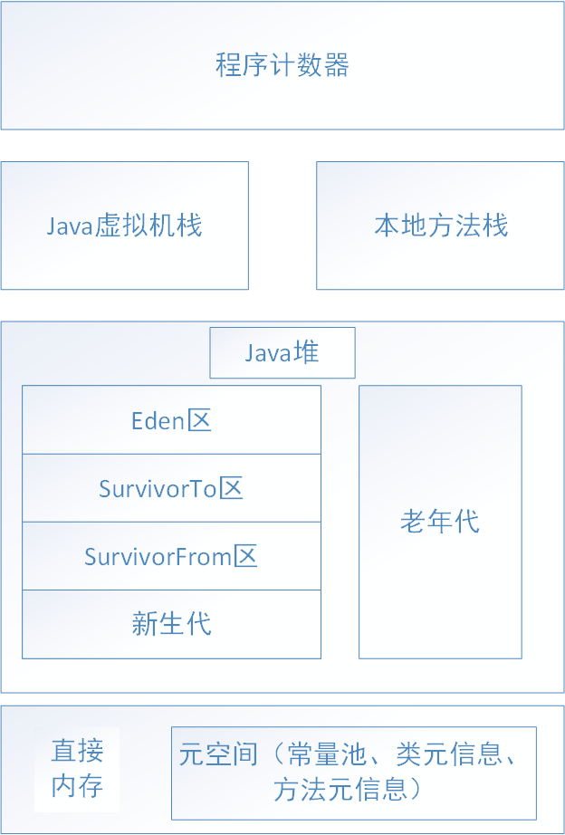
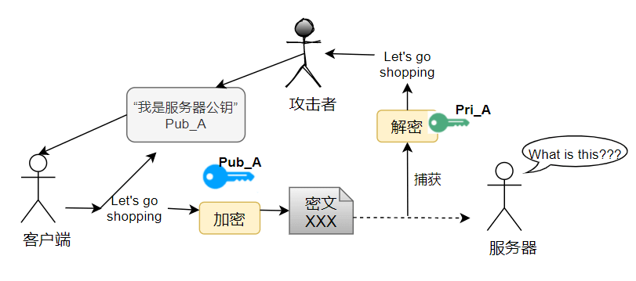

# Java基础总结

## 章节一：基础题

### 1.接口和抽象类的区别

- 接口是对行为的定义，抽象类是对类的定义。
- 接口中定义的方法默认为public abstract类型，定义的成员变量默认为public static final类型。接口中可以定义main函数，JDK8开始接口方法可以有默认实现，可以定义静态方法。JDK9之后可以定义私有方法和私有静态方法。一个类可以实现多个接口。
- 一个类有抽象方法必定是抽象类，但是抽象类可以不包含抽象方法，抽象类中可以定义静态变量和静态方法。抽象类有构造方法，但是不能自己用来实例化，而是给子类初始化用的。抽象类的子类如果没有覆盖所有的父类方法，那子类也是抽象类。一个类只能继承一个父类。

### 2.==和equals的区别

- 基本类型使用==比较的是值，引用类型使用==比较的是对象地址。
- **`equals()`** 不能用于判断基本数据类型的变量，只能用来判断两个对象是否相等。`equals()`方法存在于`Object`类中，而`Object`类是所有类的直接或间接父类，因此所有的类都有`equals()`方法。
- String中的equals方法被重写，因此两个String对象，比较的是对象的值。当创建String类型的对象时，虚拟机会在字符串常量池中查找有没有已经存在的值和要创建的值相等的对象，如果有，就将它赋值给当前创建的这个引用，如果没有，就在字符串常量中重新创建一个String对象。

### 3.常量池、运行时常量池和字符串常量池

- 常量池：每个class文件都有一份，存放于字节码文件中。常量池中有字面量(数量值、字符串值)和符号引用(类符号引用、字段符号引用、方法符号引用)，虚拟机指令根据这张常量表找到要执行的类名、方法名、参数类型、字面量等类型。

- 运行时常量池：每个class一份，存在于方法区中(元空间)。当类加载到内存中后，jvm就会将class常量池中的内容存放到运行时常量池中，经过分析（resolve）之后，也就是把符号引用替换为直接引用，分析的过程会去查询全局字符串池，也就是下面的字符串常量池，以保证运行时常量池所引用的字符串与全局字符串池中所引用的是一致的。

- 字符串常量池：每个JVM中只有一份，存在于堆中。JVM 为了提升性能和减少内存消耗针对字符串（String 类）专门开辟的一块区域，主要目的是为了避免字符串的重复创建。字符串常量池里的内容是在类加载完成，经过验证，准备阶段之后在堆中生成字符串对象实例，然后将该字符串对象实例的引用值存到string pool中（string pool中存的是引用值而不是具体的实例对象，具体的实例对象是在堆中开辟的一块空间存放的。

### 4.final关键字的理解

- 可以用来修饰变量、方法、类
- 修饰变量时，如果是基本数据类型，数值在初始化后就不能修改；如果是引用数据类型，在初始化后就不能让其指向另一个对象。
- 修饰方法时，不能被重写，防止子类修改该方法的含义。
- 修饰类时，表示该类不能被继承，类的所有成员方法都被隐式的被final修饰。

### 5.异常与错误

- 异常Exception、错误Eroor都继承于Throwable类。

- 错误Error指的是Java程序运行错误，主要因为系统内部错误或者资源耗尽，Error不能被被捕捉。常见的错误有StackOverflowError、OutOfMemoryError。

- 异常Exception指程序运行过程中出现不期望出现的问题，可以被捕捉处理。异常分为运行时异常和检查异常。运行异常指的是，程序正常运行过程中抛出的异常。常见的有NullPointException、ClassCastException、ArrayIndexOutOfBundsException等。检查异常指的编译器在编译时期检查代码出现的问题。常见的有ClassNotFoundException、IOException、FileNotFoundException。


### 6.反射

反射被称为框架的灵魂，可以在程序运行过程中，动态获取类和对象的信息，以及动态调用对象的方法。

反射增加了代码的灵活性，在运行时有了分析操作类的能力。但是增加了安全问题，比如可以无视泛型参数的安全检查。反射的性能也稍差。

常用的API，举例说明

```java
Person p = new Person();
// 1. 获取Class对象
// 获取该类对应的Class对象
Class clazz = p.getClass();
// 或者直接调用
Class clazz = Person.class;
// 或者使用forName(包路径及名称)，这种方式安全性、性能最好
Class clazz = Class.forName("fullClassPath")
package com.company.coding.java.chapterone.parteight;

import java.lang.reflect.Constructor;
import java.lang.reflect.Field;
import java.lang.reflect.Method;

public class Person {

    private String name;

    private Integer age;

    String gender;

    public Person() {
    }

    public Person(String name, Integer age) {
        this.name = name;
        this.age = age;
    }

    public Person(String name, Integer age, String gender) {
        this.name = name;
        this.age = age;
        this.gender = gender;
    }

    public String getName() {
        return name;
    }

    public void setName(String name) {
        this.name = name;
    }

    public Integer getAge() {
        return age;
    }

    public void setAge(Integer age) {
        this.age = age;
    }

    public String getGender() {
        return gender;
    }

    public void setGender(String gender) {
        this.gender = gender;
    }

    public static void main(String[] args) throws ClassNotFoundException {
        Class clazz = Class.forName("com.company.coding.java.chapterone.parteight.Person");

        // 1. 获取所有方法
        Method[] declaredMethods = clazz.getDeclaredMethods();
        for (Method declaredMethod : declaredMethods) {
            System.out.println(declaredMethod.toString());
        }
        //public java.lang.String com.company.coding.java.chapterone.parteight.Person.getName()
        //public void com.company.coding.java.chapterone.parteight.Person.setName(java.lang.String)
        //public void com.company.coding.java.chapterone.parteight.Person.setAge(java.lang.Integer)
        //public java.lang.String com.company.coding.java.chapterone.parteight.Person.getGender()
        //public void com.company.coding.java.chapterone.parteight.Person.setGender(java.lang.String)
        //public java.lang.Integer com.company.coding.java.chapterone.parteight.Person.getAge()

        // 2. 获取所有的构造函数
        Constructor[] declaredConstructors = clazz.getDeclaredConstructors();
        for (Constructor declaredConstructor : declaredConstructors) {
            System.out.println(declaredConstructor.toString());
        }
        
        //public com.company.coding.java.chapterone.parteight.Person(java.lang.String,java.lang.Integer,java.lang.String)
		//public com.company.coding.java.chapterone.parteight.Person(java.lang.String,java.lang.Integer)
		//public com.company.coding.java.chapterone.parteight.Person()

        // 3. 获取所有的成员属性
        Field[] declaredFields = clazz.getDeclaredFields();
        for (Field declaredField : declaredFields) {
            System.out.println(declaredField.toString());
        }
        
        //private java.lang.String com.company.coding.java.chapterone.parteight.Person.name
		//private java.lang.Integer com.company.coding.java.chapterone.parteight.Person.age
		//java.lang.String com.company.coding.java.chapterone.parteight.Person.gender
        
    }
    
    
    // 4. 动态方法的调用
    Method method = clazz.getMethod("setName", String.class);
    Constructor constructor = clazz.getConstructor();
    Object object = constructor.newInstance();
    method.invoke(object,"alex");
    
}
```

### 7.泛型擦除

Java 泛型是 JDK 5 中引入的一个新特性。使用泛型参数，可以增强代码的可读性以及稳定性。

编译器可以对泛型参数进行检测，并且通过泛型参数可以指定传入的对象类型。泛型主要用于编译阶段，编译之后Java字节码文件中不包含泛型中的类型信息。比如 `ArrayList<Person> persons = new ArrayList<Person>()` 这行代码就指明了该 `ArrayList` 对象只能传入 `Person` 对象，如果传入其他类型的对象就会报错。经过编译后，统一为ArrayList。

泛型一般有三种使用方式:**泛型类**、**泛型接口**、**泛型方法**。

**项目中哪里用到了泛型？**

- 自定义接口通用返回结果 `CommonResult<T>` 通过参数 `T` 可根据具体的返回类型动态指定结果的数据类型
- 定义 `Excel` 处理类 `ExcelUtil<T>` 用于动态指定 `Excel` 导出的数据类型
- 构建集合工具类（参考 `Collections` 中的 `sort`, `binarySearch` 方法）。

## 章节二：集合

集合， 也叫作容器，主要是由两大接口派生而来：一个是 `Collection`接口，主要用于存放单一元素；另一个是 `Map` 接口，主要用于存放键值对。对于`Collection` 接口，下面又有三个主要的子接口：`List`、`Set` 和 `Queue`。

Java 集合框架如下图所示：


### 1.说说 List, Set, Queue, Map 四者的区别与常用实现？

- `List`: 存储的元素是有序的、可重复的。

  - `ArrayList`： `Object[]` 数组
  - `Vector`：`Object[]` 数组
  - `LinkedList`： 双向链表(JDK1.6 之前为循环链表，JDK1.7 取消了循环)

- `Set`: 存储的元素是无序的、不可重复的。

  - `HashSet`(无序，唯一): 基于 `HashMap` 实现的，底层采用 `HashMap` 来保存元素
  - `LinkedHashSet`: `LinkedHashSet` 是 `HashSet` 的子类，并且其内部是通过 `LinkedHashMap` 来实现的。有点类似于我们之前说的 `LinkedHashMap` 其内部是基于 `HashMap` 实现一样，不过还是有一点点区别的
  - `TreeSet`(有序，唯一): 红黑树(自平衡的排序二叉树)

- `Queue`: 按特定的排队规则来确定先后顺序，存储的元素是有序的、可重复的。

  - `PriorityQueue`: `Object[]` 数组来实现二叉堆
  - `ArrayQueue`: `Object[]` 数组 + 双指针

- `Map`: 使用键值对（key-value）存储。

  - `HashMap`： JDK1.8 之前 `HashMap` 由数组+链表组成的，数组是 `HashMap` 的主体，链表则是主要为了解决哈希冲突而存在的（“拉链法”解决冲突）。JDK1.8  以后在解决哈希冲突时有了较大的变化，当链表长度大于阈值（默认为 8）（将链表转换成红黑树前会判断，如果当前数组的长度小于 64，那么会选择先进行数组扩容，而不是转换为红黑树）时，将链表转化为红黑树，以减少搜索时间
  - `LinkedHashMap`： `LinkedHashMap` 继承自 `HashMap`，所以它的底层仍然是基于拉链式散列结构即由数组和链表或红黑树组成。另外，`LinkedHashMap` 在上面结构的基础上，增加了一条双向链表，使得上面的结构可以保持键值对的插入顺序。同时通过对链表进行相应的操作，实现了访问顺序相关逻辑。

  - `Hashtable`： 数组+链表组成的，数组是 `Hashtable` 的主体，链表则是主要为了解决哈希冲突而存在的。
  - `TreeMap`： 红黑树（自平衡的排序二叉树）。

### 2.如何选用集合?

主要根据集合的特点来选用，比如我们需要根据键值获取到元素值时就选用 `Map` 接口下的集合，需要排序时选择 `TreeMap`，不需要排序时就选择 `HashMap`，需要保证线程安全就选用 `ConcurrentHashMap`。

当我们只需要存放元素值时，就选择实现`Collection` 接口的集合，需要保证元素唯一时选择实现 `Set` 接口的集合比如 `TreeSet` 或 `HashSet`，不需要就选择实现 `List` 接口的比如 `ArrayList` 或 `LinkedList`，然后再根据实现这些接口的集合的特点来选用。

### 3.ArrayList 与 LinkedList 区别（顺序表和链表的区别）?

- **是否保证线程安全：** `ArrayList` 和 `LinkedList` 都是不同步的，也就是不保证线程安全；
- **底层数据结构：** `ArrayList` 底层使用的是 **`Object` 数组**；`LinkedList` 底层使用的是 **双向链表** 数据结构（JDK1.6 之前为循环链表，JDK1.7 取消了循环。）
- 插入和删除是否受元素位置的影响：
  - `ArrayList` 采用数组存储，所以插入和删除元素的时间复杂度受元素位置的影响。 比如：执行`add(E e)`方法的时候， `ArrayList` 会默认在将指定的元素追加到此列表的末尾，这种情况时间复杂度就是 O(1)。但是如果要在指定位置 i 插入和删除元素的话（`add(int index, E element)`）时间复杂度就为 O(n-i)。因为在进行上述操作的时候集合中第 i 和第 i 个元素之后的(n-i)个元素都要执行向后位/向前移一位的操作。
  - `LinkedList` 采用链表存储，所以，如果是在头尾插入或者删除元素不受元素位置的影响（`add(E e)`、`addFirst(E e)`、`addLast(E e)`、`removeFirst()` 、 `removeLast()`），时间复杂度为 O(1)，如果是要在指定位置 `i` 插入和删除元素的话（`add(int index, E element)`，`remove(Object o)`）， 时间复杂度为 O(n) ，因为需要先移动到指定位置再插入。
- **是否支持快速随机访问：** `LinkedList` 不支持高效的随机元素访问，而 `ArrayList` 支持。快速随机访问就是通过元素的序号快速获取元素对象(对应于`get(int index)`方法)。ArrayList实现了RandomAccess接口，标志ArrayList可以随机访问。在binarySearch()方法中，它要判断传入的 list 是否 RandomAccess的实例，如果是，调用indexedBinarySearch()方法，如果不是，那么调用iteratorBinarySearch()方法
- **内存空间占用：** `ArrayList` 的空 间浪费主要体现在在 list 列表的结尾会预留一定的容量空间，而 LinkedList 的空间花费则体现在它的每一个元素都需要消耗比 ArrayList 更多的空间（因为要存放直接后继和直接前驱以及数据）。


## 章节三：并发


## 章节四：JVM

### 1.什么是JVM

JVM是运行Java字节码(.class文件)的虚拟机，针对不同的系统，运行相同的字节码，给出相同的结果。JVM主要包含四个部分，分别是类加载器、运行时数据区域、执行引擎和本地接口库。

**JVM 并不是只有一种！只要满足 JVM 规范，每个公司、组织或者个人都可以开发自己的专属 JVM。** 除了我们平时最常用的 HotSpot VM 外，还有 J9 VM、JRockit VM等 。

类加载器：将编译好的.class文件加载到JVM中。

运行时区域：包括线程私有的程序计数器、Java虚拟机栈、本地方法栈；包括线程公有的堆、方法区(运行时常量池)。JDK8中，将方法区的实现放在了直接内存上，起了个新名字叫元空间。用于存储在JVM运行过程中产生的数据。线程私有的与线程生命周期相同，线程共享的与进程生命周期相同。

执行引擎：JIT即时编译引擎和垃圾回收引擎，即时编译器将Java字节码编译成具体的机器码，垃圾回收器用于回收运行过程中不再使用的对象。

本地接口库：调用操作系统的本地方法库完成具体指令操作。

### 2.JVM类加载机制

类的生命周期：加载、验证、准备、解析、初始化、使用、卸载

JVM类加载机制指的是，JVM将.class文件以加载、验证、准备、解析和初始化的步骤加载到内存中，使其能够被JVM使用。其中，验证、准备和解析又属于链接步骤。

加载：JVM将.class文件读取到运行时数据区域(详细过程是：通过全类名获取定义此类的二进制字节流，将字节流代表的静态存储结构转换为方法区的运行时数据结构)，在堆中建立Class对象，并封装类的信息(数据结构)到方法区。JVM通过双亲委托机制对类进行加载。数组类型的数据不由类加载器进行创建，由JVM直接创建。

验证：验证.class文件是否符合JVM安全要求，只有验证通过，才会被JVM使用。


准备：为类变量（即静态变量，不能是实例变量）分配内存空间并设置类中变量的初始值。**注意：JDK 7 之前，HotSpot 在方法区为类变量分配内存和初始化。而在 JDK 7 及之后，HotSpot  已经把原本放在永久代的字符串常量池、静态变量等移动到堆中，这个时候类变量则会随着 Class 对象一起存放在 Java 堆中。**如果类变量被static修饰，并赋予了初始值(假设1000)。但是在准备阶段，该变量只会被赋予0，对象初始化时，才会被赋予1000。如果是final修饰的，编译阶段会将该变量生成其对应的ConstantValue属性，虚拟机会根据Constant属性将该变量赋值为1000。

解析：JVM将常量池的符号引用替换成直接引用。符号引用就是一个类或者方法等，引入了其他的类或方法，可是[JVM](https://so.csdn.net/so/search?q=JVM&spm=1001.2101.3001.7020)并不知道引入的其他类在哪里，所以就用唯一符号来代替，等到类加载器去解析的时候，就用符号引用找到那个引用类的地址，这个地址也就是直接引用。

初始化：执行类构造器中的<clinit>方法将类初始化。

卸载：卸载类即该类的 Class 对象被 GC。卸载类需要满足 3 个要求:

1. 该类的所有的实例对象都已被 GC，也就是说堆不存在该类的实例对象。
2. 该类没有在其他任何地方被引用
3. 该类的类加载器的实例已被 GC

所以，在 JVM 生命周期内，由 jvm 自带的类加载器加载的类是不会被卸载的。但是由我们自定义的类加载器加载的类是可能被卸载的。

### 3.类加载器

JVM 中内置了三个重要的 ClassLoader，除了 BootstrapClassLoader 其他类加载器均由 Java 实现且全部继承自`java.lang.ClassLoader`：

1. **BootstrapClassLoader(启动类加载器)** ：最顶层的加载类，由 C++实现，负责加载 `%JAVA_HOME%/lib`目录下的 jar 包和类或者被 `-Xbootclasspath`参数指定的路径中的所有类。
2. **ExtensionClassLoader(扩展类加载器)** ：主要负责加载 `%JRE_HOME%/lib/ext` 目录下的 jar 包和类，或被 `java.ext.dirs` 系统变量所指定的路径下的 jar 包。
3. **AppClassLoader(应用程序类加载器)** ：面向我们用户的加载器，负责加载当前应用 classpath 下的所有 jar 包和类。
4. **UserClassLoader(用户类加载器)**：继承java.lang.ClassLoader实现自定义类加载器。

### 4.双亲委派机制

每一个类都有一个对应它的类加载器。JVM通过双亲委托机制对类进行加载。

即在类加载的时候，系统会首先判断当前类是否被加载过。已经被加载的类会直接返回，否则才会尝试加载。加载的时候，首先会把该请求委派给父类加载器的 `loadClass()` 处理，因此所有的请求最终都应该传送到顶层的启动类加载器 `BootstrapClassLoader` 中。当父类加载器无法处理时(通常情况下是该类的Class文件在父类的类加载路径下不存在)，则父类会将该信息反馈给子类并向下委托子类加载器加载该类，如果找不到JVM会抛出ClassNotFound异常。

**获得加载器名以及它的父类**

```java
public class ClassLoaderDemo {
    public static void main(String[] args) {
        System.out.println("ClassLodarDemo's ClassLoader is " + ClassLoaderDemo.class.getClassLoader());
        System.out.println("The Parent of ClassLodarDemo's ClassLoader is " + ClassLoaderDemo.class.getClassLoader().getParent());
        System.out.println("The GrandParent of ClassLodarDemo's ClassLoader is " + ClassLoaderDemo.class.getClassLoader().getParent().getParent());
    }
}

// 输出
ClassLodarDemo's ClassLoader is sun.misc.Launcher$AppClassLoader@18b4aac2
The Parent of ClassLodarDemo's ClassLoader is sun.misc.Launcher$ExtClassLoader@1b6d3586
// 从这句，可以看出classLoader的父类加载器为null
The GrandParent of ClassLodarDemo's ClassLoader is null
```

当父类加载器为 null 时，会使用启动类加载器 `BootstrapClassLoader` 作为父类加载器。类加载器之间的“父子”关系不是通过继承来体现的，是由“优先级”来决定。

双亲委托机制的源码

```java
private final ClassLoader parent;
protected Class<?> loadClass(String name, boolean resolve)
        throws ClassNotFoundException
    {
        synchronized (getClassLoadingLock(name)) {
            // 首先，检查请求的类是否已经被加载过
            Class<?> c = findLoadedClass(name);
            if (c == null) {
                long t0 = System.nanoTime();
                try {
                    if (parent != null) {//父加载器不为空，调用父加载器loadClass()方法处理
                        c = parent.loadClass(name, false);
                    } else {//父加载器为空，使用启动类加载器 BootstrapClassLoader 加载
                        c = findBootstrapClassOrNull(name);
                    }
                } catch (ClassNotFoundException e) {
                   //抛出异常说明父类加载器无法完成加载请求
                }

                if (c == null) {
                    long t1 = System.nanoTime();
                    //自己尝试加载
                    c = findClass(name);

                    // this is the defining class loader; record the stats
                    sun.misc.PerfCounter.getParentDelegationTime().addTime(t1 - t0);
                    sun.misc.PerfCounter.getFindClassTime().addElapsedTimeFrom(t1);
                    sun.misc.PerfCounter.getFindClasses().increment();
                }
            }
            if (resolve) {
                resolveClass(c);
            }
            return c;
        }
    }
```

双亲委派机制的作用是保障类的唯一性和安全性，如果存在包名和类名形同的两个类，则该类无法被加载。如果相同的类文件被不同的类加载器加载，则会产生两个不同的。如果没有使用双亲委派模型，而是每个类加载器加载自己的话就会出现一些问题，比如我们编写一个称为 `java.lang.Object` 类的话，那么程序运行的时候，系统就会出现多个不同的 `Object` 类。

### 5.如果我们不想用双亲委派模型怎么办？

为了避免双亲委托机制，我们可以自己定义一个类加载器，然后重写 `loadClass()` 即可。

自定义加载器的话，需要继承 `ClassLoader` 。如果我们不想打破双亲委派模型，就重写 `ClassLoader` 类中的 `findClass()` 方法即可，无法被父类加载器加载的类最终会通过这个方法被加载。但是，如果想打破双亲委派模型则需要重写 `loadClass()` 方法。

### 6.JVM内存模型



**程序计数器：**是一块较小的内存空间，可以看作是用来指示线程执行字节码的行号指示器。改变程序计数器的值来依次读取指令，从而实现代码的流程控制，例如顺序执行、选择、循环、异常处理。每个线程都私有一个程序计数器，在方法被执行时，该方法的程序计数器会记录实时虚拟机字节码指令的地址；如果该方法执行的是native方法，那么程序计数器记录的是undefined地址。

**Java虚拟机栈：**描述方法执行的过程，方法执行时，Java虚拟机会为方法创建一个栈帧，方法的运行和返回对应着栈帧在Java虚拟机栈中的入栈和出栈。栈帧中存储了局部变量、操作数栈、动态链接、方法出口等信息。

**本地方法栈：**与虚拟机栈类似，本地方法执行时，在本地方法栈中创建一个栈帧，英语存放本地方法的局部变量、操作数栈、动态链接、方法出口等信息。

**Java堆：**进程中最大的一块内存空间，几乎所有的对象实例和数组都在这里分配内存。

**元空间：**JDK8以后。JVM规范中方法区的实现，存储类的结构信息，主要为：运行时常量、字段、方法和方法的数据、构造函数、初始化类信息。可以使用MetaSpacesSize设置初始化的元空间大小，默认值为12MB-20MB。

**直接内存：**又称为对外内存。


## 章节六：MySQL

### 1.索引的类型


### 2.统计姓名重复数大于1的数据


### 3.SQL语句执行顺序


### 4.联合索引


### 5.最左匹配的原理


### 6.InnoDB的事务

事务可以使「一组操作」要么全部成功，要么全部失败。事务其目的是为了「保证数据最终的一致性」。

> 举个例子，我给你发支付宝转了888块红包。那自然我的支付宝余额会扣减888块，你的支付宝余额会增加888块。

而事务就是保证我的余额扣减跟你的余额增添是同时成功或者同时失败的，这样这次转账就正常了。

**事务的四大特性**

就是ACID嘛，分别是原子性（Atomicity）、一致性（Consistency）、隔离性（Isolation）、持久性（Durability）。

1. 原子性

   指的是当前事务的操作要么同时成功，要么同时失败。原子性由undo log日志来保证，因为undo log记载着数据修改前的信息。

   例如：如我们执行下面一条删除语句：

   ```sql
   delete from book where id = 1;
   ```

   那么此时undo log会生成一条与之相反的insert 语句【反向操作的语句】，在需要进行事务回滚的时候，直接执行该条sql，可以将数据完整还原到修改前的数据，从而达到事务回滚的目的。

   再比如我们执行一条update语句：

   ```sql
   update book set name = "三国" where id = 1;   ---修改之前name=西游记
   ```

   此时undo log会记录一条相反的update语句，如下：

   ```sql
   update book set name = "西游记" where id = 1;
   ```

   如果这个修改出现异常，可以使用undo log日志来实现回滚操作，以保证事务的一致性。

   > undo log 撤销日志，在数据库事务开始之前，MYSQL会去记录更新前的数据到undo log文件中。如果事务回滚或者数据库崩溃时，可以利用undo log日志中记录的日志信息进行回退。
   >
   > **undo log产生：** 在事务开始之前生成
   > **undo log销毁：** 当事务提交之后，undo log并不能立马被删除，而是放入待清理的链表，由purge线程判断是否由其他事务在使用undo段中表的上一个事务之前的版本信息，决定是否可以清理undo log的日志空间。

2. 隔离性

   指的是在事务「并发」执行时，他们内部的操作不能互相干扰。如果多个事务可以同时操作一个数据，那么就会产生脏读、重复读、幻读的问题。

   在InnoDB引擎中，定义了四种隔离级别供我们使用：read uncommit(读未提交)、read commit (读已提交)、repeatable read (可重复复读)、serializable (串行)。不同的隔离级别对事务之间的隔离性是不一样的（级别越高事务隔离性越好，但性能就越低），而隔离性是由MySQL的各种锁来实现的，只是它屏蔽了加锁的细节。

   > 在InnoDB引擎下，按锁的粒度分类，可以简单分为行锁和表锁。
   >
   > **行锁**实际上是作用在索引之上的。当我们的SQL命中了索引，那锁住的就是命中条件内的索引节点（这种就是行锁），如果没有命中索引，那我们锁的就是整个索引树（表锁）。简单来说就是：锁住的是整棵树还是某几个节点，完全取决于SQL条件是否有命中到对应的索引节点。而行锁又可以简单分为读锁（共享锁、S锁）和写锁（排它锁、X锁）。
   >
   > 读锁是共享的，多个事务可以同时读取同一个资源，但不允许其他事务修改。写锁是排他的，写锁会阻塞其他的写锁和读锁。
   >
   > **read uncommit(读未提交)**。比如说：A向B转账，A执行了转账语句，但A还没有提交事务，B读取数据，发现自己账户钱变多了！B跟A说，我已经收到钱了。A回滚事务【rollback】，等B再查看账户的钱时，发现钱并没有多。简单的定义就是：事务B读取到了事务A还没提交的数据，这种用专业术语来说叫做「脏读」。对于锁的维度而言，其实就是在read uncommit隔离级别下，读不会加任何锁，而写会加排他锁。读什么锁都不加，这就让排他锁无法排它了。而我们又知道，对于更新操作而言，InnoDB是肯定会加写锁的（数据库是不可能允许在同一时间，更新同一条记录的）。而读操作，如果不加任何锁，那就会造成上面的脏读。脏读在生产环境下肯定是无法接受的，那如果读加锁的话，那意味着：当更新数据的时，就没办法读取了，这会极大地降低数据库性能。在MySQL InnoDB引擎层面，又有新的解决方案（解决加锁后读写性能问题），叫做MVCC(Multi-Version Concurrency Control)多版本并发控制。在MVCC下，就可以做到读写不阻塞，且避免了类似脏读这样的问题。那MVCC是怎么做的呢？MVCC通过生成数据快照（Snapshot)，并用这个快照来提供一定级别（语句级或事务级）的一致性读取。回到事务隔离级别下，针对于 read commit (读已提交) 隔离级别，它生成的就是语句级快照，而针对于repeatable read (可重复读)，它生成的就是事务级的快照。
   >
   > 前面提到过read uncommit隔离级别下会产生脏读，而read commit (读已提交) 隔离级别解决了脏读。思想其实很简单：在读取的时候生成一个”版本号”，等到其他事务commit了之后，才会读取最新已commit的”版本号”数据。比如说：事务A读取了记录(生成版本号)，事务B修改了记录(此时加了写锁)，事务A再读取的时候，是依据最新的版本号来读取的(当事务B执行commit了之后，会生成一个新的版本号)，如果事务B还没有commit，那事务A读取的还是之前版本号的数据。通过「版本」的概念，这样就解决了脏读的问题，而「版本」其实就是对应快照的数据。
   >
   > read commit (读已提交) 解决了脏读，但也会有其他并发的问题。
   >
   > 不可重复读：一个事务读取到另外一个事务已经提交的数据，也就是说一个事务可以看到其他事务所做的修改。
   >
   > 不可重复读的例子：A查询数据库得到数据，B去修改数据库的数据，导致A多次查询数据库的结果都不一样【危害：A每次查询的结果都是受B的影响的】
   >
   > repeatable read (可重复复读)隔离级别是「事务级别」的快照！每次读取的都是「当前事务的版本」，即使当前数据被其他事务修改了(commit)，也只会读取当前事务版本的数据。而repeatable read (可重复复读)隔离级别会存在幻读的问题，「幻读」指的是指在一个事务内读取到了别的事务插入的数据，导致前后读取不一致。
   >
   > 剩下的就是serializable (串行)隔离级别了，它的最高的隔离级别，相当于不允许事务的并发，事务与事务之间执行是串行的，它的效率最低，但同时也是最安全的。
   >
   > MVCC的主要是通过read view和undo log来实现的。undo log前面也提到了，它会记录修改数据之前的信息，事务中的原子性就是通过undo log来实现的。所以，有undo log可以帮我们找到「版本」的数据。而read view 实际上就是在查询时，InnoDB会生成一个read view，read view 有几个重要的字段，分别是：trx_ids（尚未提交commit的事务版本号集合），up_limit_id（下一次要生成的事务ID值），low_limit_id（尚未提交版本号的事务ID最小值）以及creator_trx_id（当前的事务版本号）。在每行数据有两列隐藏的字段，分别是DB_TRX_ID（记录着当前ID）以及DB_ROLL_PTR（指向上一个版本数据在undo log 里的位置指针）。铺垫到这了，很容易就发现，MVCC其实就是靠「比对版本」来实现读写不阻塞，而版本的数据存在于undo log中。而针对于不同的隔离级别（read commit和repeatable read），无非就是read commit隔离级别下，每次都获取一个新的read view，repeatable read隔离级别则每次事务只获取一个read view。

3. 持久性

   指的就是一旦提交了事务，它对数据库的改变就应该是永久性的。说白了就是，会将数据持久化在硬盘上。而持久性由redo log 日志来保证，当我们要修改数据时，MySQL是先把这条记录所在的「页」找到，然后把该页加载到内存中，将对应记录进行修改。为了防止内存修改完了，MySQL就挂掉了（如果内存改完，直接挂掉，那这次的修改相当于就丢失了）。MySQL引入了redo log，内存写完了，然后会写一份redo log，这份redo log记载着这次在某个页上做了什么修改。即便MySQL在中途挂了，我们还可以根据redo log来对数据进行恢复。redo log 是顺序写的，写入速度很快。并且它记录的是物理修改（xxxx页做了xxx修改），文件的体积很小，恢复速度也很快。

4. 一致性

   一致性可以理解为我们使用事务的「目的」，而「隔离性」「原子性」「持久性」均是为了保障「一致性」的手段，保证一致性需要由应用程序代码来保证。


## 章节七：Hadoop


## 章节八：Spark


## 章节九：Flink


## 章节十：中间件


## 章节十一：机器学习和深度学习


## 章节十二：计算机相关常用知识

### 1.RPC原理

RPC 调用的两端分别是客户端和服务端，两者通常位于网络上两个不同的地址，要完成一次 RPC 调用，就必须先建立网络连接。建立
连接后，双方还必须按照某种约定的协议进行网络通信，这个协议就是通信协议。双方能够正常通信后，服务端接收到请求时，需要以某种方式进行处理，处理成功后，把请求结果返回给客户端。为了减少传输的数据大小，还要对数据进行压缩，也就是对数据进行序列化。
上面就是 RPC 调用的过程，由此可见，想要完成调用，你需要解决四个问题：

- 客户端和服务端如何建立网络连接？
- 服务端如何处理请求？
- 数据传输采用什么协议？
- 数据该如何序列化和反序列化？

#### 1.1客户端和服务端如何建立网络连接？

客户端和服务端之间基于 TCP 协议建立网络连接最常用的途径有两种。

**HTTP 通信。**HTTP 通信是基于应用层 HTTP 协议的，而 HTTP 协议又是基于传输层 TCP 协议的。一次HTTP 通信过程就是发起一次 HTTP 调用，而一次 HTTP 调用就会建立一个 TCP 连接，经历一次“三次握手”的过程来建立连接。完成请求后，再经历一次“四次挥手”的过程来断开连接。

**Socket通信。**Socket 通信是基于 TCP/IP 协议的封装，建立一次 Socket 连接至少需要一对套接字，其中一个运行于客户端，称为 ClientSocket ；另一个运行于服务器端，称为 ServerSocket。Socket 通信的过程分为四个步骤：服务器监听、客户端请求、连接
确认、数据传输。

1. 服务器监听：ServerSocket 通过调用 bind() 函数绑定某个具体端口，然后调用 listen()函数实时监控网络状态，等待客户端的连接请求。
2. 客户端请求：ClientSocket 调用 connect() 函数向 ServerSocket 绑定的地址和端口发起连接请求。
3. 服务端连接确认：当 ServerSocket 监听到或者接收到 ClientSocket 的连接请求时，调用 accept() 函数响应 ClientSocket 的请求，同客户端建立连接。
4. 数据传输：当 ClientSocket 和 ServerSocket 建立连接后，ClientSocket 调用 send()函数，ServerSocket 调用 receive() 函数，ServerSocket 处理完请求后，调用 send()函数，ClientSocket 调用 receive() 函数，就可以得到得到返回结果。

当客户端和服务端建立网络连接后，就可以发起请求了。但网络不一定总是可靠的，经常会遇到网络闪断、连接超时、服务端宕机等各种异常，通常的处理手段有两种。

链路存活检测：客户端需要定时地发送心跳检测消息（一般是通过 ping 请求）给服务端，如果服务端连续 n 次心跳检测或者超过规定的时间都没有回复消息，则认为此时链路已经失效，这个时候客户端就需要重新与服务端建立连接。

断连重试：通常有多种情况会导致连接断开，比如客户端主动关闭、服务端宕机或者网络故障等。这个时候客户端就需要与服务端重新建立连接，但一般不能立刻完成重连，而是要等待固定的间隔后再发起重连，避免服务端的连接回收不及时，而客户端瞬间重连的请求太多而把服务端的连接数占满。

#### 1.2服务端如何处理请求？

假设这时候客户端和服务端已经建立了网络连接，服务端又该如何处理客户端的请求呢？通常来讲，有三种处理方式。

同步阻塞方式（BIO），客户端每发一次请求，服务端就生成一个线程去处理。当客户端同时发起的请求很多时，服务端需要创建很多的线程去处理每一个请求，如果达到了系统最大的线程数瓶颈，新来的请求就没法处理了。

同步非阻塞方式 (NIO)，客户端每发一次请求，服务端并不是每次都创建一个新线程来处理，而是通过 I/O 多路复用技术进行处理。就是把多个 I/O 的阻塞复用到同一个 select的阻塞上，从而使系统在单线程的情况下可以同时处理多个客户端请求。这种方式的优势是开销小，不用为每个请求创建一个线程，可以节省系统开销。

异步非阻塞方式（AIO），客户端只需要发起一个 I/O 操作然后立即返回，等 I/O 操作真正完成以后，客户端会得到 I/O 操作完成的通知，此时客户端只需要对数据进行处理就好了，不需要进行实际的 I/O 读写操作，因为真正的 I/O 读取或者写入操作已经由内核完成了。这种方式的优势是客户端无需等待，不存在阻塞等待问题。

#### 1.3数据传输采用什么协议？

最常用的有 HTTP 协议，它是一种开放的协议，各大网站的服务器和浏览器之间的数据传输大都采用了这种协议。

还有一些定制的私有协议，比如阿里巴巴开源的 Dubbo 协议，也可以用于服务端和客户端之间的数据传输。

无论是开放的还是私有的协议，都必须定义一个“契约”，以便服务消费和服务提供者之间能够达成共识。服务消费者按照契约，对传输的数据进行编码，然后通过网络传输过去；服务提供者从网络上接收到数据后，按照契约，对传输的数据进行解码，然后处理请求，再把处理后的结果进行编码，通过网络传输返回给服务消费者；服务消费者再对返回的结果进行解码，最终得到服务提供者处理后的返回值。

通常协议契约包括两个部分：消息头和消息体。其中消息头存放的是协议的公共字段以及用户扩展字段，消息体存放的是传输数据的具体内容。

以 HTTP 协议为例，主要分为消息头和消息体两部分，其中消息头中存放的是协议的公共字段，比如 Server 代表是服务端服务器类型、Content-Length 代表返回数据的长度、Content-Type 代表返回数据的类型；消息体中存放的是具体的返回结果，这里就是一段 HTML 网页代码。

#### 1.4 数据该如何序列化和反序列化？

一般数据在网络中进行传输前，都要先在发送方一端对数据进行编码，经过网络传输到达另一端后，再对数据进行解码，这个过程就是序列化和反序列化。

**为什么要对数据进行序列化和反序列化呢？**要知道网络传输的耗时一方面取决于网络带宽的大小，另一方面取决于数据传输量。要想加快网络传输，要么提高带宽，要么减小数据传输量，而对数据进行编码的主要目的就是减小数据传输量。比如一部高清电影原始大小为30GB，如果经过特殊编码格式处理，可以减小到 3GB，同样是 100MB/s 的网速，下载时间可以从 300s 减小到 30s。**此外，序列化的本质除了解决传输速率意外，还是为了解决内存中数据结构到字节序列的映射过程中，如何保留各个结构和字段间的关系而生的技术。**

常用的序列化方式分为两类：文本类如 XML/JSON 等，二进制类如 PB/Thrift 等，而具体采用哪种序列化方式，主要取决于三个方面的因素。

支持数据结构类型的丰富度。数据结构种类支持的越多越好，这样的话对于使用者来说在编程时更加友好，有些序列化框架如 Hessian 2.0 还支持复杂的数据结构比如 Map、List 等。

跨语言支持。序列化方式是否支持跨语言也是一个很重要的因素，否则使用的场景就比较局限，比如 Java 序列化只支持 Java 语言，就不能用于跨语言的服务调用了。

性能。主要看两点，一个是序列化后的压缩比，一个是序列化的速度。以常用的 PB 序列化和 JSON 序列化协议为例来对比分析，PB 序列化的压缩比和速度都要比 JSON 序列化高很多，所以对性能和存储空间要求比较高的系统选用 PB 序列化更合适；而 JSON 序列化虽然性能要差一些，但可读性更好，更适合对外部提供服务。

### 2.WebSocket和Socket通信

WebSocket是即时通信的一种。实现即时通讯主要有四种方式，它们分别是：短轮询、长轮询(comet)、长连接(SSE)、WebSocket。

- 它们大体可以分为两类，一种是在HTTP基础上实现的，包括短轮询、comet和SSE；
- 另一种不是在HTTP基础上实现是，即WebSocket。

下面分别介绍一下这四种轮询方式，以及它们各自的优缺点。

#### 2.1 ajax短轮询

短轮询的基本思路就是浏览器每隔一段时间向服务器发送http请求，服务器端在收到请求后，不论是否有数据更新，都直接进行响应。

#### 2.2 ajax comet -长轮询

comet 指的是，当服务器收到客户端发来的请求后，不会直接进行响应，而是先将这个请求挂起，然后判断服务器端数据是否有更新。如果有更新，则进行响应，如果一直没有数据，则到达一定的时间限制（服务器端设置）后关闭连接。明显减少了很多不必要的http请求次数，相比之下节约了资源。长轮询的缺点在于，连接挂起也会导致资源的浪费

#### 2.3 SSE

SSE （ Server-sent Events ）是 WebSocket 的一种轻量代替方案，使用 HTTP 协议。严格地说，HTTP 协议是没有办法做服务器推送的，但是当服务器向客户端声明接下来要发送流信息时，客户端就会保持连接打开，SSE 使用的就是这种原理。它可以允许服务推送数据到客户端，不需要客户端发送请求，可以实现只要服务器端数据有更新，就可以马上发送到客户端。

SSE的优势很明显，它不需要建立或保持大量的客户端发往服务器端的请求，节约了很多资源，提升应用性能SSE的实现非常简单，并且不需要依赖其他插件。(不支持IE浏览器，单向通道)。

SSE的缺点是单向通道，只能服务器向客户端发送消息，如果客户端需要向服务器发送消息，则需要一个新的 HTTP 请求。 这对比 WebSocket  的双工通道来说，会有更大的开销。这么一来的话就会存在一个「什么时候才需要关心这个差异？」的问题，如果平均每秒会向服务器发送一次消息的话，那应该选择 WebSocket。如果一分钟仅 5 - 6 次的话，其实这个差异并不大。

#### 2.4 WebSocket

HTML5 定义的 WebSocket 协议，WebSocket 是独立的、创建在 TCP 上的协议，与传统的http协议不同，该协议可以实现服务器与客户端之间全双工通信。

简单来说，首先需要在客户端和服务器端建立起一个连接，这部分需要http。连接一旦建立，客户端和服务器端就处于平等的地位，可以相互发送数据，不存在请求和响应的区别。它能更好的节省服务器资源和带宽，并且能够更实时地进行通讯.

#### 2.5 Socket 是什么

##### Unix 中的 Socket

操作系统中也有使用到 Socket 这个概念用来进行进程间通信，它和通常说的基于 TCP/IP 的 Socket 概念十分相似，代表了在操作系统中传输数据的两方，只是它不再基于网络协议，而是操作系统本身的文件系统。

##### 网络中的 Socket

Socket 是对 TCP/IP 的封装；HTTP 是轿车，提供了封装或者显示数据的具体形式；Socket 是发动机，提供了网络通信的能力。在 Unix 一切皆文件哲学的思想下，Socket 是一种"打开—读/写—关闭"模式的实现，服务器和客户端各自维护一个"文件"，在建立连接打开后，可以向自己文件写入内容供对方读取或者读取对方内容，通讯结束时关闭文件。所以如果你想基于 TCP/IP 来构建服务，那么 Socket API 可能就是你会接触到的API。

#### 2.6 WebSocket 与 Socket 的区别

正如如上所说：

1. Socket 是传输控制层的接口。用户可以通过 Socket 来操作底层 TCP/IP 协议族通信。
2. WebSocket 是一个完整应用层协议。
3. Socket 更灵活，WebSocket 更易用。
4. 两者都能做即时通讯

#### 2.7 SpirngBoot整合WebSocket

maven引入

```xml
<!-- SpringBoot Websocket -->
<dependency>
    <groupId>org.springframework.boot</groupId>
    <artifactId>spring-boot-starter-websocket</artifactId>
</dependency>
```

设置WebSocketConfig类

```java
package com.ruoyi.framework.websocket;

import org.springframework.context.annotation.Bean;
import org.springframework.context.annotation.Configuration;
import org.springframework.web.socket.config.annotation.WebSocketMessageBrokerConfigurer;
import org.springframework.web.socket.server.standard.ServerEndpointExporter;

/**
 * websocket 配置
 *
 * @author ruoyi
 */
@Configuration
public class WebSocketConfig implements WebSocketMessageBrokerConfigurer
{
    @Bean
    public ServerEndpointExporter serverEndpointExporter()
    {
        return new ServerEndpointExporter();
    }
}
```

定义WebSocketServer类。并使用@ServerEndpoint注解进行描述。该注解主要是将目前的类定义成一个websocket服务器端,，注解的值将被用于监听用户连接的终端访问URL地址，客户端可以通过这个URL来连接到WebSocket服务器端。

```java
package com.ruoyi.framework.websocket;

import cn.hutool.json.JSON;
import com.alibaba.fastjson.JSONObject;
import com.ruoyi.common.utils.StringUtils;
import lombok.extern.slf4j.Slf4j;
import org.apache.commons.lang3.StringEscapeUtils;
import org.springframework.stereotype.Component;

import javax.websocket.*;
import javax.websocket.server.PathParam;
import javax.websocket.server.ServerEndpoint;
import java.io.IOException;
import java.util.concurrent.ConcurrentHashMap;

/**
 * @author 1
 */
@ServerEndpoint("/ws/message/{userName}")
@Component
@Slf4j
public class WebSocketServer {

    /**
     * 静态变量，用来记录当前在线连接数。应该把它设计成线程安全的。
     */
    private static int onlineCount = 0;
    /**
     * concurrent包的线程安全Set，用来存放每个客户端对应的MyWebSocket对象。
     */
    private static ConcurrentHashMap<String, WebSocketServer> webSocketMap = new ConcurrentHashMap<>();
    /**
     * 与某个客户端的连接会话，需要通过它来给客户端发送数据
     */
    private Session session;
    /**
     * 接收userId
     */
    private String userName = "";


    /**
     * 连接建立成功调用的方法
     */
    @OnOpen
    public void onOpen(Session session, @PathParam("userName") String userName) {
        this.session = session;
        this.userName = userName;
        if (webSocketMap.containsKey(userName)) {
            webSocketMap.remove(userName);
            webSocketMap.put(userName, this);
            //加入set中
        } else {
            webSocketMap.put(userName, this);
            //加入set中
            addOnlineCount();
            //在线数加1
        }

        log.info("用户连接:" + userName + ",当前在线人数为:" + getOnlineCount());

        try {
            sendMessage("来自后台的反馈：连接成功");
        } catch (IOException e) {
            log.error("用户:" + userName + ",网络异常!!!!!!");
        }
    }

    /**
     * 连接关闭调用的方法
     */
    @OnClose
    public void onClose() {
        if (webSocketMap.containsKey(userName)) {
            webSocketMap.remove(userName);
            //从set中删除
            subOnlineCount();
        }
        log.info("====================================================");
        log.info("用户退出:" + userName + ",当前在线人数为:" + getOnlineCount());
    }

    /**
     * 收到客户端消息后调用的方法
     *
     * @param message 客户端发送过来的消息
     */
    @OnMessage
    public void onMessage(String message, Session session) {
        log.info("收到用户消息:" + userName + ",报文:" + message);
        //可以群发消息
        //消息保存到数据库、redis
        if (StringUtils.isNotBlank(message)) {
            try {
                log.info(message);
            } catch (Exception e) {
                e.printStackTrace();
            }
        }
    }

    /**
     * @param session
     * @param error
     */
    @OnError
    public void onError(Session session, Throwable error) {
        log.error("用户错误:" + this.userName + ",原因:" + error.getMessage());
        error.printStackTrace();
    }

    /**
     * 实现服务器主动推送
     */
    public synchronized void sendMessage(String message) throws IOException {
        this.session.getBasicRemote().sendText(message);
    }

    public synchronized void sendObjectMessage(Object object) throws EncodeException, IOException {
        this.session.getBasicRemote().sendObject(object);
    }


    /**
     * 发送自定义消息
     */
    public static void sendInfo(String message, @PathParam("userName") String userName) throws IOException {
        log.info("发送消息到:" + userName + "，报文:" + message);
        if (StringUtils.isNotBlank(userName) && webSocketMap.containsKey(userName)) {
            webSocketMap.get(userName).sendMessage(message);
        } else {
            log.error("用户" + userName + ",不在线！");
        }
    }

    /**
     * 发送温度消息
     * @param parse1
     * @param parse2
     * @param parse3
     */
    public static void sendTempInfo(Object parse1, Object parse2, Object parse3, @PathParam("userName") String userName) throws EncodeException, IOException {

        if (StringUtils.isNotBlank(userName) && webSocketMap.containsKey(userName)) {
            webSocketMap.get(userName).sendTempInfoMessage(parse1, parse2, parse3);
        } else {
            log.error("用户" + userName + ",不在线！");
        }
    }

    private void sendTempInfoMessage(Object parse1, Object parse2, Object parse3) throws EncodeException, IOException{
        JSONObject result = new JSONObject();
        result.put("message", "温度曲线数据");
        result.put("1", parse1);
        result.put("2", parse2);
        result.put("3", parse3);
        this.session.getBasicRemote().sendText(result.toString());
    }


    /**
     * 发送给对象消息
     *
     * @throws IOException
     */
    public static void sendObjectInfo(Object object, @PathParam("userName") String userName) throws IOException, EncodeException {
        log.info("发送消息到:" + userName + "，报文:" + object.toString());
        if (StringUtils.isNotBlank(userName) && webSocketMap.containsKey(userName)) {
            webSocketMap.get(userName).sendObjectMessage(object);
        } else {
            log.error("用户" + userName + ",不在线！");
        }
    }

    public static synchronized int getOnlineCount() {
        return onlineCount;
    }

    public static synchronized void addOnlineCount() {
        WebSocketServer.onlineCount++;
    }

    public static synchronized void subOnlineCount() {
        WebSocketServer.onlineCount--;
    }
}
```

前端代码

```js
<template>
</template>

<script>
export default {
  name: "WebSocket",
  data() {
    return {
      // ws是否启动
      wsIsRun: false,
      // 定义ws对象
      webSocket: null,
      // ws请求链接（类似于ws后台地址）
      ws: '',
      // ws定时器
      wsTimer: null,
      // 获取到的实时数据
      getCurrentNumber: {}
    }
  },
  async mounted() {
    this.wsIsRun = true
    this.wsInit()
  },
  destroyed() {
    this.wsDestroy()
  },
  methods: {
    sendDataToServer() {
      if (this.webSocket.readyState === 1) {
        this.webSocket.send('来自前端的数据')
      } else {
        throw Error('服务未连接')
      }
    },
    /**
     * 初始化ws
     */
    wsInit() {
      const wsuri = process.env.VUE_APP_WEBSOCKET_API + '/ws/message/' + this.$store.state.user.name
      this.ws = wsuri
      if (!this.wsIsRun) return
      // 销毁ws
      this.wsDestroy()
      // 初始化ws
      this.webSocket = new WebSocket(this.ws)
      // ws连接建立时触发
      this.webSocket.addEventListener('open', this.wsOpenHanler)
      // ws服务端给客户端推送消息
      this.webSocket.addEventListener('message', this.wsMessageHanler)
      // ws通信发生错误时触发
      this.webSocket.addEventListener('error', this.wsErrorHanler)
      // ws关闭时触发
      this.webSocket.addEventListener('close', this.wsCloseHanler)

      // 检查ws连接状态,readyState值为0表示尚未连接，1表示建立连接，2正在关闭连接，3已经关闭或无法打开
      clearInterval(this.wsTimer)
      this.wsTimer = setInterval(() => {
        if (this.webSocket.readyState === 1) {
          clearInterval(this.wsTimer)
        } else {
          console.log('ws建立连接失败')
          this.wsInit()
        }
      }, 3000)

    },
    /**
     * 连接成功
     * @param event
     */
    wsOpenHanler(event) {
      console.log('ws建立连接成功')
    },

    /**
     * 从后端接收数据
     * @param e
     */
    wsMessageHanler(e) {
      // console.log('wsMessageHanler')
      // console.log(e)
      //子组件传父组件数据
      this.$emit("childFnGetParent",e)

      this.getCurrentNumber = JSON.stringify(e.data)
      // console.log(this.getCurrentNumber)
    },
    /**
     * ws通信发生错误
     */
    wsErrorHanler(event) {
      console.log(event, '通信发生错误')
      this.wsInit()
    },
    /**
     * ws关闭
     */
    wsCloseHanler(event) {
      console.log(event, 'ws关闭')
      this.wsInit()
    },
    /**
     * 销毁ws
     */
    wsDestroy() {
      if (this.webSocket !== null) {
        this.webSocket.removeEventListener('open', this.wsOpenHanler)
        this.webSocket.removeEventListener('message', this.wsMessageHanler)
        this.webSocket.removeEventListener('error', this.wsErrorHanler)
        this.webSocket.removeEventListener('close', this.wsCloseHanler)
        this.webSocket.close()
        this.webSocket = null
        clearInterval(this.wsTimer)
      }
    },
  }
}
</script>
```

### 3.OSI 七层模型

网络分层的好处： 分层可以将复杂的网络间题分解为许多比较小的、界线比较清晰简单的小问题来处理和解决；各层之间相互独立，各层之间不需要关心其他层是如何实现的，只需要知道自己如何调用下层提供好的功能就可以了；提高了整体灵活性，每一层都可以使用最适合的技术来实现，你只需要保证你提供的功能以及暴露的接口的规则没有改变就行了。

应用层：为计算机用户提供服务；

表示层：加密/解密、压缩/解压缩、编码/解码数据处理；

会话层：建立、维护、重连应用程序之间的会话

传输层：为两台主机进程之间通讯提供数据传输服务

网络层：路由和寻址

数据链路层：帧编码和误差纠正控制

物理层：透明地传送比他流传输

### 4.TCP/IP四层模型

**TCP/IP 四层模型** 是目前被广泛采用的一种模型,我们可以将 TCP / IP 模型看作是 OSI 七层模型的精简版本，由以下 4 层组成：

1. 应用层：两个设备的应用程序之间信息交换服务。常见协议有HTTP、DHCP、DNS、FTP、SMTP、SSH、IMAP。
2. 传输层：两台终端进程之间的通信数据传输服务。常见协议TCP、UDP。
3. 网络层：对传输层产生的报文段或者用户数据报文封装成分组和包进行发送。常见协议IP、ARP、NAT、OSPF、RIP、BGP、ICMP。
4. 网络接口层：将网络层交下来的 IP 数据报组装成帧，在两个相邻节点间的链路上传送帧。每一帧包括数据和必要的控制信息（如同步信息，地址信息，差错控制等）。常见协议有差错检测技术、CSMA/CD、MAC等。

需要注意的是，我们并不能将 TCP/IP 四层模型 和 OSI 七层模型完全精确地匹配起来，不过可以简单将两者对应起来，如下图所示：


### 5.HTTP/HTTPS

#### 5.1 HTTP 协议介绍

HTTP 协议，全称超文本传输协议（Hypertext Transfer Protocol）。用来规范超文本的传输，超文本，也就是网络上的包括文本在内的各式各样的消息，具体来说，主要是来规范浏览器和服务器端的行为的。

并且，HTTP 是一个无状态（stateless）协议，也就是说服务器不维护任何有关客户端过去所发请求的消息。

扩展性强、速度快、跨平台支持性好。

#### 5.2 HTTP 协议通信过程

HTTP 是应用层协议，它以 TCP（传输层）作为底层协议，默认端口为 80. 通信过程主要如下：

1. 服务器在 80 端口等待客户的请求。
2. 浏览器发起到服务器的 TCP 连接（创建套接字 Socket）。
3. 服务器接收来自浏览器的 TCP 连接。
4. 浏览器（HTTP 客户端）与 Web 服务器（HTTP 服务器）交换 HTTP 消息。
5. 关闭 TCP 连接。

#### 5.3 HTTPS 协议介绍

HTTPS 协议（Hyper Text Transfer Protocol Secure），是 HTTP 的加强安全版本。HTTPS 是基于 HTTP 的，也是用 TCP 作为底层协议，并额外使用 SSL/TLS 协议用作加密和安全认证。默认端口号是 443.

HTTPS 协议中，SSL 通道通常使用基于密钥的加密算法，密钥长度通常是 40 比特或 128 比特。

保密性好、信任度高。

#### 5.4 SSL/TLS协议

HTTPS 之所以能达到较高的安全性要求，就是结合了 SSL/TLS 和 TCP 协议，对通信数据进行加密，解决了 HTTP 数据透明的问题。接下来重点介绍一下 SSL/TLS 的工作原理。

#### 5.5 SSL 和 TLS 的区别？

**SSL 和 TLS 没有太大的区别。**

SSL 指安全套接字协议（Secure Sockets Layer），首次发布与 1996 年。SSL 的首次发布其实已经是他的 3.0 版本，SSL 1.0 从未面世，SSL 2.0 则具有较大的缺陷（DROWN 缺陷——Decrypting RSA with Obsolete and Weakened eNcryption）。很快，在 1999 年，SSL 3.0 进一步升级，**新版本被命名为 TLS 1.0**。因此，TLS 是基于 SSL 之上的，但由于习惯叫法，通常把 HTTPS 中的核心加密协议混成为 SSL/TLS。

#### 5.6 SSL/TLS 的工作原理

##### 非对称加密

SSL/TLS 的核心要素是**非对称加密**。非对称加密采用两个密钥。一个公钥，一个私钥。在通信时，私钥仅由解密者保存，公钥由任何一个想与解密者通信的发送者（加密者）所知。


非对称加密的公钥和私钥需要采用一种复杂的数学机制生成。公私钥对的生成算法依赖于单向陷门函数。

##### 对称加密

使用 SSL/TLS 进行通信的双方需要使用非对称加密方案来通信，但是非对称加密设计了较为复杂的数学算法，在实际通信过程中，计算的代价较高，效率太低，因此，SSL/TLS 实际对消息的加密使用的是对称加密。

> 对称加密：通信双方共享唯一密钥 k，加解密算法已知，加密方利用密钥 k 加密，解密方利用密钥 k 解密，保密性依赖于密钥 k 的保密性。


对称加密的密钥生成代价比公私钥对的生成代价低得多，那么有的人会问了，为什么 SSL/TLS 还需要使用非对称加密呢？因为对称加密的保密性完全依赖于密钥的保密性。在双方通信之前，需要商量一个用于对称加密的密钥。我们知道网络通信的信道是不安全的，传输报文对任何人是可见的，密钥的交换肯定不能直接在网络信道中传输。因此，使用非对称加密，对对称加密的密钥进行加密，保护该密钥不在网络信道中被窃听。这样，通信双方只需要一次非对称加密，交换对称加密的密钥，在之后的信息通信中，使用绝对安全的密钥，对信息进行对称加密，即可保证传输消息的保密性。

##### 公钥传输的信赖性

SSL/TLS 介绍到这里，了解信息安全的朋友又会想到一个安全隐患，设想一个下面的场景：

> 客户端 C 和服务器 S 想要使用 SSL/TLS 通信，由上述 SSL/TLS 通信原理，C 需要先知道 S 的公钥，而 S 公钥的唯一获取途径，就是把 S 公钥在网络信道中传输。要注意网络信道通信中有几个前提：
>
> 1. 任何人都可以捕获通信包
> 2. 通信包的保密性由发送者设计
> 3. 保密算法设计方案默认为公开，而（解密）密钥默认是安全的
>
> 因此，假设 S 公钥不做加密，在信道中传输，那么很有可能存在一个攻击者 A，发送给 C 一个诈包，假装是 S 公钥，其实是诱饵服务器 AS 的公钥。当 C 收获了 AS 的公钥（却以为是 S 的公钥），C 后续就会使用 AS 公钥对数据进行加密，并在公开信道传输，那么 A 将捕获这些加密包，用 AS 的私钥解密，就截获了 C 本要给 S 发送的内容，而 C 和 S 二人全然不知。
>
> 同样的，S 公钥即使做加密，也难以避免这种信任性问题，C 被 AS 拐跑了！



为了公钥传输的信赖性问题，第三方机构应运而生——证书颁发机构（CA，Certificate Authority）。CA 默认是受信任的第三方。CA 会给各个服务器颁发证书，证书存储在服务器上，并附有 CA 的**电子签名**。

当客户端（浏览器）向服务器发送 HTTPS 请求时，一定要先获取目标服务器的证书，并根据证书上的信息，检验证书的合法性。一旦客户端检测到证书非法，就会发生错误。客户端获取了服务器的证书后，由于证书的信任性是由第三方信赖机构认证的，而证书上又包含着服务器的公钥信息，客户端就可以放心的信任证书上的公钥就是目标服务器的公钥。

##### 数字签名

好，到这一小节，已经是 SSL/TLS 的尾声了。上一小节提到了数字签名，数字签名要解决的问题，是防止证书被伪造。第三方信赖机构 CA 之所以能被信赖，就是 **靠数字签名技术** 。

数字签名，是 CA 在给服务器颁发证书时，使用散列+加密的组合技术，在证书上盖个章，以此来提供验伪的功能。具体行为如下：

> CA 知道服务器的公钥，对证书采用散列技术生成一个摘要。CA 使用 CA 私钥对该摘要进行加密，并附在证书下方，发送给服务器。
>
> 现在服务器将该证书发送给客户端，客户端需要验证该证书的身份。客户端找到第三方机构 CA，获知 CA 的公钥，并用 CA 公钥对证书的签名进行解密，获得了 CA 生成的摘要。
>
> 客户端对证书数据（包含服务器的公钥）做相同的散列处理，得到摘要，并将该摘要与之前从签名中解码出的摘要做对比，如果相同，则身份验证成功；否则验证失败。

总结来说，带有证书的公钥传输机制如下：

1. 设有服务器 S，客户端 C，和第三方信赖机构 CA。
2. S 信任 CA，CA 是知道 S 公钥的，CA 向 S 颁发证书。并附上 CA 私钥对消息摘要的加密签名。
3. S 获得 CA 颁发的证书，将该证书传递给 C。
4. C 获得 S 的证书，信任 CA 并知晓 CA 公钥，使用 CA 公钥对 S 证书上的签名解密，同时对消息进行散列处理，得到摘要。比较摘要，验证 S 证书的真实性。
5. 如果 C 验证 S 证书是真实的，则信任 S 的公钥（在 S 证书中）。

### 6.常用状态码

#### 6.1 2xx Success（成功状态码）

- **200 OK** ：请求被成功处理。比如我们发送一个查询用户数据的HTTP 请求到服务端，服务端正确返回了用户数据。这个是我们平时最常见的一个 HTTP 状态码。
- **201 Created** ：请求被成功处理并且在服务端创建了一个新的资源。比如我们通过 POST 请求创建一个新的用户。
- **202 Accepted** ：服务端已经接收到了请求，但是还未处理。
- **204 No Content** ： 服务端已经成功处理了请求，但是没有返回任何内容。

#### 6.2 3xx Redirection（重定向状态码）

- **301 Moved Permanently** ： 资源被永久重定向了。比如你的网站的网址更换了。
- **302 Found** ：资源被临时重定向了。比如你的网站的某些资源被暂时转移到另外一个网址。

#### 6.3 4xx Client Error（客户端错误状态码）

- **400 Bad Request** ： 发送的HTTP请求存在问题。比如请求参数不合法、请求方法错误。
- **401 Unauthorized** ： 未认证却请求需要认证之后才能访问的资源。
- **403 Forbidden** ：直接拒绝HTTP请求，不处理。一般用来针对非法请求。
- **404 Not Found** ： 你请求的资源未在服务端找到。比如你请求某个用户的信息，服务端并没有找到指定的用户。
- **409 Conflict** ： 表示请求的资源与服务端当前的状态存在冲突，请求无法被处理。

#### 6.4 5xx Server Error（服务端错误状态码）

- **500 Internal Server Error** ： 服务端出问题了（通常是服务端出Bug了）。比如你服务端处理请求的时候突然抛出异常，但是异常并未在服务端被正确处理。
- **502 Bad Gateway** ：我们的网关将请求转发到服务端，但是服务端返回的却是一个错误的响应。

