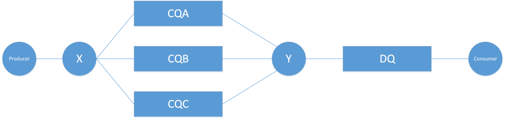
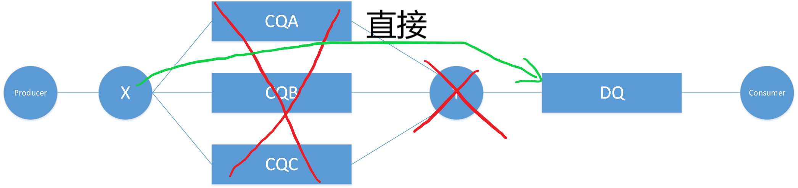
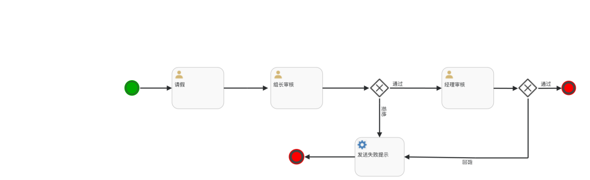

# 基于Ruoyi-vue实现某些需求

## 一、Redis实现文章自动保存

我们将文章设置为map结构。

### 1. 定义RedisUtil方法

```java
public class RedisUtil{
    @Autowired
    private RedisTemplate redisTemplate;
    /**
     * Hash 存储 map 实现多个键值保存并设置时间
     * @param key 键
     * @param map 对应多个键值
     * @param time 时间(秒)
     * @return true成功 false失败
     */
    public boolean hmset(String key, Map<String,Object> map, long time){
        try {
            redisTemplate.opsForHash().putAll(key, map);
            if(time>0){
                expire(key, time);
            }
            return true;
        } catch (Exception e) {
            e.printStackTrace();
            return false;
        }
    }

    /**
     * 获取hashKey对应的所有键值
     * @param key 键
     * @return 对应的多个键值
     */
    public Map<Object,Object> hmget(String key){
        return redisTemplate.opsForHash().entries(key);
    }

    /**
     * 删除hash表中的值
     * @param key 键 不能为null
     * @param item 项 可以使多个 不能为null
     */
    public void hdel(String key, Object... item){
        redisTemplate.opsForHash().delete(key,item);
    }
}
```

### 2. 定义RedisService业务操作

```java
    /**
     * 保存文章
     *
     * @param key
     * @param article 文章
     * @param expireTime 过期时间
     * @return
     */
    boolean saveArticle(String key, ArticlePublishParam article, long expireTime);

    /**
     * 获取文章
     *
     * @param key
     * @return
     */
    ArticlePublishParam getArticle(String key);

    /**
     * 删除文章
     *
     * @param key
     */
    void deleteArticle(String key);
```

### 3. RedisServiceImpl 

```java
@Override
public boolean saveArticle(String key, ArticlePublishParam articlePublishParam, long expireTime) {

    // 1. 首先将文章转为 map
    BeanMap beanMap = BeanMap.create(articlePublishParam);

    // 2. 保存到 redis
    return redisUtil.hmset(key, beanMap, expireTime);
}

@Override
public ArticlePublishParam getArticle(String key) {
    Map<Object, Object> map = redisUtil.hmget(key);

    if (CollectionUtils.isEmpty(map)){
        return null;
    }else {
        return JSON.parseObject(JSON.toJSONString(map), ArticlePublishParam.class);
    }
}

@Override
public void deleteArticle(String key) {
    // 1. 首先获取 Article 类的所有字段名称
    List<String> fieldNameList = getFieldNameList(ArticlePublishParam.class);

    // 2. 删除对应的对象 hash
    redisUtil.hdel(key, fieldNameList.toArray());
}

/**
 * 获取一个类的所有字段名称
 * @param clazz
 * @return
 */
private List<String> getFieldNameList(Class clazz) {
    List<String> fieldNameList = new ArrayList<>();

    // 1. 获取本类字段
    Field[] filed = clazz.getDeclaredFields();
    for(Field fd : filed) {
        String filedName = fd.getName();
        // 将序列化的属性排除
        if (!"serialVersionUID".equals(filedName)) {
            fieldNameList.add(filedName);
        }
    }

    // 2. 获取父类字段
    Class<?> superClazz = clazz.getSuperclass();
    if (superClazz != null) {
        Field[] superFields = superClazz.getDeclaredFields();
        for (Field superField : superFields) {
            String filedName = superField.getName();
            // 将序列化的属性排除
            if (!"serialVersionUID".equals(filedName)) {
                fieldNameList.add(filedName);
            }
        }
    }

    return fieldNameList;
}
```

### 4. controller层

前端每3分钟，或者自定义时间，或者设置光标焦点

```java
/**
 * 自动保存，编辑文章时每隔 3 分钟自动将数据保存到 Redis 中（以防数据丢失）
 *
 * @param param
 * @param principal
 * @return
 */
@PostMapping("/autoSave")
public ReturnResult autoSave(@RequestBody ArticlePublishParam param, Principal principal) {
    if (Objects.isNull(param)) {
        return ReturnResult.error("参数错误");
    }
    if (Objects.isNull(principal)) {
        return ReturnResult.error("当前用户未登录");
    }

    // 1. 获取当前用户 ID
    User currentUser = userService.findUserByUsername(principal.getName());

    // 2. 生成存储的 key
    // key的生成格式——文章自动保存时存储在 Redis 中的 key ,后面 {0} 是用户 ID
    /**
     * 文章自动保存时存储在 Redis 中的 key ,后面 {0} 是用户 ID
     */
    // String AUTO_SAVE_ARTICLE = "auto_save_article::{0}";
    String key = MessageFormat.format(AUTO_SAVE_ARTICLE, currentUser.getId());

    // 3. 保存到 Redis 中, 过期时间为 1 天。此处是文章的参数类 ArticlePublishParam
    boolean flag = redisService.saveArticle(key, param, 24L * 60 * 60 * 1000);
    if (flag) {
        log.info("保存 key=" + key + " 的编辑内容文章到 Redis 中成功！");
        return ReturnResult.success();
    } else {
        return ReturnResult.error("自动保存文章失败");
    }
}

/**
 * 从 Redis 中获取当前登录用户的草稿文章
 *
 * @param principal
 * @return
 */
@GetMapping("/getAutoSaveArticle")
public ReturnResult getAutoSaveArticle(Principal principal) {
    if (Objects.isNull(principal)) {
        return ReturnResult.error("当前用户未登录");
    }

    // 1. 获取当前用户 ID
    User currentUser = userService.findUserByUsername(principal.getName());

    // 2. 生成存储的 key
    String key = MessageFormat.format(AUTO_SAVE_ARTICLE, currentUser.getId());

    // 3. 获取文章信息
    ArticlePublishParam article = redisService.getArticle(key);

    if (article != null && StringUtils.isNotBlank(article.getTagsStr())){
        String[] split = article.getTagsStr().split(",");
        article.setTagStringList(Arrays.asList(split));
    }

    log.info("获取草稿文章 key=" + key + " 的内容为：" + article);
    return ReturnResult.success(article);
} 


// 文章新增或修改成功，则将当前用户在 Redis 中的草稿进行删除
// 生成存储的 key
// MessageFormat是java.text.MessageFormat类
String key = MessageFormat.format(AUTO_SAVE_ARTICLE, currentUser.getId());
redisService.deleteArticle(key);
log.info("删除草稿文章 key=" + key + " 成功！");
```

## 二、RabbitMQ实现延迟消息

在实习中，遇到一个需求，一个加热炉有多种类型的作业，例如，正常的空冷作业，淬火作业（即不仅加热还要放到要淬火的液体中）以及还有一种需要使用电载偶的作业。针对每种不同类型的作业，需要不同的作业出炉提醒，例如，空冷作业出炉前30分钟，提醒操作人员，某某号炉子要出炉了，将放在某空冷区域。对于淬火作业，需要提醒操作人员，提前一个小时需要将淬火井区域的盖子打开，同时还要提醒到期时间。因此，这里使用到延迟消息队列。

### 1. 延时队列的使用场景

那么什么时候需要用延时队列呢？考虑一下以下场景：

1. 订单在十分钟之内未支付则自动取消。
2. 新创建的店铺，如果在十天内都没有上传过商品，则自动发送消息提醒。
3. 账单在一周内未支付，则自动结算。
4. 用户注册成功后，如果三天内没有登陆则进行短信提醒。
5. 用户发起退款，如果三天内没有得到处理则通知相关运营人员。
6. 预定会议后，需要在预定的时间点前十分钟通知各个与会人员参加会议。


这些场景都有一个特点，需要在某个事件发生之后或者之前的指定时间点完成某一项任务，如：发生订单生成事件，在十分钟之后检查该订单支付状态，然后将未支付的订单进行关闭；发生店铺创建事件，十天后检查该店铺上新商品数，然后通知上新数为 0 的商户；发生账单生成事件，检查账单支付状态，然后自动结算未支付的账单；发生新用户注册事件，三天后检查新注册用户的活动数据，然后通知没有任何活动记录的用户；发生退款事件，在三天之后检查该订单是否已被处理，如仍未被处理，则发送消息给相关运营人员；发生预定会议事件，判断离会议开始是否只有十分钟了，如果是，则通知各个与会人员。

### 2. 延时任务实现方式

1. 定期轮询（数据库等）
2. DelayQueue
3. Timer
6. RabbitMQ
7. Quartz
8. Redis Zset

### 3. 死信队列
死信，顾名思义就是无法被消费的消息。producer 将消息投递到 broker 或者直接到queue 里了，consumer 从 queue 取出消息进行消费，但某些时候由于特定的原因导致 queue 中的某些消息无法被消费，这样的消息如果没有后续的处理，就变成了死信，有死信自然就有了死信队列。

应用场景:为了保证订单业务的消息数据不丢失，比如说: 用户在商城下单成功并点击去支付后在指定时间未支付时自动失效，但是用户能够看到这条订单的支付失败记录。

#### （1）死信的来源

- 消息 TTL 过期
- 队列达到最大长度(队列满了，无法再添加数据到 mq 中)
- 消息被拒绝(basic.reject 或 basic.nack)并且 requeue=false

#### （2）具体实现

使用消息队列的时候，应该先画一个消息传递图，这样能够是我们的思路很清晰。


生产者代码实现：

```java
package com.rabbitmq.eghit;

import com.rabbitmq.client.AMQP;
import com.rabbitmq.client.Channel;
import com.rabbitmq.utils.RabbitMqUtils;

import java.nio.charset.StandardCharsets;

/**
 * 死信队列生产者
 * 只声明交换机名称、定义消息特性以及下游路由
 */
public class Producer01 {
    // 普通交换机
    public static final String NORMAL_EXCHANGE = "normal_exchange";

    public static void main(String[] args) throws Exception {
        Channel channel = RabbitMqUtils.getChannel();
        // 设置死信消息的特性， 设置TTL时间， 设置过期时间，展示死信队列
        AMQP.BasicProperties properties = new AMQP.BasicProperties().builder().expiration("10000").build();
        // 向队列中发送消息
        for (int i = 1; i < 11; i++) {
            String msg = "info" + i;
            //void basicPublish(String exchange, String routingKey, BasicProperties props, byte[] body) 
            channel.basicPublish(NORMAL_EXCHANGE, "zhangsan", properties, msg.getBytes(StandardCharsets.UTF_8));

        }
    }
}
```

消费者1实现

```java
package com.rabbitmq.eghit;

import com.rabbitmq.client.BuiltinExchangeType;
import com.rabbitmq.client.Channel;
import com.rabbitmq.client.DeliverCallback;
import com.rabbitmq.utils.RabbitMqUtils;

import java.nio.charset.StandardCharsets;
import java.util.HashMap;
import java.util.Map;

/**
 * 死信队列
 */
public class Consumer01 {

    // 定义普通交换机名
    public static final String NORMAL_EXCHANGE = "normal_exchange";
    // 定义普通队列名
    public static final String NORMAL_QUEUE = "normal_queue";
    // 定义死信交换机名
    public static final String DEAD_EXCHANGE = "dead_exchange";
	// 定义死信队列名
    public static final String DEAD_QUEUE = "dead_exchange";

    public static void main(String[] args) throws Exception {
        Channel channel = RabbitMqUtils.getChannel();
        // 声明普通交换机和死信交换机类型为direct
        channel.exchangeDeclare(NORMAL_EXCHANGE, BuiltinExchangeType.DIRECT);
        channel.exchangeDeclare(DEAD_EXCHANGE, BuiltinExchangeType.DIRECT);

        // 声明队列的参数
        Map<String, Object> arguments = new HashMap<>();
        // 设置过期时间，可以在生产者处进行设置
		// arguments.put("x-message-ttl", 100000);
        //正常队列设置死信交换机， 参数 key 是固定值
        arguments.put("x-dead-letter-exchange", DEAD_EXCHANGE);
        // 设置死信交换机的RoutingKey， 参数 key 是固定值
        arguments.put("x-dead-letter-routing-key", "lisi");
        // 设置正常队列的长度限制
		// arguments.put("x-max-length", 6);
        
        // 声明普通队列
        channel.queueDeclare(NORMAL_QUEUE, false, false,false,arguments);
        // 声明死信队列
        channel.queueDeclare(DEAD_QUEUE,false,false,false,null);

        // 绑定交换机和队列
        channel.queueBind(NORMAL_QUEUE,NORMAL_EXCHANGE,"zhangsan");
        channel.queueBind(DEAD_QUEUE,DEAD_EXCHANGE,"lisi");
        System.out.println("等待接收消息......");

        // 回调函数
        DeliverCallback deliverCallback = (consumerTag, msg) -> {
            System.out.println("Consumer01 接收的消息是：" + new String(msg.getBody(), StandardCharsets.UTF_8));
        };

        // 消费的时候，需要回调函数
        channel.basicConsume(NORMAL_QUEUE, true, deliverCallback, consumerTag -> {});
    }
}
```

消费者2实现

```java

import com.rabbitmq.client.Channel;
import com.rabbitmq.client.DeliverCallback;
import com.rabbitmq.utils.RabbitMqUtils;

import java.nio.charset.StandardCharsets;

/**
 * 死信队列
 */
public class Consumer02 {

    public static final String DEAD_QUEUE = "dead_exchange";

    public static void main(String[] args) throws Exception {
        Channel channel = RabbitMqUtils.getChannel();
        System.out.println("等待接收消息.......");
        
        
        DeliverCallback deliverCallback = (consumerTag, msg) -> {
            System.out.println("Consumer02 接收的消息是：" + new String(msg.getBody(), StandardCharsets.UTF_8));
        };

        channel.basicConsume(DEAD_QUEUE, true, deliverCallback, consumerTag -> {});

    }
}
```

### 4.死信队列实现延迟消息

本文使用Ruoyi-Vue集成RabbitMQ，实现死信队列延迟消息。

> 注意： 整合RabbitMQ后，有时候会出现connection refuse的情况，需要重启系统几次

#### （1）添加依赖和配置

```xml
<!-- rabbitmq-->
<dependency>
    <groupId>org.springframework.boot</groupId>
    <artifactId>spring-boot-starter-amqp</artifactId>
</dependency>

rabbitmq:
    host: 127.0.0.1
    port: 5672
    username: guest
    password: guest	
```

#### （2）延迟消息结构图



#### （3）代码实现

结构图配置代码实现：

```java
package com.ruoyi.framework.config;

import org.springframework.amqp.core.*;
import org.springframework.beans.factory.annotation.Qualifier;
import org.springframework.context.annotation.Bean;
import org.springframework.context.annotation.Configuration;

import java.util.HashMap;
import java.util.Map;

/**
 * 配置文件类代码
 */

@Configuration
public class TtlQueueConfig {
    // 普通交换机
    public static final String X_EXCHANGE = "X";
    // 死信交换机
    public static final String Y_DEAD_LETTER_EXCHANGE = "Y";

    // 普通队列名称
    public static final String QUEUE_A = "CQA";
    public static final String QUEUE_B = "CQB";
    public static final String QUEUE_C = "CQC";

    // 死信队列名称
    public static final String DEAD_LETTER_QUEUE = "DQ";

    // 声明普通交换机
    @Bean("xExchange")
    public DirectExchange xExchange(){
        return new DirectExchange(X_EXCHANGE);
    }

    // 声明死信交换机
    @Bean("yExchange")
    public DirectExchange yExchange(){
        return new DirectExchange(Y_DEAD_LETTER_EXCHANGE);
    }


    // 声明普通队列A，声明时，需要将下游交换机和路由进行声明
    @Bean("queueA")
    public Queue queueA(){
        Map<String, Object> arguments = new HashMap<>();
        // 设置死信交换机
        arguments.put("x-dead-letter-exchange",Y_DEAD_LETTER_EXCHANGE);
        // 设置死信routingKey
        arguments.put("x-dead-letter-routing-key","YD");
        // 设置TTL，unit 是ms
        // arguments.put("x-message-ttl", 10000); 这里设置的是消息过期时间，如果需要手动输入，则把这句话去掉
        return QueueBuilder.durable(QUEUE_A).withArguments(arguments).build();
    }

    // 绑定普通队列A 和 普通交换机
    @Bean
    public Binding queueABindingX(@Qualifier("queueA") Queue queueA,
                                  @Qualifier("xExchange") DirectExchange xExchange) {
        return BindingBuilder.bind(queueA).to(xExchange).with("XA");
    }

    // 声明普通队列 B ，声明时，需要将下游交换机和路由进行声明
    @Bean("queueB")
    public Queue queueB(){
        Map<String, Object> arguments = new HashMap<>();
        // 设置死信交换机
        arguments.put("x-dead-letter-exchange",Y_DEAD_LETTER_EXCHANGE);
        // 设置死信routingKey
        arguments.put("x-dead-letter-routing-key","YD");
        // 设置TTL，unit 是ms
        // arguments.put("x-message-ttl", 40000);
        return QueueBuilder.durable(QUEUE_B).withArguments(arguments).build();
    }

    // 绑定 B 和 普通交换机
    @Bean
    public Binding queueBBindingX(@Qualifier("queueB") Queue queueB,
                                  @Qualifier("xExchange") DirectExchange xExchange) {
        return BindingBuilder.bind(queueB).to(xExchange).with("XB");
    }

    //声明队列 C 死信交换机， 声明时，需要将下游交换机和路由进行声明
    @Bean("queueC")
    public Queue queueC(){
        Map<String, Object> args = new HashMap<>(3);
        //声明当前队列绑定的死信交换机
        args.put("x-dead-letter-exchange", Y_DEAD_LETTER_EXCHANGE);
        //声明当前队列的死信路由 key
        args.put("x-dead-letter-routing-key", "YD");
        //没有声明 TTL 属性
        return QueueBuilder.durable(QUEUE_C).withArguments(args).build();
    }


    //声明队列 C 和 交换机
    @Bean
    public Binding queueCBindingX(@Qualifier("queueC") Queue queueC,
                                  @Qualifier("xExchange") DirectExchange xExchange){
        return BindingBuilder.bind(queueC).to(xExchange).with("XC");
    }

    // 声明死信队列
    @Bean("queueD")
    public Queue queueD(){
        return QueueBuilder.durable(DEAD_LETTER_QUEUE).build();
    }

    // 绑定 D 和 交换机
    @Bean
    public Binding queueDBindingY(@Qualifier("queueD") Queue queueD,
                                  @Qualifier("yExchange") DirectExchange yExchange) {
        return BindingBuilder.bind(queueD).to(yExchange).with("YD");
    }
}
```

结构图生产者代码：

```java
/**
 * Rabbitmq的消息生产者
 */
@Api("发送消息")
@Slf4j
@RestController
@RequestMapping("/ttl")
public class SendMsgController {
    @Autowired
    private RabbitTemplate rabbitTemplate;

 	/**
     * 自定义过期时间，但是，这种方式无法保证消息按照过期时间的长短进行消费，只能监听第一个消息优先被消费
     *
     * @param message
     * @param ttlTime
     */
    @ApiOperation("发送自定义过期时间消息")
    @GetMapping("/sendExpirationMsg/{message}/{ttlTime}")
    public void sendMsg(@PathVariable String message, @PathVariable String ttlTime) {
        rabbitTemplate.convertAndSend("X", "XC", message,
                msg -> {
                    msg.getMessageProperties().setExpiration(ttlTime);
                    return msg;
                });
        log.info("当前时间：{},发送一条时长{}毫秒 TTL 信息给队列 C:{}", new Date(), ttlTime, message);
    }
}
```

结构图消费者代码：

```java
import lombok.extern.slf4j.Slf4j;
import org.springframework.amqp.core.Message;
import org.springframework.amqp.rabbit.annotation.RabbitListener;
import org.springframework.stereotype.Component;

import java.util.Date;

// 监听队列
@Component
@Slf4j
public class DeadLetterQueueConsumer {

    // 接收消息
    @RabbitListener(queues = "DQ")
    public void receiveD(Message message){
        String msg = new String(message.getBody());
        log.info("当前时间：{}, 接收到死信队列的消息：{}",new Date(), msg);
    }
}
```

### 5.死信队列延迟消息的问题

消息可能并不会按时“死亡“，因为 RabbitMQ 只会检查第一个消息是否过期，如果过期则丢到死信队列，如果第一个消息的延时时长很长，而第二个消息的延时时长很短，第二个消息并不会优先得到执行。

这里有两种解决方案，第一种是，为每个普通队列分别设置不同的私信队列，但是这样将会很麻烦。第二种，就是使用RabbitMQ的插件实现延迟队列。

### 6.使用延迟队列插件

在githu上下载https://github.com/rabbitmq/rabbitmq-delayed-message-exchange/releases，

下载rabbitmq_delayed_message_exchange 插件，放置到 RabbitMQ 的插件目录。然后进入sbin目录下，执行命令

```bash
rabbitmq-plugins enable rabbitmq_delayed_message_exchange
```

修改第4章中的Y交换机和私信队列，为延迟交换机和延迟队列。引入延迟队列插件后，能够将整体架构图修改到非常简单。



由于使用的是延迟队列插件，这个插件延迟类型rabbitmq一开始不支持的，是后续版本的扩展。因此，我们在设置配置的时候，需要用到自定义交换机配置，即CustomExchange。

配置代码：

```java
import org.springframework.amqp.core.*;
import org.springframework.beans.factory.annotation.Qualifier;
import org.springframework.context.annotation.Bean;
import org.springframework.context.annotation.Configuration;

import java.util.HashMap;
import java.util.Map;

/**
 * 基于延迟队列的插件实现消息延迟发送
 * 延迟的地方在交换机上
 * 这种方式，只需要生产者-》交换机-》队列-》消费者
 */
@Configuration
public class DelayQueueConfig {

    // 延迟交换机
    public static final String DELAY_EXCHANGE_NAME = "delayed.exchange";
    // 延迟队列
    public static final String DELAY_QUEUE_NAME = "delayed.queue";
    // routingKey
    public static final String DELAY_ROUTING_KEY = "delayed.routing.key";

    // 延迟队列声明
    @Bean
    public Queue delayedQueue() {
        return new Queue(DELAY_QUEUE_NAME);
    }

    // 因为基于插件的，因此这里只能是自定义交换机
    @Bean
    public CustomExchange delayedExchange(){
        Map<String, Object> arguments = new HashMap<>();
        arguments.put("x-delayed-type", "direct");
        /**
         * 1. 交换机的名称
         * 2. 类型
         * 3. 是否需要持久化
         * 4. 是否需要自动删除
         * 5. 其他的参数
         */
        return new CustomExchange(DELAY_EXCHANGE_NAME, "x-delayed-message", true, false, arguments);
    }

    // 将交换机和队列进行绑定
    @Bean
    public Binding delayedQueueBindingDelayedExchange(@Qualifier("delayedQueue") Queue delayedQueue,
                                                      @Qualifier("delayedExchange") CustomExchange delayedExchange){
        return BindingBuilder.bind(delayedQueue).to(delayedExchange).with(DELAY_ROUTING_KEY).noargs();
    }

}
```

生产者代码：

```java

import io.swagger.annotations.Api;
import io.swagger.annotations.ApiOperation;
import lombok.extern.slf4j.Slf4j;
import org.springframework.amqp.rabbit.core.RabbitTemplate;
import org.springframework.beans.factory.annotation.Autowired;
import org.springframework.web.bind.annotation.GetMapping;
import org.springframework.web.bind.annotation.PathVariable;
import org.springframework.web.bind.annotation.RequestMapping;
import org.springframework.web.bind.annotation.RestController;

import java.util.Date;

/**
 * Rabbitmq的消息生产者
 */
@Api("发送消息")
@Slf4j
@RestController
@RequestMapping("/ttl")
public class SendMsgController {

    @Autowired
    private RabbitTemplate rabbitTemplate;

    // 延迟交换机
    public static final String DELAY_EXCHANGE_NAME = "delayed.exchange";
    // routingKey
    public static final String DELAY_ROUTING_KEY = "delayed.routing.key";
    
      /**
     * 使用延迟队列插件实现延迟消息
     *
     * @param message
     * @param delayTime
     */
    @ApiOperation("使用延迟队列插件实现延迟消息")
    @GetMapping("sendDelayMsg/{message}/{delayTime}")
    public void sendMsg(@PathVariable String message, @PathVariable Integer delayTime) {
        rabbitTemplate.convertAndSend(DELAY_EXCHANGE_NAME, DELAY_ROUTING_KEY, message,
                msg -> {
                    msg.getMessageProperties().setDelay(delayTime);
                    return msg;
                });
        log.info(" 当 前 时 间 ： {}, 发 送 一 条 延 迟 {} 毫秒的信息给队列 delayed.queue:{}", new
                Date(), delayTime, message);
    }
}
```

消费者代码：

```java
import lombok.extern.slf4j.Slf4j;
import org.springframework.amqp.core.Message;
import org.springframework.amqp.rabbit.annotation.RabbitListener;
import org.springframework.stereotype.Component;

import java.util.Date;

@Component
@Slf4j
public class DeadLetterQueueConsumer {

    // 延迟队列
    public static final String DELAY_QUEUE_NAME = "delayed.queue";

    @RabbitListener(queues = DELAY_QUEUE_NAME)
    public void receiveDelayedQueue(Message message){
        String msg = new String(message.getBody());
        log.info("当前时间：{},收到延时队列的消息：{}", new Date(), msg);
    }
}
```

## 三、整合Flowable实现工作流

### 1.ry-admin下的pom中引入Flowable

```
<dependency>
    <groupId>org.flowable</groupId>
    <artifactId>flowable-spring-boot-starter</artifactId>
    <version>6.7.2</version>
</dependency>
```

在IDEA中安装**Flowable BPMN visualizer**插件，在admin的resources中创建processes目录，用来部署后面编写的流程图。这个目录下的流程文件将来会被自动部署。

启动程序后，会自动在数据库中生成对应的表。

### 2.流程部署

#### （1）自动部署方法

在applicaiton.properties中编写如下代码：

```properties
flowable.check-process-definitions=true
flowable.process-definition-location-prefix=classpath*:/processes/
flowable.process-definition-location-suffixes=**.bpmn20.xml,**.bpmn
logging.level.org.flowable=debug
```

- `flowable.check-process-definitions`：这个表示是否在项目启动的时候，去检查文件目录是否有对应的流程文件，该属性为 true 表示如果有流程文件就自动部署，false 表示不检查，那么也就不会自动部署。
- `flowable.process-definition-location-prefix`：这个是流程文件的位置，默认就是 `classpath*:/processes/`，当然开发者也可以进行配置。
- `flowable.process-definition-location-suffixes`：这个是流程文件的后缀，默认有两个，分别是 `**.bpmn20.xml` 和 `**.bpmn`，当然开发者也可以进行配置。

#### （2）手动部署方法

有的时候，我们的流程可能并不是提前设计好的，而是项目启动之后，手动部署的，例如项目启动成功之后，手动上传一个流程的 XML 文件进行部署，这也是一种比较常见的场景，对于这种情况，我们可以按照如下方式进行部署：

```java
@RestController
public class ProcessDeployController {

    @Autowired
    RepositoryService repositoryService;

    @PostMapping("/deploy")
    public RespBean deploy(MultipartFile file) throws IOException {
        DeploymentBuilder deploymentBuilder = repositoryService.createDeployment()
                .category("javaboy的工作流分类")
                .name("javaboy的工作流名称")
                .addInputStream(file.getOriginalFilename(), file.getInputStream())
                .key("javaboy的工作流key");
        Deployment deployment = deploymentBuilder
                .deploy();
        return RespBean.ok("部署成功",deployment.getId());
    }
}
```

### 3.请假流程

接下来我们在 processes 目录下，新建一个 BPMN 文件（插件装好了就有这个选项了）。我们来画个请假的流程，就叫做 ask_for_leave.bpmn20.xml，注意最后面的 `.bpmn20.xml` 是固定后缀。

首先定义一个流程图，如下图所示：



对应的xml代码如下：

```xml
<?xml version="1.0" encoding="UTF-8"?>
<definitions xmlns="http://www.omg.org/spec/BPMN/20100524/MODEL" xmlns:xsi="http://www.w3.org/2001/XMLSchema-instance" xmlns:xsd="http://www.w3.org/2001/XMLSchema" xmlns:flowable="http://flowable.org/bpmn" xmlns:bpmndi="http://www.omg.org/spec/BPMN/20100524/DI" xmlns:omgdc="http://www.omg.org/spec/DD/20100524/DC" xmlns:omgdi="http://www.omg.org/spec/DD/20100524/DI" typeLanguage="http://www.w3.org/2001/XMLSchema" expressionLanguage="http://www.w3.org/1999/XPath" targetNamespace="http://www.flowable.org/processdef">
  <process id="ask_for_leave" name="ask_for_leave" isExecutable="true">
    <userTask id="leaveTask" name="请假" flowable:assignee="#{leaveTask}"/>
    <userTask id="zuzhangTask" name="组长审核" flowable:assignee="#{zuzhangTask}"/>
    <userTask id="managerTask" name="经理审核" flowable:assignee="#{managerTask}"/>
    <exclusiveGateway id="managerJudgeTask"/>
    <exclusiveGateway id="zuzhangJudeTask"/>
    <endEvent id="endLeave" name="结束"/>
    <startEvent id="startLeave" name="开始"/>
    <sequenceFlow id="flowStart" sourceRef="startLeave" targetRef="leaveTask"/>
    <sequenceFlow id="modeFlow" sourceRef="leaveTask" targetRef="zuzhangTask"/>
    <sequenceFlow id="zuzhang_go" sourceRef="zuzhangJudeTask" targetRef="managerTask" name="通过">
      <conditionExpression xsi:type="tFormalExpression"><![CDATA[${checkResult=='通过'}]]></conditionExpression>
    </sequenceFlow>
    <sequenceFlow id="zuzhang_reject" sourceRef="zuzhangJudeTask" targetRef="sendMail" name="拒绝">
      <conditionExpression xsi:type="tFormalExpression"><![CDATA[${checkResult=='拒绝'}]]></conditionExpression>
    </sequenceFlow>
    <sequenceFlow id="jugdeFlow" sourceRef="managerTask" targetRef="managerJudgeTask"/>
    <sequenceFlow id="flowEnd" name="通过" sourceRef="managerJudgeTask" targetRef="endLeave">
      <conditionExpression xsi:type="tFormalExpression"><![CDATA[${checkResult=='通过'}]]></conditionExpression>
    </sequenceFlow>
    <sequenceFlow id="rejectFlow" name="拒绝" sourceRef="managerJudgeTask" targetRef="sendMail">
      <conditionExpression xsi:type="tFormalExpression"><![CDATA[${checkResult=='拒绝'}]]></conditionExpression>
    </sequenceFlow>
    <serviceTask id="sendMail" flowable:exclusive="true" name="发送失败提示" isForCompensation="true" flowable:class="org.javaboy.flowable.AskForLeaveFail"/>
    <sequenceFlow id="endFlow" sourceRef="sendMail" targetRef="askForLeaveFail"/>
    <endEvent id="askForLeaveFail" name="请假失败"/>
    <sequenceFlow id="zuzhangTask_zuzhangJudeTask" sourceRef="zuzhangTask" targetRef="zuzhangJudeTask"/>
  </process>
  <bpmndi:BPMNDiagram id="BPMNDiagram_ask_for_leave.bpmn20">
    <bpmndi:BPMNPlane bpmnElement="ask_for_leave.bpmn20" id="BPMNPlane_ask_for_leave.bpmn20"></bpmndi:BPMNPlane>
  </bpmndi:BPMNDiagram>
</definitions>
```

其中，需要关注的是<process>标签中的内容，结合 XML 文件我来和大家解释一下这里涉及到的 Flowable 中的组件，我们来看下：

- `<process>` ：表示一个完整的工作流程。
- `<startEvent>` ：工作流中起点位置，也就是图中的绿色按钮。
- `<endEvent>` ：工作流中结束位置，也就是图中的红色按钮。
- `<userTask>` ：代表一个任务审核节点（组长、经理等角色），这个节点上有一个 `flowable:assignee` 属性，这表示这个节点该由谁来处理，将来在 Java 代码中调用的时候，我们需要指定对应的处理人的 ID 或者其他唯一标记。
- `<serviceTask>`：这是服务任务，在具体的实现中，这个任务可以做任何事情。
- `<exclusiveGateway>` ：逻辑判断节点，相当于流程图中的菱形框。
- `<sequenceFlow>` ：链接各个节点的线条，sourceRef 属性表示线的起始节点，targetRef 属性表示线指向的节点，我们图中的线条都属于这种。

### 3.开发中需要熟悉的概念

- ProcessDefinition

这个最好理解，就是流程的定义，也就相当于规范，每个 ProcessDefinition 都会有一个 id。

- ProcessInstance

这个就是流程的一个实例。简单来说，ProcessDefinition 相当于是类，而 ProcessInstance 则相当于是根据类 new 出来的对象。

- Activity

Activity 是流程标准规范 BPMN2.0 里面的规范，流程中的每一个步骤都是一个 Activity。

- Execution

Execution 的含义是流程的执行线路，通过 Execution 可以获得当前 ProcessInstance 当前执行到哪个 Activity了。

- Task

Task 就是当前要做的工作。

### 4.查看流程执行到哪一步

```java
package com.ruoyi.web.controller.flow;

import org.flowable.bpmn.model.BpmnModel;
import org.flowable.engine.*;
import org.flowable.engine.runtime.Execution;
import org.flowable.engine.runtime.ProcessInstance;
import org.flowable.image.ProcessDiagramGenerator;
import org.springframework.beans.factory.annotation.Autowired;
import org.springframework.web.bind.annotation.GetMapping;
import org.springframework.web.bind.annotation.RestController;

import javax.servlet.http.HttpServletResponse;
import java.io.InputStream;
import java.io.OutputStream;
import java.util.ArrayList;
import java.util.List;

@RestController
public class HelloFlowableController {

    @RestController
    public class HelloController {

    @Autowired
    RuntimeService runtimeService;

    @Autowired
    TaskService taskService;

    @Autowired
    RepositoryService repositoryService;

    @Autowired
    ProcessEngine processEngine;

    @GetMapping("/pic")
    public void showPic(HttpServletResponse resp, String processId) throws Exception {
        ProcessInstance pi = runtimeService.createProcessInstanceQuery().processInstanceId(processId).singleResult();
        if (pi == null) {
            return;
        }
        List<Execution> executions = runtimeService
                .createExecutionQuery()
                .processInstanceId(processId)
                .list();

        List<String> activityIds = new ArrayList<>();
        List<String> flows = new ArrayList<>();
        for (Execution exe : executions) {
            List<String> ids = runtimeService.getActiveActivityIds(exe.getId());
            activityIds.addAll(ids);
        }

        /**
          * 生成流程图
          */
        BpmnModel bpmnModel = repositoryService.getBpmnModel(pi.getProcessDefinitionId());
        ProcessEngineConfiguration engconf = processEngine.getProcessEngineConfiguration();
        ProcessDiagramGenerator diagramGenerator = engconf.getProcessDiagramGenerator();
        InputStream in = diagramGenerator.generateDiagram(bpmnModel, "png", activityIds, flows, engconf.getActivityFontName(), engconf.getLabelFontName(), engconf.getAnnotationFontName(), engconf.getClassLoader(), 1.0, false);
        OutputStream out = null;
        byte[] buf = new byte[1024];
        int legth = 0;
        try {
            out = resp.getOutputStream();
            while ((legth = in.read(buf)) != -1) {
                out.write(buf, 0, legth);
            }
        } finally {
            if (in != null) {
                in.close();
            }
            if (out != null) {
                out.close();
            }
        }
    }
    }
}
```

### 5.员工发起一个流程

```java
 String staffId = "1000";
 // 这里可以与接口对应起来，这里实际上就是从接口处接收到的参数
 HashMap<String, Object> map = new HashMap<>();
 map.put("leaveTask", staffId);
 // 开启一个流程，这里直接使用map将发起人的id填写进去了。也可以通过identityService.setAuthenticatedUserId(staffId);ProcessInstance pi = runtimeService.startProcessInstanceByKey("leave");这两句来发起
 ProcessInstance processInstance = runtimeService.startProcessInstanceByKey("ask_for_leave", map);
 runtimeService.setVariable(processInstance.getId(), "name", "javaboy");
 runtimeService.setVariable(processInstance.getId(), "reason", "休息一下");
 runtimeService.setVariable(processInstance.getId(), "days", 10);
 logger.info("创建请假流程 processId：{}", processInstance.getId());
```

首先由员工发起一个请假流程，map 中存放的 leaveTask 是我们在 XML  流程文件中提前定义好的，提前定义好当前这个任务创建之后，该由谁来处理，这里我们是假设由工号为 1000  的员工来发起这样一个请假流程。

> map.put("leaveTask", staffId); 
>
> 实际上对应着
>
> <userTask id="leaveTask" name="请假" flowable:assignee="#{leaveTask}"/>

同时，我们还设置了一些额外信息。ask_for_leave 是我们在 XML 文件中定义的一个 process  的名称id。

### 6.将请求提交给组长

```
<userTask id="leaveTask" name="请假" flowable:assignee="#{leaveTask}"/>
```

对应Java代码如下：

```java
String zuzhangId = "90";
//员工查找到自己的任务，然后提交给组长审批
List<Task> list = taskService.createTaskQuery().taskAssignee(staffId).orderByTaskId().desc().list();
for (Task task : list) {
    logger.info("任务 ID：{}；任务处理人：{}；任务是否挂起：}", task.getId(), task.getAssignee(), task.isSuspended());
    Map<String, Object> map = new HashMap<>();
    //提交给组长的时候，需要指定组长的 id
    map.put("zuzhangTask", zuzhangId);
    taskService.complete(task.getId(), map);
}
```

### 7.UserTask组长审批

```
<userTask id="zuzhangTask" name="组长审核" flowable:assignee="#{zuzhangTask}"/>
```

对应Java代码如下：

```java
List<Task> list = taskService.createTaskQuery().taskAssignee(zuzhangId).orderByTaskId().desc().list();
    for (Task task : list) {
        logger.info("组长 {} 在审批 {} 任务", task.getAssignee(), task.getId());
        Map<String, Object> map = new HashMap<>();
        
        //组长审批的时候，如果是同意，需要指定经理的 id
        map.put("managerTask", managerId);
        map.put("checkResult", "通过");
        
        // 如果是拒绝的话，就不需要指定经理id，也就是不需要进行下一步骤了
        map.put("checkResult", "拒绝");
        
        taskService.complete(task.getId(), map);
    }
```

### 8.userTask经理审批

```
<userTask id="managerTask" name="经理审核" flowable:assignee="#{managerTask}"/>
```

对应Java代码如下：

```java
List<Task> list = taskService.createTaskQuery().taskAssignee(managerId).orderByTaskId().desc().list();
    for (Task task : list) {
        logger.info("经理 {} 在审批 {} 任务", task.getAssignee(), task.getId());
        Map<String, Object> map = new HashMap<>();
        // 通过
        map.put("checkResult", "通过");
        // 拒绝
        map.put("checkResult", "拒绝");
        taskService.complete(task.getId(), map);
    }
```

### 9.serviceTask通知操作

当审批人拒绝后，会进入一个serviceTask中执行相应的操作，在xml中，我们定义了这个服务与Java代码中对应类。例如，该serviceTask对应的java类是org.javaboy.flowable.AskForLeaveFail。

```xml
<serviceTask id="sendMail" flowable:exclusive="true" name="发送失败提示" isForCompensation="true" flowable:class="org.javaboy.flowable.AskForLeaveFail"/>
```

对应的Java代码如下所示，首先定义一个AskForLeaveFail类，然后实现JavaDelegate接口，并且实现execute方法。在这个方法里，写一些业务逻辑，通常就是调用站内消息平台，发送用户消息。

```java
public class AskForLeaveFail implements JavaDelegate {
    @Override
    public void execute(DelegateExecution execution) {
        System.out.println("请假失败。。。");
    }
}
```

### 10.查询已经执行过的流程

```java
@Autowired
HistoryService historyService;
private static final Logger logger = LoggerFactory.getLogger(HiTest.class);

    @Test
    void test01() {
        List<HistoricProcessInstance> list = historyService.createHistoricProcessInstanceQuery().list();
        for (HistoricProcessInstance hi : list) {
            logger.info("==={},{},{},{},{},{}",hi.getId(),hi.getName(),hi.getStartActivityId(),hi.getStartTime(),hi.getEndActivityId(),hi.getEndTime());
        }
    }
```

### 11.查询历史活动

在流程中，活动指的就是流程图中每一个组件，例如start，task以及网关和连线。因此，查询活动会将整个流程图上的内容都查出来。

```java
List<HistoricActivityInstance> list = historyService.createHistoricActivityInstanceQuery().orderByHistoricActivityInstanceStartTime().asc().list();
    for (HistoricActivityInstance hai : list) {
        logger.info("流程ID：{}，活动名称：{}，活动ID:{}，活动处理人：{}",hai.getProcessInstanceId(),hai.getActivityName(),hai.getActivityId(),hai.getAssignee());
    }
```

### 12.查询历史任务

任务，也就是需要进行审批的节点，仅仅只有Task。

```java
    List<HistoricTaskInstance> list = historyService.createHistoricTaskInstanceQuery().orderByHistoricTaskInstanceStartTime().asc().list();
    for (HistoricTaskInstance hti : list) {
        logger.info("流程ID：{}，Task 开始时间：{}，Task 结束时间:{}，Task 处理人：{}",hti.getProcessInstanceId(),hti.getCreateTime(),hti.getEndTime(),hti.getAssignee());
    }
```

### 13.将流程挂起

将流程挂起以后，就不能再使用了。需要重新激活才能使用。

流程挂起后，流程的执行实例会被挂起。流程的 Task会 被挂起。

```java
// 查询某个流程是否被挂起
String id = processDefinition.getId();
boolean suspended = repositoryService.isProcessDefinitionSuspended(id);

// 将流程挂起
List<ProcessDefinition> list = repositoryService.createProcessDefinitionQuery().list();
for (ProcessDefinition pd : list) {
    repositoryService.suspendProcessDefinitionById(pd.getId());
    // 挂起函数设置参数，第二个参数 true 表示是否要挂起这个流程定义对应的所有的流程实例，true 表示挂起。第三个参数 null 表示流程挂起的具体时间，如果该参数为 null，则流程会被立马挂起，如果该参数是一个具体的日期，则到期之后流程才会被挂起，但是这个需要 job executor。
    repositoryService.suspendProcessDefinitionById(pd.getId(), true, null);
}
```

### 14.将流程激活

```java
List<ProcessDefinition> list = repositoryService.createProcessDefinitionQuery().list();
for (ProcessDefinition pd : list) {
	repositoryService.activateProcessDefinitionById(pd.getId());
    // 流程激活，同样可以设置时间
    repositoryService.activateProcessDefinitionById(pd.getId(), true, null);
}
```

### 15.表单创建

Flowable可以将表单创建在xml中，如下代码所示：

```xml
<extensionElements>
      <flowable:formProperty id="startTime" name="请假开始时间" type="date" datePattern="yyyy-MM-dd HH:mm" required="true"></flowable:formProperty>
      <flowable:formProperty id="endTime" name="请假结束时间" type="date" datePattern="yyyy-MM-dd HH:mm" required="true"></flowable:formProperty>
      <flowable:formProperty id="reason" name="请假理由" type="string" required="true"></flowable:formProperty>
      <flowable:formProperty id="days" name="请假天数" type="long" required="true"></flowable:formProperty>
</extensionElements>
```

也可以使用HTML床架表单，但是在当今前后端分离的情况下，使用JSON是比较方便的，尤其是后端采用的都是SpringBoot的情况下。

首先在properties中定义表单的存放目录

```properties
# 默认的表单文件后缀
flowable.form.resource-suffixes=**.form
# 默认的表单文件位置
flowable.form.resource-location=classpath*:/forms/
```

还是以我们的请假请求为例，我来创建一个表单文件，文件名为 `ask_level.form`，如下：

```json
{
    "key": "application_form.form",
    "name": "经理审批表单",
    "fields": [
        {
            "id": "days",
            "name": "请假天数",
            "type": "string",
            "required": true,
            "placeholder": "empty"
        },
        {
            "id": "reason",
            "name": "请假原因",
            "type": "string",
            "required": true,
            "placeholder": "empty"
        },
        {
            "id": "startTime",
            "name": "开始时间",
            "type": "date",
            "required": true,
            "placeholder": "empty"
        },
        {
            "id": "endTime",
            "name": "结束时间",
            "type": "date",
            "required": true,
            "placeholder": "empty"
        }
    ]
}
```

这个 key 就是表单的唯一标识符，当有多个表单的时候，这个该值不可以重复，name 是表单是名称，fields 则定义了具体的字段，这里一共有四个。

在每一个 filed 的定义中，id 表示字段名，name 则是字段的中文名称，type 表示字段的类型，require  则表示这个字段是否是必填字段，placeholder 不用多说，跟我们日常使用的 input 标签中的 placeholder 的含义一致。

## 四、 整合WebSocket

### 2.WebSocket和Socket通信

WebSocket是即时通信的一种。实现即时通讯主要有四种方式，它们分别是：短轮询、长轮询(comet)、长连接(SSE)、WebSocket。

- 它们大体可以分为两类，一种是在HTTP基础上实现的，包括短轮询、comet和SSE；
- 另一种不是在HTTP基础上实现是，即WebSocket。

下面分别介绍一下这四种轮询方式，以及它们各自的优缺点。

#### 2.1 ajax短轮询

短轮询的基本思路就是浏览器每隔一段时间向服务器发送http请求，服务器端在收到请求后，不论是否有数据更新，都直接进行响应。

#### 2.2 ajax comet -长轮询

comet 指的是，当服务器收到客户端发来的请求后，不会直接进行响应，而是先将这个请求挂起，然后判断服务器端数据是否有更新。如果有更新，则进行响应，如果一直没有数据，则到达一定的时间限制（服务器端设置）后关闭连接。明显减少了很多不必要的http请求次数，相比之下节约了资源。长轮询的缺点在于，连接挂起也会导致资源的浪费

#### 2.3 SSE

SSE （ Server-sent Events ）是 WebSocket 的一种轻量代替方案，使用 HTTP 协议。严格地说，HTTP 协议是没有办法做服务器推送的，但是当服务器向客户端声明接下来要发送流信息时，客户端就会保持连接打开，SSE 使用的就是这种原理。它可以允许服务推送数据到客户端，不需要客户端发送请求，可以实现只要服务器端数据有更新，就可以马上发送到客户端。

SSE的优势很明显，它不需要建立或保持大量的客户端发往服务器端的请求，节约了很多资源，提升应用性能SSE的实现非常简单，并且不需要依赖其他插件。(不支持IE浏览器，单向通道)。

SSE的缺点是单向通道，只能服务器向客户端发送消息，如果客户端需要向服务器发送消息，则需要一个新的 HTTP 请求。 这对比 WebSocket  的双工通道来说，会有更大的开销。这么一来的话就会存在一个「什么时候才需要关心这个差异？」的问题，如果平均每秒会向服务器发送一次消息的话，那应该选择 WebSocket。如果一分钟仅 5 - 6 次的话，其实这个差异并不大。

#### 2.4 WebSocket

HTML5 定义的 WebSocket 协议，WebSocket 是独立的、创建在 TCP 上的协议，与传统的http协议不同，该协议可以实现服务器与客户端之间全双工通信。

简单来说，首先需要在客户端和服务器端建立起一个连接，这部分需要http。连接一旦建立，客户端和服务器端就处于平等的地位，可以相互发送数据，不存在请求和响应的区别。它能更好的节省服务器资源和带宽，并且能够更实时地进行通讯.

#### 2.5 Socket 是什么

##### Unix 中的 Socket

操作系统中也有使用到 Socket 这个概念用来进行进程间通信，它和通常说的基于 TCP/IP 的 Socket 概念十分相似，代表了在操作系统中传输数据的两方，只是它不再基于网络协议，而是操作系统本身的文件系统。

##### 网络中的 Socket

Socket 是对 TCP/IP 的封装；HTTP 是轿车，提供了封装或者显示数据的具体形式；Socket 是发动机，提供了网络通信的能力。在 Unix 一切皆文件哲学的思想下，Socket 是一种"打开—读/写—关闭"模式的实现，服务器和客户端各自维护一个"文件"，在建立连接打开后，可以向自己文件写入内容供对方读取或者读取对方内容，通讯结束时关闭文件。所以如果你想基于 TCP/IP 来构建服务，那么 Socket API 可能就是你会接触到的API。

#### 2.6 WebSocket 与 Socket 的区别

正如如上所说：

1. Socket 是传输控制层的接口。用户可以通过 Socket 来操作底层 TCP/IP 协议族通信。
2. WebSocket 是一个完整应用层协议。
3. Socket 更灵活，WebSocket 更易用。
4. 两者都能做即时通讯

### 1.maven引入

```xml
<!-- SpringBoot Websocket -->
<dependency>
    <groupId>org.springframework.boot</groupId>
    <artifactId>spring-boot-starter-websocket</artifactId>
</dependency>
```

### 2.设置WebSocketConfig类

```java
package com.ruoyi.framework.websocket;

import org.springframework.context.annotation.Bean;
import org.springframework.context.annotation.Configuration;
import org.springframework.web.socket.config.annotation.WebSocketMessageBrokerConfigurer;
import org.springframework.web.socket.server.standard.ServerEndpointExporter;

/**
 * websocket 配置
 *
 * @author ruoyi
 */
@Configuration
public class WebSocketConfig implements WebSocketMessageBrokerConfigurer
{
    @Bean
    public ServerEndpointExporter serverEndpointExporter()
    {
        return new ServerEndpointExporter();
    }
}
```

### 3.定义WebSocketServer类。

使用@ServerEndpoint注解进行描述。该注解主要是将目前的类定义成一个websocket服务器端,，注解的值将被用于监听用户连接的终端访问URL地址，客户端可以通过这个URL来连接到WebSocket服务器端。

```java
package com.ruoyi.framework.websocket;

import cn.hutool.json.JSON;
import com.alibaba.fastjson.JSONObject;
import com.ruoyi.common.utils.StringUtils;
import lombok.extern.slf4j.Slf4j;
import org.apache.commons.lang3.StringEscapeUtils;
import org.springframework.stereotype.Component;

import javax.websocket.*;
import javax.websocket.server.PathParam;
import javax.websocket.server.ServerEndpoint;
import java.io.IOException;
import java.util.concurrent.ConcurrentHashMap;

/**
 * @author 1
 */
@ServerEndpoint("/ws/message/{userName}")
@Component
@Slf4j
public class WebSocketServer {

    /**
     * 静态变量，用来记录当前在线连接数。应该把它设计成线程安全的。
     */
    private static int onlineCount = 0;
    /**
     * concurrent包的线程安全Set，用来存放每个客户端对应的MyWebSocket对象。
     */
    private static ConcurrentHashMap<String, WebSocketServer> webSocketMap = new ConcurrentHashMap<>();
    /**
     * 与某个客户端的连接会话，需要通过它来给客户端发送数据
     */
    private Session session;
    /**
     * 接收userId
     */
    private String userName = "";


    /**
     * 连接建立成功调用的方法
     */
    @OnOpen
    public void onOpen(Session session, @PathParam("userName") String userName) {
        this.session = session;
        this.userName = userName;
        if (webSocketMap.containsKey(userName)) {
            webSocketMap.remove(userName);
            webSocketMap.put(userName, this);
            //加入set中
        } else {
            webSocketMap.put(userName, this);
            //加入set中
            addOnlineCount();
            //在线数加1
        }

        log.info("用户连接:" + userName + ",当前在线人数为:" + getOnlineCount());

        try {
            sendMessage("来自后台的反馈：连接成功");
        } catch (IOException e) {
            log.error("用户:" + userName + ",网络异常!!!!!!");
        }
    }

    /**
     * 连接关闭调用的方法
     */
    @OnClose
    public void onClose() {
        if (webSocketMap.containsKey(userName)) {
            webSocketMap.remove(userName);
            //从set中删除
            subOnlineCount();
        }
        log.info("====================================================");
        log.info("用户退出:" + userName + ",当前在线人数为:" + getOnlineCount());
    }

    /**
     * 收到客户端消息后调用的方法
     *
     * @param message 客户端发送过来的消息
     */
    @OnMessage
    public void onMessage(String message, Session session) {
        log.info("收到用户消息:" + userName + ",报文:" + message);
        //可以群发消息
        //消息保存到数据库、redis
        if (StringUtils.isNotBlank(message)) {
            try {
                log.info(message);
            } catch (Exception e) {
                e.printStackTrace();
            }
        }
    }

    /**
     * @param session
     * @param error
     */
    @OnError
    public void onError(Session session, Throwable error) {
        log.error("用户错误:" + this.userName + ",原因:" + error.getMessage());
        error.printStackTrace();
    }

    /**
     * 实现服务器主动推送
     */
    public synchronized void sendMessage(String message) throws IOException {
        this.session.getBasicRemote().sendText(message);
    }

    public synchronized void sendObjectMessage(Object object) throws EncodeException, IOException {
        this.session.getBasicRemote().sendObject(object);
    }


    /**
     * 发送自定义消息
     */
    public static void sendInfo(String message, @PathParam("userName") String userName) throws IOException {
        log.info("发送消息到:" + userName + "，报文:" + message);
        if (StringUtils.isNotBlank(userName) && webSocketMap.containsKey(userName)) {
            webSocketMap.get(userName).sendMessage(message);
        } else {
            log.error("用户" + userName + ",不在线！");
        }
    }

    /**
     * 发送温度消息
     * @param parse1
     * @param parse2
     * @param parse3
     */
    public static void sendTempInfo(Object parse1, Object parse2, Object parse3, @PathParam("userName") String userName) throws EncodeException, IOException {

        if (StringUtils.isNotBlank(userName) && webSocketMap.containsKey(userName)) {
            webSocketMap.get(userName).sendTempInfoMessage(parse1, parse2, parse3);
        } else {
            log.error("用户" + userName + ",不在线！");
        }
    }

    private void sendTempInfoMessage(Object parse1, Object parse2, Object parse3) throws EncodeException, IOException{
        JSONObject result = new JSONObject();
        result.put("message", "温度曲线数据");
        result.put("1", parse1);
        result.put("2", parse2);
        result.put("3", parse3);
        this.session.getBasicRemote().sendText(result.toString());
    }


    /**
     * 发送给对象消息
     *
     * @throws IOException
     */
    public static void sendObjectInfo(Object object, @PathParam("userName") String userName) throws IOException, EncodeException {
        log.info("发送消息到:" + userName + "，报文:" + object.toString());
        if (StringUtils.isNotBlank(userName) && webSocketMap.containsKey(userName)) {
            webSocketMap.get(userName).sendObjectMessage(object);
        } else {
            log.error("用户" + userName + ",不在线！");
        }
    }

    public static synchronized int getOnlineCount() {
        return onlineCount;
    }

    public static synchronized void addOnlineCount() {
        WebSocketServer.onlineCount++;
    }

    public static synchronized void subOnlineCount() {
        WebSocketServer.onlineCount--;
    }
}
```

### 4.前端代码

```js
<template>
</template>

<script>
export default {
  name: "WebSocket",
  data() {
    return {
      // ws是否启动
      wsIsRun: false,
      // 定义ws对象
      webSocket: null,
      // ws请求链接（类似于ws后台地址）
      ws: '',
      // ws定时器
      wsTimer: null,
      // 获取到的实时数据
      getCurrentNumber: {}
    }
  },
  async mounted() {
    this.wsIsRun = true
    this.wsInit()
  },
  destroyed() {
    this.wsDestroy()
  },
  methods: {
    sendDataToServer() {
      if (this.webSocket.readyState === 1) {
        this.webSocket.send('来自前端的数据')
      } else {
        throw Error('服务未连接')
      }
    },
    /**
     * 初始化ws
     */
    wsInit() {
      const wsuri = process.env.VUE_APP_WEBSOCKET_API + '/ws/message/' + this.$store.state.user.name
      this.ws = wsuri
      if (!this.wsIsRun) return
      // 销毁ws
      this.wsDestroy()
      // 初始化ws
      this.webSocket = new WebSocket(this.ws)
      // ws连接建立时触发
      this.webSocket.addEventListener('open', this.wsOpenHanler)
      // ws服务端给客户端推送消息
      this.webSocket.addEventListener('message', this.wsMessageHanler)
      // ws通信发生错误时触发
      this.webSocket.addEventListener('error', this.wsErrorHanler)
      // ws关闭时触发
      this.webSocket.addEventListener('close', this.wsCloseHanler)

      // 检查ws连接状态,readyState值为0表示尚未连接，1表示建立连接，2正在关闭连接，3已经关闭或无法打开
      clearInterval(this.wsTimer)
      this.wsTimer = setInterval(() => {
        if (this.webSocket.readyState === 1) {
          clearInterval(this.wsTimer)
        } else {
          console.log('ws建立连接失败')
          this.wsInit()
        }
      }, 3000)

    },
    /**
     * 连接成功
     * @param event
     */
    wsOpenHanler(event) {
      console.log('ws建立连接成功')
    },

    /**
     * 从后端接收数据
     * @param e
     */
    wsMessageHanler(e) {
      // console.log('wsMessageHanler')
      // console.log(e)
      //子组件传父组件数据
      this.$emit("childFnGetParent",e)

      this.getCurrentNumber = JSON.stringify(e.data)
      // console.log(this.getCurrentNumber)
    },
    /**
     * ws通信发生错误
     */
    wsErrorHanler(event) {
      console.log(event, '通信发生错误')
      this.wsInit()
    },
    /**
     * ws关闭
     */
    wsCloseHanler(event) {
      console.log(event, 'ws关闭')
      this.wsInit()
    },
    /**
     * 销毁ws
     */
    wsDestroy() {
      if (this.webSocket !== null) {
        this.webSocket.removeEventListener('open', this.wsOpenHanler)
        this.webSocket.removeEventListener('message', this.wsMessageHanler)
        this.webSocket.removeEventListener('error', this.wsErrorHanler)
        this.webSocket.removeEventListener('close', this.wsCloseHanler)
        this.webSocket.close()
        this.webSocket = null
        clearInterval(this.wsTimer)
      }
    },
  }
}
</script>
```

## 五、大文件上传

文件上传是一个老生常谈的话题了，在文件相对比较小的情况下，可以直接把文件转化为字节流上传到服务器，但在文件比较大的情况下，用普通的方式进行上传，这可不是一个好的办法，毕竟很少有人会忍受，当文件上传到一半中断后，继续上传却只能重头开始上传，这种让人不爽的体验。那有没有比较好的上传体验呢，答案有的，就是下边要介绍的几种上传方式

### 5.1 秒传

#### 1、什么是秒传

通俗的说，你把要上传的东西上传，服务器会先做MD5校验，如果服务器上有一样的东西，它就直接给你个新地址，其实你下载的都是服务器上的同一个文件，想要不秒传，其实只要让MD5改变，就是对文件本身做一下修改（改名字不行），例如一个文本文件，你多加几个字，MD5就变了，就不会秒传了.

#### 2、本文实现的秒传核心逻辑

a、利用redis的set方法存放文件上传状态，其中key为文件上传的md5，value为是否上传完成的标志位，

b、当标志位true为上传已经完成，此时如果有相同文件上传，则进入秒传逻辑。如果标志位为false，则说明还没上传完成，此时需要在调用set的方法，保存块号文件记录的路径，其中key为上传文件md5加一个固定前缀，value为块号文件记录路径

### 5.2 分片上传

#### 1.什么是分片上传

分片上传，就是将所要上传的文件，按照一定的大小，将整个文件分隔成多个数据块（我们称之为Part）来进行分别上传，上传完之后再由服务端对所有上传的文件进行汇总整合成原始的文件。

#### 2.分片上传的场景

1.大文件上传

2.网络环境环境不好，存在需要重传风险的场景

### 5.3 断点续传

#### 1、什么是断点续传

断点续传是在下载或上传时，将下载或上传任务（一个文件或一个压缩包）人为的划分为几个部分，每一个部分采用一个线程进行上传或下载，如果碰到网络故障，可以从已经上传或下载的部分开始继续上传或者下载未完成的部分，而没有必要从头开始上传或者下载。本文的断点续传主要是针对断点上传场景。

#### 2、应用场景

断点续传可以看成是分片上传的一个衍生，因此可以使用分片上传的场景，都可以使用断点续传。

#### 3、实现断点续传的核心逻辑

在分片上传的过程中，如果因为系统崩溃或者网络中断等异常因素导致上传中断，这时候客户端需要记录上传的进度。在之后支持再次上传时，可以继续从上次上传中断的地方进行继续上传。

为了避免客户端在上传之后的进度数据被删除而导致重新开始从头上传的问题，服务端也可以提供相应的接口便于客户端对已经上传的分片数据进行查询，从而使客户端知道已经上传的分片数据，从而从下一个分片数据开始继续上传。

#### 4、实现流程步骤

a、方案一，常规步骤

- 将需要上传的文件按照一定的分割规则，分割成相同大小的数据块；
- 初始化一个分片上传任务，返回本次分片上传唯一标识；
- 按照一定的策略（串行或并行）发送各个分片数据块；
- 发送完成后，服务端根据判断数据上传是否完整，如果完整，则进行数据块合成得到原始文件。

b、方案二、本文实现的步骤

- 前端（客户端）需要根据固定大小对文件进行分片，请求后端（服务端）时要带上分片序号和大小
- 服务端创建conf文件用来记录分块位置，conf文件长度为总分片数，每上传一个分块即向conf文件中写入一个127，那么没上传的位置就是默认的0,已上传的就是Byte.MAX_VALUE 127（这步是实现断点续传和秒传的核心步骤）
- 服务器按照请求数据中给的分片序号和每片分块大小（分片大小是固定且一样的）算出开始位置，与读取到的文件片段数据，写入文件。

#### 5、分片上传/断点上传代码实现

a、前端采用百度提供的webuploader的插件，进行分片。因本文主要介绍服务端代码实现，webuploader如何进行分片。

b、后端用两种方式实现文件写入，一种是用RandomAccessFile，如果对RandomAccessFile不熟悉的朋友，可以查看如下链接:

> Java除了File类之外，还提供了专门处理文件的类，即RandomAccessFile（随机访问文件）类。该类是Java语言中功能最为丰富的文件访问类，它提供了众多的文件访问方法。RandomAccessFile类支持“随机访问”方式，这里“随机”是指可以跳转到文件的任意位置处读写数据。在访问一个文件的时候，不必把文件从头读到尾，而是希望像访问一个数据库一样“随心所欲”地访问一个文件的某个部分，这时使用RandomAccessFile类就是最佳选择。
>
> RandomAccessFile对象类有个位置指示器，指向当前读写处的位置，当前读写n个字节后，文件指示器将指向这n个字节后面的下一个字节处。刚打开文件时，文件指示器指向文件的开头处，可以移动文件指示器到新的位置，随后的读写操作将从新的位置开始。RandomAccessFile类在数据等长记录格式文件的随机（相对顺序而言）读取时有很大的优势，但该类仅限于操作文件，不能访问其他的I/O设备，如网络、内存映像等。RandomAccessFile类的构造方法如下所示：
>
>     RandomAccessFile(File file ,  String mode)
>
> //创建随机存储文件流，文件属性由参数File对象指定
>
>     RandomAccessFile(String name ,  String mode)
>
> //创建随机存储文件流，文件名由参数name指定
>
> 这两个构造方法均涉及到一个String类型的参数mode，它决定随机存储文件流的操作模式，其中mode值及对应的含义如下：
>
>     “r”：以只读的方式打开，调用该对象的任何write（写）方法都会导致IOException异常
>     “rw”：以读、写方式打开，支持文件的读取或写入。若文件不存在，则创建之。
>     “rws”：以读、写方式打开，与“rw”不同的是，还要对文件内容的每次更新都同步更新到潜在的存储设备中去。这里的“s”表示synchronous（同步）的意思
>     “rwd”：以读、写方式打开，与“rw”不同的是，还要对文件内容的每次更新都同步更新到潜在的存储设备中去。使用“rwd”模式仅要求将文件的内容更新到存储设备中，而使用“rws”模式除了更新文件的内容，还要更新文件的元数据（metadata），因此至少要求1次低级别的I/O操作
>
> 示例：
>
>     import java.io.RandomAccessFile;
>      
>     /**
>      * Created by 1 on 2018/8/20.
>      */
>      
>     public class RandomFileTest {
>         public static void main(String[] args) throws Exception{
>             Employee e1 = new Employee("zhangsan" , 23);
>             Employee e2 = new Employee("lisi" , 24);
>             Employee e3 = new Employee("wangwu" , 25);
>             RandomAccessFile ra  = new RandomAccessFile("d:\\employee.txt" , "rw");
>             ra.write(e1.name.getBytes());
>             ra.writeInt(e1.age);
>             ra.write(e2.name.getBytes());
>             ra.writeInt(e2.age);
>             ra.write(e3.name.getBytes());
>             ra.writeInt(e3.age);
>             ra.close();
>             RandomAccessFile raf = new RandomAccessFile("d:\\employee.txt" , "r");
>             int len = 8;
>             raf.skipBytes(12);//跳过第一个员工的信息，其姓名8字节，年龄4字节
>             System.out.println("第二个员工信息：");
>             String str = "";
>             for (int i = 0 ; i < len ; i++){
>                 str = str + (char)raf.readByte();
>             }
>             System.out.println("name:" + str);
>             System.out.println("age:" + raf.readInt());
>             System.out.println("第一个员工信息：");
>             raf.seek(0);//将文件指针移动到文件开始位置   
>             str = "";
>             for (int i = 0 ; i < len ; i++){
>                 str = str + (char)raf.readByte();
>             }
>             System.out.println("name:" + str);
>             System.out.println("age:" + raf.readInt());
>             System.out.println("第三个员工信息：");
>             raf.skipBytes(12);//跳过第二个员工的信息
>             str = "";
>             for (int i = 0 ; i < len ; i++){
>                 str = str + (char)raf.readByte();
>             }
>             System.out.println("name:" + str);
>             System.out.println("age:" + raf.readInt());
>             raf.close();
>         }
>     }
>     class Employee {
>         String name;
>         int age;
>         final static int LEN = 8;
>         public Employee(String name , int age) {
>             if(name.length() > LEN){
>                 name = name.substring(0 , 8);
>             } else {
>               while (name.length() < LEN){
>                   name = name + "\u0000";
>               }
>                 this.name = name;
>                 this.age = age;
>             }
>         }
>     }

另一种是使用MappedByteBuffer，对MappedByteBuffer不熟悉的朋友，可以查看如下链接进行了解:

> ### 前言
>
> java io操作中通常采用BufferedReader，BufferedInputStream等带缓冲的IO类处理大文件，不过java nio中引入了一种基于MappedByteBuffer操作大文件的方式，其读写性能极高，本文会介绍其性能如此高的内部实现原理。
>
> ### 内存管理
>
> 在深入MappedByteBuffer之前，先看看计算机内存管理的几个术语：
>
> - **MMC**：CPU的内存管理单元。
> - **物理内存**：即内存条的内存空间。
> - **虚拟内存**：计算机系统内存管理的一种技术。它使得应用程序认为它拥有连续的可用的内存（一个连续完整的地址空间），而实际上，它通常是被分隔成多个物理内存碎片，还有部分暂时存储在外部磁盘存储器上，在需要时进行数据交换。
> - **页面文件**：操作系统反映构建并使用虚拟内存的硬盘空间大小而创建的文件，在windows下，即pagefile.sys文件，其存在意味着物理内存被占满后，将暂时不用的数据移动到硬盘上。
> - **缺页中断**：当程序试图访问已映射在虚拟地址空间中但未被加载至物理内存的一个分页时，由MMC发出的中断。如果操作系统判断此次访问是有效的，则尝试将相关的页从虚拟内存文件中载入物理内存。
>
> 为什么会有虚拟内存和物理内存的区别？
>  如果正在运行的一个进程，它所需的内存是有可能大于内存条容量之和的，如内存条是256M，程序却要创建一个2G的数据区，那么所有数据不可能都加载到内存（物理内存），必然有数据要放到其他介质中（比如硬盘），待进程需要访问那部分数据时，再调度进入物理内存。
>
> 什么是虚拟内存地址和物理内存地址？
>  假设你的计算机是32位，那么它的地址总线是32位的，也就是它可以寻址00xFFFFFFFF（4G）的地址空间，但如果你的计算机只有256M的物理内存0x0x0FFFFFFF（256M），同时你的进程产生了一个不在这256M地址空间中的地址，那么计算机该如何处理呢？回答这个问题前，先说明计算机的内存分页机制。
>
> 计算机会对虚拟内存地址空间（32位为4G）进行分页产生页（page），对物理内存地址空间（假设256M）进行分页产生页帧（page frame），页和页帧的大小一样，所以虚拟内存页的个数势必要大于物理内存页帧的个数。在计算机上有一个页表（page table），就是映射虚拟内存页到物理内存页的，更确切的说是页号到页帧号的映射，而且是一对一的映射。
>  问题来了，虚拟内存页的个数 > 物理内存页帧的个数，岂不是有些虚拟内存页的地址永远没有对应的物理内存地址空间？不是的，操作系统是这样处理的。操作系统有个页面失效（page fault）功能。操作系统找到一个最少使用的页帧，使之失效，并把它写入磁盘，随后把需要访问的页放到页帧中，并修改页表中的映射，保证了所有的页都会被调度。
>
> 现在来看看什么是虚拟内存地址和物理内存地址：
>
> - 虚拟内存地址：由页号（与页表中的页号关联）和偏移量（页的小大，即这个页能存多少数据）组成。
>
> 举个例子，有一个虚拟地址它的页号是4，偏移量是20，那么他的寻址过程是这样的：首先到页表中找到页号4对应的页帧号（比如为8），如果页不在内存中，则用失效机制调入页，接着把页帧号和偏移量传给MMC组成一个物理上真正存在的地址，最后就是访问物理内存的数据了。
>
> ### MappedByteBuffer是什么
>
> 从继承结构上看，MappedByteBuffer继承自ByteBuffer，内部维护了一个逻辑地址address。
>
> ### 示例
>
> 通过MappedByteBuffer读取文件
>
> ```csharp
> public class MappedByteBufferTest {
>     public static void main(String[] args) {
>         File file = new File("D://data.txt");
>         long len = file.length();
>         byte[] ds = new byte[(int) len];
> 
>         try {
>             MappedByteBuffer mappedByteBuffer = new RandomAccessFile(file, "r")
>                     .getChannel()
>                     .map(FileChannel.MapMode.READ_ONLY, 0, len);
>             for (int offset = 0; offset < len; offset++) {
>                 byte b = mappedByteBuffer.get();
>                 ds[offset] = b;
>             }
> 
>             Scanner scan = new Scanner(new ByteArrayInputStream(ds)).useDelimiter(" ");
>             while (scan.hasNext()) {
>                 System.out.print(scan.next() + " ");
>             }
> 
>         } catch (IOException e) {}
>     }
> }
> ```
>
> ### map过程
>
> FileChannel提供了map方法把文件映射到虚拟内存，通常情况可以映射整个文件，如果文件比较大，可以进行分段映射。
>
> - FileChannel中的几个变量：
>
>   - MapMode mode
>
>     ：内存映像文件访问的方式，共三种：
>
>     1. MapMode.READ_ONLY：只读，试图修改得到的缓冲区将导致抛出异常。
>     2. MapMode.READ_WRITE：读/写，对得到的缓冲区的更改最终将写入文件；但该更改对映射到同一文件的其他程序不一定是可见的。
>     3. MapMode.PRIVATE：私用，可读可写,但是修改的内容不会写入文件，只是buffer自身的改变，这种能力称之为”copy on write”。
>
>   - **position**：文件映射时的起始位置。
>
>   - **allocationGranularity**：Memory allocation size for mapping buffers，通过native函数initIDs初始化。
>
> 接下去通过分析源码，了解一下map过程的内部实现。
>
> 1. 通过RandomAccessFile获取FileChannel。
>
> ```kotlin
> public final FileChannel getChannel() {
>     synchronized (this) {
>         if (channel == null) {
>             channel = FileChannelImpl.open(fd, path, true, rw, this);
>         }
>         return channel;
>     }
> }
> ```
>
> 上述实现可以看出，由于synchronized ，只有一个线程能够初始化FileChannel。
>
> 1. 通过FileChannel.map方法，把文件映射到虚拟内存，并返回逻辑地址address，实现如下：
>
> ```java
> **只保留了核心代码**
> public MappedByteBuffer map(MapMode mode, long position, long size)  throws IOException {
>         int pagePosition = (int)(position % allocationGranularity);
>         long mapPosition = position - pagePosition;
>         long mapSize = size + pagePosition;
>         try {
>             addr = map0(imode, mapPosition, mapSize);
>         } catch (OutOfMemoryError x) {
>             System.gc();
>             try {
>                 Thread.sleep(100);
>             } catch (InterruptedException y) {
>                 Thread.currentThread().interrupt();
>             }
>             try {
>                 addr = map0(imode, mapPosition, mapSize);
>             } catch (OutOfMemoryError y) {
>                 // After a second OOME, fail
>                 throw new IOException("Map failed", y);
>             }
>         }
>         int isize = (int)size;
>         Unmapper um = new Unmapper(addr, mapSize, isize, mfd);
>         if ((!writable) || (imode == MAP_RO)) {
>             return Util.newMappedByteBufferR(isize,
>                                              addr + pagePosition,
>                                              mfd,
>                                              um);
>         } else {
>             return Util.newMappedByteBuffer(isize,
>                                             addr + pagePosition,
>                                             mfd,
>                                             um);
>         }
> }
> ```
>
> 上述代码可以看出，最终map通过native函数map0完成文件的映射工作。
>  \1. 如果第一次文件映射导致OOM，则手动触发垃圾回收，休眠100ms后再次尝试映射，如果失败，则抛出异常。
>  \2. 通过newMappedByteBuffer方法初始化MappedByteBuffer实例，不过其最终返回的是DirectByteBuffer的实例，实现如下：
>
> ```java
> static MappedByteBuffer newMappedByteBuffer(int size, long addr, FileDescriptor fd, Runnable unmapper) {
>     MappedByteBuffer dbb;
>     if (directByteBufferConstructor == null)
>         initDBBConstructor();
>     dbb = (MappedByteBuffer)directByteBufferConstructor.newInstance(
>           new Object[] { new Integer(size),
>                          new Long(addr),
>                          fd,
>                          unmapper }
>     return dbb;
> }
> // 访问权限
> private static void initDBBConstructor() {
>     AccessController.doPrivileged(new PrivilegedAction<Void>() {
>         public Void run() {
>             Class<?> cl = Class.forName("java.nio.DirectByteBuffer");
>                 Constructor<?> ctor = cl.getDeclaredConstructor(
>                     new Class<?>[] { int.class,
>                                      long.class,
>                                      FileDescriptor.class,
>                                      Runnable.class });
>                 ctor.setAccessible(true);
>                 directByteBufferConstructor = ctor;
>         }});
> }
> ```
>
> 由于FileChannelImpl和DirectByteBuffer不在同一个包中，所以有权限访问问题，通过AccessController类获取DirectByteBuffer的构造器进行实例化。
>
> DirectByteBuffer是MappedByteBuffer的一个子类，其实现了对内存的直接操作。
>
> ### get过程
>
> MappedByteBuffer的get方法最终通过DirectByteBuffer.get方法实现的。
>
> ```csharp
> public byte get() {
>     return ((unsafe.getByte(ix(nextGetIndex()))));
> }
> public byte get(int i) {
>     return ((unsafe.getByte(ix(checkIndex(i)))));
> }
> private long ix(int i) {
>     return address + (i << 0);
> }
> ```
>
> map0()函数返回一个地址address，这样就无需调用read或write方法对文件进行读写，通过address就能够操作文件。底层采用unsafe.getByte方法，通过（address + 偏移量）获取指定内存的数据。
>
> 1. 第一次访问address所指向的内存区域，导致缺页中断，中断响应函数会在交换区中查找相对应的页面，如果找不到（也就是该文件从来没有被读入内存的情况），则从硬盘上将文件指定页读取到物理内存中（非jvm堆内存）。
> 2. 如果在拷贝数据时，发现物理内存不够用，则会通过虚拟内存机制（swap）将暂时不用的物理页面交换到硬盘的虚拟内存中。
>
> ### 性能分析
>
> 从代码层面上看，从硬盘上将文件读入内存，都要经过文件系统进行数据拷贝，并且数据拷贝操作是由文件系统和硬件驱动实现的，理论上来说，拷贝数据的效率是一样的。
>  但是通过内存映射的方法访问硬盘上的文件，效率要比read和write系统调用高，这是为什么？
>
> - read()是系统调用，首先将文件从硬盘拷贝到内核空间的一个缓冲区，再将这些数据拷贝到用户空间，实际上进行了两次数据拷贝；
> - map()也是系统调用，但没有进行数据拷贝，当缺页中断发生时，直接将文件从硬盘拷贝到用户空间，只进行了一次数据拷贝。
>
> 所以，采用内存映射的读写效率要比传统的read/write性能高。
>
> ### 总结
>
> 1. MappedByteBuffer使用虚拟内存，因此分配(map)的内存大小不受JVM的-Xmx参数限制，但是也是有大小限制的。
> 2. 如果当文件超出1.5G限制时，可以通过position参数重新map文件后面的内容。
> 3. MappedByteBuffer在处理大文件时的确性能很高，但也存在一些问题，如内存占用、文件关闭不确定，被其打开的文件只有在垃圾回收的才会被关闭，而且这个时间点是不确定的。
>     javadoc中也提到：**A mapped byte buffer and the file mapping that it represents remain\* valid until the buffer itself is garbage-collected.**

### 后端进行写入操作的核心代码

a、RandomAccessFile实现方式

```
@UploadMode(mode = UploadModeEnum.RANDOM_ACCESS)  
@Slf4j  
public class RandomAccessUploadStrategy extends SliceUploadTemplate {  
  
  @Autowired  
  private FilePathUtil filePathUtil;  
  
  @Value("${upload.chunkSize}")  
  private long defaultChunkSize;  
  
  @Override  
  public boolean upload(FileUploadRequestDTO param) {  
    RandomAccessFile accessTmpFile = null;  
    try {  
      String uploadDirPath = filePathUtil.getPath(param);  
      File tmpFile = super.createTmpFile(param);  
      accessTmpFile = new RandomAccessFile(tmpFile, "rw");  
      //这个必须与前端设定的值一致  
      long chunkSize = Objects.isNull(param.getChunkSize()) ? defaultChunkSize * 1024 * 1024  
          : param.getChunkSize();  
      long offset = chunkSize * param.getChunk();  
      //定位到该分片的偏移量  
      accessTmpFile.seek(offset);  
      //写入该分片数据  
      accessTmpFile.write(param.getFile().getBytes());  
      boolean isOk = super.checkAndSetUploadProgress(param, uploadDirPath);  
      return isOk;  
    } catch (IOException e) {  
      log.error(e.getMessage(), e);  
    } finally {  
      FileUtil.close(accessTmpFile);  
    }  
   return false;  
  }  
  
}  
```

b、MappedByteBuffer实现方式

```
@UploadMode(mode = UploadModeEnum.MAPPED_BYTEBUFFER)  
@Slf4j  
public class MappedByteBufferUploadStrategy extends SliceUploadTemplate {  
  
  @Autowired  
  private FilePathUtil filePathUtil;  
  
  @Value("${upload.chunkSize}")  
  private long defaultChunkSize;  
  
  @Override  
  public boolean upload(FileUploadRequestDTO param) {  
  
    RandomAccessFile tempRaf = null;  
    FileChannel fileChannel = null;  
    MappedByteBuffer mappedByteBuffer = null;  
    try {  
      String uploadDirPath = filePathUtil.getPath(param);  
      File tmpFile = super.createTmpFile(param);  
      tempRaf = new RandomAccessFile(tmpFile, "rw");  
      fileChannel = tempRaf.getChannel();  
  
      long chunkSize = Objects.isNull(param.getChunkSize()) ? defaultChunkSize * 1024 * 1024  
          : param.getChunkSize();  
      //写入该分片数据  
      long offset = chunkSize * param.getChunk();  
      byte[] fileData = param.getFile().getBytes();  
      mappedByteBuffer = fileChannel  
.map(FileChannel.MapMode.READ_WRITE, offset, fileData.length);  
      mappedByteBuffer.put(fileData);  
      boolean isOk = super.checkAndSetUploadProgress(param, uploadDirPath);  
      return isOk;  
  
    } catch (IOException e) {  
      log.error(e.getMessage(), e);  
    } finally {  
  
      FileUtil.freedMappedByteBuffer(mappedByteBuffer);  
      FileUtil.close(fileChannel);  
      FileUtil.close(tempRaf);  
  
    }  
  
    return false;  
  }  
  
}  
```

c、文件操作核心模板类代码

```
@Slf4j  
public abstract class SliceUploadTemplate implements SliceUploadStrategy {  
  
  public abstract boolean upload(FileUploadRequestDTO param);  
  
  protected File createTmpFile(FileUploadRequestDTO param) {  
  
    FilePathUtil filePathUtil = SpringContextHolder.getBean(FilePathUtil.class);  
    param.setPath(FileUtil.withoutHeadAndTailDiagonal(param.getPath()));  
    String fileName = param.getFile().getOriginalFilename();  
    String uploadDirPath = filePathUtil.getPath(param);  
    String tempFileName = fileName + "_tmp";  
    File tmpDir = new File(uploadDirPath);  
    File tmpFile = new File(uploadDirPath, tempFileName);  
    if (!tmpDir.exists()) {  
      tmpDir.mkdirs();  
    }  
    return tmpFile;  
  }  
  
  @Override  
  public FileUploadDTO sliceUpload(FileUploadRequestDTO param) {  
  
    boolean isOk = this.upload(param);  
    if (isOk) {  
      File tmpFile = this.createTmpFile(param);  
      FileUploadDTO fileUploadDTO = this.saveAndFileUploadDTO(param.getFile().getOriginalFilename(), tmpFile);  
      return fileUploadDTO;  
    }  
    String md5 = FileMD5Util.getFileMD5(param.getFile());  
  
    Map<Integer, String> map = new HashMap<>();  
    map.put(param.getChunk(), md5);  
    return FileUploadDTO.builder().chunkMd5Info(map).build();  
  }  
  
  /**  
   * 检查并修改文件上传进度  
   */  
  public boolean checkAndSetUploadProgress(FileUploadRequestDTO param, String uploadDirPath) {  
  
    String fileName = param.getFile().getOriginalFilename();  
    File confFile = new File(uploadDirPath, fileName + ".conf");  
    byte isComplete = 0;  
    RandomAccessFile accessConfFile = null;  
    try {  
      accessConfFile = new RandomAccessFile(confFile, "rw");  
      //把该分段标记为 true 表示完成  
      System.out.println("set part " + param.getChunk() + " complete");  
      //创建conf文件文件长度为总分片数，每上传一个分块即向conf文件中写入一个127，那么没上传的位置就是默认0,已上传的就是Byte.MAX_VALUE 127  
      accessConfFile.setLength(param.getChunks());  
      accessConfFile.seek(param.getChunk());  
      accessConfFile.write(Byte.MAX_VALUE);  
  
      //completeList 检查是否全部完成,如果数组里是否全部都是127(全部分片都成功上传)  
      byte[] completeList = FileUtils.readFileToByteArray(confFile);  
      isComplete = Byte.MAX_VALUE;  
      for (int i = 0; i < completeList.length && isComplete == Byte.MAX_VALUE; i++) {  
        //与运算, 如果有部分没有完成则 isComplete 不是 Byte.MAX_VALUE  
        isComplete = (byte) (isComplete & completeList[i]);  
        System.out.println("check part " + i + " complete?:" + completeList[i]);  
      }  
  
    } catch (IOException e) {  
      log.error(e.getMessage(), e);  
    } finally {  
      FileUtil.close(accessConfFile);  
    }  
 boolean isOk = setUploadProgress2Redis(param, uploadDirPath, fileName, confFile, isComplete);  
    return isOk;  
  }  
  
  /**  
   * 把上传进度信息存进redis  
   */  
  private boolean setUploadProgress2Redis(FileUploadRequestDTO param, String uploadDirPath,  
      String fileName, File confFile, byte isComplete) {  
  
    RedisUtil redisUtil = SpringContextHolder.getBean(RedisUtil.class);  
    if (isComplete == Byte.MAX_VALUE) {  
      redisUtil.hset(FileConstant.FILE_UPLOAD_STATUS, param.getMd5(), "true");  
      redisUtil.del(FileConstant.FILE_MD5_KEY + param.getMd5());  
      confFile.delete();  
      return true;  
    } else {  
      if (!redisUtil.hHasKey(FileConstant.FILE_UPLOAD_STATUS, param.getMd5())) {  
        redisUtil.hset(FileConstant.FILE_UPLOAD_STATUS, param.getMd5(), "false");  
        redisUtil.set(FileConstant.FILE_MD5_KEY + param.getMd5(),  
            uploadDirPath + FileConstant.FILE_SEPARATORCHAR + fileName + ".conf");  
      }  
  
      return false;  
    }  
  }  
/**  
   * 保存文件操作  
   */  
  public FileUploadDTO saveAndFileUploadDTO(String fileName, File tmpFile) {  
  
    FileUploadDTO fileUploadDTO = null;  
  
    try {  
  
      fileUploadDTO = renameFile(tmpFile, fileName);  
      if (fileUploadDTO.isUploadComplete()) {  
        System.out  
            .println("upload complete !!" + fileUploadDTO.isUploadComplete() + " name=" + fileName);  
        //TODO 保存文件信息到数据库  
  
      }  
  
    } catch (Exception e) {  
      log.error(e.getMessage(), e);  
    } finally {  
  
    }  
    return fileUploadDTO;  
  }  
/**  
   * 文件重命名  
   *  
   * @param toBeRenamed 将要修改名字的文件  
   * @param toFileNewName 新的名字  
   */  
  private FileUploadDTO renameFile(File toBeRenamed, String toFileNewName) {  
    //检查要重命名的文件是否存在，是否是文件  
    FileUploadDTO fileUploadDTO = new FileUploadDTO();  
    if (!toBeRenamed.exists() || toBeRenamed.isDirectory()) {  
      log.info("File does not exist: {}", toBeRenamed.getName());  
      fileUploadDTO.setUploadComplete(false);  
      return fileUploadDTO;  
    }  
    String ext = FileUtil.getExtension(toFileNewName);  
    String p = toBeRenamed.getParent();  
    String filePath = p + FileConstant.FILE_SEPARATORCHAR + toFileNewName;  
    File newFile = new File(filePath);  
    //修改文件名  
    boolean uploadFlag = toBeRenamed.renameTo(newFile);  
  
    fileUploadDTO.setMtime(DateUtil.getCurrentTimeStamp());  
    fileUploadDTO.setUploadComplete(uploadFlag);  
    fileUploadDTO.setPath(filePath);  
    fileUploadDTO.setSize(newFile.length());  
    fileUploadDTO.setFileExt(ext);  
    fileUploadDTO.setFileId(toFileNewName);  
  
    return fileUploadDTO;  
  }  
}  
```

## **总结**

在实现分片上传的过程，需要前端和后端配合，比如前后端的上传块号的文件大小，前后端必须得要一致，否则上传就会有问题。其次文件相关操作正常都是要搭建一个文件服务器的，比如使用fastdfs、hdfs等。


